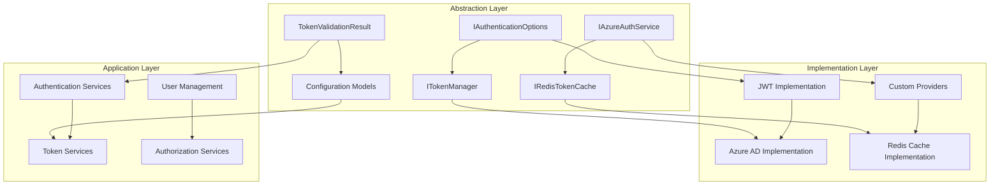

# Mamey.Auth.Abstractions

The Mamey.Auth.Abstractions library provides the core abstractions and interfaces for the Mamey authentication framework. It defines the contracts and data structures that enable a unified authentication experience across different authentication providers and implementations.

## Technical Overview

Mamey.Auth.Abstractions serves as the foundation for the Mamey authentication system by providing:

- **Core Interfaces**: Essential interfaces for authentication and token management
- **Data Models**: Common data structures for authentication operations
- **Provider Abstractions**: Abstract interfaces for different authentication providers
- **Configuration Contracts**: Standardized configuration interfaces
- **Validation Results**: Common validation result structures
- **Azure Integration**: Microsoft Graph integration for Azure AD operations
- **Extensibility**: Pluggable architecture for custom authentication providers

## Architecture

The library provides a clean abstraction layer that enables different authentication implementations:



## Core Components

### Authentication Abstractions
- **IAuthenticationOptions**: Marker interface for all authentication configuration classes
- **ITokenManager**: Interface for token generation, validation, and revocation
- **IAzureAuthService**: Comprehensive Azure AD authentication and user management
- **IRedisTokenCache**: Interface for Redis-based token caching

### Data Models
- **TokenValidationResult**: Standardized result structure for token validation operations
- **Configuration Models**: Common configuration structures for different providers

### Azure Integration
- **Microsoft Graph Integration**: Full integration with Microsoft Graph API
- **User Management**: Complete user lifecycle management in Azure AD
- **Group Management**: Azure AD group membership management
- **Policy Management**: Azure AD B2C policy management

## Installation

### NuGet Package
```bash
dotnet add package Mamey.Auth.Abstractions
```

### Prerequisites
- .NET 9.0 or later
- Microsoft.Graph (included)

## Key Features

### Core Abstraction Features

- **Unified Interfaces**: Common interfaces for all authentication providers
- **Provider Agnostic**: Works with any authentication provider implementation
- **Configuration Standardization**: Standardized configuration across providers
- **Type Safety**: Strongly typed interfaces and data structures
- **Extensibility**: Easy to extend with custom authentication providers
- **Dependency Injection**: Full dependency injection support
- **Async/Await**: Modern async programming patterns
- **Error Handling**: Comprehensive error handling and validation

### Azure AD Integration Features

- **Microsoft Graph API**: Full integration with Microsoft Graph
- **User Management**: Complete user lifecycle management
- **Group Management**: Azure AD group operations
- **Policy Management**: B2C policy configuration
- **Token Management**: Azure AD token operations
- **Multi-Tenant Support**: Built-in multi-tenant support
- **B2C Support**: Azure AD B2C integration
- **B2B Support**: Azure AD B2B integration

### Token Management Features

- **Token Generation**: Secure token generation
- **Token Validation**: Comprehensive token validation
- **Token Revocation**: Secure token revocation
- **Token Caching**: Redis-based token caching
- **Refresh Tokens**: Automatic token refresh
- **Token Security**: Built-in security features

## Quick Start

### Basic Setup

```csharp
using Mamey.Auth.Abstractions;

// Register services
builder.Services.AddScoped<ITokenManager, JwtTokenManager>();
builder.Services.AddScoped<IAzureAuthService, AzureAuthService>();
builder.Services.AddScoped<IRedisTokenCache, RedisTokenCache>();
```

### Configuration

```csharp
// Configure authentication options
builder.Services.Configure<AuthenticationOptions>(options =>
{
    options.Jwt.Secret = "your-secret-key";
    options.Azure.TenantId = "your-tenant-id";
    options.Azure.ClientId = "your-client-id";
});
```

### Basic Usage

```csharp
using Mamey.Auth.Abstractions;

public class AuthService
{
    private readonly ITokenManager _tokenManager;
    private readonly IAzureAuthService _azureAuthService;
    private readonly IRedisTokenCache _tokenCache;

    public AuthService(
        ITokenManager tokenManager,
        IAzureAuthService azureAuthService,
        IRedisTokenCache tokenCache)
    {
        _tokenManager = tokenManager;
        _azureAuthService = azureAuthService;
        _tokenCache = tokenCache;
    }

    public async Task<string> AuthenticateUserAsync(string username, string password)
    {
        // Validate user credentials
        var claims = new Dictionary<string, string>
        {
            ["sub"] = username,
            ["email"] = "user@example.com",
            ["role"] = "User"
        };

        // Generate token
        var token = await _tokenManager.GenerateTokenAsync(claims);
        
        // Cache token
        await _tokenCache.SetCachedTokenAsync($"user:{username}", token);
        
        return token;
    }

    public async Task<bool> ValidateTokenAsync(string token)
    {
        // Check cache first
        var cachedToken = await _tokenCache.GetCachedTokenAsync($"token:{token}");
        if (!string.IsNullOrEmpty(cachedToken))
        {
            return true;
        }

        // Validate token
        var isValid = await _tokenManager.ValidateTokenAsync(token);
        if (isValid)
        {
            // Cache valid token
            await _tokenCache.SetCachedTokenAsync($"token:{token}", token);
        }

        return isValid;
    }
}
```

## API Reference

### Core Interfaces

#### IAuthenticationOptions

Marker interface for all authentication configuration classes.

```csharp
public interface IAuthenticationOptions
{
}
```

**Purpose**: Provides a common base for all authentication configuration classes, enabling type-safe configuration management.

#### ITokenManager

Interface for managing tokens (JWT, Azure, etc.).

```csharp
public interface ITokenManager
{
    Task<string> GenerateTokenAsync(IEnumerable<KeyValuePair<string, string>> claims);
    Task<bool> ValidateTokenAsync(string token);
    Task<bool> RevokeTokenAsync(string token);
}
```

**Methods:**
- `GenerateTokenAsync(IEnumerable<KeyValuePair<string, string>> claims)`: Generates a token with the provided claims
- `ValidateTokenAsync(string token)`: Validates a token and returns whether it is valid
- `RevokeTokenAsync(string token)`: Revokes a token (if supported)

#### IAzureAuthService

Interface for Azure AD (B2C/B2B) authentication and user management services.

```csharp
public interface IAzureAuthService
{
    Task<string> AcquireTokenAsync(string[] scopes);
    Task<bool> VerifyUserActionAsync(string userId, string token);
    Task<bool> ValidateIdTokenAsync(string idToken);
    Task<string> RefreshAccessTokenAsync(string refreshToken);
    Task<bool> DeleteUserAsync(string userId);
    Task<User?> UpdateUserAsync(string userId, User updatedUser);
    Task<bool> DisableUserAsync(string userId);
    Task<bool> EnableUserAsync(string userId);
    Task<Dictionary<string, string>> GetUserClaimsAsync(string userId);
    Task<bool> SetUserClaimsAsync(string userId, Dictionary<string, string> claims);
    Task<bool> AddUserToGroupAsync(string userId, string groupId);
    Task<bool> RemoveUserFromGroupAsync(string userId, string groupId);
    Task<bool> LogoutUserAsync(string userId);
    Task<List<string>> ListGroupsForUserAsync(string userId);
    Task<UserCollectionResponse> SearchUsersAsync(string query);
    Task<bool> ForcePasswordChangeAsync(string userId);
    Task<bool> LockUserAccountAsync(string userId);
    Task<bool> InviteUserAsync(string email, string displayName);
    Task<string> GenerateSignInUrlAsync(string redirectUrl, string state, string nonce);
    Task<bool> ValidateConfigurationAsync();
}
```

**Methods:**
- `AcquireTokenAsync(string[] scopes)`: Acquires an access token for the specified scopes
- `VerifyUserActionAsync(string userId, string token)`: Verifies if a user action is valid
- `ValidateIdTokenAsync(string idToken)`: Validates an ID token
- `RefreshAccessTokenAsync(string refreshToken)`: Refreshes an access token
- `DeleteUserAsync(string userId)`: Deletes a user from Azure AD
- `UpdateUserAsync(string userId, User updatedUser)`: Updates user information
- `DisableUserAsync(string userId)`: Disables a user account
- `EnableUserAsync(string userId)`: Enables a user account
- `GetUserClaimsAsync(string userId)`: Gets user claims
- `SetUserClaimsAsync(string userId, Dictionary<string, string> claims)`: Sets user claims
- `AddUserToGroupAsync(string userId, string groupId)`: Adds user to a group
- `RemoveUserFromGroupAsync(string userId, string groupId)`: Removes user from a group
- `LogoutUserAsync(string userId)`: Logs out a user
- `ListGroupsForUserAsync(string userId)`: Lists groups for a user
- `SearchUsersAsync(string query)`: Searches for users
- `ForcePasswordChangeAsync(string userId)`: Forces password change
- `LockUserAccountAsync(string userId)`: Locks user account
- `InviteUserAsync(string email, string displayName)`: Invites a new user
- `GenerateSignInUrlAsync(string redirectUrl, string state, string nonce)`: Generates sign-in URL
- `ValidateConfigurationAsync()`: Validates Azure AD configuration

#### IRedisTokenCache

Interface for Redis-based token caching.

```csharp
public interface IRedisTokenCache
{
    Task<string> GetCachedTokenAsync(string key);
    Task SetCachedTokenAsync(string key, string token);
}
```

**Methods:**
- `GetCachedTokenAsync(string key)`: Gets a cached token by key
- `SetCachedTokenAsync(string key, string token)`: Caches a token with a key

### Core Classes

#### TokenValidationResult

Represents the result of a token validation operation.

```csharp
public class TokenValidationResult
{
    public bool IsValid { get; set; }
    public string? UserId { get; set; }
    public IEnumerable<KeyValuePair<string, string>> Claims { get; set; }
}
```

**Properties:**
- `IsValid`: Whether the token is valid
- `UserId`: User ID extracted from the token
- `Claims`: Claims extracted from the token

## Usage Examples

### Example 1: Custom Token Manager Implementation

```csharp
using Mamey.Auth.Abstractions;

public class CustomTokenManager : ITokenManager
{
    private readonly ILogger<CustomTokenManager> _logger;
    private readonly IConfiguration _configuration;

    public CustomTokenManager(ILogger<CustomTokenManager> logger, IConfiguration configuration)
    {
        _logger = logger;
        _configuration = configuration;
    }

    public async Task<string> GenerateTokenAsync(IEnumerable<KeyValuePair<string, string>> claims)
    {
        try
        {
            _logger.LogInformation("Generating token with {ClaimCount} claims", claims.Count());

            // Implement custom token generation logic
            var token = await GenerateJwtTokenAsync(claims);
            
            _logger.LogInformation("Token generated successfully");
            return token;
        }
        catch (Exception ex)
        {
            _logger.LogError(ex, "Failed to generate token");
            throw;
        }
    }

    public async Task<bool> ValidateTokenAsync(string token)
    {
        try
        {
            _logger.LogInformation("Validating token");

            // Implement custom token validation logic
            var isValid = await ValidateJwtTokenAsync(token);
            
            _logger.LogInformation("Token validation result: {IsValid}", isValid);
            return isValid;
        }
        catch (Exception ex)
        {
            _logger.LogError(ex, "Failed to validate token");
            return false;
        }
    }

    public async Task<bool> RevokeTokenAsync(string token)
    {
        try
        {
            _logger.LogInformation("Revoking token");

            // Implement custom token revocation logic
            var isRevoked = await RevokeJwtTokenAsync(token);
            
            _logger.LogInformation("Token revocation result: {IsRevoked}", isRevoked);
            return isRevoked;
        }
        catch (Exception ex)
        {
            _logger.LogError(ex, "Failed to revoke token");
            return false;
        }
    }

    private async Task<string> GenerateJwtTokenAsync(IEnumerable<KeyValuePair<string, string>> claims)
    {
        // Implement JWT token generation
        await Task.Delay(1); // Simulate async operation
        return "generated-jwt-token";
    }

    private async Task<bool> ValidateJwtTokenAsync(string token)
    {
        // Implement JWT token validation
        await Task.Delay(1); // Simulate async operation
        return !string.IsNullOrEmpty(token);
    }

    private async Task<bool> RevokeJwtTokenAsync(string token)
    {
        // Implement JWT token revocation
        await Task.Delay(1); // Simulate async operation
        return true;
    }
}
```

### Example 2: Azure AD Service Implementation

```csharp
using Mamey.Auth.Abstractions;
using Microsoft.Graph.Models;

public class AzureAuthService : IAzureAuthService
{
    private readonly ILogger<AzureAuthService> _logger;
    private readonly IConfiguration _configuration;

    public AzureAuthService(ILogger<AzureAuthService> logger, IConfiguration configuration)
    {
        _logger = logger;
        _configuration = configuration;
    }

    public async Task<string> AcquireTokenAsync(string[] scopes)
    {
        try
        {
            _logger.LogInformation("Acquiring token for scopes: {Scopes}", string.Join(", ", scopes));

            // Implement Azure AD token acquisition
            var token = await AcquireAzureTokenAsync(scopes);
            
            _logger.LogInformation("Token acquired successfully");
            return token;
        }
        catch (Exception ex)
        {
            _logger.LogError(ex, "Failed to acquire token");
            throw;
        }
    }

    public async Task<bool> VerifyUserActionAsync(string userId, string token)
    {
        try
        {
            _logger.LogInformation("Verifying user action for user: {UserId}", userId);

            // Implement user action verification
            var isValid = await VerifyUserActionInternalAsync(userId, token);
            
            _logger.LogInformation("User action verification result: {IsValid}", isValid);
            return isValid;
        }
        catch (Exception ex)
        {
            _logger.LogError(ex, "Failed to verify user action");
            return false;
        }
    }

    public async Task<bool> ValidateIdTokenAsync(string idToken)
    {
        try
        {
            _logger.LogInformation("Validating ID token");

            // Implement ID token validation
            var isValid = await ValidateIdTokenInternalAsync(idToken);
            
            _logger.LogInformation("ID token validation result: {IsValid}", isValid);
            return isValid;
        }
        catch (Exception ex)
        {
            _logger.LogError(ex, "Failed to validate ID token");
            return false;
        }
    }

    public async Task<string> RefreshAccessTokenAsync(string refreshToken)
    {
        try
        {
            _logger.LogInformation("Refreshing access token");

            // Implement token refresh
            var newToken = await RefreshTokenInternalAsync(refreshToken);
            
            _logger.LogInformation("Access token refreshed successfully");
            return newToken;
        }
        catch (Exception ex)
        {
            _logger.LogError(ex, "Failed to refresh access token");
            throw;
        }
    }

    public async Task<bool> DeleteUserAsync(string userId)
    {
        try
        {
            _logger.LogInformation("Deleting user: {UserId}", userId);

            // Implement user deletion
            var isDeleted = await DeleteUserInternalAsync(userId);
            
            _logger.LogInformation("User deletion result: {IsDeleted}", isDeleted);
            return isDeleted;
        }
        catch (Exception ex)
        {
            _logger.LogError(ex, "Failed to delete user");
            return false;
        }
    }

    public async Task<User?> UpdateUserAsync(string userId, User updatedUser)
    {
        try
        {
            _logger.LogInformation("Updating user: {UserId}", userId);

            // Implement user update
            var updated = await UpdateUserInternalAsync(userId, updatedUser);
            
            _logger.LogInformation("User updated successfully");
            return updated;
        }
        catch (Exception ex)
        {
            _logger.LogError(ex, "Failed to update user");
            return null;
        }
    }

    // Implement other methods...
    public async Task<bool> DisableUserAsync(string userId) => await Task.FromResult(true);
    public async Task<bool> EnableUserAsync(string userId) => await Task.FromResult(true);
    public async Task<Dictionary<string, string>> GetUserClaimsAsync(string userId) => await Task.FromResult(new Dictionary<string, string>());
    public async Task<bool> SetUserClaimsAsync(string userId, Dictionary<string, string> claims) => await Task.FromResult(true);
    public async Task<bool> AddUserToGroupAsync(string userId, string groupId) => await Task.FromResult(true);
    public async Task<bool> RemoveUserFromGroupAsync(string userId, string groupId) => await Task.FromResult(true);
    public async Task<bool> LogoutUserAsync(string userId) => await Task.FromResult(true);
    public async Task<List<string>> ListGroupsForUserAsync(string userId) => await Task.FromResult(new List<string>());
    public async Task<UserCollectionResponse> SearchUsersAsync(string query) => await Task.FromResult(new UserCollectionResponse());
    public async Task<bool> ForcePasswordChangeAsync(string userId) => await Task.FromResult(true);
    public async Task<bool> LockUserAccountAsync(string userId) => await Task.FromResult(true);
    public async Task<bool> InviteUserAsync(string email, string displayName) => await Task.FromResult(true);
    public async Task<string> GenerateSignInUrlAsync(string redirectUrl, string state, string nonce) => await Task.FromResult("signin-url");
    public async Task<bool> ValidateConfigurationAsync() => await Task.FromResult(true);

    private async Task<string> AcquireAzureTokenAsync(string[] scopes)
    {
        // Implement Azure AD token acquisition
        await Task.Delay(1);
        return "azure-token";
    }

    private async Task<bool> VerifyUserActionInternalAsync(string userId, string token)
    {
        // Implement user action verification
        await Task.Delay(1);
        return true;
    }

    private async Task<bool> ValidateIdTokenInternalAsync(string idToken)
    {
        // Implement ID token validation
        await Task.Delay(1);
        return true;
    }

    private async Task<string> RefreshTokenInternalAsync(string refreshToken)
    {
        // Implement token refresh
        await Task.Delay(1);
        return "refreshed-token";
    }

    private async Task<bool> DeleteUserInternalAsync(string userId)
    {
        // Implement user deletion
        await Task.Delay(1);
        return true;
    }

    private async Task<User?> UpdateUserInternalAsync(string userId, User updatedUser)
    {
        // Implement user update
        await Task.Delay(1);
        return updatedUser;
    }
}
```

### Example 3: Redis Token Cache Implementation

```csharp
using Mamey.Auth.Abstractions;
using StackExchange.Redis;

public class RedisTokenCache : IRedisTokenCache
{
    private readonly IDatabase _database;
    private readonly ILogger<RedisTokenCache> _logger;

    public RedisTokenCache(IConnectionMultiplexer redis, ILogger<RedisTokenCache> logger)
    {
        _database = redis.GetDatabase();
        _logger = logger;
    }

    public async Task<string> GetCachedTokenAsync(string key)
    {
        try
        {
            _logger.LogDebug("Getting cached token for key: {Key}", key);

            var token = await _database.StringGetAsync(key);
            
            if (token.HasValue)
            {
                _logger.LogDebug("Token found in cache for key: {Key}", key);
                return token;
            }

            _logger.LogDebug("No token found in cache for key: {Key}", key);
            return string.Empty;
        }
        catch (Exception ex)
        {
            _logger.LogError(ex, "Failed to get cached token for key: {Key}", key);
            return string.Empty;
        }
    }

    public async Task SetCachedTokenAsync(string key, string token)
    {
        try
        {
            _logger.LogDebug("Setting cached token for key: {Key}", key);

            await _database.StringSetAsync(key, token, TimeSpan.FromHours(1));
            
            _logger.LogDebug("Token cached successfully for key: {Key}", key);
        }
        catch (Exception ex)
        {
            _logger.LogError(ex, "Failed to cache token for key: {Key}", key);
        }
    }
}
```

### Example 4: Token Validation Service

```csharp
using Mamey.Auth.Abstractions;

public class TokenValidationService
{
    private readonly ITokenManager _tokenManager;
    private readonly IRedisTokenCache _tokenCache;
    private readonly ILogger<TokenValidationService> _logger;

    public TokenValidationService(
        ITokenManager tokenManager,
        IRedisTokenCache tokenCache,
        ILogger<TokenValidationService> logger)
    {
        _tokenManager = tokenManager;
        _tokenCache = tokenCache;
        _logger = logger;
    }

    public async Task<TokenValidationResult> ValidateTokenAsync(string token)
    {
        try
        {
            _logger.LogInformation("Validating token");

            // Check cache first
            var cachedToken = await _tokenCache.GetCachedTokenAsync($"token:{token}");
            if (!string.IsNullOrEmpty(cachedToken))
            {
                _logger.LogInformation("Token found in cache, validation successful");
                return new TokenValidationResult
                {
                    IsValid = true,
                    UserId = ExtractUserIdFromToken(token),
                    Claims = ExtractClaimsFromToken(token)
                };
            }

            // Validate token
            var isValid = await _tokenManager.ValidateTokenAsync(token);
            if (isValid)
            {
                // Cache valid token
                await _tokenCache.SetCachedTokenAsync($"token:{token}", token);
                
                _logger.LogInformation("Token validation successful");
                return new TokenValidationResult
                {
                    IsValid = true,
                    UserId = ExtractUserIdFromToken(token),
                    Claims = ExtractClaimsFromToken(token)
                };
            }

            _logger.LogWarning("Token validation failed");
            return new TokenValidationResult
            {
                IsValid = false
            };
        }
        catch (Exception ex)
        {
            _logger.LogError(ex, "Token validation error");
            return new TokenValidationResult
            {
                IsValid = false
            };
        }
    }

    private string ExtractUserIdFromToken(string token)
    {
        // Implement user ID extraction from token
        return "user-id";
    }

    private IEnumerable<KeyValuePair<string, string>> ExtractClaimsFromToken(string token)
    {
        // Implement claims extraction from token
        return new Dictionary<string, string>
        {
            ["sub"] = "user-id",
            ["email"] = "user@example.com",
            ["role"] = "User"
        };
    }
}
```

## Integration Patterns

### Integration with Dependency Injection

```csharp
// Program.cs
var builder = WebApplication.CreateBuilder(args);

// Register authentication abstractions
builder.Services.AddScoped<ITokenManager, JwtTokenManager>();
builder.Services.AddScoped<IAzureAuthService, AzureAuthService>();
builder.Services.AddScoped<IRedisTokenCache, RedisTokenCache>();

var app = builder.Build();
app.Run();
```

### Integration with Configuration

```csharp
builder.Services.Configure<AuthenticationOptions>(configuration.GetSection("Authentication"));
builder.Services.Configure<JwtOptions>(configuration.GetSection("Authentication:Jwt"));
builder.Services.Configure<AzureOptions>(configuration.GetSection("Authentication:Azure"));
```

### Integration with Custom Providers

```csharp
public class CustomAuthenticationProvider : IAuthenticationService
{
    private readonly ITokenManager _tokenManager;
    private readonly IAzureAuthService _azureAuthService;

    public CustomAuthenticationProvider(
        ITokenManager tokenManager,
        IAzureAuthService azureAuthService)
    {
        _tokenManager = tokenManager;
        _azureAuthService = azureAuthService;
    }

    // Implement IAuthenticationService methods using the abstractions
}
```

## Configuration Reference

### Service Registration

```csharp
// Register all authentication abstractions
builder.Services.AddScoped<ITokenManager, JwtTokenManager>();
builder.Services.AddScoped<IAzureAuthService, AzureAuthService>();
builder.Services.AddScoped<IRedisTokenCache, RedisTokenCache>();

// Register with specific implementations
builder.Services.AddScoped<ITokenManager, CustomTokenManager>();
builder.Services.AddScoped<IAzureAuthService, CustomAzureAuthService>();
```

### Configuration Options

```json
{
  "Authentication": {
    "Jwt": {
      "Secret": "your-secret-key",
      "ExpirationMinutes": 60,
      "Issuer": "Mamey.Auth",
      "Audience": "Mamey.Users"
    },
    "Azure": {
      "Instance": "https://login.microsoftonline.com/",
      "TenantId": "your-tenant-id",
      "ClientId": "your-client-id",
      "ClientSecret": "your-client-secret"
    }
  }
}
```

## Best Practices

1. **Interface Segregation**: Use specific interfaces for specific purposes
2. **Dependency Injection**: Register all services with dependency injection
3. **Async/Await**: Use async patterns consistently
4. **Error Handling**: Implement comprehensive error handling
5. **Logging**: Add detailed logging for debugging and monitoring
6. **Configuration**: Use strongly typed configuration classes
7. **Validation**: Implement proper input validation
8. **Caching**: Use caching for improved performance
9. **Security**: Implement proper security measures
10. **Testing**: Write comprehensive unit tests

## Troubleshooting

### Common Issues

**Interface Not Found**: Ensure all interfaces are properly registered
**Configuration Issues**: Check configuration binding and validation
**Azure AD Issues**: Verify Azure AD configuration and permissions
**Cache Issues**: Check Redis connectivity and configuration
**Token Issues**: Verify token generation and validation logic

### Debugging

Enable detailed logging to troubleshoot issues:

```csharp
builder.Logging.AddConsole();
builder.Logging.SetMinimumLevel(LogLevel.Debug);
```

## Related Libraries

- [Mamey.Auth](auth.md) - Main authentication library
- [Mamey.Auth.Jwt](auth-jwt.md) - JWT authentication implementation
- [Mamey.Auth.Azure](auth-azure.md) - Azure AD authentication
- [Mamey.Security](../infrastructure/security.md) - Security utilities

## Additional Resources

- Authentication Guide
- Azure AD Integration
- Token Management
- Custom Providers
