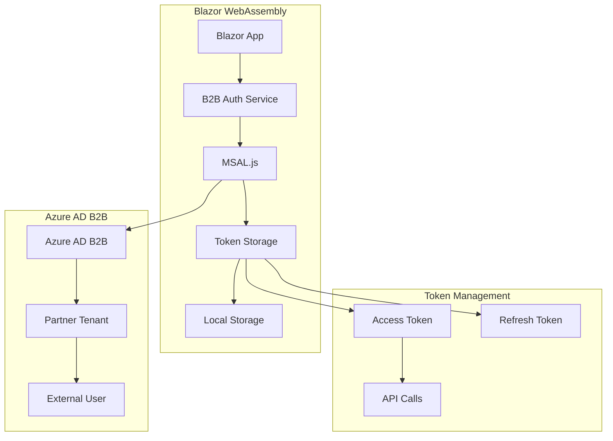
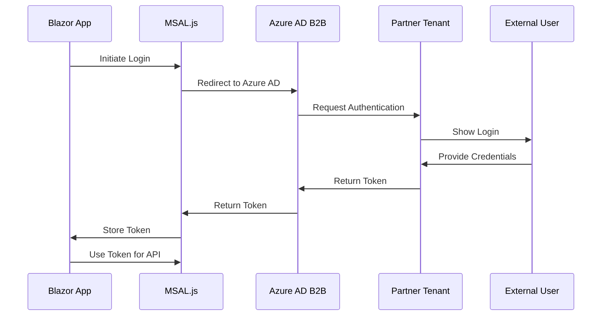

# Mamey.Auth.Azure.B2B.BlazorWasm

**Library**: `Mamey.Auth.Azure.B2B.BlazorWasm`  
**Location**: `Mamey/src/Mamey.Auth.Azure.B2B.BlazorWasm/`  
**Type**: Authentication Library - Azure AD B2B Blazor Client  
**Version**: 2.0.*  
**Files**: Multiple C# files  
**Namespace**: `Mamey.Auth.Azure.B2B.BlazorWasm`

## Overview

Mamey.Auth.Azure.B2B.BlazorWasm provides Azure Active Directory B2B (Business-to-Business) authentication integration specifically for Blazor WebAssembly applications within the Mamey framework. It enables secure authentication for external users from partner organizations in client-side Blazor applications.

### Conceptual Foundation

**Blazor WebAssembly Authentication** for Azure AD B2B enables client-side authentication flows. Key concepts:

1. **Client-Side Authentication**: Authentication flows executed in the browser
2. **MSAL.js Integration**: Microsoft Authentication Library for JavaScript
3. **Token Management**: Automatic token refresh and storage
4. **Silent Authentication**: Background token acquisition
5. **User Context**: Persistent user state across page refreshes

**Azure AD B2B Integration** for Blazor:
- **External User Authentication**: Partner organization user access
- **Multi-Tenant Support**: Cross-tenant authentication flows
- **Guest User Management**: External user lifecycle management
- **Consent Framework**: User consent for application access
- **Security Policies**: Conditional access and security policies

**Why Mamey.Auth.Azure.B2B.BlazorWasm?**

Provides:
- **Blazor WebAssembly Integration**: Seamless integration with Blazor WASM
- **Azure AD B2B Support**: Complete B2B authentication flow
- **MSAL Integration**: Microsoft Authentication Library for JavaScript
- **Token Management**: Automatic token refresh and management
- **User Context**: User information and claims management
- **Silent Authentication**: Background token refresh

**Use Cases:**
- Blazor WebAssembly applications
- External user access
- Cross-tenant scenarios
- Progressive Web Apps
- Single Page Applications

## Architecture

### Blazor B2B Authentication Flow



### Authentication Flow



## Installation

### Prerequisites

1. **.NET 9.0**: Ensure .NET 9.0 SDK is installed
2. **Blazor WebAssembly**: Blazor WASM project
3. **Azure AD B2B**: Azure AD tenant with B2B enabled

### NuGet Package

```bash
dotnet add package Mamey.Auth.Azure.B2B.BlazorWasm
```

### Dependencies

- **Mamey** - Core framework
- **Mamey.Auth.Azure.B2B** - Base B2B authentication
- **Mamey.BlazorWasm** - Blazor WebAssembly support
- **Microsoft.Authentication.WebAssembly.Msal** - MSAL for Blazor

## Quick Start

### Basic Setup

```csharp
using Mamey.Auth.Azure.B2B.BlazorWasm;

var builder = WebAssemblyHostBuilder.CreateDefault(args);

builder.Services
    .AddMamey()
    .AddB2BBlazorWasm(options =>
    {
        options.Authority = "https://login.microsoftonline.com/{tenant-id}";
        options.ClientId = "your-client-id";
        options.ValidateAuthority = true;
    });

var app = builder.Build();
await app.RunAsync();
```

### Configuration

Add to `appsettings.json`:

```json
{
  "AzureAd": {
    "B2B": {
      "Authority": "https://login.microsoftonline.com/{tenant-id}",
      "ClientId": "your-client-id",
      "ValidateAuthority": true
    }
  }
}
```

## Usage Examples

### Example 1: Login External User

```csharp
@using Mamey.Auth.Azure.B2B.BlazorWasm
@inject IB2BAuthenticationService B2BAuthService

<button @onclick="LoginAsync">Login</button>

@code {
    private async Task LoginAsync()
    {
        try
        {
            await B2BAuthService.LoginAsync();
        }
        catch (Exception ex)
        {
            // Handle error
        }
    }
}
```

### Example 2: Get Current User

```csharp
@inject IB2BAuthenticationService B2BAuthService

@if (B2BAuthService.IsAuthenticated)
{
    <p>Welcome, @B2BAuthService.User?.DisplayName</p>
    <p>Email: @B2BAuthService.User?.Email</p>
    <p>Organization: @B2BAuthService.User?.Organization</p>
}
```

### Example 3: Make Authenticated API Call

```csharp
@inject IB2BAuthenticationService B2BAuthService
@inject HttpClient HttpClient

@code {
    private async Task<string> GetDataAsync()
    {
        if (!B2BAuthService.IsAuthenticated)
        {
            await B2BAuthService.LoginAsync();
        }

        var token = await B2BAuthService.GetAccessTokenAsync();
        HttpClient.DefaultRequestHeaders.Authorization = 
            new System.Net.Http.Headers.AuthenticationHeaderValue("Bearer", token);

        return await HttpClient.GetStringAsync("/api/data");
    }
}
```

## Related Libraries

- **Mamey.Auth.Azure.B2B**: Base B2B authentication
- **Mamey.BlazorWasm**: Blazor WebAssembly support
- **Mamey.Http**: HTTP client integration

## Additional Resources

- [Azure AD B2B Blazor Integration](https://docs.microsoft.com/aspnet/core/blazor/security/webassembly/)
- [MSAL.js for Blazor](https://github.com/AzureAD/microsoft-authentication-library-for-js)
- [Mamey Framework Documentation](../)
- Mamey.Auth.Azure.B2B.BlazorWasm Memory Documentation

## Tags

#azure #b2b #blazor #webassembly #authentication #mamey

