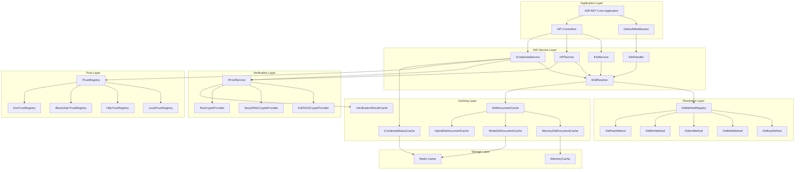
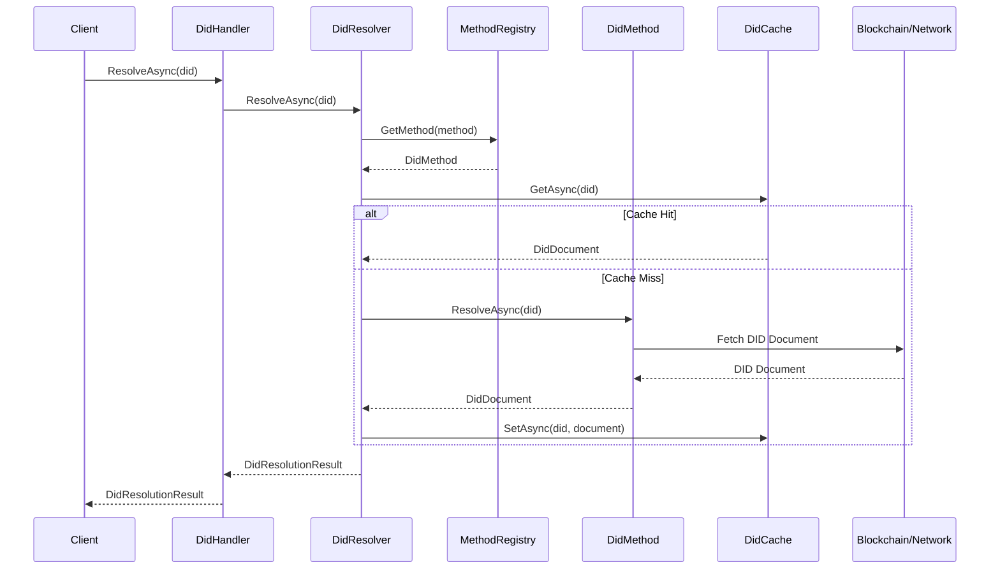
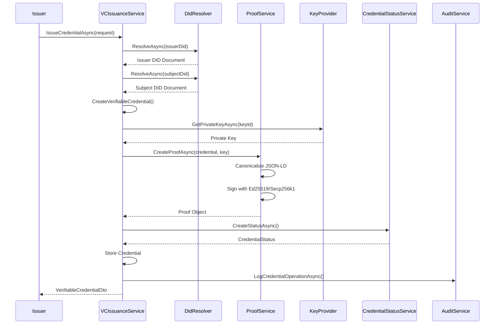
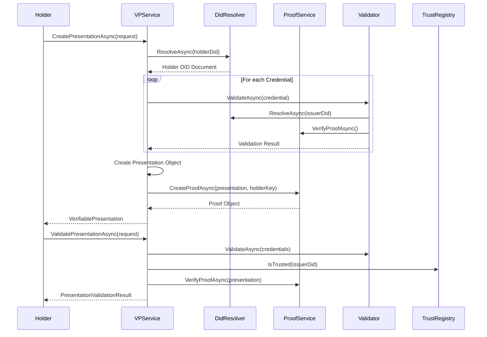
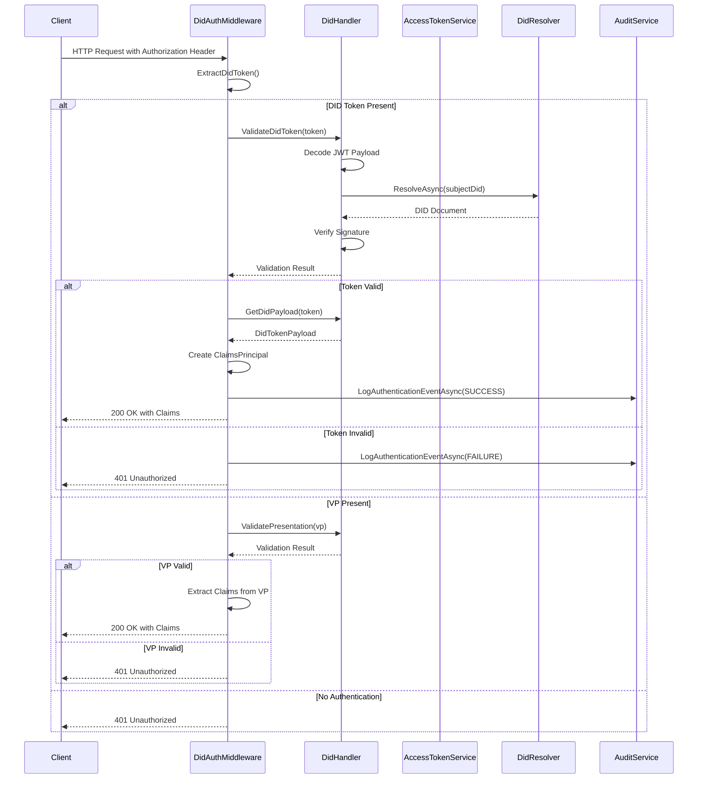
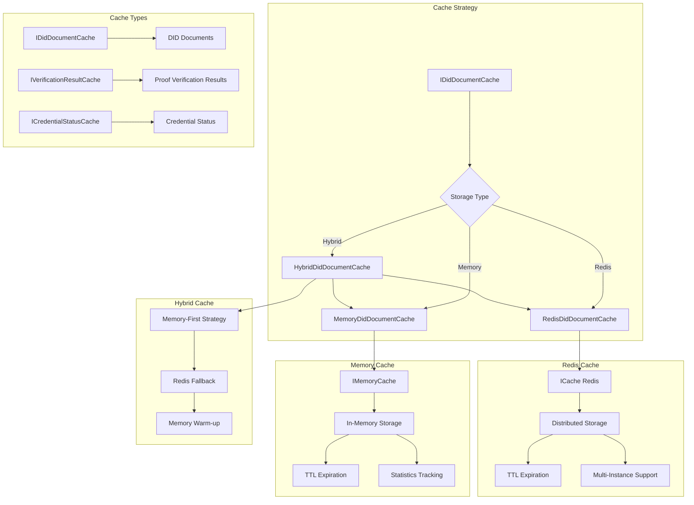

# Mamey.Auth.DecentralizedIdentifiers

A comprehensive .NET library implementing W3C Decentralized Identifiers (DIDs) and Verifiable Credentials (VCs) for the Mamey framework. This library provides full support for DID resolution, verification, credential issuance, presentation creation, and authentication across multiple DID methods.

## Table of Contents

- [Overview](#overview)
- [Key Features](#key-features)
- [Architecture](#architecture)
- [Installation](#installation)
- [Quick Start](#quick-start)
- [Core Concepts](#core-concepts)
- [Usage Scenarios](#usage-scenarios)
- [API Reference](#api-reference)
- [Configuration](#configuration)
- [Best Practices](#best-practices)
- [Troubleshooting](#troubleshooting)

## Overview

`Mamey.Auth.DecentralizedIdentifiers` is a production-ready library that implements:

- **W3C DID Core Specification** - Full support for Decentralized Identifiers
- **W3C Verifiable Credentials** - Complete VC data model and operations
- **Multiple DID Methods** - Support for `did:key`, `did:web`, `did:ion`, `did:ethr`, and `did:peer`
- **Linked Data Proofs** - Ed25519, ECDSA Secp256k1, RSA signature support
- **Credential Status Management** - Revocation and status checking
- **Presentation Creation** - Verifiable Presentations with selective disclosure
- **DID Authentication** - Token-based and VP-based authentication middleware
- **Trust Registries** - Multi-source trust verification
- **Caching** - High-performance DID document and credential caching

### Technical Overview

The library is built on .NET 9.0 and follows modern .NET design patterns:

- **Dependency Injection** - Full ASP.NET Core integration
- **Async/Await** - Fully asynchronous API design
- **Strong Typing** - Type-safe models for all W3C specifications
- **Extensibility** - Plugin architecture for custom DID methods
- **Performance** - Built-in caching and batch operations
- **Security** - Comprehensive audit logging and validation

## Key Features

### Core Features

- ✅ **Multi-Method DID Support**: Ethereum (`did:ethr`), ION, Web (`did:web`), Key (`did:key`), and Peer (`did:peer`)
- ✅ **Verifiable Credentials**: Full VC lifecycle (issuance, validation, verification, revocation)
- ✅ **Verifiable Presentations**: Create and validate VPs with selective disclosure and ZKP support
- ✅ **Cryptographic Security**: Ed25519, Secp256k1 (ECDSA), RSA, BBS+ signatures
- ✅ **DID Resolution**: Universal resolver with method registry and caching
- ✅ **JSON-LD Processing**: Canonicalization, context expansion, and validation
- ✅ **Proof Validation**: Linked Data Proof verification with multiple algorithms

### Advanced Features

- ✅ **FIDO2 Integration**: WebAuthn and FIDO2 authentication support
- ✅ **MetaMask Support**: Ethereum wallet integration
- ✅ **Azure Key Vault**: HSM key management integration
- ✅ **Credential Status**: StatusList2021 revocation support
- ✅ **Zero-Knowledge Proofs**: BBS+ signature support for selective disclosure
- ✅ **Batch Operations**: Efficient batch issuance, verification, and revocation
- ✅ **Audit Logging**: Comprehensive audit trail for all operations
- ✅ **Multi-Level Caching**: Memory + Redis hybrid caching
- ✅ **Custom DID Methods**: Extensible method registration system

## Architecture

### System Architecture



### DID Resolution Flow



### Verifiable Credential Issuance Flow



### Verifiable Presentation Creation and Validation



### DID Authentication Flow



### Caching Architecture



## Installation

### Package Manager

```bash
Install-Package Mamey.Auth.DecentralizedIdentifiers
```

### .NET CLI

```bash
dotnet add package Mamey.Auth.DecentralizedIdentifiers
```

### PackageReference

```xml
<PackageReference Include="Mamey.Auth.DecentralizedIdentifiers" Version="2.0.*" />
```

### Dependencies

The library requires:
- .NET 9.0 or later
- `Mamey.Http`
- `Mamey.Persistence.Redis` (optional, for Redis caching)
- `Mamey.Security`
- `Mamey` (core framework)

## Quick Start

### Basic Setup

```csharp
using Mamey.Auth.DecentralizedIdentifiers;

public class Program
{
    public static void Main(string[] args)
    {
        var builder = WebApplication.CreateBuilder(args);
        
        // Add Mamey framework
        builder.Services
            .AddMamey()
            // Add DID services
            .AddDecentralizedIdentifiers()
            // Register all DID resolvers
            .AddAllDidResolvers()
            // Add JSON-LD processing
            .AddJsonLd()
            // Add proof validation
            .AddProofValidation()
            // Add trust registry
            .AddTrustRegistry()
            // Add DID authentication
            .AddDidAuth();
            
        var app = builder.Build();
        
        // Use DID authentication middleware
        app.UseDid();
        app.Run();
    }
}
```

### Create and Resolve a DID

```csharp
public class DidService
{
    private readonly IDidService _didService;
    private readonly IDidResolver _didResolver;
    
    public DidService(IDidService didService, IDidResolver didResolver)
    {
        _didService = didService;
        _didResolver = didResolver;
    }
    
    public async Task<string> CreateDidAsync(string method = "key")
    {
        var did = await _didService.CreateDidAsync(method);
        return did.ToString();
    }
    
    public async Task<DidDocument> ResolveDidAsync(string did)
    {
        var result = await _didResolver.ResolveAsync(did);
        return (DidDocument)result.DidDocument;
    }
}
```

## Core Concepts

### Decentralized Identifiers (DIDs)

A DID is a unique identifier that enables verifiable, decentralized digital identity. The library supports multiple DID methods:

#### did:key
Simple, self-contained DIDs based on cryptographic keys. Best for:
- Quick testing and prototyping
- Short-lived identities
- Offline scenarios

```csharp
var keyMethod = serviceProvider.GetRequiredService<DidKeyMethod>();
var (did, document, keyPair) = await keyMethod.CreateWithGeneratedKeysAsync("Ed25519");
// Result: did:key:z6MkhaXgBZDvotDkL5257faiztiGiC2QtKLGpbnnEGta2doK
```

#### did:web
DIDs anchored to web domains. Best for:
- Organizational identities
- Domain-owned identities
- Easy discovery

```csharp
var webMethod = serviceProvider.GetRequiredService<DidWebMethod>();
var document = await webMethod.CreateAsync(new WebMethodOptions 
{ 
    Domain = "example.com" 
});
// Result: did:web:example.com
```

#### did:ion
Microsoft ION network DIDs. Best for:
- Production-grade identities
- Bitcoin-anchored security
- Long-term identity persistence

#### did:ethr
Ethereum-based DIDs. Best for:
- Blockchain-native applications
- Smart contract integration
- DeFi applications

#### did:peer
Peer-to-peer DIDs. Best for:
- Direct communication
- Offline scenarios
- Temporary identities

### Verifiable Credentials (VCs)

VCs are tamper-evident credentials that can be verified cryptographically. They contain:

- **Credential Subject**: The entity the credential is about
- **Issuer**: The entity that issued the credential
- **Issuance Date**: When the credential was issued
- **Expiration Date**: When the credential expires (optional)
- **Proof**: Cryptographic proof of authenticity
- **Credential Status**: Revocation information (optional)

### Verifiable Presentations (VPs)

VPs are used to present one or more VCs to a verifier. They enable:

- **Selective Disclosure**: Only reveal necessary claims
- **Zero-Knowledge Proofs**: Prove claims without revealing them
- **Challenge-Response**: Anti-replay protection
- **Domain Binding**: Bind presentation to specific domain

### Linked Data Proofs

The library supports multiple proof types:

- **Ed25519Signature2020**: Fast, efficient signatures
- **EcdsaSecp256k1Signature2019**: Ethereum-compatible signatures
- **RsaSignature2018**: Traditional RSA signatures
- **BbsBlsSignature2020**: Zero-knowledge proof signatures

## Usage Scenarios

### Scenario 1: Issuing a Verifiable Credential

```csharp
public class CredentialIssuanceService
{
    private readonly ICredentialService _credentialService;
    
    public CredentialIssuanceService(ICredentialService credentialService)
    {
        _credentialService = credentialService;
    }
    
    public async Task<VerifiableCredentialDto> IssueCitizenshipCredentialAsync(
        string issuerDid,
        string subjectDid,
        string nationality,
        DateTime dateOfBirth)
    {
        var request = new CredentialIssueRequest
        {
            IssuerDid = issuerDid,
            SubjectDid = subjectDid,
            CredentialType = "CitizenshipCredential",
            ProofType = ProofType.Ed25519Signature2020,
            Claims = new Dictionary<string, object>
            {
                ["nationality"] = nationality,
                ["dateOfBirth"] = dateOfBirth.ToString("yyyy-MM-dd"),
                ["credentialName"] = "Citizenship Credential"
            },
            ExpirationDate = DateTime.UtcNow.AddYears(10),
            SchemaRef = "https://example.com/schemas/citizenship.json"
        };
        
        return await _credentialService.IssueCredentialAsync(request);
    }
}
```

### Scenario 2: Creating a Verifiable Presentation

```csharp
public class PresentationService
{
    private readonly IVPService _vpService;
    
    public PresentationService(IVPService vpService)
    {
        _vpService = vpService;
    }
    
    public async Task<VerifiablePresentation> CreateSelectiveDisclosurePresentationAsync(
        string holderDid,
        List<VerifiableCredential> credentials,
        List<string> fieldsToDisclose)
    {
        var request = new SelectiveDisclosureRequest
        {
            HolderDid = holderDid,
            Credentials = credentials,
            FieldsToDisclose = credentials.ToDictionary(
                c => c.Id,
                c => fieldsToDisclose
            ),
            UseZeroKnowledgeProofs = true,
            Challenge = Guid.NewGuid().ToString(),
            Domain = "example.com"
        };
        
        return await _vpService.CreateSelectiveDisclosurePresentationAsync(request);
    }
}
```

### Scenario 3: DID-Based Authentication

```csharp
[ApiController]
[Route("api/[controller]")]
[Authorize(Policy = "RequireDID")]
public class SecureController : ControllerBase
{
    private readonly IDidHandler _didHandler;
    
    public SecureController(IDidHandler didHandler)
    {
        _didHandler = didHandler;
    }
    
    [HttpGet("profile")]
    public async Task<IActionResult> GetProfile()
    {
        var did = User.FindFirst("sub")?.Value;
        if (string.IsNullOrEmpty(did))
            return Unauthorized();
            
        // Resolve DID document
        var result = await _didResolver.ResolveAsync(did);
        
        return Ok(new
        {
            Did = did,
            Document = result.DidDocument
        });
    }
    
    [HttpPost("authenticate")]
    public async Task<IActionResult> Authenticate([FromBody] AuthenticationRequest request)
    {
        // Create DID token
        var token = await _didHandler.CreateDidToken(request.Did, new Dictionary<string, string>
        {
            ["role"] = "user",
            ["permissions"] = "read,write"
        });
        
        return Ok(new { Token = token.AccessToken });
    }
}
```

### Scenario 4: Batch Credential Operations

```csharp
public class BatchCredentialService
{
    private readonly ICredentialService _credentialService;
    
    public BatchCredentialService(ICredentialService credentialService)
    {
        _credentialService = credentialService;
    }
    
    public async Task<BatchCredentialIssueResult> IssueBatchCredentialsAsync(
        string issuerDid,
        List<CredentialIssueRequest> requests)
    {
        var batchRequest = new BatchCredentialIssueRequest
        {
            Requests = requests,
            DefaultProofType = ProofType.Ed25519Signature2020,
            ContinueOnError = true
        };
        
        return await _credentialService.IssueCredentialsBatchAsync(batchRequest);
    }
    
    public async Task<BatchCredentialVerificationResult> VerifyBatchCredentialsAsync(
        List<VerifiableCredentialDto> credentials)
    {
        var batchRequest = new BatchCredentialVerifyRequest
        {
            Credentials = credentials,
            ContinueOnError = true
        };
        
        return await _credentialService.VerifyCredentialsBatchAsync(batchRequest);
    }
}
```

### Scenario 5: Credential Revocation

```csharp
public class RevocationService
{
    private readonly ICredentialService _credentialService;
    private readonly ICredentialStatusService _statusService;
    
    public RevocationService(
        ICredentialService credentialService,
        ICredentialStatusService statusService)
    {
        _credentialService = credentialService;
        _statusService = statusService;
    }
    
    public async Task RevokeCredentialAsync(string credentialId, string reason)
    {
        // Revoke the credential
        await _credentialService.RevokeCredentialAsync(credentialId);
        
        // Update status
        var status = await _statusService.GetCredentialStatusAsync(
            new CredentialStatus { Id = credentialId });
            
        status.Status = "Revoked";
        status.Reason = reason;
        
        await _statusService.UpdateCredentialStatusAsync(status);
    }
}
```

### Scenario 6: Trust Registry Integration

```csharp
public class TrustVerificationService
{
    private readonly ITrustRegistry _trustRegistry;
    
    public TrustVerificationService(ITrustRegistry trustRegistry)
    {
        _trustRegistry = trustRegistry;
    }
    
    public async Task<bool> VerifyIssuerTrustAsync(string issuerDid)
    {
        // Check if issuer is trusted
        var isTrusted = _trustRegistry.IsTrusted(issuerDid);
        
        // Get all trusted issuers
        var trustedIssuers = _trustRegistry.AllTrusted();
        
        return isTrusted;
    }
    
    public async Task RefreshTrustRegistryAsync()
    {
        // Refresh trust registry from all sources
        await _trustRegistry.RefreshAsync();
    }
}
```

## API Reference

### Core Interfaces

#### IDidResolver

```csharp
public interface IDidResolver
{
    Task<DidResolutionResult> ResolveAsync(string did, CancellationToken cancellationToken = default);
    bool SupportsMethod(string didMethod);
}
```

#### IDidHandler

```csharp
public interface IDidHandler
{
    Task<DidToken> CreateDidToken(string did, IDictionary<string, string> claims = null);
    Task<VerifiablePresentation> CreateVerifiablePresentation(
        string did,
        IEnumerable<VerifiableCredential> credentials,
        PresentationOptions options = null);
    Task<bool> ValidateDidToken(string token);
    Task<PresentationValidationResult> ValidatePresentation(VerifiablePresentation vp);
    Task<DidTokenPayload> GetDidPayload(string token);
}
```

#### ICredentialService

```csharp
public interface ICredentialService
{
    Task<VerifiableCredentialDto> IssueCredentialAsync(CredentialIssueRequest request);
    Task<BatchCredentialIssueResult> IssueCredentialsBatchAsync(BatchCredentialIssueRequest request);
    Task<CredentialVerificationResultDto> VerifyCredentialAsync(CredentialVerifyRequest request);
    Task RevokeCredentialAsync(string credentialId);
    Task<VerifiableCredentialDto> GetCredentialAsync(string credentialId);
}
```

#### IVPService

```csharp
public interface IVPService
{
    Task<VerifiablePresentation> CreatePresentationAsync(PresentationCreateRequest request);
    Task<VerifiablePresentation> CreateSelectiveDisclosurePresentationAsync(SelectiveDisclosureRequest request);
    Task<PresentationValidationResult> ValidatePresentationAsync(PresentationValidationRequest request);
    Task<VerifiablePresentation> CreateZkpPresentationAsync(ZkpPresentationRequest request);
}
```

#### IProofService

```csharp
public interface IProofService
{
    Task<object> CreateProofAsync(
        string jsonLd,
        string verificationMethodId,
        byte[] privateKey,
        string proofPurpose,
        string type,
        string created = null,
        CancellationToken cancellationToken = default);
    
    Task<bool> VerifyProofAsync(
        string jsonLd,
        object proof,
        byte[] publicKey,
        string type,
        string proofPurpose,
        CancellationToken cancellationToken = default);
}
```

### Extension Methods

#### AddDecentralizedIdentifiers

Registers all DID services and configuration.

```csharp
public static IMameyBuilder AddDecentralizedIdentifiers(
    this IMameyBuilder builder,
    string sectionName = "dids",
    string httpClientSectionName = "httpClient",
    Action<DecentralizedIdentifierOptions> configure = null)
```

#### AddAllDidResolvers

Registers all available DID method resolvers.

```csharp
public static IMameyBuilder AddAllDidResolvers(
    this IMameyBuilder builder,
    string decentralizedIdentifierOptionsSectionName = null)
```

#### AddDidAuth

Registers DID-based authentication middleware.

```csharp
public static IMameyBuilder AddDidAuth(this IMameyBuilder builder)
```

#### AddProofValidation

Registers proof validation services.

```csharp
public static IMameyBuilder AddProofValidation(this IMameyBuilder builder)
```

#### AddTrustRegistry

Registers trust registry services.

```csharp
public static IMameyBuilder AddTrustRegistry(
    this IMameyBuilder builder,
    Action<BlockchainTrustRegistryOptions> configure = null)
```

## Configuration

### Basic Configuration

```json
{
  "dids": {
    "enabled": true,
    "defaultDidMethod": "ion",
    "supportedProofTypes": [
      "Ed25519Signature2020",
      "EcdsaSecp256k1Signature2019"
    ],
    "resolver": {
      "enabled": true,
      "enabledMethods": ["ethr", "ion", "web", "key", "peer"],
      "methodEndpoints": {
        "ethr": "https://mainnet.infura.io/v3/YOUR_PROJECT_ID",
        "ion": "https://beta.discover.did.microsoft.com/1.0/identifiers/",
        "web": "https://did-web.web.app/.well-known/did.json"
      },
      "cacheTimeout": "00:05:00"
    },
    "crypto": {
      "defaultAlgorithm": "Ed25519",
      "enableHsm": false
    }
  }
}
```

### DID Authentication Configuration

```json
{
  "didAuth": {
    "issuer": "https://your-api.com",
    "audience": "https://your-api.com",
    "requireProof": true,
    "validatePresentation": true,
    "revocationCheckEnabled": true,
    "cacheOptions": {
      "enabled": true,
      "storageType": "Hybrid",
      "ttlMinutes": 60,
      "redisConnectionString": "localhost:6379"
    },
    "cookieOptions": {
      "name": "__did-access-token",
      "httpOnly": true,
      "secure": true,
      "sameSite": "Lax"
    },
    "allowAnonymousEndpoints": [
      "/health",
      "/api/public"
    ]
  }
}
```

### Advanced Configuration

```json
{
  "dids": {
    "enabled": true,
    "defaultDidMethod": "ion",
    "supportedProofTypes": [
      "Ed25519Signature2020",
      "EcdsaSecp256k1Signature2019",
      "RsaSignature2018",
      "BbsBlsSignature2020"
    ],
    "resolver": {
      "enabled": true,
      "enabledMethods": ["ethr", "ion", "web", "key", "peer"],
      "methodEndpoints": {
        "ethr": "https://mainnet.infura.io/v3/YOUR_PROJECT_ID",
        "ion": "https://beta.discover.did.microsoft.com/1.0/identifiers/",
        "web": "https://did-web.web.app/.well-known/did.json"
      },
      "cacheTimeout": "00:10:00"
    },
    "crypto": {
      "defaultAlgorithm": "Ed25519",
      "enableHsm": true,
      "providerSettings": {
        "keyVaultUrl": "https://your-keyvault.vault.azure.net/",
        "clientId": "your-client-id",
        "clientSecret": "your-client-secret",
        "tenantId": "your-tenant-id"
      }
    },
    "library": {
      "enableCaching": true,
      "maxCacheSize": 5000,
      "enableLogging": true
    }
  },
  "blockchainTrustRegistry": {
    "rpcUrl": "https://mainnet.infura.io/v3/YOUR_PROJECT_ID",
    "contractAddress": "0x1234567890123456789012345678901234567890"
  }
}
```

## Best Practices

### DID Management

1. **Choose Appropriate Methods**: Select DID methods based on your use case
   - Use `did:key` for testing and prototypes
   - Use `did:web` for organizational identities
   - Use `did:ion` for production-grade, long-term identities
   - Use `did:ethr` for blockchain-native applications

2. **Key Rotation**: Implement proper key rotation strategies
   ```csharp
   // Update DID document with new verification method
   await didMethod.UpdateAsync(did, new UpdateRequest
   {
       VerificationMethods = new[] { newVerificationMethod }
   });
   ```

3. **Backup Keys**: Ensure secure backup of private keys
   - Use HSM for production key management
   - Implement secure key escrow procedures
   - Never store private keys in plain text

4. **Method Updates**: Keep DID method implementations updated

### Verifiable Credentials

1. **Schema Validation**: Always validate credential schemas
   ```csharp
   var isValid = await _credentialService.ValidateSchemaAsync(
       schemaRef,
       claims
   );
   ```

2. **Expiration Management**: Implement proper expiration handling
   ```csharp
   // Check expiration before processing
   if (credential.ExpirationDate.HasValue && 
       credential.ExpirationDate.Value < DateTime.UtcNow)
   {
       throw new CredentialExpiredException();
   }
   ```

3. **Revocation Checking**: Check credential status regularly
   ```csharp
   var status = await _credentialStatusService.GetCredentialStatusAsync(
       credential.CredentialStatus
   );
   if (status.Status == "Revoked")
   {
       throw new CredentialRevokedException();
   }
   ```

4. **Privacy Protection**: Minimize data exposure
   - Use selective disclosure when possible
   - Implement zero-knowledge proofs for sensitive data
   - Avoid including unnecessary claims

### Security

1. **Key Security**: Use HSM for production key management
   ```csharp
   builder.Services.Configure<CryptoProviderOptions>(options =>
   {
       options.EnableHsm = true;
       options.ProviderSettings["keyVaultUrl"] = "https://your-keyvault.vault.azure.net/";
   });
   ```

2. **Proof Validation**: Always validate proofs
   ```csharp
   var isValid = await _proofService.VerifyProofAsync(
       credentialJson,
       proof,
       publicKey,
       proofType,
       proofPurpose
   );
   ```

3. **Trust Verification**: Check issuer trust status
   ```csharp
   var isTrusted = _trustRegistry.IsTrusted(issuerDid);
   if (!isTrusted)
   {
       throw new UntrustedIssuerException();
   }
   ```

4. **Secure Storage**: Encrypt sensitive data
   - Encrypt private keys at rest
   - Use secure channels for transmission
   - Implement proper access controls

### Performance

1. **Caching**: Enable DID resolution caching
   ```csharp
   builder.Services.Configure<DidLibraryOptions>(options =>
   {
       options.EnableCaching = true;
       options.MaxCacheSize = 1000;
   });
   ```

2. **Async Operations**: Use async/await consistently
   ```csharp
   public async Task<DidDocument> ResolveDidAsync(string did)
   {
       return await _didResolver.ResolveAsync(did);
   }
   ```

3. **Batch Operations**: Use batch APIs for multiple operations
   ```csharp
   var result = await _credentialService.IssueCredentialsBatchAsync(
       new BatchCredentialIssueRequest
       {
           Requests = credentialRequests
       }
   );
   ```

4. **Monitoring**: Monitor resolution and validation performance
   - Track cache hit rates
   - Monitor resolution latency
   - Log validation errors

## Troubleshooting

### Common Issues

#### 1. DID Resolution Failures

**Problem**: DIDs cannot be resolved.

**Solution**: Check method endpoints and network connectivity.

```csharp
// Verify method endpoints
var options = builder.GetOptions<DecentralizedIdentifierOptions>("dids");
foreach (var method in options.Resolver.EnabledMethods)
{
    if (!options.Resolver.MethodEndpoints.ContainsKey(method))
    {
        throw new ConfigurationException($"Missing endpoint for method: {method}");
    }
}
```

#### 2. Cryptographic Errors

**Problem**: Key operations fail.

**Solution**: Check key format and algorithm compatibility.

```csharp
// Validate key format
var key = await _keyProvider.GetKeyAsync(keyId);
if (key == null)
{
    throw new KeyNotFoundException($"Key not found: {keyId}");
}
```

#### 3. Trust Registry Issues

**Problem**: Trust verification fails.

**Solution**: Check trust registry configuration and connectivity.

```csharp
// Verify trust registry
var isTrusted = _trustRegistry.IsTrusted(issuer);
if (!isTrusted)
{
    _logger.LogWarning("Issuer not trusted: {Issuer}", issuer);
}
```

#### 4. JSON-LD Processing Errors

**Problem**: JSON-LD canonicalization fails.

**Solution**: Check document format and context.

```csharp
// Validate JSON-LD document
var processor = serviceProvider.GetRequiredService<IJsonLdProcessor>();
var canonicalized = await processor.CanonicalizeAsync(document);
```

#### 5. Cache Issues

**Problem**: Cache not working as expected.

**Solution**: Verify cache configuration and connection.

```csharp
// Check cache statistics
var stats = await _didCache.GetStatisticsAsync();
_logger.LogInformation("Cache Hit Rate: {HitRate}%", 
    stats.HitCount / (stats.HitCount + stats.MissCount) * 100);
```

### Debugging Tips

1. **Enable Logging**: Use detailed logging for troubleshooting
   ```csharp
   builder.Services.AddLogging(logging =>
   {
       logging.AddConsole();
       logging.SetMinimumLevel(LogLevel.Debug);
   });
   ```

2. **Check Network**: Verify network connectivity to DID endpoints

3. **Validate Format**: Ensure DID and VC formats are correct

4. **Monitor Performance**: Track resolution and validation times

5. **Review Audit Logs**: Check audit logs for failed operations

## License

This project is licensed under the MIT License - see the LICENSE file for details.

## Contributing

Please read Contributing Guide for details on our code of conduct and the process for submitting pull requests.

## Support

For support and questions, please open an issue in the [GitHub repository](https://github.com/mamey-io/mamey-auth-decentralized-identifiers/issues).
