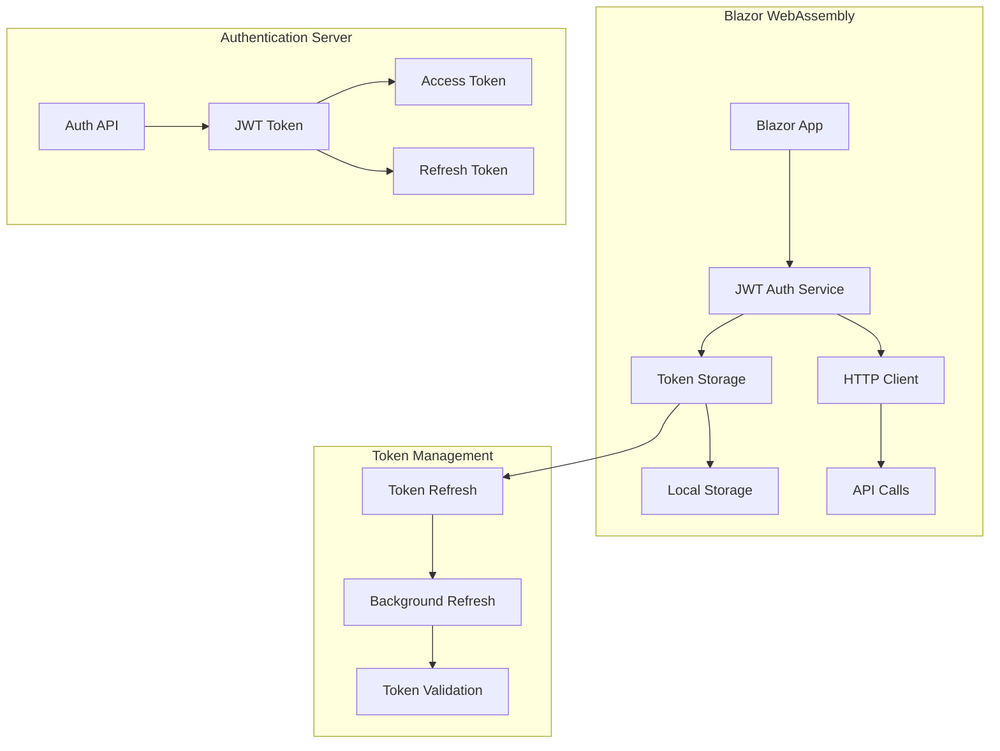
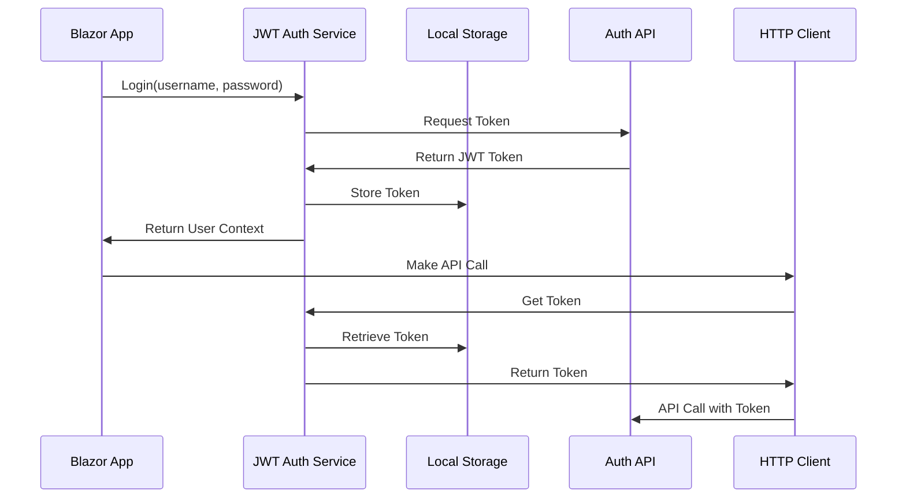

# Mamey.Auth.Jwt.BlazorWasm

**Library**: `Mamey.Auth.Jwt.BlazorWasm`  
**Location**: `Mamey/src/Mamey.Auth.Jwt.BlazorWasm/`  
**Type**: Authentication Library - JWT Blazor Client  
**Version**: 2.0.*  
**Files**: 15 C# files  
**Namespace**: `Mamey.Auth.Jwt.BlazorWasm`

## Overview

Mamey.Auth.Jwt.BlazorWasm provides JWT (JSON Web Token) authentication integration specifically for Blazor WebAssembly applications within the Mamey framework. It enables secure token-based authentication for client-side Blazor applications with automatic token management and refresh capabilities.

### Conceptual Foundation

**JWT Authentication in Blazor WebAssembly** enables client-side token-based authentication. Key concepts:

1. **Client-Side Authentication**: Authentication flows executed in the browser
2. **Token-Based Security**: Stateless authentication using JWT tokens
3. **Automatic Token Management**: Token storage, refresh, and validation
4. **HTTP Integration**: Seamless integration with HTTP clients
5. **User Context**: Persistent user state across page refreshes

**Blazor WebAssembly Security** considerations:
- **Browser Security**: Client-side security considerations
- **Token Storage**: Secure token storage in browser
- **CORS Handling**: Cross-origin request security
- **Silent Refresh**: Background token renewal
- **Error Handling**: Comprehensive error handling for authentication flows

**Why Mamey.Auth.Jwt.BlazorWasm?**

Provides:
- **Blazor WebAssembly Integration**: Seamless integration with Blazor WASM
- **JWT Token Management**: Automatic token storage, refresh, and validation
- **HTTP Client Integration**: Automatic token attachment to HTTP requests
- **User Context**: User information and claims management
- **Silent Refresh**: Background token refresh before expiration
- **Error Handling**: Comprehensive error handling for authentication flows
- **Local Storage**: Secure token storage in browser

**Use Cases:**
- Blazor WebAssembly applications
- JWT-based authentication requirements
- API integration
- Single Page Applications
- Progressive Web Apps

## Architecture

### Blazor JWT Authentication Flow



### Authentication Flow



## Installation

### Prerequisites

1. **.NET 9.0**: Ensure .NET 9.0 SDK is installed
2. **Blazor WebAssembly**: Blazor WASM project
3. **JWT Authentication Server**: JWT authentication endpoint

### NuGet Package

```bash
dotnet add package Mamey.Auth.Jwt.BlazorWasm
```

### Dependencies

- **Mamey** - Core framework
- **Mamey.Auth.Jwt** - Base JWT authentication
- **Mamey.BlazorWasm** - Blazor WebAssembly support
- **Microsoft.AspNetCore.Components.WebAssembly.Authentication** - Blazor authentication

## Quick Start

### Basic Setup

```csharp
using Mamey.Auth.Jwt.BlazorWasm;

var builder = WebAssemblyHostBuilder.CreateDefault(args);

builder.Services
    .AddMamey()
    .AddJwtBlazorWasm(options =>
    {
        options.Authority = "https://auth.example.com";
        options.ClientId = "your-client-id";
        options.ResponseType = "code";
        options.Scope = "openid profile api";
    });

var app = builder.Build();
await app.RunAsync();
```

### Configuration

Add to `appsettings.json`:

```json
{
  "Jwt": {
    "Authority": "https://auth.example.com",
    "ClientId": "your-client-id",
    "ResponseType": "code",
    "Scope": "openid profile api"
  }
}
```

## Usage Examples

### Example 1: Login User

```csharp
@using Mamey.Auth.Jwt.BlazorWasm
@inject IJwtAuthenticationService JwtAuthService

<button @onclick="LoginAsync">Login</button>

@code {
    private async Task LoginAsync()
    {
        try
        {
            await JwtAuthService.LoginAsync("username", "password");
        }
        catch (Exception ex)
        {
            // Handle error
        }
    }
}
```

### Example 2: Get Current User

```csharp
@inject IJwtAuthenticationService JwtAuthService

@if (JwtAuthService.IsAuthenticated)
{
    <p>Welcome, @JwtAuthService.User?.Name</p>
    <p>Email: @JwtAuthService.User?.Email</p>
    <p>Roles: @string.Join(", ", JwtAuthService.User?.Roles ?? Array.Empty<string>())</p>
}
```

### Example 3: Make Authenticated API Call

```csharp
@inject IJwtAuthenticationService JwtAuthService
@inject HttpClient HttpClient

@code {
    private async Task<string> GetDataAsync()
    {
        if (!JwtAuthService.IsAuthenticated)
        {
            await JwtAuthService.LoginAsync();
        }

        var token = await JwtAuthService.GetAccessTokenAsync();
        HttpClient.DefaultRequestHeaders.Authorization = 
            new System.Net.Http.Headers.AuthenticationHeaderValue("Bearer", token);

        return await HttpClient.GetStringAsync("/api/data");
    }
}
```

### Example 4: Token Refresh

```csharp
@code {
    private async Task RefreshTokenAsync()
    {
        try
        {
            await JwtAuthService.RefreshTokenAsync();
        }
        catch (Exception ex)
        {
            // Handle refresh error - may need to re-login
            await JwtAuthService.LoginAsync();
        }
    }
}
```

## Related Libraries

- **Mamey.Auth.Jwt**: Base JWT authentication
- **Mamey.BlazorWasm**: Blazor WebAssembly support
- **Mamey.Http**: HTTP client integration

## Additional Resources

- [JWT Authentication in Blazor](https://docs.microsoft.com/aspnet/core/blazor/security/webassembly/)
- [JWT Introduction](https://jwt.io/introduction/)
- [Mamey Framework Documentation](../)
- Mamey.Auth.Jwt.BlazorWasm Memory Documentation

## Tags

#jwt #blazor #webassembly #authentication #token-management #mamey

