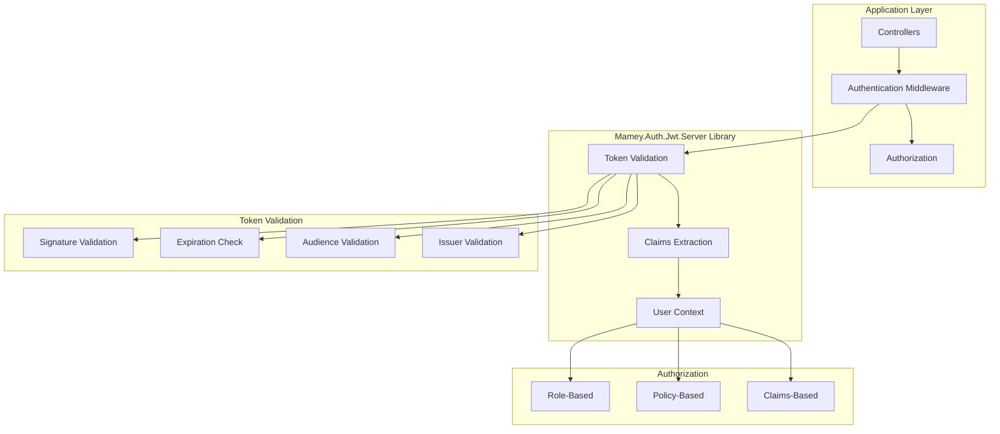
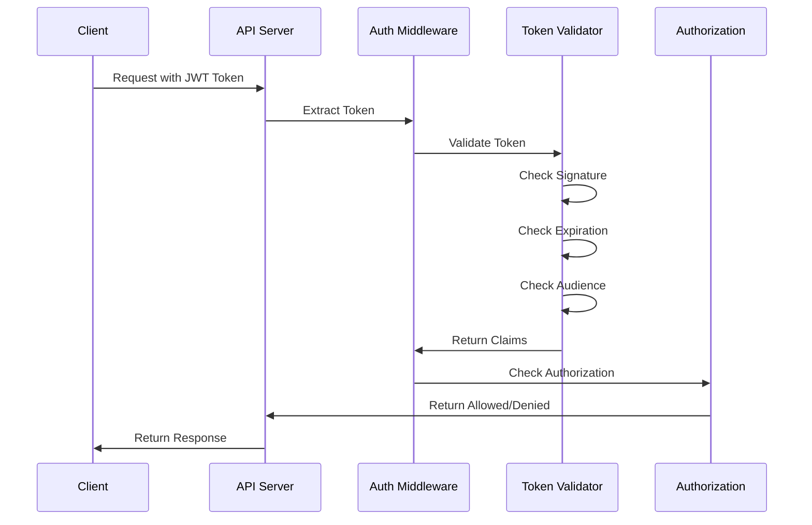

# Mamey.Auth.Jwt.Server

**Library**: `Mamey.Auth.Jwt.Server`  
**Location**: `Mamey/src/Mamey.Auth.Jwt.Server/`  
**Type**: Authentication Library - JWT Server  
**Version**: 2.0.*  
**Files**: 1 C# file  
**Namespace**: `Mamey.Auth.Jwt.Server`

## Overview

Mamey.Auth.Jwt.Server provides comprehensive server-side JWT (JSON Web Token) authentication and authorization configuration for the Mamey framework. It includes token validation middleware and authentication configuration for ASP.NET Core applications.

### Conceptual Foundation

**JWT Authentication** for server-side applications enables stateless authentication. Key concepts:

1. **Token-Based Authentication**: Stateless authentication using JWT tokens
2. **Token Lifecycle**: Generation, validation, refresh, and revocation
3. **Claims-Based Identity**: Identity represented by claims in tokens
4. **Security**: Cryptographic signing and validation
5. **Stateless**: No server-side session storage required

**Server-Side Authentication** considerations:
- **API Security**: Secure API endpoints and resources
- **Token Validation**: Server-side token validation and claims extraction
- **Authorization**: Role-based and policy-based authorization
- **Refresh Tokens**: Long-lived session management
- **Token Blacklisting**: Token revocation and security

**Why Mamey.Auth.Jwt.Server?**

Provides:
- **Server Configuration**: Server-side JWT configuration
- **Token Validation**: JWT token validation middleware
- **Authentication Middleware**: Authentication middleware integration
- **Authorization**: Role and policy-based authorization
- **Token Blacklisting**: Token revocation support

**Use Cases:**
- API applications
- Microservices
- Server-side applications
- JWT-based authentication
- Stateless applications

## Architecture

### Server-Side JWT Authentication Flow



### Authentication Flow



## Installation

### Prerequisites

1. **.NET 9.0**: Ensure .NET 9.0 SDK is installed
2. **ASP.NET Core**: ASP.NET Core application
3. **JWT Issuer**: JWT token issuer (e.g., Mamey.Auth.Jwt)

### NuGet Package

```bash
dotnet add package Mamey.Auth.Jwt.Server
```

### Dependencies

- **Mamey** - Core framework
- **Mamey.Auth.Jwt** - Base JWT authentication
- **Microsoft.AspNetCore.Authentication.JwtBearer** - JWT Bearer authentication

## Quick Start

### Basic Setup

```csharp
using Mamey.Auth.Jwt.Server;

var builder = WebApplication.CreateBuilder(args);

builder.Services
    .AddMamey()
    .AddJwtServer(options =>
    {
        options.IssuerSigningKey = "your-secret-key";
        options.ValidIssuer = "mamey-app";
        options.ValidAudience = "mamey-api";
        options.ValidateIssuer = true;
        options.ValidateAudience = true;
        options.ValidateLifetime = true;
    });

var app = builder.Build();

app.UseAuthentication();
app.UseAuthorization();

app.Run();
```

### Configuration

Add to `appsettings.json`:

```json
{
  "Jwt": {
    "IssuerSigningKey": "your-secret-key",
    "ValidIssuer": "mamey-app",
    "ValidAudience": "mamey-api",
    "ValidateIssuer": true,
    "ValidateAudience": true,
    "ValidateLifetime": true
  }
}
```

## Usage Examples

### Example 1: Configure JWT Authentication

```csharp
using Mamey.Auth.Jwt.Server;

public class Startup
{
    public void ConfigureServices(IServiceCollection services)
    {
        services
            .AddMamey()
            .AddJwtServer(options =>
            {
                options.IssuerSigningKey = Configuration["Jwt:IssuerSigningKey"];
                options.ValidIssuer = Configuration["Jwt:ValidIssuer"];
                options.ValidAudience = Configuration["Jwt:ValidAudience"];
                options.ValidateIssuer = true;
                options.ValidateAudience = true;
                options.ValidateLifetime = true;
            });
    }

    public void Configure(IApplicationBuilder app)
    {
        app.UseAuthentication();
        app.UseAuthorization();
    }
}
```

### Example 2: Protect API Endpoints

```csharp
using Microsoft.AspNetCore.Authorization;
using Microsoft.AspNetCore.Mvc;

[ApiController]
[Route("api/[controller]")]
[Authorize] // Requires valid JWT token
public class DataController : ControllerBase
{
    [HttpGet]
    public IActionResult GetData()
    {
        var userId = User.FindFirst("sub")?.Value;
        var userName = User.Identity?.Name;
        
        return Ok(new { UserId = userId, UserName = userName });
    }
}
```

### Example 3: Role-Based Authorization

```csharp
[ApiController]
[Route("api/[controller]")]
[Authorize(Roles = "Admin")] // Requires Admin role
public class AdminController : ControllerBase
{
    [HttpGet]
    public IActionResult GetAdminData()
    {
        return Ok("Admin data");
    }
}
```

### Example 4: Policy-Based Authorization

```csharp
public void ConfigureServices(IServiceCollection services)
{
    services.AddAuthorization(options =>
    {
        options.AddPolicy("RequireAdmin", policy =>
            policy.RequireRole("Admin"));
        
        options.AddPolicy("RequireManager", policy =>
            policy.RequireAssertion(context =>
                context.User.IsInRole("Admin") ||
                context.User.IsInRole("Manager")));
    });
}

[ApiController]
[Route("api/[controller]")]
[Authorize(Policy = "RequireManager")]
public class ManagerController : ControllerBase
{
    [HttpGet]
    public IActionResult GetManagerData()
    {
        return Ok("Manager data");
    }
}
```

## Best Practices

### 1. Validate Token Properties

**✅ Good: Validate all token properties**
```csharp
options.ValidateIssuer = true;
options.ValidateAudience = true;
options.ValidateLifetime = true;
options.ValidateIssuerSigningKey = true;
```

### 2. Use Secure Signing Keys

**✅ Good: Use secure signing keys**
```csharp
options.IssuerSigningKey = new SymmetricSecurityKey(
    Encoding.UTF8.GetBytes(Configuration["Jwt:SecretKey"]));
```

### 3. Set Appropriate Token Lifetime

**✅ Good: Set appropriate token expiration**
```csharp
options.TokenLifetime = TimeSpan.FromMinutes(15);
options.RefreshTokenLifetime = TimeSpan.FromDays(7);
```

### 4. Implement Token Blacklisting

**✅ Good: Implement token revocation**
```csharp
options.Events = new JwtBearerEvents
{
    OnTokenValidated = async context =>
    {
        var token = context.SecurityToken as JwtSecurityToken;
        if (await _tokenBlacklistService.IsBlacklistedAsync(token.Id))
        {
            context.Fail("Token has been revoked");
        }
    }
};
```

## Related Libraries

- **Mamey.Auth.Jwt**: Base JWT authentication
- **Mamey.Auth.Jwt.BlazorWasm**: Blazor client
- **Mamey.Security**: Security utilities

## Additional Resources

- [JWT Authentication in ASP.NET Core](https://docs.microsoft.com/aspnet/core/security/authentication/jwt-authn)
- [JWT Introduction](https://jwt.io/introduction/)
- [Mamey Framework Documentation](../)
- Mamey.Auth.Jwt.Server Memory Documentation

## Tags

#jwt #server #authentication #token-validation #authorization #mamey

