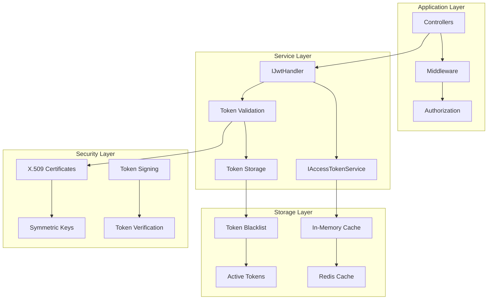

# Mamey.Auth.Jwt

The Mamey.Auth.Jwt library provides comprehensive JWT (JSON Web Token) authentication and authorization capabilities for the Mamey framework. It offers secure token generation, validation, and management with support for both in-memory and Redis-based token storage.

## Technical Overview

Mamey.Auth.Jwt is a specialized authentication library that provides:

- **JWT Token Management**: Complete JWT token lifecycle management
- **Multiple Storage Options**: In-memory and Redis-based token storage
- **Security Features**: X.509 certificate support, symmetric key encryption
- **Token Validation**: Comprehensive token validation and verification
- **Middleware Integration**: Built-in middleware for token validation
- **Cookie Support**: HTTP-only cookie support for token storage
- **Policy-Based Authorization**: Role and permission-based access control
- **Password Generation**: Secure password generation utilities

## Architecture

The library provides a layered architecture for JWT authentication:



## Core Components

### JWT Handler
- **IJwtHandler**: Core interface for JWT operations
- **JwtHandler**: Implementation for token creation and validation
- **Token Generation**: Secure token creation with custom claims
- **Token Validation**: Comprehensive token verification

### Token Storage
- **IAccessTokenService**: Interface for token storage operations
- **InMemoryAccessTokenService**: In-memory token storage implementation
- **RedisAccessTokenService**: Redis-based token storage implementation
- **Token Blacklisting**: Support for token revocation

### Configuration
- **JwtOptions**: Comprehensive configuration options
- **JwtOptionsBuilder**: Fluent configuration builder
- **Certificate Support**: X.509 certificate configuration
- **Cookie Configuration**: HTTP cookie settings

### Middleware
- **AccessTokenValidatorMiddleware**: Token validation middleware
- **Authentication Middleware**: ASP.NET Core authentication integration
- **Authorization Policies**: Role and permission-based policies

## Installation

### NuGet Package
```bash
dotnet add package Mamey.Auth.Jwt
```

### Prerequisites
- .NET 9.0 or later
- Mamey (core framework)
- Mamey.Auth (authentication abstractions)
- Mamey.Persistence.Redis (for Redis storage)

## Key Features

### JWT Token Features

- **Token Creation**: Secure JWT token generation with custom claims
- **Token Validation**: Comprehensive token verification and validation
- **Token Storage**: Multiple storage options (memory, Redis)
- **Token Revocation**: Support for token blacklisting and revocation
- **Refresh Tokens**: Refresh token support for long-lived sessions
- **Custom Claims**: Support for custom claims and permissions
- **Role-Based Access**: Built-in role-based access control
- **Audience Validation**: Audience validation for multi-tenant applications

### Security Features

- **X.509 Certificates**: Support for X.509 certificate-based signing
- **Symmetric Keys**: HMAC-based symmetric key signing
- **Algorithm Support**: Multiple signing algorithms (RSA, HMAC)
- **Token Expiration**: Configurable token expiration times
- **Clock Skew**: Configurable clock skew tolerance
- **Token Replay Protection**: Protection against token replay attacks
- **Secure Cookies**: HTTP-only, secure cookie support

### Storage Features

- **In-Memory Storage**: Fast in-memory token storage
- **Redis Storage**: Distributed Redis-based token storage
- **Token Blacklisting**: Support for token revocation
- **Expiration Management**: Automatic token expiration handling
- **Cache Integration**: Integration with ASP.NET Core caching

### Middleware Features

- **Token Validation**: Automatic token validation middleware
- **Anonymous Endpoints**: Support for anonymous access endpoints
- **Authentication Integration**: Full ASP.NET Core authentication integration
- **Authorization Policies**: Policy-based authorization support
- **Error Handling**: Comprehensive error handling and logging

## Quick Start

### Basic Setup

```csharp
using Mamey.Auth.Jwt;

// Register JWT authentication
builder.Services.AddMamey()
    .AddJwt("jwt", options =>
    {
        options.IssuerSigningKey = "your-secret-key";
        options.ValidIssuer = "Mamey.Auth.Jwt";
        options.ValidAudience = "Mamey.Users";
        options.ExpiryMinutes = 60;
    });

// Use JWT authentication
app.UseMamey()
    .UseJwt();
```

### Basic Usage

```csharp
using Mamey.Auth.Jwt;

public class AuthController : ControllerBase
{
    private readonly IJwtHandler _jwtHandler;
    private readonly IAccessTokenService _accessTokenService;

    public AuthController(IJwtHandler jwtHandler, IAccessTokenService accessTokenService)
    {
        _jwtHandler = jwtHandler;
        _accessTokenService = accessTokenService;
    }

    [HttpPost("login")]
    public async Task<IActionResult> Login([FromBody] LoginRequest request)
    {
        // Validate user credentials
        var user = await ValidateUserAsync(request.Username, request.Password);
        if (user == null)
        {
            return Unauthorized();
        }

        // Create JWT token
        var token = _jwtHandler.CreateToken(
            userId: user.Id.ToString(),
            role: user.Role,
            audience: "Mamey.Users",
            claims: new Dictionary<string, string>
            {
                ["email"] = user.Email,
                ["permissions"] = string.Join(",", user.Permissions)
            });

        return Ok(new { Token = token.AccessToken, Expires = token.Expires });
    }

    [HttpPost("logout")]
    public async Task<IActionResult> Logout()
    {
        // Deactivate current token
        await _accessTokenService.DeactivateCurrentAsync();
        return Ok();
    }

    [HttpGet("profile")]
    [Authorize]
    public async Task<IActionResult> GetProfile()
    {
        var token = Request.Headers["Authorization"].FirstOrDefault()?.Split(" ").Last();
        var payload = _jwtHandler.GetTokenPayload(token);
        
        return Ok(new { UserId = payload.Subject, Role = payload.Role });
    }
}
```

## API Reference

### Core Interfaces

#### IJwtHandler

Interface for JWT token operations.

```csharp
public interface IJwtHandler
{
    JsonWebToken CreateToken(string userId, string role = null, string audience = null,
        IDictionary<string, string> claims = null);
    JsonWebTokenPayload GetTokenPayload(string accessToken);
}
```

**Methods:**
- `CreateToken(string userId, string role, string audience, IDictionary<string, string> claims)`: Creates a JWT token
- `GetTokenPayload(string accessToken)`: Gets the payload from a JWT token

#### IAccessTokenService

Interface for access token management.

```csharp
public interface IAccessTokenService
{
    Task<bool> IsCurrentActiveToken();
    Task DeactivateCurrentAsync();
    Task<bool> IsActiveAsync(string token);
    Task DeactivateAsync(string token);
}
```

**Methods:**
- `IsCurrentActiveToken()`: Checks if the current token is active
- `DeactivateCurrentAsync()`: Deactivates the current token
- `IsActiveAsync(string token)`: Checks if a specific token is active
- `DeactivateAsync(string token)`: Deactivates a specific token

### Core Classes

#### JwtOptions

Configuration options for JWT authentication.

```csharp
public class JwtOptions
{
    public TokenStorageType TokenStorage { get; set; }
    public bool AuthenticationDisabled { get; set; }
    public IEnumerable<string> AllowAnonymousEndpoints { get; set; }
    public CertificateOptions Certificate { get; set; }
    public string Algorithm { get; set; }
    public string Issuer { get; set; }
    public string IssuerSigningKey { get; set; }
    public string Authority { get; set; }
    public string Audience { get; set; }
    public string Challenge { get; set; }
    public string MetadataAddress { get; set; }
    public bool SaveToken { get; set; }
    public bool SaveSigninToken { get; set; }
    public bool RequireAudience { get; set; }
    public bool RequireHttpsMetadata { get; set; }
    public bool RequireExpirationTime { get; set; }
    public bool RequireSignedTokens { get; set; }
    public int ExpiryMinutes { get; set; }
    public TimeSpan? Expiry { get; set; }
    public TimeSpan? RefreshTokenLifetime { get; set; }
    public string ValidAudience { get; set; }
    public IEnumerable<string> ValidAudiences { get; set; }
    public string ValidIssuer { get; set; }
    public IEnumerable<string> ValidIssuers { get; set; }
    public bool ValidateActor { get; set; }
    public bool ValidateAudience { get; set; }
    public bool ValidateIssuer { get; set; }
    public bool ValidateLifetime { get; set; }
    public bool ValidateTokenReplay { get; set; }
    public bool ValidateIssuerSigningKey { get; set; }
    public bool RefreshOnIssuerKeyNotFound { get; set; }
    public bool IncludeErrorDetails { get; set; }
    public string AuthenticationType { get; set; }
    public string NameClaimType { get; set; }
    public string RoleClaimType { get; set; }
    public CookieOptions Cookie { get; set; }
}
```

#### JsonWebToken

JWT token data structure.

```csharp
public class JsonWebToken
{
    public string AccessToken { get; set; }
    public string RefreshToken { get; set; }
    public long Expires { get; set; }
    public string Id { get; set; }
    public string Role { get; set; }
    public IDictionary<string, string> Claims { get; set; }
}
```

#### JsonWebTokenPayload

JWT token payload data structure.

```csharp
public class JsonWebTokenPayload
{
    public string Subject { get; set; }
    public string Role { get; set; }
    public long Expires { get; set; }
    public IDictionary<string, IEnumerable<string>> Claims { get; set; }
}
```

### Enums

#### TokenStorageType

Token storage type enumeration.

```csharp
public enum TokenStorageType
{
    Memory,
    Redis
}
```

## Usage Examples

### Example 1: Basic JWT Authentication

```csharp
using Mamey.Auth.Jwt;

public class AuthService
{
    private readonly IJwtHandler _jwtHandler;
    private readonly IAccessTokenService _accessTokenService;

    public AuthService(IJwtHandler jwtHandler, IAccessTokenService accessTokenService)
    {
        _jwtHandler = jwtHandler;
        _accessTokenService = accessTokenService;
    }

    public async Task<JsonWebToken> AuthenticateAsync(string username, string password)
    {
        // Validate user credentials
        var user = await ValidateUserAsync(username, password);
        if (user == null)
        {
            throw new UnauthorizedAccessException("Invalid credentials");
        }

        // Create JWT token
        var token = _jwtHandler.CreateToken(
            userId: user.Id.ToString(),
            role: user.Role,
            audience: "Mamey.Users",
            claims: new Dictionary<string, string>
            {
                ["email"] = user.Email,
                ["permissions"] = string.Join(",", user.Permissions)
            });

        return token;
    }

    public async Task<bool> ValidateTokenAsync(string token)
    {
        try
        {
            var payload = _jwtHandler.GetTokenPayload(token);
            return payload != null && await _accessTokenService.IsActiveAsync(token);
        }
        catch
        {
            return false;
        }
    }

    public async Task RevokeTokenAsync(string token)
    {
        await _accessTokenService.DeactivateAsync(token);
    }
}
```

### Example 2: Advanced JWT Configuration

```csharp
using Mamey.Auth.Jwt;

public class JwtConfiguration
{
    public static void ConfigureJwt(IMameyBuilder builder)
    {
        builder.AddJwt("jwt", options =>
        {
            // Basic configuration
            options.IssuerSigningKey = "your-256-bit-secret-key";
            options.ValidIssuer = "Mamey.Auth.Jwt";
            options.ValidAudience = "Mamey.Users";
            options.ExpiryMinutes = 60;

            // Security configuration
            options.RequireAudience = true;
            options.RequireHttpsMetadata = true;
            options.RequireExpirationTime = true;
            options.RequireSignedTokens = true;
            options.ValidateLifetime = true;
            options.ValidateAudience = true;
            options.ValidateIssuer = true;
            options.ValidateIssuerSigningKey = true;

            // Token storage configuration
            options.TokenStorage = TokenStorageType.Redis;
            options.AuthenticationType = "Redis";

            // Cookie configuration
            options.Cookie = new JwtOptions.CookieOptions
            {
                HttpOnly = true,
                Secure = true,
                SameSite = "Strict"
            };

            // Anonymous endpoints
            options.AllowAnonymousEndpoints = new[]
            {
                "/api/auth/login",
                "/api/auth/register",
                "/api/health"
            };
        });
    }
}
```

### Example 3: X.509 Certificate Configuration

```csharp
using Mamey.Auth.Jwt;

public class CertificateJwtConfiguration
{
    public static void ConfigureJwtWithCertificate(IMameyBuilder builder)
    {
        builder.AddJwt("jwt", options =>
        {
            // Certificate configuration
            options.Certificate = new JwtOptions.CertificateOptions
            {
                Location = "/path/to/certificate.pfx",
                Password = "certificate-password"
            };

            // Algorithm configuration
            options.Algorithm = SecurityAlgorithms.RsaSha256;

            // Basic configuration
            options.ValidIssuer = "Mamey.Auth.Jwt";
            options.ValidAudience = "Mamey.Users";
            options.ExpiryMinutes = 60;

            // Security configuration
            options.RequireAudience = true;
            options.RequireHttpsMetadata = true;
            options.RequireExpirationTime = true;
            options.RequireSignedTokens = true;
            options.ValidateLifetime = true;
            options.ValidateAudience = true;
            options.ValidateIssuer = true;
            options.ValidateIssuerSigningKey = true;
        });
    }
}
```

### Example 4: Custom Token Validation

```csharp
using Mamey.Auth.Jwt;

public class CustomTokenValidator
{
    private readonly IJwtHandler _jwtHandler;
    private readonly IAccessTokenService _accessTokenService;

    public CustomTokenValidator(IJwtHandler jwtHandler, IAccessTokenService accessTokenService)
    {
        _jwtHandler = jwtHandler;
        _accessTokenService = accessTokenService;
    }

    public async Task<TokenValidationResult> ValidateTokenAsync(string token)
    {
        try
        {
            // Check if token is blacklisted
            if (!await _accessTokenService.IsActiveAsync(token))
            {
                return new TokenValidationResult
                {
                    IsValid = false,
                    Error = "Token has been revoked"
                };
            }

            // Validate token structure and signature
            var payload = _jwtHandler.GetTokenPayload(token);
            if (payload == null)
            {
                return new TokenValidationResult
                {
                    IsValid = false,
                    Error = "Invalid token format"
                };
            }

            // Check token expiration
            if (payload.Expires < DateTimeOffset.UtcNow.ToUnixTimeMilliseconds())
            {
                return new TokenValidationResult
                {
                    IsValid = false,
                    Error = "Token has expired"
                };
            }

            return new TokenValidationResult
            {
                IsValid = true,
                UserId = payload.Subject,
                Role = payload.Role,
                Claims = payload.Claims
            };
        }
        catch (Exception ex)
        {
            return new TokenValidationResult
            {
                IsValid = false,
                Error = $"Token validation failed: {ex.Message}"
            };
        }
    }
}

public class TokenValidationResult
{
    public bool IsValid { get; set; }
    public string Error { get; set; }
    public string UserId { get; set; }
    public string Role { get; set; }
    public IDictionary<string, IEnumerable<string>> Claims { get; set; }
}
```

### Example 5: Password Generation

```csharp
using Mamey.Auth.Jwt;

public class PasswordService
{
    public string GenerateSecurePassword(int length = 12, bool includeSpecialChars = true)
    {
        return PasswordGenerator.GenerateTemporaryPassword(length, includeSpecialChars);
    }

    public string GenerateTemporaryPassword(int length = 8, bool includeSpecialChars = false)
    {
        return PasswordGenerator.GenerateTemporaryPassword(length, includeSpecialChars);
    }
}
```

## Integration Patterns

### Integration with ASP.NET Core

```csharp
// Program.cs
var builder = WebApplication.CreateBuilder(args);

// Add Mamey with JWT authentication
builder.Services.AddMamey()
    .AddJwt("jwt", options =>
    {
        options.IssuerSigningKey = builder.Configuration["Jwt:SecretKey"];
        options.ValidIssuer = builder.Configuration["Jwt:Issuer"];
        options.ValidAudience = builder.Configuration["Jwt:Audience"];
        options.ExpiryMinutes = builder.Configuration.GetValue<int>("Jwt:ExpiryMinutes");
    });

var app = builder.Build();

// Use JWT authentication
app.UseMamey()
    .UseJwt();

app.Run();
```

### Integration with Authorization Policies

```csharp
public class AuthorizationConfiguration
{
    public static void ConfigurePolicies(IServiceCollection services)
    {
        services.AddAuthorization(options =>
        {
            options.AddPolicy("AdminOnly", policy =>
                policy.RequireClaim("role", "Admin"));
            
            options.AddPolicy("UserOrAdmin", policy =>
                policy.RequireClaim("role", "User", "Admin"));
            
            options.AddPolicy("RequirePermission", policy =>
                policy.RequireClaim("permissions", "read", "write"));
        });
    }
}
```

## Configuration Reference

### JWT Configuration

```json
{
  "jwt": {
    "issuerSigningKey": "your-256-bit-secret-key",
    "validIssuer": "Mamey.Auth.Jwt",
    "validAudience": "Mamey.Users",
    "expiryMinutes": 60,
    "tokenStorage": "Redis",
    "authenticationType": "Redis",
    "requireAudience": true,
    "requireHttpsMetadata": true,
    "requireExpirationTime": true,
    "requireSignedTokens": true,
    "validateLifetime": true,
    "validateAudience": true,
    "validateIssuer": true,
    "validateIssuerSigningKey": true,
    "cookie": {
      "httpOnly": true,
      "secure": true,
      "sameSite": "Strict"
    },
    "allowAnonymousEndpoints": [
      "/api/auth/login",
      "/api/auth/register",
      "/api/health"
    ]
  }
}
```

### Certificate Configuration

```json
{
  "jwt": {
    "certificate": {
      "location": "/path/to/certificate.pfx",
      "password": "certificate-password"
    },
    "algorithm": "RS256",
    "validIssuer": "Mamey.Auth.Jwt",
    "validAudience": "Mamey.Users",
    "expiryMinutes": 60
  }
}
```

## Best Practices

1. **Secure Key Management**: Use strong, randomly generated keys
2. **Token Expiration**: Set appropriate token expiration times
3. **HTTPS Only**: Always use HTTPS in production
4. **Token Storage**: Use Redis for distributed applications
5. **Token Revocation**: Implement token blacklisting for security
6. **Audience Validation**: Validate token audience for multi-tenant apps
7. **Certificate Security**: Protect X.509 certificates properly
8. **Error Handling**: Implement comprehensive error handling
9. **Logging**: Add detailed logging for security events
10. **Testing**: Write comprehensive unit and integration tests

## Troubleshooting

### Common Issues

**Token Validation Fails**: Check issuer, audience, and signing key configuration
**Certificate Issues**: Verify certificate path and password
**Redis Connection**: Ensure Redis is accessible and configured correctly
**Token Expiration**: Check token expiration settings
**CORS Issues**: Configure CORS for cross-origin requests

### Debugging

Enable detailed logging to troubleshoot issues:

```csharp
builder.Logging.AddConsole();
builder.Logging.SetMinimumLevel(LogLevel.Debug);
```

## Related Libraries

- [Mamey.Auth](auth.md) - Core authentication library
- [Mamey.Auth.Abstractions](auth-abstractions.md) - Authentication abstractions
- [Mamey.Persistence.Redis](persistence-redis.md) - Redis persistence library

## Additional Resources

- JWT Authentication Guide
- Security Best Practices
- Token Management Guide
