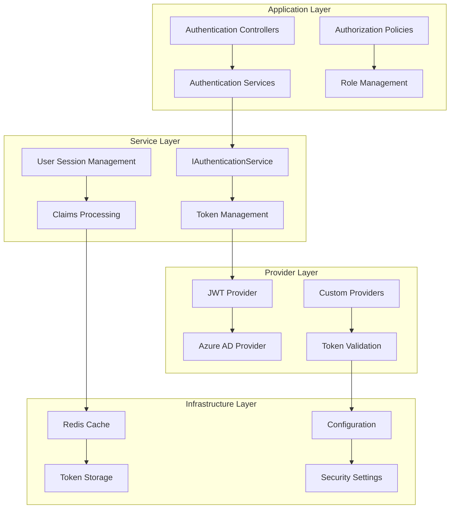

# Mamey.Auth

The Mamey.Auth library provides a comprehensive authentication and authorization framework for .NET applications. It offers a unified interface for various authentication providers including JWT, Azure AD, and custom authentication mechanisms, with built-in support for token management, user session handling, and security features.

## Technical Overview

Mamey.Auth implements a flexible authentication architecture that supports multiple authentication providers and patterns:

- **Unified Authentication Interface**: Single interface for all authentication providers
- **JWT Token Management**: Complete JWT token lifecycle management with validation and refresh
- **Azure AD Integration**: Built-in support for Azure AD, B2C, and B2B authentication
- **Token Caching**: Redis-based token caching for improved performance
- **Session Management**: Comprehensive user session and state management
- **Security Features**: Built-in security features including token revocation and validation
- **Claims-Based Authorization**: Support for claims-based authorization and role management
- **Multi-Tenant Support**: Built-in support for multi-tenant applications
- **Event-Driven Architecture**: Event-driven authentication state changes
- **Extensible Design**: Pluggable architecture for custom authentication providers

## Architecture

The library follows a layered architecture with clear separation of concerns:



## Core Components

### Authentication Service
- **IAuthenticationService**: Core interface for authentication operations
- **User Authentication**: Username/password and token-based authentication
- **Authorization**: Resource-based authorization with claims support
- **Session Management**: User session lifecycle management
- **Event Handling**: Authentication state change events

### Token Management
- **JWT Support**: Complete JWT token generation, validation, and refresh
- **Token Caching**: Redis-based token caching for performance
- **Token Revocation**: Secure token revocation and blacklisting
- **Refresh Tokens**: Automatic token refresh mechanisms
- **Token Validation**: Comprehensive token validation and security checks

### User Management
- **AuthenticatedUser**: Comprehensive user model with claims support
- **Claims Processing**: Claims-based identity and authorization
- **Multi-Tenant Support**: Tenant-aware user management
- **User State**: User status and type management
- **Session Events**: User state change event handling

### Configuration
- **AuthenticationOptions**: Unified configuration for all providers
- **JwtOptions**: JWT-specific configuration options
- **AzureOptions**: Azure AD configuration options
- **Security Settings**: Comprehensive security configuration

## Installation

### NuGet Package
```bash
dotnet add package Mamey.Auth
```

### Prerequisites
- .NET 9.0 or later
- Mamey (core framework)
- Microsoft.Extensions.Identity.Core
- Redis (for token caching)

## Key Features

### Core Authentication Features

- **Unified Authentication**: Single interface for all authentication providers
- **JWT Token Management**: Complete JWT token lifecycle management
- **Azure AD Integration**: Built-in Azure AD, B2C, and B2B support
- **Token Caching**: Redis-based token caching for performance
- **Session Management**: Comprehensive user session management
- **Claims-Based Authorization**: Support for claims-based authorization
- **Multi-Tenant Support**: Built-in multi-tenant application support
- **Event-Driven Architecture**: Event-driven authentication state changes
- **Security Features**: Built-in security features and validation
- **Extensible Design**: Pluggable architecture for custom providers

### Advanced Authentication Features

- **Token Refresh**: Automatic token refresh mechanisms
- **Token Revocation**: Secure token revocation and blacklisting
- **User State Management**: Comprehensive user state and status management
- **Claims Processing**: Advanced claims processing and transformation
- **Session Persistence**: Persistent user session management
- **Security Validation**: Comprehensive security validation and checks
- **Performance Optimization**: Optimized for high-performance scenarios
- **Scalability**: Designed for scalable authentication systems
- **Monitoring**: Built-in monitoring and logging support
- **Compliance**: Support for various compliance standards

### Security Features

- **Token Security**: Secure token generation and validation
- **Session Security**: Secure session management and validation
- **Claims Security**: Secure claims processing and validation
- **Multi-Factor Authentication**: Support for MFA implementations
- **Password Policies**: Built-in password policy enforcement
- **Account Lockout**: Account lockout and security features
- **Audit Logging**: Comprehensive audit logging for security
- **Encryption**: Built-in encryption for sensitive data
- **Compliance**: Support for security compliance standards

## Quick Start

### Basic Setup

```csharp
using Mamey;
using Mamey.Auth;

var builder = WebApplication.CreateBuilder(args);

// Create Mamey builder
var mameyBuilder = MameyBuilder.Create(builder.Services, builder.Configuration);

// Add authentication
mameyBuilder.AddAuthentication();

var app = builder.Build();
app.Run();
```

### Configuration

```json
{
  "Authentication": {
    "Jwt": {
      "Secret": "your-secret-key",
      "ExpirationMinutes": 60,
      "Issuer": "Mamey.Auth",
      "Audience": "Mamey.Users"
    },
    "Azure": {
      "Instance": "https://login.microsoftonline.com/",
      "TenantId": "your-tenant-id",
      "ClientId": "your-client-id",
      "ClientSecret": "your-client-secret",
      "Domain": "your-domain.com",
      "CallbackPath": "/signin-oidc",
      "SignedOutCallbackPath": "/signout-oidc"
    }
  }
}
```

### Basic Authentication Usage

```csharp
using Mamey.Auth;

public class AuthController : ControllerBase
{
    private readonly IAuthenticationService _authService;
    private readonly ILogger<AuthController> _logger;

    public AuthController(IAuthenticationService authService, ILogger<AuthController> logger)
    {
        _authService = authService;
        _logger = logger;
    }

    [HttpPost("login")]
    public async Task<IActionResult> Login([FromBody] LoginRequest request)
    {
        try
        {
            await _authService.SignIn(request.Username, request.Password);
            
            if (_authService.IsAuthenticated)
            {
                var user = _authService.AuthenticatedUser;
                return Ok(new
                {
                    UserId = user.UserId,
                    Name = user.Name,
                    Email = user.Email,
                    Role = user.Role,
                    AccessToken = user.AccessToken,
                    Expires = user.Expires
                });
            }
            
            return Unauthorized("Invalid credentials");
        }
        catch (Exception ex)
        {
            _logger.LogError(ex, "Login failed for user: {Username}", request.Username);
            return BadRequest("Login failed");
        }
    }

    [HttpPost("logout")]
    public IActionResult Logout()
    {
        _authService.Logout();
        return Ok("Logged out successfully");
    }

    [HttpGet("profile")]
    public IActionResult GetProfile()
    {
        if (!_authService.IsAuthenticated)
        {
            return Unauthorized();
        }

        var user = _authService.AuthenticatedUser;
        return Ok(new
        {
            UserId = user.UserId,
            Name = user.Name,
            Email = user.Email,
            Role = user.Role,
            Claims = user.Claims
        });
    }
}
```

### JWT Token Management

```csharp
using Mamey.Auth;

public class TokenService
{
    private readonly IAccessTokenService _accessTokenService;
    private readonly IRedisTokenCache _tokenCache;
    private readonly ILogger<TokenService> _logger;

    public TokenService(
        IAccessTokenService accessTokenService,
        IRedisTokenCache tokenCache,
        ILogger<TokenService> logger)
    {
        _accessTokenService = accessTokenService;
        _tokenCache = tokenCache;
        _logger = logger;
    }

    public async Task<string> GetCachedTokenAsync(string userId)
    {
        var cacheKey = $"token:{userId}";
        var cachedToken = await _tokenCache.GetCachedTokenAsync(cacheKey);
        
        if (!string.IsNullOrEmpty(cachedToken) && await _accessTokenService.IsActiveAsync(cachedToken))
        {
            return cachedToken;
        }

        // Generate new token if cached token is invalid
        var newToken = await GenerateNewTokenAsync(userId);
        await _tokenCache.SetCachedTokenAsync(cacheKey, newToken);
        
        return newToken;
    }

    public async Task RevokeTokenAsync(string token)
    {
        await _accessTokenService.DeactivateAsync(token);
        _logger.LogInformation("Token revoked successfully");
    }

    private async Task<string> GenerateNewTokenAsync(string userId)
    {
        // Implementation for generating new JWT token
        // This would typically use JWT libraries
        return "new-jwt-token";
    }
}
```

### Claims-Based Authorization

```csharp
using Mamey.Auth;
using System.Security.Claims;

public class AuthorizationService
{
    private readonly IAuthenticationService _authService;
    private readonly ILogger<AuthorizationService> _logger;

    public AuthorizationService(IAuthenticationService authService, ILogger<AuthorizationService> logger)
    {
        _authService = authService;
        _logger = logger;
    }

    public bool IsAuthorized(string resource, string action)
    {
        if (!_authService.IsAuthenticated)
        {
            return false;
        }

        var user = _authService.AuthenticatedUser;
        var principal = user.Principal;

        // Check role-based authorization
        if (action == "read" && principal.IsInRole("Reader"))
        {
            return true;
        }

        if (action == "write" && principal.IsInRole("Writer"))
        {
            return true;
        }

        if (action == "admin" && principal.IsInRole("Administrator"))
        {
            return true;
        }

        // Check claims-based authorization
        var hasPermission = principal.HasClaim("permission", $"{resource}:{action}");
        if (hasPermission)
        {
            return true;
        }

        // Check custom claims
        var customClaims = user.Claims;
        if (customClaims != null && customClaims.ContainsKey("custom_permission"))
        {
            var customPermission = customClaims["custom_permission"];
            if (customPermission == $"{resource}:{action}")
            {
                return true;
            }
        }

        return false;
    }

    public bool HasClaim(string claimType, string claimValue)
    {
        if (!_authService.IsAuthenticated)
        {
            return false;
        }

        var user = _authService.AuthenticatedUser;
        var principal = user.Principal;

        return principal.HasClaim(claimType, claimValue);
    }

    public IEnumerable<Claim> GetUserClaims()
    {
        if (!_authService.IsAuthenticated)
        {
            return Enumerable.Empty<Claim>();
        }

        var user = _authService.AuthenticatedUser;
        return user.ToClaimsEnumerable();
    }
}
```

## API Reference

### Core Interfaces

#### IAuthenticationService

Main interface for authentication operations.

```csharp
public interface IAuthenticationService
{
    ClaimsPrincipal Authenticate(string credentials);
    bool Authorize(ClaimsPrincipal user, string resource);
    Task InitializeAsync();
    event Action<AuthenticatedUser?> AuthenticatedUserChanged;
    AuthenticatedUser? AuthenticatedUser { get; }
    bool IsAuthenticated { get; }
    Task SignIn(string username, string password);
    void Logout();
}
```

**Properties:**
- `AuthenticatedUser`: Currently authenticated user
- `IsAuthenticated`: Whether user is authenticated

**Methods:**
- `Authenticate(string credentials)`: Authenticate user with credentials
- `Authorize(ClaimsPrincipal user, string resource)`: Authorize user for resource
- `InitializeAsync()`: Initialize authentication service
- `SignIn(string username, string password)`: Sign in user
- `Logout()`: Log out current user

**Events:**
- `AuthenticatedUserChanged`: Fired when authenticated user changes

#### IAccessTokenService

Interface for access token management.

```csharp
public interface IAccessTokenService
{
    Task<bool> IsCurrentActiveToken();
    Task DeactivateCurrentAsync();
    Task<bool> IsActiveAsync(string token);
    Task DeactivateAsync(string token);
}
```

**Methods:**
- `IsCurrentActiveToken()`: Check if current token is active
- `DeactivateCurrentAsync()`: Deactivate current token
- `IsActiveAsync(string token)`: Check if specific token is active
- `DeactivateAsync(string token)`: Deactivate specific token

#### IRedisTokenCache

Interface for Redis token caching.

```csharp
public interface IRedisTokenCache
{
    Task<string> GetCachedTokenAsync(string key);
    Task SetCachedTokenAsync(string key, string token);
}
```

**Methods:**
- `GetCachedTokenAsync(string key)`: Get cached token by key
- `SetCachedTokenAsync(string key, string token)`: Cache token with key

### Core Classes

#### AuthenticatedUser

Represents an authenticated user with claims and session information.

```csharp
public class AuthenticatedUser
{
    public Guid UserId { get; set; }
    public Guid? TenantId { get; set; }
    public string? Name { get; set; }
    public string? Email { get; set; }
    public string? Role { get; set; }
    public string? AccessToken { get; set; }
    public string? RefreshToken { get; set; }
    public long Expires { get; set; }
    public string? Status { get; set; }
    public string? Type { get; set; }
    public IDictionary<string, string>? Claims { get; set; }
    public bool Expired { get; }
    public ClaimsPrincipal Principal { get; }
    public bool HasClaims { get; }
    public event Action<AuthenticatedUser>? UserChanged;
}
```

**Properties:**
- `UserId`: Unique user identifier
- `TenantId`: Tenant identifier for multi-tenant applications
- `Name`: User display name
- `Email`: User email address
- `Role`: User role
- `AccessToken`: JWT access token
- `RefreshToken`: JWT refresh token
- `Expires`: Token expiration timestamp
- `Status`: User status
- `Type`: User type
- `Claims`: Custom user claims
- `Expired`: Whether token is expired
- `Principal`: ClaimsPrincipal for authorization
- `HasClaims`: Whether user has claims

**Methods:**
- `ToClaimsEnumerable()`: Convert to claims enumerable
- `ToClaimsIdentity()`: Convert to claims identity

#### AuthenticationOptions

Configuration options for authentication.

```csharp
public class AuthenticationOptions
{
    public AzureOptions Azure { get; set; }
    public JwtOptions Jwt { get; set; }
}
```

**Properties:**
- `Azure`: Azure AD configuration options
- `Jwt`: JWT configuration options

#### JwtOptions

JWT-specific configuration options.

```csharp
public class JwtOptions
{
    public string Secret { get; set; }
    public int ExpirationMinutes { get; set; }
    public string Issuer { get; set; }
    public string Audience { get; set; }
}
```

**Properties:**
- `Secret`: JWT signing secret
- `ExpirationMinutes`: Token expiration in minutes
- `Issuer`: JWT issuer
- `Audience`: JWT audience

#### AzureOptions

Azure AD configuration options.

```csharp
public class AzureOptions
{
    public string Instance { get; set; }
    public string TenantId { get; set; }
    public string ClientId { get; set; }
    public string ClientSecret { get; set; }
    public string Domain { get; set; }
    public string CallbackPath { get; set; }
    public string SignedOutCallbackPath { get; set; }
    public string SignUpSignInPolicyId { get; set; }
    public string ResetPasswordPolicyId { get; set; }
    public string EditProfilePolicyId { get; set; }
}
```

**Properties:**
- `Instance`: Azure AD instance URL
- `TenantId`: Azure AD tenant ID
- `ClientId`: Azure AD client ID
- `ClientSecret`: Azure AD client secret
- `Domain`: Azure AD domain
- `CallbackPath`: OIDC callback path
- `SignedOutCallbackPath`: OIDC sign-out callback path
- `SignUpSignInPolicyId`: B2C sign-up/sign-in policy ID
- `ResetPasswordPolicyId`: B2C reset password policy ID
- `EditProfilePolicyId`: B2C edit profile policy ID

## Usage Examples

### Example 1: Basic Authentication Setup

```csharp
using Mamey;
using Mamey.Auth;

var builder = WebApplication.CreateBuilder(args);

var mameyBuilder = MameyBuilder.Create(builder.Services, builder.Configuration);

// Configure authentication
mameyBuilder.AddAuthentication(options =>
{
    options.Jwt.Secret = "your-secret-key";
    options.Jwt.ExpirationMinutes = 60;
    options.Jwt.Issuer = "Mamey.Auth";
    options.Jwt.Audience = "Mamey.Users";
    
    options.Azure.Instance = "https://login.microsoftonline.com/";
    options.Azure.TenantId = "your-tenant-id";
    options.Azure.ClientId = "your-client-id";
    options.Azure.ClientSecret = "your-client-secret";
});

var app = builder.Build();
app.Run();
```

### Example 2: Custom Authentication Provider

```csharp
using Mamey.Auth;

public class CustomAuthenticationService : IAuthenticationService
{
    private readonly ILogger<CustomAuthenticationService> _logger;
    private AuthenticatedUser? _authenticatedUser;

    public CustomAuthenticationService(ILogger<CustomAuthenticationService> logger)
    {
        _logger = logger;
    }

    public ClaimsPrincipal Authenticate(string credentials)
    {
        // Implement custom authentication logic
        var user = ValidateCredentials(credentials);
        if (user != null)
        {
            _authenticatedUser = user;
            return user.Principal;
        }
        
        return new ClaimsPrincipal();
    }

    public bool Authorize(ClaimsPrincipal user, string resource)
    {
        // Implement custom authorization logic
        return user.HasClaim("permission", resource);
    }

    public async Task InitializeAsync()
    {
        _logger.LogInformation("Custom authentication service initialized");
    }

    public event Action<AuthenticatedUser?>? AuthenticatedUserChanged;

    public AuthenticatedUser? AuthenticatedUser => _authenticatedUser;

    public bool IsAuthenticated => _authenticatedUser != null;

    public async Task SignIn(string username, string password)
    {
        var user = await ValidateUserAsync(username, password);
        if (user != null)
        {
            _authenticatedUser = user;
            AuthenticatedUserChanged?.Invoke(user);
        }
    }

    public void Logout()
    {
        _authenticatedUser = null;
        AuthenticatedUserChanged?.Invoke(null);
    }

    private AuthenticatedUser? ValidateCredentials(string credentials)
    {
        // Implement credential validation
        return null;
    }

    private async Task<AuthenticatedUser?> ValidateUserAsync(string username, string password)
    {
        // Implement user validation
        return null;
    }
}
```

### Example 3: Multi-Tenant Authentication

```csharp
using Mamey.Auth;

public class MultiTenantAuthService
{
    private readonly IAuthenticationService _authService;
    private readonly ILogger<MultiTenantAuthService> _logger;

    public MultiTenantAuthService(IAuthenticationService authService, ILogger<MultiTenantAuthService> logger)
    {
        _authService = authService;
        _logger = logger;
    }

    public async Task<bool> SignInForTenantAsync(string username, string password, Guid tenantId)
    {
        try
        {
            await _authService.SignIn(username, password);
            
            if (_authService.IsAuthenticated)
            {
                var user = _authService.AuthenticatedUser;
                if (user.TenantId == tenantId)
                {
                    _logger.LogInformation("User {UserId} signed in for tenant {TenantId}", user.UserId, tenantId);
                    return true;
                }
                else
                {
                    _authService.Logout();
                    _logger.LogWarning("User {UserId} attempted to sign in for wrong tenant {TenantId}", user.UserId, tenantId);
                    return false;
                }
            }
            
            return false;
        }
        catch (Exception ex)
        {
            _logger.LogError(ex, "Multi-tenant sign-in failed for user {Username} and tenant {TenantId}", username, tenantId);
            return false;
        }
    }

    public bool IsAuthorizedForTenant(string resource, Guid tenantId)
    {
        if (!_authService.IsAuthenticated)
        {
            return false;
        }

        var user = _authService.AuthenticatedUser;
        if (user.TenantId != tenantId)
        {
            return false;
        }

        return _authService.Authorize(user.Principal, resource);
    }
}
```

### Example 4: Token Refresh Implementation

```csharp
using Mamey.Auth;

public class TokenRefreshService
{
    private readonly IAccessTokenService _accessTokenService;
    private readonly IRedisTokenCache _tokenCache;
    private readonly ILogger<TokenRefreshService> _logger;

    public TokenRefreshService(
        IAccessTokenService accessTokenService,
        IRedisTokenCache tokenCache,
        ILogger<TokenRefreshService> logger)
    {
        _accessTokenService = accessTokenService;
        _tokenCache = tokenCache;
        _logger = logger;
    }

    public async Task<string?> RefreshTokenAsync(string refreshToken)
    {
        try
        {
            // Validate refresh token
            if (!await ValidateRefreshTokenAsync(refreshToken))
            {
                _logger.LogWarning("Invalid refresh token provided");
                return null;
            }

            // Generate new access token
            var newAccessToken = await GenerateNewAccessTokenAsync(refreshToken);
            
            // Cache new token
            var cacheKey = $"access_token:{GetUserIdFromToken(refreshToken)}";
            await _tokenCache.SetCachedTokenAsync(cacheKey, newAccessToken);

            _logger.LogInformation("Token refreshed successfully");
            return newAccessToken;
        }
        catch (Exception ex)
        {
            _logger.LogError(ex, "Token refresh failed");
            return null;
        }
    }

    public async Task<bool> RevokeAllTokensAsync(string userId)
    {
        try
        {
            // Revoke all tokens for user
            var cacheKey = $"access_token:{userId}";
            var cachedToken = await _tokenCache.GetCachedTokenAsync(cacheKey);
            
            if (!string.IsNullOrEmpty(cachedToken))
            {
                await _accessTokenService.DeactivateAsync(cachedToken);
            }

            // Clear cache
            await _tokenCache.SetCachedTokenAsync(cacheKey, string.Empty);

            _logger.LogInformation("All tokens revoked for user {UserId}", userId);
            return true;
        }
        catch (Exception ex)
        {
            _logger.LogError(ex, "Token revocation failed for user {UserId}", userId);
            return false;
        }
    }

    private async Task<bool> ValidateRefreshTokenAsync(string refreshToken)
    {
        // Implement refresh token validation
        return true;
    }

    private async Task<string> GenerateNewAccessTokenAsync(string refreshToken)
    {
        // Implement new access token generation
        return "new-access-token";
    }

    private string GetUserIdFromToken(string token)
    {
        // Extract user ID from token
        return "user-id";
    }
}
```

## Integration Patterns

### Integration with ASP.NET Core

```csharp
// Program.cs
var builder = WebApplication.CreateBuilder(args);

var mameyBuilder = MameyBuilder.Create(builder.Services, builder.Configuration);
mameyBuilder.AddAuthentication();

var app = builder.Build();

// Configure authentication middleware
app.UseAuthentication();
app.UseAuthorization();

app.Run();
```

### Integration with Authorization Policies

```csharp
builder.Services.AddAuthorization(options =>
{
    options.AddPolicy("AdminOnly", policy =>
        policy.RequireRole("Administrator"));
    
    options.AddPolicy("ReaderOrWriter", policy =>
        policy.RequireRole("Reader", "Writer"));
    
    options.AddPolicy("CustomPermission", policy =>
        policy.RequireClaim("permission", "custom:action"));
});
```

### Integration with CQRS

```csharp
using Mamey.Auth;
using Mamey.CQRS.Commands;

public class CreateUserCommand : ICommand
{
    public string Name { get; set; }
    public string Email { get; set; }
    public string Role { get; set; }
}

public class CreateUserCommandHandler : ICommandHandler<CreateUserCommand>
{
    private readonly IAuthenticationService _authService;
    private readonly IUserRepository _userRepository;

    public CreateUserCommandHandler(IAuthenticationService authService, IUserRepository userRepository)
    {
        _authService = authService;
        _userRepository = userRepository;
    }

    public async Task HandleAsync(CreateUserCommand command, CancellationToken cancellationToken = default)
    {
        // Check if current user is authorized to create users
        if (!_authService.IsAuthenticated || !_authService.Authorize(_authService.AuthenticatedUser.Principal, "user:create"))
        {
            throw new UnauthorizedAccessException("User not authorized to create users");
        }

        // Create user
        var user = new User
        {
            Name = command.Name,
            Email = command.Email,
            Role = command.Role
        };

        await _userRepository.AddAsync(user);
    }
}
```

## Configuration Reference

### Service Registration

```csharp
// Basic registration
mameyBuilder.AddAuthentication();

// With custom configuration
mameyBuilder.AddAuthentication(options =>
{
    options.Jwt.Secret = "your-secret-key";
    options.Jwt.ExpirationMinutes = 60;
    options.Azure.TenantId = "your-tenant-id";
});
```

### Configuration Options

```json
{
  "Authentication": {
    "Jwt": {
      "Secret": "your-secret-key",
      "ExpirationMinutes": 60,
      "Issuer": "Mamey.Auth",
      "Audience": "Mamey.Users"
    },
    "Azure": {
      "Instance": "https://login.microsoftonline.com/",
      "TenantId": "your-tenant-id",
      "ClientId": "your-client-id",
      "ClientSecret": "your-client-secret",
      "Domain": "your-domain.com",
      "CallbackPath": "/signin-oidc",
      "SignedOutCallbackPath": "/signout-oidc",
      "SignUpSignInPolicyId": "B2C_1_signupsignin",
      "ResetPasswordPolicyId": "B2C_1_resetpassword",
      "EditProfilePolicyId": "B2C_1_editprofile"
    }
  }
}
```

### Environment Variables

```bash
# JWT Configuration
AUTHENTICATION__JWT__SECRET=your-secret-key
AUTHENTICATION__JWT__EXPIRATIONMINUTES=60
AUTHENTICATION__JWT__ISSUER=Mamey.Auth
AUTHENTICATION__JWT__AUDIENCE=Mamey.Users

# Azure Configuration
AUTHENTICATION__AZURE__INSTANCE=https://login.microsoftonline.com/
AUTHENTICATION__AZURE__TENANTID=your-tenant-id
AUTHENTICATION__AZURE__CLIENTID=your-client-id
AUTHENTICATION__AZURE__CLIENTSECRET=your-client-secret
AUTHENTICATION__AZURE__DOMAIN=your-domain.com
```

## Best Practices

1. **Security**: Use strong secrets and proper token validation
2. **Token Management**: Implement proper token refresh and revocation
3. **Claims**: Use claims-based authorization for fine-grained access control
4. **Multi-Tenant**: Implement proper tenant isolation
5. **Caching**: Use Redis caching for improved performance
6. **Logging**: Implement comprehensive logging for security auditing
7. **Error Handling**: Handle authentication errors gracefully
8. **Configuration**: Use secure configuration management
9. **Testing**: Implement comprehensive authentication testing
10. **Monitoring**: Monitor authentication metrics and security events

## Troubleshooting

### Common Issues

**Authentication Failures**: Check credentials and configuration
**Token Expiration**: Implement proper token refresh mechanisms
**Authorization Errors**: Verify claims and role assignments
**Session Issues**: Check session management configuration
**Cache Problems**: Verify Redis connectivity and configuration

### Debugging

Enable detailed logging to troubleshoot issues:

```csharp
builder.Logging.AddConsole();
builder.Logging.SetMinimumLevel(LogLevel.Debug);
```

## Related Libraries

- [Mamey.Auth.Abstractions](auth-abstractions.md) - Authentication abstractions
- [Mamey.Auth.Jwt](auth-jwt.md) - JWT authentication implementation
- [Mamey.Auth.Azure](auth-azure.md) - Azure AD authentication
- [Mamey.Security](../infrastructure/security.md) - Security utilities
- Mamey.Identity - Identity management

## Additional Resources

- Authentication Guide
- Authorization Guide
- Security Best Practices
- Multi-Tenant Applications
