# Mamey.Azure.Blobs

A comprehensive .NET library for Azure Blob Storage integration within the Mamey framework. This library provides a complete set of services for managing containers, blobs, metadata, and advanced Azure Storage features with seamless integration into the Mamey ecosystem.

## Overview

Mamey.Azure.Blobs offers a robust, feature-rich interface for Azure Blob Storage operations, built on top of the Azure.Storage.Blobs SDK. It provides comprehensive blob management capabilities, advanced security features, and seamless integration with the Mamey framework.

## Key Features

- **Complete Blob Operations**: Upload, download, copy, delete, and manage blobs
- **Container Management**: Create, configure, and manage blob containers
- **Advanced Security**: SAS tokens, access policies, and lease management
- **Metadata & Tagging**: Comprehensive metadata and tag management
- **Blob Types Support**: Block blobs, page blobs, and append blobs
- **Lease Management**: Blob and container leasing for concurrency control
- **Copy Operations**: Local and cross-account blob copying
- **Snapshot Support**: Blob versioning through snapshots
- **Access Tier Management**: Hot, cool, and archive tier management
- **Resource Validation**: Built-in naming validation for Azure Storage resources

## Architecture

```mermaid
graph TB
    A[IBlobStorageService] --> B[Container Operations]
    A --> C[Blob Operations]
    A --> D[Account Operations]
    A --> E[Resource Validation]
    
    B --> F[Create/Delete Containers]
    B --> G[Container Properties]
    B --> H[Access Policies]
    B --> I[Container Metadata]
    
    C --> J[Block Blob Operations]
    C --> K[Page Blob Operations]
    C --> L[Append Blob Operations]
    C --> M[Blob Metadata & Tags]
    C --> N[Copy Operations]
    C --> O[Lease Management]
    C --> P[Snapshot Operations]
    
    D --> Q[Account Information]
    D --> R[Service Properties]
    D --> S[Statistics & CORS]
    D --> T[User Delegation Keys]
    
    E --> U[Container Name Validation]
    E --> V[Blob Name Validation]
    E --> W[Directory Name Validation]
```



## Installation

```bash
dotnet add package Mamey.Azure.Blobs
```

## Configuration

### appsettings.json

```json
{
  "AzureStorage": {
    "ConnectionString": "DefaultEndpointsProtocol=https;AccountName=yourstorageaccount;AccountKey=yourkey;EndpointSuffix=core.windows.net"
  }
}
```

### Service Registration

```csharp
using Mamey.Azure.Blobs;

var builder = WebApplication.CreateBuilder(args);

builder.Services
    .AddMamey()
    .AddAzureBlobs();
```

## Core Services

### IBlobStorageService

The main service interface that provides comprehensive Azure Blob Storage operations.

```csharp
public interface IBlobStorageService
{
    // Container Operations
    Task CreateBlobContainerIfNotExistsAsync(string containerName);
    Task<IEnumerable<BlobItem>> ListBlobsAsync(string containerName);
    
    // Blob Operations
    Task<Uri> UploadFileAsync(string containerName, string blobName, Stream content, 
        string contentType = MediaTypeNames.Application.Octet, bool overwrite = false, 
        string? md5Hash = null, Dictionary<string, string>? metadata = null, 
        CancellationToken cancellationToken = default);
    
    // Advanced Operations
    Task<string> GenerateBlobSasUrl(string containerName, string blobName, int validMinutes = 60);
    Task<MameyBlobFileDownloadResult> DownloadBlobAsync(string containerName, string blobName, string downloadFilePath);
    
    // And many more operations...
}
```

## Container Operations

### Basic Container Management

```csharp
// Create container if it doesn't exist
await blobStorageService.CreateBlobContainerIfNotExistsAsync("my-container");

// Create container with specific access type
var containerClient = await blobStorageService.CreateContainerAsync(
    "public-container", 
    PublicAccessType.Blob);

// List all blobs in container
var blobs = await blobStorageService.ListBlobsAsync("my-container");

// Get container properties
var properties = await blobStorageService.GetContainerPropertiesAsync("my-container");
```

### Container Access Control

```csharp
// Set container access policy
var permissions = new List<BlobSignedIdentifier>
{
    new BlobSignedIdentifier
    {
        Id = "read-only-policy",
        AccessPolicy = new BlobAccessPolicy
        {
            StartsOn = DateTimeOffset.UtcNow,
            ExpiresOn = DateTimeOffset.UtcNow.AddDays(30),
            Permissions = "r"
        }
    }
};

await blobStorageService.SetContainerAclAsync(
    "my-container", 
    PublicAccessType.None, 
    permissions);

// Get container access policy
var acl = await blobStorageService.GetContainerAclAsync("my-container");
```

### Container Metadata

```csharp
// Set container metadata
var metadata = new Dictionary<string, string>
{
    { "Environment", "Production" },
    { "Owner", "Development Team" },
    { "Purpose", "Document Storage" }
};
await blobStorageService.SetContainerMetadataAsync("my-container", metadata);

// Get container metadata
var containerMetadata = await blobStorageService.GetContainerMetadataAsync("my-container");
```

## Blob Operations

### Basic Blob Operations

```csharp
// Upload a file
using var fileStream = File.OpenRead("document.pdf");
var uploadUri = await blobStorageService.UploadFileAsync(
    "my-container",
    "documents/document.pdf",
    fileStream,
    "application/pdf",
    overwrite: true,
    metadata: new Dictionary<string, string>
    {
        { "Author", "John Doe" },
        { "Department", "Finance" }
    });

// Download a blob
var downloadResult = await blobStorageService.DownloadBlobAsync(
    "my-container", 
    "documents/document.pdf", 
    "/downloads/");

if (downloadResult.Success)
{
    using var downloadStream = downloadResult.DownloadInfo.Content;
    // Process the downloaded content
}

// Delete a blob
await blobStorageService.DeleteBlobAsync("my-container", "documents/document.pdf");
```

### Blob Metadata and Tags

```csharp
// Set blob metadata
var blobMetadata = new Dictionary<string, string>
{
    { "ContentType", "application/pdf" },
    { "Author", "Jane Smith" },
    { "Version", "1.0" }
};
await blobStorageService.SetBlobMetadataAsync("my-container", "document.pdf", blobMetadata);

// Get blob metadata
var metadata = await blobStorageService.GetBlobMetadataAsync("my-container", "document.pdf");

// Set blob tags
var tags = new Dictionary<string, string>
{
    { "Project", "Alpha" },
    { "Status", "Active" },
    { "Priority", "High" }
};
await blobStorageService.SetBlobTagsAsync("my-container", "document.pdf", tags);

// Find blobs by tags
var matchingBlobs = await blobStorageService.FindBlobsByTagsAsync(
    "my-container", 
    "\"Project\"='Alpha' AND \"Status\"='Active'");
```

### Blob Properties and Headers

```csharp
// Get blob properties
var properties = await blobStorageService.GetBlobPropertiesAsync("my-container", "document.pdf");
Console.WriteLine($"Size: {properties.ContentLength}");
Console.WriteLine($"Last Modified: {properties.LastModified}");
Console.WriteLine($"ETag: {properties.ETag}");

// Set blob properties
var headers = new BlobHttpHeaders
{
    ContentType = "application/pdf",
    ContentLanguage = "en-US",
    ContentEncoding = "gzip",
    CacheControl = "max-age=3600"
};
await blobStorageService.SetBlobPropertiesAsync("my-container", "document.pdf", headers);
```

## Advanced Features

### SAS Token Generation

```csharp
// Generate SAS URL for secure access
var sasUrl = await blobStorageService.GenerateBlobSasUrl(
    "my-container", 
    "document.pdf", 
    validMinutes: 60);

Console.WriteLine($"Secure URL: {sasUrl}");
```

### Blob Copying

```csharp
// Copy blob within same container
await blobStorageService.CopyBlobAsync(
    "my-container", 
    "source/document.pdf", 
    "backup/document.pdf");

// Copy blob from external URL
var sourceUri = new Uri("https://example.com/source-file.pdf");
await blobStorageService.CopyBlobFromUrlAsync(
    "my-container", 
    sourceUri, 
    "imported/document.pdf");

// Abort copy operation
await blobStorageService.AbortCopyBlobAsync(
    "my-container", 
    "document.pdf", 
    copyId);
```

### Blob Snapshots

```csharp
// Create blob snapshot
var snapshotClient = await blobStorageService.SnapshotBlobAsync(
    "my-container", 
    "document.pdf");

Console.WriteLine($"Snapshot created: {snapshotClient.Uri}");

// Access snapshot
var snapshotStream = await blobStorageService.DownloadBlockBlobAsync(
    "my-container", 
    "document.pdf");
```

### Lease Management

```csharp
// Lease a blob for exclusive access
var leaseId = await blobStorageService.LeaseBlobAsync(
    "my-container", 
    "document.pdf", 
    TimeSpan.FromMinutes(30));

Console.WriteLine($"Blob leased with ID: {leaseId}");

// Lease a container
var containerClient = blobStorageService.GetLeaseClient(containerClient);
var containerLeaseId = await blobStorageService.LeaseContainerAsync(
    "my-container", 
    containerClient, 
    TimeSpan.FromMinutes(60));
```

### Access Tier Management

```csharp
// Set blob access tier
await blobStorageService.SetBlobTierAsync(
    "my-container", 
    "document.pdf", 
    AccessTier.Cool);

// Set to archive tier for long-term storage
await blobStorageService.SetBlobTierAsync(
    "my-container", 
    "old-document.pdf", 
    AccessTier.Archive);
```

## Blob Types

### Block Blobs

```csharp
// Upload block blob
var response = await blobStorageService.UploadBlockBlobAsync(
    "my-container", 
    "large-file.zip", 
    fileStream, 
    overwrite: true);

Console.WriteLine($"Uploaded: {response.Value.BlobSequenceNumber}");

// Download block blob
var content = await blobStorageService.DownloadBlockBlobAsync(
    "my-container", 
    "large-file.zip");
```

### Page Blobs

```csharp
// Write pages to page blob
var pageResponse = await blobStorageService.WritePagesAsync(
    "my-container", 
    "page-blob.vhd", 
    pageData, 
    offset: 0);

// Get page ranges
var pageRanges = await blobStorageService.GetPageRangesAsync(
    "my-container", 
    "page-blob.vhd");

// Copy pages from URL
var pageCopyResponse = await blobStorageService.PutPageFromUrlAsync(
    "my-container", 
    "destination.vhd", 
    sourceUri, 
    sourceOffset: 0, 
    sourceLength: 4096, 
    destinationOffset: 0);
```

### Append Blobs

```csharp
// Append data to append blob
var appendResponse = await blobStorageService.AppendBlockAsync(
    "my-container", 
    "log-file.txt", 
    logData);

Console.WriteLine($"Appended: {appendResponse.Value.BlobCommittedBlockCount} blocks");

// Append from URL
await blobStorageService.AppendBlockFromUrlAsync(
    "my-container", 
    "log-file.txt", 
    sourceUri);
```

## Resource Validation

The library includes built-in validation for Azure Storage resource names:

```csharp
// Validate container name
bool isValidContainer = blobStorageService.ValidateContainerName("my-container");
if (!isValidContainer)
{
    throw new ArgumentException("Invalid container name");
}

// Validate blob name
bool isValidBlob = blobStorageService.ValidateBlobName("documents/file.pdf");
if (!isValidBlob)
{
    throw new ArgumentException("Invalid blob name");
}

// Validate directory name
bool isValidDirectory = blobStorageService.ValidateDirectoryName("documents/subfolder");
if (!isValidDirectory)
{
    throw new ArgumentException("Invalid directory name");
}
```

## Account Operations

### Service Information

```csharp
// Get account information
var accountInfo = await blobStorageService.GetAccountInfoAsync();
Console.WriteLine($"Account Kind: {accountInfo.Value.AccountKind}");
Console.WriteLine($"SKU Name: {accountInfo.Value.SkuName}");

// Get service properties
var serviceProperties = await blobStorageService.GetBlobServicePropertiesAsync();
Console.WriteLine($"CORS Rules: {serviceProperties.Cors.Count}");

// Get service statistics
var stats = await blobStorageService.GetBlobServiceStatsAsync();
Console.WriteLine($"Total Requests: {stats.Value.TotalRequests}");

// Get user delegation key
var delegationKey = await blobStorageService.GetUserDelegationKeyAsync(
    DateTimeOffset.UtcNow, 
    DateTimeOffset.UtcNow.AddDays(7));
```

## Error Handling

The library leverages Azure Storage SDK exceptions for comprehensive error handling:

```csharp
try
{
    await blobStorageService.UploadFileAsync("my-container", "file.txt", stream);
}
catch (RequestFailedException ex)
{
    switch (ex.ErrorCode)
    {
        case "ContainerNotFound":
            Console.WriteLine("Container does not exist");
            break;
        case "BlobAlreadyExists":
            Console.WriteLine("Blob already exists");
            break;
        case "LeaseIdMissing":
            Console.WriteLine("Lease ID required for this operation");
            break;
        default:
            Console.WriteLine($"Azure Storage error: {ex.Message}");
            break;
    }
}
catch (Exception ex)
{
    Console.WriteLine($"Unexpected error: {ex.Message}");
}
```

## Best Practices

### 1. Connection String Security

```csharp
// Use Azure Key Vault or managed identity in production
var connectionString = configuration.GetConnectionString("AzureStorage");
// Or use DefaultAzureCredential for managed identity
```

### 2. Retry Policies

```csharp
// Configure retry policies in your service registration
builder.Services.Configure<BlobClientOptions>(options =>
{
    options.Retry.MaxRetries = 3;
    options.Retry.Mode = RetryMode.Exponential;
    options.Retry.Delay = TimeSpan.FromSeconds(2);
});
```

### 3. Parallel Operations

```csharp
// Upload multiple files in parallel
var uploadTasks = files.Select(async file =>
{
    using var stream = File.OpenRead(file.Path);
    return await blobStorageService.UploadFileAsync(
        "uploads", 
        file.Name, 
        stream, 
        file.ContentType);
});

var results = await Task.WhenAll(uploadTasks);
```

### 4. Memory Management

```csharp
// Use streaming for large files
public async Task UploadLargeFileAsync(string containerName, string blobName, string filePath)
{
    using var fileStream = File.OpenRead(filePath);
    await blobStorageService.UploadFileAsync(containerName, blobName, fileStream);
}
```

## Performance Considerations

- **Connection Pooling**: The Azure SDK handles connection pooling automatically
- **Parallel Operations**: Use `Task.WhenAll` for concurrent operations
- **Streaming**: Always use streaming for large files to minimize memory usage
- **Retry Policies**: Configure appropriate retry policies for your use case
- **Access Tiers**: Use appropriate access tiers to optimize costs

## Troubleshooting

### Common Issues

1. **Connection String Issues**: Verify the connection string format and permissions
2. **Container Naming**: Ensure container names follow Azure naming conventions
3. **Blob Naming**: Check blob names for invalid characters
4. **Lease Conflicts**: Handle lease acquisition failures gracefully
5. **SAS Token Expiry**: Monitor SAS token expiration times

### Debugging

Enable detailed logging:

```csharp
builder.Services.AddLogging(logging =>
{
    logging.AddConsole();
    logging.SetMinimumLevel(LogLevel.Debug);
});
```

## Dependencies

- **Azure.Storage.Blobs**: 12.24.1 - Azure Blob Storage SDK
- **Mamey**: Core Mamey framework
- **Mamey.Azure.Abstractions**: Azure abstractions
- **Microsoft.Extensions.DependencyInjection.Abstractions**: DI abstractions
- **Microsoft.Extensions.Primitives**: Primitive types

## License

This library is part of the Mamey framework and follows the same licensing terms.

