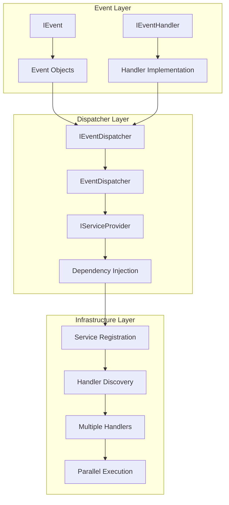
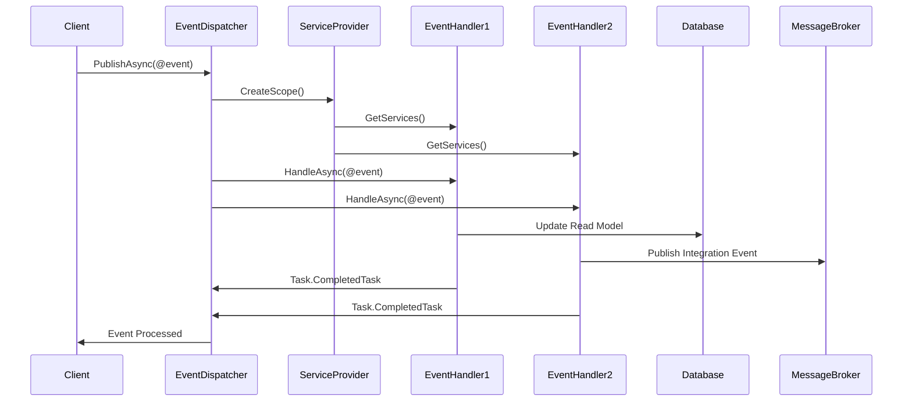
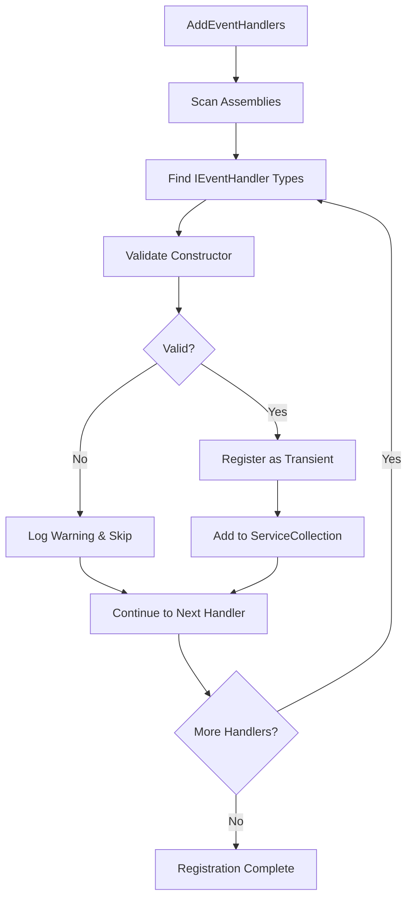
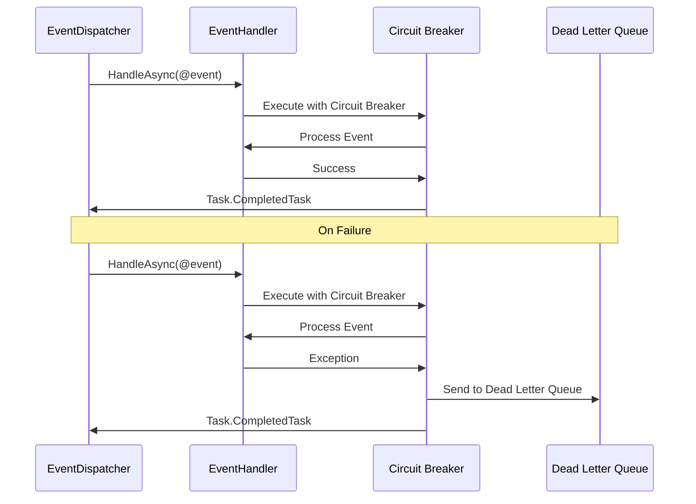

# Mamey.CQRS.Events

The Mamey.CQRS.Events library provides a complete implementation of the Event pattern for CQRS (Command Query Responsibility Segregation) architecture. It implements event-driven architecture with support for multiple handlers, automatic discovery, and cross-cutting concerns through decorators.

## Introduction to Events

**Events** represent something that has already occurred — they signal a fact, not a request.

Events are:
* **Past-tense** (e.g., *AccountCreated*, *PaymentFailed*)
* **Immutable**
* **Asynchronous** — consumers may respond later or in parallel

Events are used to:
- Notify other parts of the system about state changes
- Trigger side effects and integrations
- Maintain eventual consistency across bounded contexts
- Enable event sourcing and audit trails

## Technical Overview

Mamey.CQRS.Events implements several key patterns:

- **Event-Driven Architecture**: Decouples components through asynchronous event processing
- **Observer Pattern**: Multiple handlers can subscribe to the same event type
- **Dependency Injection**: Seamless integration with .NET DI container for handler resolution
- **Auto-Discovery**: Uses reflection to automatically discover and register event handlers
- **Decorator Pattern**: Built-in support for cross-cutting concerns (logging, validation, transactions)
- **Scoped Resolution**: Each event execution creates a new DI scope for proper lifetime management

## Architecture

The library follows a publish-subscribe architecture:



### CQRS Event Flow



### Event Handler Registration Flow



### Event Processing with Circuit Breaker



## Core Components

### Event Interface
- **IEvent**: Marker interface extending `IMessage` for all event objects
- **Immutable**: Events should be immutable using `record` types
- **Serializable**: Events can be serialized for message brokering and persistence

### Event Handlers
- **IEventHandler<T>**: Generic interface for event processing
- **Multiple Handlers**: Multiple handlers can process the same event type
- **Async Support**: Full async/await support with cancellation tokens
- **Single Responsibility**: Each handler should have a single responsibility

### Event Dispatcher
- **IEventDispatcher**: Centralized dispatching mechanism
- **Scoped Resolution**: Creates new DI scope for each event execution
- **Multiple Handler Support**: Resolves and executes all handlers for an event type
- **Error Handling**: Built-in error handling and logging

## Installation

### NuGet Package
```bash
dotnet add package Mamey.CQRS.Events
```

### Prerequisites
- .NET 9.0 or later
- Mamey (core framework)

## Key Features

- **Event Pattern**: Clean separation of events from business logic
- **Async Support**: Full async/await support for event handling
- **Multiple Handlers**: Support for multiple handlers per event type
- **Dependency Injection**: Seamless integration with .NET DI container
- **Auto-Discovery**: Automatic registration of event handlers
- **Decorator Pattern**: Support for cross-cutting concerns
- **Cancellation Support**: Built-in cancellation token support

## Quick Start

### Basic Setup

```csharp
using Mamey;
using Mamey.CQRS.Events;

var builder = WebApplication.CreateBuilder(args);

// Create Mamey builder
var mameyBuilder = MameyBuilder.Create(builder.Services, builder.Configuration);

// Add event handlers and dispatcher
mameyBuilder
    .AddEventHandlers()
    .AddInMemoryEventDispatcher();

var app = builder.Build();
app.Run();
```

### Define Events

```csharp
using Mamey.CQRS.Events;

// Domain events
public record UserCreatedEvent(Guid UserId, string Name, string Email, DateTime CreatedAt) : IEvent;

public record UserUpdatedEvent(Guid UserId, string Name, string Email, DateTime UpdatedAt) : IEvent;

public record UserDeletedEvent(Guid UserId, DateTime DeletedAt) : IEvent;

// Integration events
public record OrderPlacedEvent(Guid OrderId, Guid CustomerId, decimal TotalAmount, DateTime PlacedAt) : IEvent;

public record PaymentProcessedEvent(Guid OrderId, string TransactionId, decimal Amount, DateTime ProcessedAt) : IEvent;
```

### Implement Event Handlers

```csharp
using Mamey.CQRS.Events;

public class UserCreatedEventHandler : IEventHandler<UserCreatedEvent>
{
    private readonly ILogger<UserCreatedEventHandler> _logger;
    private readonly IEmailService _emailService;

    public UserCreatedEventHandler(
        ILogger<UserCreatedEventHandler> logger,
        IEmailService emailService)
    {
        _logger = logger;
        _emailService = emailService;
    }

    public async Task HandleAsync(UserCreatedEvent @event, CancellationToken cancellationToken = default)
    {
        _logger.LogInformation("User created: {UserId} - {Name} ({Email})", 
            @event.UserId, @event.Name, @event.Email);

        // Send welcome email
        await _emailService.SendWelcomeEmailAsync(@event.Email, @event.Name);
    }
}

public class UserCreatedAuditEventHandler : IEventHandler<UserCreatedEvent>
{
    private readonly IAuditService _auditService;

    public UserCreatedAuditEventHandler(IAuditService auditService)
    {
        _auditService = auditService;
    }

    public async Task HandleAsync(UserCreatedEvent @event, CancellationToken cancellationToken = default)
    {
        // Log audit trail
        await _auditService.LogUserCreationAsync(@event.UserId, @event.Name, @event.Email);
    }
}

public class OrderPlacedEventHandler : IEventHandler<OrderPlacedEvent>
{
    private readonly IInventoryService _inventoryService;
    private readonly INotificationService _notificationService;

    public OrderPlacedEventHandler(
        IInventoryService inventoryService,
        INotificationService notificationService)
    {
        _inventoryService = inventoryService;
        _notificationService = notificationService;
    }

    public async Task HandleAsync(OrderPlacedEvent @event, CancellationToken cancellationToken = default)
    {
        // Reserve inventory
        await _inventoryService.ReserveItemsAsync(@event.OrderId);

        // Send notification
        await _notificationService.NotifyOrderPlacedAsync(@event.CustomerId, @event.OrderId);
    }
}
```

### Publish Events

```csharp
using Mamey.CQRS.Events;

public class UserService
{
    private readonly IUserRepository _userRepository;
    private readonly IEventDispatcher _eventDispatcher;

    public UserService(IUserRepository userRepository, IEventDispatcher eventDispatcher)
    {
        _userRepository = userRepository;
        _eventDispatcher = eventDispatcher;
    }

    public async Task<User> CreateUserAsync(string name, string email)
    {
        var user = new User(Guid.NewGuid(), name, email);
        await _userRepository.AddAsync(user);

        // Publish domain event
        var @event = new UserCreatedEvent(user.Id, user.Name, user.Email, user.CreatedAt);
        await _eventDispatcher.PublishAsync(@event);

        return user;
    }

    public async Task UpdateUserAsync(Guid userId, string name, string email)
    {
        var user = await _userRepository.GetByIdAsync(userId);
        if (user == null)
            throw new UserNotFoundException(userId);

        user.UpdateName(name);
        user.UpdateEmail(email);
        await _userRepository.UpdateAsync(user);

        // Publish domain event
        var @event = new UserUpdatedEvent(user.Id, user.Name, user.Email, DateTime.UtcNow);
        await _eventDispatcher.PublishAsync(@event);
    }
}
```

## API Reference

### Core Interfaces

#### IEvent

Marker interface for all events.

```csharp
public interface IEvent : IMessage
{
}
```

**Usage:**
```csharp
public record UserCreatedEvent(Guid UserId, string Name, string Email) : IEvent;
public record OrderPlacedEvent(Guid OrderId, decimal Amount) : IEvent;
public record PaymentProcessedEvent(Guid OrderId, string TransactionId) : IEvent;
```

#### IEventHandler<TEvent>

Interface for event handlers. This is the core abstraction for implementing event processing logic.

```csharp
public interface IEventHandler<in TEvent> where TEvent : class, IEvent
{
    Task HandleAsync(TEvent @event, CancellationToken cancellationToken = default);
}
```

**Generic Parameters:**
- `TEvent`: The type of event to handle (must implement `IEvent`)

**Methods:**
- `HandleAsync(TEvent @event, CancellationToken cancellationToken = default)`: Handles the event asynchronously

**Implementation Requirements:**
- **Single Responsibility**: Each handler should have a single, well-defined responsibility
- **Async Operations**: Use async/await for all I/O operations
- **Error Handling**: Handle exceptions appropriately and consider retry strategies
- **Idempotency**: Make handlers idempotent when possible to handle duplicate events
- **Validation**: Validate event data before processing

**Lifetime Management:**
- Handlers are registered with `Transient` lifetime by default
- Each event execution gets a new handler instance
- Use `AddScopedEventHandlers()` for scoped lifetime if needed

**Multiple Handler Support:**
- Multiple handlers can be registered for the same event type
- All handlers will be executed when an event is published
- Handlers are executed in the order they were registered
- If one handler fails, other handlers will still be executed

#### IEventDispatcher

Interface for event dispatching.

```csharp
public interface IEventDispatcher
{
    Task PublishAsync<T>(T @event, CancellationToken cancellationToken = default) where T : class, IEvent;
}
```

**Methods:**
- `PublishAsync<T>(T @event, CancellationToken cancellationToken = default)`: Publishes an event to all registered handlers

### Core Classes

#### EventDispatcher

Default implementation of event dispatcher.

```csharp
internal sealed class EventDispatcher : IEventDispatcher
{
    public EventDispatcher(IServiceProvider serviceProvider);
    public async Task PublishAsync<T>(T @event, CancellationToken cancellationToken = default) 
        where T : class, IEvent;
}
```

**Features:**
- **Scoped Resolution**: Creates a new scope for each event
- **Multiple Handlers**: Supports multiple handlers per event type
- **Handler Resolution**: Automatically resolves all handlers for an event
- **Error Handling**: Built-in error handling and logging

### Extension Methods

#### AddEventHandlers

Registers event handlers with transient lifetime.

```csharp
public static IMameyBuilder AddEventHandlers(this IMameyBuilder builder, IEnumerable<Assembly>? assemblies = null)
```

**Parameters:**
- `builder`: The Mamey builder
- `assemblies`: Optional assemblies to scan (defaults to current domain assemblies)

**Returns:**
- `IMameyBuilder`: The builder for chaining

#### AddScopedEventHandlers

Registers event handlers with scoped lifetime.

```csharp
public static IMameyBuilder AddScopedEventHandlers(this IMameyBuilder builder, IEnumerable<Assembly> assemblies)
```

#### AddInMemoryEventDispatcher

Registers the in-memory event dispatcher.

```csharp
public static IMameyBuilder AddInMemoryEventDispatcher(this IMameyBuilder builder)
```

## Usage Examples

### Example 1: Simple Event Handler

```csharp
using Mamey.CQRS.Events;

public class SendEmailEvent : IEvent
{
    public string To { get; init; }
    public string Subject { get; init; }
    public string Body { get; init; }
}

public class SendEmailEventHandler : IEventHandler<SendEmailEvent>
{
    private readonly IEmailService _emailService;

    public SendEmailEventHandler(IEmailService emailService)
    {
        _emailService = emailService;
    }

    public async Task HandleAsync(SendEmailEvent @event, CancellationToken cancellationToken = default)
    {
        await _emailService.SendAsync(@event.To, @event.Subject, @event.Body);
    }
}

// Usage
public class EmailService
{
    private readonly IEventDispatcher _eventDispatcher;

    public EmailService(IEventDispatcher eventDispatcher)
    {
        _eventDispatcher = eventDispatcher;
    }

    public async Task SendEmailAsync(string to, string subject, string body)
    {
        var @event = new SendEmailEvent { To = to, Subject = subject, Body = body };
        await _eventDispatcher.PublishAsync(@event);
    }
}
```

### Example 2: Multiple Event Handlers with Error Handling

```csharp
using Mamey.CQRS.Events;

public class OrderPlacedEvent : IEvent
{
    public Guid OrderId { get; init; }
    public Guid CustomerId { get; init; }
    public decimal TotalAmount { get; init; }
    public DateTime PlacedAt { get; init; }
    public List<OrderItem> Items { get; init; } = new();
}

// Inventory handler with retry logic
public class OrderPlacedInventoryHandler : IEventHandler<OrderPlacedEvent>
{
    private readonly IInventoryService _inventoryService;
    private readonly ILogger<OrderPlacedInventoryHandler> _logger;

    public OrderPlacedInventoryHandler(
        IInventoryService inventoryService,
        ILogger<OrderPlacedInventoryHandler> logger)
    {
        _inventoryService = inventoryService;
        _logger = logger;
    }

    public async Task HandleAsync(OrderPlacedEvent @event, CancellationToken cancellationToken = default)
    {
        _logger.LogInformation("Processing inventory reservation for order {OrderId}", @event.OrderId);

        try
        {
            // Reserve inventory for each item
            foreach (var item in @event.Items)
            {
                await _inventoryService.ReserveItemAsync(item.ProductId, item.Quantity, cancellationToken);
            }

            _logger.LogInformation("Inventory reserved successfully for order {OrderId}", @event.OrderId);
        }
        catch (InsufficientStockException ex)
        {
            _logger.LogWarning("Insufficient stock for order {OrderId}: {Error}", @event.OrderId, ex.Message);
            // Don't rethrow - let other handlers continue processing
        }
        catch (Exception ex)
        {
            _logger.LogError(ex, "Error reserving inventory for order {OrderId}", @event.OrderId);
            throw; // Rethrow unexpected errors
        }
    }
}

// Notification handler with circuit breaker pattern
public class OrderPlacedNotificationHandler : IEventHandler<OrderPlacedEvent>
{
    private readonly INotificationService _notificationService;
    private readonly ILogger<OrderPlacedNotificationHandler> _logger;
    private readonly ICircuitBreaker _circuitBreaker;

    public OrderPlacedNotificationHandler(
        INotificationService notificationService,
        ILogger<OrderPlacedNotificationHandler> logger,
        ICircuitBreaker circuitBreaker)
    {
        _notificationService = notificationService;
        _logger = logger;
        _circuitBreaker = circuitBreaker;
    }

    public async Task HandleAsync(OrderPlacedEvent @event, CancellationToken cancellationToken = default)
    {
        _logger.LogInformation("Sending notification for order {OrderId}", @event.OrderId);

        try
        {
            await _circuitBreaker.ExecuteAsync(async () =>
            {
                await _notificationService.NotifyOrderPlacedAsync(@event.CustomerId, @event.OrderId, cancellationToken);
            });

            _logger.LogInformation("Notification sent successfully for order {OrderId}", @event.OrderId);
        }
        catch (CircuitBreakerOpenException)
        {
            _logger.LogWarning("Circuit breaker is open, skipping notification for order {OrderId}", @event.OrderId);
            // Don't rethrow - notification failure shouldn't stop other handlers
        }
        catch (Exception ex)
        {
            _logger.LogError(ex, "Error sending notification for order {OrderId}", @event.OrderId);
            // Don't rethrow - notification failure shouldn't stop other handlers
        }
    }
}

// Audit handler with idempotency
public class OrderPlacedAuditHandler : IEventHandler<OrderPlacedEvent>
{
    private readonly IAuditService _auditService;
    private readonly ILogger<OrderPlacedAuditHandler> _logger;

    public OrderPlacedAuditHandler(
        IAuditService auditService,
        ILogger<OrderPlacedAuditHandler> logger)
    {
        _auditService = auditService;
        _logger = logger;
    }

    public async Task HandleAsync(OrderPlacedEvent @event, CancellationToken cancellationToken = default)
    {
        _logger.LogInformation("Logging audit trail for order {OrderId}", @event.OrderId);

        try
        {
            // Check if already logged (idempotency)
            var alreadyLogged = await _auditService.IsOrderPlacedLoggedAsync(@event.OrderId, cancellationToken);
            if (alreadyLogged)
            {
                _logger.LogInformation("Order {OrderId} already logged, skipping", @event.OrderId);
                return;
            }

            await _auditService.LogOrderPlacedAsync(
                @event.OrderId, 
                @event.CustomerId, 
                @event.TotalAmount, 
                @event.PlacedAt, 
                cancellationToken);

            _logger.LogInformation("Audit trail logged successfully for order {OrderId}", @event.OrderId);
        }
        catch (Exception ex)
        {
            _logger.LogError(ex, "Error logging audit trail for order {OrderId}", @event.OrderId);
            throw; // Audit failures should be retried
        }
    }
}
```

**Key Technical Points:**
- **Error Handling**: Each handler has appropriate error handling strategies
- **Idempotency**: Audit handler checks for duplicate processing
- **Circuit Breaker**: Notification handler uses circuit breaker for resilience
- **Logging**: Structured logging with relevant context information
- **Non-blocking**: Handler failures don't prevent other handlers from executing
- **Retry Logic**: Appropriate retry strategies for different types of failures

### Example 3: Event with Error Handling

```csharp
using Mamey.CQRS.Events;

public class ProcessPaymentEvent : IEvent
{
    public Guid OrderId { get; init; }
    public decimal Amount { get; init; }
    public string PaymentMethod { get; init; }
}

public class ProcessPaymentEventHandler : IEventHandler<ProcessPaymentEvent>
{
    private readonly IPaymentService _paymentService;
    private readonly ILogger<ProcessPaymentEventHandler> _logger;

    public ProcessPaymentEventHandler(
        IPaymentService paymentService,
        ILogger<ProcessPaymentEventHandler> logger)
    {
        _paymentService = paymentService;
        _logger = logger;
    }

    public async Task HandleAsync(ProcessPaymentEvent @event, CancellationToken cancellationToken = default)
    {
        try
        {
            _logger.LogInformation("Processing payment for order {OrderId}", @event.OrderId);

            var result = await _paymentService.ProcessPaymentAsync(
                @event.OrderId, 
                @event.Amount, 
                @event.PaymentMethod, 
                cancellationToken);

            if (result.Success)
            {
                _logger.LogInformation("Payment processed successfully for order {OrderId}", @event.OrderId);
            }
            else
            {
                _logger.LogWarning("Payment failed for order {OrderId}: {Error}", @event.OrderId, result.ErrorMessage);
            }
        }
        catch (Exception ex)
        {
            _logger.LogError(ex, "Error processing payment for order {OrderId}", @event.OrderId);
            throw;
        }
    }
}
```

### Example 4: Event Decorator

```csharp
using Mamey.CQRS.Events;
using Mamey.Types;

[Decorator]
public class LoggingEventHandlerDecorator<TEvent> : IEventHandler<TEvent> 
    where TEvent : class, IEvent
{
    private readonly IEventHandler<TEvent> _handler;
    private readonly ILogger<LoggingEventHandlerDecorator<TEvent>> _logger;

    public LoggingEventHandlerDecorator(
        IEventHandler<TEvent> handler,
        ILogger<LoggingEventHandlerDecorator<TEvent>> logger)
    {
        _handler = handler;
        _logger = logger;
    }

    public async Task HandleAsync(TEvent @event, CancellationToken cancellationToken = default)
    {
        var eventName = typeof(TEvent).Name;
        _logger.LogInformation("Handling event: {EventName}", eventName);

        try
        {
            await _handler.HandleAsync(@event, cancellationToken);
            _logger.LogInformation("Event handled successfully: {EventName}", eventName);
        }
        catch (Exception ex)
        {
            _logger.LogError(ex, "Error handling event: {EventName}", eventName);
            throw;
        }
    }
}
```

### Example 5: Event Sourcing

```csharp
using Mamey.CQRS.Events;
using Mamey.Types;

public class User : AggregateRoot<UserId>
{
    public string Name { get; private set; }
    public string Email { get; private set; }
    public DateTime CreatedAt { get; private set; }

    private User() { }

    public User(UserId id, string name, string email) : base(id)
    {
        Name = name;
        Email = email;
        CreatedAt = DateTime.UtcNow;
        
        // Add domain event
        AddEvent(new UserCreatedEvent(Id, Name, Email, CreatedAt));
    }

    public void UpdateName(string newName)
    {
        Name = newName;
        AddEvent(new UserNameUpdatedEvent(Id, newName));
    }

    public void UpdateEmail(string newEmail)
    {
        Email = newEmail;
        AddEvent(new UserEmailUpdatedEvent(Id, newEmail));
    }
}

// Event handlers for event sourcing
public class UserCreatedEventHandler : IEventHandler<UserCreatedEvent>
{
    private readonly IUserRepository _userRepository;

    public UserCreatedEventHandler(IUserRepository userRepository)
    {
        _userRepository = userRepository;
    }

    public async Task HandleAsync(UserCreatedEvent @event, CancellationToken cancellationToken = default)
    {
        // Rebuild user from events
        var user = new User(@event.UserId, @event.Name, @event.Email);
        await _userRepository.SaveAsync(user);
    }
}

public class UserNameUpdatedEventHandler : IEventHandler<UserNameUpdatedEvent>
{
    private readonly IUserRepository _userRepository;

    public UserNameUpdatedEventHandler(IUserRepository userRepository)
    {
        _userRepository = userRepository;
    }

    public async Task HandleAsync(UserNameUpdatedEvent @event, CancellationToken cancellationToken = default)
    {
        var user = await _userRepository.GetByIdAsync(@event.UserId);
        if (user != null)
        {
            user.UpdateName(@event.NewName);
            await _userRepository.SaveAsync(user);
        }
    }
}
```

## Integration Patterns

### Integration with Other Mamey Libraries

The CQRS Events library integrates seamlessly with other Mamey libraries:

- **Mamey.CQRS.Commands**: Commands can trigger events
- **Mamey.MessageBrokers**: Events can be published to message brokers
- **Mamey.Persistence**: Events can be persisted for event sourcing
- **Mamey.Logging**: Built-in logging support for event handlers

### Integration with Message Brokers

```csharp
// Custom event dispatcher that publishes to message broker
public class MessageBrokerEventDispatcher : IEventDispatcher
{
    private readonly IMessageBroker _messageBroker;

    public MessageBrokerEventDispatcher(IMessageBroker messageBroker)
    {
        _messageBroker = messageBroker;
    }

    public async Task PublishAsync<T>(T @event, CancellationToken cancellationToken = default) 
        where T : class, IEvent
    {
        await _messageBroker.PublishAsync(@event, cancellationToken);
    }
}
```

### Integration with ASP.NET Core

```csharp
// Program.cs
var builder = WebApplication.CreateBuilder(args);

var mameyBuilder = MameyBuilder.Create(builder.Services, builder.Configuration);
mameyBuilder
    .AddEventHandlers()
    .AddInMemoryEventDispatcher();

var app = builder.Build();

// Service that publishes events
public class OrderService
{
    private readonly IEventDispatcher _eventDispatcher;

    public OrderService(IEventDispatcher eventDispatcher)
    {
        _eventDispatcher = eventDispatcher;
    }

    public async Task PlaceOrderAsync(Order order)
    {
        // Business logic
        await ProcessOrderAsync(order);

        // Publish event
        var @event = new OrderPlacedEvent(order.Id, order.CustomerId, order.TotalAmount, DateTime.UtcNow);
        await _eventDispatcher.PublishAsync(@event);
    }
}
```

## Configuration Reference

### Service Registration

```csharp
// Register event handlers
mameyBuilder.AddEventHandlers();

// Register with specific assemblies
mameyBuilder.AddEventHandlers(new[] { typeof(Program).Assembly });

// Register with scoped lifetime
mameyBuilder.AddScopedEventHandlers(new[] { typeof(Program).Assembly });

// Register event dispatcher
mameyBuilder.AddInMemoryEventDispatcher();
```

### Custom Event Dispatcher

```csharp
// Register custom dispatcher
builder.Services.AddSingleton<IEventDispatcher, CustomEventDispatcher>();

public class CustomEventDispatcher : IEventDispatcher
{
    public async Task PublishAsync<T>(T @event, CancellationToken cancellationToken = default) 
        where T : class, IEvent
    {
        // Custom implementation
    }
}
```

## Best Practices

1. **Event Naming**: Use descriptive names ending with "Event" (e.g., `UserCreatedEvent`)
2. **Immutable Events**: Make events immutable using `record` types
3. **Single Responsibility**: Each event should represent a single business occurrence
4. **Error Handling**: Handle errors appropriately in event handlers
5. **Logging**: Add logging for event processing
6. **Testing**: Write unit tests for event handlers
7. **Async Operations**: Use async/await for all I/O operations
8. **Idempotency**: Make event handlers idempotent when possible

## Troubleshooting

### Common Issues

**Handler Not Found**: Ensure the event handler is registered and implements `IEventHandler<T>`

**Multiple Handlers**: Remember that multiple handlers can be registered for the same event type

**Circular Dependencies**: Avoid circular dependencies in event handlers

**Event Not Published**: Ensure the event dispatcher is properly registered

### Debugging

Enable detailed logging to troubleshoot issues:

```csharp
builder.Logging.AddConsole();
builder.Logging.SetMinimumLevel(LogLevel.Debug);
```

## Related Libraries

- [Mamey.CQRS.Commands](cqrs-commands.md) - Command pattern implementation
- [Mamey.CQRS.Queries](cqrs-queries.md) - Query pattern implementation
- [Mamey.MessageBrokers](../messaging/messagebrokers.md) - Message broker integration
- [Mamey.Microservice.Infrastructure](../core/microservice-infrastructure.md) - Microservice infrastructure

## Additional Resources

- CQRS Pattern Guide
- Event Sourcing Guide
- Event-Driven Architecture
- Testing Events
