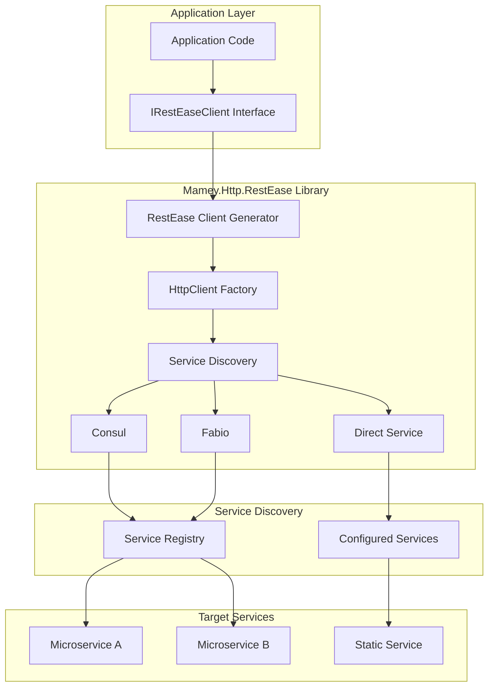
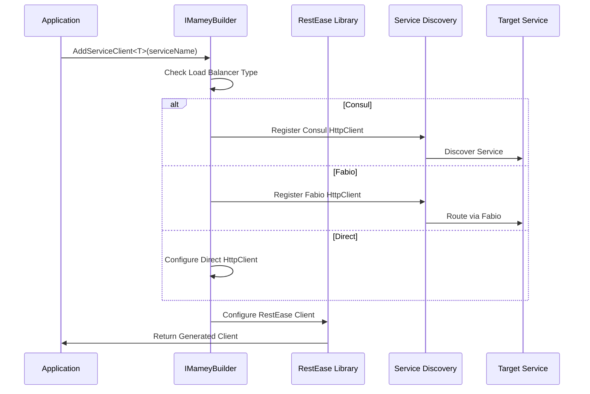
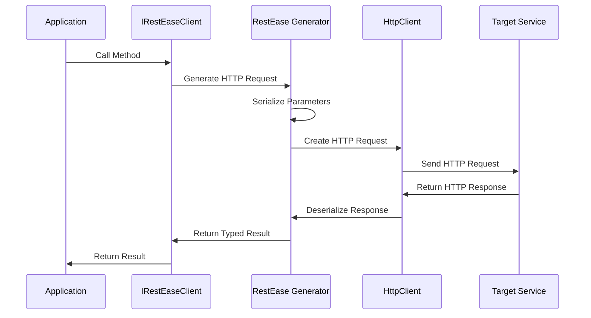

# Mamey.Http.RestEase

**Library**: `Mamey.Http.RestEase`  
**Location**: `Mamey/src/Mamey.Http.RestEase/`  
**Type**: HTTP Client Library - RestEase Integration  
**Version**: 2.0.*  
**Files**: 7 C# files  
**Namespace**: `Mamey.Http.RestEase`, `Mamey.Http.RestEase.Builders`, `Mamey.Http.RestEase.Serializers`

## Overview

Mamey.Http.RestEase provides RestEase integration for strongly-typed HTTP client interfaces in the Mamey framework. It enables type-safe HTTP client generation from interface definitions with seamless integration with Mamey's service discovery (Consul, Fabio) and load balancing infrastructure.

### Conceptual Foundation

**RestEase** is a type-safe HTTP client library that generates HTTP clients from interface definitions. Key concepts:

1. **Interface-Based Clients**: Define HTTP clients as C# interfaces
2. **Automatic Generation**: RestEase automatically generates HTTP client implementations
3. **Attribute-Based Configuration**: Configure HTTP methods, paths, and parameters via attributes
4. **Type Safety**: Compile-time type safety for HTTP operations
5. **Service Discovery**: Integration with Consul and Fabio for service discovery
6. **Load Balancing**: Support for load balancing via Consul or Fabio

**Why Mamey.Http.RestEase?**

Provides:
- **Type-Safe HTTP Clients**: Interface-based HTTP clients with compile-time safety
- **Automatic Generation**: Automatic HTTP client implementation generation
- **Attribute-Based Configuration**: Declarative endpoint configuration via attributes
- **Service Discovery Integration**: Seamless integration with Consul and Fabio
- **Load Balancing**: Built-in support for load balancing
- **Mamey Integration**: Full integration with Mamey framework infrastructure

**Use Cases:**
- Microservice-to-microservice communication
- Type-safe API clients
- Service discovery integration
- Load balanced HTTP clients
- Multi-service architectures

## Architecture

### RestEase Integration Architecture



### Service Registration Flow



### HTTP Client Generation Flow



## Core Components

### Extension Methods

#### AddServiceClient<T> - Register Service Client

Registers a RestEase client for a service with service discovery:

```csharp
public static IMameyBuilder AddServiceClient<T>(
    this IMameyBuilder builder,
    string serviceName,
    string sectionName = "restEase",
    string consulSectionName = "consul",
    string fabioSectionName = "fabio",
    string httpClientSectionName = "httpClient")
    where T : class
```

**Features:**
- Registers RestEase client for service
- Integrates with service discovery (Consul/Fabio)
- Configures load balancing
- Supports multiple service configurations

**Usage:**
```csharp
builder.Services
    .AddMamey()
    .AddServiceClient<IUserServiceClient>("user-service");
```

### RestEaseOptions - Configuration Options

Configuration options for RestEase clients:

```csharp
public class RestEaseOptions
{
    public string LoadBalancer { get; set; } // "consul", "fabio", or null for direct
    public IEnumerable<Service> Services { get; set; }

    public class Service
    {
        public string Name { get; set; }
        public string Scheme { get; set; } // "http" or "https"
        public string Host { get; set; }
        public int Port { get; set; }
    }
}
```

### IRestEaseOptionsBuilder - Options Builder Interface

Fluent builder interface for configuring RestEase options:

```csharp
public interface IRestEaseOptionsBuilder
{
    IRestEaseOptionsBuilder WithLoadBalancer(string loadBalancer);
    IRestEaseOptionsBuilder WithService(
        Func<IRestEaseServiceBuilder, IRestEaseServiceBuilder> buildService);
    RestEaseOptions Build();
}
```

### IRestEaseServiceBuilder - Service Builder Interface

Fluent builder interface for configuring services:

```csharp
public interface IRestEaseServiceBuilder
{
    IRestEaseServiceBuilder WithName(string name);
    IRestEaseServiceBuilder WithScheme(string scheme);
    IRestEaseServiceBuilder WithHost(string host);
    IRestEaseServiceBuilder WithPort(int port);
    RestEaseOptions.Service Build();
}
```

### QueryParamSerializer - Query Parameter Serializer

Custom query parameter serializer for RestEase:

```csharp
public class QueryParamSerializer : RequestQueryParamSerializer
{
    // Custom serialization logic for query parameters
}
```

### RestEaseServiceNotFoundException - Exception

Exception thrown when a service is not found in configuration:

```csharp
public class RestEaseServiceNotFoundException : Exception
{
    public string ServiceName { get; }

    public RestEaseServiceNotFoundException(
        string message,
        string serviceName)
        : base(message)
    {
        ServiceName = serviceName;
    }
}
```

## Installation

### Prerequisites

1. **RestEase**: RestEase library for HTTP client generation
2. **Mamey.Http**: Base HTTP client library
3. **Mamey.Discovery.Consul**: Consul service discovery (optional)
4. **Mamey.LoadBalancing.Fabio**: Fabio load balancing (optional)
5. **.NET 9.0**: Ensure .NET 9.0 SDK is installed

### NuGet Package

```bash
dotnet add package Mamey.Http.RestEase
```

### Dependencies

- **Mamey** - Core framework
- **Mamey.Http** - Base HTTP client library
- **RestEase** - Type-safe HTTP client library
- **Mamey.Discovery.Consul** - Consul service discovery (optional)
- **Mamey.LoadBalancing.Fabio** - Fabio load balancing (optional)

## Quick Start

### Basic Setup

```csharp
using Mamey;
using Mamey.Http.RestEase;

var builder = WebApplication.CreateBuilder(args);

// Add RestEase service client
builder.Services
    .AddMamey()
    .AddServiceClient<IUserServiceClient>("user-service");
```

### Configuration

Add to `appsettings.json`:

```json
{
  "restEase": {
    "loadBalancer": "fabio",
    "services": [
      {
        "name": "user-service",
        "scheme": "http",
        "host": "localhost",
        "port": 5001
      },
      {
        "name": "order-service",
        "scheme": "http",
        "host": "localhost",
        "port": 5002
      }
    ]
  }
}
```

## Usage Examples

### Example 1: Define HTTP Client Interface

```csharp
using RestEase;

public interface IUserServiceClient
{
    [Get("/api/users/{id}")]
    Task<UserDto> GetUserAsync([Path] Guid id);

    [Get("/api/users")]
    Task<List<UserDto>> GetUsersAsync([Query] int page = 1, [Query] int pageSize = 10);

    [Post("/api/users")]
    Task<UserDto> CreateUserAsync([Body] CreateUserRequest request);

    [Put("/api/users/{id}")]
    Task<UserDto> UpdateUserAsync([Path] Guid id, [Body] UpdateUserRequest request);

    [Delete("/api/users/{id}")]
    Task DeleteUserAsync([Path] Guid id);
}
```

### Example 2: Register and Use Service Client

```csharp
using Mamey.Http.RestEase;

public class Program
{
    public static void Main(string[] args)
    {
        var builder = WebApplication.CreateBuilder(args);

        // Register RestEase service client
        builder.Services
            .AddMamey()
            .AddServiceClient<IUserServiceClient>("user-service");

        var app = builder.Build();
        app.Run();
    }
}

// Use in service
public class OrderService
{
    private readonly IUserServiceClient _userClient;
    private readonly ILogger<OrderService> _logger;

    public OrderService(
        IUserServiceClient userClient,
        ILogger<OrderService> logger)
    {
        _userClient = userClient;
        _logger = logger;
    }

    public async Task<UserDto> GetUserAsync(Guid userId)
    {
        try
        {
            _logger.LogInformation("Retrieving user: {UserId}", userId);
            return await _userClient.GetUserAsync(userId);
        }
        catch (Exception ex)
        {
            _logger.LogError(ex, "Failed to retrieve user: {UserId}", userId);
            throw;
        }
    }

    public async Task<UserDto> CreateUserAsync(CreateUserRequest request)
    {
        try
        {
            _logger.LogInformation("Creating user: {Email}", request.Email);
            return await _userClient.CreateUserAsync(request);
        }
        catch (Exception ex)
        {
            _logger.LogError(ex, "Failed to create user: {Email}", request.Email);
            throw;
        }
    }
}
```

### Example 3: Multiple Service Clients

```csharp
using Mamey.Http.RestEase;

// Define multiple service client interfaces
public interface IUserServiceClient
{
    [Get("/api/users/{id}")]
    Task<UserDto> GetUserAsync([Path] Guid id);
}

public interface IOrderServiceClient
{
    [Get("/api/orders/{id}")]
    Task<OrderDto> GetOrderAsync([Path] Guid id);
}

public interface IPaymentServiceClient
{
    [Post("/api/payments")]
    Task<PaymentDto> ProcessPaymentAsync([Body] PaymentRequest request);
}

// Register all service clients
builder.Services
    .AddMamey()
    .AddServiceClient<IUserServiceClient>("user-service")
    .AddServiceClient<IOrderServiceClient>("order-service")
    .AddServiceClient<IPaymentServiceClient>("payment-service");

// Use in service
public class OrderProcessingService
{
    private readonly IUserServiceClient _userClient;
    private readonly IOrderServiceClient _orderClient;
    private readonly IPaymentServiceClient _paymentClient;

    public OrderProcessingService(
        IUserServiceClient userClient,
        IOrderServiceClient orderClient,
        IPaymentServiceClient paymentClient)
    {
        _userClient = userClient;
        _orderClient = orderClient;
        _paymentClient = paymentClient;
    }

    public async Task<OrderDto> ProcessOrderAsync(Guid orderId, Guid userId)
    {
        // Get user
        var user = await _userClient.GetUserAsync(userId);

        // Get order
        var order = await _orderClient.GetOrderAsync(orderId);

        // Process payment
        var payment = await _paymentClient.ProcessPaymentAsync(
            new PaymentRequest
            {
                OrderId = orderId,
                Amount = order.Total,
                UserId = userId
            });

        return order;
    }
}
```

### Example 4: Service Discovery with Consul

```csharp
using Mamey.Http.RestEase;

// Configure with Consul service discovery
builder.Services
    .AddMamey()
    .AddServiceClient<IUserServiceClient>(
        "user-service",
        sectionName: "restEase",
        consulSectionName: "consul");

// Configuration
{
  "restEase": {
    "loadBalancer": "consul",
    "services": [
      {
        "name": "user-service",
        "scheme": "http",
        "host": "user-service",
        "port": 80
      }
    ]
  },
  "consul": {
    "enabled": true,
    "url": "http://localhost:8500"
  }
}
```

### Example 5: Service Discovery with Fabio

```csharp
using Mamey.Http.RestEase;

// Configure with Fabio load balancing
builder.Services
    .AddMamey()
    .AddServiceClient<IUserServiceClient>(
        "user-service",
        sectionName: "restEase",
        fabioSectionName: "fabio");

// Configuration
{
  "restEase": {
    "loadBalancer": "fabio",
    "services": [
      {
        "name": "user-service",
        "scheme": "http",
        "host": "user-service",
        "port": 80
      }
    ]
  },
  "fabio": {
    "enabled": true,
    "url": "http://localhost:9998"
  }
}
```

### Example 6: Direct Service Configuration (No Load Balancer)

```csharp
using Mamey.Http.RestEase;

// Configure direct service (no load balancer)
builder.Services
    .AddMamey()
    .AddServiceClient<IUserServiceClient>("user-service");

// Configuration
{
  "restEase": {
    "loadBalancer": null,
    "services": [
      {
        "name": "user-service",
        "scheme": "http",
        "host": "localhost",
        "port": 5001
      }
    ]
  }
}
```

### Example 7: Advanced Configuration with Builder

```csharp
using Mamey.Http.RestEase;

// Configure with fluent builder
builder.Services
    .AddMamey()
    .AddServiceClient<IUserServiceClient>(
        "user-service",
        buildOptions: options => options
            .WithLoadBalancer("fabio")
            .WithService(service => service
                .WithName("user-service")
                .WithScheme("http")
                .WithHost("user-service")
                .WithPort(80)),
        buildConsulOptions: consul => consul,
        buildFabioOptions: fabio => fabio,
        httpClientOptions: new HttpClientOptions());
```

### Example 8: Query Parameters and Headers

```csharp
using RestEase;

public interface IUserServiceClient
{
    [Get("/api/users")]
    Task<List<UserDto>> GetUsersAsync(
        [Query] int page = 1,
        [Query] int pageSize = 10,
        [Query] string? search = null,
        [Query] UserStatus? status = null);

    [Get("/api/users/{id}")]
    [Header("X-Correlation-ID", "{correlationId}")]
    Task<UserDto> GetUserAsync(
        [Path] Guid id,
        [Header("X-Correlation-ID")] string correlationId);
}
```

### Example 9: Error Handling

```csharp
public class UserService
{
    private readonly IUserServiceClient _userClient;
    private readonly ILogger<UserService> _logger;

    public UserService(
        IUserServiceClient userClient,
        ILogger<UserService> logger)
    {
        _userClient = userClient;
        _logger = logger;
    }

    public async Task<UserDto?> GetUserAsync(Guid userId)
    {
        try
        {
            _logger.LogInformation("Retrieving user: {UserId}", userId);
            return await _userClient.GetUserAsync(userId);
        }
        catch (ApiException ex)
        {
            _logger.LogError(ex, "API error retrieving user: {UserId}, Status: {StatusCode}", 
                userId, ex.StatusCode);
            
            if (ex.StatusCode == HttpStatusCode.NotFound)
            {
                return null;
            }
            
            throw;
        }
        catch (HttpRequestException ex)
        {
            _logger.LogError(ex, "HTTP error retrieving user: {UserId}", userId);
            throw;
        }
        catch (Exception ex)
        {
            _logger.LogError(ex, "Unexpected error retrieving user: {UserId}", userId);
            throw;
        }
    }
}
```

## Best Practices

### 1. Use Descriptive Interface Names

**✅ Good: Clear interface names**
```csharp
public interface IUserServiceClient { }
public interface IOrderServiceClient { }
public interface IPaymentServiceClient { }
```

### 2. Organize by Service Boundaries

**✅ Good: One interface per service**
```csharp
// User Service
public interface IUserServiceClient
{
    [Get("/api/users/{id}")]
    Task<UserDto> GetUserAsync([Path] Guid id);
}

// Order Service
public interface IOrderServiceClient
{
    [Get("/api/orders/{id}")]
    Task<OrderDto> GetOrderAsync([Path] Guid id);
}
```

### 3. Use Service Discovery for Production

**✅ Good: Use Consul or Fabio for service discovery**
```csharp
builder.Services
    .AddMamey()
    .AddServiceClient<IUserServiceClient>("user-service"); // Uses Consul/Fabio
```

### 4. Handle Errors Gracefully

**✅ Good: Comprehensive error handling**
```csharp
try
{
    return await _userClient.GetUserAsync(userId);
}
catch (ApiException ex) when (ex.StatusCode == HttpStatusCode.NotFound)
{
    return null;
}
catch (ApiException ex)
{
    _logger.LogError(ex, "API error: {StatusCode}", ex.StatusCode);
    throw;
}
```

### 5. Use Async Methods

**✅ Good: All methods are async**
```csharp
[Get("/api/users/{id}")]
Task<UserDto> GetUserAsync([Path] Guid id);
```

### 6. Configure Services Properly

**✅ Good: Complete service configuration**
```json
{
  "restEase": {
    "loadBalancer": "fabio",
    "services": [
      {
        "name": "user-service",
        "scheme": "https",
        "host": "user-service.internal",
        "port": 443
      }
    ]
  }
}
```

## Troubleshooting

### Common Issues

#### Service Not Found

**Problem**: `RestEaseServiceNotFoundException: RestEase service: 'user-service' was not found`

**Solution**:
1. Verify service name matches configuration
2. Check service is registered in `restEase.services`
3. Ensure service name is case-insensitive match

```json
{
  "restEase": {
    "services": [
      {
        "name": "user-service", // Must match service name in AddServiceClient
        "scheme": "http",
        "host": "localhost",
        "port": 5001
      }
    ]
  }
}
```

#### Load Balancer Configuration

**Problem**: Service discovery not working.

**Solution**:
1. Verify load balancer type is correct ("consul" or "fabio")
2. Check Consul/Fabio is running and accessible
3. Verify service is registered in Consul/Fabio
4. Check network connectivity

#### HttpClient Not Registered

**Problem**: `InvalidOperationException: No service for type 'IHttpClientFactory'`

**Solution**:
1. Ensure `AddMamey()` is called before `AddServiceClient`
2. Verify HTTP client services are registered
3. Check service registration order

## Related Libraries

- **Mamey.Http**: Base HTTP client library
- **Mamey.Discovery.Consul**: Consul service discovery
- **Mamey.LoadBalancing.Fabio**: Fabio load balancing
- **RestEase**: Type-safe HTTP client library

## Additional Resources

- [RestEase Documentation](https://github.com/canton7/RestEase)
- [Mamey Framework Documentation](../)
- Mamey.Http.RestEase Memory Documentation

## Tags

#restease #http-client #type-safe #service-discovery #consul #fabio #mamey

