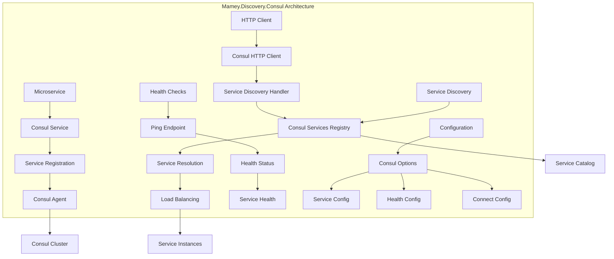

# Mamey.Discovery.Consul

A service discovery library for the Mamey framework, providing Consul integration for automatic service registration and discovery. This library enables microservices to register themselves with Consul and discover other services dynamically, supporting health checks, load balancing, and service mesh capabilities.

## Table of Contents

- [Overview](#overview)
- [Key Features](#key-features)
- [Architecture](#architecture)
- [Installation](#installation)
- [Quick Start](#quick-start)
- [Core Components](#core-components)
- [API Reference](#api-reference)
- [Usage Examples](#usage-examples)
- [Configuration](#configuration)
- [Best Practices](#best-practices)
- [Troubleshooting](#troubleshooting)

## Overview

Mamey.Discovery.Consul is a service discovery library that provides Consul integration for the Mamey framework. It enables microservices to register themselves with Consul and discover other services dynamically, supporting health checks, load balancing, and service mesh capabilities.

### Technical Overview

The library provides:

- **Service Registration**: Automatic service registration with Consul
- **Service Discovery**: Dynamic service discovery and resolution
- **Health Checks**: Built-in health check support
- **Load Balancing**: Service load balancing capabilities
- **Service Mesh**: Consul Connect integration
- **HTTP Client**: Consul-aware HTTP client
- **Configuration**: Flexible configuration options

## Key Features

### Core Features

- **Service Registration**: Automatic service registration with Consul
- **Service Discovery**: Dynamic service discovery and resolution
- **Health Checks**: Built-in health check support
- **Load Balancing**: Service load balancing capabilities
- **Service Mesh**: Consul Connect integration
- **HTTP Client**: Consul-aware HTTP client
- **Configuration**: Flexible configuration options

### Advanced Features

- **Custom Tags**: Support for custom service tags
- **Metadata**: Rich metadata support for services
- **Connect Integration**: Consul Connect service mesh support
- **Health Monitoring**: Comprehensive health monitoring
- **Service Filtering**: Service filtering and selection
- **Error Handling**: Comprehensive error handling and logging
- **Performance**: High-performance service discovery

## Architecture



## Installation

### Package Manager
```bash
Install-Package Mamey.Discovery.Consul
```

### .NET CLI
```bash
dotnet add package Mamey.Discovery.Consul
```

### PackageReference
```xml
<PackageReference Include="Mamey.Discovery.Consul" Version="2.0.*" />
```

## Quick Start

### Basic Setup

```csharp
using Mamey.Discovery.Consul;

var builder = WebApplication.CreateBuilder(args);

// Add Mamey services
builder.Services.AddMamey()
    .AddConsul();

var app = builder.Build();

app.Run();
```

### With Custom Configuration

```csharp
builder.Services.AddMamey()
    .AddConsul(options =>
    {
        options.Enabled = true;
        options.Url = "http://localhost:8500";
        options.Service = "my-service";
        options.Address = "localhost";
        options.Port = 5000;
        options.PingEnabled = true;
        options.PingEndpoint = "/health";
    });
```

### With Configuration File

```csharp
// appsettings.json
{
  "consul": {
    "enabled": true,
    "url": "http://localhost:8500",
    "service": "my-service",
    "address": "localhost",
    "port": 5000,
    "pingEnabled": true,
    "pingEndpoint": "/health"
  }
}

// Program.cs
builder.Services.AddMamey()
    .AddConsul();
```

## Core Components

### Configuration System

#### ConsulOptions
```csharp
public class ConsulOptions
{
    public bool Enabled { get; set; }
    public string Url { get; set; }
    public string Service { get; set; }
    public string Address { get; set; }
    public int Port { get; set; }
    public bool PingEnabled { get; set; }
    public string PingEndpoint { get; set; }
    public string PingInterval { get; set; }
    public string RemoveAfterInterval { get; set; }
    public List<string> Tags { get; set; }
    public IDictionary<string, string> Meta { get; set; }
    public bool EnableTagOverride { get; set; }
    public bool SkipLocalhostDockerDnsReplace { get; set; }
    public ConnectOptions Connect { get; set; }
}
```

#### ConnectOptions
```csharp
public class ConnectOptions
{
    public bool Enabled { get; set; }
}
```

### Service Models

#### ServiceRegistration
```csharp
public class ServiceRegistration
{
    public string Name { get; set; }
    public string Id { get; set; }
    public string Address { get; set; }
    public int Port { get; set; }
    public List<string> Tags { get; set; }
    public IDictionary<string, string> Meta { get; set; }
    public bool EnableTagOverride { get; set; }
    public Connect Connect { get; set; }
    public ServiceCheck[] Checks { get; set; }
}
```

#### ServiceCheck
```csharp
public class ServiceCheck
{
    public string Interval { get; set; }
    public string DeregisterCriticalServiceAfter { get; set; }
    public string Http { get; set; }
}
```

### Builder Pattern

#### IConsulOptionsBuilder
```csharp
public interface IConsulOptionsBuilder
{
    IConsulOptionsBuilder Enabled(bool enabled);
    IConsulOptionsBuilder Url(string url);
    IConsulOptionsBuilder Service(string service);
    IConsulOptionsBuilder Address(string address);
    IConsulOptionsBuilder Port(int port);
    IConsulOptionsBuilder PingEnabled(bool pingEnabled);
    IConsulOptionsBuilder PingEndpoint(string pingEndpoint);
    IConsulOptionsBuilder Tags(List<string> tags);
    IConsulOptionsBuilder Meta(IDictionary<string, string> meta);
    IConsulOptionsBuilder Connect(Action<ConnectOptions> connect);
    ConsulOptions Build();
}
```

## API Reference

### Extension Methods

#### IMameyBuilder Extensions

```csharp
public static IMameyBuilder AddConsul(
    this IMameyBuilder builder,
    string sectionName = "consul",
    string httpClientSectionName = "httpClient");

public static IMameyBuilder AddConsul(
    this IMameyBuilder builder,
    Func<IConsulOptionsBuilder, IConsulOptionsBuilder> buildOptions,
    HttpClientOptions httpClientOptions);

public static IMameyBuilder AddConsul(
    this IMameyBuilder builder,
    ConsulOptions options,
    HttpClientOptions httpClientOptions);
```

#### HTTP Client Extensions

```csharp
public static void AddConsulHttpClient(
    this IMameyBuilder builder,
    string clientName,
    string serviceName);
```

### Configuration Options

#### ConsulOptions
```csharp
public class ConsulOptions
{
    public bool Enabled { get; set; }                    // Enable/disable Consul integration
    public string Url { get; set; }                      // Consul server URL
    public string Service { get; set; }                  // Service name
    public string Address { get; set; }                  // Service address
    public int Port { get; set; }                        // Service port
    public bool PingEnabled { get; set; }                // Enable health checks
    public string PingEndpoint { get; set; }             // Health check endpoint
    public string PingInterval { get; set; }             // Health check interval
    public string RemoveAfterInterval { get; set; }      // Remove service after interval
    public List<string> Tags { get; set; }               // Service tags
    public IDictionary<string, string> Meta { get; set; } // Service metadata
    public bool EnableTagOverride { get; set; }          // Enable tag override
    public bool SkipLocalhostDockerDnsReplace { get; set; } // Skip localhost DNS replacement
    public ConnectOptions Connect { get; set; }          // Consul Connect options
}
```

## Usage Examples

### Basic Service Registration

```csharp
public class Program
{
    public static void Main(string[] args)
    {
        var builder = WebApplication.CreateBuilder(args);

        // Add Mamey services with Consul
        builder.Services.AddMamey()
            .AddConsul();

        var app = builder.Build();

        app.Run();
    }
}
```

### With Custom Configuration

```csharp
builder.Services.AddMamey()
    .AddConsul(options =>
    {
        options.Enabled = true;
        options.Url = "http://localhost:8500";
        options.Service = "my-service";
        options.Address = "localhost";
        options.Port = 5000;
        options.PingEnabled = true;
        options.PingEndpoint = "/health";
        options.PingInterval = "10s";
        options.RemoveAfterInterval = "30s";
        options.Tags = new List<string> { "api", "v1" };
        options.Meta = new Dictionary<string, string>
        {
            ["version"] = "1.0.0",
            ["environment"] = "production"
        };
    });
```

### With Consul Connect

```csharp
builder.Services.AddMamey()
    .AddConsul(options =>
    {
        options.Enabled = true;
        options.Url = "http://localhost:8500";
        options.Service = "my-service";
        options.Address = "localhost";
        options.Port = 5000;
        options.Connect = new ConsulOptions.ConnectOptions
        {
            Enabled = true
        };
    });
```

### With Configuration File

```csharp
// appsettings.json
{
  "consul": {
    "enabled": true,
    "url": "http://localhost:8500",
    "service": "my-service",
    "address": "localhost",
    "port": 5000,
    "pingEnabled": true,
    "pingEndpoint": "/health",
    "pingInterval": "10s",
    "removeAfterInterval": "30s",
    "tags": ["api", "v1"],
    "meta": {
      "version": "1.0.0",
      "environment": "production"
    },
    "connect": {
      "enabled": true
    }
  }
}

// Program.cs
builder.Services.AddMamey()
    .AddConsul();
```

### Using Consul HTTP Client

```csharp
public class UserService
{
    private readonly IHttpClient _httpClient;

    public UserService(IHttpClient httpClient)
    {
        _httpClient = httpClient;
    }

    public async Task<User> GetUserAsync(int userId)
    {
        // This will automatically resolve the service through Consul
        var response = await _httpClient.GetAsync($"http://user-service/api/users/{userId}");
        return await response.Content.ReadFromJsonAsync<User>();
    }
}

// Register Consul HTTP client
builder.Services.AddMamey()
    .AddConsul()
    .AddConsulHttpClient("user-service-client", "user-service");
```

### Service Discovery

```csharp
public class OrderService
{
    private readonly IConsulServicesRegistry _consulRegistry;

    public OrderService(IConsulServicesRegistry consulRegistry)
    {
        _consulRegistry = consulRegistry;
    }

    public async Task<Order> CreateOrderAsync(CreateOrderRequest request)
    {
        // Discover user service
        var userService = await _consulRegistry.GetAsync("user-service");
        if (userService == null)
        {
            throw new ServiceNotFoundException("user-service");
        }

        // Use discovered service
        var httpClient = new HttpClient();
        var response = await httpClient.GetAsync($"http://{userService.Address}:{userService.Port}/api/users/{request.UserId}");
        
        if (!response.IsSuccessStatusCode)
        {
            throw new Exception("User service unavailable");
        }

        // Process order
        return await ProcessOrderAsync(request);
    }
}
```

### Health Check Integration

```csharp
public class Program
{
    public static void Main(string[] args)
    {
        var builder = WebApplication.CreateBuilder(args);

        // Add Mamey services with Consul
        builder.Services.AddMamey()
            .AddConsul(options =>
            {
                options.PingEnabled = true;
                options.PingEndpoint = "/health";
                options.PingInterval = "10s";
            });

        var app = builder.Build();

        // Add health check endpoint
        app.MapHealthChecks("/health");

        app.Run();
    }
}
```

## Configuration

### Basic Configuration

```csharp
builder.Services.AddMamey()
    .AddConsul();
```

### With Custom Options

```csharp
builder.Services.AddMamey()
    .AddConsul(options =>
    {
        options.Enabled = true;
        options.Url = "http://localhost:8500";
        options.Service = "my-service";
        options.Address = "localhost";
        options.Port = 5000;
    });
```

### With Configuration Section

```csharp
// appsettings.json
{
  "consul": {
    "enabled": true,
    "url": "http://localhost:8500",
    "service": "my-service",
    "address": "localhost",
    "port": 5000
  }
}

// Program.cs
builder.Services.AddMamey()
    .AddConsul();
```

### Advanced Configuration

```csharp
// appsettings.json
{
  "consul": {
    "enabled": true,
    "url": "http://localhost:8500",
    "service": "my-service",
    "address": "localhost",
    "port": 5000,
    "pingEnabled": true,
    "pingEndpoint": "/health",
    "pingInterval": "10s",
    "removeAfterInterval": "30s",
    "tags": ["api", "v1", "microservice"],
    "meta": {
      "version": "1.0.0",
      "environment": "production",
      "team": "platform"
    },
    "enableTagOverride": true,
    "skipLocalhostDockerDnsReplace": false,
    "connect": {
      "enabled": true
    }
  }
}
```

## Best Practices

### Service Naming

1. **Use Descriptive Names**: Use descriptive names for services
2. **Follow Conventions**: Follow consistent naming conventions
3. **Include Version**: Include version information in service names
4. **Use Hierarchical Names**: Use hierarchical names for related services

```csharp
// Good: Descriptive service names
"user-service"
"order-service-v1"
"payment-gateway"
"notification-service"

// Bad: Generic service names
"service1"
"api"
"backend"
```

### Health Checks

1. **Implement Health Checks**: Always implement health check endpoints
2. **Use Appropriate Intervals**: Use appropriate health check intervals
3. **Monitor Health Status**: Monitor service health status
4. **Handle Failures**: Handle health check failures gracefully

```csharp
// Good: Comprehensive health check
app.MapHealthChecks("/health", new HealthCheckOptions
{
    ResponseWriter = async (context, report) =>
    {
        context.Response.ContentType = "application/json";
        var result = new
        {
            status = report.Status.ToString(),
            checks = report.Entries.Select(entry => new
            {
                name = entry.Key,
                status = entry.Value.Status.ToString(),
                duration = entry.Value.Duration.TotalMilliseconds
            })
        };
        await context.Response.WriteAsync(JsonSerializer.Serialize(result));
    }
});
```

### Service Discovery

1. **Handle Service Failures**: Handle service discovery failures gracefully
2. **Use Caching**: Use caching for service discovery results
3. **Implement Retries**: Implement retry logic for service calls
4. **Monitor Service Health**: Monitor service health and availability

```csharp
// Good: Service discovery with error handling
public async Task<T> CallServiceAsync<T>(string serviceName, string endpoint)
{
    var service = await _consulRegistry.GetAsync(serviceName);
    if (service == null)
    {
        throw new ServiceNotFoundException(serviceName);
    }

    try
    {
        var httpClient = new HttpClient();
        var response = await httpClient.GetAsync($"http://{service.Address}:{service.Port}{endpoint}");
        return await response.Content.ReadFromJsonAsync<T>();
    }
    catch (Exception ex)
    {
        _logger.LogError(ex, "Failed to call service {ServiceName}", serviceName);
        throw;
    }
}
```

### Configuration

1. **Use Environment Variables**: Use environment variables for sensitive configuration
2. **Validate Configuration**: Validate configuration at startup
3. **Use Secrets Management**: Use secrets management for sensitive data
4. **Document Configuration**: Document all configuration options

```csharp
// Good: Configuration validation
public class ConsulOptionsValidator : IValidateOptions<ConsulOptions>
{
    public ValidateOptionsResult Validate(string name, ConsulOptions options)
    {
        if (options.Enabled && string.IsNullOrEmpty(options.Url))
        {
            return ValidateOptionsResult.Fail("Consul URL is required when enabled");
        }

        if (options.Enabled && string.IsNullOrEmpty(options.Service))
        {
            return ValidateOptionsResult.Fail("Service name is required when enabled");
        }

        return ValidateOptionsResult.Success;
    }
}
```

## Troubleshooting

### Common Issues

#### 1. Service Not Registering

**Problem**: Service is not registering with Consul.

**Solution**: Check Consul configuration and connectivity.

```csharp
// Verify Consul configuration
builder.Services.AddMamey()
    .AddConsul(options =>
    {
        options.Enabled = true; // Ensure enabled
        options.Url = "http://localhost:8500"; // Verify URL
        options.Service = "my-service"; // Verify service name
        options.Address = "localhost"; // Verify address
        options.Port = 5000; // Verify port
    });
```

#### 2. Service Discovery Failures

**Problem**: Service discovery is failing.

**Solution**: Check service registration and Consul connectivity.

```csharp
// Add logging for service discovery
builder.Services.AddLogging(logging =>
{
    logging.AddConsole();
    logging.SetMinimumLevel(LogLevel.Debug);
});
```

#### 3. Health Check Failures

**Problem**: Health checks are failing.

**Solution**: Implement proper health check endpoints.

```csharp
// Implement health check endpoint
app.MapHealthChecks("/health", new HealthCheckOptions
{
    Predicate = _ => true,
    ResponseWriter = UIResponseWriter.WriteHealthCheckUIResponse
});
```

#### 4. Connection Issues

**Problem**: Cannot connect to Consul.

**Solution**: Check Consul server status and network connectivity.

```csharp
// Test Consul connectivity
var consulClient = new ConsulClient();
var services = await consulClient.Catalog.Services();
Console.WriteLine($"Connected to Consul. Found {services.Response.Count} services");
```

### Debugging Tips

1. **Enable Logging**: Enable detailed logging for troubleshooting
2. **Check Consul UI**: Use Consul UI to verify service registration
3. **Monitor Health**: Monitor service health status
4. **Test Connectivity**: Test Consul connectivity manually

```csharp
// Enable debug logging
builder.Logging.SetMinimumLevel(LogLevel.Debug);

// Add Consul with debug options
builder.Services.AddMamey()
    .AddConsul(options =>
    {
        options.Enabled = true;
        options.Url = "http://localhost:8500";
        options.Service = "my-service";
        options.PingEnabled = true;
        options.PingEndpoint = "/health";
    });
```

### Performance Monitoring

1. **Service Discovery Performance**: Monitor service discovery performance
2. **Health Check Performance**: Monitor health check performance
3. **Network Latency**: Monitor network latency to Consul
4. **Service Availability**: Monitor service availability

```csharp
// Add performance monitoring
builder.Services.AddMamey()
    .AddConsul(options =>
    {
        options.PingInterval = "30s"; // Increase interval for better performance
        options.RemoveAfterInterval = "60s"; // Increase remove interval
    });
```

## License

This project is licensed under the MIT License - see the LICENSE file for details.

## Contributing

Please read Contributing Guide for details on our code of conduct and the process for submitting pull requests.

## Support

For support and questions, please open an issue in the [GitHub repository](https://github.com/mamey-io/mamey-discovery-consul/issues).
