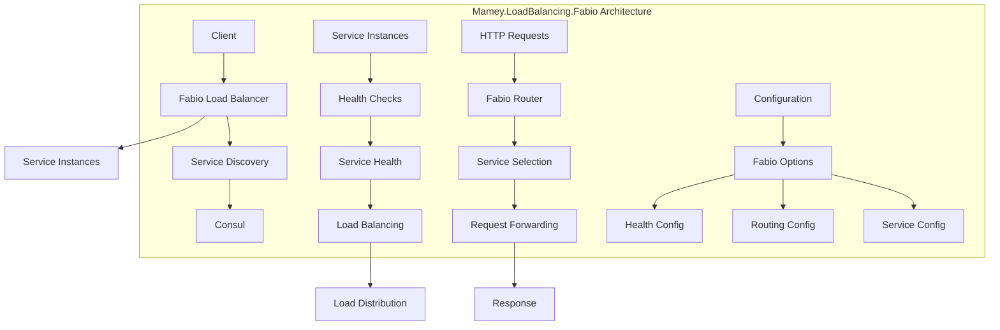

# Mamey.LoadBalancing.Fabio

A load balancing library for the Mamey framework, providing Fabio integration for HTTP load balancing and routing. This library enables automatic load balancing across multiple service instances using Fabio as a fast, modern, zero-conf load balancing HTTP(S) router.

## Table of Contents

- [Overview](#overview)
- [Key Features](#key-features)
- [Architecture](#architecture)
- [Installation](#installation)
- [Quick Start](#quick-start)
- [Core Components](#core-components)
- [API Reference](#api-reference)
- [Usage Examples](#usage-examples)
- [Configuration](#configuration)
- [Best Practices](#best-practices)
- [Troubleshooting](#troubleshooting)

## Overview

Mamey.LoadBalancing.Fabio is a load balancing library that provides Fabio integration for the Mamey framework. It enables automatic load balancing across multiple service instances using Fabio as a fast, modern, zero-conf load balancing HTTP(S) router.

### Technical Overview

The library provides:

- **Load Balancing**: Automatic load balancing across service instances
- **Service Discovery**: Integration with Consul for service discovery
- **HTTP Routing**: HTTP request routing and forwarding
- **Health Checks**: Health check integration for load balancing
- **Zero Configuration**: Zero-configuration load balancing setup
- **Performance**: High-performance load balancing with minimal overhead
- **Flexibility**: Flexible routing and load balancing configuration

## Key Features

### Core Features

- **Load Balancing**: Automatic load balancing across service instances
- **Service Discovery**: Integration with Consul for service discovery
- **HTTP Routing**: HTTP request routing and forwarding
- **Health Checks**: Health check integration for load balancing
- **Zero Configuration**: Zero-configuration load balancing setup
- **Performance**: High-performance load balancing with minimal overhead
- **Flexibility**: Flexible routing and load balancing configuration

### Advanced Features

- **Custom Routing**: Support for custom routing rules
- **Service Tags**: Integration with Consul service tags
- **Health Monitoring**: Comprehensive health monitoring
- **Error Handling**: Comprehensive error handling and logging
- **Configuration**: Flexible configuration options
- **Integration**: Easy integration with Mamey services

## Architecture



## Installation

### Package Manager
```bash
Install-Package Mamey.LoadBalancing.Fabio
```

### .NET CLI
```bash
dotnet add package Mamey.LoadBalancing.Fabio
```

### PackageReference
```xml
<PackageReference Include="Mamey.LoadBalancing.Fabio" Version="2.0.*" />
```

## Quick Start

### Basic Setup

```csharp
using Mamey.LoadBalancing.Fabio;

var builder = WebApplication.CreateBuilder(args);

// Add Mamey services
builder.Services.AddMamey()
    .AddFabio();

var app = builder.Build();

app.Run();
```

### With Custom Configuration

```csharp
builder.Services.AddMamey()
    .AddFabio(options =>
    {
        options.Enabled = true;
        options.Url = "http://localhost:9999";
        options.Service = "my-service";
    });
```

### With Configuration File

```csharp
// appsettings.json
{
  "fabio": {
    "enabled": true,
    "url": "http://localhost:9999",
    "service": "my-service"
  }
}

// Program.cs
builder.Services.AddMamey()
    .AddFabio();
```

## Core Components

### Configuration System

#### FabioOptions
```csharp
public class FabioOptions
{
    public bool Enabled { get; set; }
    public string Url { get; set; }
    public string Service { get; set; }
}
```

### Builder Pattern

#### IFabioOptionsBuilder
```csharp
public interface IFabioOptionsBuilder
{
    IFabioOptionsBuilder Enabled(bool enabled);
    IFabioOptionsBuilder Url(string url);
    IFabioOptionsBuilder Service(string service);
    FabioOptions Build();
}
```

#### FabioOptionsBuilder
```csharp
public class FabioOptionsBuilder : IFabioOptionsBuilder
{
    // Implementation of IFabioOptionsBuilder
}
```

### HTTP Client

#### IFabioHttpClient
```csharp
public interface IFabioHttpClient : IHttpClient
{
    // Inherits from IHttpClient
}
```

#### FabioHttpClient
```csharp
public class FabioHttpClient : IFabioHttpClient
{
    // Implementation of IFabioHttpClient
}
```

## API Reference

### Extension Methods

#### IMameyBuilder Extensions

```csharp
public static IMameyBuilder AddFabio(
    this IMameyBuilder builder,
    string sectionName = "fabio",
    string consulSectionName = "consul",
    string httpClientSectionName = "httpClient");

public static IMameyBuilder AddFabio(
    this IMameyBuilder builder,
    Func<IFabioOptionsBuilder, IFabioOptionsBuilder> buildOptions,
    Func<IConsulOptionsBuilder, IConsulOptionsBuilder> buildConsulOptions,
    HttpClientOptions httpClientOptions);

public static IMameyBuilder AddFabio(
    this IMameyBuilder builder,
    FabioOptions fabioOptions,
    ConsulOptions consulOptions,
    HttpClientOptions httpClientOptions);
```

#### HTTP Client Extensions

```csharp
public static void AddFabioHttpClient(
    this IMameyBuilder builder,
    string clientName,
    string serviceName);
```

### Configuration Options

#### FabioOptions
```csharp
public class FabioOptions
{
    public bool Enabled { get; set; }                    // Enable/disable Fabio integration
    public string Url { get; set; }                      // Fabio server URL
    public string Service { get; set; }                  // Service name for routing
}
```

## Usage Examples

### Basic Load Balancing Setup

```csharp
public class Program
{
    public static void Main(string[] args)
    {
        var builder = WebApplication.CreateBuilder(args);

        // Add Mamey services with Fabio load balancing
        builder.Services.AddMamey()
            .AddFabio();

        var app = builder.Build();

        app.Run();
    }
}
```

### With Custom Configuration

```csharp
builder.Services.AddMamey()
    .AddFabio(options =>
    {
        options.Enabled = true;
        options.Url = "http://localhost:9999";
        options.Service = "my-service";
    });
```

### With Consul Integration

```csharp
builder.Services.AddMamey()
    .AddFabio(
        fabioOptions => fabioOptions
            .Enabled(true)
            .Url("http://localhost:9999")
            .Service("my-service"),
        consulOptions => consulOptions
            .Enabled(true)
            .Url("http://localhost:8500")
            .Service("my-service")
            .Address("localhost")
            .Port(5000)
    );
```

### With Configuration File

```csharp
// appsettings.json
{
  "fabio": {
    "enabled": true,
    "url": "http://localhost:9999",
    "service": "my-service"
  },
  "consul": {
    "enabled": true,
    "url": "http://localhost:8500",
    "service": "my-service",
    "address": "localhost",
    "port": 5000
  }
}

// Program.cs
builder.Services.AddMamey()
    .AddFabio();
```

### Using Fabio HTTP Client

```csharp
public class UserService
{
    private readonly IHttpClient _httpClient;

    public UserService(IHttpClient httpClient)
    {
        _httpClient = httpClient;
    }

    public async Task<User> GetUserAsync(int userId)
    {
        // This will automatically route through Fabio load balancer
        var response = await _httpClient.GetAsync($"http://user-service/api/users/{userId}");
        return await response.Content.ReadFromJsonAsync<User>();
    }
}

// Register Fabio HTTP client
builder.Services.AddMamey()
    .AddFabio()
    .AddFabioHttpClient("user-service-client", "user-service");
```

### Service-to-Service Communication

```csharp
public class OrderService
{
    private readonly IHttpClient _httpClient;

    public OrderService(IHttpClient httpClient)
    {
        _httpClient = httpClient;
    }

    public async Task<Order> CreateOrderAsync(CreateOrderRequest request)
    {
        // Call user service through Fabio load balancer
        var userResponse = await _httpClient.GetAsync($"http://user-service/api/users/{request.UserId}");
        if (!userResponse.IsSuccessStatusCode)
        {
            throw new Exception("User service unavailable");
        }

        // Call payment service through Fabio load balancer
        var paymentResponse = await _httpClient.PostAsJsonAsync("http://payment-service/api/payments", request.Payment);
        if (!paymentResponse.IsSuccessStatusCode)
        {
            throw new Exception("Payment service unavailable");
        }

        // Process order
        return await ProcessOrderAsync(request);
    }
}
```

### Health Check Integration

```csharp
public class Program
{
    public static void Main(string[] args)
    {
        var builder = WebApplication.CreateBuilder(args);

        // Add Mamey services with Fabio and Consul
        builder.Services.AddMamey()
            .AddFabio(options =>
            {
                options.Enabled = true;
                options.Url = "http://localhost:9999";
                options.Service = "my-service";
            })
            .AddConsul(options =>
            {
                options.Enabled = true;
                options.Url = "http://localhost:8500";
                options.Service = "my-service";
                options.Address = "localhost";
                options.Port = 5000;
                options.PingEnabled = true;
                options.PingEndpoint = "/health";
            });

        var app = builder.Build();

        // Add health check endpoint
        app.MapHealthChecks("/health");

        app.Run();
    }
}
```

## Configuration

### Basic Configuration

```csharp
builder.Services.AddMamey()
    .AddFabio();
```

### With Custom Options

```csharp
builder.Services.AddMamey()
    .AddFabio(options =>
    {
        options.Enabled = true;
        options.Url = "http://localhost:9999";
        options.Service = "my-service";
    });
```

### With Configuration Section

```csharp
// appsettings.json
{
  "fabio": {
    "enabled": true,
    "url": "http://localhost:9999",
    "service": "my-service"
  }
}

// Program.cs
builder.Services.AddMamey()
    .AddFabio();
```

### Advanced Configuration

```csharp
// appsettings.json
{
  "fabio": {
    "enabled": true,
    "url": "http://localhost:9999",
    "service": "my-service"
  },
  "consul": {
    "enabled": true,
    "url": "http://localhost:8500",
    "service": "my-service",
    "address": "localhost",
    "port": 5000,
    "pingEnabled": true,
    "pingEndpoint": "/health",
    "tags": ["api", "v1", "microservice"]
  },
  "httpClient": {
    "type": "fabio"
  }
}
```

## Best Practices

### Service Naming

1. **Use Consistent Names**: Use consistent service names across Fabio and Consul
2. **Follow Conventions**: Follow consistent naming conventions
3. **Include Version**: Include version information in service names
4. **Use Hierarchical Names**: Use hierarchical names for related services

```csharp
// Good: Consistent service names
"user-service"
"order-service-v1"
"payment-gateway"
"notification-service"

// Bad: Inconsistent service names
"user-service" // in Consul
"users" // in Fabio
```

### Load Balancing

1. **Configure Health Checks**: Always configure health checks for load balancing
2. **Monitor Service Health**: Monitor service health and availability
3. **Handle Failures**: Handle load balancing failures gracefully
4. **Use Appropriate Algorithms**: Use appropriate load balancing algorithms

```csharp
// Good: Health check configuration
builder.Services.AddMamey()
    .AddFabio(options =>
    {
        options.Enabled = true;
        options.Url = "http://localhost:9999";
        options.Service = "my-service";
    })
    .AddConsul(options =>
    {
        options.Enabled = true;
        options.Url = "http://localhost:8500";
        options.Service = "my-service";
        options.PingEnabled = true;
        options.PingEndpoint = "/health";
    });
```

### Error Handling

1. **Handle Service Failures**: Handle service failures gracefully
2. **Implement Retries**: Implement retry logic for service calls
3. **Use Circuit Breakers**: Use circuit breakers for service calls
4. **Monitor Performance**: Monitor load balancing performance

```csharp
// Good: Error handling with retries
public async Task<T> CallServiceAsync<T>(string serviceName, string endpoint)
{
    var retryCount = 0;
    var maxRetries = 3;

    while (retryCount < maxRetries)
    {
        try
        {
            var response = await _httpClient.GetAsync($"http://{serviceName}{endpoint}");
            if (response.IsSuccessStatusCode)
            {
                return await response.Content.ReadFromJsonAsync<T>();
            }
        }
        catch (Exception ex)
        {
            retryCount++;
            if (retryCount >= maxRetries)
            {
                _logger.LogError(ex, "Failed to call service {ServiceName} after {RetryCount} retries", serviceName, retryCount);
                throw;
            }
            
            await Task.Delay(TimeSpan.FromSeconds(Math.Pow(2, retryCount))); // Exponential backoff
        }
    }

    throw new Exception($"Failed to call service {serviceName} after {maxRetries} retries");
}
```

### Configuration

1. **Use Environment Variables**: Use environment variables for sensitive configuration
2. **Validate Configuration**: Validate configuration at startup
3. **Use Secrets Management**: Use secrets management for sensitive data
4. **Document Configuration**: Document all configuration options

```csharp
// Good: Configuration validation
public class FabioOptionsValidator : IValidateOptions<FabioOptions>
{
    public ValidateOptionsResult Validate(string name, FabioOptions options)
    {
        if (options.Enabled && string.IsNullOrEmpty(options.Url))
        {
            return ValidateOptionsResult.Fail("Fabio URL is required when enabled");
        }

        if (options.Enabled && string.IsNullOrEmpty(options.Service))
        {
            return ValidateOptionsResult.Fail("Service name is required when enabled");
        }

        return ValidateOptionsResult.Success;
    }
}
```

## Troubleshooting

### Common Issues

#### 1. Load Balancing Not Working

**Problem**: Load balancing is not working properly.

**Solution**: Check Fabio and Consul configuration and connectivity.

```csharp
// Verify Fabio configuration
builder.Services.AddMamey()
    .AddFabio(options =>
    {
        options.Enabled = true; // Ensure enabled
        options.Url = "http://localhost:9999"; // Verify URL
        options.Service = "my-service"; // Verify service name
    });
```

#### 2. Service Discovery Failures

**Problem**: Service discovery is failing.

**Solution**: Check Consul configuration and service registration.

```csharp
// Add logging for service discovery
builder.Services.AddLogging(logging =>
{
    logging.AddConsole();
    logging.SetMinimumLevel(LogLevel.Debug);
});
```

#### 3. Health Check Failures

**Problem**: Health checks are failing.

**Solution**: Implement proper health check endpoints.

```csharp
// Implement health check endpoint
app.MapHealthChecks("/health", new HealthCheckOptions
{
    Predicate = _ => true,
    ResponseWriter = UIResponseWriter.WriteHealthCheckUIResponse
});
```

#### 4. Connection Issues

**Problem**: Cannot connect to Fabio or Consul.

**Solution**: Check Fabio and Consul server status and network connectivity.

```csharp
// Test Fabio connectivity
var httpClient = new HttpClient();
var response = await httpClient.GetAsync("http://localhost:9999/health");
Console.WriteLine($"Fabio health status: {response.StatusCode}");
```

### Debugging Tips

1. **Enable Logging**: Enable detailed logging for troubleshooting
2. **Check Fabio UI**: Use Fabio UI to verify routing configuration
3. **Monitor Health**: Monitor service health status
4. **Test Connectivity**: Test Fabio and Consul connectivity manually

```csharp
// Enable debug logging
builder.Logging.SetMinimumLevel(LogLevel.Debug);

// Add Fabio with debug options
builder.Services.AddMamey()
    .AddFabio(options =>
    {
        options.Enabled = true;
        options.Url = "http://localhost:9999";
        options.Service = "my-service";
    });
```

### Performance Monitoring

1. **Load Balancing Performance**: Monitor load balancing performance
2. **Service Response Times**: Monitor service response times
3. **Health Check Performance**: Monitor health check performance
4. **Network Latency**: Monitor network latency to services

```csharp
// Add performance monitoring
builder.Services.AddMamey()
    .AddFabio(options =>
    {
        options.Enabled = true;
        options.Url = "http://localhost:9999";
        options.Service = "my-service";
    })
    .AddMetrics(options =>
    {
        options.Enabled = true;
        options.PrometheusEnabled = true;
    });
```

## License

This project is licensed under the MIT License - see the LICENSE file for details.

## Contributing

Please read Contributing Guide for details on our code of conduct and the process for submitting pull requests.

## Support

For support and questions, please open an issue in the [GitHub repository](https://github.com/mamey-io/mamey-loadbalancing-fabio/issues).
