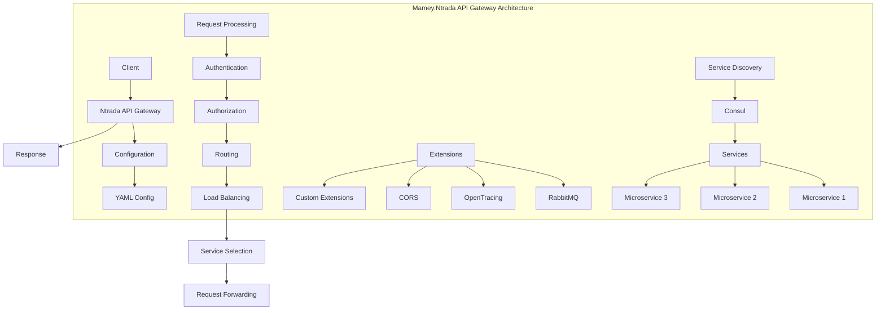

# Mamey.Ntrada

An API Gateway library for the Mamey framework, providing a configurable and extensible API Gateway that requires no coding and can be started via Docker or as a .NET Core application. Ntrada (entrada is Spanish for "entrance") serves as the entry point for microservices architectures.

## Table of Contents

- [Overview](#overview)
- [Key Features](#key-features)
- [Architecture](#architecture)
- [Installation](#installation)
- [Quick Start](#quick-start)
- [Core Components](#core-components)
- [API Reference](#api-reference)
- [Usage Examples](#usage-examples)
- [Configuration](#configuration)
- [Best Practices](#best-practices)
- [Troubleshooting](#troubleshooting)

## Overview

Mamey.Ntrada is an API Gateway library that provides a configurable and extensible API Gateway for the Mamey framework. It serves as the entry point for microservices architectures, offering routing, load balancing, authentication, and various extensions without requiring any coding.

### Technical Overview

The library provides:

- **Configuration-Driven**: Single YAML file configuration
- **Routing**: Advanced request routing and forwarding
- **Load Balancing**: Built-in load balancing capabilities
- **Authentication**: JWT and custom authentication support
- **Authorization**: Role-based and claim-based authorization
- **Extensions**: RabbitMQ, OpenTracing, CORS, and custom extensions
- **Performance**: High-performance API Gateway with minimal overhead
- **Zero Coding**: No coding required for basic setup

## Key Features

### Core Features

- **Configuration-Driven**: Single YAML file configuration
- **Routing**: Advanced request routing and forwarding
- **Load Balancing**: Built-in load balancing capabilities
- **Authentication**: JWT and custom authentication support
- **Authorization**: Role-based and claim-based authorization
- **Extensions**: RabbitMQ, OpenTracing, CORS, and custom extensions
- **Performance**: High-performance API Gateway with minimal overhead
- **Zero Coding**: No coding required for basic setup

### Advanced Features

- **Static Content**: Serve static content directly
- **Request Validation**: Request body validation and transformation
- **Headers Management**: Custom request and response headers
- **Query String Binding**: Automatic query string parameter binding
- **HTTP Retries**: Configurable HTTP retry mechanisms
- **Service Discovery**: Integration with Consul for service discovery
- **Health Checks**: Built-in health check support
- **Monitoring**: OpenTracing and metrics integration

## Architecture



## Installation

### Package Manager
```bash
Install-Package Mamey.Ntrada
```

### .NET CLI
```bash
dotnet add package Mamey.Ntrada
```

### PackageReference
```xml
<PackageReference Include="Mamey.Ntrada" Version="2.0.*" />
```

## Quick Start

### Basic Setup

```csharp
using Mamey.Ntrada;

public class Program
{
    public static Task Main(string[] args)
        => CreateHostBuilder(args).Build().RunAsync();

    public static IHostBuilder CreateHostBuilder(string[] args) =>
        Host.CreateDefaultBuilder(args)
            .ConfigureWebHostDefaults(webBuilder =>
            {
                webBuilder.ConfigureAppConfiguration(builder =>
                {
                    var configPath = args?.FirstOrDefault() ?? "ntrada.yml";
                    builder.AddYamlFile(configPath, false);
                }).UseStartup<Startup>();
            });
}
```

### Basic Configuration

```yaml
# ntrada.yml
modules:
- name: home
  routes:
  - upstream: /
    method: GET
    use: return_value
    return_value: Welcome to Mamey.Ntrada API.
```

### Docker Setup

```bash
# Build Docker image
docker build -t ntrada .

# Run container
docker run -it --rm --name ntrada -p 5000:80 ntrada

# Test
curl localhost:5000
```

## Core Components

### Configuration System

#### YAML Configuration
The API Gateway is configured using a single YAML file that defines:
- Modules and routes
- Authentication and authorization
- Load balancing settings
- Extensions configuration
- Service definitions

#### Module Structure
```yaml
modules:
- name: module-name
  routes:
  - upstream: /path
    method: GET|POST|PUT|DELETE
    use: return_value|downstream|rabbitmq
    # Additional configuration
  services:
    service-name:
      localUrl: localhost:5001
      url: service-name
```

### Routing System

#### Route Types
1. **return_value**: Return static content
2. **downstream**: Forward to downstream service
3. **rabbitmq**: Publish to RabbitMQ

#### Route Configuration
```yaml
routes:
- upstream: /api/users
  method: GET
  use: downstream
  downstream: user-service/api/users
  auth: true
  roles: [admin, user]
```

### Authentication & Authorization

#### JWT Configuration
```yaml
auth:
  enabled: true
  global: false
  claims:
    role: http://schemas.microsoft.com/ws/2008/06/identity/claims/role

extensions:
  jwt:
    key: your-secret-key
    issuer: ntrada
    validateIssuer: true
    audience: your-audience
    validateAudience: true
    validateLifetime: true
```

### Load Balancing

#### Load Balancer Configuration
```yaml
loadBalancer:
  enabled: true
  url: localhost:9999

modules:
  orders:
    services:
      orders-service:
        localUrl: localhost:5001
        url: orders-service
```

## API Reference

### Configuration Options

#### Global Configuration
```yaml
# HTTP Configuration
http:
  retries: 2
  interval: 2.0
  exponential: true

# Error Handling
useErrorHandler: true

# Headers
useForwardedHeaders: true
passQueryString: true
forwardRequestHeaders: true
forwardResponseHeaders: true

# ID Generation
generateRequestId: true
generateTraceId: true
resourceId:
  generate: true
  property: id

# Paths
modulesPath: Modules
payloadsFolder: Payloads
useLocalUrl: true
```

#### Module Configuration
```yaml
modules:
- name: module-name
  routes:
  - upstream: /path
    method: GET
    use: return_value|downstream|rabbitmq
    auth: true|false
    roles: [role1, role2]
    config:
      # Additional configuration
  services:
    service-name:
      localUrl: localhost:5001
      url: service-name
```

### Extension Configuration

#### RabbitMQ Extension
```yaml
extensions:
  rabbitmq:
    enabled: true
    connectionName: ntrada
    hostnames: [localhost]
    port: 5672
    virtualHost: /
    username: guest
    password: guest
    exchange:
      declareExchange: true
      durable: true
      autoDelete: false
      type: topic
```

#### OpenTracing Extension
```yaml
extensions:
  tracing:
    serviceName: ntrada
    udpHost: localhost
    udpPort: 6831
    sampler: const
    useEmptyTracer: false
```

#### CORS Extension
```yaml
extensions:
  cors:
    allowCredentials: true
    allowedOrigins: ['*']
    allowedMethods: [post, delete]
    allowedHeaders: ['*']
    exposedHeaders: [Request-ID, Resource-ID, Trace-ID]
```

## Usage Examples

### Basic API Gateway

```yaml
# ntrada.yml
modules:
- name: home
  routes:
  - upstream: /
    method: GET
    use: return_value
    return_value: Welcome to Mamey.Ntrada API!
```

### Service Routing

```yaml
modules:
  users:
    routes:
    - upstream: /users
      methods: [GET, POST, PUT, DELETE]
      matchAll: true
      use: downstream
      downstream: user-service/users
      auth: true
      roles: [admin, user]
      
    services:
      user-service:
        localUrl: localhost:5001
        url: user-service

  orders:
    routes:
    - upstream: /orders
      method: GET
      use: downstream
      downstream: order-service/orders
      auth: true
      roles: [admin, user]
      
    - upstream: /orders
      method: POST
      use: downstream
      downstream: order-service/orders
      auth: true
      roles: [admin]
      
    services:
      order-service:
        localUrl: localhost:5002
        url: order-service
```

### RabbitMQ Integration

```yaml
modules:
  notifications:
    routes:
    - upstream: /notifications
      method: POST
      use: rabbitmq
      config:
        exchange: notifications.exchange
        routing_key: notification.created
      auth: true
      roles: [admin]

extensions:
  rabbitmq:
    enabled: true
    hostnames: [localhost]
    port: 5672
    username: guest
    password: guest
    exchange:
      declareExchange: true
      durable: true
      type: topic
```

### Authentication & Authorization

```yaml
auth:
  enabled: true
  global: false
  claims:
    role: http://schemas.microsoft.com/ws/2008/06/identity/claims/role

extensions:
  jwt:
    key: your-secret-key-here
    issuer: ntrada
    validateIssuer: true
    audience: your-audience
    validateAudience: true
    validateLifetime: true

modules:
  protected:
    routes:
    - upstream: /admin
      method: GET
      use: return_value
      return_value: Admin area
      auth: true
      roles: [admin]
```

### Load Balancing

```yaml
loadBalancer:
  enabled: true
  url: localhost:9999

modules:
  api:
    routes:
    - upstream: /api
      method: GET
      use: downstream
      downstream: api-service/api
      
    services:
      api-service:
        localUrl: localhost:5001
        url: api-service
```

### Custom Error Handling

```yaml
useErrorHandler: true

extensions:
  customErrors:
    includeExceptionMessage: true

modules:
  errors:
    routes:
    - upstream: /error
      method: GET
      use: return_value
      return_value: Error occurred
```

## Configuration

### Basic Configuration

```yaml
# ntrada.yml
modules:
- name: home
  routes:
  - upstream: /
    method: GET
    use: return_value
    return_value: Welcome to Mamey.Ntrada API!
```

### Advanced Configuration

```yaml
# Global settings
http:
  retries: 3
  interval: 1.0
  exponential: true

useErrorHandler: true
useJaeger: true
useForwardedHeaders: true
passQueryString: true
forwardRequestHeaders: true
forwardResponseHeaders: true
generateRequestId: true
generateTraceId: true

# Authentication
auth:
  enabled: true
  global: false
  claims:
    role: http://schemas.microsoft.com/ws/2008/06/identity/claims/role

# Load balancing
loadBalancer:
  enabled: true
  url: localhost:9999

# Extensions
extensions:
  customErrors:
    includeExceptionMessage: true
  
  cors:
    allowCredentials: true
    allowedOrigins: ['*']
    allowedMethods: [post, delete, get, put]
    allowedHeaders: ['*']
    exposedHeaders: [Request-ID, Resource-ID, Trace-ID]
    
  jwt:
    key: your-secret-key
    issuer: ntrada
    validateIssuer: true
    audience: your-audience
    validateAudience: true
    validateLifetime: true
    
  rabbitmq:
    enabled: true
    connectionName: ntrada
    hostnames: [localhost]
    port: 5672
    virtualHost: /
    username: guest
    password: guest
    exchange:
      declareExchange: true
      durable: true
      autoDelete: false
      type: topic
      
  tracing:
    serviceName: ntrada
    udpHost: localhost
    udpPort: 6831
    sampler: const
    useEmptyTracer: false

# Modules
modules:
  home:
    routes:
    - upstream: /
      method: GET
      use: return_value
      returnValue: Welcome to Mamey.Ntrada API!
      
  api:
    routes:
    - upstream: /api
      methods: [GET, POST, PUT, DELETE]
      matchAll: true
      use: downstream
      downstream: api-service/api
      auth: true
      roles: [admin, user]
      
    services:
      api-service:
        localUrl: localhost:5001
        url: api-service
```

## Best Practices

### Configuration Management

1. **Use Environment Variables**: Use environment variables for sensitive configuration
2. **Separate Environments**: Use different configuration files for different environments
3. **Validate Configuration**: Validate configuration at startup
4. **Document Configuration**: Document all configuration options

```yaml
# Use environment variables
extensions:
  jwt:
    key: ${JWT_SECRET_KEY}
    issuer: ${JWT_ISSUER}
    
  rabbitmq:
    hostnames: [${RABBITMQ_HOST}]
    port: ${RABBITMQ_PORT}
    username: ${RABBITMQ_USERNAME}
    password: ${RABBITMQ_PASSWORD}
```

### Security

1. **Enable Authentication**: Always enable authentication for protected routes
2. **Use HTTPS**: Use HTTPS in production
3. **Validate Input**: Validate all input parameters
4. **Use Strong Keys**: Use strong JWT keys and secrets

```yaml
# Security configuration
auth:
  enabled: true
  global: true

extensions:
  jwt:
    key: ${JWT_SECRET_KEY} # Use strong secret
    validateIssuer: true
    validateAudience: true
    validateLifetime: true
```

### Performance

1. **Use Load Balancing**: Use load balancing for high availability
2. **Enable Caching**: Enable caching where appropriate
3. **Monitor Performance**: Monitor API Gateway performance
4. **Optimize Configuration**: Optimize configuration for performance

```yaml
# Performance configuration
loadBalancer:
  enabled: true
  url: localhost:9999

http:
  retries: 2
  interval: 1.0
  exponential: true
```

### Error Handling

1. **Enable Error Handler**: Always enable error handling
2. **Custom Error Messages**: Provide meaningful error messages
3. **Log Errors**: Log errors for debugging
4. **Handle Failures**: Handle service failures gracefully

```yaml
# Error handling
useErrorHandler: true

extensions:
  customErrors:
    includeExceptionMessage: true
```

## Troubleshooting

### Common Issues

#### 1. Configuration Errors

**Problem**: Configuration file is not being loaded or parsed correctly.

**Solution**: Check YAML syntax and file path.

```yaml
# Check YAML syntax
modules:
- name: home
  routes:
  - upstream: /
    method: GET
    use: return_value
    return_value: Welcome to Mamey.Ntrada API!
```

#### 2. Service Discovery Failures

**Problem**: Services are not being discovered or routed correctly.

**Solution**: Check service configuration and load balancer settings.

```yaml
# Verify service configuration
modules:
  api:
    services:
      api-service:
        localUrl: localhost:5001
        url: api-service
```

#### 3. Authentication Failures

**Problem**: Authentication is not working correctly.

**Solution**: Check JWT configuration and authentication settings.

```yaml
# Verify authentication configuration
auth:
  enabled: true
  global: false

extensions:
  jwt:
    key: your-secret-key
    issuer: ntrada
    validateIssuer: true
```

#### 4. Load Balancing Issues

**Problem**: Load balancing is not working correctly.

**Solution**: Check load balancer configuration and service discovery.

```yaml
# Verify load balancer configuration
loadBalancer:
  enabled: true
  url: localhost:9999
```

### Debugging Tips

1. **Enable Logging**: Enable detailed logging for troubleshooting
2. **Check Configuration**: Verify configuration file syntax and values
3. **Test Services**: Test individual services independently
4. **Monitor Traffic**: Monitor API Gateway traffic and performance

```yaml
# Enable debugging
useErrorHandler: true

extensions:
  customErrors:
    includeExceptionMessage: true
```

### Performance Monitoring

1. **Monitor Response Times**: Monitor API Gateway response times
2. **Track Errors**: Track error rates and types
3. **Monitor Resources**: Monitor CPU and memory usage
4. **Use Metrics**: Use OpenTracing and metrics for monitoring

```yaml
# Enable monitoring
useJaeger: true

extensions:
  tracing:
    serviceName: ntrada
    udpHost: localhost
    udpPort: 6831
    sampler: const
```

## License

This project is licensed under the MIT License - see the LICENSE file for details.

## Contributing

Please read Contributing Guide for details on our code of conduct and the process for submitting pull requests.

## Support

For support and questions, please open an issue in the [GitHub repository](https://github.com/mamey-io/mamey-ntrada/issues).