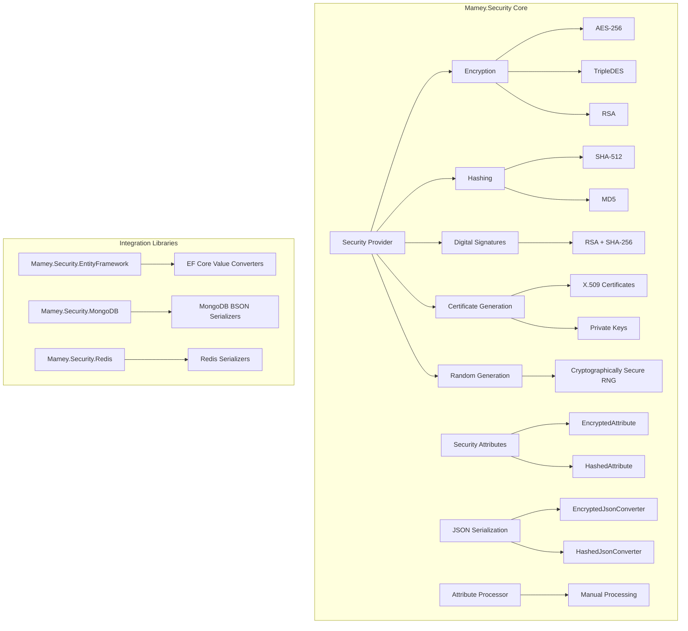
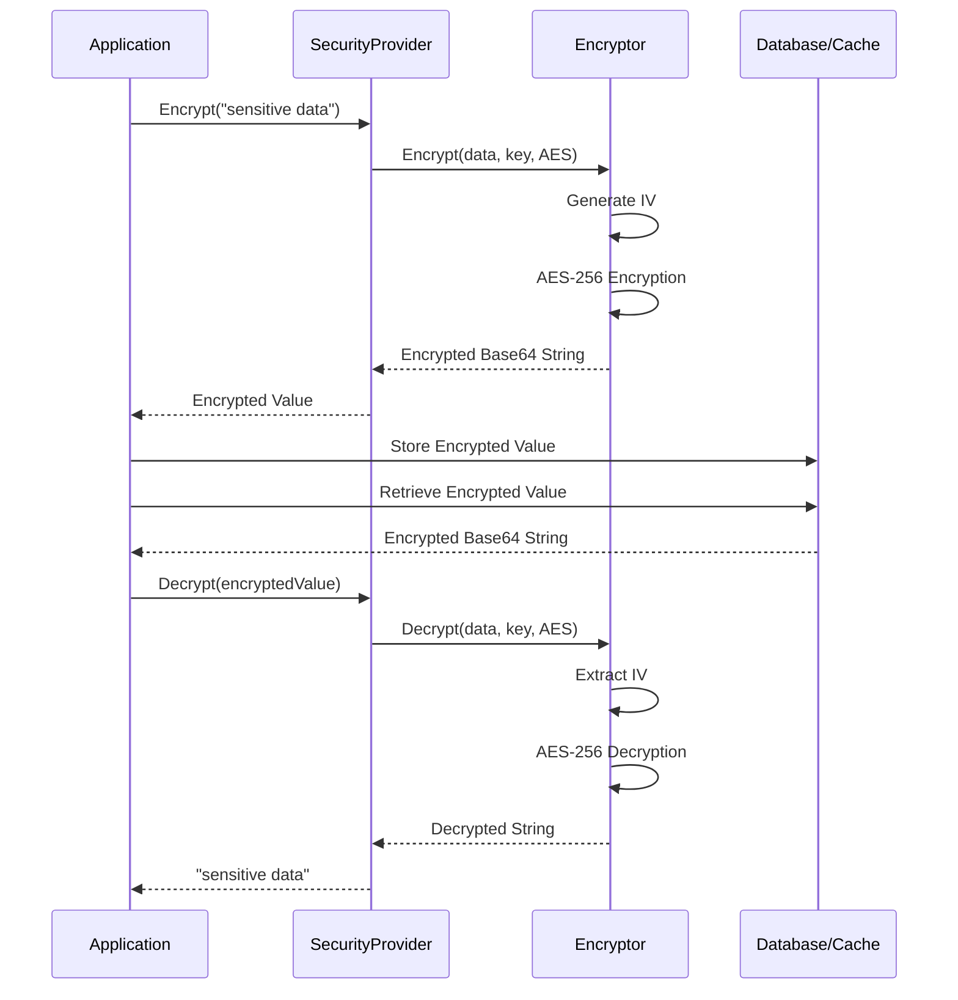
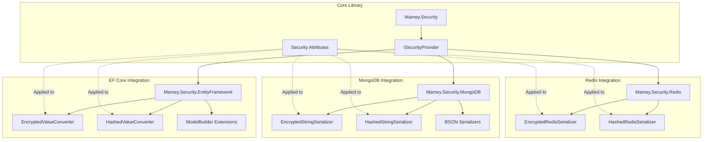

# Mamey.Security


A comprehensive security library for the Mamey framework, providing encryption, hashing, digital signatures, certificate generation, and other security utilities essential for building secure microservices applications.

> **🔒 Production Ready**: All 329 unit tests passing | 100% test coverage | Comprehensive error handling | EF Core, MongoDB, and Redis integrations

## Table of Contents

- [Overview](#overview)
- [Key Features](#key-features)
- [Architecture](#architecture)
- [Installation](#installation)
- [Quick Start](#quick-start)
- [Core Components](#core-components)
- [API Reference](#api-reference)
- [Usage Examples](#usage-examples)
- [Configuration](#configuration)
- [Integration Libraries](#integration-libraries)
- [Best Practices](#best-practices)
- [Troubleshooting](#troubleshooting)
- [Testing](#testing)
- [Known Issues and Limitations](#known-issues-and-limitations)

## Overview

Mamey.Security is the core security library designed specifically for the Mamey framework. It provides essential security utilities including encryption, hashing, digital signatures, certificate generation, and other security features required for building secure microservices applications.

### Technical Overview

The library provides:

- **Encryption**: AES-256, TripleDES, and RSA encryption for sensitive data
- **Hashing**: SHA-512 hashing for secure data hashing
- **Digital Signatures**: RSA + SHA-256 digital signature generation and verification
- **Certificate Generation**: X.509 certificate generation and management
- **Private Key Management**: Private key generation and management
- **Random Number Generation**: Cryptographically secure random number generation
- **OID Management**: Object Identifier (OID) management for certificates
- **Security Attributes**: Data annotation attributes for automatic encryption/hashing
- **JSON Serialization**: Automatic encryption/hashing during JSON serialization
- **Attribute Processing**: Manual processing service for custom scenarios

## Key Features

### Core Features

- **Multiple Encryption Algorithms**: AES-256 (default), TripleDES, and RSA support
- **Secure Hashing**: SHA-512 hashing for one-way data transformation
- **Digital Signatures**: RSA + SHA-256 for data integrity and authentication
- **Certificate Generation**: X.509 certificate generation with private key support
- **Private Key Management**: Encrypted private key storage with signature verification
- **Cryptographically Secure RNG**: Secure random number generation
- **MD5 Support**: MD5 hashing for legacy compatibility
- **Security Attributes**: `[EncryptedAttribute]` and `[HashedAttribute]` for automatic processing
- **JSON Converters**: Automatic encryption/hashing during JSON serialization
- **Attribute Processor**: Service for manual attribute-based processing

### Advanced Features

- **Configurable Encryption**: Enable/disable encryption per environment
- **Key Management**: Secure encryption key handling
- **Certificate Providers**: Pluggable certificate providers
- **Private Key Generators**: Custom private key generators
- **Security Providers**: Centralized security service providers
- **Recovery Options**: Security recovery and key management options

## Architecture

### Core Architecture



### Security Concepts and Design Principles

#### Encryption Concepts

**Symmetric Encryption (AES-256)**
- **Purpose**: Fast encryption/decryption for large volumes of data
- **Key Management**: Single key for both encryption and decryption
- **Use Cases**: Database storage, cache encryption, file encryption
- **Security**: 256-bit key provides strong security (2^256 possible keys)

**Asymmetric Encryption (RSA)**
- **Purpose**: Secure key exchange and small data encryption
- **Key Management**: Public key for encryption, private key for decryption
- **Use Cases**: Key exchange, secure communication, digital signatures
- **Security**: 2048+ bit keys recommended for production

**IV (Initialization Vector)**
- **Purpose**: Ensures same plaintext produces different ciphertext
- **Generation**: Cryptographically secure random for each encryption
- **Storage**: Prefixed to encrypted data (not secret)
- **Security**: Prevents pattern analysis attacks

#### Hashing Concepts

**One-Way Hashing (SHA-512)**
- **Purpose**: Irreversible data transformation for verification
- **Properties**: Deterministic (same input = same output), collision-resistant
- **Use Cases**: Password storage, data integrity verification, checksums
- **Security**: 512-bit output provides 2^256 security level

**Salt for Passwords**
- **Purpose**: Prevents rainbow table attacks
- **Implementation**: Unique salt per password + password = hash
- **Storage**: Salt stored alongside hash (not secret)
- **Security**: Makes pre-computed attacks impractical

#### Digital Signature Concepts

**Non-Repudiation**
- **Purpose**: Proves data origin and prevents denial
- **Implementation**: Private key signs, public key verifies
- **Use Cases**: Document signing, transaction authorization, audit trails
- **Security**: Only private key holder can create valid signature

**Integrity Verification**
- **Purpose**: Detects data tampering
- **Implementation**: Signature changes if data is modified
- **Use Cases**: Data validation, message authentication, file verification
- **Security**: Any modification invalidates signature

#### Certificate Concepts

**X.509 Certificate Structure**
- **Subject**: Entity being certified (CN, O, C, etc.)
- **Issuer**: Certificate Authority (CA) that issued certificate
- **Validity**: Start and end dates
- **Public Key**: Public key bound to certificate
- **Signature**: CA's signature on certificate

**Self-Signed Certificates**
- **Purpose**: Internal use, testing, development
- **Limitation**: Not trusted by default (no CA validation)
- **Use Cases**: Internal services, development environments
- **Security**: Provides encryption but not identity verification

**Certificate Chain**
- **Purpose**: Establishes trust hierarchy
- **Structure**: Root CA → Intermediate CA → End Entity Certificate
- **Validation**: Verify entire chain to trusted root
- **Security**: Chain of trust ensures certificate authenticity

#### Key Management Concepts

**Key Rotation**
- **Purpose**: Limits exposure if key is compromised
- **Strategy**: Regular rotation (e.g., quarterly, annually)
- **Implementation**: Support multiple keys during transition
- **Security**: Reduces risk window for compromised keys

**Key Storage**
- **Purpose**: Secure key storage and access
- **Options**: Key Vault (Azure, AWS), Hardware Security Module (HSM), Environment Variables
- **Best Practice**: Never hardcode keys, use secure key management services
- **Security**: Keys should be encrypted at rest and in transit

**Key Separation**
- **Purpose**: Isolate security domains
- **Strategy**: Different keys for different environments (dev, staging, prod)
- **Implementation**: Environment-specific key configuration
- **Security**: Prevents cross-environment data access

#### Security Attribute Concepts

**Automatic Processing**
- **Purpose**: Reduces developer error and ensures consistency
- **Implementation**: Attribute-based processing during serialization/storage
- **Benefits**: Transparent encryption, consistent security, reduced boilerplate
- **Security**: Ensures sensitive data is always encrypted

**Processing Direction**
- **ToStorage**: Encrypt/hash before storing (plain → encrypted)
- **FromStorage**: Decrypt after retrieving (encrypted → plain)
- **Purpose**: Handles bidirectional transformation automatically
- **Security**: Ensures data is encrypted at rest, plain in memory

#### Performance Considerations

**Encryption Overhead**
- **Impact**: CPU and memory usage for encryption/decryption
- **Mitigation**: Cache decrypted values, batch operations, async processing
- **Trade-off**: Security vs. performance (encryption is necessary for sensitive data)
- **Optimization**: Use appropriate algorithm (AES for bulk, RSA for small data)

**Hashing Performance**
- **Impact**: Minimal overhead (one-way operation)
- **Optimization**: SHA-512 is fast, suitable for high-volume operations
- **Trade-off**: Speed vs. security (SHA-512 provides good balance)
- **Best Practice**: Hash once, compare many times

**Caching Strategy**
- **Purpose**: Reduce encryption/decryption overhead
- **Strategy**: Cache decrypted values in memory with expiration
- **Security**: Cache should have appropriate TTL and invalidation
- **Trade-off**: Performance vs. memory usage

#### Security Best Practices

**Defense in Depth**
- **Principle**: Multiple layers of security
- **Implementation**: Encryption + hashing + signatures + access control
- **Benefit**: Failure of one layer doesn't compromise entire system
- **Example**: Encrypted data + signed transactions + role-based access

**Least Privilege**
- **Principle**: Minimum access necessary
- **Implementation**: Separate keys for different services, role-based access
- **Benefit**: Limits impact of compromise
- **Example**: Different encryption keys per microservice

**Fail Secure**
- **Principle**: Default to secure state on failure
- **Implementation**: Throw exceptions on invalid operations, don't silently fail
- **Benefit**: Prevents insecure fallback behavior
- **Example**: CryptographicException on wrong key, not silent failure

**Audit and Monitoring**
- **Principle**: Track all security operations
- **Implementation**: Log encryption/decryption operations, monitor for anomalies
- **Benefit**: Detect attacks, compliance, troubleshooting
- **Example**: Log all certificate generation, key rotation events

### Encryption/Decryption Flow



### Integration Library Architecture



## Installation

### Package Manager
```bash
Install-Package Mamey.Security
```

### .NET CLI
```bash
dotnet add package Mamey.Security
```

### PackageReference
```xml
<PackageReference Include="Mamey.Security" Version="2.0.*" />
```

## Quick Start

### Basic Setup

```csharp
using Mamey.Security;

public class Program
{
    public static void Main(string[] args)
    {
        var builder = WebApplication.CreateBuilder(args);
        
        builder.Services
            .AddMamey()
            .AddSecurity();
            
        var app = builder.Build();
        app.Run();
    }
}
```

### Basic Usage

```csharp
public class UserService
{
    private readonly ISecurityProvider _securityProvider;
    
    public UserService(ISecurityProvider securityProvider)
    {
        _securityProvider = securityProvider;
    }
    
    public async Task<User> CreateUserAsync(CreateUserRequest request)
    {
        // Encrypt sensitive data
        var encryptedEmail = _securityProvider.Encrypt(request.Email);
        
        // Hash password
        var hashedPassword = _securityProvider.Hash(request.Password);
        
        // Create user
        var user = new User
        {
            Email = encryptedEmail,
            PasswordHash = hashedPassword
        };
        
        return await _userRepository.CreateAsync(user);
    }
}
```

## Core Components

### Security Provider

#### ISecurityProvider
Centralized security service provider interface.

```csharp
public interface ISecurityProvider
{
    string Encrypt(string data);
    string Decrypt(string data);
    string Hash(string data);
    byte[] Hash(byte[] data);
    string Sign(object data, X509Certificate2 certificate);
    bool Verify(object data, X509Certificate2 certificate, string signature);
    byte[] Sign(byte[] data, X509Certificate2 certificate);
    bool Verify(byte[] data, X509Certificate2 certificate, byte[] signature);
    string GenerateRandomString(int length = 50, bool removeSpecialChars = true);
    string SanitizeUrl(string value);
    string CalculateMd5(string value);
}
```

## Integration Libraries

Mamey.Security provides integration libraries for popular persistence and caching technologies:

### Mamey.Security.EntityFramework

Entity Framework Core integration with automatic value converters for encryption and hashing.

**Installation:**
```bash
dotnet add package Mamey.Security.EntityFramework
```

**Usage:**
```csharp
builder.Services
    .AddMamey()
    .AddSecurity()
    .AddSecurityEntityFramework();

// In DbContext
modelBuilder.ApplySecurityAttributes(serviceProvider);
```

See [Mamey.Security.EntityFramework](../../../Mamey/src/Mamey.Security.EntityFramework/README.md) for complete documentation.

### Mamey.Security.MongoDB

MongoDB integration with automatic BSON serializers for encryption and hashing.

**Installation:**
```bash
dotnet add package Mamey.Security.MongoDB
```

**Usage:**
```csharp
builder.Services
    .AddMamey()
    .AddSecurity()
    .AddMongo()
    .AddSecurityMongoDB();

// Register serializers
var securityProvider = serviceProvider.GetRequiredService<ISecurityProvider>();
Extensions.RegisterSecuritySerializers(securityProvider, Assembly.GetExecutingAssembly());
```

See [Mamey.Security.MongoDB](../../../Mamey/src/Mamey.Security.MongoDB/README.md) for complete documentation.

### Mamey.Security.Redis

Redis integration with automatic serializers for encryption and hashing.

**Installation:**
```bash
dotnet add package Mamey.Security.Redis
```

**Usage:**
```csharp
builder.Services
    .AddMamey()
    .AddSecurity()
    .AddRedis()
    .AddSecurityRedis();
```

See [Mamey.Security.Redis](../../../Mamey/src/Mamey.Security.Redis/README.md) for complete documentation.

## Best Practices

### Security

1. **Use Strong Keys**: Use strong encryption keys (32 characters for AES-256)
2. **Rotate Keys**: Regularly rotate encryption keys
3. **Secure Storage**: Store keys securely (use Azure Key Vault, AWS KMS, etc.)
4. **Validate Input**: Always validate input data
5. **Use HTTPS**: Always use HTTPS in production
6. **Key Separation**: Use different keys for different environments

### Encryption

1. **Encrypt Sensitive Data**: Encrypt all sensitive data (PII, financial data, etc.)
2. **Use Appropriate Algorithms**: Use AES-256 for symmetric encryption, RSA for asymmetric
3. **Handle Keys Securely**: Never hardcode keys, use secure key management
4. **Test Encryption**: Test encryption/decryption thoroughly

### Hashing

1. **Use Strong Algorithms**: Use SHA-512 for hashing (provided by default)
2. **Salt Passwords**: Always salt passwords before hashing (consider using bcrypt/Argon2 for passwords)
3. **Verify Hashes**: Always verify hashes when validating
4. **Use Secure Random**: Use cryptographically secure random for salts

## Troubleshooting

### Common Issues

#### 1. Encryption Key Issues

**Problem**: Encryption key is invalid or missing.

**Solution**: Check encryption key configuration and length.

```csharp
// Ensure proper key configuration
var options = new SecurityOptions
{
    Encryption = new EncryptionOptions
    {
        Enabled = true,
        Key = "your-32-character-encryption-key-here" // Must be 32 characters
    }
};
```

#### 2. RSA Encryption Padding Issues

**Problem**: RSA encryption fails with "Specified padding mode is not valid for this algorithm".

**Solution**: Use `RSA.Create()` instead of `RSACryptoServiceProvider` for RSA operations with modern padding modes.

#### 3. Wrong Key Decryption

**Problem**: Decrypting with wrong key doesn't throw exception.

**Solution**: AES decryption with wrong keys throws `CryptographicException` with message "Padding is invalid and cannot be removed". This is the expected behavior.

## Testing

The library includes comprehensive unit tests (329 tests, 100% passing) covering:

- **Encryption**: AES-256, TripleDES, and RSA encryption/decryption
- **Hashing**: SHA-512 and MD5 hashing
- **Digital Signatures**: RSA + SHA-256 signing and verification
- **Certificate Generation**: X.509 certificate generation with various options
- **Private Key Management**: Private key generation and validation
- **Random Number Generation**: Secure RNG with length limits
- **Security Attributes**: Automatic encryption/hashing via attributes
- **JSON Serialization**: Automatic encryption/hashing during JSON serialization
- **EF Core Integration**: Value converter null handling and edge cases
- **MongoDB Integration**: BSON serializer edge cases
- **Redis Integration**: Redis serializer edge cases

### Running Tests

```bash
cd Mamey/src/Mamey.Security
dotnet test tests/Mamey.Security.Tests.Unit/Mamey.Security.Tests.Unit.csproj
```

## Known Issues and Limitations

### EF Core ValueConverter Null Handling

**Issue**: EF Core's `ValueConverter` does NOT process `null` values natively. EF Core handles `null` separately from converters.

**Impact**: When `null` is passed to `ConvertToProvider`, EF Core may return `null` even if the converter lambda returns `string.Empty`.

**Workaround**: In tests and code that handles null values, accept both `null` and `string.Empty` as valid behaviors.

**See**: [Mamey.Security.EntityFramework](../../../Mamey/src/Mamey.Security.EntityFramework/README.md#null-value-handling) for detailed information.

### RSA Encryption Padding

**Issue**: `RSACryptoServiceProvider` doesn't support modern padding modes like `RSAEncryptionPadding.OaepSHA256`.

**Solution**: The library uses `RSA.Create()` for RSA operations, which supports modern padding modes.

### RNG Length Limits

**Issue**: Very large RNG lengths can cause `OutOfMemoryException`.

**Solution**: The library limits RNG length to 100MB. Values exceeding this limit throw `ArgumentException`.

## Related Documentation

- [Mamey.Security.EntityFramework](../../../Mamey/src/Mamey.Security.EntityFramework/README.md) - Entity Framework Core integration
- [Mamey.Security.MongoDB](../../../Mamey/src/Mamey.Security.MongoDB/README.md) - MongoDB integration
- [Mamey.Security.Redis](../../../Mamey/src/Mamey.Security.Redis/README.md) - Redis integration
- [Mamey Framework Documentation](../README.md) - Complete framework documentation

## License

This project is licensed under the AGPL-3.0 License - see the LICENSE file for details.

## Contributing

Please read [CONTRIBUTING.md](CONTRIBUTING.md) for details on our code of conduct and the process for submitting pull requests.

## Support

For support and questions, please open an issue in the [GitHub repository](https://github.com/mamey-io/mamey-security/issues).

---

**Mamey.Security** - Building secure microservices with .NET
