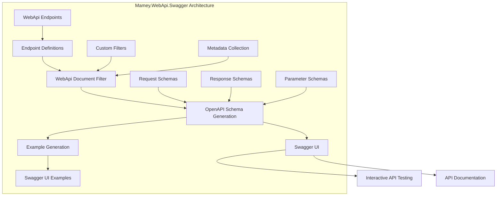

# Mamey.WebApi.Swagger

A comprehensive Swagger/OpenAPI integration library for Mamey WebApi applications. This library provides automatic API documentation generation, interactive API exploration, and seamless integration with the Mamey WebApi framework.

## Table of Contents

- [Overview](#overview)
- [Key Features](#key-features)
- [Architecture](#architecture)
- [Installation](#installation)
- [Quick Start](#quick-start)
- [Core Components](#core-components)
- [API Reference](#api-reference)
- [Usage Examples](#usage-examples)
- [Configuration](#configuration)
- [Best Practices](#best-practices)
- [Troubleshooting](#troubleshooting)

## Overview

Mamey.WebApi.Swagger extends the Mamey.WebApi library to provide comprehensive Swagger/OpenAPI documentation capabilities. It automatically generates API documentation from your endpoint definitions and provides an interactive interface for testing your APIs.

### Technical Overview

The library provides:

- **Automatic Documentation**: Generates OpenAPI documentation from endpoint definitions
- **Interactive UI**: Provides Swagger UI for API exploration and testing
- **Custom Filters**: Pluggable document filters for customizing API documentation
- **Endpoint Discovery**: Automatic discovery and documentation of WebApi endpoints
- **Schema Generation**: Automatic generation of request/response schemas
- **Example Generation**: Automatic generation of example requests and responses

## Key Features

### Core Features

- **Automatic Documentation**: Generates OpenAPI documentation from WebApi endpoint definitions
- **Swagger UI Integration**: Provides interactive Swagger UI for API exploration
- **Custom Document Filters**: Pluggable filters for customizing API documentation
- **Endpoint Discovery**: Automatic discovery of WebApi endpoints and their metadata
- **Schema Generation**: Automatic generation of OpenAPI schemas for request/response types
- **Example Generation**: Automatic generation of example requests and responses

### Advanced Features

- **Custom Filters**: Support for custom Swagger document filters
- **Metadata Enhancement**: Rich metadata collection for API documentation
- **Response Documentation**: Comprehensive response documentation with status codes
- **Parameter Documentation**: Detailed parameter documentation with types and examples
- **Request Body Documentation**: Automatic request body documentation for POST/PUT operations

## Architecture



## Installation

### Package Manager
```bash
Install-Package Mamey.WebApi.Swagger
```

### .NET CLI
```bash
dotnet add package Mamey.WebApi.Swagger
```

### PackageReference
```xml
<PackageReference Include="Mamey.WebApi.Swagger" Version="2.0.*" />
```

## Quick Start

### Basic Setup

```csharp
using Mamey.WebApi.Swagger;

var builder = WebApplication.CreateBuilder(args);

// Add Mamey services
builder.Services.AddMamey()
    .AddWebApi()
    .AddWebApiSwaggerDocs();

var app = builder.Build();

// Configure Swagger UI
app.UseSwagger();
app.UseSwaggerUI(c =>
{
    c.SwaggerEndpoint("/swagger/v1/swagger.json", "My API V1");
    c.RoutePrefix = "swagger";
});

// Configure endpoints
app.UseWebApi()
    .Get("/api/health", ctx => ctx.Response.WriteAsync("OK"))
    .Post<UserRequest>("/api/users", async (request, ctx) =>
    {
        await ctx.Response.WriteJsonAsync(new { Id = Guid.NewGuid(), Name = request.Name });
    });

app.Run();
```

### With Custom Configuration

```csharp
builder.Services.AddMamey()
    .AddWebApi()
    .AddWebApiSwaggerDocs(options =>
    {
        options.Title = "My API";
        options.Version = "v1";
        options.Description = "A sample API for demonstration";
        options.Contact = new OpenApiContact
        {
            Name = "API Support",
            Email = "support@example.com"
        };
    });
```

## Core Components

### Swagger Integration

#### WebApiDocumentFilter
```csharp
internal sealed class WebApiDocumentFilter : IDocumentFilter
{
    private readonly WebApiEndpointDefinitions _definitions;

    public void Apply(OpenApiDocument swaggerDoc, DocumentFilterContext context)
    {
        // Generates OpenAPI documentation from endpoint definitions
    }
}
```

#### WebApiEndpointDefinitions
```csharp
public class WebApiEndpointDefinitions : List<WebApiEndpointDefinition>
{
}

public class WebApiEndpointDefinition
{
    public string Method { get; set; }
    public string Path { get; set; }
    public IEnumerable<WebApiEndpointParameter> Parameters { get; set; }
    public IEnumerable<WebApiEndpointResponse> Responses { get; set; }
}
```

### Extension Methods

#### IMameyBuilder Extensions
```csharp
public static class WebApiSwaggerExtensions
{
    public static IMameyBuilder AddWebApiSwaggerDocs(this IMameyBuilder builder, 
        string sectionName = "swagger");
    
    public static IMameyBuilder AddWebApiSwaggerDocs(this IMameyBuilder builder, 
        Func<ISwaggerOptionsBuilder, ISwaggerOptionsBuilder> buildOptions);
    
    public static IMameyBuilder AddWebApiSwaggerDocs(this IMameyBuilder builder, 
        SwaggerOptions options);
}
```

## API Reference

### Configuration Options

#### SwaggerOptions
```csharp
public class SwaggerOptions
{
    public string Title { get; set; }
    public string Version { get; set; }
    public string Description { get; set; }
    public OpenApiContact Contact { get; set; }
    public OpenApiLicense License { get; set; }
    public List<OpenApiServer> Servers { get; set; }
}
```

#### ISwaggerOptionsBuilder
```csharp
public interface ISwaggerOptionsBuilder
{
    ISwaggerOptionsBuilder AddSwaggerDocs(string sectionName);
    ISwaggerOptionsBuilder AddSwaggerDocs(SwaggerOptions options);
    ISwaggerOptionsBuilder AddSwaggerDocs(Func<SwaggerOptions, SwaggerOptions> configure);
}
```

### Extension Methods

#### IMameyBuilder Extensions

```csharp
public static class WebApiSwaggerExtensions
{
    public static IMameyBuilder AddWebApiSwaggerDocs(this IMameyBuilder builder, 
        string sectionName = "swagger");
    
    public static IMameyBuilder AddWebApiSwaggerDocs(this IMameyBuilder builder, 
        Func<ISwaggerOptionsBuilder, ISwaggerOptionsBuilder> buildOptions);
    
    public static IMameyBuilder AddWebApiSwaggerDocs(this IMameyBuilder builder, 
        SwaggerOptions options);
}
```

## Usage Examples

### Basic Swagger Setup

```csharp
var builder = WebApplication.CreateBuilder(args);

builder.Services.AddMamey()
    .AddWebApi()
    .AddWebApiSwaggerDocs();

var app = builder.Build();

app.UseSwagger();
app.UseSwaggerUI(c =>
{
    c.SwaggerEndpoint("/swagger/v1/swagger.json", "My API V1");
    c.RoutePrefix = "swagger";
});

app.UseWebApi()
    .Get("/api/health", ctx => ctx.Response.WriteAsync("OK"))
    .Post<UserRequest>("/api/users", async (request, ctx) =>
    {
        await ctx.Response.WriteJsonAsync(new { Id = Guid.NewGuid(), Name = request.Name });
    });

app.Run();
```

### With Custom Configuration

```csharp
builder.Services.AddMamey()
    .AddWebApi()
    .AddWebApiSwaggerDocs(options =>
    {
        options.Title = "User Management API";
        options.Version = "v1";
        options.Description = "API for managing users in the system";
        options.Contact = new OpenApiContact
        {
            Name = "API Support",
            Email = "support@example.com",
            Url = new Uri("https://example.com/support")
        };
        options.License = new OpenApiLicense
        {
            Name = "MIT",
            Url = new Uri("https://opensource.org/licenses/MIT")
        };
    });
```

### With Multiple API Versions

```csharp
builder.Services.AddMamey()
    .AddWebApi()
    .AddWebApiSwaggerDocs(options =>
    {
        options.Title = "User Management API";
        options.Version = "v1";
        options.Description = "API for managing users in the system";
    })
    .AddWebApiSwaggerDocs(options =>
    {
        options.Title = "User Management API";
        options.Version = "v2";
        options.Description = "Enhanced API for managing users in the system";
    });

var app = builder.Build();

app.UseSwagger();
app.UseSwaggerUI(c =>
{
    c.SwaggerEndpoint("/swagger/v1/swagger.json", "User API V1");
    c.SwaggerEndpoint("/swagger/v2/swagger.json", "User API V2");
    c.RoutePrefix = "swagger";
});
```

### With Custom Document Filter

```csharp
public class CustomDocumentFilter : IDocumentFilter
{
    public void Apply(OpenApiDocument swaggerDoc, DocumentFilterContext context)
    {
        // Add custom documentation
        swaggerDoc.Info.Title = "Custom API";
        swaggerDoc.Info.Version = "v1";
        
        // Add custom paths
        swaggerDoc.Paths.Add("/custom/endpoint", new OpenApiPathItem
        {
            Operations = new Dictionary<OperationType, OpenApiOperation>
            {
                [OperationType.Get] = new OpenApiOperation
                {
                    Summary = "Custom endpoint",
                    Responses = new OpenApiResponses
                    {
                        ["200"] = new OpenApiResponse
                        {
                            Description = "Success"
                        }
                    }
                }
            }
        });
    }
}

// Register custom filter
builder.Services.AddSwaggerGen(c =>
{
    c.DocumentFilter<CustomDocumentFilter>();
});
```

### With Authentication

```csharp
builder.Services.AddMamey()
    .AddWebApi()
    .AddWebApiSwaggerDocs();

builder.Services.AddSwaggerGen(c =>
{
    c.AddSecurityDefinition("Bearer", new OpenApiSecurityScheme
    {
        Description = "JWT Authorization header using the Bearer scheme",
        Name = "Authorization",
        In = ParameterLocation.Header,
        Type = SecuritySchemeType.ApiKey,
        Scheme = "Bearer"
    });

    c.AddSecurityRequirement(new OpenApiSecurityRequirement
    {
        {
            new OpenApiSecurityScheme
            {
                Reference = new OpenApiReference
                {
                    Type = ReferenceType.SecurityScheme,
                    Id = "Bearer"
                }
            },
            new string[] {}
        }
    });
});
```

## Configuration

### Basic Configuration

```csharp
builder.Services.AddMamey()
    .AddWebApi()
    .AddWebApiSwaggerDocs();
```

### With Custom Options

```csharp
builder.Services.AddMamey()
    .AddWebApi()
    .AddWebApiSwaggerDocs(options =>
    {
        options.Title = "My API";
        options.Version = "v1";
        options.Description = "A sample API";
        options.Contact = new OpenApiContact
        {
            Name = "API Support",
            Email = "support@example.com"
        };
    });
```

### With Configuration Section

```csharp
// appsettings.json
{
  "Swagger": {
    "Title": "My API",
    "Version": "v1",
    "Description": "A sample API"
  }
}

// Program.cs
builder.Services.AddMamey()
    .AddWebApi()
    .AddWebApiSwaggerDocs("Swagger");
```

### Swagger UI Configuration

```csharp
app.UseSwagger();
app.UseSwaggerUI(c =>
{
    c.SwaggerEndpoint("/swagger/v1/swagger.json", "My API V1");
    c.RoutePrefix = "swagger";
    c.DocumentTitle = "My API Documentation";
    c.DefaultModelsExpandDepth(-1);
    c.DefaultModelRendering(ModelRendering.Model);
    c.DisplayRequestDuration();
    c.EnableDeepLinking();
    c.EnableFilter();
    c.ShowExtensions();
    c.EnableValidator();
});
```

## Best Practices

### API Documentation

1. **Clear Descriptions**: Provide clear, descriptive summaries for all endpoints
2. **Consistent Naming**: Use consistent naming conventions for endpoints and parameters
3. **Versioning**: Use API versioning for backward compatibility
4. **Examples**: Provide comprehensive examples for all request/response types

```csharp
app.UseWebApi()
    .Get("/api/v1/users", ctx => GetUsers(ctx), 
        endpoint: e => e.WithSummary("Get all users").WithDescription("Retrieves a list of all users"))
    .Post<UserRequest>("/api/v1/users", async (request, ctx) =>
    {
        await CreateUser(request, ctx);
    }, endpoint: e => e.WithSummary("Create user").WithDescription("Creates a new user"));
```

### Schema Design

1. **Consistent Types**: Use consistent data types across all endpoints
2. **Validation**: Include validation attributes in your models
3. **Documentation**: Add XML documentation to your models
4. **Examples**: Provide realistic examples for all properties

```csharp
/// <summary>
/// Represents a user in the system
/// </summary>
public class UserDto
{
    /// <summary>
    /// The unique identifier for the user
    /// </summary>
    /// <example>123e4567-e89b-12d3-a456-426614174000</example>
    public Guid Id { get; set; }

    /// <summary>
    /// The user's full name
    /// </summary>
    /// <example>John Doe</example>
    public string Name { get; set; }

    /// <summary>
    /// The user's email address
    /// </summary>
    /// <example>john.doe@example.com</example>
    [EmailAddress]
    public string Email { get; set; }
}
```

### Security Documentation

1. **Authentication**: Document authentication requirements
2. **Authorization**: Document authorization policies and roles
3. **Security Schemes**: Define security schemes clearly
4. **Examples**: Provide examples of authenticated requests

```csharp
builder.Services.AddSwaggerGen(c =>
{
    c.AddSecurityDefinition("Bearer", new OpenApiSecurityScheme
    {
        Description = "JWT Authorization header using the Bearer scheme. Example: \"Authorization: Bearer {token}\"",
        Name = "Authorization",
        In = ParameterLocation.Header,
        Type = SecuritySchemeType.ApiKey,
        Scheme = "Bearer"
    });

    c.AddSecurityRequirement(new OpenApiSecurityRequirement
    {
        {
            new OpenApiSecurityScheme
            {
                Reference = new OpenApiReference
                {
                    Type = ReferenceType.SecurityScheme,
                    Id = "Bearer"
                }
            },
            new string[] {}
        }
    });
});
```

### Error Documentation

1. **Error Responses**: Document all possible error responses
2. **Status Codes**: Use appropriate HTTP status codes
3. **Error Models**: Define consistent error response models
4. **Examples**: Provide examples of error responses

```csharp
public class ErrorResponse
{
    /// <summary>
    /// The error code
    /// </summary>
    /// <example>VALIDATION_ERROR</example>
    public string Code { get; set; }

    /// <summary>
    /// The error message
    /// </summary>
    /// <example>The request is invalid</example>
    public string Message { get; set; }

    /// <summary>
    /// Additional error details
    /// </summary>
    public Dictionary<string, string> Details { get; set; }
}
```

## Troubleshooting

### Common Issues

#### 1. Swagger UI Not Loading

**Problem**: Swagger UI not displaying or showing errors.

**Solution**: Ensure proper middleware order and configuration.

```csharp
// Ensure proper middleware order
app.UseRouting();
app.UseSwagger();
app.UseSwaggerUI(c =>
{
    c.SwaggerEndpoint("/swagger/v1/swagger.json", "My API V1");
});
app.UseWebApi();
```

#### 2. Endpoints Not Documented

**Problem**: WebApi endpoints not appearing in Swagger documentation.

**Solution**: Ensure WebApi endpoints are registered before Swagger configuration.

```csharp
// Register WebApi endpoints first
app.UseWebApi()
    .Get("/api/health", ctx => ctx.Response.WriteAsync("OK"));

// Then configure Swagger
app.UseSwagger();
app.UseSwaggerUI();
```

#### 3. Schema Generation Issues

**Problem**: Request/response schemas not generated correctly.

**Solution**: Ensure proper model definitions and serialization configuration.

```csharp
builder.Services.Configure<JsonOptions>(options =>
{
    options.SerializerOptions.PropertyNamingPolicy = JsonNamingPolicy.CamelCase;
    options.SerializerOptions.WriteIndented = true;
});
```

#### 4. Authentication Not Working

**Problem**: Authentication not working in Swagger UI.

**Solution**: Ensure proper security scheme configuration.

```csharp
builder.Services.AddSwaggerGen(c =>
{
    c.AddSecurityDefinition("Bearer", new OpenApiSecurityScheme
    {
        Type = SecuritySchemeType.Http,
        Scheme = "bearer",
        BearerFormat = "JWT"
    });

    c.AddSecurityRequirement(new OpenApiSecurityRequirement
    {
        {
            new OpenApiSecurityScheme
            {
                Reference = new OpenApiReference
                {
                    Type = ReferenceType.SecurityScheme,
                    Id = "Bearer"
                }
            },
            new string[] {}
        }
    });
});
```

### Performance Considerations

1. **Documentation Size**: Keep documentation size reasonable
2. **Schema Complexity**: Avoid overly complex schemas
3. **Example Size**: Keep examples concise and relevant
4. **Caching**: Use appropriate caching for generated documentation

```csharp
// Configure Swagger with performance optimizations
builder.Services.AddSwaggerGen(c =>
{
    c.SwaggerDoc("v1", new OpenApiInfo
    {
        Title = "My API",
        Version = "v1",
        Description = "A sample API"
    });
    
    // Optimize schema generation
    c.UseAllOfToExtendReferenceSchemas();
    c.SupportNonNullableReferenceTypes();
});
```

### Debugging Tips

1. **Enable Logging**: Use structured logging for debugging
2. **Schema Validation**: Validate generated schemas
3. **Documentation Testing**: Test documentation accuracy
4. **Performance Monitoring**: Monitor documentation generation performance

```csharp
public class SwaggerLoggingMiddleware : IMiddleware
{
    private readonly ILogger<SwaggerLoggingMiddleware> _logger;

    public async Task InvokeAsync(HttpContext context, RequestDelegate next)
    {
        if (context.Request.Path.StartsWithSegments("/swagger"))
        {
            _logger.LogInformation("Swagger request: {Path}", context.Request.Path);
        }

        await next(context);
    }
}
```

## License

This project is licensed under the MIT License - see the LICENSE file for details.

## Contributing

Please read Contributing Guide for details on our code of conduct and the process for submitting pull requests.

## Support

For support and questions, please open an issue in the [GitHub repository](https://github.com/mamey-io/mamey-webapi-swagger/issues).
