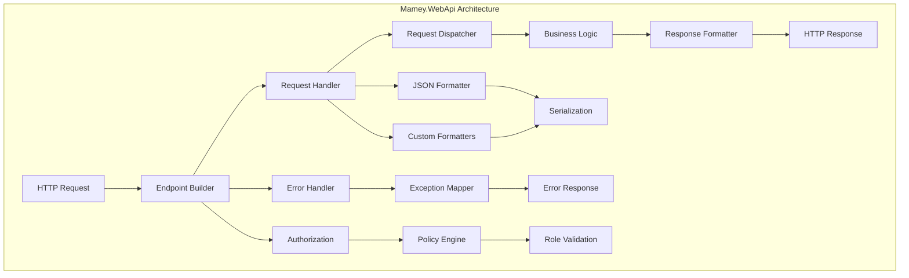

# Mamey.WebApi

A comprehensive Web API framework for building modern, scalable, and maintainable web services in .NET 9.0. This library provides essential components for creating RESTful APIs with built-in support for CQRS patterns, request/response handling, and advanced serialization.

## Table of Contents

- [Overview](#overview)
- [Key Features](#key-features)
- [Architecture](#architecture)
- [Installation](#installation)
- [Quick Start](#quick-start)
- [Core Components](#core-components)
- [API Reference](#api-reference)
- [Usage Examples](#usage-examples)
- [Configuration](#configuration)
- [Best Practices](#best-practices)
- [Troubleshooting](#troubleshooting)

## Overview

Mamey.WebApi is the foundational library for building web APIs in the Mamey ecosystem. It provides a clean, type-safe approach to handling HTTP requests and responses, with built-in support for JSON serialization, error handling, and endpoint management.

### Technical Overview

The library is built on top of ASP.NET Core and provides:

- **Request/Response Handling**: Type-safe request and response processing with automatic JSON serialization
- **Endpoint Management**: Fluent API for defining RESTful endpoints with built-in authorization support
- **Error Handling**: Global exception handling with customizable error response mapping
- **JSON Serialization**: Advanced JSON serialization with support for both System.Text.Json and Newtonsoft.Json
- **Custom Formatters**: Pluggable input/output formatters for different content types
- **Endpoint Discovery**: Automatic endpoint definition collection for API documentation

## Key Features

### Core Features

- **Type-Safe Request Handling**: Generic request handlers with automatic dependency injection
- **Fluent Endpoint API**: Clean, readable endpoint definition with support for all HTTP methods
- **Global Error Handling**: Centralized exception handling with customizable response mapping
- **JSON Serialization**: High-performance JSON serialization with configurable options
- **Authorization Integration**: Built-in support for ASP.NET Core authorization policies and roles
- **Endpoint Discovery**: Automatic collection of endpoint definitions for documentation

### Advanced Features

- **Custom Formatters**: Pluggable input/output formatters for different content types
- **Request Binding**: Automatic binding of request data from JSON, query parameters, and route values
- **Response Helpers**: Utility methods for common HTTP responses (Ok, Created, BadRequest, etc.)
- **Endpoint Metadata**: Rich metadata collection for API documentation and testing
- **Middleware Integration**: Seamless integration with ASP.NET Core middleware pipeline

## Architecture



## Installation

### Package Manager
```bash
Install-Package Mamey.WebApi
```

### .NET CLI
```bash
dotnet add package Mamey.WebApi
```

### PackageReference
```xml
<PackageReference Include="Mamey.WebApi" Version="2.0.*" />
```

## Quick Start

### Basic Setup

```csharp
using Mamey.WebApi;

var builder = WebApplication.CreateBuilder(args);

// Add Mamey WebApi services
builder.Services.AddMamey()
    .AddWebApi();

var app = builder.Build();

// Configure endpoints
app.UseWebApi()
    .Get("/api/health", ctx => ctx.Response.WriteAsync("OK"))
    .Post<UserRequest>("/api/users", async (request, ctx) =>
    {
        // Handle user creation
        await ctx.Response.WriteJsonAsync(new { Id = Guid.NewGuid(), Name = request.Name });
    });

app.Run();
```

### With CQRS Integration

```csharp
using Mamey.WebApi;
using Mamey.CQRS.Commands;
using Mamey.CQRS.Queries;

var builder = WebApplication.CreateBuilder(args);

builder.Services.AddMamey()
    .AddWebApi()
    .AddCommands()
    .AddQueries();

var app = builder.Build();

app.UseWebApi()
    .Post<CreateUserCommand>("/api/users", async (command, ctx) =>
    {
        await ctx.SendAsync(command);
        ctx.Response.StatusCode = 201;
    })
    .Get<GetUserQuery, UserDto>("/api/users/{id}", async (query, result, ctx) =>
    {
        await ctx.Response.WriteJsonAsync(result);
    });

app.Run();
```

## Core Components

### Request/Response System

#### IRequest Interface
```csharp
public interface IRequest
{
}
```

#### IRequestHandler Interface
```csharp
public interface IRequestHandler<in TRequest, TResult> 
    where TRequest : class, IRequest 
{
    Task<TResult> HandleAsync(TRequest request, CancellationToken cancellationToken = default);
}
```

#### IRequestDispatcher Interface
```csharp
public interface IRequestDispatcher
{
    Task<TResult> DispatchAsync<TRequest, TResult>(TRequest request, CancellationToken cancellationToken = default)
        where TRequest : class, IRequest;
}
```

### Endpoint Management

#### IEndpointsBuilder Interface
```csharp
public interface IEndpointsBuilder
{
    IEndpointsBuilder Get(string path, Func<HttpContext, Task> context = null,
        Action<IEndpointConventionBuilder> endpoint = null, bool auth = false, string roles = null,
        params string[] policies);

    IEndpointsBuilder Post<T>(string path, Func<T, HttpContext, Task> context = null,
        Action<IEndpointConventionBuilder> endpoint = null, bool auth = false, string roles = null,
        params string[] policies) where T : class;

    // ... other HTTP methods
}
```

#### WebApiEndpointDefinition
```csharp
public class WebApiEndpointDefinition
{
    public string Method { get; set; }
    public string Path { get; set; }
    public IEnumerable<WebApiEndpointParameter> Parameters { get; set; }
    public IEnumerable<WebApiEndpointResponse> Responses { get; set; }
}
```

### Error Handling

#### ErrorHandlerMiddleware
```csharp
internal sealed class ErrorHandlerMiddleware : IMiddleware
{
    public async Task InvokeAsync(HttpContext context, RequestDelegate next)
    {
        try
        {
            await next(context);
        }
        catch (Exception exception)
        {
            await HandleErrorAsync(context, exception);
        }
    }
}
```

#### IExceptionToResponseMapper
```csharp
public interface IExceptionToResponseMapper
{
    ExceptionResponse Map(Exception exception);
}
```

## API Reference

### Extension Methods

#### IMameyBuilder Extensions

```csharp
public static class WebApiExtensions
{
    public static IMameyBuilder AddWebApi(this IMameyBuilder builder, 
        Action<WebApiOptions> configure = null);
    
    public static IMameyBuilder AddWebApi(this IMameyBuilder builder, 
        WebApiOptions options);
}
```

#### IApplicationBuilder Extensions

```csharp
public static class WebApiApplicationExtensions
{
    public static IEndpointsBuilder UseWebApi(this IApplicationBuilder app);
    
    public static IApplicationBuilder UseErrorHandler(this IApplicationBuilder app);
    
    public static IApplicationBuilder UseJson(this IApplicationBuilder app, 
        Action<JsonOptions> configure = null);
}
```

### Request/Response Helpers

```csharp
public static class HttpContextExtensions
{
    public static Task<T> ReadJsonAsync<T>(this HttpContext context);
    public static T ReadQuery<T>(this HttpContext context);
    public static Task WriteJsonAsync<T>(this HttpContext context, T value);
    public static Task OkAsync<T>(this HttpContext context, T value);
    public static Task CreatedAsync<T>(this HttpContext context, T value);
    public static Task BadRequestAsync<T>(this HttpContext context, T value);
}
```

## Usage Examples

### Basic API Controller

```csharp
public class UsersController
{
    private readonly IRequestDispatcher _dispatcher;

    public UsersController(IRequestDispatcher dispatcher)
    {
        _dispatcher = dispatcher;
    }

    public async Task<UserDto> CreateUser(CreateUserRequest request)
    {
        return await _dispatcher.DispatchAsync<CreateUserRequest, UserDto>(request);
    }
}
```

### Request Handler Implementation

```csharp
public class CreateUserRequest : IRequest
{
    public string Name { get; set; }
    public string Email { get; set; }
}

public class CreateUserHandler : IRequestHandler<CreateUserRequest, UserDto>
{
    public async Task<UserDto> HandleAsync(CreateUserRequest request, CancellationToken cancellationToken = default)
    {
        // Business logic here
        return new UserDto
        {
            Id = Guid.NewGuid(),
            Name = request.Name,
            Email = request.Email
        };
    }
}
```

### Endpoint Configuration

```csharp
app.UseWebApi()
    .Get("/api/health", ctx => ctx.Response.WriteAsync("OK"))
    .Post<CreateUserRequest>("/api/users", async (request, ctx) =>
    {
        var dispatcher = ctx.RequestServices.GetRequiredService<IRequestDispatcher>();
        var result = await dispatcher.DispatchAsync<CreateUserRequest, UserDto>(request);
        await ctx.Response.WriteJsonAsync(result);
    })
    .Get<GetUserQuery, UserDto>("/api/users/{id}", async (query, result, ctx) =>
    {
        await ctx.Response.WriteJsonAsync(result);
    });
```

### Error Handling

```csharp
public class CustomExceptionMapper : IExceptionToResponseMapper
{
    public ExceptionResponse Map(Exception exception)
    {
        return exception switch
        {
            ValidationException ex => new ExceptionResponse(
                new { message = "Validation failed", errors = ex.Errors },
                HttpStatusCode.BadRequest),
            NotFoundException ex => new ExceptionResponse(
                new { message = ex.Message },
                HttpStatusCode.NotFound),
            _ => new ExceptionResponse(
                new { message = "An error occurred" },
                HttpStatusCode.InternalServerError)
        };
    }
}

// Register in DI
builder.Services.AddSingleton<IExceptionToResponseMapper, CustomExceptionMapper>();
```

### Custom Formatters

```csharp
public class CustomInputFormatter : IInputFormatter
{
    public bool CanRead(InputFormatterContext context)
    {
        return context.HttpContext.Request.ContentType == "application/x-custom";
    }

    public async Task<InputFormatterResult> ReadAsync(InputFormatterContext context)
    {
        // Custom deserialization logic
        var result = await DeserializeCustomFormat(context.HttpContext.Request.Body);
        return InputFormatterResult.Success(result);
    }
}

// Register formatter
builder.Services.Configure<MvcOptions>(options =>
{
    options.InputFormatters.Add(new CustomInputFormatter());
});
```

## Configuration

### WebApiOptions

```csharp
public class WebApiOptions
{
    public bool BindRequestFromRoute { get; set; }
}
```

### JSON Configuration

```csharp
builder.Services.Configure<JsonOptions>(options =>
{
    options.SerializerOptions.PropertyNamingPolicy = JsonNamingPolicy.CamelCase;
    options.SerializerOptions.WriteIndented = true;
    options.SerializerOptions.Converters.Add(new JsonStringEnumConverter());
});
```

### Error Handling Configuration

```csharp
builder.Services.AddSingleton<IExceptionToResponseMapper, CustomExceptionMapper>();
app.UseErrorHandler();
```

## Best Practices

### Request Handler Design

1. **Single Responsibility**: Each handler should handle one specific request type
2. **Async Operations**: Use async/await for all I/O operations
3. **Cancellation Support**: Always support cancellation tokens
4. **Error Handling**: Implement proper error handling and validation

```csharp
public class CreateUserHandler : IRequestHandler<CreateUserRequest, UserDto>
{
    private readonly IUserRepository _repository;
    private readonly IValidator<CreateUserRequest> _validator;

    public CreateUserHandler(IUserRepository repository, IValidator<CreateUserRequest> validator)
    {
        _repository = repository;
        _validator = validator;
    }

    public async Task<UserDto> HandleAsync(CreateUserRequest request, CancellationToken cancellationToken = default)
    {
        // Validate request
        var validationResult = await _validator.ValidateAsync(request, cancellationToken);
        if (!validationResult.IsValid)
        {
            throw new ValidationException(validationResult.Errors);
        }

        // Business logic
        var user = new User
        {
            Name = request.Name,
            Email = request.Email
        };

        await _repository.AddAsync(user, cancellationToken);

        return new UserDto
        {
            Id = user.Id,
            Name = user.Name,
            Email = user.Email
        };
    }
}
```

### Endpoint Organization

1. **RESTful Design**: Follow REST conventions for endpoint design
2. **Versioning**: Use API versioning for backward compatibility
3. **Documentation**: Use attributes and metadata for API documentation
4. **Authorization**: Apply appropriate authorization policies

```csharp
app.UseWebApi()
    .Get("/api/v1/users", ctx => GetUsers(ctx), auth: true, roles: "Admin")
    .Post<CreateUserRequest>("/api/v1/users", async (request, ctx) =>
    {
        await CreateUser(request, ctx);
    }, auth: true, policies: "CreateUser")
    .Get<GetUserQuery, UserDto>("/api/v1/users/{id}", async (query, result, ctx) =>
    {
        await ctx.Response.WriteJsonAsync(result);
    }, auth: true);
```

### Error Handling

1. **Centralized Handling**: Use global error handling middleware
2. **Consistent Responses**: Maintain consistent error response format
3. **Logging**: Log all exceptions for debugging
4. **User-Friendly Messages**: Provide meaningful error messages

```csharp
public class GlobalExceptionHandler : IExceptionToResponseMapper
{
    private readonly ILogger<GlobalExceptionHandler> _logger;

    public GlobalExceptionHandler(ILogger<GlobalExceptionHandler> logger)
    {
        _logger = logger;
    }

    public ExceptionResponse Map(Exception exception)
    {
        _logger.LogError(exception, "An unhandled exception occurred");

        return exception switch
        {
            ValidationException ex => new ExceptionResponse(
                new { message = "Validation failed", errors = ex.Errors },
                HttpStatusCode.BadRequest),
            NotFoundException ex => new ExceptionResponse(
                new { message = ex.Message },
                HttpStatusCode.NotFound),
            UnauthorizedAccessException ex => new ExceptionResponse(
                new { message = "Access denied" },
                HttpStatusCode.Forbidden),
            _ => new ExceptionResponse(
                new { message = "An internal error occurred" },
                HttpStatusCode.InternalServerError)
        };
    }
}
```

## Troubleshooting

### Common Issues

#### 1. Request Binding Issues

**Problem**: Request data not being bound correctly to model.

**Solution**: Ensure proper content type and model structure.

```csharp
// Ensure content type is set
context.Request.ContentType = "application/json";

// Use proper model binding
var request = await context.ReadJsonAsync<CreateUserRequest>();
```

#### 2. Serialization Errors

**Problem**: JSON serialization failing for complex types.

**Solution**: Configure JSON options properly.

```csharp
builder.Services.Configure<JsonOptions>(options =>
{
    options.SerializerOptions.PropertyNamingPolicy = JsonNamingPolicy.CamelCase;
    options.SerializerOptions.Converters.Add(new JsonStringEnumConverter());
    options.SerializerOptions.ReferenceHandler = ReferenceHandler.IgnoreCycles;
});
```

#### 3. Authorization Issues

**Problem**: Authorization not working as expected.

**Solution**: Ensure proper policy configuration and middleware order.

```csharp
// Configure authorization
builder.Services.AddAuthorization(options =>
{
    options.AddPolicy("CreateUser", policy => 
        policy.RequireRole("Admin").RequireClaim("permission", "create_user"));
});

// Ensure proper middleware order
app.UseAuthentication();
app.UseAuthorization();
app.UseWebApi();
```

#### 4. Endpoint Not Found

**Problem**: Endpoints returning 404.

**Solution**: Check endpoint registration and routing configuration.

```csharp
// Ensure endpoints are registered
app.UseRouting();
app.UseWebApi()
    .Get("/api/health", ctx => ctx.Response.WriteAsync("OK"));
app.MapControllers();
```

### Performance Considerations

1. **Async Operations**: Use async/await for all I/O operations
2. **Caching**: Implement appropriate caching strategies
3. **Serialization**: Use efficient serialization options
4. **Memory Management**: Dispose of resources properly

```csharp
public class OptimizedHandler : IRequestHandler<GetUsersRequest, IEnumerable<UserDto>>
{
    private readonly IUserRepository _repository;
    private readonly IMemoryCache _cache;

    public async Task<IEnumerable<UserDto>> HandleAsync(GetUsersRequest request, CancellationToken cancellationToken = default)
    {
        var cacheKey = $"users_{request.Page}_{request.PageSize}";
        
        if (_cache.TryGetValue(cacheKey, out IEnumerable<UserDto> cachedUsers))
        {
            return cachedUsers;
        }

        var users = await _repository.GetUsersAsync(request.Page, request.PageSize, cancellationToken);
        var userDtos = users.Select(u => new UserDto { Id = u.Id, Name = u.Name });
        
        _cache.Set(cacheKey, userDtos, TimeSpan.FromMinutes(5));
        
        return userDtos;
    }
}
```

### Debugging Tips

1. **Enable Logging**: Use structured logging for better debugging
2. **Request Tracing**: Implement request/response logging
3. **Exception Details**: Log detailed exception information
4. **Performance Monitoring**: Use performance counters and metrics

```csharp
public class RequestLoggingMiddleware : IMiddleware
{
    private readonly ILogger<RequestLoggingMiddleware> _logger;

    public async Task InvokeAsync(HttpContext context, RequestDelegate next)
    {
        _logger.LogInformation("Request: {Method} {Path}", 
            context.Request.Method, context.Request.Path);

        var stopwatch = Stopwatch.StartNew();
        await next(context);
        stopwatch.Stop();

        _logger.LogInformation("Response: {StatusCode} in {ElapsedMs}ms", 
            context.Response.StatusCode, stopwatch.ElapsedMilliseconds);
    }
}
```

## License

This project is licensed under the MIT License - see the LICENSE file for details.

## Contributing

Please read Contributing Guide for details on our code of conduct and the process for submitting pull requests.

## Support

For support and questions, please open an issue in the [GitHub repository](https://github.com/mamey-io/mamey-webapi/issues).
