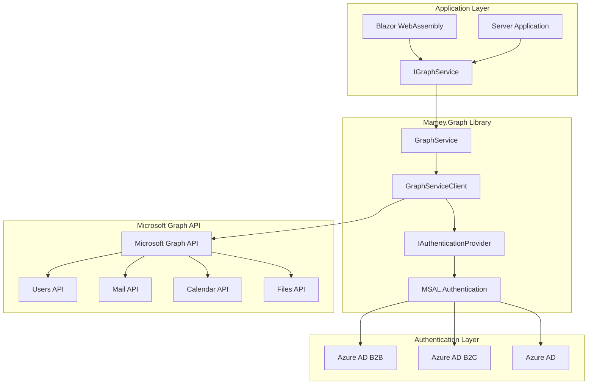
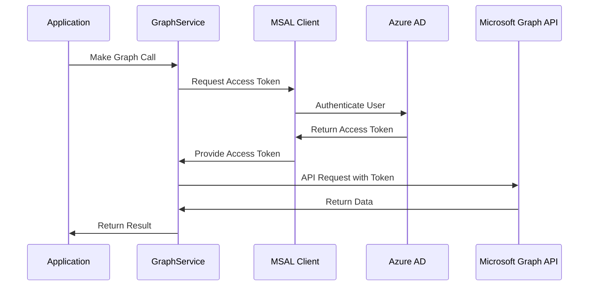
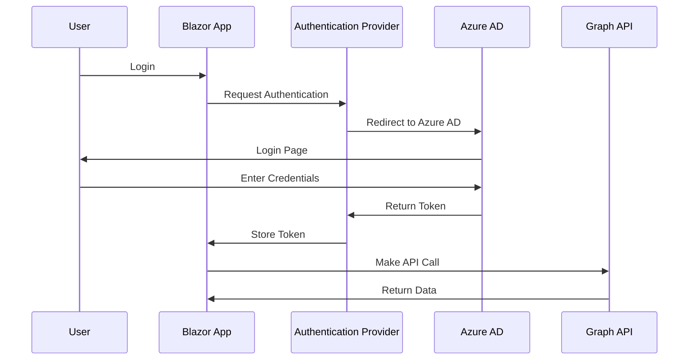

# Mamey.Graph

**Library**: `Mamey.Graph`  
**Location**: `Mamey/src/Mamey.Graph/`  
**Type**: Integration Library - Microsoft Graph  
**Version**: 2.0.*  
**Files**: 27 C# files  
**Namespace**: `Mamey.Graph`, `Mamey.Graph.Services`, `Mamey.Graph.Msal`, `Mamey.Graph.Providers`

## Overview

Mamey.Graph provides comprehensive Microsoft Graph integration for the Mamey framework. It enables seamless integration with Microsoft 365 services including user management, email, calendar, and other Microsoft Graph APIs. The library supports both client-side (Blazor WebAssembly) and server-side authentication using MSAL (Microsoft Authentication Library).

### Conceptual Foundation

**Microsoft Graph** is Microsoft's unified API endpoint for accessing data and intelligence across Microsoft 365, Azure AD, and other Microsoft services. Key concepts:

1. **Microsoft Graph API**: Unified API for accessing Microsoft 365 data
2. **MSAL (Microsoft Authentication Library)**: Authentication library for Microsoft identity platform
3. **Azure AD Authentication**: Authentication using Azure Active Directory
4. **OAuth 2.0**: Authorization framework for secure API access
5. **Scopes**: Permissions required to access specific resources
6. **Client vs Server**: Different authentication flows for client-side and server-side applications

**Why Mamey.Graph?**

Provides:
- **Microsoft 365 Integration**: Access to Microsoft 365 services (Users, Mail, Calendar, etc.)
- **MSAL Integration**: Seamless integration with MSAL for authentication
- **Blazor Support**: Built-in support for Blazor WebAssembly authentication
- **Server-Side Support**: Support for server-side authentication flows
- **Token Management**: Automatic token acquisition and refresh
- **Downstream Apps**: Support for accessing downstream applications with additional scopes

**Use Cases:**
- User management in Microsoft 365
- Email and calendar operations
- File and document access
- Organization directory queries
- Team and collaboration features
- Application integration with Microsoft 365

## Architecture

### Microsoft Graph Integration Architecture



### Authentication Flow



### Blazor WebAssembly Authentication Flow



## Core Components

### IGraphService - Graph Service Interface

Interface for Microsoft Graph operations:

```csharp
public interface IGraphService
{
    Task DisplayAccessTokenAsync();
    Task<List<User>?> ListUsersAsync();
    Task MakeGraphCallAsync();
    Task<List<Message>> GetSharedMailboxMessagesAsync(string sharedMailboxEmail);
    Task<Message?> SendSharedMailboxMessageAsync(
        string sharedMailboxEmail,
        Message message,
        CancellationToken cancellationToken = default);
    Task<User?> CreateUserAsync(User user);
}
```

### GraphService - Graph Service Implementation

Implementation of `IGraphService` using Microsoft Graph SDK:

```csharp
public class GraphService : IGraphService
{
    private readonly GraphServiceClient _graphClient;
    private readonly ILogger<GraphService> _logger;

    public GraphService(
        GraphServiceClient graphClient,
        ILogger<GraphService> logger)
    {
        _graphClient = graphClient;
        _logger = logger;
    }

    // Implementation methods...
}
```

### GraphOptions - Configuration Options

Configuration options for Microsoft Graph:

```csharp
public class GraphOptions : AzureOptions
{
    public string? BaseUrl { get; set; }
    public string? Instance { get; set; }
    public List<DownstreamApp>? DownstreamApps { get; set; }
}

public class DownstreamApp
{
    public string? Name { get; set; }
    public string? Scopes { get; set; }
}
```

### Blazor Authentication Services

#### IBlazorAuthenticationService

Interface for Blazor authentication operations:

```csharp
public interface IBlazorAuthenticationService
{
    Task<string> GetAccessTokenAsync();
    Task SignInAsync();
    Task SignOutAsync();
    Task<bool> IsAuthenticatedAsync();
}
```

#### BlazorAuthenticationService

Implementation for Blazor WebAssembly authentication:

```csharp
public class BlazorAuthenticationService : IBlazorAuthenticationService
{
    private readonly ITokenService _tokenService;
    private readonly AuthenticationStateProvider _authenticationStateProvider;

    // Implementation methods...
}
```

### Token Services

#### ITokenService - Token Service Interface

Interface for token management:

```csharp
public interface ITokenService
{
    Task<string> GetAccessTokenAsync();
    Task<string> GetRefreshTokenAsync();
    Task StoreAccessTokenAsync(string accessToken);
    Task StoreRefreshTokenAsync(string refreshToken);
    Task RefreshAccessTokenAsync(string refreshToken);
    Task ClearTokenAsync();
}
```

#### IJwtService - JWT Service Interface

Interface for JWT token operations:

```csharp
public interface IJwtService
{
    Task<string> GetTokenAsync();
    Task<bool> IsTokenValidAsync();
    Task RefreshTokenAsync();
}
```

### MSAL Integration

#### MsalService - MSAL Service

Service for MSAL authentication operations:

```csharp
public class MsalService
{
    // MSAL authentication methods
    public Task<MsalAuthenticationResult> AcquireTokenAsync();
    public Task<DeviceCodeResult> AcquireTokenWithDeviceCodeAsync();
    // ... other MSAL methods
}
```

#### MsalClientBuilder - MSAL Client Builder

Builder for configuring MSAL clients:

```csharp
public class MsalClientBuilder
{
    public MsalClientBuilder ConfigurePublicClient();
    public MsalClientBuilder ConfigureConfidentialClient();
    // ... configuration methods
}
```

### Token Authentication State Provider

#### TokenAuthenticationStateProvider

Custom authentication state provider for token-based authentication:

```csharp
public class TokenAuthenticationStateProvider : AuthenticationStateProvider
{
    // Token-based authentication state management
    public Task<AuthenticationState> GetAuthenticationStateAsync();
    public void NotifyAuthenticationStateChanged();
}
```

## Installation

### Prerequisites

1. **Microsoft Graph SDK**: Microsoft.Graph NuGet package
2. **MSAL**: Microsoft Authentication Library
3. **Azure AD App Registration**: App registration in Azure AD
4. **.NET 9.0**: Ensure .NET 9.0 SDK is installed
5. **Mamey.Azure**: Azure integration library

### NuGet Package

```bash
dotnet add package Mamey.Graph
```

### Dependencies

- **Mamey** - Core framework
- **Mamey.Azure.Abstractions** - Azure abstractions
- **Microsoft.Graph** - Microsoft Graph SDK
- **Microsoft.Graph.Auth** - Microsoft Graph authentication
- **Microsoft.AspNetCore.Components.Authorization** - Blazor authentication

## Quick Start

### Basic Setup

```csharp
using Mamey;
using Mamey.Graph;

var builder = WebApplication.CreateBuilder(args);

// Add Microsoft Graph services
builder.Services
    .AddMamey()
    .AddGraphClient();
```

### Configuration

Add to `appsettings.json`:

```json
{
  "AzureAd": {
    "Instance": "https://login.microsoftonline.com/",
    "Domain": "yourdomain.onmicrosoft.com",
    "TenantId": "your-tenant-id",
    "ClientId": "your-client-id",
    "ClientSecret": "your-client-secret",
    "CallbackPath": "/signin-oidc",
    "Scopes": "https://graph.microsoft.com/.default",
    "BaseUrl": "https://graph.microsoft.com/v1.0"
  }
}
```

## Usage Examples

### Example 1: List Users

```csharp
using Mamey.Graph;
using Microsoft.Graph.Models;

public class UserManagementService
{
    private readonly IGraphService _graphService;
    private readonly ILogger<UserManagementService> _logger;

    public UserManagementService(
        IGraphService graphService,
        ILogger<UserManagementService> logger)
    {
        _graphService = graphService;
        _logger = logger;
    }

    public async Task<List<User>> GetAllUsersAsync()
    {
        try
        {
            _logger.LogInformation("Retrieving all users from Microsoft Graph");

            var users = await _graphService.ListUsersAsync();

            _logger.LogInformation("Retrieved {Count} users from Microsoft Graph", users?.Count ?? 0);

            return users ?? new List<User>();
        }
        catch (Exception ex)
        {
            _logger.LogError(ex, "Failed to retrieve users from Microsoft Graph");
            throw;
        }
    }
}
```

### Example 2: Create User

```csharp
using Mamey.Graph;
using Microsoft.Graph.Models;

public class UserCreationService
{
    private readonly IGraphService _graphService;
    private readonly ILogger<UserCreationService> _logger;

    public UserCreationService(
        IGraphService graphService,
        ILogger<UserCreationService> logger)
    {
        _graphService = graphService;
        _logger = logger;
    }

    public async Task<User> CreateNewUserAsync(
        string displayName,
        string mailNickname,
        string userPrincipalName,
        string password)
    {
        try
        {
            _logger.LogInformation("Creating new user: {UserPrincipalName}", userPrincipalName);

            var newUser = new User
            {
                DisplayName = displayName,
                MailNickname = mailNickname,
                UserPrincipalName = userPrincipalName,
                AccountEnabled = true,
                PasswordProfile = new PasswordProfile
                {
                    ForceChangePasswordNextSignIn = true,
                    Password = password
                }
            };

            var createdUser = await _graphService.CreateUserAsync(newUser);

            _logger.LogInformation("Successfully created user: {UserId}", createdUser?.Id);

            return createdUser!;
        }
        catch (Exception ex)
        {
            _logger.LogError(ex, "Failed to create user: {UserPrincipalName}", userPrincipalName);
            throw;
        }
    }
}
```

### Example 3: Access Shared Mailbox

```csharp
using Mamey.Graph;
using Microsoft.Graph.Models;

public class EmailService
{
    private readonly IGraphService _graphService;
    private readonly ILogger<EmailService> _logger;

    public EmailService(
        IGraphService graphService,
        ILogger<EmailService> logger)
    {
        _graphService = graphService;
        _logger = logger;
    }

    public async Task<List<Message>> GetSharedMailboxMessagesAsync(string sharedMailboxEmail)
    {
        try
        {
            _logger.LogInformation("Retrieving messages from shared mailbox: {Email}", sharedMailboxEmail);

            var messages = await _graphService.GetSharedMailboxMessagesAsync(sharedMailboxEmail);

            _logger.LogInformation(
                "Retrieved {Count} messages from shared mailbox: {Email}",
                messages?.Count ?? 0,
                sharedMailboxEmail);

            return messages ?? new List<Message>();
        }
        catch (Exception ex)
        {
            _logger.LogError(ex, "Failed to retrieve messages from shared mailbox: {Email}", sharedMailboxEmail);
            throw;
        }
    }

    public async Task<Message> SendMessageToSharedMailboxAsync(
        string sharedMailboxEmail,
        Message message)
    {
        try
        {
            _logger.LogInformation("Sending message to shared mailbox: {Email}", sharedMailboxEmail);

            var sentMessage = await _graphService.SendSharedMailboxMessageAsync(
                sharedMailboxEmail,
                message);

            _logger.LogInformation("Successfully sent message to shared mailbox: {Email}", sharedMailboxEmail);

            return sentMessage!;
        }
        catch (Exception ex)
        {
            _logger.LogError(ex, "Failed to send message to shared mailbox: {Email}", sharedMailboxEmail);
            throw;
        }
    }
}
```

### Example 4: Blazor WebAssembly Authentication

```csharp
using Mamey.Graph;
using Mamey.Graph.Services;
using Microsoft.AspNetCore.Components.Authorization;

public class BlazorUserService
{
    private readonly IBlazorAuthenticationService _authService;
    private readonly IGraphService _graphService;
    private readonly ILogger<BlazorUserService> _logger;

    public BlazorUserService(
        IBlazorAuthenticationService authService,
        IGraphService graphService,
        ILogger<BlazorUserService> logger)
    {
        _authService = authService;
        _graphService = graphService;
        _logger = logger;
    }

    public async Task<bool> LoginAsync()
    {
        try
        {
            _logger.LogInformation("Initiating user login");

            await _authService.SignInAsync();

            var isAuthenticated = await _authService.IsAuthenticatedAsync();

            if (isAuthenticated)
            {
                _logger.LogInformation("User successfully logged in");
                return true;
            }

            _logger.LogWarning("User login failed");
            return false;
        }
        catch (Exception ex)
        {
            _logger.LogError(ex, "Error during user login");
            throw;
        }
    }

    public async Task LogoutAsync()
    {
        try
        {
            _logger.LogInformation("Initiating user logout");

            await _authService.SignOutAsync();

            _logger.LogInformation("User successfully logged out");
        }
        catch (Exception ex)
        {
            _logger.LogError(ex, "Error during user logout");
            throw;
        }
    }

    public async Task<List<User>> GetUsersAsync()
    {
        var isAuthenticated = await _authService.IsAuthenticatedAsync();

        if (!isAuthenticated)
        {
            throw new UnauthorizedAccessException("User is not authenticated");
        }

        var accessToken = await _authService.GetAccessTokenAsync();
        _logger.LogInformation("Access token retrieved for Graph API call");

        return await _graphService.ListUsersAsync() ?? new List<User>();
    }
}
```

### Example 5: Server-Side Authentication

```csharp
using Mamey.Graph;
using Microsoft.Graph.Models;

public class ServerSideGraphService
{
    private readonly IGraphService _graphService;
    private readonly ILogger<ServerSideGraphService> _logger;

    public ServerSideGraphService(
        IGraphService graphService,
        ILogger<ServerSideGraphService> logger)
    {
        _graphService = graphService;
        _logger = logger;
    }

    public async Task<List<User>> GetUsersAsync()
    {
        try
        {
            _logger.LogInformation("Making server-side Graph API call to retrieve users");

            var users = await _graphService.ListUsersAsync();

            _logger.LogInformation("Retrieved {Count} users from Microsoft Graph", users?.Count ?? 0);

            return users ?? new List<User>();
        }
        catch (Exception ex)
        {
            _logger.LogError(ex, "Failed to retrieve users from Microsoft Graph");
            throw;
        }
    }
}
```

### Example 6: Downstream App Integration

```csharp
using Mamey.Graph;

// Configure downstream apps in appsettings.json
{
  "AzureAd": {
    "DownstreamApps": [
      {
        "Name": "BankApiGateway",
        "Scopes": "api://bank-api-gateway/.default"
      },
      {
        "Name": "PaymentService",
        "Scopes": "api://payment-service/.default"
      }
    ]
  }
}

// Use in application
builder.Services
    .AddMamey()
    .AddWebAssembyGraph(
        scopes: new List<DownstreamApp>
        {
            new DownstreamApp
            {
                Name = "BankApiGateway",
                Scopes = "api://bank-api-gateway/.default"
            }
        }
    );
```

### Example 7: Token Management

```csharp
using Mamey.Graph.Services;

public class TokenManagementService
{
    private readonly ITokenService _tokenService;
    private readonly IJwtService _jwtService;
    private readonly ILogger<TokenManagementService> _logger;

    public TokenManagementService(
        ITokenService tokenService,
        IJwtService jwtService,
        ILogger<TokenManagementService> logger)
    {
        _tokenService = tokenService;
        _jwtService = jwtService;
        _logger = logger;
    }

    public async Task<string> GetValidAccessTokenAsync()
    {
        try
        {
            var token = await _tokenService.GetAccessTokenAsync();

            if (string.IsNullOrEmpty(token))
            {
                _logger.LogWarning("Access token is null or empty");
                throw new InvalidOperationException("Access token is not available");
            }

            var isValid = await _jwtService.IsTokenValidAsync();

            if (!isValid)
            {
                _logger.LogInformation("Access token is invalid, refreshing...");
                var refreshToken = await _tokenService.GetRefreshTokenAsync();
                token = await _tokenService.RefreshAccessTokenAsync(refreshToken);
            }

            return token;
        }
        catch (Exception ex)
        {
            _logger.LogError(ex, "Failed to get valid access token");
            throw;
        }
    }
}
```

## Extension Methods

### AddGraphClient

Registers Microsoft Graph services with the Mamey builder:

```csharp
public static IMameyBuilder AddGraphClient(
    this IMameyBuilder builder,
    List<DownstreamApp>? scopes = null,
    GraphOptions? graphOptions = null,
    string sectionName = "azureAd")
```

**Features:**
- Registers GraphServiceClient
- Configures MSAL authentication
- Sets up Blazor authentication state provider
- Configures downstream app scopes

**Usage:**
```csharp
builder.Services
    .AddMamey()
    .AddGraphClient();
```

### AddWebAssembyGraph

Registers Microsoft Graph services for Blazor WebAssembly:

```csharp
public static IMameyBuilder AddWebAssembyGraph(
    this IMameyBuilder builder,
    List<DownstreamApp> scopes,
    string sectionName = "azureAd")
```

**Features:**
- Registers GraphServiceClient for Blazor
- Configures MSAL Public Client
- Sets up Blazor authentication
- Configures downstream app scopes

**Usage:**
```csharp
builder.Services
    .AddMamey()
    .AddWebAssembyGraph(
        scopes: new List<DownstreamApp>
        {
            new DownstreamApp { Name = "MyApp", Scopes = "api://myapp/.default" }
        }
    );
```

## Best Practices

### 1. Use Appropriate Authentication Type

**✅ Good: Choose correct authentication type**
```csharp
// For Blazor WebAssembly (client-side)
builder.Services
    .AddMamey()
    .AddWebAssembyGraph(scopes);

// For server-side applications
builder.Services
    .AddMamey()
    .AddGraphClient();
```

### 2. Handle Token Refresh

**✅ Good: Implement token refresh logic**
```csharp
var isValid = await _jwtService.IsTokenValidAsync();
if (!isValid)
{
    var refreshToken = await _tokenService.GetRefreshTokenAsync();
    await _tokenService.RefreshAccessTokenAsync(refreshToken);
}
```

### 3. Error Handling

**✅ Good: Comprehensive error handling**
```csharp
try
{
    var users = await _graphService.ListUsersAsync();
}
catch (ServiceException ex)
{
    _logger.LogError(ex, "Graph API error: {StatusCode}", ex.StatusCode);
    // Handle specific Graph API errors
}
catch (Exception ex)
{
    _logger.LogError(ex, "Unexpected error calling Graph API");
    throw;
}
```

### 4. Use Scopes Appropriately

**✅ Good: Request only necessary scopes**
```json
{
  "AzureAd": {
    "Scopes": "https://graph.microsoft.com/User.Read https://graph.microsoft.com/Mail.Read"
  }
}
```

### 5. Secure Client Secrets

**✅ Good: Store secrets securely**
```csharp
// Use Azure Key Vault or environment variables
var clientSecret = builder.Configuration["AzureAd:ClientSecret"];
// Or use User Secrets in development
```

## Troubleshooting

### Common Issues

#### Authentication Failures

**Problem**: Authentication fails with "AADSTS" errors.

**Solution**:
1. Verify Azure AD app registration is correct
2. Check client ID and secret are valid
3. Verify redirect URIs are configured
4. Check scopes are granted in Azure AD
5. Ensure tenant ID is correct

#### Token Acquisition Failures

**Problem**: Cannot acquire access token.

**Solution**:
1. Check MSAL configuration is correct
2. Verify scopes are requested correctly
3. Check user consent is granted
4. Verify token cache is working
5. Check network connectivity to Azure AD

#### Graph API Errors

**Problem**: Graph API calls return errors.

**Solution**:
1. Check access token is valid
2. Verify scopes include required permissions
3. Check user has necessary permissions
4. Verify API endpoint URLs are correct
5. Check rate limiting hasn't been exceeded

## Related Libraries

- **Mamey.Azure.Abstractions**: Azure abstraction layer
- **Mamey.Auth.Azure**: Azure authentication
- **Microsoft.Graph**: Microsoft Graph SDK

## Additional Resources

- [Microsoft Graph Documentation](https://docs.microsoft.com/en-us/graph/)
- [Microsoft Graph SDK](https://github.com/microsoftgraph/msgraph-sdk-dotnet)
- [MSAL.NET Documentation](https://docs.microsoft.com/en-us/azure/active-directory/develop/msal-net-overview)
- [Azure AD App Registration](https://docs.microsoft.com/en-us/azure/active-directory/develop/quickstart-register-app)
- [Mamey Framework Documentation](../)
- Mamey.Graph Memory Documentation

## Tags

#microsoft-graph #azure-ad #msal #blazor #authentication #microsoft-365 #mamey

