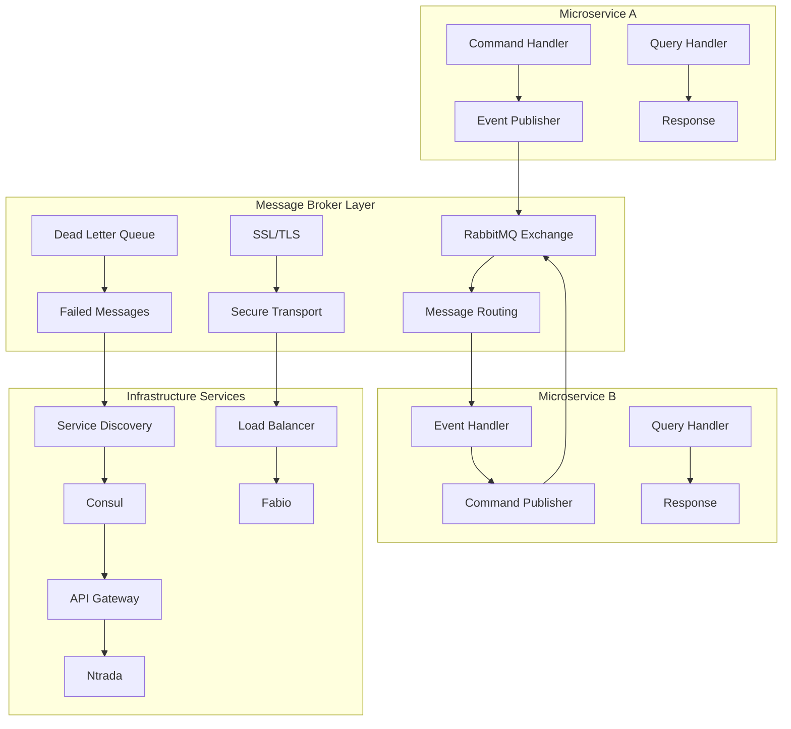
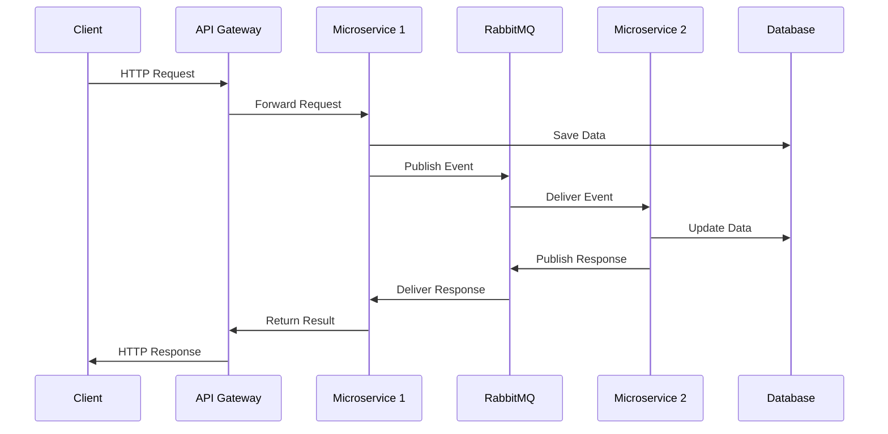
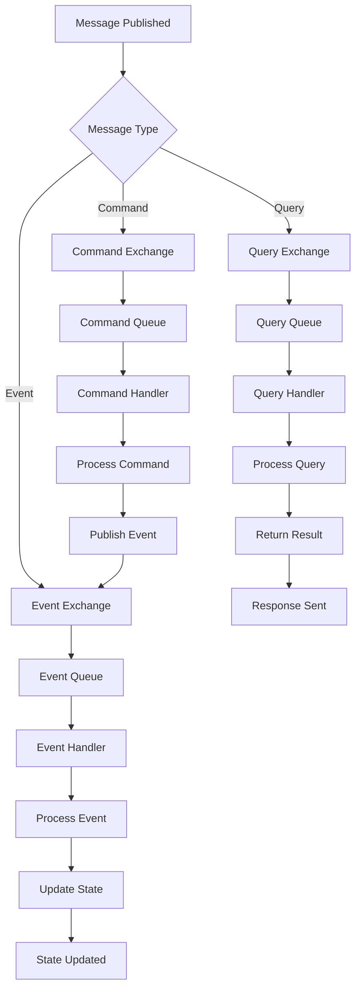
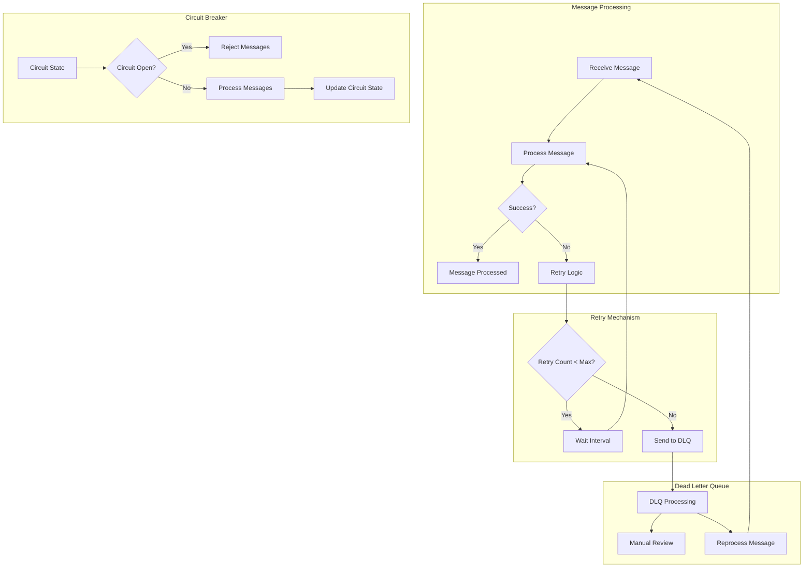
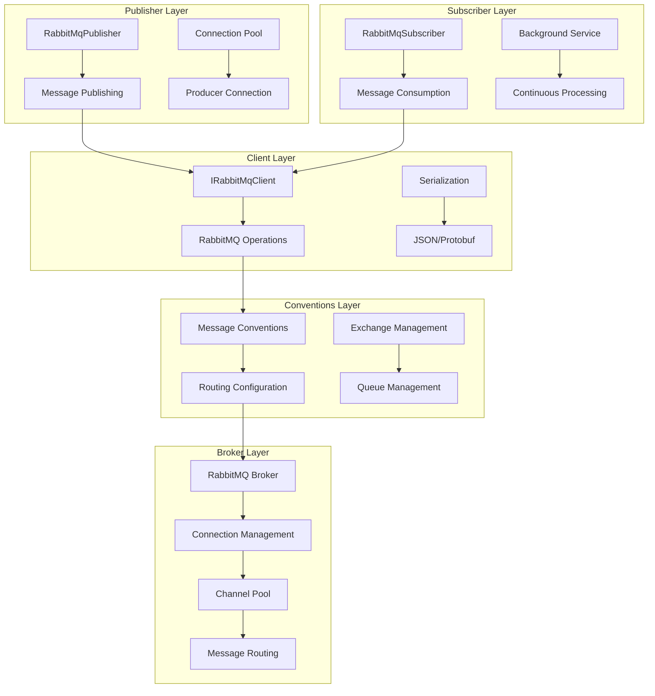
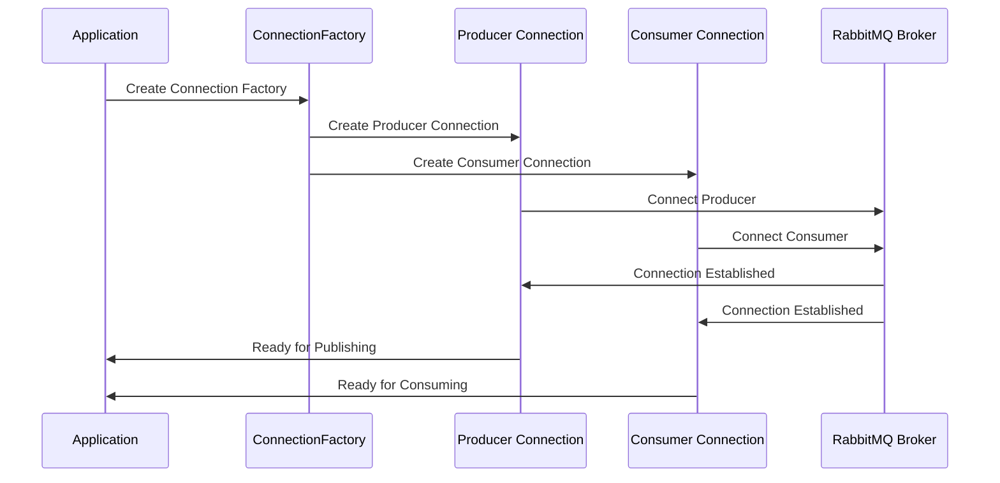
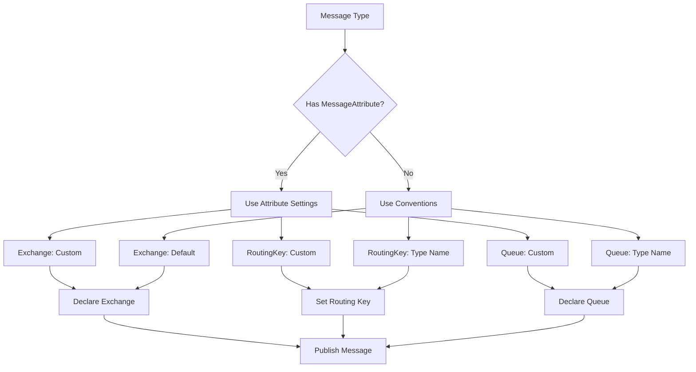
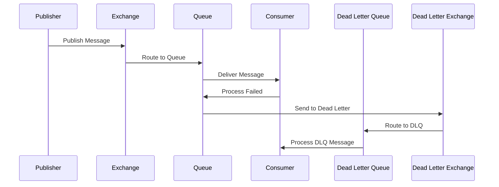
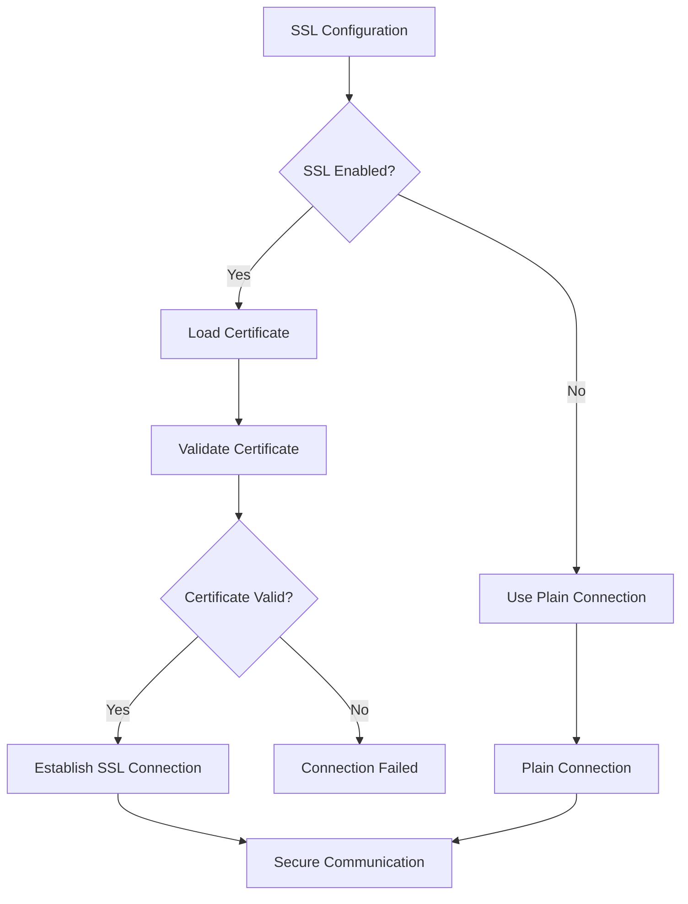

# Mamey.MessageBrokers.RabbitMQ

The Mamey.MessageBrokers.RabbitMQ library provides a complete RabbitMQ implementation for the Mamey message broker abstraction. It offers high-performance message publishing and consumption with advanced features like SSL support, connection pooling, dead letter queues, and comprehensive configuration options.

## Asynchronous Messaging in Mamey

**RabbitMQ Integration with CQRS, Jaeger, Outbox Patterns, and Dead Letter Queues**

Mamey's messaging module provides seamless RabbitMQ integration for .NET microservices, enabling asynchronous message handling across services using:
* RabbitMQ as the transport layer
* Declarative configuration and convention-based routing
* CQRS integration for commands and events
* Optional Jaeger tracing and Outbox support
* Advanced message routing and dead letter queue handling
* SSL/TLS security and connection pooling
* Plugin architecture for extensibility

This guide covers how to install, configure, publish, subscribe, trace, and guarantee delivery of messages using Mamey.

## Microservice Communication Architecture



## Message Flow and Processing



## Advanced Message Routing



## Error Handling and Resilience



## Technical Overview

Mamey.MessageBrokers.RabbitMQ implements several key patterns:

- **RabbitMQ Integration**: Complete implementation of RabbitMQ client with connection management
- **Message Conventions**: Automatic routing configuration based on message types and attributes
- **Connection Pooling**: Separate producer and consumer connections for optimal performance
- **SSL Support**: Full SSL/TLS support with certificate validation and custom CA certificates
- **Dead Letter Queues**: Built-in support for failed message handling and retry mechanisms
- **Plugin System**: Extensible plugin architecture for custom message processing
- **Background Processing**: Hosted service for continuous message consumption
- **Outbox Pattern**: Reliable message delivery with transactional guarantees
- **Circuit Breaker**: Resilience patterns for handling service failures
- **Message Serialization**: Support for JSON, Protobuf, and custom serializers
- **Connection Recovery**: Automatic reconnection and network recovery
- **QoS Management**: Quality of Service configuration for message consumption
- **Message Persistence**: Configurable message durability and persistence
- **Correlation Context**: Distributed tracing and correlation ID support
- **Exception Mapping**: Automatic exception to message mapping for error handling

## Architecture

The library follows a layered architecture:



### RabbitMQ Connection Management



### Message Routing and Conventions



### Dead Letter Queue Flow



### SSL/TLS Configuration Flow



## Core Components

### Message Publishing
- **RabbitMqPublisher**: RabbitMQ implementation of `IBusPublisher`
- **Connection Management**: Separate producer connections for optimal performance
- **Message Serialization**: Support for JSON serialization (System.Text.Json and Newtonsoft.Json)
- **Routing**: Automatic exchange and routing key resolution

### Message Subscription
- **RabbitMqSubscriber**: RabbitMQ implementation of `IBusSubscriber`
- **Background Service**: Hosted service for continuous message consumption
- **Message Processing**: Asynchronous message processing with timeout handling
- **Error Handling**: Built-in retry mechanisms and dead letter queue support

### Connection Management
- **Producer Connection**: Dedicated connection for message publishing
- **Consumer Connection**: Dedicated connection for message consumption
- **Connection Pooling**: Automatic connection management and recovery
- **SSL Support**: Full SSL/TLS support with certificate validation

### Conventions System
- **Message Conventions**: Automatic routing configuration based on message types
- **Exchange Management**: Automatic exchange declaration and configuration
- **Queue Management**: Automatic queue creation and binding
- **Dead Letter Queues**: Automatic dead letter queue setup for failed messages

## Installation

### NuGet Package
```bash
dotnet add package Mamey.MessageBrokers.RabbitMQ
```

### Prerequisites
- .NET 9.0 or later
- Mamey (core framework)
- Mamey.MessageBrokers (abstractions)
- RabbitMQ server

## Key Features

- **High Performance**: Optimized for high-throughput message processing
- **Connection Pooling**: Separate producer and consumer connections
- **SSL Support**: Full SSL/TLS support with certificate validation
- **Dead Letter Queues**: Built-in failed message handling
- **Message Conventions**: Automatic routing configuration
- **Plugin System**: Extensible architecture for custom processing
- **Background Processing**: Hosted service for continuous consumption
- **Retry Mechanisms**: Configurable retry policies for failed messages
- **Message Persistence**: Configurable message durability
- **QoS Support**: Quality of Service configuration for message consumption

## Quick Start

### Basic Setup

```csharp
using Mamey;
using Mamey.MessageBrokers.RabbitMQ;

var builder = WebApplication.CreateBuilder(args);

// Create Mamey builder
var mameyBuilder = MameyBuilder.Create(builder.Services, builder.Configuration);

// Add RabbitMQ message broker
mameyBuilder.AddRabbitMq();

var app = builder.Build();
app.Run();
```

### Configuration

```json
{
  "rabbitmq": {
    "connectionName": "mamey-app",
    "hostNames": ["localhost"],
    "port": 5672,
    "virtualHost": "/",
    "username": "guest",
    "password": "guest",
    "requestedHeartbeat": "00:01:00",
    "requestedConnectionTimeout": "00:00:30",
    "socketReadTimeout": "00:00:30",
    "socketWriteTimeout": "00:00:30",
    "continuationTimeout": "00:00:20",
    "handshakeContinuationTimeout": "00:00:10",
    "networkRecoveryInterval": "00:00:05",
    "messageProcessingTimeout": "00:05:00",
    "requestedChannelMax": 0,
    "requestedFrameMax": 0,
    "useBackgroundThreadsForIO": false,
    "conventionsCasing": "snakeCase",
    "retries": 3,
    "retryInterval": 1000,
    "messagesPersisted": true,
    "requeueFailedMessages": true,
    "maxProducerChannels": 10,
    "spanContextHeader": "span_context",
    "context": {
      "enabled": true,
      "header": "correlation_context"
    },
    "exchange": {
      "name": "mamey",
      "type": "topic",
      "declare": true,
      "durable": true,
      "autoDelete": false
    },
    "queue": {
      "template": "{0}",
      "declare": true,
      "durable": true,
      "exclusive": false,
      "autoDelete": false
    },
    "deadLetter": {
      "enabled": true,
      "prefix": "dlx",
      "suffix": "failed",
      "declare": true,
      "durable": true,
      "exclusive": false,
      "autoDelete": false,
      "ttl": 86400000
    },
    "qos": {
      "prefetchSize": 0,
      "prefetchCount": 1,
      "global": false
    },
    "conventions": {
      "messageAttribute": {
        "ignoreExchange": false,
        "ignoreRoutingKey": false,
        "ignoreQueue": false
      }
    },
    "logger": {
      "enabled": true,
      "logConnectionStatus": true,
      "logMessagePayload": false
    },
    "ssl": {
      "enabled": false,
      "serverName": "localhost",
      "certificatePath": null,
      "caCertificatePath": null,
      "x509IgnoredStatuses": []
    }
  }
}
```

### Define Messages with Routing

```csharp
using Mamey.MessageBrokers;

// Simple message
public class UserCreatedMessage
{
    public Guid UserId { get; set; }
    public string Name { get; set; }
    public string Email { get; set; }
    public DateTime CreatedAt { get; set; }
}

// Message with routing configuration
[Message(exchange: "users", routingKey: "user.created")]
public class UserCreatedEvent
{
    public Guid UserId { get; set; }
    public string Name { get; set; }
    public string Email { get; set; }
    public DateTime CreatedAt { get; set; }
}

// Message with external routing
[Message(exchange: "external", routingKey: "notification.send", external: true)]
public class NotificationMessage
{
    public string Recipient { get; set; }
    public string Subject { get; set; }
    public string Body { get; set; }
}
```

### Publish Messages

```csharp
using Mamey.MessageBrokers;

public class UserService
{
    private readonly IBusPublisher _publisher;
    private readonly ILogger<UserService> _logger;

    public UserService(IBusPublisher publisher, ILogger<UserService> logger)
    {
        _publisher = publisher;
        _logger = logger;
    }

    public async Task CreateUserAsync(string name, string email)
    {
        var user = new User
        {
            Id = Guid.NewGuid(),
            Name = name,
            Email = email,
            CreatedAt = DateTime.UtcNow
        };

        // Save user to database
        await _userRepository.AddAsync(user);

        // Publish user created message
        var message = new UserCreatedMessage
        {
            UserId = user.Id,
            Name = user.Name,
            Email = user.Email,
            CreatedAt = user.CreatedAt
        };

        await _publisher.PublishAsync(message);
        _logger.LogInformation("User created and message published: {UserId}", user.Id);
    }

    public async Task PublishWithCorrelationAsync(string name, string email, string correlationId)
    {
        var message = new UserCreatedMessage
        {
            UserId = Guid.NewGuid(),
            Name = name,
            Email = email,
            CreatedAt = DateTime.UtcNow
        };

        // Publish with correlation ID and headers
        await _publisher.PublishAsync(
            message, 
            correlationId: correlationId,
            headers: new Dictionary<string, object>
            {
                ["source"] = "user-service",
                ["version"] = "1.0.0",
                ["priority"] = "high"
            });

        _logger.LogInformation("User message published with correlation: {CorrelationId}", correlationId);
    }
}
```

### Subscribe to Messages

```csharp
using Mamey.MessageBrokers;

public class UserEventHandler
{
    private readonly ILogger<UserEventHandler> _logger;

    public UserEventHandler(ILogger<UserEventHandler> logger)
    {
        _logger = logger;
    }

    public async Task HandleUserCreatedAsync(UserCreatedMessage message, object context)
    {
        _logger.LogInformation("Processing user created event: {UserId}", message.UserId);
        
        try
        {
            // Process the message
            await ProcessUserCreatedAsync(message);
            _logger.LogInformation("User created event processed successfully: {UserId}", message.UserId);
        }
        catch (Exception ex)
        {
            _logger.LogError(ex, "Failed to process user created event: {UserId}", message.UserId);
            throw; // Re-throw to trigger retry mechanism
        }
    }

    private async Task ProcessUserCreatedAsync(UserCreatedMessage message)
    {
        // Send welcome email
        await _emailService.SendWelcomeEmailAsync(message.Email, message.Name);
        
        // Update analytics
        await _analyticsService.TrackUserCreatedAsync(message.UserId);
        
        // Update search index
        await _searchService.IndexUserAsync(message.UserId, message.Name, message.Email);
    }
}

// Register subscribers
public class MessageBrokerConfiguration
{
    public static void ConfigureSubscribers(IBusSubscriber subscriber, IServiceProvider serviceProvider)
    {
        subscriber.Subscribe<UserCreatedMessage>(async (sp, message, context) =>
        {
            var handler = sp.GetRequiredService<UserEventHandler>();
            await handler.HandleUserCreatedAsync(message, context);
        });
    }
}
```

## API Reference

### Core Interfaces

#### IRabbitMqClient

Interface for RabbitMQ client operations with advanced features.

```csharp
public interface IRabbitMqClient
{
    Task SendAsync(object message, IConventions conventions, string messageId = null, 
        string correlationId = null, string spanContext = null, object messageContext = null, 
        IDictionary<string, object> headers = null);
}
```

**Parameters:**
- `message`: The message object to send (must be serializable)
- `conventions`: Message routing conventions (exchange, routing key, queue)
- `messageId`: Optional unique identifier for the message (auto-generated if null)
- `correlationId`: Optional correlation ID for distributed tracing
- `spanContext`: Optional span context for distributed tracing (Jaeger, Zipkin)
- `messageContext`: Optional context object for message processing
- `headers`: Optional custom headers for the message (routing, metadata)

**Thread Safety:** This interface is thread-safe and can be used concurrently across multiple threads.

**Connection Management:** The client automatically manages connections and channels, with separate producer and consumer connections for optimal performance.

**Error Handling:** Exceptions are automatically mapped to failed messages and sent to dead letter queues when configured.

#### IConventions

Interface for message routing conventions with advanced routing capabilities.

```csharp
public interface IConventions
{
    Type Type { get; }
    string RoutingKey { get; }
    string Exchange { get; }
    string Queue { get; }
}
```

**Properties:**
- `Type`: The message type (used for serialization and deserialization)
- `RoutingKey`: The routing key for message routing (supports wildcards: *, #)
- `Exchange`: The exchange name for message routing (topic, direct, fanout, headers)
- `Queue`: The queue name for message consumption (auto-generated if not specified)

**Routing Patterns:**
- **Topic Exchange**: Uses routing keys with wildcards (* for single word, # for multiple words)
- **Direct Exchange**: Exact routing key matching
- **Fanout Exchange**: Broadcasts to all bound queues
- **Headers Exchange**: Routes based on message headers

**Convention Resolution:**
1. Check for `MessageAttribute` on the message type
2. Use custom conventions if registered
3. Fall back to default naming conventions (snake_case, camelCase, PascalCase)

**Thread Safety:** This interface is immutable and thread-safe.

#### IRabbitMqSerializer

Interface for message serialization with support for multiple formats and custom serialization logic.

```csharp
public interface IRabbitMqSerializer
{
    string Serialize(object value);
    T Deserialize<T>(string value);
}
```

**Methods:**
- `Serialize(object value)`: Serializes an object to string (JSON, XML, Protobuf, etc.)
- `Deserialize<T>(string value)`: Deserializes a string to object of type T

**Supported Formats:**
- **JSON**: Default format using System.Text.Json or Newtonsoft.Json
- **XML**: XML serialization for legacy systems
- **Protobuf**: Binary serialization for high-performance scenarios
- **MessagePack**: Compact binary serialization
- **Custom**: Implement custom serialization logic

**Serialization Features:**
- **Type Information**: Preserves type information for polymorphic deserialization
- **Versioning**: Supports message versioning and backward compatibility
- **Compression**: Optional compression for large messages
- **Encryption**: Optional encryption for sensitive data

**Performance Considerations:**
- **Memory Usage**: Efficient memory usage for large messages
- **CPU Usage**: Optimized serialization algorithms
- **Network Bandwidth**: Compact serialization formats

**Thread Safety:** This interface must be thread-safe as it may be called concurrently.

### Core Classes

#### RabbitMqOptions

Configuration options for RabbitMQ connection and behavior with comprehensive settings for production environments.

```csharp
public class RabbitMqOptions
{
    public string ConnectionName { get; set; }
    public IEnumerable<string> HostNames { get; set; }
    public int Port { get; set; }
    public string VirtualHost { get; set; }
    public string Username { get; set; }
    public string Password { get; set; }
    public TimeSpan RequestedHeartbeat { get; set; }
    public TimeSpan RequestedConnectionTimeout { get; set; }
    public TimeSpan SocketReadTimeout { get; set; }
    public TimeSpan SocketWriteTimeout { get; set; }
    public TimeSpan ContinuationTimeout { get; set; }
    public TimeSpan HandshakeContinuationTimeout { get; set; }
    public TimeSpan NetworkRecoveryInterval { get; set; }
    public TimeSpan? MessageProcessingTimeout { get; set; }
    public ushort RequestedChannelMax { get; set; }
    public uint RequestedFrameMax { get; set; }
    public bool UseBackgroundThreadsForIO { get; set; }
    public string ConventionsCasing { get; set; }
    public int Retries { get; set; }
    public int RetryInterval { get; set; }
    public bool MessagesPersisted { get; set; }
    public ContextOptions Context { get; set; }
    public ExchangeOptions Exchange { get; set; }
    public LoggerOptions Logger { get; set; }
    public SslOptions Ssl { get; set; }
    public QueueOptions Queue { get; set; }
    public DeadLetterOptions DeadLetter { get; set; }
    public QosOptions Qos { get; set; }
    public ConventionsOptions Conventions { get; set; }
    public string SpanContextHeader { get; set; }
    public int MaxProducerChannels { get; set; }
    public bool RequeueFailedMessages { get; set; }
}
```

**Connection Settings:**
- `ConnectionName`: Unique identifier for the connection (used in RabbitMQ management UI)
- `HostNames`: List of RabbitMQ server hostnames (supports clustering)
- `Port`: RabbitMQ server port (default: 5672, SSL: 5671)
- `VirtualHost`: Virtual host for message isolation (default: "/")
- `Username`/`Password`: Authentication credentials

**Timeout Settings:**
- `RequestedHeartbeat`: Heartbeat interval for connection health (default: 60s)
- `RequestedConnectionTimeout`: Connection establishment timeout (default: 30s)
- `SocketReadTimeout`: Socket read operation timeout (default: 30s)
- `SocketWriteTimeout`: Socket write operation timeout (default: 30s)
- `ContinuationTimeout`: Operation continuation timeout (default: 20s)
- `HandshakeContinuationTimeout`: Handshake operation timeout (default: 10s)
- `NetworkRecoveryInterval`: Network recovery retry interval (default: 5s)

**Performance Settings:**
- `RequestedChannelMax`: Maximum number of channels per connection (0 = unlimited)
- `RequestedFrameMax`: Maximum frame size in bytes (0 = unlimited)
- `UseBackgroundThreadsForIO`: Use background threads for I/O operations
- `MaxProducerChannels`: Maximum number of producer channels (default: 10)

**Message Settings:**
- `MessagesPersisted`: Persist messages to disk for durability
- `MessageProcessingTimeout`: Maximum time to process a message (default: 5 minutes)
- `Retries`: Number of retry attempts for failed messages (default: 3)
- `RetryInterval`: Delay between retry attempts in milliseconds (default: 1000ms)
- `RequeueFailedMessages`: Requeue failed messages for retry (default: true)

**Convention Settings:**
- `ConventionsCasing`: Naming convention for exchanges/queues (snakeCase, camelCase, PascalCase)
- `SpanContextHeader`: Header name for distributed tracing context (default: "span_context")

**Thread Safety:** This class is not thread-safe and should be configured before use.

#### MessageConventions

Default implementation of message conventions with advanced routing capabilities.

```csharp
public class MessageConventions : IConventions
{
    public Type Type { get; }
    public string RoutingKey { get; }
    public string Exchange { get; }
    public string Queue { get; }

    public MessageConventions(Type type, string routingKey, string exchange, string queue);
}
```

**Constructor Parameters:**
- `type`: The message type (used for serialization and type resolution)
- `routingKey`: The routing key for message routing (supports wildcards)
- `exchange`: The exchange name for message routing
- `queue`: The queue name for message consumption

**Convention Resolution Order:**
1. **MessageAttribute**: Check for `[Message]` attribute on the message type
2. **Custom Conventions**: Use registered custom conventions
3. **Default Conventions**: Apply default naming conventions

**Default Naming Conventions:**
- **Exchange**: `{MessageType}` (e.g., "UserCreatedEvent")
- **RoutingKey**: `{MessageType}` (e.g., "UserCreatedEvent")
- **Queue**: `{MessageType}` (e.g., "UserCreatedEvent")

**Casing Support:**
- **snake_case**: `user_created_event`
- **camelCase**: `userCreatedEvent`
- **PascalCase**: `UserCreatedEvent`

**Wildcard Support:**
- **Single Word**: `user.*` (matches `user.created`, `user.updated`)
- **Multiple Words**: `user.#` (matches `user.created.email`, `user.updated.profile`)

**Thread Safety:** This class is immutable and thread-safe.

**Performance:** Conventions are cached for optimal performance and memory usage.

### Extension Methods

#### AddRabbitMq

Registers RabbitMQ message broker with comprehensive configuration and advanced features.

```csharp
public static IMameyBuilder AddRabbitMq(this IMameyBuilder builder, 
    string sectionName = "rabbitmq",
    Func<IRabbitMqPluginsRegistry, IRabbitMqPluginsRegistry> plugins = null,
    Action<ConnectionFactory> connectionFactoryConfigurator = null, 
    IRabbitMqSerializer serializer = null)
```

**Parameters:**
- `builder`: The Mamey builder instance
- `sectionName`: Configuration section name (default: "rabbitmq")
- `plugins`: Optional plugin configuration for custom message processing
- `connectionFactoryConfigurator`: Optional connection factory configuration for advanced settings
- `serializer`: Optional custom serializer for message serialization

**Returns:**
- `IMameyBuilder`: The builder for method chaining

**Registered Services:**
- `IRabbitMqClient`: RabbitMQ client for message operations
- `IBusPublisher`: Message publisher interface
- `IBusSubscriber`: Message subscriber interface
- `IConventionsProvider`: Message routing conventions provider
- `IRabbitMqSerializer`: Message serializer (if provided)
- `RabbitMqOptions`: Configuration options
- `ConnectionFactory`: RabbitMQ connection factory

**Configuration Sources:**
1. **appsettings.json**: Primary configuration source
2. **Environment Variables**: Override configuration values
3. **Command Line**: Override configuration values
4. **User Secrets**: Development configuration

**Plugin System:**
- **Message Processing**: Custom message processing logic
- **Validation**: Message validation before processing
- **Logging**: Custom logging for message operations
- **Metrics**: Custom metrics collection
- **Transformation**: Message transformation and enrichment

**Connection Factory Configuration:**
- **SSL/TLS**: SSL certificate configuration
- **Authentication**: Custom authentication mechanisms
- **Connection Pooling**: Connection pool configuration
- **Network Settings**: Network-specific configuration

**Thread Safety:** This method is thread-safe and can be called concurrently.

**Performance:** Optimized for high-throughput message processing with connection pooling and channel management.

#### AddExceptionToMessageMapper

Registers exception to message mapper for automatic exception handling and message transformation.

```csharp
public static IMameyBuilder AddExceptionToMessageMapper<T>(this IMameyBuilder builder)
    where T : class, IExceptionToMessageMapper
```

**Parameters:**
- `builder`: The Mamey builder instance
- `T`: Type implementing `IExceptionToMessageMapper` interface

**Returns:**
- `IMameyBuilder`: The builder for method chaining

**Purpose:**
- **Exception Handling**: Automatically converts exceptions to messages
- **Error Recovery**: Enables graceful error handling in message processing
- **Audit Trail**: Creates audit messages for failed operations
- **Monitoring**: Provides visibility into system errors

**Implementation Requirements:**
- Must implement `IExceptionToMessageMapper` interface
- Should handle specific exception types
- Must return appropriate message types
- Should be thread-safe

**Thread Safety:** This method is thread-safe and can be called concurrently.

#### AddExceptionToFailedMessageMapper

Registers exception to failed message mapper for handling failed message processing.

```csharp
public static IMameyBuilder AddExceptionToFailedMessageMapper<T>(this IMameyBuilder builder)
    where T : class, IExceptionToFailedMessageMapper
```

**Parameters:**
- `builder`: The Mamey builder instance
- `T`: Type implementing `IExceptionToFailedMessageMapper` interface

**Returns:**
- `IMameyBuilder`: The builder for method chaining

**Purpose:**
- **Failed Message Handling**: Processes messages that failed to be processed
- **Dead Letter Queue**: Sends failed messages to dead letter queue
- **Retry Logic**: Implements retry mechanisms for failed messages
- **Error Reporting**: Reports failed message processing errors

**Implementation Requirements:**
- Must implement `IExceptionToFailedMessageMapper` interface
- Should handle failed message scenarios
- Must return appropriate response messages
- Should be thread-safe

**Thread Safety:** This method is thread-safe and can be called concurrently.

#### UseRabbitMq

Configures RabbitMQ subscriber for the application with background message processing.

```csharp
public static IBusSubscriber UseRabbitMq(this IApplicationBuilder app)
```

**Parameters:**
- `app`: The application builder instance

**Returns:**
- `IBusSubscriber`: The RabbitMQ subscriber instance

**Purpose:**
- **Message Subscription**: Configures message subscription and processing
- **Background Processing**: Enables background message processing
- **Connection Management**: Manages RabbitMQ connections and channels
- **Error Handling**: Handles connection errors and recovery

**Features:**
- **Automatic Reconnection**: Automatically reconnects on connection loss
- **Message Acknowledgment**: Handles message acknowledgment and rejection
- **Dead Letter Queue**: Sends failed messages to dead letter queue
- **Circuit Breaker**: Implements circuit breaker pattern for resilience

**Thread Safety:** This method is thread-safe and can be called concurrently.

**Performance:** Optimized for high-throughput message processing with connection pooling and channel management.

## Usage Examples

### Example 1: Basic Message Publishing and Consumption

```csharp
using Mamey.MessageBrokers;

// Define message with validation
public class OrderCreatedMessage
{
    public Guid OrderId { get; set; }
    public Guid CustomerId { get; set; }
    public decimal TotalAmount { get; set; }
    public DateTime CreatedAt { get; set; }
    public string Currency { get; set; } = "USD";
    public Dictionary<string, object> Metadata { get; set; } = new();
}

// Publisher with advanced features
public class OrderService
{
    private readonly IBusPublisher _publisher;
    private readonly ILogger<OrderService> _logger;
    private readonly ICorrelationContextAccessor _correlationContext;

    public OrderService(IBusPublisher publisher, ILogger<OrderService> logger, 
        ICorrelationContextAccessor correlationContext)
    {
        _publisher = publisher;
        _logger = logger;
        _correlationContext = correlationContext;
    }

    public async Task CreateOrderAsync(Guid customerId, decimal totalAmount, string currency = "USD")
    {
        var order = new Order
        {
            Id = Guid.NewGuid(),
            CustomerId = customerId,
            TotalAmount = totalAmount,
            Currency = currency,
            CreatedAt = DateTime.UtcNow
        };

        // Save order with transaction
        using var transaction = await _orderRepository.BeginTransactionAsync();
        try
        {
            await _orderRepository.AddAsync(order);
            await transaction.CommitAsync();
        }
        catch
        {
            await transaction.RollbackAsync();
            throw;
        }

        // Publish message with correlation context
        var message = new OrderCreatedMessage
        {
            OrderId = order.Id,
            CustomerId = order.CustomerId,
            TotalAmount = order.TotalAmount,
            Currency = order.Currency,
            CreatedAt = order.CreatedAt,
            Metadata = new Dictionary<string, object>
            {
                ["source"] = "order-service",
                ["version"] = "1.0.0",
                ["environment"] = Environment.GetEnvironmentVariable("ASPNETCORE_ENVIRONMENT")
            }
        };

        // Publish with correlation ID and headers
        await _publisher.PublishAsync(
            message,
            correlationId: _correlationContext.CorrelationContext?.ToString(),
            headers: new Dictionary<string, object>
            {
                ["priority"] = "high",
                ["retry_count"] = 0,
                ["processing_timeout"] = 300000 // 5 minutes
            });

        _logger.LogInformation("Order created and message published: {OrderId} with correlation: {CorrelationId}", 
            order.Id, _correlationContext.CorrelationContext);
    }
}

// Subscriber with circuit breaker and retry logic
public class OrderEventHandler
{
    private readonly ILogger<OrderEventHandler> _logger;
    private readonly IEmailService _emailService;
    private readonly IInventoryService _inventoryService;
    private readonly CircuitBreaker _circuitBreaker;

    public OrderEventHandler(ILogger<OrderEventHandler> logger, IEmailService emailService, 
        IInventoryService inventoryService)
    {
        _logger = logger;
        _emailService = emailService;
        _inventoryService = inventoryService;
        _circuitBreaker = new CircuitBreaker(5, TimeSpan.FromMinutes(1));
    }

    public async Task HandleOrderCreatedAsync(OrderCreatedMessage message, object context)
    {
        _logger.LogInformation("Processing order created event: {OrderId} with correlation: {CorrelationId}", 
            message.OrderId, context);

        try
        {
            // Circuit breaker protection
            await _circuitBreaker.ExecuteAsync(async () =>
            {
                // Send confirmation email
                await _emailService.SendOrderConfirmationAsync(message.CustomerId, message.OrderId);
                
                // Update inventory
                await _inventoryService.ReserveItemsAsync(message.OrderId);
                
                // Update analytics
                await _analyticsService.TrackOrderCreatedAsync(message.OrderId, message.TotalAmount);
            });

            _logger.LogInformation("Order created event processed successfully: {OrderId}", message.OrderId);
        }
        catch (CircuitBreakerOpenException)
        {
            _logger.LogWarning("Circuit breaker is open, skipping order processing: {OrderId}", message.OrderId);
            throw; // Re-throw to send to dead letter queue
        }
        catch (Exception ex)
        {
            _logger.LogError(ex, "Failed to process order created event: {OrderId}", message.OrderId);
            throw; // Re-throw to trigger retry mechanism
        }
    }
}
```

### Example 2: Message with Custom Routing and Advanced Features

```csharp
using Mamey.MessageBrokers;

// Message with routing configuration and validation
[Message(exchange: "orders", routingKey: "order.created")]
public class OrderCreatedEvent
{
    public Guid OrderId { get; set; }
    public Guid CustomerId { get; set; }
    public decimal TotalAmount { get; set; }
    public string Currency { get; set; } = "USD";
    public DateTime CreatedAt { get; set; }
    public OrderStatus Status { get; set; }
    public Dictionary<string, object> Metadata { get; set; } = new();
}

// Message with external routing and priority
[Message(exchange: "external", routingKey: "payment.processed", external: true)]
public class PaymentProcessedEvent
{
    public Guid OrderId { get; set; }
    public string TransactionId { get; set; }
    public decimal Amount { get; set; }
    public string Currency { get; set; }
    public DateTime ProcessedAt { get; set; }
    public PaymentStatus Status { get; set; }
    public string PaymentMethod { get; set; }
    public Dictionary<string, object> PaymentMetadata { get; set; } = new();
}

// Message with wildcard routing
[Message(exchange: "notifications", routingKey: "user.*")]
public class UserNotificationEvent
{
    public Guid UserId { get; set; }
    public string NotificationType { get; set; }
    public string Message { get; set; }
    public DateTime SentAt { get; set; }
    public Dictionary<string, object> NotificationData { get; set; } = new();
}

// Publisher with advanced routing and error handling
public class OrderService
{
    private readonly IBusPublisher _publisher;
    private readonly ILogger<OrderService> _logger;
    private readonly ICorrelationContextAccessor _correlationContext;

    public OrderService(IBusPublisher publisher, ILogger<OrderService> logger, 
        ICorrelationContextAccessor correlationContext)
    {
        _publisher = publisher;
        _logger = logger;
        _correlationContext = correlationContext;
    }

    public async Task CreateOrderAsync(Order order)
    {
        try
        {
            // Save order with transaction
            using var transaction = await _orderRepository.BeginTransactionAsync();
            try
            {
                await _orderRepository.AddAsync(order);
                await transaction.CommitAsync();
            }
            catch
            {
                await transaction.RollbackAsync();
                throw;
            }

            // Publish order created event with routing
            var orderEvent = new OrderCreatedEvent
            {
                OrderId = order.Id,
                CustomerId = order.CustomerId,
                TotalAmount = order.TotalAmount,
                Currency = order.Currency,
                CreatedAt = order.CreatedAt,
                Status = OrderStatus.Created,
                Metadata = new Dictionary<string, object>
                {
                    ["source"] = "order-service",
                    ["version"] = "1.0.0",
                    ["environment"] = Environment.GetEnvironmentVariable("ASPNETCORE_ENVIRONMENT")
                }
            };

            await _publisher.PublishAsync(
                orderEvent,
                correlationId: _correlationContext.CorrelationContext?.ToString(),
                headers: new Dictionary<string, object>
                {
                    ["priority"] = "high",
                    ["retry_count"] = 0,
                    ["processing_timeout"] = 300000
                });

            _logger.LogInformation("Order created event published: {OrderId}", order.Id);
        }
        catch (Exception ex)
        {
            _logger.LogError(ex, "Failed to create order: {OrderId}", order.Id);
            throw;
        }
    }

    public async Task ProcessPaymentAsync(Guid orderId, string paymentMethod, decimal amount)
    {
        try
        {
            // Process payment
            var paymentResult = await _paymentService.ProcessPaymentAsync(orderId, paymentMethod, amount);
            
            // Publish payment processed event with external routing
            var paymentEvent = new PaymentProcessedEvent
            {
                OrderId = orderId,
                TransactionId = paymentResult.TransactionId,
                Amount = amount,
                Currency = "USD",
                ProcessedAt = DateTime.UtcNow,
                Status = paymentResult.Status,
                PaymentMethod = paymentMethod,
                PaymentMetadata = new Dictionary<string, object>
                {
                    ["gateway"] = paymentResult.Gateway,
                    ["reference"] = paymentResult.Reference,
                    ["environment"] = Environment.GetEnvironmentVariable("ASPNETCORE_ENVIRONMENT")
                }
            };

            await _publisher.PublishAsync(
                paymentEvent,
                correlationId: _correlationContext.CorrelationContext?.ToString(),
                headers: new Dictionary<string, object>
                {
                    ["priority"] = "high",
                    ["retry_count"] = 0,
                    ["processing_timeout"] = 600000 // 10 minutes
                });

            _logger.LogInformation("Payment processed event published: {OrderId}", orderId);
        }
        catch (Exception ex)
        {
            _logger.LogError(ex, "Failed to process payment: {OrderId}", orderId);
            throw;
        }
    }
}
```

### Example 3: SSL Configuration and Security

```csharp
using Mamey;
using Mamey.MessageBrokers.RabbitMQ;
using System.Security.Cryptography.X509Certificates;

var builder = WebApplication.CreateBuilder(args);

var mameyBuilder = MameyBuilder.Create(builder.Services, builder.Configuration);

// Configure RabbitMQ with SSL and security
mameyBuilder.AddRabbitMq(options =>
{
    // SSL Configuration
    options.Ssl = new SslOptions
    {
        Enabled = true,
        ServerName = "rabbitmq.company.com",
        CertificatePath = "/path/to/client.pfx",
        CaCertificatePath = "/path/to/ca-cert.pem",
        X509IgnoredStatuses = new[] { "RevocationStatusUnknown" },
        CertificateValidationMode = X509CertificateValidationMode.Custom,
        CertificateRevocationMode = X509RevocationMode.Online
    };

    // Connection Security
    options.HostNames = new[] { "rabbitmq1.company.com", "rabbitmq2.company.com" };
    options.Port = 5671; // SSL port
    options.VirtualHost = "/production";
    options.Username = "app_user";
    options.Password = "secure_password";

    // Security Headers
    options.SpanContextHeader = "x-correlation-id";
    options.Context = new ContextOptions
    {
        Enabled = true,
        Header = "x-correlation-context"
    };

    // Message Security
    options.MessagesPersisted = true;
    options.Exchange = new ExchangeOptions
    {
        Name = "secure_exchange",
        Type = "topic",
        Declare = true,
        Durable = true,
        AutoDelete = false
    };

    // Dead Letter Queue for Security
    options.DeadLetter = new DeadLetterOptions
    {
        Enabled = true,
        Prefix = "dlx",
        Suffix = "failed",
        Declare = true,
        Durable = true,
        Exclusive = false,
        AutoDelete = false,
        Ttl = 86400000 // 24 hours
    };

    // Retry Configuration
    options.Retries = 3;
    options.RetryInterval = 1000;
    options.RequeueFailedMessages = true;

    // Performance Settings
    options.RequestedChannelMax = 100;
    options.RequestedFrameMax = 131072;
    options.UseBackgroundThreadsForIO = true;
    options.MaxProducerChannels = 20;

    // QoS Settings
    options.Qos = new QosOptions
    {
        PrefetchSize = 0,
        PrefetchCount = 100,
        Global = false
    };
});

// Configure SSL certificate validation
builder.Services.Configure<RabbitMqOptions>(options =>
{
    options.Ssl.CertificateValidationCallback = (sender, certificate, chain, sslPolicyErrors) =>
    {
        // Custom certificate validation logic
        if (sslPolicyErrors == SslPolicyErrors.None)
            return true;

        // Log certificate validation errors
        var logger = builder.Services.BuildServiceProvider().GetRequiredService<ILogger<RabbitMqOptions>>();
        logger.LogWarning("SSL certificate validation failed: {Errors}", sslPolicyErrors);

        // Allow specific certificate errors in development
        if (Environment.GetEnvironmentVariable("ASPNETCORE_ENVIRONMENT") == "Development")
        {
            return sslPolicyErrors == SslPolicyErrors.RemoteCertificateNameMismatch;
        }

        return false;
    };
});

var app = builder.Build();

// Configure SSL middleware
app.UseHttpsRedirection();
app.UseHsts();

app.Run();
```

### Example 4: Custom Serializer with Encryption

```csharp
using Mamey.MessageBrokers.RabbitMQ;
using System.Text.Json;
using System.Security.Cryptography;
using System.Text;

public class EncryptedRabbitMqSerializer : IRabbitMqSerializer
{
    private readonly JsonSerializerOptions _options;
    private readonly byte[] _encryptionKey;
    private readonly byte[] _iv;

    public EncryptedRabbitMqSerializer(IConfiguration configuration)
    {
        _options = new JsonSerializerOptions
        {
            PropertyNamingPolicy = JsonNamingPolicy.CamelCase,
            WriteIndented = false,
            DefaultIgnoreCondition = JsonIgnoreCondition.WhenWritingNull
        };

        // Get encryption key from configuration
        var keyString = configuration["RabbitMQ:EncryptionKey"];
        _encryptionKey = Convert.FromBase64String(keyString);
        _iv = new byte[16]; // IV for AES encryption
    }

    public string Serialize(object value)
    {
        var json = JsonSerializer.Serialize(value, _options);
        var encrypted = EncryptString(json);
        return Convert.ToBase64String(encrypted);
    }

    public T Deserialize<T>(string value)
    {
        var encrypted = Convert.FromBase64String(value);
        var json = DecryptString(encrypted);
        return JsonSerializer.Deserialize<T>(json, _options);
    }

    private byte[] EncryptString(string plainText)
    {
        using var aes = Aes.Create();
        aes.Key = _encryptionKey;
        aes.IV = _iv;
        aes.Mode = CipherMode.CBC;
        aes.Padding = PaddingMode.PKCS7;

        using var encryptor = aes.CreateEncryptor();
        var plainTextBytes = Encoding.UTF8.GetBytes(plainText);
        return encryptor.TransformFinalBlock(plainTextBytes, 0, plainTextBytes.Length);
    }

    private string DecryptString(byte[] cipherText)
    {
        using var aes = Aes.Create();
        aes.Key = _encryptionKey;
        aes.IV = _iv;
        aes.Mode = CipherMode.CBC;
        aes.Padding = PaddingMode.PKCS7;

        using var decryptor = aes.CreateDecryptor();
        var decryptedBytes = decryptor.TransformFinalBlock(cipherText, 0, cipherText.Length);
        return Encoding.UTF8.GetString(decryptedBytes);
    }
}

// Registration
mameyBuilder.AddRabbitMq(serializer: new EncryptedRabbitMqSerializer(builder.Configuration));
```

### Example 5: Advanced Plugin System

```csharp
using Mamey.MessageBrokers.RabbitMQ;

// Message validation plugin
public class MessageValidationPlugin : IRabbitMqPlugin
{
    private readonly ILogger<MessageValidationPlugin> _logger;
    private readonly IValidatorFactory _validatorFactory;

    public MessageValidationPlugin(ILogger<MessageValidationPlugin> logger, IValidatorFactory validatorFactory)
    {
        _logger = logger;
        _validatorFactory = validatorFactory;
    }

    public async Task HandleAsync(IRabbitMqPluginContext context)
    {
        var message = context.Message;
        var validator = _validatorFactory.GetValidator(message.GetType());
        
        if (validator != null)
        {
            var validationResult = await validator.ValidateAsync(message);
            if (!validationResult.IsValid)
            {
                _logger.LogWarning("Message validation failed: {MessageType}, Errors: {Errors}", 
                    message.GetType().Name, string.Join(", ", validationResult.Errors.Select(e => e.ErrorMessage)));
                throw new ValidationException("Message validation failed", validationResult.Errors);
            }
        }

        _logger.LogDebug("Message validation passed: {MessageType}", message.GetType().Name);
    }
}

// Metrics collection plugin
public class MetricsPlugin : IRabbitMqPlugin
{
    private readonly ILogger<MetricsPlugin> _logger;
    private readonly IMetricsCollector _metricsCollector;

    public MetricsPlugin(ILogger<MetricsPlugin> logger, IMetricsCollector metricsCollector)
    {
        _logger = logger;
        _metricsCollector = metricsCollector;
    }

    public async Task HandleAsync(IRabbitMqPluginContext context)
    {
        var stopwatch = Stopwatch.StartNew();
        var message = context.Message;
        var messageType = message.GetType().Name;

        try
        {
            _metricsCollector.IncrementCounter($"rabbitmq.message.received.{messageType}");
            _metricsCollector.IncrementCounter("rabbitmq.message.received.total");

            await context.Next();

            stopwatch.Stop();
            _metricsCollector.RecordHistogram($"rabbitmq.message.processing.duration.{messageType}", stopwatch.ElapsedMilliseconds);
            _metricsCollector.IncrementCounter($"rabbitmq.message.processed.{messageType}");
            _metricsCollector.IncrementCounter("rabbitmq.message.processed.total");
        }
        catch (Exception ex)
        {
            stopwatch.Stop();
            _metricsCollector.RecordHistogram($"rabbitmq.message.error.duration.{messageType}", stopwatch.ElapsedMilliseconds);
            _metricsCollector.IncrementCounter($"rabbitmq.message.error.{messageType}");
            _metricsCollector.IncrementCounter("rabbitmq.message.error.total");
            
            _logger.LogError(ex, "Error processing message: {MessageType}", messageType);
            throw;
        }
    }
}

// Message transformation plugin
public class MessageTransformationPlugin : IRabbitMqPlugin
{
    private readonly ILogger<MessageTransformationPlugin> _logger;
    private readonly IMessageTransformer _messageTransformer;

    public MessageTransformationPlugin(ILogger<MessageTransformationPlugin> logger, IMessageTransformer messageTransformer)
    {
        _logger = logger;
        _messageTransformer = messageTransformer;
    }

    public async Task HandleAsync(IRabbitMqPluginContext context)
    {
        var message = context.Message;
        var messageType = message.GetType();

        // Transform message if transformer exists
        var transformer = _messageTransformer.GetTransformer(messageType);
        if (transformer != null)
        {
            var transformedMessage = await transformer.TransformAsync(message);
            context.Message = transformedMessage;
            
            _logger.LogDebug("Message transformed: {OriginalType} -> {TransformedType}", 
                messageType.Name, transformedMessage.GetType().Name);
        }

        await context.Next();
    }
}

// Registration with plugins
mameyBuilder.AddRabbitMq(plugins: registry =>
{
    registry.Add<MessageValidationPlugin>();
    registry.Add<MetricsPlugin>();
    registry.Add<MessageTransformationPlugin>();
    return registry;
});
```

### Example 6: Dead Letter Queue Configuration and Monitoring

```csharp
using Mamey;
using Mamey.MessageBrokers.RabbitMQ;

var builder = WebApplication.CreateBuilder(args);

var mameyBuilder = MameyBuilder.Create(builder.Services, builder.Configuration);

// Configure RabbitMQ with dead letter queue and monitoring
mameyBuilder.AddRabbitMq(options =>
{
    // Dead Letter Queue Configuration
    options.DeadLetter = new DeadLetterOptions
    {
        Enabled = true,
        Prefix = "dlx",
        Suffix = "failed",
        Declare = true,
        Durable = true,
        Exclusive = false,
        AutoDelete = false,
        Ttl = 86400000 // 24 hours
    };

    // Retry Configuration
    options.Retries = 3;
    options.RetryInterval = 1000;
    options.RequeueFailedMessages = true;

    // Message Processing Timeout
    options.MessageProcessingTimeout = TimeSpan.FromMinutes(5);

    // Exchange Configuration
    options.Exchange = new ExchangeOptions
    {
        Name = "app_exchange",
        Type = "topic",
        Declare = true,
        Durable = true,
        AutoDelete = false
    };

    // Queue Configuration
    options.Queue = new QueueOptions
    {
        Template = "{0}",
        Declare = true,
        Durable = true,
        Exclusive = false,
        AutoDelete = false
    };

    // QoS Configuration
    options.Qos = new QosOptions
    {
        PrefetchSize = 0,
        PrefetchCount = 10,
        Global = false
    };

    // Logger Configuration
    options.Logger = new LoggerOptions
    {
        Enabled = true,
        LogConnectionStatus = true,
        LogMessagePayload = false
    };
});

// Register dead letter queue processor
builder.Services.AddHostedService<DeadLetterQueueProcessor>();

var app = builder.Build();

// Configure dead letter queue monitoring
app.MapGet("/dlq/status", async (IServiceProvider serviceProvider) =>
{
    var dlqProcessor = serviceProvider.GetRequiredService<DeadLetterQueueProcessor>();
    var status = await dlqProcessor.GetStatusAsync();
    return Results.Ok(status);
});

app.MapPost("/dlq/reprocess/{messageId}", async (string messageId, IServiceProvider serviceProvider) =>
{
    var dlqProcessor = serviceProvider.GetRequiredService<DeadLetterQueueProcessor>();
    var result = await dlqProcessor.ReprocessMessageAsync(messageId);
    return result ? Results.Ok() : Results.NotFound();
});

app.Run();

// Dead Letter Queue Processor
public class DeadLetterQueueProcessor : BackgroundService
{
    private readonly ILogger<DeadLetterQueueProcessor> _logger;
    private readonly IServiceProvider _serviceProvider;
    private readonly RabbitMqOptions _options;
    private readonly List<DeadLetterMessage> _failedMessages = new();

    public DeadLetterQueueProcessor(ILogger<DeadLetterQueueProcessor> logger, IServiceProvider serviceProvider, IOptions<RabbitMqOptions> options)
    {
        _logger = logger;
        _serviceProvider = serviceProvider;
        _options = options.Value;
    }

    protected override async Task ExecuteAsync(CancellationToken stoppingToken)
    {
        while (!stoppingToken.IsCancellationRequested)
        {
            try
            {
                await ProcessDeadLetterQueueAsync();
                await Task.Delay(TimeSpan.FromMinutes(1), stoppingToken);
            }
            catch (Exception ex)
            {
                _logger.LogError(ex, "Error processing dead letter queue");
                await Task.Delay(TimeSpan.FromMinutes(5), stoppingToken);
            }
        }
    }

    private async Task ProcessDeadLetterQueueAsync()
    {
        // Process failed messages
        var messagesToReprocess = _failedMessages.Where(m => m.CanReprocess).ToList();
        
        foreach (var message in messagesToReprocess)
        {
            try
            {
                await ReprocessMessageAsync(message);
                _failedMessages.Remove(message);
            }
            catch (Exception ex)
            {
                _logger.LogError(ex, "Failed to reprocess message: {MessageId}", message.Id);
                message.IncrementRetryCount();
            }
        }
    }

    private async Task ReprocessMessageAsync(DeadLetterMessage message)
    {
        using var scope = _serviceProvider.CreateScope();
        var publisher = scope.ServiceProvider.GetRequiredService<IBusPublisher>();
        
        await publisher.PublishAsync(message.Message, message.MessageId, message.CorrelationId);
        _logger.LogInformation("Reprocessed message: {MessageId}", message.Id);
    }

    public async Task<bool> ReprocessMessageAsync(string messageId)
    {
        var message = _failedMessages.FirstOrDefault(m => m.Id == messageId);
        if (message == null) return false;

        try
        {
            await ReprocessMessageAsync(message);
            _failedMessages.Remove(message);
            return true;
        }
        catch (Exception ex)
        {
            _logger.LogError(ex, "Failed to reprocess message: {MessageId}", messageId);
            return false;
        }
    }

    public async Task<DeadLetterQueueStatus> GetStatusAsync()
    {
        return new DeadLetterQueueStatus
        {
            TotalFailedMessages = _failedMessages.Count,
            MessagesByType = _failedMessages.GroupBy(m => m.Message.GetType().Name)
                .ToDictionary(g => g.Key, g => g.Count()),
            MessagesByError = _failedMessages.GroupBy(m => m.ErrorType)
                .ToDictionary(g => g.Key, g => g.Count()),
            LastProcessed = _failedMessages.Max(m => m.FailedAt)
        };
    }
}

public class DeadLetterMessage
{
    public string Id { get; set; }
    public object Message { get; set; }
    public string MessageId { get; set; }
    public string CorrelationId { get; set; }
    public DateTime FailedAt { get; set; }
    public string ErrorType { get; set; }
    public int RetryCount { get; set; }
    public bool CanReprocess => RetryCount < 3;

    public void IncrementRetryCount() => RetryCount++;
}

public class DeadLetterQueueStatus
{
    public int TotalFailedMessages { get; set; }
    public Dictionary<string, int> MessagesByType { get; set; }
    public Dictionary<string, int> MessagesByError { get; set; }
    public DateTime? LastProcessed { get; set; }
}
```

### Example 7: Performance Tuning and Optimization

```csharp
using Mamey;
using Mamey.MessageBrokers.RabbitMQ;

var builder = WebApplication.CreateBuilder(args);

var mameyBuilder = MameyBuilder.Create(builder.Services, builder.Configuration);

// Configure RabbitMQ for high-performance scenarios
mameyBuilder.AddRabbitMq(options =>
{
    // Connection Settings
    options.HostNames = new[] { "rabbitmq1.company.com", "rabbitmq2.company.com", "rabbitmq3.company.com" };
    options.Port = 5672;
    options.VirtualHost = "/production";
    options.Username = "app_user";
    options.Password = "secure_password";

    // Performance Settings
    options.RequestedChannelMax = 200; // Maximum channels per connection
    options.RequestedFrameMax = 131072; // Maximum frame size (128KB)
    options.UseBackgroundThreadsForIO = true; // Use background threads for I/O
    options.MaxProducerChannels = 50; // Maximum producer channels

    // Timeout Settings
    options.RequestedHeartbeat = TimeSpan.FromSeconds(30); // Shorter heartbeat for faster detection
    options.RequestedConnectionTimeout = TimeSpan.FromSeconds(10); // Faster connection timeout
    options.SocketReadTimeout = TimeSpan.FromSeconds(15); // Socket read timeout
    options.SocketWriteTimeout = TimeSpan.FromSeconds(15); // Socket write timeout
    options.ContinuationTimeout = TimeSpan.FromSeconds(10); // Operation continuation timeout
    options.HandshakeContinuationTimeout = TimeSpan.FromSeconds(5); // Handshake timeout
    options.NetworkRecoveryInterval = TimeSpan.FromSeconds(2); // Faster network recovery

    // Message Settings
    options.MessagesPersisted = true; // Persist messages for durability
    options.MessageProcessingTimeout = TimeSpan.FromMinutes(2); // Shorter processing timeout
    options.Retries = 5; // More retries for resilience
    options.RetryInterval = 500; // Shorter retry interval
    options.RequeueFailedMessages = true; // Requeue failed messages

    // Exchange Configuration
    options.Exchange = new ExchangeOptions
    {
        Name = "high_performance_exchange",
        Type = "topic",
        Declare = true,
        Durable = true,
        AutoDelete = false
    };

    // Queue Configuration
    options.Queue = new QueueOptions
    {
        Template = "{0}",
        Declare = true,
        Durable = true,
        Exclusive = false,
        AutoDelete = false
    };

    // QoS Configuration for High Throughput
    options.Qos = new QosOptions
    {
        PrefetchSize = 0, // No size limit
        PrefetchCount = 200, // High prefetch count for throughput
        Global = false // Per-consumer QoS
    };

    // Dead Letter Queue Configuration
    options.DeadLetter = new DeadLetterOptions
    {
        Enabled = true,
        Prefix = "dlx",
        Suffix = "failed",
        Declare = true,
        Durable = true,
        Exclusive = false,
        AutoDelete = false,
        Ttl = 3600000 // 1 hour TTL for failed messages
    };

    // Logger Configuration
    options.Logger = new LoggerOptions
    {
        Enabled = true,
        LogConnectionStatus = true,
        LogMessagePayload = false // Disable payload logging for performance
    };

    // Conventions Configuration
    options.ConventionsCasing = "snakeCase"; // Use snake_case for better performance
    options.SpanContextHeader = "x-correlation-id";
    options.Context = new ContextOptions
    {
        Enabled = true,
        Header = "x-correlation-context"
    };
});

// Configure connection factory for high performance
mameyBuilder.AddRabbitMq(connectionFactoryConfigurator: factory =>
{
    // Connection factory settings
    factory.RequestedHeartbeat = TimeSpan.FromSeconds(30);
    factory.RequestedConnectionTimeout = TimeSpan.FromSeconds(10);
    factory.SocketReadTimeout = TimeSpan.FromSeconds(15);
    factory.SocketWriteTimeout = TimeSpan.FromSeconds(15);
    factory.ContinuationTimeout = TimeSpan.FromSeconds(10);
    factory.HandshakeContinuationTimeout = TimeSpan.FromSeconds(5);
    factory.NetworkRecoveryInterval = TimeSpan.FromSeconds(2);
    factory.RequestedChannelMax = 200;
    factory.RequestedFrameMax = 131072;
    factory.UseBackgroundThreadsForIO = true;
});

var app = builder.Build();

// Configure performance monitoring
app.MapGet("/performance/metrics", async (IServiceProvider serviceProvider) =>
{
    var metricsCollector = serviceProvider.GetRequiredService<IMetricsCollector>();
    var metrics = await metricsCollector.GetMetricsAsync();
    return Results.Ok(metrics);
});

app.Run();
```

## Integration Patterns

### Integration with Other Mamey Libraries

The RabbitMQ library integrates seamlessly with other Mamey libraries:

- **Mamey.CQRS.Events**: Events can be published through RabbitMQ with automatic routing
- **Mamey.CQRS.Commands**: Commands can be sent through RabbitMQ with correlation tracking
- **Mamey.Logging**: Built-in logging support for message operations with structured logging
- **Mamey.Tracing**: Integration with distributed tracing systems (Jaeger, Zipkin)
- **Mamey.MessageBrokers.Outbox**: Reliable message delivery with transactional guarantees
- **Mamey.Auth**: Authentication and authorization for message operations
- **Mamey.Metrics**: Performance monitoring and metrics collection

### Integration with ASP.NET Core

```csharp
// Program.cs
var builder = WebApplication.CreateBuilder(args);

var mameyBuilder = MameyBuilder.Create(builder.Services, builder.Configuration);

// Add RabbitMQ with full integration
mameyBuilder.AddRabbitMq()
    .AddCQRS()
    .AddLogging()
    .AddTracing()
    .AddMetrics()
    .AddOutbox();

var app = builder.Build();

// Configure subscribers with dependency injection
var subscriber = app.Services.GetRequiredService<IBusSubscriber>();
ConfigureSubscribers(subscriber, app.Services);

// Configure health checks
app.MapHealthChecks("/health", new HealthCheckOptions
{
    ResponseWriter = UIResponseWriter.WriteHealthCheckUIResponse
});

// Configure metrics endpoint
app.MapGet("/metrics", async (IServiceProvider serviceProvider) =>
{
    var metricsCollector = serviceProvider.GetRequiredService<IMetricsCollector>();
    var metrics = await metricsCollector.GetMetricsAsync();
    return Results.Ok(metrics);
});

app.Run();
```

### Integration with Background Services

```csharp
public class MessageProcessingService : BackgroundService
{
    private readonly IBusSubscriber _subscriber;
    private readonly IServiceProvider _serviceProvider;
    private readonly ILogger<MessageProcessingService> _logger;
    private readonly IMetricsCollector _metricsCollector;

    public MessageProcessingService(IBusSubscriber subscriber, IServiceProvider serviceProvider, 
        ILogger<MessageProcessingService> logger, IMetricsCollector metricsCollector)
    {
        _subscriber = subscriber;
        _serviceProvider = serviceProvider;
        _logger = logger;
        _metricsCollector = metricsCollector;
    }

    protected override async Task ExecuteAsync(CancellationToken stoppingToken)
    {
        _logger.LogInformation("Starting message processing service");

        try
        {
            // Configure subscribers with error handling
            _subscriber.Subscribe<OrderCreatedMessage>(async (sp, message, context) =>
            {
                using var scope = sp.CreateScope();
                var handler = scope.ServiceProvider.GetRequiredService<OrderEventHandler>();
                
                try
                {
                    await handler.HandleAsync(message, context);
                    _metricsCollector.IncrementCounter("message.processed.success");
                }
                catch (Exception ex)
                {
                    _logger.LogError(ex, "Failed to process message: {MessageType}", typeof(OrderCreatedMessage).Name);
                    _metricsCollector.IncrementCounter("message.processed.error");
                    throw;
                }
            });

            _subscriber.Subscribe<PaymentProcessedMessage>(async (sp, message, context) =>
            {
                using var scope = sp.CreateScope();
                var handler = scope.ServiceProvider.GetRequiredService<PaymentEventHandler>();
                
                try
                {
                    await handler.HandleAsync(message, context);
                    _metricsCollector.IncrementCounter("message.processed.success");
                }
                catch (Exception ex)
                {
                    _logger.LogError(ex, "Failed to process message: {MessageType}", typeof(PaymentProcessedMessage).Name);
                    _metricsCollector.IncrementCounter("message.processed.error");
                    throw;
                }
            });

            // Keep service running
            while (!stoppingToken.IsCancellationRequested)
            {
                await Task.Delay(1000, stoppingToken);
            }
        }
        catch (Exception ex)
        {
            _logger.LogError(ex, "Error in message processing service");
            throw;
        }
        finally
        {
            _logger.LogInformation("Stopping message processing service");
        }
    }
}
```

### Integration with CQRS Pattern

```csharp
// Command Handler with RabbitMQ
public class CreateOrderCommandHandler : ICommandHandler<CreateOrderCommand>
{
    private readonly IBusPublisher _publisher;
    private readonly ILogger<CreateOrderCommandHandler> _logger;

    public CreateOrderCommandHandler(IBusPublisher publisher, ILogger<CreateOrderCommandHandler> logger)
    {
        _publisher = publisher;
        _logger = logger;
    }

    public async Task HandleAsync(CreateOrderCommand command, CancellationToken cancellationToken = default)
    {
        // Process command
        var order = new Order
        {
            Id = Guid.NewGuid(),
            CustomerId = command.CustomerId,
            TotalAmount = command.TotalAmount,
            CreatedAt = DateTime.UtcNow
        };

        // Save order
        await _orderRepository.AddAsync(order);

        // Publish event
        var orderCreatedEvent = new OrderCreatedEvent
        {
            OrderId = order.Id,
            CustomerId = order.CustomerId,
            TotalAmount = order.TotalAmount,
            CreatedAt = order.CreatedAt
        };

        await _publisher.PublishAsync(orderCreatedEvent);
        _logger.LogInformation("Order created and event published: {OrderId}", order.Id);
    }
}

// Event Handler with RabbitMQ
public class OrderCreatedEventHandler : IEventHandler<OrderCreatedEvent>
{
    private readonly ILogger<OrderCreatedEventHandler> _logger;

    public OrderCreatedEventHandler(ILogger<OrderCreatedEventHandler> logger)
    {
        _logger = logger;
    }

    public async Task HandleAsync(OrderCreatedEvent @event, CancellationToken cancellationToken = default)
    {
        _logger.LogInformation("Processing order created event: {OrderId}", @event.OrderId);
        
        // Process event
        await _emailService.SendOrderConfirmationAsync(@event.CustomerId, @event.OrderId);
        await _inventoryService.ReserveItemsAsync(@event.OrderId);
        
        _logger.LogInformation("Order created event processed: {OrderId}", @event.OrderId);
    }
}
```

### Integration with Outbox Pattern

```csharp
// Service with Outbox integration
public class OrderService
{
    private readonly IMessageOutbox _outbox;
    private readonly ILogger<OrderService> _logger;

    public OrderService(IMessageOutbox outbox, ILogger<OrderService> logger)
    {
        _outbox = outbox;
        _logger = logger;
    }

    public async Task CreateOrderAsync(Order order)
    {
        using var transaction = await _orderRepository.BeginTransactionAsync();
        try
        {
            // Save order
            await _orderRepository.AddAsync(order);

            // Publish event through outbox
            var orderCreatedEvent = new OrderCreatedEvent
            {
                OrderId = order.Id,
                CustomerId = order.CustomerId,
                TotalAmount = order.TotalAmount,
                CreatedAt = order.CreatedAt
            };

            await _outbox.SendAsync(orderCreatedEvent);
            await transaction.CommitAsync();

            _logger.LogInformation("Order created with outbox: {OrderId}", order.Id);
        }
        catch
        {
            await transaction.RollbackAsync();
            throw;
        }
    }
}
```

## Configuration Reference

### Service Registration

```csharp
// Basic registration
mameyBuilder.AddRabbitMq();

// With custom configuration
mameyBuilder.AddRabbitMq(options =>
{
    // Connection Settings
    options.HostNames = new[] { "rabbitmq1", "rabbitmq2", "rabbitmq3" };
    options.Port = 5672;
    options.VirtualHost = "/production";
    options.Username = "app_user";
    options.Password = "secure_password";

    // Performance Settings
    options.RequestedChannelMax = 100;
    options.RequestedFrameMax = 131072;
    options.UseBackgroundThreadsForIO = true;
    options.MaxProducerChannels = 20;

    // Timeout Settings
    options.RequestedHeartbeat = TimeSpan.FromSeconds(30);
    options.RequestedConnectionTimeout = TimeSpan.FromSeconds(10);
    options.SocketReadTimeout = TimeSpan.FromSeconds(15);
    options.SocketWriteTimeout = TimeSpan.FromSeconds(15);
    options.ContinuationTimeout = TimeSpan.FromSeconds(10);
    options.HandshakeContinuationTimeout = TimeSpan.FromSeconds(5);
    options.NetworkRecoveryInterval = TimeSpan.FromSeconds(2);

    // Message Settings
    options.MessagesPersisted = true;
    options.MessageProcessingTimeout = TimeSpan.FromMinutes(5);
    options.Retries = 3;
    options.RetryInterval = 1000;
    options.RequeueFailedMessages = true;

    // Exchange Configuration
    options.Exchange = new ExchangeOptions
    {
        Name = "app_exchange",
        Type = "topic",
        Declare = true,
        Durable = true,
        AutoDelete = false
    };

    // Queue Configuration
    options.Queue = new QueueOptions
    {
        Template = "{0}",
        Declare = true,
        Durable = true,
        Exclusive = false,
        AutoDelete = false
    };

    // Dead Letter Queue Configuration
    options.DeadLetter = new DeadLetterOptions
    {
        Enabled = true,
        Prefix = "dlx",
        Suffix = "failed",
        Declare = true,
        Durable = true,
        Exclusive = false,
        AutoDelete = false,
        Ttl = 86400000 // 24 hours
    };

    // QoS Configuration
    options.Qos = new QosOptions
    {
        PrefetchSize = 0,
        PrefetchCount = 10,
        Global = false
    };

    // Logger Configuration
    options.Logger = new LoggerOptions
    {
        Enabled = true,
        LogConnectionStatus = true,
        LogMessagePayload = false
    };

    // SSL Configuration
    options.Ssl = new SslOptions
    {
        Enabled = false,
        ServerName = "localhost",
        CertificatePath = null,
        CaCertificatePath = null,
        X509IgnoredStatuses = new string[0]
    };

    // Conventions Configuration
    options.ConventionsCasing = "snakeCase";
    options.SpanContextHeader = "x-correlation-id";
    options.Context = new ContextOptions
    {
        Enabled = true,
        Header = "x-correlation-context"
    };
});

// With plugins
mameyBuilder.AddRabbitMq(plugins: registry =>
{
    registry.Add<LoggingPlugin>();
    registry.Add<ValidationPlugin>();
    registry.Add<MetricsPlugin>();
    registry.Add<TransformationPlugin>();
    return registry;
});

// With custom serializer
mameyBuilder.AddRabbitMq(serializer: new CustomRabbitMqSerializer());

// With connection factory configuration
mameyBuilder.AddRabbitMq(connectionFactoryConfigurator: factory =>
{
    factory.RequestedHeartbeat = TimeSpan.FromSeconds(30);
    factory.RequestedConnectionTimeout = TimeSpan.FromSeconds(10);
    factory.SocketReadTimeout = TimeSpan.FromSeconds(15);
    factory.SocketWriteTimeout = TimeSpan.FromSeconds(15);
    factory.ContinuationTimeout = TimeSpan.FromSeconds(10);
    factory.HandshakeContinuationTimeout = TimeSpan.FromSeconds(5);
    factory.NetworkRecoveryInterval = TimeSpan.FromSeconds(2);
    factory.RequestedChannelMax = 100;
    factory.RequestedFrameMax = 131072;
    factory.UseBackgroundThreadsForIO = true;
});
```

### Environment Variables

```bash
# RabbitMQ Connection
RABBITMQ__HOSTNAMES__0=localhost
RABBITMQ__HOSTNAMES__1=rabbitmq2.company.com
RABBITMQ__HOSTNAMES__2=rabbitmq3.company.com
RABBITMQ__PORT=5672
RABBITMQ__VIRTUALHOST=/production
RABBITMQ__USERNAME=app_user
RABBITMQ__PASSWORD=secure_password

# Connection Settings
RABBITMQ__CONNECTIONNAME=mamey-app
RABBITMQ__REQUESTEDHEARTBEAT=00:00:30
RABBITMQ__REQUESTEDCONNECTIONTIMEOUT=00:00:10
RABBITMQ__SOCKETREADTIMEOUT=00:00:15
RABBITMQ__SOCKETWRITETIMEOUT=00:00:15
RABBITMQ__CONTINUATIONTIMEOUT=00:00:10
RABBITMQ__HANDSHAKECONTINUATIONTIMEOUT=00:00:05
RABBITMQ__NETWORKRECOVERYINTERVAL=00:00:02

# Performance Settings
RABBITMQ__REQUESTEDCHANNELMAX=100
RABBITMQ__REQUESTEDFRAMEMAX=131072
RABBITMQ__USEBACKGROUNDTHREADSFORIO=true
RABBITMQ__MAXPRODUCERCHANNELS=20

# Message Settings
RABBITMQ__MESSAGESPERSISTED=true
RABBITMQ__MESSAGEPROCESSINGTIMEOUT=00:05:00
RABBITMQ__RETRIES=3
RABBITMQ__RETRYINTERVAL=1000
RABBITMQ__REQUEUEFAILEDMESSAGES=true

# Exchange Configuration
RABBITMQ__EXCHANGE__NAME=app_exchange
RABBITMQ__EXCHANGE__TYPE=topic
RABBITMQ__EXCHANGE__DECLARE=true
RABBITMQ__EXCHANGE__DURABLE=true
RABBITMQ__EXCHANGE__AUTODELETE=false

# Queue Configuration
RABBITMQ__QUEUE__TEMPLATE={0}
RABBITMQ__QUEUE__DECLARE=true
RABBITMQ__QUEUE__DURABLE=true
RABBITMQ__QUEUE__EXCLUSIVE=false
RABBITMQ__QUEUE__AUTODELETE=false

# Dead Letter Queue
RABBITMQ__DEADLETTER__ENABLED=true
RABBITMQ__DEADLETTER__PREFIX=dlx
RABBITMQ__DEADLETTER__SUFFIX=failed
RABBITMQ__DEADLETTER__DECLARE=true
RABBITMQ__DEADLETTER__DURABLE=true
RABBITMQ__DEADLETTER__EXCLUSIVE=false
RABBITMQ__DEADLETTER__AUTODELETE=false
RABBITMQ__DEADLETTER__TTL=86400000

# QoS Configuration
RABBITMQ__QOS__PREFETCHSIZE=0
RABBITMQ__QOS__PREFETCHCOUNT=10
RABBITMQ__QOS__GLOBAL=false

# Logger Configuration
RABBITMQ__LOGGER__ENABLED=true
RABBITMQ__LOGGER__LOGCONNECTIONSTATUS=true
RABBITMQ__LOGGER__LOGMESSAGEPAYLOAD=false

# SSL Configuration
RABBITMQ__SSL__ENABLED=false
RABBITMQ__SSL__SERVERNAME=localhost
RABBITMQ__SSL__CERTIFICATEPATH=/path/to/cert.pfx
RABBITMQ__SSL__CACERTIFICATEPATH=/path/to/ca-cert.pem
RABBITMQ__SSL__X509IGNOREDSTATUSES__0=RevocationStatusUnknown

# Conventions Configuration
RABBITMQ__CONVENTIONSCASING=snakeCase
RABBITMQ__SPANCONTEXTHEADER=x-correlation-id
RABBITMQ__CONTEXT__ENABLED=true
RABBITMQ__CONTEXT__HEADER=x-correlation-context

# Conventions Message Attribute
RABBITMQ__CONVENTIONS__MESSAGEATTRIBUTE__IGNOREEXCHANGE=false
RABBITMQ__CONVENTIONS__MESSAGEATTRIBUTE__IGNOREROUTINGKEY=false
RABBITMQ__CONVENTIONS__MESSAGEATTRIBUTE__IGNOREQUEUE=false
```

## Best Practices

### Connection Management
1. **Separate Connections**: Use separate producer and consumer connections for optimal performance
2. **Connection Pooling**: Configure appropriate connection pool sizes based on load
3. **Connection Recovery**: Configure appropriate network recovery intervals (2-5 seconds)
4. **Heartbeat Settings**: Set heartbeat intervals to 30-60 seconds for connection health monitoring
5. **Timeout Configuration**: Configure appropriate timeouts for connection, socket, and handshake operations

### Message Design
1. **Immutability**: Design messages to be immutable and serializable
2. **Versioning**: Implement message versioning for backward compatibility
3. **Size Optimization**: Keep message sizes small for better performance
4. **Type Safety**: Use strongly-typed messages with proper validation
5. **Correlation IDs**: Always include correlation IDs for distributed tracing

### Error Handling and Resilience
1. **Retry Mechanisms**: Implement exponential backoff retry strategies
2. **Circuit Breakers**: Use circuit breaker patterns for external service calls
3. **Dead Letter Queues**: Configure dead letter queues for failed messages
4. **Exception Mapping**: Map exceptions to appropriate error messages
5. **Idempotency**: Design handlers to be idempotent for safe retries

### Security
1. **SSL/TLS**: Use SSL/TLS for production environments
2. **Authentication**: Implement proper authentication and authorization
3. **Message Encryption**: Encrypt sensitive message data
4. **Network Security**: Use VPNs or private networks for message broker communication
5. **Certificate Management**: Properly manage SSL certificates and CA certificates

### Performance Optimization
1. **Message Persistence**: Enable message persistence for critical messages
2. **QoS Configuration**: Configure appropriate QoS settings for message consumption
3. **Batch Processing**: Process messages in batches when possible
4. **Connection Limits**: Set appropriate channel and frame limits
5. **Background Threads**: Use background threads for I/O operations

### Monitoring and Observability
1. **Metrics Collection**: Monitor message throughput, error rates, and processing times
2. **Logging**: Implement structured logging for message operations
3. **Health Checks**: Configure health checks for message broker connectivity
4. **Distributed Tracing**: Use distributed tracing for message flow visibility
5. **Alerting**: Set up alerts for failed messages and connection issues

### Plugin Architecture
1. **Cross-Cutting Concerns**: Use plugins for validation, logging, and metrics
2. **Custom Processing**: Implement custom message processing logic through plugins
3. **Plugin Ordering**: Consider plugin execution order for proper functionality
4. **Error Handling**: Implement proper error handling in plugins
5. **Performance**: Ensure plugins don't significantly impact message processing performance

### Configuration Management
1. **Environment-Specific**: Use different configurations for different environments
2. **Secrets Management**: Store sensitive configuration in secure secret stores
3. **Configuration Validation**: Validate configuration at startup
4. **Hot Reloading**: Implement configuration hot reloading where possible
5. **Documentation**: Document all configuration options and their impact

### Testing
1. **Unit Testing**: Write unit tests for message handlers and publishers
2. **Integration Testing**: Test message flow between services
3. **Load Testing**: Perform load testing to validate performance
4. **Chaos Engineering**: Test system resilience with failure scenarios
5. **Mock Services**: Use mock message brokers for testing

### Deployment and Operations
1. **Blue-Green Deployment**: Use blue-green deployment for zero-downtime updates
2. **Rolling Updates**: Implement rolling updates for message processing services
3. **Graceful Shutdown**: Implement graceful shutdown for message processing
4. **Resource Limits**: Set appropriate resource limits for containers
5. **Backup and Recovery**: Implement backup and recovery procedures for message data

## Troubleshooting

### Common Issues

#### Connection Issues
**Connection Failed**: 
- Check RabbitMQ server availability and connection parameters
- Verify network connectivity and firewall settings
- Check authentication credentials and virtual host configuration
- Ensure RabbitMQ server is running and accessible

**Connection Timeout**:
- Increase connection timeout settings
- Check network latency and stability
- Verify RabbitMQ server load and capacity
- Check for network congestion or packet loss

**Connection Lost**:
- Check network stability and connectivity
- Verify RabbitMQ server health and resources
- Check for network interruptions or maintenance
- Review connection recovery configuration

#### Message Publishing Issues
**Message Not Published**:
- Verify exchange and routing key configuration
- Check message serialization and format
- Verify exchange exists and is properly configured
- Check for message size limits or validation errors

**Message Rejected**:
- Check message validation and format
- Verify exchange and routing key permissions
- Check for message size or content restrictions
- Review dead letter queue configuration

#### Message Consumption Issues
**Message Not Received**:
- Check queue binding and consumer configuration
- Verify queue exists and is properly configured
- Check consumer registration and subscription
- Review message routing and filtering

**Message Processing Failed**:
- Check message handler implementation
- Verify error handling and retry configuration
- Review dead letter queue processing
- Check for resource constraints or timeouts

#### SSL/TLS Issues
**SSL Certificate Issues**:
- Verify certificate paths and CA certificate configuration
- Check certificate validity and expiration
- Verify certificate format and encoding
- Check SSL/TLS version compatibility

**SSL Handshake Failed**:
- Check certificate chain and trust configuration
- Verify SSL/TLS version and cipher suite compatibility
- Check for certificate revocation or validation issues
- Review SSL configuration and security settings

#### Dead Letter Queue Issues
**Messages Not Sent to DLQ**:
- Check dead letter queue configuration and enablement
- Verify exchange and queue binding configuration
- Check message TTL and retry settings
- Review error handling and exception mapping

**DLQ Processing Failed**:
- Check dead letter queue processor configuration
- Verify message format and deserialization
- Check for resource constraints or timeouts
- Review error handling and retry logic

### Debugging

#### Enable Detailed Logging
```csharp
builder.Logging.AddConsole();
builder.Logging.SetMinimumLevel(LogLevel.Debug);

// Configure RabbitMQ specific logging
builder.Logging.AddFilter("Mamey.MessageBrokers.RabbitMQ", LogLevel.Debug);
builder.Logging.AddFilter("RabbitMQ.Client", LogLevel.Debug);
```

#### Connection Diagnostics
```csharp
// Check connection status
var connectionFactory = serviceProvider.GetRequiredService<ConnectionFactory>();
var connection = connectionFactory.CreateConnection();
var isConnected = connection.IsOpen;
var serverProperties = connection.ServerProperties;

// Check channel status
var channel = connection.CreateModel();
var isChannelOpen = channel.IsOpen;
var channelNumber = channel.ChannelNumber;
```

#### Message Flow Diagnostics
```csharp
// Enable message tracing
mameyBuilder.AddRabbitMq(options =>
{
    options.Logger = new LoggerOptions
    {
        Enabled = true,
        LogConnectionStatus = true,
        LogMessagePayload = true // Enable for debugging
    };
});
```

#### Performance Monitoring
```csharp
// Add performance counters
mameyBuilder.AddRabbitMq(plugins: registry =>
{
    registry.Add<PerformanceMonitoringPlugin>();
    return registry;
});
```

### Performance Tuning

#### High Throughput Configuration
```csharp
// Optimize for high throughput
mameyBuilder.AddRabbitMq(options =>
{
    // Connection Settings
    options.RequestedChannelMax = 200;
    options.RequestedFrameMax = 131072;
    options.UseBackgroundThreadsForIO = true;
    options.MaxProducerChannels = 50;

    // Timeout Settings
    options.RequestedHeartbeat = TimeSpan.FromSeconds(30);
    options.RequestedConnectionTimeout = TimeSpan.FromSeconds(10);
    options.SocketReadTimeout = TimeSpan.FromSeconds(15);
    options.SocketWriteTimeout = TimeSpan.FromSeconds(15);

    // QoS Settings
    options.Qos = new QosOptions
    {
        PrefetchSize = 0,
        PrefetchCount = 200,
        Global = false
    };

    // Performance Settings
    options.MessagesPersisted = true;
    options.MessageProcessingTimeout = TimeSpan.FromMinutes(2);
    options.Retries = 5;
    options.RetryInterval = 500;
});
```

#### Memory Optimization
```csharp
// Optimize memory usage
mameyBuilder.AddRabbitMq(options =>
{
    // Reduce memory footprint
    options.RequestedFrameMax = 65536; // 64KB
    options.RequestedChannelMax = 50;
    options.MaxProducerChannels = 10;

    // Optimize message processing
    options.Qos = new QosOptions
    {
        PrefetchSize = 0,
        PrefetchCount = 10,
        Global = false
    };
});
```

#### Network Optimization
```csharp
// Optimize network usage
mameyBuilder.AddRabbitMq(options =>
{
    // Network settings
    options.RequestedHeartbeat = TimeSpan.FromSeconds(60);
    options.NetworkRecoveryInterval = TimeSpan.FromSeconds(5);
    options.RequestedConnectionTimeout = TimeSpan.FromSeconds(30);
    options.SocketReadTimeout = TimeSpan.FromSeconds(30);
    options.SocketWriteTimeout = TimeSpan.FromSeconds(30);

    // Connection pooling
    options.RequestedChannelMax = 100;
    options.RequestedFrameMax = 131072;
    options.UseBackgroundThreadsForIO = true;
});
```

### Health Checks

#### RabbitMQ Health Check
```csharp
// Add health checks
builder.Services.AddHealthChecks()
    .AddRabbitMQ(connectionString: "amqp://localhost:5672");

// Configure health check endpoint
app.MapHealthChecks("/health", new HealthCheckOptions
{
    ResponseWriter = UIResponseWriter.WriteHealthCheckUIResponse
});
```

#### Custom Health Checks
```csharp
// Custom health check for message processing
public class MessageProcessingHealthCheck : IHealthCheck
{
    private readonly IBusPublisher _publisher;
    private readonly ILogger<MessageProcessingHealthCheck> _logger;

    public MessageProcessingHealthCheck(IBusPublisher publisher, ILogger<MessageProcessingHealthCheck> logger)
    {
        _publisher = publisher;
        _logger = logger;
    }

    public async Task<HealthCheckResult> CheckHealthAsync(HealthCheckContext context, CancellationToken cancellationToken = default)
    {
        try
        {
            // Test message publishing
            var testMessage = new HealthCheckMessage { Timestamp = DateTime.UtcNow };
            await _publisher.PublishAsync(testMessage);
            
            return HealthCheckResult.Healthy("Message publishing is working");
        }
        catch (Exception ex)
        {
            _logger.LogError(ex, "Message publishing health check failed");
            return HealthCheckResult.Unhealthy("Message publishing failed", ex);
        }
    }
}
```

### Monitoring and Alerting

#### Metrics Collection
```csharp
// Add metrics collection
mameyBuilder.AddRabbitMq(plugins: registry =>
{
    registry.Add<MetricsCollectionPlugin>();
    return registry;
});
```

#### Custom Metrics
```csharp
// Custom metrics for message processing
public class MessageProcessingMetrics
{
    private readonly IMetricsCollector _metricsCollector;

    public MessageProcessingMetrics(IMetricsCollector metricsCollector)
    {
        _metricsCollector = metricsCollector;
    }

    public void RecordMessageProcessed(string messageType, TimeSpan duration)
    {
        _metricsCollector.IncrementCounter($"message.processed.{messageType}");
        _metricsCollector.RecordHistogram($"message.processing.duration.{messageType}", duration.TotalMilliseconds);
    }

    public void RecordMessageError(string messageType, string errorType)
    {
        _metricsCollector.IncrementCounter($"message.error.{messageType}.{errorType}");
    }
}
```

## Related Libraries

### Core Mamey Libraries
- [Mamey](Mamey/README.md) - Core framework and builder
- [Mamey.MessageBrokers](messagebrokers.md) - Message broker abstractions
- [Mamey.MessageBrokers.Outbox](messagebrokers-outbox.md) - Reliable message delivery
- [Mamey.CQRS.Commands](../cqrs/cqrs-commands.md) - Command handling and dispatching
- [Mamey.CQRS.Events](../cqrs/cqrs-events.md) - Event handling and dispatching
- [Mamey.CQRS.Queries](../cqrs/cqrs-queries.md) - Query handling and dispatching

### Infrastructure Libraries
- [Mamey.Logging](../observability/logging.md) - Logging infrastructure
- Mamey.Tracing - Distributed tracing
- Mamey.Metrics - Performance monitoring
- [Mamey.Auth](../auth/auth.md) - Authentication and authorization
- [Mamey.Security](../infrastructure/security.md) - Security utilities

### Integration Libraries
- [Mamey.WebApi](../infrastructure/webapi.md) - Web API integration
- [Mamey.WebApi.CQRS](../cqrs/webapi-cqrs.md) - CQRS Web API integration
- [Mamey.WebApi.Swagger](../infrastructure/webapi-swagger.md) - Swagger/OpenAPI integration
- [Mamey.Microservice.Infrastructure](../core/microservice-infrastructure.md) - Microservice infrastructure

### Persistence Libraries
- [Mamey.Persistence.MongoDB](../persistence/persistence-mongodb.md) - MongoDB integration
- [Mamey.Persistence.Redis](../persistence/persistence-redis.md) - Redis integration
- [Mamey.Persistence.Sql](../persistence/persistence-sql.md) - SQL Server integration
- [Mamey.Persistence.PostgreSQL](../persistence/persistence-postgresql.md) - PostgreSQL integration
- [Mamey.Persistence.MySQL](../persistence/persistence-mysql.md) - MySQL integration

### Service Discovery Libraries
- Mamey.ServiceDiscovery.Consul - Consul integration
- Mamey.LoadBalancer.Fabio - Fabio load balancer
- Mamey.Gateway.Ntrada - Ntrada API gateway

## Additional Resources

### Official Documentation
- [RabbitMQ Documentation](https://www.rabbitmq.com/documentation.html)
- [RabbitMQ .NET Client](https://www.rabbitmq.com/dotnet.html)
- [RabbitMQ Management UI](https://www.rabbitmq.com/management.html)
- [RabbitMQ Best Practices](https://www.rabbitmq.com/best-practices.html)

### Mamey Framework Guides
- Message Broker Patterns
- Event-Driven Architecture
- Distributed Tracing
- SSL Configuration
- Microservice Architecture
- CQRS Implementation

### Performance and Monitoring
- Performance Tuning Guide
- Monitoring and Observability
- Health Checks and Diagnostics
- Troubleshooting Guide

### Security and Compliance
- Security Best Practices
- SSL/TLS Configuration
- Authentication and Authorization
- Compliance and Standards

### Deployment and Operations
- Deployment Strategies
- Container Orchestration
- CI/CD Pipeline
- Disaster Recovery

### Community and Support
- [GitHub Repository](https://github.com/mamey-io/mamey)
- [Issue Tracker](https://github.com/mamey-io/mamey/issues)
- [Discussions](https://github.com/mamey-io/mamey/discussions)
- [Contributing Guide](https://github.com/mamey-io/mamey/blob/main/CONTRIBUTING.md)
- [Code of Conduct](https://github.com/mamey-io/mamey/blob/main/CODE_OF_CONDUCT.md)
