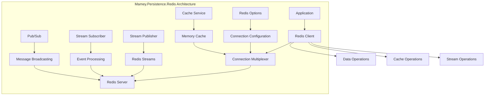

# Mamey.Persistence.Redis

A comprehensive Redis persistence library for the Mamey framework, providing seamless integration with Redis databases. This library offers caching, session management, and distributed data storage capabilities with built-in support for streaming and pub/sub patterns.

## Table of Contents

- [Overview](#overview)
- [Key Features](#key-features)
- [Architecture](#architecture)
- [Installation](#installation)
- [Quick Start](#quick-start)
- [Core Components](#core-components)
- [API Reference](#api-reference)
- [Usage Examples](#usage-examples)
- [Configuration](#configuration)
- [Best Practices](#best-practices)
- [Troubleshooting](#troubleshooting)

## Overview

Mamey.Persistence.Redis is a specialized persistence library that provides Redis integration for the Mamey framework. It offers caching capabilities, session management, and distributed data storage with built-in support for streaming and pub/sub patterns.

### Technical Overview

The library provides:

- **Caching**: High-performance caching with StackExchange.Redis
- **Session Management**: Distributed session storage
- **Streaming**: Redis Streams support for real-time data processing
- **Pub/Sub**: Publish/Subscribe messaging patterns
- **Connection Management**: Optimized connection pooling and management
- **Serialization**: Built-in JSON serialization support
- **Configuration**: Flexible configuration options

## Key Features

### Core Features

- **High-Performance Caching**: Fast in-memory caching with Redis
- **Distributed Sessions**: Shared session storage across multiple instances
- **Redis Streams**: Real-time data streaming capabilities
- **Pub/Sub Messaging**: Publish/Subscribe messaging patterns
- **Connection Pooling**: Optimized connection management
- **JSON Serialization**: Built-in JSON serialization support
- **Configuration Management**: Flexible configuration options

### Advanced Features

- **Streaming Support**: Redis Streams for real-time data processing
- **Custom Serialization**: Support for custom serialization formats
- **Connection Multiplexing**: Efficient connection sharing
- **Error Handling**: Comprehensive error handling and retry logic
- **Performance Monitoring**: Built-in performance metrics
- **Clustering Support**: Redis Cluster support

## Architecture



## Installation

### Package Manager
```bash
Install-Package Mamey.Persistence.Redis
```

### .NET CLI
```bash
dotnet add package Mamey.Persistence.Redis
```

### PackageReference
```xml
<PackageReference Include="Mamey.Persistence.Redis" Version="2.0.*" />
```

## Quick Start

### Basic Setup

```csharp
using Mamey.Persistence.Redis;

var builder = WebApplication.CreateBuilder(args);

// Add Mamey services
builder.Services.AddMamey()
    .AddRedis();

var app = builder.Build();

app.Run();
```

### With Custom Configuration

```csharp
builder.Services.AddMamey()
    .AddRedis(options =>
    {
        options.ConnectionString = "localhost:6379";
        options.Database = 0;
        options.Instance = "MyApp";
    });
```

### With Streaming Support

```csharp
builder.Services.AddMamey()
    .AddRedis()
    .AddRedisStreaming();
```

## Core Components

### Configuration System

#### RedisOptions
```csharp
public class RedisOptions
{
    public string ConnectionString { get; set; } = "localhost";
    public string Instance { get; set; }
    public int Database { get; set; }
}
```

#### RedisOptionsBuilder
```csharp
public interface IRedisOptionsBuilder
{
    IRedisOptionsBuilder WithConnectionString(string connectionString);
    IRedisOptionsBuilder WithInstance(string instance);
    IRedisOptionsBuilder WithDatabase(int database);
    RedisOptions Build();
}
```

### Streaming System

#### IStreamPublisher
```csharp
public interface IStreamPublisher
{
    Task PublishAsync<T>(string stream, T data, string id = "*");
}
```

#### IStreamSubscriber
```csharp
public interface IStreamSubscriber
{
    Task SubscribeAsync<T>(string stream, Func<T, Task> handler);
}
```

### Cache Integration

The library integrates with ASP.NET Core's built-in caching system:

```csharp
// Automatic integration with IMemoryCache
services.AddStackExchangeRedisCache(options =>
{
    options.Configuration = connectionString;
    options.InstanceName = instanceName;
});
```

## API Reference

### Extension Methods

#### IMameyBuilder Extensions

```csharp
public static class RedisExtensions
{
    public static IMameyBuilder AddRedis(this IMameyBuilder builder, 
        string sectionName = "redis");
    
    public static IMameyBuilder AddRedis(this IMameyBuilder builder, 
        Func<IRedisOptionsBuilder, IRedisOptionsBuilder> buildOptions);
    
    public static IMameyBuilder AddRedis(this IMameyBuilder builder, 
        RedisOptions options);
}
```

#### IServiceCollection Extensions

```csharp
public static class RedisStreamingExtensions
{
    public static IServiceCollection AddRedisStreaming(this IServiceCollection services);
}
```

### Redis Operations

```csharp
// Direct Redis operations through IDatabase
public interface IDatabase
{
    Task<bool> StringSetAsync(RedisKey key, RedisValue value, TimeSpan? expiry = null);
    Task<RedisValue> StringGetAsync(RedisKey key);
    Task<bool> KeyDeleteAsync(RedisKey key);
    Task<bool> KeyExistsAsync(RedisKey key);
    Task<TimeSpan?> KeyTimeToLiveAsync(RedisKey key);
}
```

## Usage Examples

### Basic Caching

```csharp
public class UserService
{
    private readonly IDatabase _database;
    private readonly IMemoryCache _cache;

    public UserService(IDatabase database, IMemoryCache cache)
    {
        _database = database;
        _cache = cache;
    }

    public async Task<User> GetUserAsync(Guid id)
    {
        var cacheKey = $"user:{id}";
        
        // Try memory cache first
        if (_cache.TryGetValue(cacheKey, out User cachedUser))
        {
            return cachedUser;
        }

        // Try Redis cache
        var redisValue = await _database.StringGetAsync(cacheKey);
        if (redisValue.HasValue)
        {
            var user = JsonSerializer.Deserialize<User>(redisValue);
            _cache.Set(cacheKey, user, TimeSpan.FromMinutes(5));
            return user;
        }

        // Load from database
        var userFromDb = await LoadUserFromDatabase(id);
        
        // Cache in both Redis and memory
        await _database.StringSetAsync(cacheKey, JsonSerializer.Serialize(userFromDb), TimeSpan.FromHours(1));
        _cache.Set(cacheKey, userFromDb, TimeSpan.FromMinutes(5));
        
        return userFromDb;
    }
}
```

### Redis Streams

```csharp
public class EventService
{
    private readonly IStreamPublisher _streamPublisher;
    private readonly IStreamSubscriber _streamSubscriber;

    public EventService(IStreamPublisher streamPublisher, IStreamSubscriber streamSubscriber)
    {
        _streamPublisher = streamPublisher;
        _streamSubscriber = streamSubscriber;
    }

    public async Task PublishUserCreatedEventAsync(UserCreatedEvent @event)
    {
        await _streamPublisher.PublishAsync("user-events", @event);
    }

    public async Task SubscribeToUserEventsAsync()
    {
        await _streamSubscriber.SubscribeAsync<UserCreatedEvent>("user-events", async @event =>
        {
            // Handle user created event
            await ProcessUserCreatedEvent(@event);
        });
    }
}
```

### Session Management

```csharp
public class SessionService
{
    private readonly IDatabase _database;

    public SessionService(IDatabase database)
    {
        _database = database;
    }

    public async Task SetSessionAsync(string sessionId, UserSession session)
    {
        var key = $"session:{sessionId}";
        var value = JsonSerializer.Serialize(session);
        await _database.StringSetAsync(key, value, TimeSpan.FromMinutes(30));
    }

    public async Task<UserSession> GetSessionAsync(string sessionId)
    {
        var key = $"session:{sessionId}";
        var value = await _database.StringGetAsync(key);
        
        if (!value.HasValue)
        {
            return null;
        }

        return JsonSerializer.Deserialize<UserSession>(value);
    }

    public async Task RemoveSessionAsync(string sessionId)
    {
        var key = $"session:{sessionId}";
        await _database.KeyDeleteAsync(key);
    }
}
```

### Pub/Sub Messaging

```csharp
public class MessageService
{
    private readonly IConnectionMultiplexer _connection;

    public MessageService(IConnectionMultiplexer connection)
    {
        _connection = connection;
    }

    public async Task PublishMessageAsync(string channel, string message)
    {
        var subscriber = _connection.GetSubscriber();
        await subscriber.PublishAsync(channel, message);
    }

    public async Task SubscribeToChannelAsync(string channel, Action<string> handler)
    {
        var subscriber = _connection.GetSubscriber();
        await subscriber.SubscribeAsync(channel, (ch, message) =>
        {
            handler(message);
        });
    }
}
```

## Configuration

### Basic Configuration

```csharp
builder.Services.AddMamey()
    .AddRedis();
```

### With Custom Options

```csharp
builder.Services.AddMamey()
    .AddRedis(options =>
    {
        options.ConnectionString = "localhost:6379";
        options.Database = 0;
        options.Instance = "MyApp";
    });
```

### With Configuration Section

```csharp
// appsettings.json
{
  "Redis": {
    "ConnectionString": "localhost:6379",
    "Database": 0,
    "Instance": "MyApp"
  }
}

// Program.cs
builder.Services.AddMamey()
    .AddRedis("Redis");
```

### With Streaming

```csharp
builder.Services.AddMamey()
    .AddRedis()
    .AddRedisStreaming();
```

### Advanced Configuration

```csharp
builder.Services.AddMamey()
    .AddRedis(options =>
    {
        options.ConnectionString = "localhost:6379,password=yourpassword";
        options.Database = 0;
        options.Instance = "MyApp";
    });

// Configure connection multiplexer options
builder.Services.Configure<ConfigurationOptions>(options =>
{
    options.AbortOnConnectFail = false;
    options.ConnectTimeout = 5000;
    options.SyncTimeout = 5000;
});
```

## Best Practices

### Caching Strategy

1. **Cache Hierarchy**: Use memory cache for hot data, Redis for warm data
2. **Cache Invalidation**: Implement proper cache invalidation strategies
3. **TTL Management**: Set appropriate time-to-live values
4. **Memory Management**: Monitor memory usage and implement eviction policies

```csharp
public class OptimizedCacheService
{
    private readonly IDatabase _database;
    private readonly IMemoryCache _memoryCache;

    public async Task<T> GetOrSetAsync<T>(string key, Func<Task<T>> factory, 
        TimeSpan memoryTtl, TimeSpan redisTtl)
    {
        // Try memory cache first
        if (_memoryCache.TryGetValue(key, out T cachedValue))
        {
            return cachedValue;
        }

        // Try Redis cache
        var redisValue = await _database.StringGetAsync(key);
        if (redisValue.HasValue)
        {
            var value = JsonSerializer.Deserialize<T>(redisValue);
            _memoryCache.Set(key, value, memoryTtl);
            return value;
        }

        // Load from factory
        var value = await factory();
        
        // Cache in both layers
        await _database.StringSetAsync(key, JsonSerializer.Serialize(value), redisTtl);
        _memoryCache.Set(key, value, memoryTtl);
        
        return value;
    }
}
```

### Error Handling

1. **Connection Resilience**: Handle connection failures gracefully
2. **Retry Logic**: Implement retry logic for transient failures
3. **Fallback Strategies**: Provide fallback when Redis is unavailable
4. **Monitoring**: Monitor Redis health and performance

```csharp
public class ResilientRedisService
{
    private readonly IDatabase _database;
    private readonly ILogger<ResilientRedisService> _logger;

    public async Task<T> GetWithFallbackAsync<T>(string key, Func<Task<T>> fallback)
    {
        try
        {
            var value = await _database.StringGetAsync(key);
            if (value.HasValue)
            {
                return JsonSerializer.Deserialize<T>(value);
            }
        }
        catch (Exception ex)
        {
            _logger.LogWarning(ex, "Redis operation failed for key: {Key}", key);
        }

        // Fallback to database or other source
        return await fallback();
    }
}
```

### Performance Optimization

1. **Connection Pooling**: Use connection multiplexing for better performance
2. **Batch Operations**: Use batch operations when possible
3. **Pipelining**: Use pipelining for multiple operations
4. **Memory Optimization**: Optimize serialization and memory usage

```csharp
public class OptimizedRedisService
{
    private readonly IDatabase _database;

    public async Task<Dictionary<string, string>> GetMultipleAsync(string[] keys)
    {
        var redisKeys = keys.Select(k => (RedisKey)k).ToArray();
        var values = await _database.StringGetAsync(redisKeys);
        
        var result = new Dictionary<string, string>();
        for (int i = 0; i < keys.Length; i++)
        {
            if (values[i].HasValue)
            {
                result[keys[i]] = values[i];
            }
        }
        
        return result;
    }

    public async Task SetMultipleAsync(Dictionary<string, string> keyValues, TimeSpan? expiry = null)
    {
        var tasks = keyValues.Select(kv => 
            _database.StringSetAsync(kv.Key, kv.Value, expiry));
        
        await Task.WhenAll(tasks);
    }
}
```

## Troubleshooting

### Common Issues

#### 1. Connection Issues

**Problem**: Cannot connect to Redis server.

**Solution**: Check connection string and Redis server status.

```csharp
// Test connection
var connection = ConnectionMultiplexer.Connect("localhost:6379");
var database = connection.GetDatabase();
var pong = await database.PingAsync();
```

#### 2. Serialization Issues

**Problem**: Objects not serializing/deserializing correctly.

**Solution**: Ensure proper JSON serialization configuration.

```csharp
// Configure JSON options
builder.Services.Configure<JsonSerializerOptions>(options =>
{
    options.PropertyNamingPolicy = JsonNamingPolicy.CamelCase;
    options.WriteIndented = false;
});
```

#### 3. Memory Issues

**Problem**: High memory usage.

**Solution**: Implement proper cache eviction and TTL management.

```csharp
// Set appropriate TTL
await _database.StringSetAsync(key, value, TimeSpan.FromMinutes(30));

// Use memory cache with size limits
services.Configure<MemoryCacheOptions>(options =>
{
    options.SizeLimit = 1000;
});
```

#### 4. Performance Issues

**Problem**: Slow Redis operations.

**Solution**: Optimize connection settings and use batch operations.

```csharp
// Configure connection options
var options = new ConfigurationOptions
{
    EndPoints = { "localhost:6379" },
    AbortOnConnectFail = false,
    ConnectTimeout = 5000,
    SyncTimeout = 5000
};
```

### Performance Considerations

1. **Connection Management**: Use connection multiplexing
2. **Batch Operations**: Group operations when possible
3. **Memory Usage**: Monitor and optimize memory usage
4. **Network Optimization**: Use compression and efficient serialization

```csharp
public class PerformanceOptimizedService
{
    private readonly IDatabase _database;
    private readonly SemaphoreSlim _semaphore = new(10); // Limit concurrent operations

    public async Task<T> GetWithThrottlingAsync<T>(string key)
    {
        await _semaphore.WaitAsync();
        try
        {
            var value = await _database.StringGetAsync(key);
            return value.HasValue ? JsonSerializer.Deserialize<T>(value) : default;
        }
        finally
        {
            _semaphore.Release();
        }
    }
}
```

### Debugging Tips

1. **Enable Logging**: Use structured logging for Redis operations
2. **Monitor Connections**: Monitor connection pool usage
3. **Performance Metrics**: Track Redis operation performance
4. **Error Tracking**: Implement comprehensive error tracking

```csharp
public class MonitoredRedisService
{
    private readonly IDatabase _database;
    private readonly ILogger<MonitoredRedisService> _logger;

    public async Task<T> GetWithMonitoringAsync<T>(string key)
    {
        var stopwatch = Stopwatch.StartNew();
        try
        {
            var value = await _database.StringGetAsync(key);
            stopwatch.Stop();
            
            _logger.LogInformation("Redis GET operation completed in {ElapsedMs}ms for key: {Key}", 
                stopwatch.ElapsedMilliseconds, key);
            
            return value.HasValue ? JsonSerializer.Deserialize<T>(value) : default;
        }
        catch (Exception ex)
        {
            stopwatch.Stop();
            _logger.LogError(ex, "Redis GET operation failed after {ElapsedMs}ms for key: {Key}", 
                stopwatch.ElapsedMilliseconds, key);
            throw;
        }
    }
}
```

## License

This project is licensed under the MIT License - see the LICENSE file for details.

## Contributing

Please read Contributing Guide for details on our code of conduct and the process for submitting pull requests.

## Support

For support and questions, please open an issue in the [GitHub repository](https://github.com/mamey-io/mamey-persistence-redis/issues).
