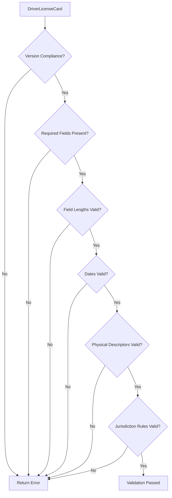

# Mamey.AmvvaStandards

**Library**: `Mamey.AmvvaStandards`  
**Location**: `Mamey/src/Mamey.AmvvaStandards/`  
**Type**: Specialized Library - AAMVA Standards  
**Version**: 2.0.*  
**Files**: 8 C# files  
**Namespace**: `Mamey.AmvvaStandards`

## Overview

Mamey.AmvvaStandards provides comprehensive AAMVA (American Association of Motor Vehicle Administrators) standards implementation for driver license and identification card processing. It enables processing, validation, and generation of driver license and ID card data according to AAMVA standards (2005, 2009, 2010, 2013, 2020).

### Conceptual Foundation

**AAMVA Standards** are specifications for driver license and identification card data formats used across North America. Key concepts:

1. **Data Element Identifiers (DEI)**: Standardized field codes for driver license data
2. **PDF417 Barcode**: Standard barcode format containing encoded driver license data
3. **Magstripe Format**: Magnetic stripe format for legacy card readers
4. **Card Design Revisions**: AAMVA 2005, 2009, 2010, 2013, 2020 standards
5. **Jurisdiction Codes**: State/province codes (e.g., CA, NY, TX, BC)

**Why AAMVA Standards?**
- **Interoperability**: Standardized format across states/provinces
- **Security**: Standardized security features and validation
- **Compliance**: Ensure compliance with AAMVA specifications
- **Data Exchange**: Standardized data exchange between jurisdictions
- **Verification**: Standardized verification process

**Use Cases:**
- Driver license processing and validation
- ID card generation and validation
- Identity verification systems
- Age verification systems
- Document scanning and extraction

## Architecture

### AAMVA Card Data Flow


### Card Validation Flow



### AAMVA Field Structure

```mermaid
graph TB
    A[AAMVA Card] --> B[Name Fields]
    A --> C[Address Fields]
    A --> D[Date Fields]
    A --> E[License Fields]
    A --> F[Physical Descriptors]
    
    B --> B1[Family Name DCS]
    B --> B2[Given Name DAC]
    B --> B3[Middle Names DAD]
    B --> B4[Prefix DBP]
    B --> B5[Suffix DCU]
    
    C --> C1[Street Address DAG]
    C --> C2[City DAI]
    C --> C3[Jurisdiction Code DAJ]
    C --> C4[Postal Code DAK]
    
    D --> D1[Date of Birth DBB]
    D --> D2[Issue Date DBD]
    D --> D3[Expiration Date DBA]
    
    E --> E1[License Number DAQ]
    E --> E2[License Class DAR]
    E --> E3[Restrictions DAS]
    E --> E4[Endorsements DAT]
    
    F --> F1[Sex]
    F --> F2[Eye Color]
    F --> F3[Hair Color]
    F --> F4[Height]
```



## Core Components

### AamvaFieldDefinitions - Field Constants

Static class providing AAMVA Data Element Identifiers (DEI) constants:

```csharp
public static class AamvaFieldDefinitions
{
    // Name Fields
    public const string FamilyName = "DCS";
    public const string GivenName = "DAC";
    public const string MiddleNames = "DAD";
    public const string NameSuffix = "DCU";
    public const string NamePrefix = "DBP";
    
    // Address Fields
    public const string StreetAddress1 = "DAG";
    public const string City = "DAI";
    public const string JurisdictionCode = "DAJ";
    public const string PostalCode = "DAK";
    
    // Date Fields
    public const string DateOfBirth = "DBB";
    public const string IssueDate = "DBD";
    public const string ExpirationDate = "DBA";
    
    // License Fields
    public const string LicenseNumber = "DAQ";
    public const string LicenseClass = "DAR";
    public const string Restrictions = "DAS";
    public const string Endorsements = "DAT";
    
    // ... and many more
}
```

**Key Features:**
- **Standard Compliant**: All constants follow AAMVA standards
- **Version Support**: Supports AAMVA 2005, 2009, 2010, 2013, 2020
- **Comprehensive**: Covers all standard AAMVA fields
- **Documented**: Each field includes XML documentation

### BaseAamvaCard - Base Card Model

Base class for all AAMVA cards:

```csharp
public abstract class BaseAamvaCard
{
    // Mandatory Core Fields
    public string LicenseOrIdNumber { get; internal protected set; }
    public IssuingCountry Country { get; set; }
    public JurisdictionCode Jurisdiction { get; set; }
    
    // Name Fields
    public string FamilyName { get; set; }
    public string GivenName { get; set; }
    public string MiddleNames { get; set; }
    public string Prefix { get; set; }
    public string Suffix { get; set; }
    
    // Address Fields
    public string StreetAddress { get; set; }
    public string StreetAddress2 { get; set; }
    public string City { get; set; }
    public string PostalCode { get; set; }
    
    // Date Fields
    public DateTime DateOfBirth { get; set; }
    public DateTime IssueDate { get; set; }
    public DateTime ExpirationDate { get; set; }
    
    // Physical Descriptors
    public Sex Sex { get; set; }
    public EyeColor EyeColor { get; set; }
    public HairColor HairColor { get; set; }
    public int HeightInches { get; set; }
    
    // AAMVA Version
    public CardDesignRevision Revision { get; set; }
    
    // Additional Fields
    public string DocumentDiscriminator { get; set; }
    public string AuditInformation { get; set; }
    
    // Methods
    public void AssignCardNumber(string cardNumber);
}
```

### DriverLicenseCard - Driver License Model

Model for standard driver licenses:

```csharp
public class DriverLicenseCard : BaseAamvaCard
{
    public string LicenseClass { get; set; } // e.g., A, B, C, D
    public string Endorsements { get; set; } // e.g., T, P, H
    public string Restrictions { get; set; } // e.g., CORRECTIVE LENSES
    public bool IsCommercial { get; set; }
}
```

### IdentificationCard - ID Card Model

Model for non-driver identification cards:

```csharp
public class IdentificationCard : BaseAamvaCard
{
    public bool IsRealIdCompliant { get; set; }
}
```

### CommercialDriverLicense - CDL Model

Model for commercial driver licenses:

```csharp
public class CommercialDriverLicense : DriverLicenseCard
{
    public CommercialDriverLicense()
    {
        IsCommercial = true;
    }
    
    public bool HazardousMaterialsEndorsement { get; set; }
    public bool TankVehicleEndorsement { get; set; }
}
```

### ICardNumberGenerator - Card Number Generation

Interface for generating AAMVA-compliant card numbers:

```csharp
public interface ICardNumberGenerator
{
    string GenerateCardNumber(
        IssuingCountry country, 
        JurisdictionCode jurisdiction, 
        bool isCommercial = false);
}
```

**Default Implementation:**
```csharp
public class DefaultCardNumberGenerator : ICardNumberGenerator
{
    public string GenerateCardNumber(
        IssuingCountry country, 
        JurisdictionCode jurisdiction, 
        bool isCommercial = false)
    {
        // Generates unique card number with check digit
        // Format: {StateCode}{CommercialIndicator}{Year}{RandomPart}{CheckDigit}
    }
}
```

### AamvaValidators - Validation Logic

Static class providing validation methods:

```csharp
public static class AamvaValidators
{
    public static bool ValidateDriverLicenseCard(
        DriverLicenseCard card, 
        out string errorMessage);
    
    public static bool ValidateIdentificationCard(
        IdentificationCard card, 
        out string errorMessage);
    
    public static bool CheckVersionCompliance(
        BaseAamvaCard card, 
        out string errorMessage);
}
```

## Installation

### NuGet Package

```bash
dotnet add package Mamey.AmvvaStandards
```

### Prerequisites

- .NET 9.0 or later
- Mamey (core framework)

## Usage Examples

### Example 1: Create Driver License

```csharp
using Mamey.AmvvaStandards;

public class LicenseService
{
    private readonly ICardNumberGenerator _cardNumberGenerator;
    private readonly ILogger<LicenseService> _logger;

    public LicenseService(
        ICardNumberGenerator cardNumberGenerator,
        ILogger<LicenseService> logger)
    {
        _cardNumberGenerator = cardNumberGenerator;
        _logger = logger;
    }

    public DriverLicenseCard CreateDriverLicense(LicenseApplication application)
    {
        var license = new DriverLicenseCard
        {
            // Basic Information
            FamilyName = application.LastName.ToUpper(),
            GivenName = application.FirstName.ToUpper(),
            MiddleNames = application.MiddleName?.ToUpper() ?? string.Empty,
            Prefix = application.NamePrefix ?? string.Empty,
            Suffix = application.NameSuffix ?? string.Empty,
            
            // Address
            StreetAddress = application.Address.StreetAddress1,
            StreetAddress2 = application.Address.StreetAddress2 ?? string.Empty,
            City = application.Address.City,
            PostalCode = application.Address.PostalCode,
            Jurisdiction = application.Address.State,
            Country = IssuingCountry.USA,
            
            // Dates
            DateOfBirth = application.DateOfBirth,
            IssueDate = DateTime.UtcNow,
            ExpirationDate = DateTime.UtcNow.AddYears(4), // 4-year license
            
            // Physical Descriptors
            Sex = application.Sex,
            EyeColor = application.EyeColor,
            HairColor = application.HairColor,
            HeightInches = application.HeightInches,
            
            // License Information
            LicenseClass = application.LicenseClass,
            Endorsements = application.Endorsements ?? string.Empty,
            Restrictions = application.Restrictions ?? string.Empty,
            IsCommercial = application.IsCommercial,
            
            // AAMVA Version
            Revision = CardDesignRevision.AAMVA2020,
            
            // Additional Fields
            DocumentDiscriminator = GenerateDocumentDiscriminator(),
            AuditInformation = GenerateAuditInformation()
        };

        // Generate and assign card number
        var cardNumber = _cardNumberGenerator.GenerateCardNumber(
            license.Country,
            license.Jurisdiction,
            license.IsCommercial);
        
        license.AssignCardNumber(cardNumber);

        // Validate
        if (!AamvaValidators.ValidateDriverLicenseCard(license, out var errorMessage))
        {
            _logger.LogError("License validation failed: {ErrorMessage}", errorMessage);
            throw new InvalidOperationException($"License validation failed: {errorMessage}");
        }

        _logger.LogInformation(
            "Driver license created: {LicenseNumber} for {Name}",
            license.LicenseOrIdNumber,
            $"{license.GivenName} {license.FamilyName}");

        return license;
    }

    private string GenerateDocumentDiscriminator()
    {
        // Generate unique document discriminator
        return Guid.NewGuid().ToString("N").ToUpper();
    }

    private string GenerateAuditInformation()
    {
        // Generate audit information
        return $"AUDIT-{DateTime.UtcNow:yyyyMMddHHmmss}";
    }
}
```

### Example 2: Validate Driver License

```csharp
using Mamey.AmvvaStandards;

public class LicenseValidationService
{
    private readonly ILogger<LicenseValidationService> _logger;

    public LicenseValidationService(ILogger<LicenseValidationService> logger)
    {
        _logger = logger;
    }

    public ValidationResult ValidateLicense(DriverLicenseCard license)
    {
        _logger.LogInformation(
            "Validating license: {LicenseNumber}",
            license.LicenseOrIdNumber);

        // Validate using AAMVA validators
        if (!AamvaValidators.ValidateDriverLicenseCard(license, out var errorMessage))
        {
            _logger.LogWarning(
                "License validation failed: {LicenseNumber}, Error: {ErrorMessage}",
                license.LicenseOrIdNumber,
                errorMessage);
            
            return ValidationResult.Failed(errorMessage);
        }

        // Check expiration
        if (license.ExpirationDate < DateTime.UtcNow)
        {
            _logger.LogWarning(
                "License expired: {LicenseNumber}, Expired: {ExpirationDate}",
                license.LicenseOrIdNumber,
                license.ExpirationDate);
            
            return ValidationResult.Failed("License has expired");
        }

        // Check if license is revoked (check against database)
        if (await IsLicenseRevoked(license.LicenseOrIdNumber))
        {
            _logger.LogWarning(
                "License revoked: {LicenseNumber}",
                license.LicenseOrIdNumber);
            
            return ValidationResult.Failed("License has been revoked");
        }

        _logger.LogInformation(
            "License validation passed: {LicenseNumber}",
            license.LicenseOrIdNumber);

        return ValidationResult.Success();
    }

    private async Task<bool> IsLicenseRevoked(string licenseNumber)
    {
        // Check against revocation database
        // Implementation depends on your data store
        return false;
    }
}

public class ValidationResult
{
    public bool IsValid { get; private set; }
    public string? ErrorMessage { get; private set; }

    private ValidationResult(bool isValid, string? errorMessage)
    {
        IsValid = isValid;
        ErrorMessage = errorMessage;
    }

    public static ValidationResult Success()
        => new(true, null);

    public static ValidationResult Failed(string errorMessage)
        => new(false, errorMessage);
}
```

### Example 3: Create Commercial Driver License

```csharp
using Mamey.AmvvaStandards;

public class CommercialLicenseService
{
    private readonly ICardNumberGenerator _cardNumberGenerator;

    public CommercialLicenseService(ICardNumberGenerator cardNumberGenerator)
    {
        _cardNumberGenerator = cardNumberGenerator;
    }

    public CommercialDriverLicense CreateCommercialLicense(
        CommercialLicenseApplication application)
    {
        // Age requirement: 21+ for commercial licenses
        var age = DateTime.UtcNow.Year - application.DateOfBirth.Year;
        if (age < 21)
        {
            throw new InvalidOperationException(
                "Commercial licenses require age 21 or older");
        }

        var cdl = new CommercialDriverLicense
        {
            // Basic Information (same as regular license)
            FamilyName = application.LastName.ToUpper(),
            GivenName = application.FirstName.ToUpper(),
            DateOfBirth = application.DateOfBirth,
            IssueDate = DateTime.UtcNow,
            ExpirationDate = DateTime.UtcNow.AddYears(4),
            
            // Address
            StreetAddress = application.Address.StreetAddress1,
            City = application.Address.City,
            PostalCode = application.Address.PostalCode,
            Jurisdiction = application.Address.State,
            Country = IssuingCountry.USA,
            
            // Physical Descriptors
            Sex = application.Sex,
            EyeColor = application.EyeColor,
            HairColor = application.HairColor,
            HeightInches = application.HeightInches,
            
            // Commercial License Information
            LicenseClass = "A", // Class A commercial license
            Endorsements = application.Endorsements ?? string.Empty,
            Restrictions = application.Restrictions ?? string.Empty,
            
            // Commercial Endorsements
            HazardousMaterialsEndorsement = application.HasHazmatEndorsement,
            TankVehicleEndorsement = application.HasTankEndorsement,
            
            // AAMVA Version
            Revision = CardDesignRevision.AAMVA2020,
            
            // Additional Fields
            DocumentDiscriminator = GenerateDocumentDiscriminator(),
            AuditInformation = GenerateAuditInformation()
        };

        // Generate commercial license number
        var cardNumber = _cardNumberGenerator.GenerateCardNumber(
            cdl.Country,
            cdl.Jurisdiction,
            isCommercial: true); // Commercial indicator
        
        cdl.AssignCardNumber(cardNumber);

        // Validate
        if (!AamvaValidators.ValidateDriverLicenseCard(cdl, out var errorMessage))
        {
            throw new InvalidOperationException(
                $"License validation failed: {errorMessage}");
        }

        return cdl;
    }

    private string GenerateDocumentDiscriminator()
    {
        return Guid.NewGuid().ToString("N").ToUpper();
    }

    private string GenerateAuditInformation()
    {
        return $"AUDIT-{DateTime.UtcNow:yyyyMMddHHmmss}";
    }
}
```

### Example 4: Create Identification Card

```csharp
using Mamey.AmvvaStandards;

public class IdCardService
{
    private readonly ICardNumberGenerator _cardNumberGenerator;

    public IdCardService(ICardNumberGenerator cardNumberGenerator)
    {
        _cardNumberGenerator = cardNumberGenerator;
    }

    public IdentificationCard CreateIdCard(IdCardApplication application)
    {
        var idCard = new IdentificationCard
        {
            // Basic Information
            FamilyName = application.LastName.ToUpper(),
            GivenName = application.FirstName.ToUpper(),
            MiddleNames = application.MiddleName?.ToUpper() ?? string.Empty,
            
            // Address
            StreetAddress = application.Address.StreetAddress1,
            City = application.Address.City,
            PostalCode = application.Address.PostalCode,
            Jurisdiction = application.Address.State,
            Country = IssuingCountry.USA,
            
            // Dates
            DateOfBirth = application.DateOfBirth,
            IssueDate = DateTime.UtcNow,
            ExpirationDate = DateTime.UtcNow.AddYears(6), // 6-year ID card
            
            // Physical Descriptors
            Sex = application.Sex,
            EyeColor = application.EyeColor,
            HairColor = application.HairColor,
            HeightInches = application.HeightInches,
            
            // Real ID Compliance
            IsRealIdCompliant = application.IsRealIdCompliant,
            
            // AAMVA Version
            Revision = CardDesignRevision.AAMVA2020,
            
            // Additional Fields
            DocumentDiscriminator = GenerateDocumentDiscriminator(),
            AuditInformation = GenerateAuditInformation()
        };

        // Generate ID card number
        var cardNumber = _cardNumberGenerator.GenerateCardNumber(
            idCard.Country,
            idCard.Jurisdiction,
            isCommercial: false);
        
        idCard.AssignCardNumber(cardNumber);

        // Validate
        if (!AamvaValidators.ValidateIdentificationCard(idCard, out var errorMessage))
        {
            throw new InvalidOperationException(
                $"ID card validation failed: {errorMessage}");
        }

        return idCard;
    }

    private string GenerateDocumentDiscriminator()
    {
        return Guid.NewGuid().ToString("N").ToUpper();
    }

    private string GenerateAuditInformation()
    {
        return $"AUDIT-{DateTime.UtcNow:yyyyMMddHHmmss}";
    }
}
```

### Example 5: Parse License Data from Barcode

```csharp
using Mamey.AmvvaStandards;

public class LicenseScanningService
{
    public DriverLicenseCard ParseLicenseFromBarcode(string barcodeData)
    {
        // Parse PDF417 barcode data
        var fields = ParseBarcodeData(barcodeData);
        
        var license = new DriverLicenseCard
        {
            // Extract fields using AAMVA field definitions
            FamilyName = fields[AamvaFieldDefinitions.FamilyName] ?? string.Empty,
            GivenName = fields[AamvaFieldDefinitions.GivenName] ?? string.Empty,
            MiddleNames = fields[AamvaFieldDefinitions.MiddleNames] ?? string.Empty,
            
            // Address
            StreetAddress = fields[AamvaFieldDefinitions.StreetAddress1] ?? string.Empty,
            City = fields[AamvaFieldDefinitions.City] ?? string.Empty,
            PostalCode = fields[AamvaFieldDefinitions.PostalCode] ?? string.Empty,
            Jurisdiction = ParseJurisdictionCode(fields[AamvaFieldDefinitions.JurisdictionCode]),
            
            // Dates (format: YYYYMMDD)
            DateOfBirth = ParseDate(fields[AamvaFieldDefinitions.DateOfBirth]),
            IssueDate = ParseDate(fields[AamvaFieldDefinitions.IssueDate]),
            ExpirationDate = ParseDate(fields[AamvaFieldDefinitions.ExpirationDate]),
            
            // License Information
            LicenseOrIdNumber = fields[AamvaFieldDefinitions.LicenseNumber] ?? string.Empty,
            LicenseClass = fields[AamvaFieldDefinitions.LicenseClass] ?? string.Empty,
            Restrictions = fields[AamvaFieldDefinitions.Restrictions] ?? string.Empty,
            Endorsements = fields[AamvaFieldDefinitions.Endorsements] ?? string.Empty,
            
            // Physical Descriptors
            Sex = ParseSex(fields[AamvaFieldDefinitions.Sex]),
            EyeColor = ParseEyeColor(fields[AamvaFieldDefinitions.EyeColor]),
            HairColor = ParseHairColor(fields[AamvaFieldDefinitions.HairColor]),
            HeightInches = ParseHeight(fields[AamvaFieldDefinitions.Height]),
            
            // AAMVA Version
            Revision = ParseRevision(fields[AamvaFieldDefinitions.Version]),
            
            // Additional Fields
            DocumentDiscriminator = fields[AamvaFieldDefinitions.DocumentDiscriminator] ?? string.Empty
        };

        return license;
    }

    private Dictionary<string, string> ParseBarcodeData(string barcodeData)
    {
        // Parse PDF417 barcode format
        // Format: @\n{DEI1}\n{Value1}\n{DEI2}\n{Value2}...
        var fields = new Dictionary<string, string>();
        var lines = barcodeData.Split('\n');
        
        for (int i = 1; i < lines.Length; i += 2)
        {
            if (i + 1 < lines.Length)
            {
                var dei = lines[i];
                var value = lines[i + 1];
                fields[dei] = value;
            }
        }
        
        return fields;
    }

    private DateTime ParseDate(string? dateString)
    {
        if (string.IsNullOrEmpty(dateString) || dateString.Length != 8)
            throw new ArgumentException("Invalid date format");
        
        // Format: YYYYMMDD
        var year = int.Parse(dateString.Substring(0, 4));
        var month = int.Parse(dateString.Substring(4, 2));
        var day = int.Parse(dateString.Substring(6, 2));
        
        return new DateTime(year, month, day);
    }

    private JurisdictionCode ParseJurisdictionCode(string? code)
    {
        if (string.IsNullOrEmpty(code))
            throw new ArgumentException("Jurisdiction code is required");
        
        return Enum.Parse<JurisdictionCode>(code);
    }

    private Sex ParseSex(string? sexString)
    {
        if (string.IsNullOrEmpty(sexString))
            return Sex.NotSpecified;
        
        return sexString switch
        {
            "1" => Sex.Male,
            "2" => Sex.Female,
            "9" => Sex.NotSpecified,
            _ => Sex.NotSpecified
        };
    }

    private EyeColor ParseEyeColor(string? colorString)
    {
        if (string.IsNullOrEmpty(colorString))
            return EyeColor.UNK;
        
        return Enum.TryParse<EyeColor>(colorString, out var color) 
            ? color 
            : EyeColor.UNK;
    }

    private HairColor ParseHairColor(string? colorString)
    {
        if (string.IsNullOrEmpty(colorString))
            return HairColor.UNK;
        
        return Enum.TryParse<HairColor>(colorString, out var color) 
            ? color 
            : HairColor.UNK;
    }

    private int ParseHeight(string? heightString)
    {
        if (string.IsNullOrEmpty(heightString))
            return 0;
        
        // Format: FTIN (e.g., "510" = 5'10")
        if (heightString.Length == 3)
        {
            var feet = int.Parse(heightString.Substring(0, 1));
            var inches = int.Parse(heightString.Substring(1, 2));
            return feet * 12 + inches;
        }
        
        return 0;
    }

    private CardDesignRevision ParseRevision(string? versionString)
    {
        if (string.IsNullOrEmpty(versionString))
            return CardDesignRevision.AAMVA2013;
        
        return versionString switch
        {
            "01" => CardDesignRevision.AAMVA2005,
            "02" => CardDesignRevision.AAMVA2009,
            "03" => CardDesignRevision.AAMVA2010,
            "04" => CardDesignRevision.AAMVA2013,
            "05" => CardDesignRevision.AAMVA2020,
            _ => CardDesignRevision.AAMVA2013
        };
    }
}
```

## Best Practices

### 1. Field Naming Convention

**✅ Good: Use AAMVA field definitions**
```csharp
var familyName = fields[AamvaFieldDefinitions.FamilyName];
var licenseNumber = fields[AamvaFieldDefinitions.LicenseNumber];
```

**❌ Bad: Hardcode field codes**
```csharp
var familyName = fields["DCS"]; // ❌ Magic strings
```

### 2. Data Validation

**✅ Good: Validate before using**
```csharp
if (!AamvaValidators.ValidateDriverLicenseCard(license, out var errorMessage))
{
    throw new InvalidOperationException($"Validation failed: {errorMessage}");
}
```

### 3. Case Sensitivity

**✅ Good: Normalize names to uppercase**
```csharp
license.FamilyName = application.LastName.ToUpper();
license.GivenName = application.FirstName.ToUpper();
```

### 4. Date Formatting

**✅ Good: Use AAMVA date format (YYYYMMDD)**
```csharp
var dateString = dateOfBirth.ToString("yyyyMMdd");
```

### 5. Card Number Generation

**✅ Good: Use ICardNumberGenerator**
```csharp
var cardNumber = _cardNumberGenerator.GenerateCardNumber(
    country,
    jurisdiction,
    isCommercial);
license.AssignCardNumber(cardNumber);
```

## Troubleshooting

### Common Issues

#### Validation Fails

**Problem**: `ValidateDriverLicenseCard()` returns false.

**Solution**:
1. Check `errorMessage` for specific validation failure
2. Ensure all required fields are present
3. Verify field lengths are within limits
4. Check dates are valid and in correct order
5. Verify jurisdiction-specific rules

#### Invalid Date Format

**Problem**: Date parsing fails.

**Solution**:
1. Use AAMVA date format: YYYYMMDD
2. Ensure dates are in correct order (DOB < Issue < Expiration)
3. Validate dates before parsing

#### Card Number Generation Collision

**Problem**: Card number already exists.

**Solution**:
1. Implement collision detection in `ICardNumberGenerator`
2. Check against database before assigning
3. Retry generation if collision detected
4. Use distributed ID generation for uniqueness

## Related Libraries

- **Mamey.Biometrics**: Biometric authentication for driver licenses
- **Mamey.Image**: Image processing for license photos
- **Mamey.TravelIdentityStandards**: Travel identity standards integration
- **Mamey.Barcode**: Barcode generation for license barcodes

## Additional Resources

- [AAMVA Standards](https://www.aamva.org/)
- [AAMVA Card Design Standard](https://www.aamva.org/getmedia/7bf3a7e8-4357-41f9-b91f-3260b6d7e34f/AAMVA-DL-ID-Card-Design-Standard-2020)
- [Mamey Framework Documentation](../)
- Mamey.AmvvaStandards Memory Documentation

## Tags

#aamva #driver-license #identity #standards #validation #mamey
