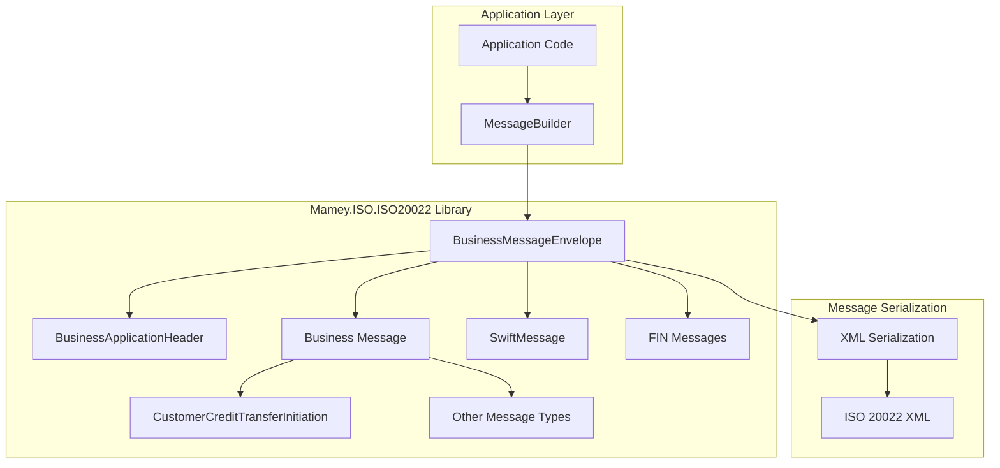
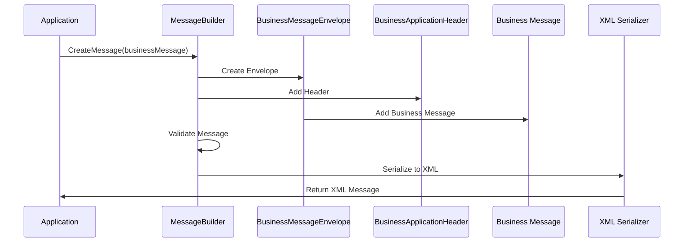
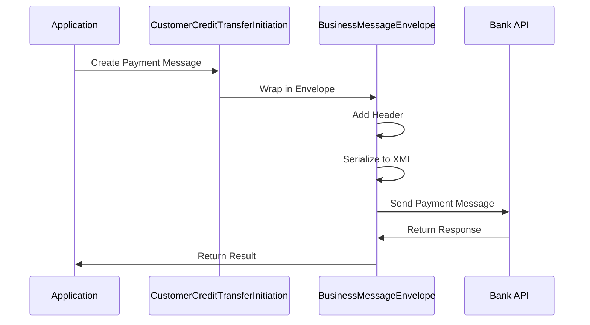

# Mamey.ISO.ISO20022

**Library**: `Mamey.ISO.ISO20022`  
**Location**: `Mamey/src/Mamey.ISO.ISO20022/`  
**Type**: Standards Library - ISO 20022 Financial Messaging  
**Version**: 2.0.*  
**Files**: 25 C# files  
**Namespace**: `Mamey.ISO20022`, `Mamey.ISO20022.Messages`, `Mamey.ISO20022.FIN`

## Overview

Mamey.ISO.ISO20022 provides comprehensive ISO 20022 financial messaging standards implementation for the Mamey framework. ISO 20022 is a multi-part International Standard prepared by ISO Technical Committee TC68 Financial Services. It defines a common platform for the development of messages using a modeling methodology to capture business transactions.

### Conceptual Foundation

**ISO 20022** is an international standard for financial messaging. Key concepts:

1. **Message Schema**: XML-based message schema definitions
2. **Message Types**: Different message types (payments, securities, etc.)
3. **Business Application Header**: Standard header for all messages
4. **Envelope**: Message envelope wrapping business messages
5. **FIN Messages**: SWIFT FIN message format support
6. **XML Serialization**: XML-based message serialization

**Why Mamey.ISO.ISO20022?**

Provides:
- **Financial Messaging**: ISO 20022 message schema definitions
- **Message Building**: Fluent builders for creating ISO 20022 messages
- **Payment Messages**: Customer credit transfer initiation support
- **SWIFT Integration**: SWIFT FIN message format support
- **Standards Compliance**: ISO 20022 standards compliance
- **Type Safety**: Strongly-typed message models

**Use Cases:**
- Payment initiation messages
- Customer credit transfers
- Financial transaction processing
- SWIFT message integration
- Cross-border payments
- SEPA payment processing

## Architecture

### ISO 20022 Message Architecture



### Message Building Flow



### Payment Initiation Flow



## Core Components

### BusinessMessageEnvelope - Message Envelope

Wrapper for all ISO 20022 business messages:

```csharp
public class BusinessMessageEnvelope
{
    public BusinessApplicationHeader Header { get; set; }
    public object Document { get; set; } // Business message
    public List<Reference22> References { get; set; }
    public List<SupplementaryData> SupplementaryData { get; set; }
}
```

### BusinessApplicationHeader - Message Header

Standard header for all ISO 20022 messages:

```csharp
public class BusinessApplicationHeader
{
    public string BusinessMessageIdentifier { get; set; }
    public DateTime CreationDateTime { get; set; }
    public string MessageDefinitionIdentifier { get; set; }
    public string BusinessService { get; set; }
    public PartyIdentification From { get; set; }
    public PartyIdentification To { get; set; }
    // Additional header properties
}
```

### CustomerCreditTransferInitiation - Payment Message

Payment initiation message model:

```csharp
[XmlRoot("Document", Namespace = "urn:iso:std:iso:20022:tech:xsd:pain.001.001.12")]
public class CustomerCreditTransferInitiation
{
    [XmlElement("CstmrCdtTrfInitn")]
    public CustomerCreditTransferInitiationContent Content { get; set; }
}

public class CustomerCreditTransferInitiationContent
{
    [XmlElement("GrpHdr")]
    public GroupHeader GroupHeader { get; set; }

    [XmlElement("PmtInf")]
    public List<PaymentInformation> PaymentInformation { get; set; }
}
```

### GroupHeader - Group Header

Group header shared by all transactions:

```csharp
public class GroupHeader
{
    [XmlElement("MsgId")]
    public string MessageIdentification { get; set; }

    [XmlElement("CreDtTm")]
    public DateTime CreationDateTime { get; set; }

    [XmlElement("NbOfTxs")]
    public string NumberOfTransactions { get; set; }

    [XmlElement("CtrlSum")]
    public decimal? ControlSum { get; set; }

    [XmlElement("InitgPty")]
    public PartyIdentification InitiatingParty { get; set; }
}
```

### PaymentInformation - Payment Information

Payment information containing transaction details:

```csharp
public class PaymentInformation
{
    [XmlElement("PmtInfId")]
    public string PaymentInformationIdentification { get; set; }

    [XmlElement("PmtMtd")]
    public string PaymentMethod { get; set; }

    [XmlElement("BtchBookg")]
    public bool? BatchBooking { get; set; }

    [XmlElement("NbOfTxs")]
    public string NumberOfTransactions { get; set; }

    [XmlElement("CtrlSum")]
    public decimal? ControlSum { get; set; }

    [XmlElement("Dbtr")]
    public PartyIdentification Debtor { get; set; }

    [XmlElement("CdtTrfTxInf")]
    public List<CreditTransferTransactionInformation> CreditTransferTransactionInformation { get; set; }
}
```

### SwiftMessage - SWIFT Message

SWIFT message format support:

```csharp
public class SwiftMessage
{
    // SWIFT message properties
}
```

### IFINMessage - FIN Message Interface

Interface for SWIFT FIN messages:

```csharp
public interface IFINMessage
{
    // FIN message methods
}
```

### MTMessageHeader - MT Message Header

MT message header for SWIFT messages:

```csharp
public class MTMessageHeader
{
    // MT message header properties
}
```

## Installation

### Prerequisites

1. **.NET 9.0**: Ensure .NET 9.0 SDK is installed
2. **Mamey.ISO.Abstractions**: ISO abstractions library
3. **System.Xml.Serialization**: For XML serialization

### NuGet Package

```bash
dotnet add package Mamey.ISO.ISO20022
```

### Dependencies

- **Mamey** - Core framework
- **Mamey.ISO.Abstractions** - ISO abstractions
- **System.Xml.Serialization** - XML serialization

## Quick Start

### Basic Setup

```csharp
using Mamey.ISO20022;

var builder = WebApplication.CreateBuilder(args);

// Add ISO 20022 services
builder.Services
    .AddMamey()
    .AddISO20022();

var app = builder.Build();
app.Run();
```

## Usage Examples

### Example 1: Create Payment Initiation Message

```csharp
using Mamey.ISO20022;
using Mamey.ISO20022.Messages.Payments.PaymentsInitiation;

public class PaymentService
{
    private readonly ILogger<PaymentService> _logger;

    public CustomerCreditTransferInitiation CreatePaymentMessage(
        string messageId,
        string debtorName,
        string debtorAccount,
        string creditorName,
        string creditorAccount,
        decimal amount,
        string currency)
    {
        try
        {
            _logger.LogInformation("Creating payment initiation message: {MessageId}", messageId);

            var message = new CustomerCreditTransferInitiation
            {
                Content = new CustomerCreditTransferInitiationContent
                {
                    GroupHeader = new GroupHeader
                    {
                        MessageIdentification = messageId,
                        CreationDateTime = DateTime.UtcNow,
                        NumberOfTransactions = "1",
                        ControlSum = amount,
                        InitiatingParty = new PartyIdentification
                        {
                            Name = debtorName
                        }
                    },
                    PaymentInformation = new List<PaymentInformation>
                    {
                        new PaymentInformation
                        {
                            PaymentInformationIdentification = Guid.NewGuid().ToString(),
                            PaymentMethod = "TRF",
                            BatchBooking = false,
                            NumberOfTransactions = "1",
                            ControlSum = amount,
                            Debtor = new PartyIdentification
                            {
                                Name = debtorName
                            },
                            CreditTransferTransactionInformation = new List<CreditTransferTransactionInformation>
                            {
                                new CreditTransferTransactionInformation
                                {
                                    PaymentIdentification = new PaymentIdentification
                                    {
                                        InstructionIdentification = Guid.NewGuid().ToString(),
                                        EndToEndIdentification = Guid.NewGuid().ToString()
                                    },
                                    Amount = new AmountType
                                    {
                                        InstructedAmount = new Money
                                        {
                                            Value = amount,
                                            Currency = currency
                                        }
                                    },
                                    Creditor = new PartyIdentification
                                    {
                                        Name = creditorName
                                    },
                                    CreditorAccount = new AccountIdentification
                                    {
                                        IBAN = creditorAccount
                                    }
                                }
                            }
                        }
                    }
                }
            };

            _logger.LogInformation("Created payment initiation message: {MessageId}", messageId);

            return message;
        }
        catch (Exception ex)
        {
            _logger.LogError(ex, "Failed to create payment initiation message");
            throw;
        }
    }
}
```

### Example 2: Create Message Envelope

```csharp
using Mamey.ISO20022;
using Mamey.ISO20022.Messages.Envelope;
using Mamey.ISO20022.Messages.Header;

public class MessageEnvelopeService
{
    private readonly ILogger<MessageEnvelopeService> _logger;

    public BusinessMessageEnvelope CreateEnvelope(
        CustomerCreditTransferInitiation message,
        string fromPartyId,
        string toPartyId)
    {
        try
        {
            _logger.LogInformation("Creating message envelope");

            var envelope = new BusinessMessageEnvelope
            {
                Header = new BusinessApplicationHeader
                {
                    BusinessMessageIdentifier = Guid.NewGuid().ToString(),
                    CreationDateTime = DateTime.UtcNow,
                    MessageDefinitionIdentifier = "pain.001.001.12",
                    BusinessService = "001",
                    From = new PartyIdentification
                    {
                        Identification = new Identification
                        {
                            PartyIdentification = new PartyIdentification
                            {
                                Identification = fromPartyId
                            }
                        }
                    },
                    To = new PartyIdentification
                    {
                        Identification = new Identification
                        {
                            PartyIdentification = new PartyIdentification
                            {
                                Identification = toPartyId
                            }
                        }
                    }
                },
                Document = message,
                References = new List<Reference22>
                {
                    new Reference22
                    {
                        Name = "Transaction Reference",
                        Value = Guid.NewGuid().ToString(),
                        UUID = Guid.NewGuid().ToString()
                    }
                }
            };

            _logger.LogInformation("Created message envelope");

            return envelope;
        }
        catch (Exception ex)
        {
            _logger.LogError(ex, "Failed to create message envelope");
            throw;
        }
    }
}
```

### Example 3: Serialize Message to XML

```csharp
using System.Xml.Serialization;
using System.Text;

public class MessageSerializationService
{
    private readonly ILogger<MessageSerializationService> _logger;

    public string SerializeToXml(CustomerCreditTransferInitiation message)
    {
        try
        {
            _logger.LogInformation("Serializing message to XML");

            var serializer = new XmlSerializer(typeof(CustomerCreditTransferInitiation));
            var settings = new XmlWriterSettings
            {
                Encoding = Encoding.UTF8,
                Indent = true,
                OmitXmlDeclaration = false
            };

            using var stringWriter = new StringWriter();
            using var xmlWriter = XmlWriter.Create(stringWriter, settings);

            serializer.Serialize(xmlWriter, message);
            var xml = stringWriter.ToString();

            _logger.LogInformation("Serialized message to XML: {Length} bytes", xml.Length);

            return xml;
        }
        catch (Exception ex)
        {
            _logger.LogError(ex, "Failed to serialize message to XML");
            throw;
        }
    }
}

// Usage
var message = paymentService.CreatePaymentMessage(...);
var xml = serializationService.SerializeToXml(message);
```

### Example 4: Create Batch Payment Message

```csharp
public CustomerCreditTransferInitiation CreateBatchPaymentMessage(
    string messageId,
    string debtorName,
    List<PaymentTransaction> transactions)
{
    try
    {
        _logger.LogInformation(
            "Creating batch payment message: {MessageId}, Transactions: {Count}",
            messageId,
            transactions.Count);

        var totalAmount = transactions.Sum(t => t.Amount);

        var message = new CustomerCreditTransferInitiation
        {
            Content = new CustomerCreditTransferInitiationContent
            {
                GroupHeader = new GroupHeader
                {
                    MessageIdentification = messageId,
                    CreationDateTime = DateTime.UtcNow,
                    NumberOfTransactions = transactions.Count.ToString(),
                    ControlSum = totalAmount,
                    InitiatingParty = new PartyIdentification
                    {
                        Name = debtorName
                    }
                },
                PaymentInformation = new List<PaymentInformation>
                {
                    new PaymentInformation
                    {
                        PaymentInformationIdentification = Guid.NewGuid().ToString(),
                        PaymentMethod = "TRF",
                        BatchBooking = true,
                        NumberOfTransactions = transactions.Count.ToString(),
                        ControlSum = totalAmount,
                        Debtor = new PartyIdentification
                        {
                            Name = debtorName
                        },
                        CreditTransferTransactionInformation = transactions.Select(t => new CreditTransferTransactionInformation
                        {
                            PaymentIdentification = new PaymentIdentification
                            {
                                InstructionIdentification = Guid.NewGuid().ToString(),
                                EndToEndIdentification = t.EndToEndId
                            },
                            Amount = new AmountType
                            {
                                InstructedAmount = new Money
                                {
                                    Value = t.Amount,
                                    Currency = t.Currency
                                }
                            },
                            Creditor = new PartyIdentification
                            {
                                Name = t.CreditorName
                            },
                            CreditorAccount = new AccountIdentification
                            {
                                IBAN = t.CreditorAccount
                            }
                        }).ToList()
                    }
                }
            };

            _logger.LogInformation("Created batch payment message: {MessageId}", messageId);

            return message;
        }
        catch (Exception ex)
        {
            _logger.LogError(ex, "Failed to create batch payment message");
            throw;
        }
    }
}

public class PaymentTransaction
{
    public string EndToEndId { get; set; }
    public decimal Amount { get; set; }
    public string Currency { get; set; }
    public string CreditorName { get; set; }
    public string CreditorAccount { get; set; }
}
```

### Example 5: SWIFT FIN Message

```csharp
using Mamey.ISO20022.FIN;

public class SwiftMessageService
{
    private readonly ILogger<SwiftMessageService> _logger;

    public SwiftMessage CreateSwiftMessage(string messageType, string content)
    {
        try
        {
            _logger.LogInformation("Creating SWIFT message: {MessageType}", messageType);

            var swiftMessage = new SwiftMessage
            {
                // SWIFT message properties
            };

            _logger.LogInformation("Created SWIFT message: {MessageType}", messageType);

            return swiftMessage;
        }
        catch (Exception ex)
        {
            _logger.LogError(ex, "Failed to create SWIFT message");
            throw;
        }
    }
}
```

## Message Types

### Common ISO 20022 Message Types

- **pain.001.001.12**: Customer Credit Transfer Initiation
- **pain.002.001.12**: Customer Payment Status Report
- **pain.008.001.12**: Customer Direct Debit Initiation
- **pacs.008.001.12**: Payment Initiation
- **pacs.002.001.12**: Payment Status Report
- **pacs.004.001.12**: Payment Return

## Best Practices

### 1. Use Message Builders

**✅ Good: Use fluent builders for message creation**
```csharp
var message = MessageBuilder<CustomerCreditTransferInitiation>
    .CreateMessage(businessMessage)
    .WithHeader(header)
    .Build();
```

### 2. Validate Messages Before Sending

**✅ Good: Validate message structure**
```csharp
try
{
    ValidateMessage(message);
    var xml = SerializeToXml(message);
    await SendMessageAsync(xml);
}
catch (ValidationException ex)
{
    _logger.LogError(ex, "Message validation failed");
    throw;
}
```

### 3. Use Proper Message IDs

**✅ Good: Use unique message identifiers**
```csharp
var messageId = $"{DateTime.UtcNow:yyyyMMddHHmmss}-{Guid.NewGuid()}";
```

### 4. Include Required Fields

**✅ Good: Always include required fields**
```csharp
var message = new CustomerCreditTransferInitiation
{
    Content = new CustomerCreditTransferInitiationContent
    {
        GroupHeader = new GroupHeader
        {
            MessageIdentification = messageId, // Required
            CreationDateTime = DateTime.UtcNow, // Required
            InitiatingParty = new PartyIdentification { Name = debtorName } // Required
        },
        // ... other required fields
    }
};
```

## Related Libraries

- **Mamey.ISO.Abstractions**: ISO standards abstractions
- **Mamey.ISO.ISO3166**: Country codes
- **Mamey.ISO.ISO9362**: SWIFT BIC codes
- **Mamey.ISO.ISO13616**: IBAN codes
- **Mamey.Bank**: Banking operations
- **Mamey.MessageBrokers**: Message delivery

## Additional Resources

- [ISO 20022 Standard](https://www.iso20022.org/)
- [ISO 20022 Message Repository](https://www.iso20022.org/message-repository)
- [Financial Messaging](https://en.wikipedia.org/wiki/ISO_20022)
- [Mamey Framework Documentation](../)
- Mamey.ISO.ISO20022 Memory Documentation

## Tags

#iso-20022 #financial-messaging #banking #payments #swift #standards #mamey

