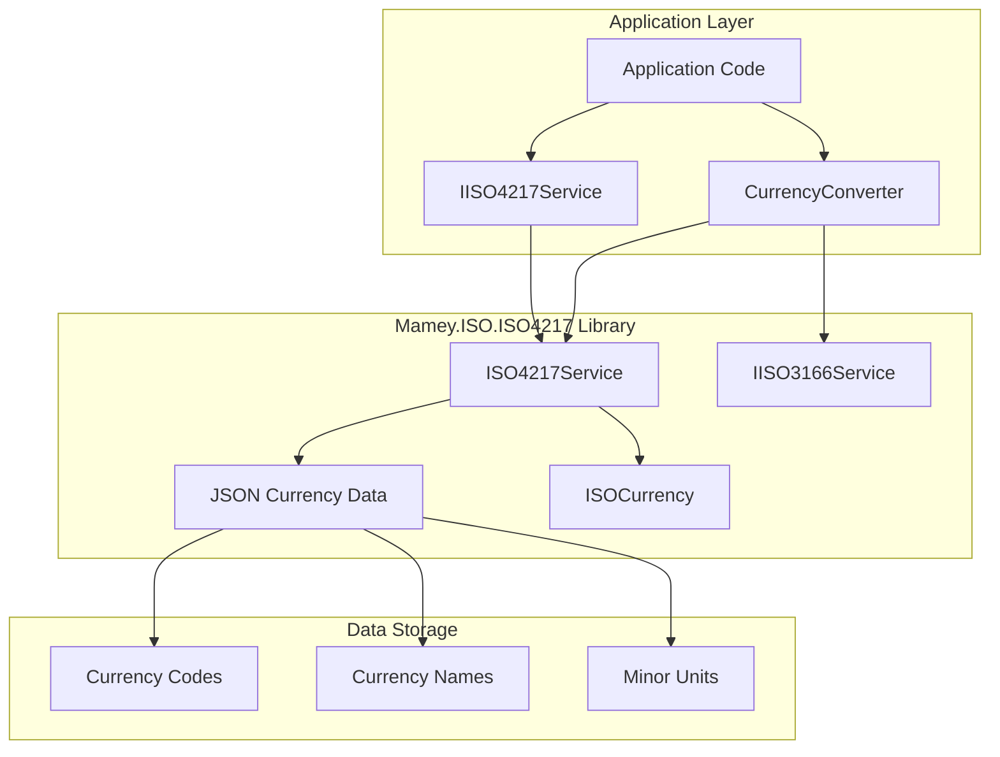
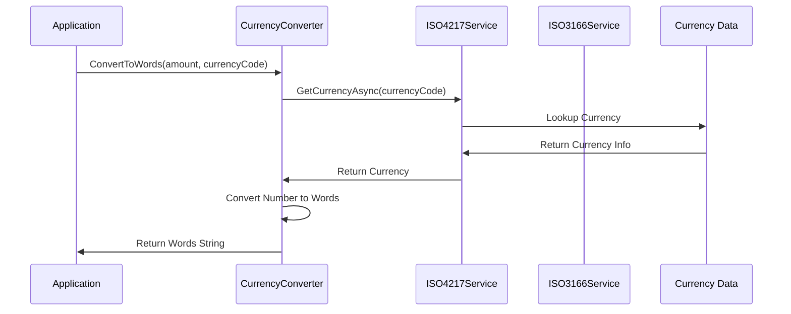

# Mamey.ISO.ISO4217

**Library**: `Mamey.ISO.ISO4217`  
**Location**: `Mamey/src/Mamey.ISO.ISO4217/`  
**Type**: Standards Library - ISO 4217 Currency Codes  
**Version**: 2.0.*  
**Files**: 5 C# files  
**Namespace**: `Mamey.ISO.ISO4217`

## Overview

Mamey.ISO.ISO4217 provides comprehensive ISO 4217 currency code standards implementation for the Mamey framework. It includes currency data from embedded JSON resources, currency conversion utilities, and seamless integration with ISO 3166 country codes.

### Conceptual Foundation

**ISO 4217** is an international standard for currency codes. Key concepts:

1. **Alpha Code**: Three-letter currency code (e.g., "USD", "EUR", "GBP")
2. **Numeric Code**: Three-digit numeric currency code (e.g., "840", "978", "826")
3. **Minor Unit**: Number of decimal places (e.g., 2 for USD, 2 for EUR, 2 for GBP)
4. **Currency Name**: Official currency name (e.g., "United States Dollar")
5. **Entity**: Country or region using the currency
6. **Fund**: Special fund codes (e.g., XDR, XUA)

**Why Mamey.ISO.ISO4217?**

Provides:
- **Complete Currency Data**: All ISO 4217 currency codes from embedded JSON
- **Currency Conversion**: Number-to-words conversion utilities
- **Country Integration**: Integration with ISO 3166 country codes
- **Type Safety**: Strongly-typed currency interfaces
- **Extensibility**: Easy to extend for custom currencies

**Use Cases:**
- Currency code validation
- Currency data retrieval
- Number-to-words conversion
- Financial calculations
- Currency formatting
- Exchange rate integration

## Architecture

### ISO 4217 Service Architecture



### Currency Conversion Flow



## Core Components

### IISO4217Service - ISO 4217 Service Interface

Interface for ISO 4217 currency operations:

```csharp
public interface IISO4217Service
{
    Task InitializeAsync();
    Task<IISOCurrency?> GetCurrencyAsync(string currencyCode);
    IISOCurrency? GetCurrency(string currencyCode);
}
```

### ISO4217Service - ISO 4217 Service Implementation

Implementation of `IISO4217Service`:

```csharp
public class ISO4217Service : IISO4217Service
{
    private ConcurrentDictionary<string, IISOCurrency> _currencies;

    public async Task InitializeAsync();
    public Task<IISOCurrency?> GetCurrencyAsync(string currencyCode);
    public IISOCurrency? GetCurrency(string currencyCode);
}
```

**Key Features:**
- **Async Initialization**: Loads currency data asynchronously
- **In-Memory Cache**: Caches currency data in memory
- **Embedded Resources**: Loads data from embedded JSON files
- **Thread-Safe**: Uses ConcurrentDictionary for thread safety

### ISOCurrency - Currency Data Model

Currency data model according to ISO 4217:

```csharp
public class ISOCurrency : IISOCurrency
{
    public string Entity { get; private set; } // Country or region
    public string Currency { get; private set; } // Currency name
    public string AlphabeticCode { get; private set; } // Alpha code (e.g., "USD")
    public string MinorUnit { get; private set; } // Decimal places (e.g., "2")
    public string? Fund { get; private set; } // Fund code (optional)
}
```

### CurrencyConverter - Currency Converter

Utility for converting numbers to words:

```csharp
public class CurrencyConverter
{
    private readonly IISO4217Service _iso4217Service;
    private readonly IISO3166Service _iso3166Service;

    public string ConvertToWords(decimal value, string currencyCode = "");
    public string ConvertToWords(BigDecimal value, string currencyCode = "");
    public string ConvertToWords(string value, string currencyCode = "");
}
```

**Features:**
- **Number to Words**: Converts numeric amounts to words
- **Currency Support**: Includes currency name in output
- **Fractional Parts**: Handles cents/minor units
- **Large Numbers**: Supports very large numbers (up to vigintillion)

### CurrencyNotFoundException - Exception

Exception thrown when currency is not found:

```csharp
public class CurrencyNotFoundException : Exception
{
    public string CurrencyCode { get; }

    public CurrencyNotFoundException(string message, string currencyCode)
        : base(message)
    {
        CurrencyCode = currencyCode;
    }
}
```

## Installation

### Prerequisites

1. **.NET 9.0**: Ensure .NET 9.0 SDK is installed
2. **Mamey.ISO.Abstractions**: ISO abstractions library
3. **Mamey.ISO.ISO3166**: ISO 3166 country codes (optional, for country integration)
4. **Mamey.Types**: Money and Amount types (optional, for currency conversion)

### NuGet Package

```bash
dotnet add package Mamey.ISO.ISO4217
```

### Dependencies

- **Mamey** - Core framework
- **Mamey.ISO.Abstractions** - ISO abstractions
- **Mamey.ISO.ISO3166** - Country codes (optional)
- **Mamey.Types** - Money types (optional)
- **Singulink.Numerics** - BigDecimal support

## Quick Start

### Basic Setup

```csharp
using Mamey.ISO.ISO4217;

var builder = WebApplication.CreateBuilder(args);

// Add ISO 4217 service
builder.Services.AddISO4217();

var app = builder.Build();

// Initialize service (loads currency data)
app.UseISO4217();

app.Run();
```

### Configuration

No additional configuration required. The service automatically loads currency data from embedded JSON files.

## Usage Examples

### Example 1: Get Currency by Code

```csharp
using Mamey.ISO.ISO4217;

public class CurrencyService
{
    private readonly IISO4217Service _iso4217Service;
    private readonly ILogger<CurrencyService> _logger;

    public CurrencyService(
        IISO4217Service iso4217Service,
        ILogger<CurrencyService> logger)
    {
        _iso4217Service = iso4217Service;
        _logger = logger;
    }

    public async Task<IISOCurrency?> GetCurrencyAsync(string currencyCode)
    {
        try
        {
            _logger.LogInformation("Retrieving currency: {CurrencyCode}", currencyCode);

            var currency = await _iso4217Service.GetCurrencyAsync(currencyCode);

            if (currency == null)
            {
                _logger.LogWarning("Currency not found: {CurrencyCode}", currencyCode);
                return null;
            }

            _logger.LogInformation(
                "Retrieved currency: {Name} ({Code})",
                currency.Currency,
                currency.AlphabeticCode);

            return currency;
        }
        catch (Exception ex)
        {
            _logger.LogError(ex, "Failed to retrieve currency: {CurrencyCode}", currencyCode);
            throw;
        }
    }
}

// Usage
var currency = await currencyService.GetCurrencyAsync("USD");
// currency.Entity = "UNITED STATES"
// currency.Currency = "US Dollar"
// currency.AlphabeticCode = "USD"
// currency.MinorUnit = "2"
```

### Example 2: Validate Currency Code

```csharp
public async Task<bool> ValidateCurrencyCodeAsync(string currencyCode)
{
    try
    {
        var currency = await _iso4217Service.GetCurrencyAsync(currencyCode);
        return currency != null;
    }
    catch (Exception ex)
    {
        _logger.LogError(ex, "Error validating currency code: {CurrencyCode}", currencyCode);
        return false;
    }
}

// Usage
var isValid = await currencyService.ValidateCurrencyCodeAsync("USD"); // true
var isInvalid = await currencyService.ValidateCurrencyCodeAsync("XXX"); // false
```

### Example 3: Convert Number to Words

```csharp
using Mamey.ISO.ISO4217;

public class CurrencyConversionService
{
    private readonly CurrencyConverter _currencyConverter;
    private readonly ILogger<CurrencyConversionService> _logger;

    public CurrencyConversionService(
        CurrencyConverter currencyConverter,
        ILogger<CurrencyConversionService> logger)
    {
        _currencyConverter = currencyConverter;
        _logger = logger;
    }

    public string ConvertAmountToWords(decimal amount, string currencyCode = "USD")
    {
        try
        {
            _logger.LogInformation("Converting amount to words: {Amount} {Currency}", amount, currencyCode);

            var words = _currencyConverter.ConvertToWords(amount, currencyCode);

            _logger.LogInformation("Converted to words: {Words}", words);

            return words;
        }
        catch (Exception ex)
        {
            _logger.LogError(ex, "Failed to convert amount to words: {Amount}", amount);
            throw;
        }
    }
}

// Usage
var words = currencyConversionService.ConvertAmountToWords(1234.56m, "USD");
// words = "one thousand two hundred thirty four and 56/100 dollars USD"
```

### Example 4: Get Currency by Country

```csharp
using Mamey.ISO.ISO3166;
using Mamey.ISO.ISO4217;

public class CountryCurrencyService
{
    private readonly IISO3166Service _iso3166Service;
    private readonly IISO4217Service _iso4217Service;
    private readonly ILogger<CountryCurrencyService> _logger;

    public CountryCurrencyService(
        IISO3166Service iso3166Service,
        IISO4217Service iso4217Service,
        ILogger<CountryCurrencyService> logger)
    {
        _iso3166Service = iso3166Service;
        _iso4217Service = iso4217Service;
        _logger = logger;
    }

    public async Task<IISOCurrency?> GetCurrencyByCountryAsync(string countryCode)
    {
        try
        {
            _logger.LogInformation("Retrieving currency for country: {CountryCode}", countryCode);

            // Get country data
            var country = await _iso3166Service.GetCountryAsync(countryCode);

            if (country == null || string.IsNullOrEmpty(country.CurrencyCode))
            {
                _logger.LogWarning("Country or currency code not found: {CountryCode}", countryCode);
                return null;
            }

            // Get currency data
            var currency = await _iso4217Service.GetCurrencyAsync(country.CurrencyCode);

            _logger.LogInformation(
                "Retrieved currency for country {Country}: {Currency} ({Code})",
                country.ISOShortName,
                currency?.Currency,
                currency?.AlphabeticCode);

            return currency;
        }
        catch (Exception ex)
        {
            _logger.LogError(ex, "Failed to retrieve currency for country: {CountryCode}", countryCode);
            throw;
        }
    }
}

// Usage
var currency = await countryCurrencyService.GetCurrencyByCountryAsync("US");
// currency.AlphabeticCode = "USD"
```

### Example 5: Format Currency Amount

```csharp
public class CurrencyFormattingService
{
    private readonly IISO4217Service _iso4217Service;
    private readonly ILogger<CurrencyFormattingService> _logger;

    public async Task<string> FormatCurrencyAsync(decimal amount, string currencyCode)
    {
        try
        {
            var currency = await _iso4217Service.GetCurrencyAsync(currencyCode);

            if (currency == null)
            {
                throw new CurrencyNotFoundException($"Currency not found: {currencyCode}", currencyCode);
            }

            // Get minor unit (decimal places)
            var minorUnit = int.Parse(currency.MinorUnit);

            // Format with appropriate decimal places
            return amount.ToString($"C{minorUnit}", CultureInfo.GetCultureInfo("en-US"))
                .Replace("USD", currencyCode);
        }
        catch (Exception ex)
        {
            _logger.LogError(ex, "Failed to format currency: {Amount} {Currency}", amount, currencyCode);
            throw;
        }
    }
}

// Usage
var formatted = await currencyFormattingService.FormatCurrencyAsync(1234.56m, "USD");
// formatted = "$1,234.56"
```

### Example 6: Convert Large Amounts to Words

```csharp
public class LargeAmountConversionService
{
    private readonly CurrencyConverter _currencyConverter;

    public string ConvertLargeAmountToWords(decimal amount, string currencyCode = "USD")
    {
        // Supports amounts up to vigintillion
        var words = _currencyConverter.ConvertToWords(amount, currencyCode);
        return words;
    }
}

// Usage
var words = largeAmountService.ConvertLargeAmountToWords(1234567890.12m, "USD");
// words = "one billion two hundred thirty four million five hundred sixty seven thousand eight hundred ninety and 12/100 dollars USD"
```

## Extension Methods

### AddISO4217

Registers ISO 4217 service with the service collection:

```csharp
public static IServiceCollection AddISO4217(this IServiceCollection services)
```

**Features:**
- Registers `IISO4217Service` as singleton
- Registers `CurrencyConverter` as scoped service

**Usage:**
```csharp
builder.Services.AddISO4217();
```

### UseISO4217

Initializes ISO 4217 service and loads currency data:

```csharp
public static IApplicationBuilder UseISO4217(this IApplicationBuilder builder)
```

**Features:**
- Initializes service asynchronously
- Loads all JSON currency data files
- Caches data in memory for fast access

**Usage:**
```csharp
var app = builder.Build();
app.UseISO4217(); // Loads currency data
app.Run();
```

## Best Practices

### 1. Initialize Service Early

**✅ Good: Initialize service at application startup**
```csharp
var app = builder.Build();
app.UseISO4217(); // Load currency data before handling requests
app.Run();
```

### 2. Validate Currency Codes

**✅ Good: Validate currency codes before use**
```csharp
var currency = await _iso4217Service.GetCurrencyAsync(currencyCode);
if (currency == null)
{
    throw new ArgumentException($"Invalid currency code: {currencyCode}");
}
```

### 3. Use Currency Converter for Financial Documents

**✅ Good: Use converter for checks and invoices**
```csharp
var amount = 1234.56m;
var words = _currencyConverter.ConvertToWords(amount, "USD");
// Use in check or invoice: "one thousand two hundred thirty four and 56/100 dollars USD"
```

### 4. Cache Currency Data

**✅ Good: Service caches currency data automatically**
```csharp
// First call loads data, subsequent calls use cache
var currency1 = await _iso4217Service.GetCurrencyAsync("USD");
var currency2 = await _iso4217Service.GetCurrencyAsync("USD"); // Uses cache
```

### 5. Handle Currency Not Found

**✅ Good: Handle missing currencies gracefully**
```csharp
try
{
    var currency = await _iso4217Service.GetCurrencyAsync(currencyCode);
    if (currency == null)
    {
        _logger.LogWarning("Currency not found: {CurrencyCode}", currencyCode);
        return null;
    }
}
catch (CurrencyNotFoundException ex)
{
    _logger.LogError(ex, "Currency not found: {CurrencyCode}", ex.CurrencyCode);
    throw;
}
```

## Performance Considerations

1. **Initialization**: Service loads currency data on first initialization (one-time cost)
2. **Memory Usage**: All currency data is cached in memory for fast access
3. **Query Performance**: O(1) lookup for currency codes after initialization
4. **Thread Safety**: Uses ConcurrentDictionary for thread-safe access

## Troubleshooting

### Common Issues

#### Currency Not Found

**Problem**: `GetCurrencyAsync` returns null for valid currency code.

**Solution**:
1. Verify currency code format (must be 3-letter alpha code)
2. Check currency code is uppercase
3. Verify currency exists in ISO 4217 standard
4. Check service initialization completed successfully

#### Service Not Initialized

**Problem**: Service not initialized, data not loaded.

**Solution**:
1. Ensure `UseISO4217()` is called before handling requests
2. Check service is registered with `AddISO4217()`
3. Verify initialization completes successfully

## Related Libraries

- **Mamey.ISO.Abstractions**: ISO standards abstractions
- **Mamey.ISO.ISO3166**: Country codes (for country-currency mapping)
- **Mamey.Types**: Money and Amount types (for currency conversion)

## Additional Resources

- [ISO 4217 Standard](https://www.iso.org/iso-4217-currency-codes.html)
- [Currency Codes](https://en.wikipedia.org/wiki/ISO_4217)
- [Mamey Framework Documentation](../)
- Mamey.ISO.ISO4217 Memory Documentation

## Tags

#iso-4217 #currency-codes #standards #currency-conversion #financial #mamey
