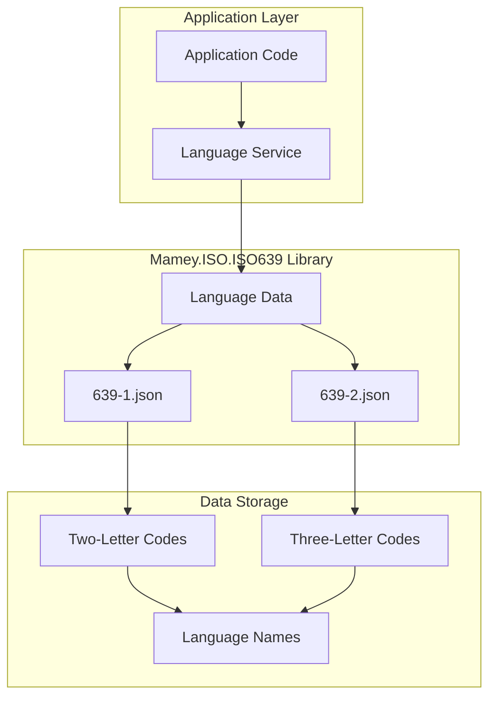

# Mamey.ISO.ISO639

**Library**: `Mamey.ISO.ISO639`  
**Location**: `Mamey/src/Mamey.ISO.ISO639/`  
**Type**: Standards Library - ISO 639 Language Codes  
**Version**: 2.0.*  
**Files**: 2 JSON files + 0 C# files (implementation pending)  
**Namespace**: `Mamey.ISO.ISO639`

## Overview

Mamey.ISO.ISO639 provides ISO 639 language code standards implementation for the Mamey framework. It includes language data from embedded JSON files (639-1.json and 639-2.json), covering two-letter and three-letter language codes with comprehensive language information.

### Conceptual Foundation

**ISO 639** is an international standard for language codes. Key concepts:

1. **ISO 639-1**: Two-letter language codes (e.g., "en", "fr", "de")
2. **ISO 639-2**: Three-letter language codes (e.g., "eng", "fra", "deu")
3. **Language Family**: Language family classification
4. **Native Name**: Language name in its native script
5. **Language Names**: English and native language names

**Why Mamey.ISO.ISO639?**

Provides:
- **Complete Language Data**: Language codes from ISO 639-1 and ISO 639-2
- **Language Names**: English and native language names
- **Language Families**: Language family classification
- **Localization Support**: Support for application localization
- **Type Safety**: Strongly-typed language interfaces

**Use Cases:**
- Language code validation
- Language data retrieval
- Application localization
- Language detection
- Multi-language support

## Architecture

### ISO 639 Language Data Architecture



## Installation

### Prerequisites

1. **.NET 9.0**: Ensure .NET 9.0 SDK is installed
2. **Mamey.ISO.Abstractions**: ISO abstractions library

### NuGet Package

```bash
dotnet add package Mamey.ISO.ISO639
```

### Dependencies

- **Mamey** - Core framework
- **Mamey.ISO.Abstractions** - ISO abstractions

## Quick Start

### Basic Setup

```csharp
using Mamey.ISO.ISO639;

var builder = WebApplication.CreateBuilder(args);

// Add ISO 639 service (implementation pending)
builder.Services.AddISO639();

var app = builder.Build();
app.Run();
```

## Usage Examples

### Example 1: Get Language by Code (Expected API)

```csharp
using Mamey.ISO.ISO639;

public class LanguageService
{
    private readonly IISO639Service _iso639Service;
    private readonly ILogger<LanguageService> _logger;

    public LanguageService(
        IISO639Service iso639Service,
        ILogger<LanguageService> logger)
    {
        _iso639Service = iso639Service;
        _logger = logger;
    }

    public async Task<ISOLanguage?> GetLanguageAsync(string languageCode)
    {
        try
        {
            _logger.LogInformation("Retrieving language: {LanguageCode}", languageCode);

            var language = await _iso639Service.GetLanguageAsync(languageCode);

            if (language == null)
            {
                _logger.LogWarning("Language not found: {LanguageCode}", languageCode);
                return null;
            }

            _logger.LogInformation(
                "Retrieved language: {Name} ({Code})",
                language.Name,
                language.Code);

            return language;
        }
        catch (Exception ex)
        {
            _logger.LogError(ex, "Failed to retrieve language: {LanguageCode}", languageCode);
            throw;
        }
    }
}

// Expected usage (implementation pending)
var language = await languageService.GetLanguageAsync("en");
// language.Code6391 = "en"
// language.Code6392 = "eng"
// language.Name = "English"
// language.NativeName = "English"
// language.Family = "Indo-European"
```

### Example 2: Validate Language Code (Expected API)

```csharp
public async Task<bool> ValidateLanguageCodeAsync(string languageCode)
{
    try
    {
        var language = await _iso639Service.GetLanguageAsync(languageCode);
        return language != null;
    }
    catch (Exception ex)
    {
        _logger.LogError(ex, "Error validating language code: {LanguageCode}", languageCode);
        return false;
    }
}

// Expected usage
var isValid = await languageService.ValidateLanguageCodeAsync("en"); // true
var isInvalid = await languageService.ValidateLanguageCodeAsync("xx"); // false
```

### Example 3: Get All Languages (Expected API)

```csharp
public async Task<Dictionary<string, ISOLanguage>> GetAllLanguagesAsync()
{
    try
    {
        _logger.LogInformation("Retrieving all languages");

        var languages = await _iso639Service.GetAllLanguagesAsync();

        _logger.LogInformation("Retrieved {Count} languages", languages.Count);

        return languages;
    }
    catch (Exception ex)
    {
        _logger.LogError(ex, "Failed to retrieve all languages");
        throw;
    }
}
```

### Example 4: Search Languages (Expected API)

```csharp
public async Task<List<ISOLanguage>> SearchLanguagesAsync(string searchTerm)
{
    try
    {
        _logger.LogInformation("Searching languages: {SearchTerm}", searchTerm);

        var allLanguages = await _iso639Service.GetAllLanguagesAsync();

        var results = allLanguages.Values
            .Where(l =>
                l.Name.Contains(searchTerm, StringComparison.OrdinalIgnoreCase) ||
                l.NativeName.Contains(searchTerm, StringComparison.OrdinalIgnoreCase) ||
                l.Code6391.Equals(searchTerm, StringComparison.OrdinalIgnoreCase) ||
                l.Code6392.Equals(searchTerm, StringComparison.OrdinalIgnoreCase))
            .ToList();

        _logger.LogInformation("Found {Count} languages matching {SearchTerm}", results.Count, searchTerm);

        return results;
    }
    catch (Exception ex)
    {
        _logger.LogError(ex, "Failed to search languages: {SearchTerm}", searchTerm);
        throw;
    }
}
```

## Data Structure

### Language Data (from JSON)

```json
{
  "en": {
    "639-1": "en",
    "639-2": "eng",
    "family": "Indo-European",
    "name": "English",
    "nativeName": "English",
    "wikiUrl": "https://en.wikipedia.org/wiki/English_language"
  },
  "fr": {
    "639-1": "fr",
    "639-2": "fra",
    "family": "Indo-European",
    "name": "French",
    "nativeName": "français",
    "wikiUrl": "https://en.wikipedia.org/wiki/French_language"
  }
}
```

## Related Libraries

- **Mamey.ISO.Abstractions**: ISO standards abstractions
- **Mamey.ISO.ISO3166**: Country codes (for locale combinations)

## Additional Resources

- [ISO 639 Standard](https://www.iso.org/iso-639-language-codes.html)
- [ISO 639-1](https://en.wikipedia.org/wiki/ISO_639-1) - Two-letter codes
- [ISO 639-2](https://en.wikipedia.org/wiki/ISO_639-2) - Three-letter codes
- [Mamey Framework Documentation](../)
- Mamey.ISO.ISO639 Memory Documentation

## Tags

#iso-639 #language-codes #standards #localization #mamey

