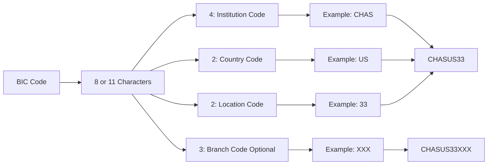
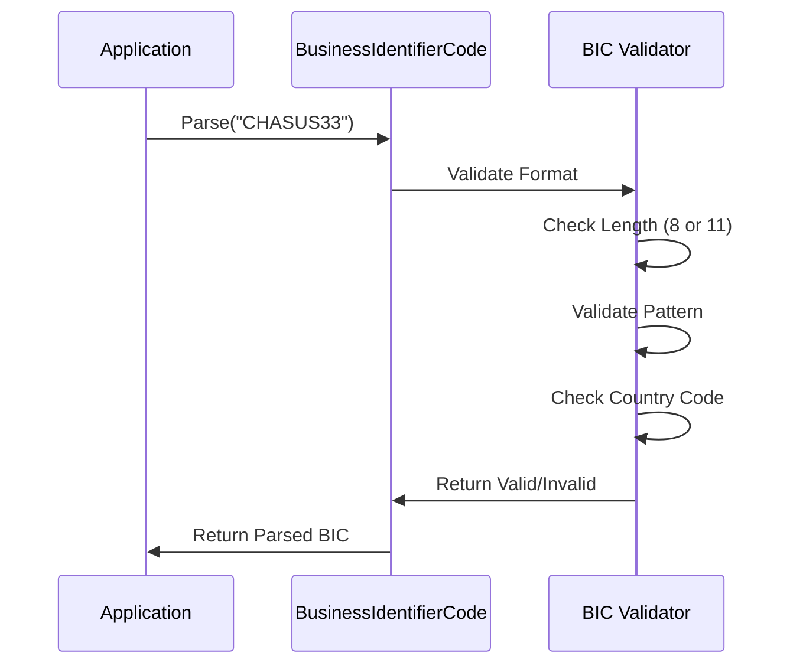

# Mamey.ISO.ISO9362

**Library**: `Mamey.ISO.ISO9362`  
**Location**: `Mamey/src/Mamey.ISO.ISO9362/`  
**Type**: Standards Library - ISO 9362 SWIFT BIC  
**Version**: 2.0.*  
**Files**: 1 C# file  
**Namespace**: `Mamey.ISO.ISO9362`

## Overview

Mamey.ISO.ISO9362 provides ISO 9362 SWIFT Business Identifier Code (BIC) standard implementation for the Mamey framework. BIC codes are used to identify banks and financial institutions worldwide in international financial transactions.

### Conceptual Foundation

**ISO 9362** is an international standard for Business Identifier Codes (BIC), also known as SWIFT codes. Key concepts:

1. **BIC Structure**: 8 or 11 character code identifying banks
2. **Business Party Prefix**: 4 characters (institution code)
3. **Country Code**: 2 characters (ISO 3166-1 alpha-2)
4. **Location Code**: 2 characters (suffix)
5. **Branch Code**: 3 characters (optional, for specific branches)

**Why Mamey.ISO.ISO9362?**

Provides:
- **BIC Validation**: SWIFT BIC code validation
- **BIC Parsing**: Parse BIC codes into components
- **Bank Identification**: Bank identification from BIC codes
- **Standards Compliance**: ISO 9362 standards compliance
- **Type Safety**: Strongly-typed BIC model

**Use Cases:**
- BIC code validation
- Bank identification
- International wire transfers
- SWIFT message routing
- Financial institution identification

## Architecture

### BIC Code Structure



### BIC Validation Flow



## Core Components

### BusinessIdentifierCode - BIC Model

BIC code model with validation:

```csharp
public class BusinessIdentifierCode
{
    public BusinessIdentifierCode(
        string businessPartyPrefix,
        string countryCode,
        string suffix,
        string? branchCode = null);

    [Required, MinLength(4), MaxLength(4)]
    public string BusinessPartyPrefix { get; }

    [Required, MinLength(2), MaxLength(2)]
    public string CountryCode { get; }

    [Required, MinLength(2), MaxLength(2)]
    public string Suffix { get; }

    [MinLength(3), MaxLength(3)]
    public string? BranchCode { get; }

    public override string ToString();
    public static bool IsValid(string bic);
}
```

**Key Features:**
- **Validation**: Validates BIC format using regex pattern
- **Parsing**: Parses BIC string into components
- **Type Safety**: Strongly-typed BIC model
- **Optional Branch**: Supports both 8 and 11 character BICs

### BusinessIdentifierCodeExtensions - Extension Methods

Extension methods for BIC parsing:

```csharp
public static class BusinessIdentifierCodeExtensions
{
    public static BusinessIdentifierCode Parse(this string bic);
}
```

**Usage:**
```csharp
var bic = "CHASUS33".Parse();
// bic.BusinessPartyPrefix = "CHAS"
// bic.CountryCode = "US"
// bic.Suffix = "33"
// bic.BranchCode = null
```

## Installation

### Prerequisites

1. **.NET 9.0**: Ensure .NET 9.0 SDK is installed
2. **System.ComponentModel.DataAnnotations**: For validation attributes

### NuGet Package

```bash
dotnet add package Mamey.ISO.ISO9362
```

### Dependencies

- **Mamey** - Core framework
- **System.ComponentModel.DataAnnotations** - Validation attributes

## Quick Start

### Basic Setup

```csharp
using Mamey.ISO.ISO9362;

// No service registration required - use directly
```

## Usage Examples

### Example 1: Create BIC Code

```csharp
using Mamey.ISO.ISO9362;

public class BICService
{
    private readonly ILogger<BICService> _logger;

    public BICService(ILogger<BICService> logger)
    {
        _logger = logger;
    }

    public BusinessIdentifierCode CreateBIC(
        string institutionCode,
        string countryCode,
        string locationCode,
        string? branchCode = null)
    {
        try
        {
            _logger.LogInformation(
                "Creating BIC: {Institution} {Country} {Location} {Branch}",
                institutionCode,
                countryCode,
                locationCode,
                branchCode ?? "N/A");

            var bic = new BusinessIdentifierCode(
                institutionCode,
                countryCode,
                locationCode,
                branchCode);

            _logger.LogInformation("Created BIC: {BIC}", bic.ToString());

            return bic;
        }
        catch (Exception ex)
        {
            _logger.LogError(ex, "Failed to create BIC");
            throw;
        }
    }
}

// Usage
var bic = bicService.CreateBIC("CHAS", "US", "33");
// bic.ToString() = "CHASUS33"
```

### Example 2: Parse BIC Code

```csharp
public class BICParsingService
{
    private readonly ILogger<BICParsingService> _logger;

    public BusinessIdentifierCode? ParseBIC(string bicString)
    {
        try
        {
            _logger.LogInformation("Parsing BIC: {BIC}", bicString);

            if (!BusinessIdentifierCode.IsValid(bicString))
            {
                _logger.LogWarning("Invalid BIC format: {BIC}", bicString);
                return null;
            }

            var bic = bicString.Parse();

            _logger.LogInformation(
                "Parsed BIC: Institution={Institution}, Country={Country}, Location={Location}, Branch={Branch}",
                bic.BusinessPartyPrefix,
                bic.CountryCode,
                bic.Suffix,
                bic.BranchCode ?? "N/A");

            return bic;
        }
        catch (FormatException ex)
        {
            _logger.LogError(ex, "Invalid BIC format: {BIC}", bicString);
            return null;
        }
        catch (Exception ex)
        {
            _logger.LogError(ex, "Failed to parse BIC: {BIC}", bicString);
            throw;
        }
    }
}

// Usage
var bic = bicParsingService.ParseBIC("CHASUS33");
// bic.BusinessPartyPrefix = "CHAS"
// bic.CountryCode = "US"
// bic.Suffix = "33"
```

### Example 3: Validate BIC Code

```csharp
public class BICValidationService
{
    private readonly ILogger<BICValidationService> _logger;

    public bool ValidateBIC(string bicString)
    {
        try
        {
            _logger.LogInformation("Validating BIC: {BIC}", bicString);

            var isValid = BusinessIdentifierCode.IsValid(bicString);

            if (isValid)
            {
                _logger.LogInformation("BIC is valid: {BIC}", bicString);
            }
            else
            {
                _logger.LogWarning("BIC is invalid: {BIC}", bicString);
            }

            return isValid;
        }
        catch (Exception ex)
        {
            _logger.LogError(ex, "Error validating BIC: {BIC}", bicString);
            return false;
        }
    }
}

// Usage
var isValid = bicValidationService.ValidateBIC("CHASUS33"); // true
var isInvalid = bicValidationService.ValidateBIC("INVALID"); // false
```

### Example 4: BIC with Branch Code

```csharp
public BusinessIdentifierCode CreateBICWithBranch(
    string institutionCode,
    string countryCode,
    string locationCode,
    string branchCode)
{
    try
    {
        _logger.LogInformation(
            "Creating BIC with branch: {Institution} {Country} {Location} {Branch}",
            institutionCode,
            countryCode,
            locationCode,
            branchCode);

        var bic = new BusinessIdentifierCode(
            institutionCode,
            countryCode,
            locationCode,
            branchCode);

        _logger.LogInformation("Created BIC: {BIC}", bic.ToString());

        return bic;
    }
    catch (Exception ex)
    {
        _logger.LogError(ex, "Failed to create BIC with branch");
        throw;
    }
}

// Usage
var bic = bicService.CreateBICWithBranch("CHAS", "US", "33", "XXX");
// bic.ToString() = "CHASUS33XXX"
```

### Example 5: Extract BIC Components

```csharp
public class BICComponentService
{
    public BICComponents ExtractComponents(string bicString)
    {
        try
        {
            if (!BusinessIdentifierCode.IsValid(bicString))
            {
                throw new ArgumentException($"Invalid BIC format: {bicString}");
            }

            var bic = bicString.Parse();

            return new BICComponents
            {
                InstitutionCode = bic.BusinessPartyPrefix,
                CountryCode = bic.CountryCode,
                LocationCode = bic.Suffix,
                BranchCode = bic.BranchCode,
                FullBIC = bic.ToString()
            };
        }
        catch (Exception ex)
        {
            _logger.LogError(ex, "Failed to extract BIC components: {BIC}", bicString);
            throw;
        }
    }
}

public class BICComponents
{
    public string InstitutionCode { get; set; }
    public string CountryCode { get; set; }
    public string LocationCode { get; set; }
    public string? BranchCode { get; set; }
    public string FullBIC { get; set; }
}
```

## BIC Format Details

### BIC Structure

```
Format: AAAA BBDD CCCC (optional)
- AAAA (4): Business Party Prefix (institution code)
- BB (2): Country Code (ISO 3166-1 alpha-2)
- DD (2): Location Code (suffix)
- CCCC (3, optional): Branch Code
```

### Examples

- **8-character BIC**: `CHASUS33`
  - Institution: `CHAS` (JPMorgan Chase)
  - Country: `US` (United States)
  - Location: `33` (New York)

- **11-character BIC**: `CHASUS33XXX`
  - Institution: `CHAS`
  - Country: `US`
  - Location: `33`
  - Branch: `XXX` (Head Office)

### Validation Pattern

The BIC validation uses the following regex pattern:
```
^[A-Z]{4}[A-Z]{2}[A-Z0-9]{2}([A-Z0-9]{3})?$
```

- **4 uppercase letters**: Institution code
- **2 uppercase letters**: Country code
- **2 alphanumeric**: Location code
- **3 alphanumeric (optional)**: Branch code

## Best Practices

### 1. Validate Before Parsing

**✅ Good: Validate before parsing**
```csharp
if (!BusinessIdentifierCode.IsValid(bicString))
{
    throw new ArgumentException($"Invalid BIC format: {bicString}");
}

var bic = bicString.Parse();
```

### 2. Handle Invalid BIC Codes

**✅ Good: Handle invalid BICs gracefully**
```csharp
try
{
    var bic = bicString.Parse();
    return bic;
}
catch (FormatException ex)
{
    _logger.LogWarning(ex, "Invalid BIC format: {BIC}", bicString);
    return null;
}
```

### 3. Use BIC Model for Type Safety

**✅ Good: Use BusinessIdentifierCode model**
```csharp
public BusinessIdentifierCode ProcessBIC(BusinessIdentifierCode bic)
{
    // Type-safe BIC processing
    var institution = bic.BusinessPartyPrefix;
    var country = bic.CountryCode;
    return bic;
}
```

### 4. Normalize BIC Codes

**✅ Good: Normalize to uppercase**
```csharp
var normalizedBIC = bicString.ToUpper();
var bic = normalizedBIC.Parse();
```

### 5. Check Branch Code Presence

**✅ Good: Handle optional branch code**
```csharp
if (bic.BranchCode != null)
{
    // Process specific branch
}
else
{
    // Process head office
}
```

## Troubleshooting

### Common Issues

#### Invalid BIC Format

**Problem**: `FormatException: Invalid BIC format`

**Solution**:
1. Verify BIC length is 8 or 11 characters
2. Check BIC format matches pattern
3. Ensure all characters are uppercase
4. Verify country code is valid ISO 3166-1 alpha-2

#### BIC Parsing Fails

**Problem**: BIC parsing throws exception.

**Solution**:
1. Validate BIC before parsing
2. Check BIC string is not null or empty
3. Verify BIC format is correct
4. Ensure country code is valid

## Related Libraries

- **Mamey.ISO.Abstractions**: ISO standards abstractions
- **Mamey.ISO.ISO3166**: Country codes (used by BIC)
- **Mamey.ISO.ISO20022**: Financial messaging (uses BIC codes)
- **Mamey.Bank**: Banking operations

## Additional Resources

- [ISO 9362 Standard](https://www.iso.org/standard/60390.html)
- [SWIFT BIC Codes](https://www.swift.com/standards/data-standards/bic)
- [BIC Format Specification](https://en.wikipedia.org/wiki/ISO_9362)
- [Mamey Framework Documentation](../)
- Mamey.ISO.ISO9362 Memory Documentation

## Tags

#iso-9362 #swift #bic #banking #standards #mamey

