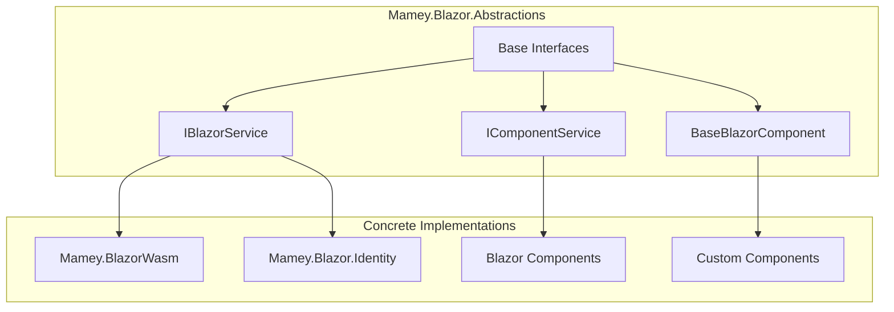

# Mamey.Blazor.Abstractions

**Library**: `Mamey.Blazor.Abstractions`  
**Location**: `Mamey/src/Mamey.Blazor.Abstractions/`  
**Type**: UI Library - Blazor Abstractions  
**Version**: 2.0.*  
**Files**: 3 C# files  
**Namespace**: `Mamey.Blazor.Abstractions`

## Overview

Mamey.Blazor.Abstractions provides core abstractions and interfaces for Blazor components and services in the Mamey framework. It defines common contracts and base types that enable consistent patterns across Blazor Server and Blazor WebAssembly applications.

### Conceptual Foundation

**Blazor Abstractions** provide a layer of indirection between application code and Blazor implementations, enabling:

1. **Dependency Inversion**: High-level modules don't depend on low-level Blazor implementations
2. **Testability**: Easy mocking and testing of Blazor component interactions
3. **Consistency**: Uniform patterns across different Blazor implementations
4. **Flexibility**: Easy switching between Blazor Server and Blazor WebAssembly
5. **Interface Segregation**: Focused, cohesive interfaces for specific Blazor services

**Why Mamey.Blazor.Abstractions?**

Provides:
- **Blazor Interfaces**: Core Blazor service interfaces
- **Component Abstractions**: Component abstraction interfaces
- **Base Classes**: Base classes for Blazor components
- **Type Safety**: Strongly-typed interfaces for better development experience
- **Consistency**: Uniform patterns across Blazor libraries

**Use Cases:**
- Base contracts for Blazor component implementations
- Type-safe Blazor service data structures
- Consistent API across Blazor libraries
- Framework for implementing new Blazor services

## Architecture

### Blazor Abstractions Architecture



## Installation

### Prerequisites

1. **.NET 9.0**: Ensure .NET 9.0 SDK is installed
2. **Blazor**: Blazor Server or Blazor WebAssembly project

### NuGet Package

```bash
dotnet add package Mamey.Blazor.Abstractions
```

### Dependencies

- **Mamey** - Core framework
- **Microsoft.AspNetCore.Components** - Blazor components

## Quick Start

### Basic Setup

```csharp
using Mamey.Blazor.Abstractions;

// Interfaces are used by concrete implementations
// No direct usage required - use concrete Blazor libraries instead
```

## Usage Examples

### Example 1: Using Blazor Abstractions

```csharp
using Mamey.Blazor.Abstractions;

public class MyComponent : BaseBlazorComponent
{
    // Component implementation using abstractions
}
```

## Related Libraries

- **Mamey.BlazorWasm**: Blazor WebAssembly implementation
- **Mamey.Blazor.Identity**: Blazor identity integration
- **Mamey.Auth.Jwt.BlazorWasm**: JWT authentication for Blazor

## Additional Resources

- [Blazor Documentation](https://docs.microsoft.com/aspnet/core/blazor/)
- [Mamey Framework Documentation](../)
- Mamey.Blazor.Abstractions Memory Documentation

## Tags

#blazor #abstractions #ui #interfaces #mamey

