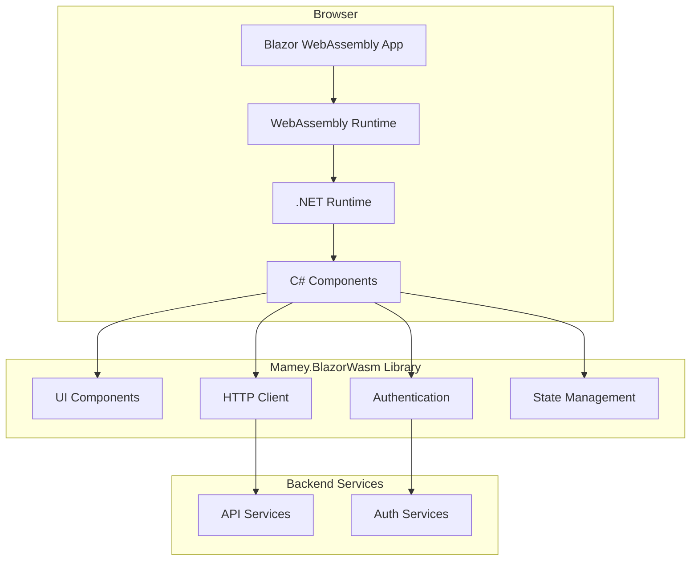
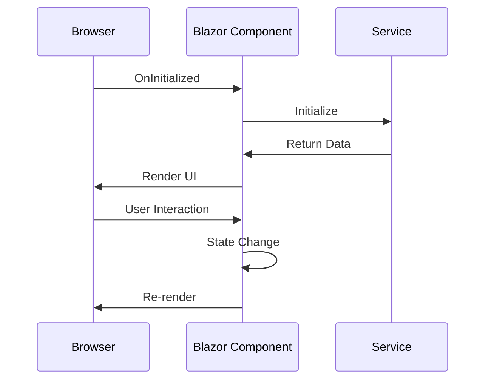

# Mamey.BlazorWasm

**Library**: `Mamey.BlazorWasm`  
**Location**: `Mamey/src/Mamey.BlazorWasm/`  
**Type**: UI Library - Blazor WebAssembly  
**Version**: 2.0.*  
**Files**: 58 C# files  
**Namespace**: `Mamey.BlazorWasm`

## Overview

Mamey.BlazorWasm provides comprehensive Blazor WebAssembly support for the Mamey framework, enabling client-side web applications with rich UI components, authentication integration, and API communication capabilities.

### Conceptual Foundation

**Blazor WebAssembly** is a framework for building interactive client-side web applications using C# instead of JavaScript. Key concepts:

1. **Client-Side Execution**: C# code runs directly in the browser via WebAssembly
2. **Component Model**: Reusable UI components with Razor syntax
3. **State Management**: Component state and lifecycle management
4. **Dependency Injection**: Built-in DI container for services
5. **Routing**: Client-side routing for navigation

**Why Mamey.BlazorWasm?**

Provides:
- **Blazor WebAssembly**: Complete Blazor WASM integration
- **Component Library**: Pre-built Blazor components
- **Authentication**: Client-side authentication support
- **API Integration**: HTTP client integration
- **State Management**: Client-side state management
- **UI Components**: Rich set of UI components

**Use Cases:**
- Client-side web applications
- Single Page Applications (SPA)
- Progressive Web Apps (PWA)
- Interactive web interfaces
- Real-time web applications

## Architecture

### Blazor WebAssembly Architecture



### Component Lifecycle



## Installation

### Prerequisites

1. **.NET 9.0**: Ensure .NET 9.0 SDK is installed
2. **Blazor WebAssembly**: Blazor WASM project template

### NuGet Package

```bash
dotnet add package Mamey.BlazorWasm
```

### Dependencies

- **Mamey** - Core framework
- **Microsoft.AspNetCore.Components.WebAssembly** - Blazor WebAssembly
- **Microsoft.AspNetCore.Components.WebAssembly.Authentication** - Blazor authentication

## Quick Start

### Basic Setup

```csharp
using Mamey.BlazorWasm;

var builder = WebAssemblyHostBuilder.CreateDefault(args);

builder.Services
    .AddMamey()
    .AddBlazorWasm();

var app = builder.Build();
await app.RunAsync();
```

## Usage Examples

### Example 1: Basic Blazor Component

```csharp
@using Mamey.BlazorWasm

<h3>Hello, @Name!</h3>

@code {
    [Parameter]
    public string Name { get; set; } = "World";
}
```

### Example 2: HTTP Client Integration

```csharp
@using Mamey.BlazorWasm
@inject HttpClient HttpClient

@if (data == null)
{
    <p>Loading...</p>
}
else
{
    <p>@data</p>
}

@code {
    private string? data;

    protected override async Task OnInitializedAsync()
    {
        data = await HttpClient.GetStringAsync("/api/data");
    }
}
```

### Example 3: Authentication Integration

```csharp
@using Mamey.BlazorWasm
@inject IAuthenticationService AuthService

@if (AuthService.IsAuthenticated)
{
    <p>Welcome, @AuthService.User?.Name</p>
    <button @onclick="Logout">Logout</button>
}
else
{
    <button @onclick="Login">Login</button>
}

@code {
    private async Task Login()
    {
        await AuthService.LoginAsync();
    }

    private async Task Logout()
    {
        await AuthService.LogoutAsync();
    }
}
```

## Related Libraries

- **Mamey.Auth.Jwt.BlazorWasm**: JWT authentication for Blazor
- **Mamey.Auth.Azure.B2B.BlazorWasm**: Azure B2B authentication for Blazor
- **Mamey.Http**: HTTP client integration
- **Mamey.Blazor.Abstractions**: Blazor abstractions

## Additional Resources

- [Blazor WebAssembly Documentation](https://docs.microsoft.com/aspnet/core/blazor/webassembly/)
- [Blazor Components](https://docs.microsoft.com/aspnet/core/blazor/components/)
- [Mamey Framework Documentation](../)
- Mamey.BlazorWasm Memory Documentation

## Tags

#blazor #webassembly #ui #frontend #spa #mamey

