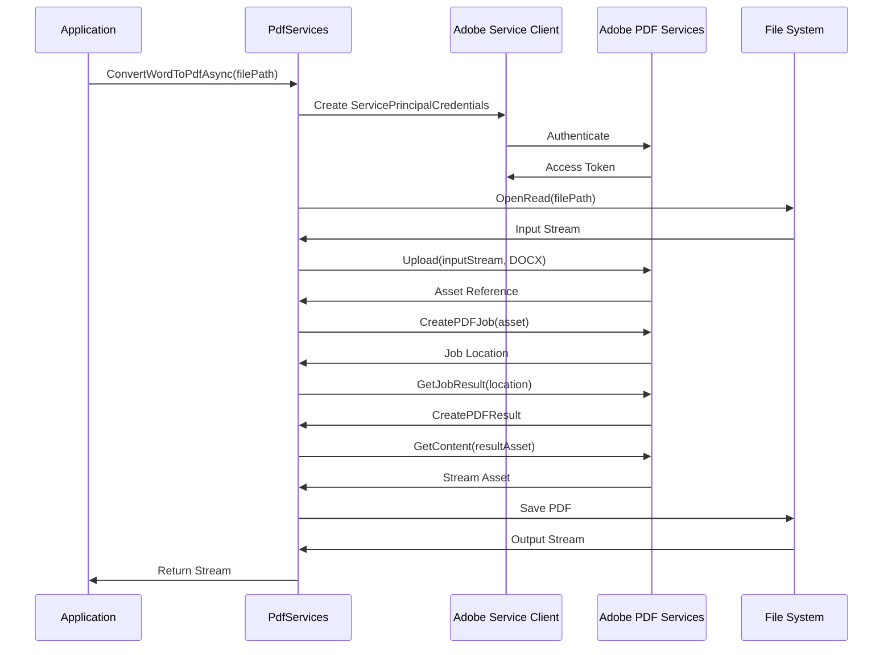
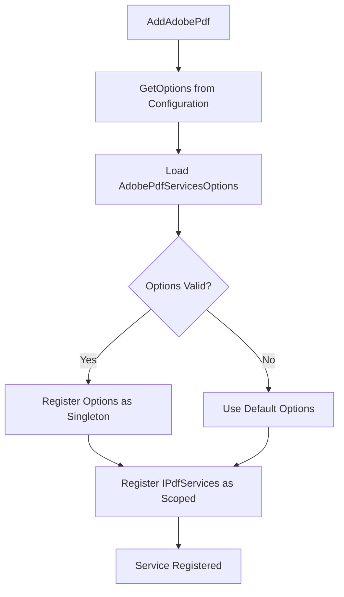
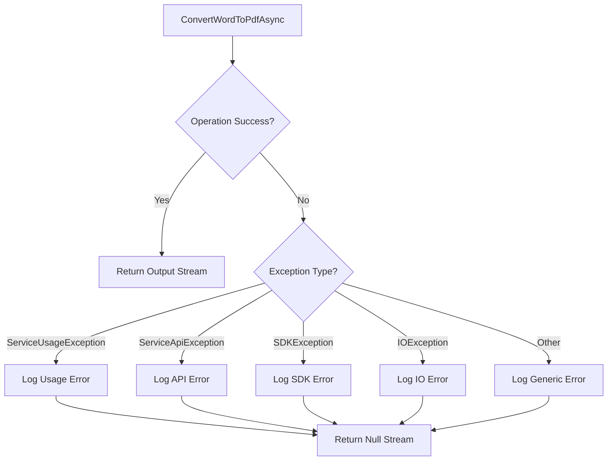

# Mamey.Adobe

**Library**: `Mamey.Adobe`  
**Location**: `Mamey/src/Mamey.Adobe/`  
**Type**: Integration Library - Adobe PDF Services  
**Version**: 2.0.*  
**Files**: 5 C# files  
**Namespace**: `Mamey.Adobe`

## Overview

Mamey.Adobe provides seamless integration with Adobe PDF Services SDK for document processing operations including PDF creation, conversion, and manipulation. It simplifies working with Adobe's cloud-based PDF services in .NET applications.

### Conceptual Foundation

**Adobe PDF Services** is a cloud-based API that provides document processing capabilities including:
- **Document Conversion**: Convert various document formats (Word, Excel, PowerPoint) to PDF
- **PDF Manipulation**: Merge, split, compress, and manipulate PDF documents
- **PDF Properties**: Extract metadata and properties from PDF files
- **PDF Security**: Apply digital signatures and seals to PDF documents
- **Export Operations**: Convert PDFs to other formats (Word, Excel, images)

**Why Use Adobe PDF Services?**
- **Cloud-Based**: No local software installation required
- **Scalable**: Handles high-volume document processing
- **Reliable**: Enterprise-grade reliability and uptime
- **Feature-Rich**: Comprehensive PDF manipulation capabilities
- **Secure**: Adobe's security and compliance standards

**Use Cases:**
- Document generation from templates
- Batch document processing
- PDF report generation
- Document conversion workflows
- Digital document signing

### Key Features

- **PDF Services Integration**: Integration with Adobe PDF Services SDK v4.3.0
- **Document Conversion**: Convert Word documents (.docx) to PDF
- **Authentication**: Adobe service principal credentials support
- **Async Operations**: Asynchronous API for non-blocking operations
- **Error Handling**: Comprehensive exception handling for Adobe SDK errors
- **Logging**: Structured logging for debugging and monitoring

## Architecture

### Document Conversion Flow



### Service Registration Flow



### Error Handling Flow



## Installation

### Prerequisites

1. **Adobe Account**: Create an Adobe account and register for PDF Services
2. **Service Principal Credentials**: Obtain Client ID, Client Secret, and Organization ID from Adobe
3. **.NET 9.0**: Ensure .NET 9.0 SDK is installed

### NuGet Package

```bash
dotnet add package Mamey.Adobe
```

### Dependencies

- **Adobe.PDFServicesSDK** (v4.3.0) - Adobe PDF Services SDK
- **Mamey** - Core framework
- **Mamey.Security** - Security utilities

## Quick Start

### Basic Setup

```csharp
using Mamey;
using Mamey.Adobe;

var builder = WebApplication.CreateBuilder(args);

// Configure Mamey services
builder.Services
    .AddMamey()
    .AddAdobePdf();

var app = builder.Build();
app.Run();
```

### Configuration

Add to `appsettings.json`:

```json
{
  "Adobe": {
    "ClientId": "your-adobe-client-id",
    "ClientSecret": "your-adobe-client-secret",
    "OrganizationId": "your-adobe-organization-id"
  }
}
```

**Environment Variables** (recommended for production):

```bash
export Adobe__ClientId="your-client-id"
export Adobe__ClientSecret="your-client-secret"
export Adobe__OrganizationId="your-organization-id"
```

## Core Components

### IPdfServices - PDF Services Interface

Interface for PDF operations:

```csharp
public interface IPdfServices
{
    Task<Stream?> ConvertWordToPdfAsync(string filepath);
    Task SealPdf();
    Task ExportPdfToWord();
    Task GetPdfProperties();
    Task MergeDocumentToPdf();
}
```

**Methods:**
- `ConvertWordToPdfAsync(string filepath)`: Converts a Word document (.docx) to PDF format
- `SealPdf()`: Applies digital seal to PDF (not yet implemented)
- `ExportPdfToWord()`: Exports PDF to Word format (not yet implemented)
- `GetPdfProperties()`: Extracts properties from PDF (not yet implemented)
- `MergeDocumentToPdf()`: Merges documents into PDF (not yet implemented)

### PdfServices - Implementation

Main implementation of PDF services:

```csharp
public class PdfServices : IPdfServices
{
    private readonly AdobePdfServicesOptions _adobeOptions;
    private readonly ILogger<PdfServices> _logger;

    public PdfServices(
        AdobePdfServicesOptions adobeOptions, 
        ILogger<PdfServices> logger)
    {
        _adobeOptions = adobeOptions;
        _logger = logger;
        
        // Validate credentials
        if (string.IsNullOrEmpty(_adobeOptions.ClientId))
            throw new ArgumentException("ClientId is required");
            
        if (string.IsNullOrEmpty(_adobeOptions.ClientSecret))
            throw new ArgumentException("ClientSecret is required");
    }

    public async Task<Stream?> ConvertWordToPdfAsync(string filePath)
    {
        // Implementation using Adobe PDF Services SDK
    }
}
```

**Key Features:**
- **Credential Validation**: Validates Adobe credentials on initialization
- **Error Handling**: Comprehensive exception handling for Adobe SDK errors
- **Logging**: Structured logging for debugging and monitoring
- **Async Operations**: Non-blocking asynchronous operations

### AdobePdfServicesOptions - Configuration Options

Configuration options for Adobe PDF Services:

```csharp
public class AdobePdfServicesOptions
{
    public string? ClientId { get; set; }
    public string? ClientSecret { get; set; }
    public string? OrganizationId { get; set; }
}
```

**Properties:**
- `ClientId`: Adobe service principal client ID (required)
- `ClientSecret`: Adobe service principal client secret (required)
- `OrganizationId`: Adobe organization ID (optional)

### PDFServiceFactory - Service Factory

Factory for creating PDF Services instances:

```csharp
public class PDFServiceFactory
{
    public static PDFServices GeneratePDFService(
        string clientId, 
        string clientSecret)
    {
        if (string.IsNullOrEmpty(clientId))
            throw new ArgumentException("ClientId is required", nameof(clientId));
            
        if (string.IsNullOrEmpty(clientSecret))
            throw new ArgumentException("ClientSecret is required", nameof(clientSecret));

        return new PDFServices(
            new ServicePrincipalCredentials(clientId, clientSecret)
        );
    }
}
```

## Usage Examples

### Example 1: Basic Word to PDF Conversion

```csharp
using Mamey.Adobe;
using Microsoft.AspNetCore.Mvc;

[ApiController]
[Route("api/[controller]")]
public class DocumentController : ControllerBase
{
    private readonly IPdfServices _pdfServices;
    private readonly ILogger<DocumentController> _logger;

    public DocumentController(
        IPdfServices pdfServices,
        ILogger<DocumentController> logger)
    {
        _pdfServices = pdfServices;
        _logger = logger;
    }

    [HttpPost("convert-word-to-pdf")]
    public async Task<IActionResult> ConvertWordToPdf(IFormFile file)
    {
        if (file == null || file.Length == 0)
            return BadRequest("No file uploaded");

        if (!file.FileName.EndsWith(".docx", StringComparison.OrdinalIgnoreCase))
            return BadRequest("File must be a Word document (.docx)");

        try
        {
            // Save uploaded file temporarily
            var tempFilePath = Path.GetTempFileName() + ".docx";
            await using (var stream = new FileStream(tempFilePath, FileMode.Create))
            {
                await file.CopyToAsync(stream);
            }

            // Convert to PDF
            var pdfStream = await _pdfServices.ConvertWordToPdfAsync(tempFilePath);

            if (pdfStream == null)
            {
                return StatusCode(500, "Failed to convert document to PDF");
            }

            // Clean up temporary file
            System.IO.File.Delete(tempFilePath);

            // Return PDF file
            return File(pdfStream, "application/pdf", 
                Path.ChangeExtension(file.FileName, ".pdf"));
        }
        catch (Exception ex)
        {
            _logger.LogError(ex, "Error converting document to PDF");
            return StatusCode(500, "Error converting document");
        }
    }
}
```

### Example 2: Document Service with Error Handling

```csharp
using Mamey.Adobe;

public class DocumentService
{
    private readonly IPdfServices _pdfServices;
    private readonly ILogger<DocumentService> _logger;

    public DocumentService(
        IPdfServices pdfServices,
        ILogger<DocumentService> logger)
    {
        _pdfServices = pdfServices;
        _logger = logger;
    }

    public async Task<DocumentConversionResult> ConvertWordToPdfAsync(
        string wordFilePath,
        CancellationToken cancellationToken = default)
    {
        _logger.LogInformation("Converting Word document to PDF: {FilePath}", wordFilePath);

        // Validate file exists
        if (!System.IO.File.Exists(wordFilePath))
        {
            _logger.LogWarning("File not found: {FilePath}", wordFilePath);
            return DocumentConversionResult.Failure("File not found");
        }

        // Validate file extension
        if (!wordFilePath.EndsWith(".docx", StringComparison.OrdinalIgnoreCase))
        {
            _logger.LogWarning("Invalid file type: {FilePath}", wordFilePath);
            return DocumentConversionResult.Failure("File must be a Word document (.docx)");
        }

        try
        {
            var pdfStream = await _pdfServices.ConvertWordToPdfAsync(wordFilePath);

            if (pdfStream == null)
            {
                _logger.LogError("PDF conversion returned null for: {FilePath}", wordFilePath);
                return DocumentConversionResult.Failure("Conversion failed");
            }

            var pdfFilePath = Path.ChangeExtension(wordFilePath, ".pdf");
            
            // Save PDF to file
            await using (var fileStream = new FileStream(pdfFilePath, FileMode.Create))
            {
                await pdfStream.CopyToAsync(fileStream, cancellationToken);
            }

            _logger.LogInformation(
                "Successfully converted {WordFile} to {PdfFile}", 
                wordFilePath, 
                pdfFilePath);

            return DocumentConversionResult.Success(pdfFilePath);
        }
        catch (Exception ex)
        {
            _logger.LogError(ex, "Error converting document: {FilePath}", wordFilePath);
            return DocumentConversionResult.Failure($"Error: {ex.Message}");
        }
    }
}

public class DocumentConversionResult
{
    public bool Success { get; private set; }
    public string? FilePath { get; private set; }
    public string? ErrorMessage { get; private set; }

    private DocumentConversionResult(bool success, string? filePath, string? errorMessage)
    {
        Success = success;
        FilePath = filePath;
        ErrorMessage = errorMessage;
    }

    public static DocumentConversionResult Success(string filePath)
        => new(true, filePath, null);

    public static DocumentConversionResult Failure(string errorMessage)
        => new(false, null, errorMessage);
}
```

### Example 3: Batch Document Conversion

```csharp
using Mamey.Adobe;

public class BatchDocumentService
{
    private readonly IPdfServices _pdfServices;
    private readonly ILogger<BatchDocumentService> _logger;

    public BatchDocumentService(
        IPdfServices pdfServices,
        ILogger<BatchDocumentService> logger)
    {
        _pdfServices = pdfServices;
        _logger = logger;
    }

    public async Task<BatchConversionResult> ConvertMultipleDocumentsAsync(
        IEnumerable<string> wordFilePaths,
        CancellationToken cancellationToken = default)
    {
        var results = new List<DocumentConversionResult>();
        var successful = 0;
        var failed = 0;

        _logger.LogInformation(
            "Starting batch conversion of {Count} documents", 
            wordFilePaths.Count());

        foreach (var filePath in wordFilePaths)
        {
            try
            {
                var pdfStream = await _pdfServices.ConvertWordToPdfAsync(filePath);

                if (pdfStream != null)
                {
                    var pdfFilePath = Path.ChangeExtension(filePath, ".pdf");
                    await using (var fileStream = new FileStream(pdfFilePath, FileMode.Create))
                    {
                        await pdfStream.CopyToAsync(fileStream, cancellationToken);
                    }

                    results.Add(new DocumentConversionResult(filePath, pdfFilePath, true));
                    successful++;
                }
                else
                {
                    results.Add(new DocumentConversionResult(filePath, null, false));
                    failed++;
                }
            }
            catch (Exception ex)
            {
                _logger.LogError(ex, "Error converting document: {FilePath}", filePath);
                results.Add(new DocumentConversionResult(filePath, null, false, ex.Message));
                failed++;
            }
        }

        _logger.LogInformation(
            "Batch conversion completed: {Successful} successful, {Failed} failed",
            successful,
            failed);

        return new BatchConversionResult(results, successful, failed);
    }
}

public class BatchConversionResult
{
    public List<DocumentConversionResult> Results { get; }
    public int Successful { get; }
    public int Failed { get; }
    public int Total => Results.Count;

    public BatchConversionResult(
        List<DocumentConversionResult> results,
        int successful,
        int failed)
    {
        Results = results;
        Successful = successful;
        Failed = failed;
    }
}

public class DocumentConversionResult
{
    public string SourceFilePath { get; }
    public string? TargetFilePath { get; }
    public bool Success { get; }
    public string? ErrorMessage { get; }

    public DocumentConversionResult(
        string sourceFilePath,
        string? targetFilePath,
        bool success,
        string? errorMessage = null)
    {
        SourceFilePath = sourceFilePath;
        TargetFilePath = targetFilePath;
        Success = success;
        ErrorMessage = errorMessage;
    }
}
```

### Example 4: Integration with File Storage

```csharp
using Mamey.Adobe;
using Mamey.Persistence.Minio;

public class DocumentProcessingService
{
    private readonly IPdfServices _pdfServices;
    private readonly IMinioClient _minioClient;
    private readonly ILogger<DocumentProcessingService> _logger;

    public DocumentProcessingService(
        IPdfServices pdfServices,
        IMinioClient minioClient,
        ILogger<DocumentProcessingService> logger)
    {
        _pdfServices = pdfServices;
        _minioClient = minioClient;
        _logger = logger;
    }

    public async Task<string> ConvertAndStoreAsync(
        string wordFileKey,
        string bucketName,
        CancellationToken cancellationToken = default)
    {
        _logger.LogInformation(
            "Converting and storing document: {WordFileKey} in bucket {BucketName}",
            wordFileKey,
            bucketName);

        // Download Word document from storage
        var wordStream = await _minioClient.GetObjectAsync(
            bucketName,
            wordFileKey,
            cancellationToken);

        // Save to temporary file
        var tempFilePath = Path.GetTempFileName() + ".docx";
        await using (var fileStream = new FileStream(tempFilePath, FileMode.Create))
        {
            await wordStream.CopyToAsync(fileStream, cancellationToken);
        }

        try
        {
            // Convert to PDF
            var pdfStream = await _pdfServices.ConvertWordToPdfAsync(tempFilePath);

            if (pdfStream == null)
            {
                throw new InvalidOperationException("PDF conversion failed");
            }

            // Upload PDF to storage
            var pdfFileKey = Path.ChangeExtension(wordFileKey, ".pdf");
            await _minioClient.PutObjectAsync(
                bucketName,
                pdfFileKey,
                pdfStream,
                "application/pdf",
                cancellationToken);

            _logger.LogInformation(
                "Successfully converted and stored PDF: {PdfFileKey}",
                pdfFileKey);

            return pdfFileKey;
        }
        finally
        {
            // Clean up temporary file
            if (System.IO.File.Exists(tempFilePath))
            {
                System.IO.File.Delete(tempFilePath);
            }
        }
    }
}
```

## Extension Methods

### AddAdobePdf

Registers Adobe PDF Services with the Mamey builder.

```csharp
public static IMameyBuilder AddAdobePdf(this IMameyBuilder builder)
```

**Features:**
- Loads configuration from `appsettings.json` under "Adobe" section
- Registers `AdobePdfServicesOptions` as singleton
- Registers `IPdfServices` as scoped service
- Validates required configuration options

**Usage:**
```csharp
builder.Services
    .AddMamey()
    .AddAdobePdf();
```

## Configuration

### Configuration Options

```json
{
  "Adobe": {
    "ClientId": "your-adobe-client-id",
    "ClientSecret": "your-adobe-client-secret",
    "OrganizationId": "your-adobe-organization-id"
  }
}
```

### Environment Variables

```bash
# Development
export Adobe__ClientId="dev-client-id"
export Adobe__ClientSecret="dev-client-secret"
export Adobe__OrganizationId="dev-org-id"

# Production
export Adobe__ClientId="prod-client-id"
export Adobe__ClientSecret="prod-client-secret"
export Adobe__OrganizationId="prod-org-id"
```

### Azure Key Vault / Vault Integration

```csharp
// Using Mamey.Secrets.Vault
builder.Services
    .AddMamey()
    .AddVault()
    .AddAdobePdf(); // Options will be loaded from Vault
```

## Best Practices

### 1. Credential Management

**✅ Good: Store credentials securely**
```csharp
// Use environment variables or secret management
var options = new AdobePdfServicesOptions
{
    ClientId = Environment.GetEnvironmentVariable("ADOBE_CLIENT_ID"),
    ClientSecret = Environment.GetEnvironmentVariable("ADOBE_CLIENT_SECRET"),
    OrganizationId = Environment.GetEnvironmentVariable("ADOBE_ORG_ID")
};
```

**❌ Bad: Hardcode credentials**
```csharp
// Never hardcode credentials in source code
var options = new AdobePdfServicesOptions
{
    ClientId = "hardcoded-id", // ❌ Security risk
    ClientSecret = "hardcoded-secret" // ❌ Security risk
};
```

### 2. Error Handling

**✅ Good: Comprehensive error handling**
```csharp
try
{
    var pdfStream = await _pdfServices.ConvertWordToPdfAsync(filePath);
    if (pdfStream == null)
    {
        _logger.LogWarning("PDF conversion returned null");
        return null;
    }
    return pdfStream;
}
catch (ServiceUsageException ex)
{
    _logger.LogError(ex, "Adobe service usage error: {Message}", ex.Message);
    // Handle usage limits
    throw;
}
catch (ServiceApiException ex)
{
    _logger.LogError(ex, "Adobe API error: {Message}", ex.Message);
    // Handle API errors
    throw;
}
catch (SDKException ex)
{
    _logger.LogError(ex, "Adobe SDK error: {Message}", ex.Message);
    // Handle SDK errors
    throw;
}
```

### 3. File Management

**✅ Good: Clean up temporary files**
```csharp
var tempFilePath = Path.GetTempFileName() + ".docx";
try
{
    // Process file
    var pdfStream = await _pdfServices.ConvertWordToPdfAsync(tempFilePath);
    return pdfStream;
}
finally
{
    // Always clean up
    if (System.IO.File.Exists(tempFilePath))
    {
        System.IO.File.Delete(tempFilePath);
    }
}
```

**❌ Bad: Leave temporary files**
```csharp
var tempFilePath = Path.GetTempFileName() + ".docx";
var pdfStream = await _pdfServices.ConvertWordToPdfAsync(tempFilePath);
// ❌ Temporary file not cleaned up
return pdfStream;
```

### 4. Async Operations

**✅ Good: Use async/await properly**
```csharp
public async Task<Stream?> ConvertWordToPdfAsync(string filePath)
{
    // Use async I/O operations
    await using var inputStream = File.OpenRead(filePath);
    // ... process file
}
```

### 5. Logging

**✅ Good: Structured logging**
```csharp
_logger.LogInformation(
    "Converting document: {FilePath} to PDF", 
    filePath);

_logger.LogError(
    ex, 
    "Error converting document: {FilePath}", 
    filePath);
```

## Troubleshooting

### Common Issues

#### Credentials Not Working

**Problem**: `ArgumentException: ClientId is required` or `ClientSecret is required`

**Solution**:
1. Verify credentials in `appsettings.json`:
```json
{
  "Adobe": {
    "ClientId": "your-client-id",
    "ClientSecret": "your-client-secret"
  }
}
```

2. Check environment variables are set correctly
3. Verify credentials in Adobe Developer Console
4. Ensure credentials are not expired

#### Conversion Returns Null

**Problem**: `ConvertWordToPdfAsync()` returns `null`

**Solution**:
1. Check file exists and is readable
2. Verify file is a valid .docx file
3. Check Adobe service logs for errors
4. Verify Adobe service quota/limits
5. Check network connectivity to Adobe services

#### File Not Found Errors

**Problem**: `FileNotFoundException` or `IOException`

**Solution**:
1. Verify file path is correct and file exists
2. Check file permissions (read access required)
3. Ensure file is not locked by another process
4. Use absolute paths instead of relative paths

#### Service Usage Errors

**Problem**: `ServiceUsageException` thrown

**Solution**:
1. Check Adobe service quota/limits
2. Verify service subscription is active
3. Monitor usage in Adobe Developer Console
4. Implement retry logic with exponential backoff

#### SDK Exception Errors

**Problem**: `SDKException` thrown

**Solution**:
1. Verify Adobe.PDFServicesSDK version (should be 4.3.0)
2. Check .NET SDK version compatibility
3. Review Adobe SDK documentation for breaking changes
4. Update to latest SDK version if available

### Debugging

Enable detailed logging:

```csharp
builder.Logging.AddConsole();
builder.Logging.SetMinimumLevel(LogLevel.Debug);
```

Check Adobe service status:

```csharp
// Monitor Adobe service response times
var stopwatch = System.Diagnostics.Stopwatch.StartNew();
var pdfStream = await _pdfServices.ConvertWordToPdfAsync(filePath);
stopwatch.Stop();
_logger.LogInformation(
    "PDF conversion completed in {ElapsedMs}ms", 
    stopwatch.ElapsedMilliseconds);
```

### Performance Considerations

1. **File Size**: Large Word documents take longer to convert
2. **Network Latency**: Adobe services are cloud-based, network latency affects performance
3. **Concurrent Requests**: Adobe service has rate limits, implement request throttling
4. **Caching**: Cache converted PDFs when possible to avoid re-conversion
5. **Streaming**: Use streaming for large files instead of loading entire file into memory

## Integration Patterns

### With Document Templates

```csharp
using Mamey.Adobe;
using Mamey.Templates;

public class DocumentGenerationService
{
    private readonly ITemplateService _templateService;
    private readonly IPdfServices _pdfServices;

    public async Task<Stream> GeneratePdfFromTemplateAsync(
        string templateName,
        object data)
    {
        // Generate Word document from template
        var wordStream = await _templateService.GenerateAsync(templateName, data);
        
        // Save to temporary file
        var tempFilePath = Path.GetTempFileName() + ".docx";
        await using (var fileStream = new FileStream(tempFilePath, FileMode.Create))
        {
            await wordStream.CopyToAsync(fileStream);
        }

        // Convert to PDF
        var pdfStream = await _pdfServices.ConvertWordToPdfAsync(tempFilePath);
        
        // Clean up
        System.IO.File.Delete(tempFilePath);
        
        return pdfStream;
    }
}
```

### With Email Services

```csharp
using Mamey.Adobe;
using Mamey.Emails;

public class DocumentEmailService
{
    private readonly IPdfServices _pdfServices;
    private readonly IEmailService _emailService;

    public async Task SendDocumentAsPdfAsync(
        string wordFilePath,
        string recipientEmail,
        string subject)
    {
        // Convert to PDF
        var pdfStream = await _pdfServices.ConvertWordToPdfAsync(wordFilePath);
        
        if (pdfStream == null)
        {
            throw new InvalidOperationException("Failed to convert document to PDF");
        }

        // Send email with PDF attachment
        await _emailService.SendEmailAsync(new EmailMessage
        {
            To = recipientEmail,
            Subject = subject,
            Body = "Please find the attached document.",
            Attachments = new[]
            {
                new EmailAttachment
                {
                    FileName = Path.ChangeExtension(
                        Path.GetFileName(wordFilePath), 
                        ".pdf"),
                    Content = pdfStream,
                    ContentType = "application/pdf"
                }
            }
        });
    }
}
```

## Related Libraries

- **Mamey.Templates**: Document template processing for generating Word documents
- **Mamey.Image**: Image processing capabilities
- **Mamey.Word**: Word document processing and manipulation
- **Mamey.Persistence.Minio**: Store generated PDF documents
- **Mamey.Emails**: Send PDF documents via email

## Additional Resources

- [Adobe PDF Services Documentation](https://developer.adobe.com/document-services/docs/overview/pdf-services-api/)
- [Adobe PDF Services SDK for .NET](https://github.com/adobe/pdfservices-dotnet-sdk)
- [Adobe Developer Console](https://developer.adobe.com/console)
- [Mamey Framework Documentation](../../documentation/)
- [Mamey.Adobe Memory Documentation](../../.skmemory/v1/memory/public/mid-term/libraries/integrations/mamey-adobe.md)

## Future Enhancements

The following operations are planned for future implementation:
- **PDF Sealing**: Apply digital seals to PDF documents
- **PDF to Word Export**: Convert PDF documents back to Word format
- **PDF Properties**: Extract metadata and properties from PDF files
- **PDF Merging**: Merge multiple documents into a single PDF
- **PDF Compression**: Compress PDF files to reduce file size
- **PDF Watermarking**: Add watermarks to PDF documents

## Tags

#adobe #pdf-services #integration #document-conversion #pdf #mamey
