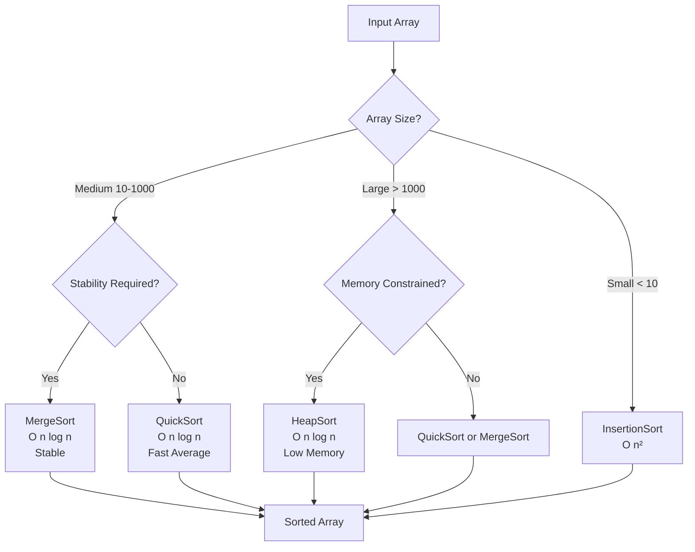
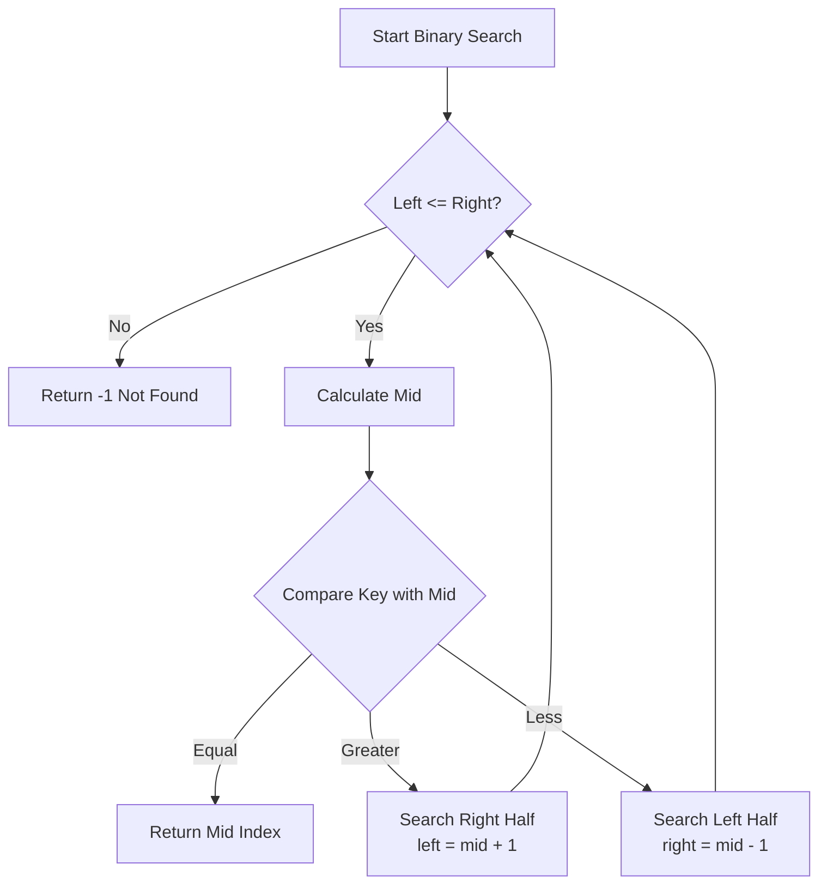
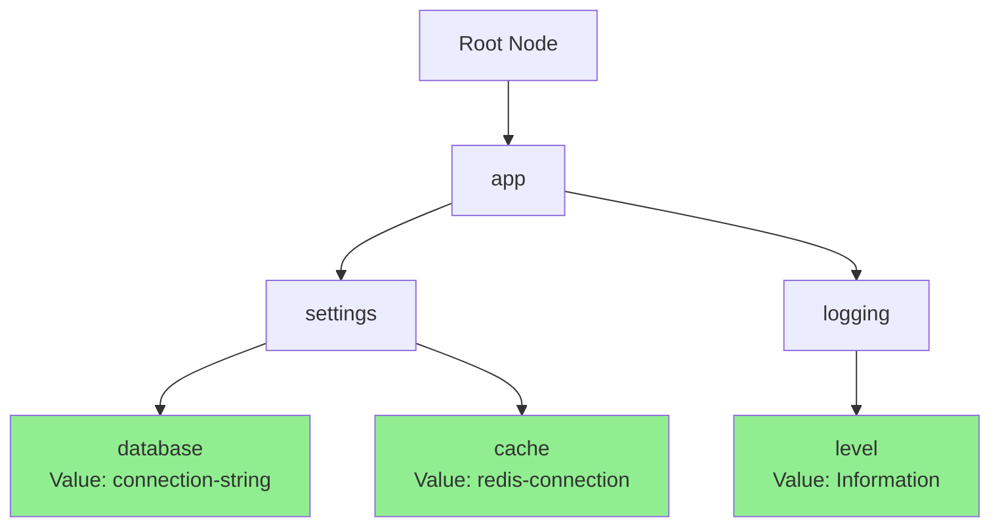
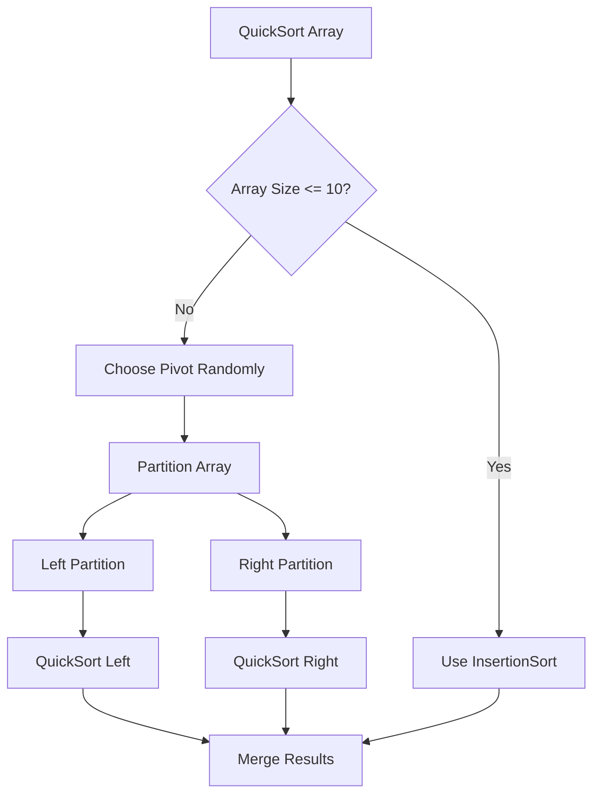

# Mamey.Algorithms

**Library**: `Mamey.Algorithms`  
**Location**: `Mamey/src/Mamey.Algorithms/`  
**Type**: Specialized Library - Algorithms & Data Structures  
**Version**: 2.0.*  
**Files**: 10 C# files  
**Namespace**: `Mamey.Algorithms`

## Overview

Mamey.Algorithms provides a comprehensive collection of algorithms and data structures including sorting, searching, graph algorithms, dynamic programming, greedy algorithms, backtracking, and more. These utilities are designed for performance-critical operations and can be used throughout your microservices.

### Conceptual Foundation

**Algorithms** are step-by-step procedures for solving problems. They are:
- **Deterministic**: Given the same input, always produce the same output
- **Finite**: Must terminate after a finite number of steps
- **Effective**: Each step must be clearly defined and executable
- **Optimal**: Designed to solve problems efficiently

**Data Structures** are ways of organizing and storing data:
- **Arrays/Lists**: Linear data structures
- **Trees**: Hierarchical data structures
- **Graphs**: Network data structures
- **Tries**: Prefix tree structures for string operations

**Why Use Mamey.Algorithms?**
- **Performance**: Optimized implementations for common operations
- **Reliability**: Well-tested algorithms suitable for production
- **Type Safety**: Generic implementations with compile-time type checking
- **Comprehensive**: Covers sorting, searching, graph, DP, greedy, and more
- **Flexibility**: Works with any `IComparable<T>` type

## Architecture

### Sorting Algorithm Comparison



### Binary Search Flow



### TreeTrie Data Structure



### QuickSort Algorithm Flow



## Core Components

### SortingAlgorithms - Sorting Operations

Static class providing various sorting algorithms:

```csharp
public static class SortingAlgorithms
{
    // Comparison-based sorts
    public static void QuickSort<T>(T[] array, int left, int right) where T : IComparable<T>;
    public static void MergeSort<T>(T[] array, int left, int right) where T : IComparable<T>;
    public static void HeapSort<T>(T[] array) where T : IComparable<T>;
    public static void InsertionSort<T>(T[] array, int left, int right) where T : IComparable<T>;
    public static void SelectionSort<T>(T[] array) where T : IComparable<T>;
    public static void BubbleSort<T>(T[] array) where T : IComparable<T>;
    public static void ShellSort<T>(T[] array) where T : IComparable<T>;
    
    // Non-comparison sorts (Radix)
    public static void RadixSort(int[] array);
    public static void RadixSortFloats(float[] array);
    public static void RadixSortStrings(string[] array);
    public static void RadixSortDoubles(double[] array);
    public static void RadixSortLong(long[] array);
}
```

#### Algorithm Selection Guide

**When to Use Each Algorithm:**

1. **QuickSort** (O(n log n) average, O(n²) worst)
   - ✅ Best for: Large datasets, average-case performance
   - ✅ Use when: Stability not required, memory is a concern
   - ❌ Avoid when: Worst-case O(n²) is unacceptable

2. **MergeSort** (O(n log n) always)
   - ✅ Best for: Stable sorting required, large datasets
   - ✅ Use when: Consistent performance is critical
   - ❌ Avoid when: Memory is very limited (uses O(n) extra space)

3. **HeapSort** (O(n log n) always)
   - ✅ Best for: Large datasets, memory-constrained environments
   - ✅ Use when: Guaranteed O(n log n) performance needed
   - ❌ Avoid when: Stability is required

4. **InsertionSort** (O(n²) average, O(n) best for nearly sorted)
   - ✅ Best for: Small arrays (< 10 elements), nearly sorted data
   - ✅ Use when: Simple implementation is preferred
   - ❌ Avoid when: Large unsorted datasets

5. **RadixSort** (O(nk) where k is number of digits)
   - ✅ Best for: Integers with limited range, strings
   - ✅ Use when: Non-comparison sort is possible
   - ❌ Avoid when: Range is very large or data is not integers/strings

### SearchAlgorithms - Search Operations

Static class providing search algorithms:

```csharp
public static class SearchAlgorithms
{
    // Binary search (sorted arrays)
    public static int BinarySearch<T>(
        T[] array, 
        T key, 
        int left, 
        int right) 
        where T : IComparable<T>;
    
    // Linear search with early exit
    public static int LinearSearchSorted<T>(
        T[] array, 
        T key) 
        where T : IComparable<T>;
    
    // Graph traversal
    public static Dictionary<int, int> BreadthFirstSearchWithPath(
        Dictionary<int, List<int>> graph, 
        int start);
    
    public static List<int> DepthFirstSearchRecursive(
        Dictionary<int, List<int>> graph, 
        int start, 
        HashSet<int>? visited = null);
}
```

#### Search Algorithm Selection

**When to Use Each Algorithm:**

1. **Binary Search** (O(log n))
   - ✅ Best for: Sorted arrays, frequent searches
   - ✅ Use when: Array is already sorted
   - ❌ Avoid when: Array is unsorted (sort first, then search)

2. **Linear Search** (O(n))
   - ✅ Best for: Small arrays, unsorted data
   - ✅ Use when: Array is small or cannot be sorted
   - ❌ Avoid when: Array is large and sorted (use Binary Search)

3. **Breadth-First Search** (O(V + E))
   - ✅ Best for: Shortest path in unweighted graphs
   - ✅ Use when: Level-order traversal needed
   - ❌ Avoid when: Deep graphs (may use more memory)

4. **Depth-First Search** (O(V + E))
   - ✅ Best for: Graph traversal, path finding
   - ✅ Use when: Need to explore all paths
   - ❌ Avoid when: Shortest path needed (use BFS)

### TreeTrie<T> - Hierarchical Data Structure

Generic hierarchical data structure for storing and retrieving values by hierarchical keys:

```csharp
public class TreeTrie<T>
{
    // Insert or update a value
    public bool Upsert(string key, T value);
    
    // Insert a new value (fails if key exists)
    public bool Insert(string key, T value);
    
    // Delete a key
    public bool Delete(string key);
    
    // Search for a key and get value
    public bool Search(string key, out T value);
    
    // Check if key is available
    public bool IsAvailable(string key);
    
    // Display entire hierarchy
    public void Display();
}
```

#### TreeTrie Use Cases

**Configuration Management:**
```csharp
var config = new TreeTrie<string>();
config.Upsert("app.settings.database.connection", "connection-string");
config.Upsert("app.settings.database.timeout", "30");
config.Upsert("app.settings.cache.redis", "redis-connection");
config.Upsert("app.logging.level", "Information");

// Retrieve values
if (config.Search("app.settings.database.connection", out var connectionString))
{
    // Use connection string
}
```

**Feature Flags:**
```csharp
var features = new TreeTrie<bool>();
features.Upsert("features.payments.enabled", true);
features.Upsert("features.payments.stripe.enabled", true);
features.Upsert("features.payments.paypal.enabled", false);

if (features.Search("features.payments.enabled", out var paymentsEnabled) && paymentsEnabled)
{
    // Payments feature is enabled
}
```

### GraphAlgorithms - Graph Operations

Static class providing graph algorithms:

```csharp
public static class GraphAlgorithms
{
    // Graph algorithms implementations
    // (See GraphAlgorithms.cs for complete API)
}
```

### DynamicProgrammingAlgorithms - DP Operations

Static class providing dynamic programming algorithms:

```csharp
public static class DynamicProgrammingAlgorithms
{
    // Dynamic programming algorithms
    // (See DynamicProgrammingAlgorithms.cs for complete API)
}
```

### GreedyAlgorithms - Greedy Operations

Static class providing greedy algorithms:

```csharp
public static class GreedyAlgorithms
{
    // Greedy algorithms
    // (See GreedyAlgorithms.cs for complete API)
}
```

### BacktrackingAlgorithms - Backtracking Operations

Static class providing backtracking algorithms:

```csharp
public static class BacktrackingAlgorithms
{
    // Backtracking algorithms
    // (See BacktrackingAlgorithms.cs for complete API)
}
```

### DivideAndConquerAlgorithms - Divide and Conquer

Static class providing divide and conquer algorithms:

```csharp
public static class DivideAndConquerAlgorithms
{
    // Divide and conquer algorithms
    // (See DivideAndConquerAlgorithms.cs for complete API)
}
```

### StringManipulationAndMatchingAlgorithms

Static class providing string manipulation and matching algorithms:

```csharp
public static class StringManipulationAndMatchingAlgorithms
{
    // String algorithms (KMP, Rabin-Karp, etc.)
    // (See StringManipulationAndMatchingAlgorithms.cs for complete API)
}
```

### NumberTheoryAndCombinatorialAlgorithms

Static class providing number theory and combinatorial algorithms:

```csharp
public static class NumberTheoryAndCombinatorialAlgorithms
{
    // Number theory and combinatorial algorithms
    // (See NumberTheoryAndCombinatorialAlgorithms.cs for complete API)
}
```

## Installation

### NuGet Package

```bash
dotnet add package Mamey.Algorithms
```

### Prerequisites

- .NET 9.0 or later
- Mamey (core framework)

## Usage Examples

### Example 1: Sorting User Data

```csharp
using Mamey.Algorithms;

public class UserService
{
    public User[] SortUsersByName(User[] users)
    {
        // Create a copy to avoid modifying original
        var sortedUsers = new User[users.Length];
        Array.Copy(users, sortedUsers, users.Length);
        
        // Sort by name using QuickSort
        SortingAlgorithms.QuickSort(sortedUsers, 0, sortedUsers.Length - 1);
        
        return sortedUsers;
    }
    
    public User[] SortUsersByCreatedDate(User[] users)
    {
        var sortedUsers = new User[users.Length];
        Array.Copy(users, sortedUsers, users.Length);
        
        // Use MergeSort for stable sort (preserves order of equal elements)
        SortingAlgorithms.MergeSort(sortedUsers, 0, sortedUsers.Length - 1);
        
        return sortedUsers;
    }
}

// User class must implement IComparable<User>
public class User : IComparable<User>
{
    public string Name { get; set; }
    public DateTime CreatedAt { get; set; }
    
    public int CompareTo(User? other)
    {
        if (other == null) return 1;
        return Name.CompareTo(other.Name);
    }
}
```

### Example 2: Searching in Sorted Data

```csharp
using Mamey.Algorithms;

public class ProductService
{
    private Product[] _products;
    
    public ProductService(Product[] products)
    {
        // Ensure products are sorted for binary search
        _products = products;
        SortingAlgorithms.QuickSort(_products, 0, _products.Length - 1);
    }
    
    public Product? FindProductById(int productId)
    {
        var key = new Product { Id = productId };
        var index = SearchAlgorithms.BinarySearch(
            _products, 
            key, 
            0, 
            _products.Length - 1);
        
        if (index >= 0)
        {
            return _products[index];
        }
        
        return null;
    }
    
    public List<Product> FindProductsInPriceRange(decimal minPrice, decimal maxPrice)
    {
        var results = new List<Product>();
        
        // Linear search with early exit optimization
        foreach (var product in _products)
        {
            if (product.Price < minPrice)
                continue; // Skip products below range
            
            if (product.Price > maxPrice)
                break; // Early exit - products are sorted by price
            
            results.Add(product);
        }
        
        return results;
    }
}
```

### Example 3: Configuration Management with TreeTrie

```csharp
using Mamey.Algorithms;

public class ConfigurationService
{
    private readonly TreeTrie<string> _config;
    
    public ConfigurationService()
    {
        _config = new TreeTrie<string>();
        LoadConfiguration();
    }
    
    private void LoadConfiguration()
    {
        // Load from appsettings.json or environment variables
        _config.Upsert("database.postgresql.connection", 
            Environment.GetEnvironmentVariable("POSTGRES_CONNECTION") ?? "localhost");
        _config.Upsert("database.postgresql.timeout", "30");
        _config.Upsert("database.mongodb.connection", 
            Environment.GetEnvironmentVariable("MONGO_CONNECTION") ?? "localhost");
        _config.Upsert("cache.redis.connection", 
            Environment.GetEnvironmentVariable("REDIS_CONNECTION") ?? "localhost");
        _config.Upsert("cache.redis.ttl", "3600");
        _config.Upsert("logging.level", "Information");
    }
    
    public string? GetDatabaseConnection(string dbType)
    {
        var key = $"database.{dbType}.connection";
        if (_config.Search(key, out var connectionString))
        {
            return connectionString;
        }
        return null;
    }
    
    public int GetCacheTimeout()
    {
        if (_config.Search("cache.redis.ttl", out var ttlString))
        {
            return int.Parse(ttlString);
        }
        return 3600; // Default
    }
    
    public void UpdateConfiguration(string key, string value)
    {
        _config.Upsert(key, value);
    }
}
```

### Example 4: Graph Traversal

```csharp
using Mamey.Algorithms;

public class SocialNetworkService
{
    private readonly Dictionary<int, List<int>> _friendshipGraph;
    
    public SocialNetworkService()
    {
        _friendshipGraph = new Dictionary<int, List<int>>();
        // Initialize graph...
    }
    
    public List<int> FindMutualFriends(int user1, int user2)
    {
        var user1Friends = GetFriends(user1);
        var user2Friends = GetFriends(user2);
        
        // Find intersection
        return user1Friends.Intersect(user2Friends).ToList();
    }
    
    public List<int> GetFriends(int userId)
    {
        if (!_friendshipGraph.ContainsKey(userId))
            return new List<int>();
        
        // Use BFS to get all friends (1st level)
        var visited = new HashSet<int> { userId };
        var friends = new List<int>();
        var queue = new Queue<int>();
        
        foreach (var friend in _friendshipGraph[userId])
        {
            queue.Enqueue(friend);
            visited.Add(friend);
            friends.Add(friend);
        }
        
        // Get friends of friends (2nd level)
        while (queue.Count > 0)
        {
            var current = queue.Dequeue();
            if (_friendshipGraph.ContainsKey(current))
            {
                foreach (var friend in _friendshipGraph[current])
                {
                    if (!visited.Contains(friend))
                    {
                        visited.Add(friend);
                        // Only add if within 2 degrees
                    }
                }
            }
        }
        
        return friends;
    }
    
    public Dictionary<int, int> FindShortestPath(int fromUserId, int toUserId)
    {
        // Use BFS to find shortest path
        return SearchAlgorithms.BreadthFirstSearchWithPath(_friendshipGraph, fromUserId);
    }
}
```

### Example 5: Performance Optimization

```csharp
using Mamey.Algorithms;

public class DataProcessingService
{
    private readonly ILogger<DataProcessingService> _logger;
    
    public DataProcessingService(ILogger<DataProcessingService> logger)
    {
        _logger = logger;
    }
    
    public void ProcessLargeDataset<T>(T[] data) where T : IComparable<T>
    {
        var stopwatch = System.Diagnostics.Stopwatch.StartNew();
        
        // Choose algorithm based on data size
        if (data.Length < 10)
        {
            _logger.LogInformation("Using InsertionSort for small dataset");
            SortingAlgorithms.InsertionSort(data, 0, data.Length - 1);
        }
        else if (data.Length < 1000)
        {
            _logger.LogInformation("Using QuickSort for medium dataset");
            SortingAlgorithms.QuickSort(data, 0, data.Length - 1);
        }
        else
        {
            _logger.LogInformation("Using MergeSort for large dataset");
            SortingAlgorithms.MergeSort(data, 0, data.Length - 1);
        }
        
        stopwatch.Stop();
        _logger.LogInformation(
            "Sorted {Count} items in {ElapsedMs}ms", 
            data.Length, 
            stopwatch.ElapsedMilliseconds);
    }
}
```

## Algorithm Complexity Reference

### Sorting Algorithms

| Algorithm | Average | Best | Worst | Space | Stable |
|-----------|---------|------|-------|-------|--------|
| QuickSort | O(n log n) | O(n log n) | O(n²) | O(log n) | No |
| MergeSort | O(n log n) | O(n log n) | O(n log n) | O(n) | Yes |
| HeapSort | O(n log n) | O(n log n) | O(n log n) | O(1) | No |
| InsertionSort | O(n²) | O(n) | O(n²) | O(1) | Yes |
| SelectionSort | O(n²) | O(n²) | O(n²) | O(1) | No |
| BubbleSort | O(n²) | O(n) | O(n²) | O(1) | Yes |
| RadixSort | O(nk) | O(nk) | O(nk) | O(n+k) | Yes |

### Search Algorithms

| Algorithm | Average | Best | Worst | Space | Requirements |
|-----------|---------|------|-------|-------|--------------|
| BinarySearch | O(log n) | O(1) | O(log n) | O(1) | Sorted array |
| LinearSearch | O(n) | O(1) | O(n) | O(1) | Any array |

### Graph Algorithms

| Algorithm | Time | Space | Use Case |
|-----------|------|-------|----------|
| BFS | O(V + E) | O(V) | Shortest path (unweighted) |
| DFS | O(V + E) | O(V) | Graph traversal, cycle detection |

## Best Practices

### 1. Choose the Right Algorithm

**✅ Good: Select algorithm based on data characteristics**
```csharp
public void SortData<T>(T[] data) where T : IComparable<T>
{
    if (data.Length < 10)
    {
        // Small arrays: Use InsertionSort
        SortingAlgorithms.InsertionSort(data, 0, data.Length - 1);
    }
    else if (NeedsStableSort())
    {
        // Stable sort required: Use MergeSort
        SortingAlgorithms.MergeSort(data, 0, data.Length - 1);
    }
    else
    {
        // General case: Use QuickSort
        SortingAlgorithms.QuickSort(data, 0, data.Length - 1);
    }
}
```

**❌ Bad: Always use the same algorithm**
```csharp
// Don't always use BubbleSort for everything
public void SortData<T>(T[] data) where T : IComparable<T>
{
    SortingAlgorithms.BubbleSort(data); // ❌ Inefficient for large arrays
}
```

### 2. Pre-sort for Repeated Searches

**✅ Good: Sort once, search many times**
```csharp
public class ProductService
{
    private Product[] _products;
    
    public ProductService(Product[] products)
    {
        // Sort once during initialization
        _products = products;
        SortingAlgorithms.QuickSort(_products, 0, _products.Length - 1);
    }
    
    public Product? FindProduct(int id)
    {
        // Use binary search for O(log n) lookups
        var index = SearchAlgorithms.BinarySearch(_products, new Product { Id = id }, 0, _products.Length - 1);
        return index >= 0 ? _products[index] : null;
    }
}
```

**❌ Bad: Sort before every search**
```csharp
public Product? FindProduct(Product[] products, int id)
{
    // ❌ Sorting before every search is inefficient
    SortingAlgorithms.QuickSort(products, 0, products.Length - 1);
    var index = SearchAlgorithms.BinarySearch(products, new Product { Id = id }, 0, products.Length - 1);
    return index >= 0 ? products[index] : null;
}
```

### 3. Use TreeTrie for Hierarchical Data

**✅ Good: Use TreeTrie for configuration**
```csharp
var config = new TreeTrie<string>();
config.Upsert("app.settings.database.connection", "connection-string");
config.Upsert("app.settings.cache.redis", "redis-connection");

if (config.Search("app.settings.database.connection", out var value))
{
    // Use value
}
```

**❌ Bad: Use Dictionary for hierarchical data**
```csharp
// ❌ Doesn't preserve hierarchy
var config = new Dictionary<string, string>();
config["app.settings.database.connection"] = "connection-string";
config["app.settings.cache.redis"] = "redis-connection";
// No way to efficiently query by prefix
```

### 4. Handle Edge Cases

**✅ Good: Validate inputs**
```csharp
public static int BinarySearch<T>(T[] array, T key, int left, int right) 
    where T : IComparable<T>
{
    if (array == null || array.Length == 0)
        return -1;
    
    if (left < 0 || right >= array.Length || left > right)
        return -1;
    
    // Perform search...
}
```

### 5. Measure Performance

**✅ Good: Profile algorithm performance**
```csharp
var stopwatch = System.Diagnostics.Stopwatch.StartNew();
SortingAlgorithms.QuickSort(data, 0, data.Length - 1);
stopwatch.Stop();

_logger.LogInformation(
    "Sorted {Count} items using QuickSort in {ElapsedMs}ms", 
    data.Length, 
    stopwatch.ElapsedMilliseconds);
```

## Troubleshooting

### Common Issues

#### Array Not Sorted After Calling Sort

**Problem**: Array remains unsorted after calling sort method.

**Solution**:
1. Ensure array is mutable (not readonly)
2. Check that `IComparable<T>` is properly implemented
3. Verify array bounds are correct (0 to array.Length - 1)

```csharp
// ✅ Correct usage
var array = new int[] { 5, 2, 8, 1, 9, 3 };
SortingAlgorithms.QuickSort(array, 0, array.Length - 1);

// ❌ Wrong bounds
SortingAlgorithms.QuickSort(array, 0, array.Length); // Off by one
```

#### Binary Search Returns -1

**Problem**: Binary search always returns -1 (not found).

**Solution**:
1. **Ensure array is sorted**: Binary search requires sorted array
2. Check key type matches array element type
3. Verify `IComparable<T>` is properly implemented
4. Check array bounds are correct

```csharp
// ✅ Correct: Sort first, then search
SortingAlgorithms.QuickSort(array, 0, array.Length - 1);
var index = SearchAlgorithms.BinarySearch(array, key, 0, array.Length - 1);

// ❌ Wrong: Searching unsorted array
var index = SearchAlgorithms.BinarySearch(unsortedArray, key, 0, unsortedArray.Length - 1);
```

#### TreeTrie Search Returns False

**Problem**: `TreeTrie.Search()` always returns false.

**Solution**:
1. Verify key was inserted using `Upsert()` or `Insert()`
2. Check key format matches insertion format (e.g., dot-separated)
3. Ensure key is not empty
4. Use `Display()` to visualize the trie structure

```csharp
var trie = new TreeTrie<string>();
trie.Upsert("app.settings.database", "connection-string");

// ✅ Correct: Use exact key
if (trie.Search("app.settings.database", out var value))
{
    // Found
}

// ❌ Wrong: Different key format
if (trie.Search("app_settings_database", out var value)) // Won't find
{
    // Not found
}
```

#### Performance Issues

**Problem**: Algorithms are slow.

**Solution**:
1. **Choose appropriate algorithm**: Use QuickSort for large arrays, not BubbleSort
2. **Pre-sort data**: Sort once, search many times
3. **Use binary search**: For sorted arrays, use Binary Search instead of Linear Search
4. **Profile**: Measure actual performance to identify bottlenecks
5. **Consider data size**: Use InsertionSort for small arrays (< 10 elements)

```csharp
// ✅ Good: Choose algorithm based on size
if (array.Length < 10)
{
    SortingAlgorithms.InsertionSort(array, 0, array.Length - 1);
}
else
{
    SortingAlgorithms.QuickSort(array, 0, array.Length - 1);
}
```

## Performance Considerations

### Time Complexity

- **QuickSort**: O(n log n) average, O(n²) worst case
- **MergeSort**: O(n log n) always, but uses O(n) extra memory
- **HeapSort**: O(n log n) always, uses O(1) extra memory
- **BinarySearch**: O(log n) for sorted arrays
- **LinearSearch**: O(n) for any array

### Space Complexity

- **QuickSort**: O(log n) for recursion stack
- **MergeSort**: O(n) for temporary arrays
- **HeapSort**: O(1) in-place sorting
- **TreeTrie**: O(m) where m is total length of all keys

### When to Use Each Algorithm

**For Sorting:**
- **Small arrays (< 10)**: InsertionSort
- **Nearly sorted**: InsertionSort (O(n) best case)
- **Large arrays, stability required**: MergeSort
- **Large arrays, memory constrained**: HeapSort
- **General purpose**: QuickSort
- **Integers with limited range**: RadixSort

**For Searching:**
- **Sorted arrays**: BinarySearch (O(log n))
- **Unsorted arrays**: LinearSearch (O(n))
- **Small arrays**: LinearSearch (simpler)
- **Frequent searches**: Sort once, then use BinarySearch

**For Hierarchical Data:**
- **Configuration keys**: TreeTrie
- **Feature flags**: TreeTrie
- **Settings management**: TreeTrie

## Related Libraries

- **Mamey.Graph**: Graph algorithms and data structures
- **Mamey.Binimoy**: Specific algorithm implementations
- **Mamey.Persistence**: Data structures for persistence

## Additional Resources

- [Mamey Framework Documentation](../../documentation/)
- [Mamey.Algorithms Memory Documentation](../../.skmemory/v1/memory/public/mid-term/libraries/specialized/mamey-algorithms.md)
- [Introduction to Algorithms (CLRS)](https://mitpress.mit.edu/9780262046305/introduction-to-algorithms/)
- [Algorithm Visualizations](https://visualgo.net/en)

## Tags

#algorithms #data-structures #sorting #searching #graph-algorithms #specialized #mamey
