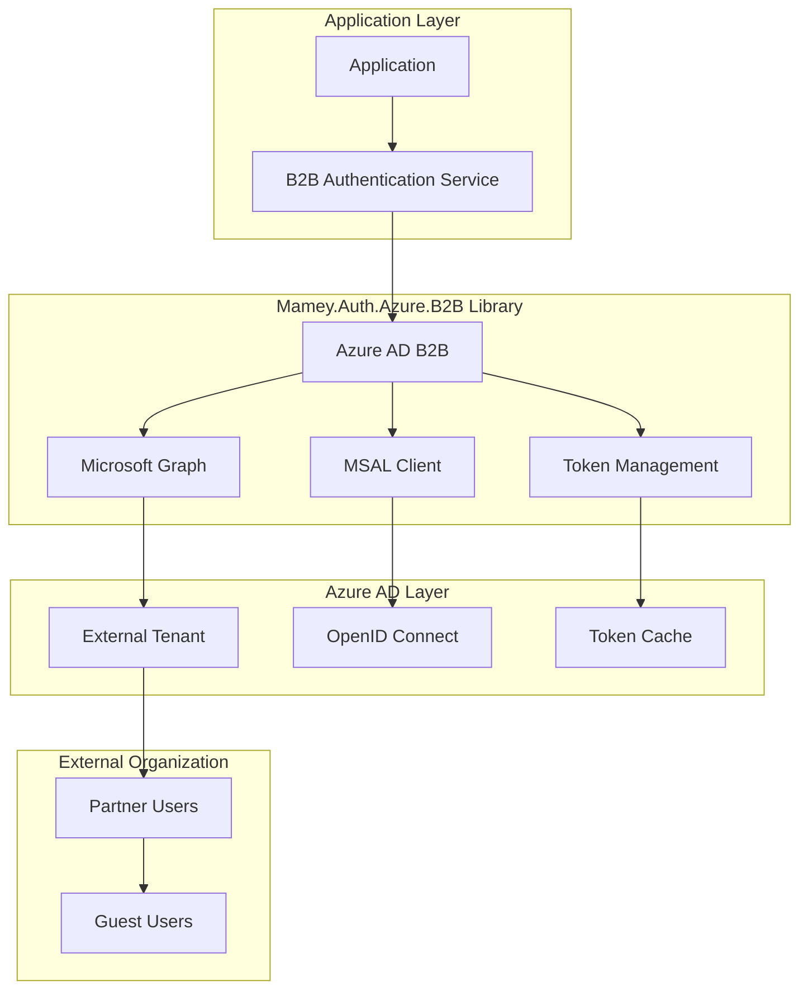
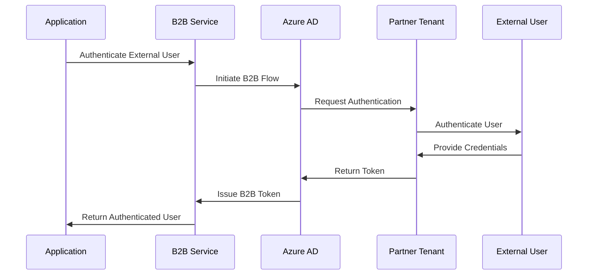

# Mamey.Auth.Azure.B2B

**Library**: `Mamey.Auth.Azure.B2B`  
**Location**: `Mamey/src/Mamey.Auth.Azure.B2B/`  
**Type**: Authentication Library - Azure AD B2B  
**Version**: 2.0.*  
**Files**: 9 C# files  
**Namespace**: `Mamey.Auth.Azure.B2B`

## Overview

Mamey.Auth.Azure.B2B provides comprehensive Azure AD B2B (Business-to-Business) authentication for external organization users in the Mamey framework. It enables secure authentication for partner organizations and external users with seamless cross-tenant authentication flows.

### Conceptual Foundation

**Azure AD B2B** is Microsoft's cloud identity service for business-to-business collaboration. Key concepts:

1. **External User Authentication**: Authenticate users from external organizations
2. **Guest User Management**: Manage guest users and their access
3. **Cross-Tenant Authentication**: Seamless authentication across tenants
4. **Policy-Based Access**: Custom access policies for external users
5. **Consent Framework**: User consent for application access
6. **Security Policies**: Conditional access and security policies

**Why Mamey.Auth.Azure.B2B?**

Provides:
- **External User Authentication**: Authenticate users from external organizations
- **Guest User Management**: Manage guest users and their access
- **Cross-Tenant Authentication**: Seamless authentication across tenants
- **Policy-Based Access**: Custom access policies for external users
- **Multi-Tenant Support**: Support for multi-tenant Azure AD scenarios
- **Microsoft Graph Integration**: Full Microsoft Graph API integration

**Use Cases:**
- Partner organization integration
- Supplier and vendor access
- Business-to-business collaboration
- Cross-organization authentication
- External user access management

## Architecture

### Azure AD B2B Authentication Flow



### Authentication Flow



## Installation

### Prerequisites

1. **.NET 9.0**: Ensure .NET 9.0 SDK is installed
2. **Azure AD Tenant**: Azure AD tenant with B2B enabled
3. **Mamey.Auth.Azure**: Base Azure authentication library

### NuGet Package

```bash
dotnet add package Mamey.Auth.Azure.B2B
```

### Dependencies

- **Mamey** - Core framework
- **Mamey.Auth.Azure** - Base Azure authentication
- **Microsoft.Graph** - Microsoft Graph API
- **Microsoft.Identity.Client** - MSAL library

## Quick Start

### Basic Setup

```csharp
using Mamey.Auth.Azure.B2B;

var builder = WebApplication.CreateBuilder(args);

builder.Services
    .AddMamey()
    .AddB2BAuth(allowAnonymousAccess: true);

var app = builder.Build();
app.Run();
```

### Configuration

Add to `appsettings.json`:

```json
{
  "AzureAd": {
    "B2B": {
      "TenantId": "your-tenant-id",
      "ClientId": "your-client-id",
      "ClientSecret": "your-client-secret",
      "Instance": "https://login.microsoftonline.com/",
      "Domain": "your-domain.onmicrosoft.com"
    }
  }
}
```

## Usage Examples

### Example 1: Authenticate External User

```csharp
using Mamey.Auth.Azure.B2B;

public class B2BAuthenticationService
{
    private readonly IB2BAuthenticationService _b2bService;
    private readonly ILogger<B2BAuthenticationService> _logger;

    public B2BAuthenticationService(
        IB2BAuthenticationService b2bService,
        ILogger<B2BAuthenticationService> logger)
    {
        _b2bService = b2bService;
        _logger = logger;
    }

    public async Task<AuthenticatedUser> AuthenticateExternalUserAsync(
        string email,
        string password)
    {
        try
        {
            _logger.LogInformation("Authenticating external user: {Email}", email);

            var user = await _b2bService.AuthenticateAsync(email, password);

            _logger.LogInformation("External user authenticated: {Email}", email);

            return user;
        }
        catch (Exception ex)
        {
            _logger.LogError(ex, "Failed to authenticate external user: {Email}", email);
            throw;
        }
    }
}
```

### Example 2: Invite External User

```csharp
public async Task<GuestUser> InviteExternalUserAsync(
    string email,
    string organizationName)
{
    try
    {
        _logger.LogInformation("Inviting external user: {Email} from {Organization}", email, organizationName);

        var guestUser = await _b2bService.InviteUserAsync(email, organizationName);

        _logger.LogInformation("External user invited: {Email}", email);

        return guestUser;
    }
    catch (Exception ex)
    {
        _logger.LogError(ex, "Failed to invite external user: {Email}", email);
        throw;
    }
}
```

### Example 3: Get Guest Users

```csharp
public async Task<IEnumerable<GuestUser>> GetGuestUsersAsync()
{
    try
    {
        _logger.LogInformation("Retrieving guest users");

        var guestUsers = await _b2bService.GetGuestUsersAsync();

        _logger.LogInformation("Retrieved {Count} guest users", guestUsers.Count());

        return guestUsers;
    }
    catch (Exception ex)
    {
        _logger.LogError(ex, "Failed to retrieve guest users");
        throw;
    }
}
```

## Best Practices

### 1. Use Policy-Based Access

**✅ Good: Implement custom access policies**
```csharp
builder.Services.AddAuthorization(options =>
{
    options.AddPolicy("ExternalUser", policy =>
        policy.RequireClaim("UserType", "External"));
});
```

### 2. Validate External Users

**✅ Good: Validate external user access**
```csharp
if (!await _b2bService.IsValidExternalUserAsync(email))
{
    throw new UnauthorizedAccessException("Invalid external user");
}
```

### 3. Monitor Guest User Access

**✅ Good: Monitor and log guest user access**
```csharp
_logger.LogInformation("Guest user {Email} accessed resource {Resource}", email, resource);
```

## Related Libraries

- **Mamey.Auth.Azure**: Base Azure authentication
- **Mamey.Auth.Azure.B2B.BlazorWasm**: Blazor client for B2B
- **Mamey.BlazorWasm**: Blazor WebAssembly support

## Additional Resources

- [Azure AD B2B Documentation](https://docs.microsoft.com/azure/active-directory/external-identities/)
- [B2B Collaboration](https://docs.microsoft.com/azure/active-directory/external-identities/what-is-b2b)
- [Mamey Framework Documentation](../../documentation/)
- [Mamey.Auth.Azure.B2B Memory Documentation](../../.skmemory/v1/memory/public/mid-term/libraries/auth/mamey-auth-azure-b2b.md)

## Tags

#azure #b2b #authentication #external-users #microsoft-graph #mamey

