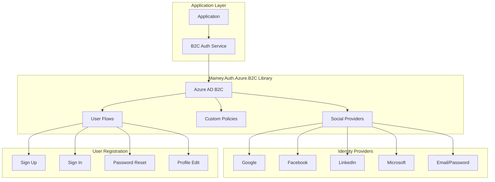
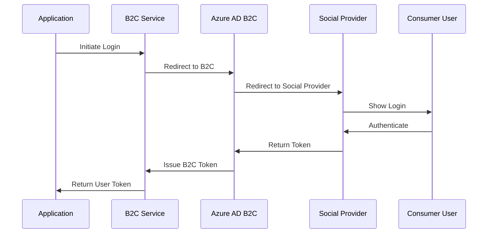

# Mamey.Auth.Azure.B2C

**Library**: `Mamey.Auth.Azure.B2C`  
**Location**: `Mamey/src/Mamey.Auth.Azure.B2C/`  
**Type**: Authentication Library - Azure AD B2C  
**Version**: 2.0.*  
**Files**: 6 C# files  
**Namespace**: `Mamey.Auth.Azure.B2C`

## Overview

Mamey.Auth.Azure.B2C provides comprehensive Azure AD B2C (Business-to-Consumer) authentication for customer-facing applications in the Mamey framework. It enables secure authentication for consumers with social login support and custom authentication policies.

### Conceptual Foundation

**Azure AD B2C** is Microsoft's cloud identity service for consumer-facing applications. Key concepts:

1. **Consumer Authentication**: Customer-facing authentication
2. **Social Login**: Support for social identity providers (Google, Facebook, LinkedIn, etc.)
3. **Custom Policies**: Custom authentication and authorization policies
4. **User Registration**: Self-service user registration
5. **User Flows**: Pre-built authentication experiences for common scenarios
6. **Multi-Factor Authentication**: Enhanced security for consumer applications

**Why Mamey.Auth.Azure.B2C?**

Provides:
- **Consumer Authentication**: Customer-facing authentication
- **Social Login**: Support for social identity providers
- **Custom Policies**: Custom authentication and authorization policies
- **User Registration**: Self-service user registration
- **Multi-Factor Authentication**: Enhanced security
- **Scalability**: High-volume consumer authentication support

**Use Cases:**
- Customer-facing applications
- E-commerce platforms
- Mobile applications for consumers
- Public-facing web applications
- High-volume consumer authentication

## Architecture

### Azure AD B2C Authentication Flow



### Authentication Flow



## Installation

### Prerequisites

1. **.NET 9.0**: Ensure .NET 9.0 SDK is installed
2. **Azure AD B2C Tenant**: Azure AD B2C tenant configured
3. **Mamey.Auth.Azure**: Base Azure authentication library

### NuGet Package

```bash
dotnet add package Mamey.Auth.Azure.B2C
```

### Dependencies

- **Mamey** - Core framework
- **Mamey.Auth.Azure** - Base Azure authentication
- **Microsoft.Identity.Web** - Microsoft Identity Web library

## Quick Start

### Basic Setup

```csharp
using Mamey.Auth.Azure.B2C;

var builder = WebApplication.CreateBuilder(args);

builder.Services
    .AddMamey()
    .AddB2CAuth(options =>
    {
        options.TenantId = "your-tenant-id";
        options.ClientId = "your-client-id";
        options.SignUpSignInPolicyId = "B2C_1_SignUpSignIn";
        options.Instance = "https://{tenant-name}.b2clogin.com";
        options.Domain = "{tenant-name}.onmicrosoft.com";
    });

var app = builder.Build();
app.Run();
```

### Configuration

Add to `appsettings.json`:

```json
{
  "AzureAd": {
    "B2C": {
      "TenantId": "your-tenant-id",
      "ClientId": "your-client-id",
      "SignUpSignInPolicyId": "B2C_1_SignUpSignIn",
      "Instance": "https://{tenant-name}.b2clogin.com",
      "Domain": "{tenant-name}.onmicrosoft.com"
    }
  }
}
```

## Usage Examples

### Example 1: Sign Up Consumer User

```csharp
using Mamey.Auth.Azure.B2C;

public class B2CAuthenticationService
{
    private readonly IB2CAuthenticationService _b2cService;
    private readonly ILogger<B2CAuthenticationService> _logger;

    public B2CAuthenticationService(
        IB2CAuthenticationService b2cService,
        ILogger<B2CAuthenticationService> logger)
    {
        _b2cService = b2cService;
        _logger = logger;
    }

    public async Task<AuthenticatedUser> SignUpConsumerAsync(
        string email,
        string password,
        string firstName,
        string lastName)
    {
        try
        {
            _logger.LogInformation("Signing up consumer: {Email}", email);

            var user = await _b2cService.SignUpAsync(
                email,
                password,
                firstName,
                lastName);

            _logger.LogInformation("Consumer signed up: {Email}", email);

            return user;
        }
        catch (Exception ex)
        {
            _logger.LogError(ex, "Failed to sign up consumer: {Email}", email);
            throw;
        }
    }
}
```

### Example 2: Sign In with Social Provider

```csharp
public async Task<AuthenticatedUser> SignInWithSocialProviderAsync(
    string provider)
{
    try
    {
        _logger.LogInformation("Signing in with social provider: {Provider}", provider);

        var user = await _b2cService.SignInWithProviderAsync(provider);

        _logger.LogInformation("User signed in with provider: {Provider}", provider);

        return user;
    }
    catch (Exception ex)
    {
        _logger.LogError(ex, "Failed to sign in with provider: {Provider}", provider);
        throw;
    }
}
```

### Example 3: Password Reset

```csharp
public async Task ResetPasswordAsync(string email)
{
    try
    {
        _logger.LogInformation("Initiating password reset: {Email}", email);

        await _b2cService.InitiatePasswordResetAsync(email);

        _logger.LogInformation("Password reset initiated: {Email}", email);
    }
    catch (Exception ex)
    {
        _logger.LogError(ex, "Failed to reset password: {Email}", email);
        throw;
    }
}
```

## Related Libraries

- **Mamey.Auth.Azure**: Base Azure authentication
- **Mamey.BlazorWasm**: Blazor client support
- **Mamey.Auth.Azure.B2B**: B2B authentication

## Additional Resources

- [Azure AD B2C Documentation](https://docs.microsoft.com/azure/active-directory-b2c/)
- [B2C User Flows](https://docs.microsoft.com/azure/active-directory-b2c/user-flow-overview)
- [B2C Custom Policies](https://docs.microsoft.com/azure/active-directory-b2c/custom-policy-overview)
- [Mamey Framework Documentation](../../documentation/)
- [Mamey.Auth.Azure.B2C Memory Documentation](../../.skmemory/v1/memory/public/mid-term/libraries/auth/mamey-auth-azure-b2c.md)

## Tags

#azure #b2c #authentication #consumer #social-login #mamey

