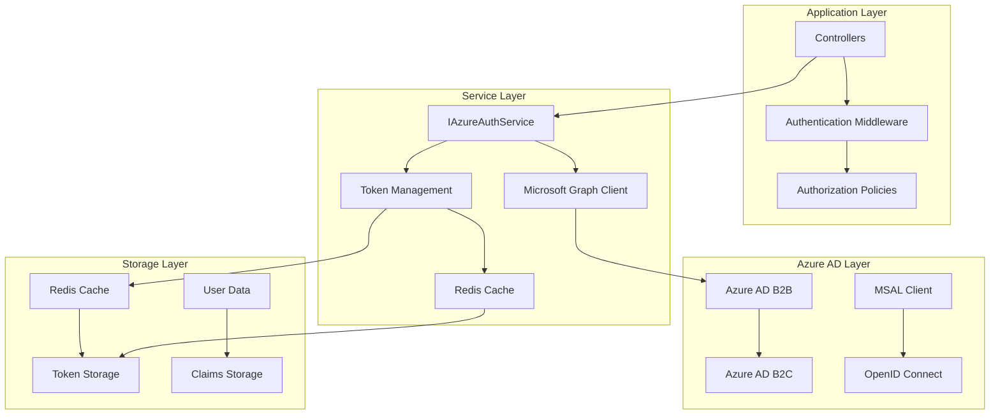

# Mamey.Auth.Azure

The Mamey.Auth.Azure library provides comprehensive Azure Active Directory (Azure AD) authentication and authorization capabilities for the Mamey framework. It supports both Azure AD B2B (Business-to-Business) and B2C (Business-to-Consumer) authentication scenarios with Microsoft Graph integration.

## Technical Overview

Mamey.Auth.Azure is a specialized authentication library that provides:

- **Azure AD Integration**: Complete Azure Active Directory authentication support
- **B2B Authentication**: Business-to-business authentication with external organizations
- **B2C Authentication**: Business-to-consumer authentication for customer-facing applications
- **Microsoft Graph Integration**: Full Microsoft Graph API integration for user management
- **Token Management**: Advanced token acquisition, validation, and caching
- **Redis Caching**: Distributed token caching with Redis
- **Multi-Tenant Support**: Support for multi-tenant Azure AD scenarios
- **Policy-Based Authentication**: Custom authentication policies and flows

## Architecture

The library provides a layered architecture for Azure authentication:



## Core Components

### Azure Authentication Services
- **IAzureAuthService**: Core interface for Azure authentication operations
- **B2BAuthenticationService**: B2B authentication service implementation
- **B2CAuthenticationService**: B2C authentication service implementation
- **Token Management**: Advanced token acquisition and validation

### Microsoft Graph Integration
- **GraphServiceClient**: Microsoft Graph API client
- **User Management**: Complete user lifecycle management
- **Group Management**: Group membership and management
- **Claims Management**: User claims and attributes

### Configuration
- **AzureOptions**: Base Azure configuration options
- **AzureB2BOptions**: B2B-specific configuration
- **AzureB2COptions**: B2C-specific configuration
- **GraphOptions**: Microsoft Graph configuration

### Caching
- **IRedisTokenCache**: Redis token cache interface
- **RedisTokenCache**: Redis token cache implementation
- **Token Caching**: Distributed token caching

## Installation

### NuGet Package
```bash
dotnet add package Mamey.Auth.Azure
```

### Prerequisites
- .NET 9.0 or later
- Mamey (core framework)
- Mamey.Auth (authentication abstractions)
- Mamey.Persistence.Redis (for Redis caching)
- Azure AD tenant
- Microsoft Graph API access

## Key Features

### Azure AD B2B Features

- **External User Authentication**: Authenticate users from external organizations
- **Guest User Management**: Manage guest users and their access
- **Cross-Tenant Authentication**: Seamless authentication across tenants
- **Policy-Based Access**: Custom access policies for external users
- **User Invitation**: Invite external users to your organization
- **Group Management**: Manage external user group memberships

### Azure AD B2C Features

- **Consumer Authentication**: Customer-facing authentication
- **Social Identity Providers**: Support for social login providers
- **Custom Policies**: Custom authentication and authorization policies
- **User Registration**: Self-service user registration
- **Password Reset**: Self-service password reset
- **Profile Management**: User profile management

### Microsoft Graph Features

- **User Management**: Complete user lifecycle management
- **Group Management**: Group creation and management
- **Claims Management**: User claims and attributes
- **Directory Operations**: Directory-level operations
- **Application Management**: Application registration and management

### Token Management Features

- **Token Acquisition**: Acquire access tokens for various scopes
- **Token Validation**: Validate ID tokens and access tokens
- **Token Refresh**: Refresh expired tokens
- **Token Caching**: Distributed token caching with Redis
- **Token Revocation**: Revoke tokens when needed

## Quick Start

### Basic Setup

```csharp
using Mamey.Auth.Azure;

// Register Azure authentication coordinator
builder.Services.AddMamey()
    .AddAzure();

// Use Azure authentication
app.UseMamey()
    .UseAzure();
```

### Multi-Authentication Coordination

`Mamey.Auth.Azure` now acts as a coordinator for Azure authentication methods (B2B, B2C, Azure AD). It uses registry names and distinct scheme names to prevent collisions.

**Registry Name**: `"auth.azure"`

**Scheme Names**:
- Azure AD: `"AzureAD"` (default)
- Azure B2B: `"AzureB2B"` (default)
- Azure B2C: `"AzureB2C"` (default)

### Azure Multi-Authentication Configuration

#### Basic Configuration

```json
{
  "azure": {
    "enableAzure": false,
    "enableAzureB2B": true,
    "enableAzureB2C": false,
    "policy": "B2BOnly",
    "azureScheme": "AzureAD",
    "azureB2BScheme": "AzureB2B",
    "azureB2CScheme": "AzureB2C",
    "azureSectionName": "azure",
    "azureB2BSectionName": "azure:b2b",
    "azureB2CSectionName": "azure:b2c"
  },
  "azure:b2b": {
    "enabled": true,
    "tenantId": "your-tenant-id",
    "clientId": "your-client-id",
    "clientSecret": "your-client-secret",
    "instance": "https://login.microsoftonline.com/",
    "domain": "your-domain.com",
    "callbackPath": "/signin-oidc",
    "signedOutCallbackPath": "/signout-callback-oidc"
  }
}
```

#### B2C Configuration

```json
{
  "azure": {
    "enableAzure": false,
    "enableAzureB2B": false,
    "enableAzureB2C": true,
    "policy": "B2COnly",
    "azureB2CScheme": "AzureB2C"
  },
  "azure:b2c": {
    "enabled": true,
    "tenantId": "your-tenant-id",
    "clientId": "your-client-id",
    "clientSecret": "your-client-secret",
    "instance": "https://your-tenant.b2clogin.com",
    "domain": "your-tenant.onmicrosoft.com",
    "callbackPath": "/signin-oidc",
    "signedOutCallbackPath": "/signout-callback-oidc",
    "signUpSignInPolicyId": "B2C_1_signup_signin",
    "resetPasswordPolicyId": "B2C_1_reset",
    "editProfilePolicyId": "B2C_1_edit_profile"
  }
}
```

#### Multiple Azure Methods (EitherOr Policy)

```json
{
  "azure": {
    "enableAzure": true,
    "enableAzureB2B": true,
    "enableAzureB2C": true,
    "policy": "EitherOr",
    "azureScheme": "AzureAD",
    "azureB2BScheme": "AzureB2B",
    "azureB2CScheme": "AzureB2C"
  },
  "azure:b2b": {
    "enabled": true,
    "tenantId": "your-tenant-id",
    "clientId": "your-client-id",
    "clientSecret": "your-client-secret"
  },
  "azure:b2c": {
    "enabled": true,
    "tenantId": "your-tenant-id",
    "clientId": "your-client-id",
    "clientSecret": "your-client-secret",
    "signUpSignInPolicyId": "B2C_1_signup_signin"
  }
}
```

### B2B Authentication Setup

```csharp
using Mamey.Auth.Azure.B2B;

// Register B2B authentication with scheme name
builder.Services.AddMamey()
    .AddAzureB2B("azure:b2b", "AzureB2B", allowAnonymousAccess: true);

// Use B2B authentication
app.UseMamey()
    .UseB2BAuth();
```

### B2C Authentication Setup

```csharp
using Mamey.Auth.Azure.B2C;

// Register B2C authentication with scheme name
builder.Services.AddMamey()
    .AddAzureB2C("azure:b2c", "AzureB2C", allowAnonymousAccess: true);

// Use B2C authentication
app.UseMamey()
    .UseB2CAuth();
```

### Integration with Mamey.Auth.Multi

When using `Mamey.Auth.Multi`, Azure authentication is automatically coordinated:

```csharp
using Mamey.Auth.Multi;

// Register multi-authentication (includes Azure coordination)
builder.Services.AddMamey()
    .AddMultiAuth();

// Use multi-authentication
app.UseMamey()
    .UseMultiAuth();
```

The `Mamey.Auth.Multi` library delegates Azure authentication to `Mamey.Auth.Azure` coordinator, which handles B2B, B2C, and Azure AD internally.

**Configuration Example**:
```json
{
  "multiAuth": {
    "enableAzure": true,
    "policy": "AzureOnly",
    "azureSectionName": "azure"
  },
  "azure": {
    "enableAzure": false,
    "enableAzureB2B": false,
    "enableAzureB2C": true,
    "policy": "B2COnly",
    "azureB2CScheme": "AzureB2C"
  },
  "azure:b2c": {
    "enabled": true,
    "tenantId": "your-tenant-id",
    "clientId": "your-client-id",
    "clientSecret": "your-client-secret",
    "instance": "https://your-tenant.b2clogin.com",
    "domain": "your-tenant.onmicrosoft.com",
    "signUpSignInPolicyId": "B2C_1_signup_signin"
  }
}
```

**How It Works**:
1. `Mamey.Auth.Multi` reads `multiAuth.enableAzure = true`
2. `Mamey.Auth.Multi` calls `Mamey.Auth.Azure.AddAzure("azure")`
3. `Mamey.Auth.Azure` checks its registry (`"auth.azure"`) and registers if not already registered
4. `Mamey.Auth.Azure` reads `AzureMultiAuthOptions` from `"azure"` section
5. `Mamey.Auth.Azure` conditionally calls `AddAzureB2B()` or `AddAzureB2C()` based on options
6. B2B/B2C libraries check their registries before registering
7. No collisions occur because each library uses its own registry name

## API Reference

### Core Interfaces

#### IAzureAuthService

Interface for Azure authentication operations.

```csharp
public interface IAzureAuthService
{
    Task<string> AcquireTokenAsync(string[] scopes);
    Task<bool> VerifyUserActionAsync(string userId, string token);
    Task<bool> ValidateIdTokenAsync(string idToken);
    Task<string> RefreshAccessTokenAsync(string refreshToken);
    Task<bool> DeleteUserAsync(string userId);
    Task<User?> UpdateUserAsync(string userId, User updatedUser);
    Task<bool> DisableUserAsync(string userId);
    Task<bool> EnableUserAsync(string userId);
    Task<Dictionary<string, string>> GetUserClaimsAsync(string userId);
    Task<bool> SetUserClaimsAsync(string userId, Dictionary<string, string> claims);
    Task<bool> AddUserToGroupAsync(string userId, string groupId);
    Task<bool> RemoveUserFromGroupAsync(string userId, string groupId);
    Task<bool> LogoutUserAsync(string userId);
    Task<List<string>> ListGroupsForUserAsync(string userId);
    Task<UserCollectionResponse> SearchUsersAsync(string query);
    Task<bool> ForcePasswordChangeAsync(string userId);
    Task<bool> LockUserAccountAsync(string userId);
    Task<bool> InviteUserAsync(string email, string displayName);
    Task<string> GenerateSignInUrlAsync(string redirectUrl, string state, string nonce);
    Task<bool> ValidateConfigurationAsync();
}
```

### Core Classes

#### AzureOptions

Base Azure configuration options.

```csharp
public class AzureOptions
{
    public bool Enabled { get; set; }
    public string? Type { get; set; }
    public string? Auth { get; set; }
    public string? Instance { get; set; }
    public string? TenantId { get; set; }
    public string? Domain { get; set; }
    public string? ClientId { get; set; }
    public string? ClientSecret { get; set; }
    public string? Authority { get; set; }
    public string? Scopes { get; set; }
    public string? CallbackPath { get; set; }
    public AzureB2BOptions AzureB2BOptions { get; set; }
    public AzureB2COptions AzureB2COptions { get; set; }
    public DownstreamApi DownstreamApi { get; set; }
    public GraphOptions GraphOptions { get; set; }
}
```

#### AzureB2BOptions

B2B-specific configuration options.

```csharp
public class AzureB2BOptions : AzureOptions
{
    public string? SignedOutCallbackPath { get; set; }
    public string? SignInPolicyId { get; set; }
    public string? SignOutPolicyId { get; set; }
}
```

#### AzureB2COptions

B2C-specific configuration options.

```csharp
public class AzureB2COptions : AzureOptions
{
    public bool Enabled { get; set; } = false;
    public string? RedirectUri { get; set; }
    public string SignedOutCallbackPath { get; set; }
    public string SignUpSignInPolicyId { get; set; }
    public string ResetPasswordPolicyId { get; set; }
    public string EditProfilePolicyId { get; set; }
}
```

#### AzureMultiAuthOptions

Azure multi-authentication coordination options.

```csharp
public class AzureMultiAuthOptions
{
    public bool EnableAzure { get; set; } = false;
    public bool EnableAzureB2B { get; set; } = false;
    public bool EnableAzureB2C { get; set; } = false;
    public AzureAuthenticationPolicy Policy { get; set; } = AzureAuthenticationPolicy.EitherOr;
    public string AzureScheme { get; set; } = "AzureAD";
    public string AzureB2BScheme { get; set; } = "AzureB2B";
    public string AzureB2CScheme { get; set; } = "AzureB2C";
    public string AzureSectionName { get; set; } = "azure";
    public string AzureB2BSectionName { get; set; } = "azure:b2b";
    public string AzureB2CSectionName { get; set; } = "azure:b2c";
}
```

#### AzureAuthenticationPolicy Enum

```csharp
public enum AzureAuthenticationPolicy
{
    AzureOnly,
    B2BOnly,
    B2COnly,
    EitherOr,
    AllRequired
}
```

## Usage Examples

### Example 1: Basic Azure Authentication

```csharp
using Mamey.Auth.Azure;

public class AuthController : ControllerBase
{
    private readonly IAzureAuthService _azureAuthService;

    public AuthController(IAzureAuthService azureAuthService)
    {
        _azureAuthService = azureAuthService;
    }

    [HttpGet("profile")]
    [Authorize]
    public async Task<IActionResult> GetProfile()
    {
        try
        {
            // Get user information from claims
            var userId = User.FindFirst(ClaimTypes.NameIdentifier)?.Value;
            if (string.IsNullOrEmpty(userId))
            {
                return Unauthorized();
            }

            // Get user details from Microsoft Graph
            var user = await _azureAuthService.GetUserByIdAsync(userId);
            if (user == null)
            {
                return NotFound();
            }

            return Ok(new
            {
                Id = user.Id,
                DisplayName = user.DisplayName,
                Email = user.UserPrincipalName,
                Created = user.CreatedDateTime
            });
        }
        catch (Exception ex)
        {
            return StatusCode(500, new { Error = ex.Message });
        }
    }
}
```

### Example 2: B2B User Management

```csharp
using Mamey.Auth.Azure.B2B;

public class B2BUserController : ControllerBase
{
    private readonly IAzureAuthService _azureAuthService;

    public B2BUserController(IAzureAuthService azureAuthService)
    {
        _azureAuthService = azureAuthService;
    }

    [HttpPost("invite")]
    [Authorize(Roles = "Admin")]
    public async Task<IActionResult> InviteUser([FromBody] InviteUserRequest request)
    {
        try
        {
            var success = await _azureAuthService.InviteUserAsync(request.Email, request.DisplayName);
            if (success)
            {
                return Ok(new { Message = "User invitation sent successfully" });
            }
            return BadRequest(new { Error = "Failed to send user invitation" });
        }
        catch (Exception ex)
        {
            return StatusCode(500, new { Error = ex.Message });
        }
    }

    [HttpGet("users")]
    [Authorize(Roles = "Admin")]
    public async Task<IActionResult> GetUsers()
    {
        try
        {
            var users = await _azureAuthService.GetUsersAsync();
            return Ok(users);
        }
        catch (Exception ex)
        {
            return StatusCode(500, new { Error = ex.Message });
        }
    }
}
```

### Example 3: B2C User Registration

```csharp
using Mamey.Auth.Azure.B2C;

public class B2CUserController : ControllerBase
{
    private readonly IAzureAuthService _azureAuthService;

    public B2CUserController(IAzureAuthService azureAuthService)
    {
        _azureAuthService = azureAuthService;
    }

    [HttpPost("register")]
    public async Task<IActionResult> RegisterUser([FromBody] RegisterUserRequest request)
    {
        try
        {
            var user = new User
            {
                DisplayName = request.DisplayName,
                UserPrincipalName = request.Email,
                AccountEnabled = true,
                PasswordProfile = new PasswordProfile
                {
                    ForceChangePasswordNextSignIn = true,
                    Password = request.Password
                }
            };

            var createdUser = await _azureAuthService.CreateUserAsync(user);
            return Ok(new
            {
                Id = createdUser.Id,
                DisplayName = createdUser.DisplayName,
                Email = createdUser.UserPrincipalName
            });
        }
        catch (Exception ex)
        {
            return StatusCode(500, new { Error = ex.Message });
        }
    }

    [HttpPost("reset-password")]
    public async Task<IActionResult> ResetPassword([FromBody] ResetPasswordRequest request)
    {
        try
        {
            var resetUrl = await _azureAuthService.InitiatePasswordResetAsync(request.UserId);
            return Ok(new { ResetUrl = resetUrl });
        }
        catch (Exception ex)
        {
            return StatusCode(500, new { Error = ex.Message });
        }
    }
}
```

### Example 4: Token Management

```csharp
using Mamey.Auth.Azure;

public class TokenController : ControllerBase
{
    private readonly IAzureAuthService _azureAuthService;

    public TokenController(IAzureAuthService azureAuthService)
    {
        _azureAuthService = azureAuthService;
    }

    [HttpPost("acquire-token")]
    public async Task<IActionResult> AcquireToken([FromBody] AcquireTokenRequest request)
    {
        try
        {
            var scopes = request.Scopes ?? new[] { "https://graph.microsoft.com/.default" };
            var token = await _azureAuthService.AcquireTokenAsync(scopes);
            
            return Ok(new { AccessToken = token });
        }
        catch (Exception ex)
        {
            return StatusCode(500, new { Error = ex.Message });
        }
    }

    [HttpPost("validate-token")]
    public async Task<IActionResult> ValidateToken([FromBody] ValidateTokenRequest request)
    {
        try
        {
            var isValid = await _azureAuthService.ValidateIdTokenAsync(request.IdToken);
            return Ok(new { IsValid = isValid });
        }
        catch (Exception ex)
        {
            return StatusCode(500, new { Error = ex.Message });
        }
    }

    [HttpPost("refresh-token")]
    public async Task<IActionResult> RefreshToken([FromBody] RefreshTokenRequest request)
    {
        try
        {
            var newToken = await _azureAuthService.RefreshAccessTokenAsync(request.RefreshToken);
            return Ok(new { AccessToken = newToken });
        }
        catch (Exception ex)
        {
            return StatusCode(500, new { Error = ex.Message });
        }
    }
}
```

## Integration Patterns

### Integration with ASP.NET Core

```csharp
// Program.cs
var builder = WebApplication.CreateBuilder(args);

// Add Mamey with Azure authentication
builder.Services.AddMamey()
    .AddAzureAuthentication();

var app = builder.Build();

// Use Azure authentication
app.UseMamey()
    .UseAzureAuthentication();

app.Run();
```

### Integration with Microsoft Graph

```csharp
public class GraphService
{
    private readonly GraphServiceClient _graphClient;
    private readonly IAzureAuthService _azureAuthService;

    public GraphService(GraphServiceClient graphClient, IAzureAuthService azureAuthService)
    {
        _graphClient = graphClient;
        _azureAuthService = azureAuthService;
    }

    public async Task<List<User>> GetUsersAsync()
    {
        var users = await _graphClient.Users.GetAsync();
        return users?.Value ?? new List<User>();
    }

    public async Task<User> CreateUserAsync(User user)
    {
        return await _graphClient.Users.PostAsync(user);
    }
}
```

## Configuration Reference

### Azure Multi-Authentication Configuration

```json
{
  "azure": {
    "enableAzure": false,
    "enableAzureB2B": true,
    "enableAzureB2C": false,
    "policy": "B2BOnly",
    "azureScheme": "AzureAD",
    "azureB2BScheme": "AzureB2B",
    "azureB2CScheme": "AzureB2C",
    "azureSectionName": "azure",
    "azureB2BSectionName": "azure:b2b",
    "azureB2CSectionName": "azure:b2c"
  },
  "azure:b2b": {
    "enabled": true,
    "instance": "https://login.microsoftonline.com/",
    "tenantId": "your-tenant-id",
    "domain": "your-domain.com",
    "clientId": "your-client-id",
    "clientSecret": "your-client-secret",
    "authority": "https://login.microsoftonline.com/your-tenant-id",
    "scopes": "https://graph.microsoft.com/.default",
    "callbackPath": "/signin-oidc",
    "signedOutCallbackPath": "/signout-callback-oidc",
    "signInPolicyId": "B2C_1_signin",
    "signOutPolicyId": "B2C_1_signout"
  },
  "azure:b2c": {
    "enabled": false,
    "redirectUri": "https://your-app.com/signin-oidc",
    "signedOutCallbackPath": "/signout-callback-oidc",
    "signUpSignInPolicyId": "B2C_1_signup_signin",
    "resetPasswordPolicyId": "B2C_1_reset",
    "editProfilePolicyId": "B2C_1_edit_profile"
  }
}
```

### Azure Authentication Policies

The `AzureAuthenticationPolicy` enum defines how multiple Azure authentication methods are handled:

- **AzureOnly**: Only Azure AD authentication is allowed
- **B2BOnly**: Only Azure AD B2B authentication is allowed
- **B2COnly**: Only Azure AD B2C authentication is allowed
- **EitherOr**: Try Azure AD first, then B2B, then B2C if previous fails (default)
- **AllRequired**: All enabled Azure methods are required (rare use case)

#### Policy Examples

**B2BOnly Policy**:
```json
{
  "azure": {
    "enableAzureB2B": true,
    "policy": "B2BOnly"
  }
}
```

**B2COnly Policy**:
```json
{
  "azure": {
    "enableAzureB2C": true,
    "policy": "B2COnly"
  }
}
```

**EitherOr Policy** (tries in order):
```json
{
  "azure": {
    "enableAzure": true,
    "enableAzureB2B": true,
    "enableAzureB2C": true,
    "policy": "EitherOr"
  }
}
```

## Collision Prevention Strategy

### Registry Names

Each Azure authentication library uses a unique registry name to prevent duplicate registrations. The `TryRegister()` method checks if a library has already been registered and prevents duplicate registrations.

**Registry Name Hierarchy**:
- `Mamey.Auth.Azure`: `"auth.azure"` (Azure coordinator)
- `Mamey.Auth.Azure.B2B`: `"auth.azure.b2b"` (B2B library)
- `Mamey.Auth.Azure.B2C`: `"auth.azure.b2c"` (B2C library)

### Scheme Names

Each Azure authentication method uses a distinct scheme name to prevent conflicts in the authentication pipeline. Scheme names are configurable to allow customization.

**Default Scheme Names**:
- Azure AD: `"AzureAD"` (default)
- Azure B2B: `"AzureB2B"` (default)
- Azure B2C: `"AzureB2C"` (default)

### Coordination Logic

The collision prevention works through a hierarchical coordination system:

1. **Azure Coordinator Level**: `Mamey.Auth.Azure` checks its registry (`"auth.azure"`) before registering
2. **B2B/B2C Level**: When B2B or B2C is enabled, the coordinator calls the respective library, which:
   - Checks its own registry (`"auth.azure.b2b"` or `"auth.azure.b2c"`)
   - Registers only if not already registered
3. **Multi-Auth Level**: When `Mamey.Auth.Multi` enables Azure authentication, it calls `Mamey.Auth.Azure.AddAzure()`, which:
   - Checks its own registry (`"auth.azure"`)
   - Conditionally registers B2B or B2C based on `AzureMultiAuthOptions`
   - B2B and B2C libraries check their own registries before registering

This multi-level registry system ensures that:
- No duplicate registrations occur
- Libraries can be safely called multiple times
- Coordination between libraries is explicit and controlled

### Example: Collision Prevention in Action

```csharp
// This is safe - TryRegister() prevents duplicates
builder.Services.AddMamey()
    .AddAzure()      // Registers with "auth.azure"
    .AddAzure();     // Returns immediately - already registered

// This is also safe - B2B library checks its registry
builder.Services.AddMamey()
    .AddAzureB2B()   // Registers with "auth.azure.b2b"
    .AddAzureB2B();  // Returns immediately - already registered

// This is safe - Multi delegates to Azure, which checks its registry
builder.Services.AddMamey()
    .AddMultiAuth()  // Registers with "auth.multi", calls AddAzure()
    .AddAzure();     // Returns immediately - Azure already registered by Multi
```

### Configuration for Collision Prevention

When using multiple authentication methods, ensure distinct scheme names:

```json
{
  "azure": {
    "enableAzure": false,
    "enableAzureB2B": true,
    "enableAzureB2C": true,
    "policy": "EitherOr",
    "azureScheme": "AzureAD",
    "azureB2BScheme": "AzureB2B",
    "azureB2CScheme": "AzureB2C"
  }
}
```

### Redis Configuration

```json
{
  "redis": {
    "connectionString": "localhost:6379",
    "database": 0
  }
}
```

## Best Practices

1. **Use Registry Names**: Always use `TryRegister()` with unique registry names to prevent collisions
2. **Configure Scheme Names**: Use distinct scheme names for each Azure authentication method
3. **Use Policies Wisely**: Choose the appropriate policy for your use case (B2BOnly, B2COnly, EitherOr, etc.)
4. **Enable Only What You Need**: Only enable Azure authentication methods you actually use
5. **Secure Configuration**: Store sensitive configuration in Azure Key Vault
6. **Token Caching**: Use Redis for distributed token caching
7. **Error Handling**: Implement comprehensive error handling
8. **Logging**: Add detailed logging for debugging and monitoring
9. **User Management**: Implement proper user lifecycle management
10. **Security**: Follow Azure AD security best practices
11. **Performance**: Use token caching to improve performance
12. **Testing**: Write comprehensive unit and integration tests
13. **Monitoring**: Monitor authentication events and failures
14. **Documentation**: Document custom policies and configurations
15. **Test Collision Prevention**: Verify that duplicate registrations don't cause issues

## Troubleshooting

### Common Issues

**Authentication Fails**: Check Azure AD configuration and permissions
**Token Validation Fails**: Verify token validation parameters
**Graph API Errors**: Check Microsoft Graph permissions and scopes
**Redis Connection**: Ensure Redis is accessible and configured correctly
**User Management Issues**: Verify user permissions and group memberships

### Debugging

Enable detailed logging to troubleshoot issues:

```csharp
builder.Logging.AddConsole();
builder.Logging.SetMinimumLevel(LogLevel.Debug);
```

## Related Libraries

- [Mamey.Auth](auth.md) - Core authentication library
- [Mamey.Auth.Abstractions](auth-abstractions.md) - Authentication abstractions
- [Mamey.Auth.Multi](../Mamey.Auth.Multi/README.md) - Multi-authentication coordinator
- [Mamey.Auth.Azure.B2B](../Mamey.Auth.Azure.B2B/README.md) - Azure B2B authentication
- [Mamey.Auth.Azure.B2C](../Mamey.Auth.Azure.B2C/README.md) - Azure B2C authentication
- [Mamey.Persistence.Redis](persistence-redis.md) - Redis persistence library

## Additional Resources

- [Azure AD Authentication Guide](../guides/azure-ad-authentication.md)
- [Microsoft Graph Integration Guide](../guides/microsoft-graph-integration.md)
- [B2B Authentication Guide](../guides/b2b-authentication.md)
- [B2C Authentication Guide](../guides/b2c-authentication.md)
