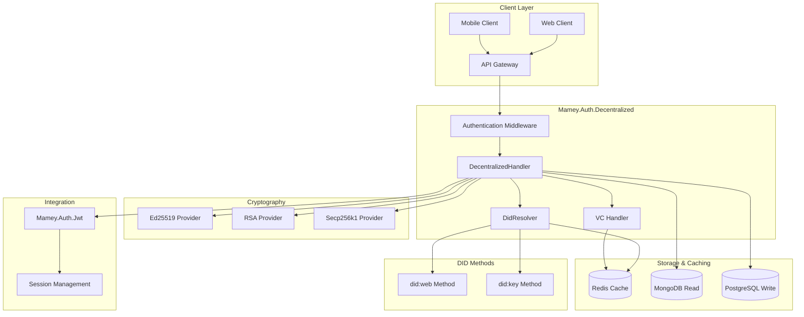
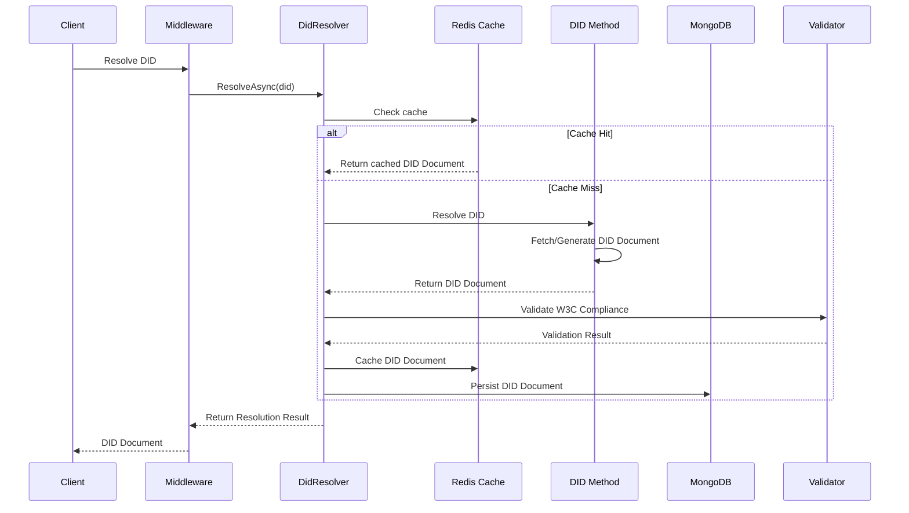
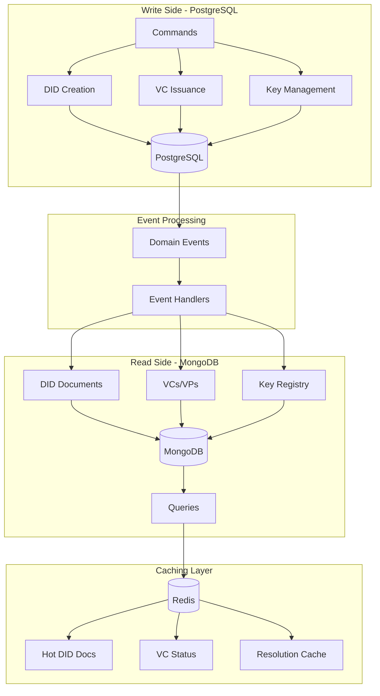

# Mamey.Auth.Decentralized

A comprehensive W3C DID 1.1 compliant authentication library for the Mamey Framework, providing decentralized identity management with support for multiple DID methods, Verifiable Credentials, and seamless integration with JWT authentication.

## Table of Contents

- [Overview](#overview)
- [Architecture](#architecture)
- [Features](#features)
- [Installation](#installation)
- [Quick Start](#quick-start)
- [Core Components](#core-components)
- [DID Methods](#did-methods)
- [Verifiable Credentials](#verifiable-credentials)
- [API Reference](#api-reference)
- [Configuration](#configuration)
- [Examples](#examples)
- [Best Practices](#best-practices)
- [Troubleshooting](#troubleshooting)

## Overview

Mamey.Auth.Decentralized is a powerful library that implements the W3C Decentralized Identifiers (DID) 1.1 specification, providing a complete solution for decentralized identity management. It supports multiple DID methods, cryptographic algorithms, and Verifiable Credentials while maintaining seamless integration with the existing Mamey Framework authentication system.

### Key Benefits

- **W3C Compliant**: Full compliance with W3C DID 1.1 specification
- **Multiple DID Methods**: Support for `did:web` and `did:key` with pluggable architecture
- **Cryptographic Flexibility**: Ed25519, RSA, and Secp256k1 support
- **Dual Persistence**: PostgreSQL write + MongoDB read with Redis caching
- **JWT Integration**: Seamless integration with Mamey.Auth.Jwt
- **Verifiable Credentials**: Full VC-JWT and VC JSON-LD support
- **High Performance**: Optimized for enterprise-scale applications

## Architecture

### High-Level System Architecture



### DID Resolution Flow



### Storage Architecture (Dual Persistence)



## Features

### Core Features

- **W3C DID 1.1 Compliance**: Full implementation of the W3C Decentralized Identifiers specification
- **Multiple DID Methods**: Support for `did:web` and `did:key` with extensible architecture
- **Cryptographic Support**: Ed25519, RSA, and Secp256k1 algorithms
- **Dual Persistence**: PostgreSQL for writes, MongoDB for reads
- **Redis Caching**: High-performance caching for DID documents and resolution results
- **Verifiable Credentials**: Complete VC-JWT and VC JSON-LD implementation
- **JWT Integration**: Seamless integration with Mamey.Auth.Jwt for hybrid authentication

### Advanced Features

- **Pluggable Architecture**: Easy to add new DID methods and cryptographic providers
- **Event-Driven**: Domain events for write-to-read synchronization
- **Validation**: Comprehensive W3C compliance validation
- **Error Handling**: Detailed error reporting and logging
- **Performance**: Optimized for enterprise-scale applications
- **Security**: Secure key management and cryptographic operations

## Installation

### NuGet Package

```bash
dotnet add package Mamey.Auth.Decentralized
```

### Package Manager

```powershell
Install-Package Mamey.Auth.Decentralized
```

### Dependencies

The library requires the following Mamey Framework packages:

- `Mamey` (2.0.*)
- `Mamey.Auth` (2.0.*)
- `Mamey.Persistence.Redis` (2.0.*)
- `Mamey.Persistence.MongoDB` (2.0.*)
- `Mamey.Persistence.PostgreSQL` (2.0.*)
- `Mamey.CQRS.Events` (2.0.*)

## Quick Start

### 1. Basic Setup

```csharp
using Mamey.Auth.Decentralized;

var builder = WebApplication.CreateBuilder(args);

// Add Mamey services
builder.Services
    .AddMamey()
    .AddDecentralized()
    .AddMicroserviceSharedInfrastructure()
    .AddCQRS()
    .AddMessageBrokers()
    .AddRabbitMQ()
    .AddAuth()
    .AddJwt()
    .AddWebApi()
    .AddMongo()
    .AddLogging();

var app = builder.Build();
app.UseMamey();
app.Run();
```

### 2. Configuration

```json
{
  "decentralized": {
    "enabled": true,
    "defaultMethod": "key",
    "supportedMethods": ["web", "key"],
    "useRedisCache": true,
    "redisCacheConnection": "localhost:6379",
    "cacheExpiration": "01:00:00",
    "usePostgreSqlStore": true,
    "postgreSqlConnectionString": "Host=localhost;Database=mamey_dids;Username=postgres;Password=postgres",
    "useMongoStore": true,
    "mongoConnectionString": "mongodb://localhost:27017",
    "mongoDatabaseName": "mamey_dids_read",
    "defaultCryptoAlgorithm": "Ed25519",
    "enableVcJwt": true,
    "enableVcJsonLd": true,
    "defaultVcExpiration": "365.00:00:00",
    "issuer": "did:web:mamey.io",
    "audience": "did:web:example.com"
  }
}
```

### 3. Basic Usage

```csharp
[ApiController]
[Route("api/[controller]")]
public class DidController : ControllerBase
{
    private readonly IDecentralizedHandler _didHandler;
    
    public DidController(IDecentralizedHandler didHandler)
    {
        _didHandler = didHandler;
    }
    
    [HttpGet("resolve/{did}")]
    public async Task<IActionResult> ResolveDid(string did)
    {
        var result = await _didHandler.ResolveDidAsync(did);
        
        if (result.IsSuccessful)
        {
            return Ok(result.DidDocument);
        }
        
        return BadRequest(result.ResolutionMetadata.Error);
    }
    
    [HttpPost("create")]
    public async Task<IActionResult> CreateDid([FromBody] CreateDidRequest request)
    {
        var keyPair = _didHandler.GenerateKeyPair("Ed25519");
        var didDocument = new DidDocument
        {
            Id = $"did:key:{keyPair.PublicKey}",
            // ... configure DID Document
        };
        
        var did = await _didHandler.CreateDidAsync("key", keyPair.PublicKey.ToString(), didDocument);
        
        return Ok(new { Did = did.Value, KeyPair = keyPair });
    }
}
```

## Core Components

### 1. DecentralizedHandler

The main interface for all decentralized authentication operations.

```csharp
public interface IDecentralizedHandler
{
    Task<DidResolutionResult> ResolveDidAsync(string did, DidResolutionOptions? options = null, CancellationToken cancellationToken = default);
    Task<DidDereferencingResult> DereferenceDidUrlAsync(string didUrl, DidDereferencingOptions? options = null, CancellationToken cancellationToken = default);
    Task<Did> CreateDidAsync(string method, string identifier, DidDocument didDocument, CancellationToken cancellationToken = default);
    Task<bool> UpdateDidDocumentAsync(string did, DidDocument didDocument, CancellationToken cancellationToken = default);
    Task<bool> DeactivateDidAsync(string did, CancellationToken cancellationToken = default);
    KeyPair GenerateKeyPair(string algorithm, string? curveName = null);
    byte[] SignData(byte[] data, KeyPair keyPair);
    bool VerifySignature(byte[] data, byte[] signature, byte[] publicKey, string algorithm);
    bool ValidateDidDocument(DidDocument didDocument);
    bool ValidateDid(string did);
}
```

### 2. DID Core Types

#### Did

```csharp
public class Did
{
    public string Method { get; }
    public string Identifier { get; }
    public string Value { get; }
    
    public static Did Parse(string didString);
    public static bool TryParse(string didString, out Did did);
    public static Did Create(string method, string identifier);
    public bool IsValid();
}
```

#### DidDocument

```csharp
public class DidDocument
{
    public List<string> Context { get; set; }
    public string Id { get; set; }
    public List<string> Controller { get; set; }
    public List<VerificationMethod> VerificationMethod { get; set; }
    public List<string> Authentication { get; set; }
    public List<string> AssertionMethod { get; set; }
    public List<string> KeyAgreement { get; set; }
    public List<string> CapabilityInvocation { get; set; }
    public List<string> CapabilityDelegation { get; set; }
    public List<ServiceEndpoint> Service { get; set; }
    
    public bool ValidateW3cCompliance();
    public VerificationMethod? GetVerificationMethod(string id);
    public List<VerificationMethod> GetVerificationMethods(string purpose);
    public ServiceEndpoint? GetService(string id);
    public List<ServiceEndpoint> GetServices(string type);
}
```

### 3. Cryptographic Providers

#### Ed25519Provider

```csharp
public class Ed25519Provider : CryptoProviderBase
{
    public override string AlgorithmName => "Ed25519";
    public override string? CurveName => "Ed25519";
    
    public override KeyPair GenerateKeyPair();
    public override byte[] Sign(byte[] data, byte[] privateKey);
    public override bool Verify(byte[] data, byte[] signature, byte[] publicKey);
    public override Dictionary<string, object> PublicKeyToJwk(byte[] publicKey);
    public override string PublicKeyToMultibase(byte[] publicKey);
}
```

#### RsaProvider

```csharp
public class RsaProvider : CryptoProviderBase
{
    public override string AlgorithmName => "RSA";
    public override string? CurveName => null;
    
    public override KeyPair GenerateKeyPair();
    public override byte[] Sign(byte[] data, byte[] privateKey);
    public override bool Verify(byte[] data, byte[] signature, byte[] publicKey);
    public override Dictionary<string, object> PublicKeyToJwk(byte[] publicKey);
    public override string PublicKeyToMultibase(byte[] publicKey);
}
```

#### Secp256k1Provider

```csharp
public class Secp256k1Provider : CryptoProviderBase
{
    public override string AlgorithmName => "Secp256k1";
    public override string? CurveName => "secp256k1";
    
    public override KeyPair GenerateKeyPair();
    public override byte[] Sign(byte[] data, byte[] privateKey);
    public override bool Verify(byte[] data, byte[] signature, byte[] publicKey);
    public override Dictionary<string, object> PublicKeyToJwk(byte[] publicKey);
    public override string PublicKeyToMultibase(byte[] publicKey);
}
```

## DID Methods

### did:web Method

The `did:web` method enables DIDs to be resolved via HTTPS URLs.

#### Features

- HTTPS-based DID resolution
- Configurable base URLs and paths
- Support for custom headers and timeouts
- Automatic redirect following

#### Configuration

```json
{
  "didWeb": {
    "baseUrl": "https://example.com",
    "didDocumentPath": "/.well-known/did.json",
    "useHttps": true,
    "timeout": 30000,
    "followRedirects": true,
    "maxRedirects": 5
  }
}
```

#### Usage

```csharp
// Resolve a did:web DID
var result = await didHandler.ResolveDidAsync("did:web:example.com");

// The DID Document will be fetched from:
// https://example.com/.well-known/did.json
```

### did:key Method

The `did:key` method enables self-contained DIDs based on cryptographic keys.

#### Features

- Self-contained key-based DIDs
- Support for multiple cryptographic algorithms
- No external resolution required
- Deterministic DID Document generation

#### Configuration

```json
{
  "didKey": {
    "defaultAlgorithm": "Ed25519",
    "includeVerificationRelationships": true,
    "includeServiceEndpoints": false,
    "defaultServiceEndpoints": []
  }
}
```

#### Usage

```csharp
// Generate a did:key DID
var keyPair = didHandler.GenerateKeyPair("Ed25519");
var did = $"did:key:{keyPair.PublicKey}";

// Resolve the DID
var result = await didHandler.ResolveDidAsync(did);
```

## Verifiable Credentials

### VC-JWT Format

```csharp
// Create a Verifiable Credential
var vc = new VerifiableCredential
{
    Id = "https://example.com/credentials/123",
    Type = new List<string> { "VerifiableCredential", "EmailCredential" },
    Issuer = "did:web:issuer.com",
    IssuanceDate = DateTime.UtcNow,
    ExpirationDate = DateTime.UtcNow.AddYears(1),
    CredentialSubject = new CredentialSubject
    {
        Id = "did:web:subject.com",
        Claims = new Dictionary<string, object>
        {
            ["email"] = "user@example.com",
            ["name"] = "John Doe"
        }
    }
};

// Sign the VC
var vcJwt = await vcHandler.CreateVcJwtAsync(vc, keyPair);
```

### VC JSON-LD Format

```csharp
// Create a Verifiable Credential with JSON-LD proof
var vc = new VerifiableCredential
{
    Id = "https://example.com/credentials/123",
    Type = new List<string> { "VerifiableCredential", "EmailCredential" },
    Issuer = "did:web:issuer.com",
    IssuanceDate = DateTime.UtcNow,
    ExpirationDate = DateTime.UtcNow.AddYears(1),
    CredentialSubject = new CredentialSubject
    {
        Id = "did:web:subject.com",
        Claims = new Dictionary<string, object>
        {
            ["email"] = "user@example.com",
            ["name"] = "John Doe"
        }
    }
};

// Sign the VC with JSON-LD proof
var vcJsonLd = await vcHandler.CreateVcJsonLdAsync(vc, keyPair);
```

## API Reference

### DecentralizedHandler

#### ResolveDidAsync

Resolves a DID to its DID Document.

```csharp
Task<DidResolutionResult> ResolveDidAsync(string did, DidResolutionOptions? options = null, CancellationToken cancellationToken = default)
```

**Parameters:**
- `did`: The DID to resolve
- `options`: Optional resolution options
- `cancellationToken`: Cancellation token

**Returns:** `DidResolutionResult` containing the resolved DID Document or error information

#### DereferenceDidUrlAsync

Dereferences a DID URL to its content.

```csharp
Task<DidDereferencingResult> DereferenceDidUrlAsync(string didUrl, DidDereferencingOptions? options = null, CancellationToken cancellationToken = default)
```

**Parameters:**
- `didUrl`: The DID URL to dereference
- `options`: Optional dereferencing options
- `cancellationToken`: Cancellation token

**Returns:** `DidDereferencingResult` containing the dereferenced content or error information

#### CreateDidAsync

Creates a new DID with the specified method.

```csharp
Task<Did> CreateDidAsync(string method, string identifier, DidDocument didDocument, CancellationToken cancellationToken = default)
```

**Parameters:**
- `method`: The DID method
- `identifier`: The method-specific identifier
- `didDocument`: The DID Document to associate
- `cancellationToken`: Cancellation token

**Returns:** The created DID

#### GenerateKeyPair

Generates a new cryptographic key pair.

```csharp
KeyPair GenerateKeyPair(string algorithm, string? curveName = null)
```

**Parameters:**
- `algorithm`: The cryptographic algorithm (Ed25519, RSA, Secp256k1)
- `curveName`: Optional curve name for elliptic curve algorithms

**Returns:** A new key pair

#### SignData

Signs data with the specified key pair.

```csharp
byte[] SignData(byte[] data, KeyPair keyPair)
```

**Parameters:**
- `data`: The data to sign
- `keyPair`: The key pair to use for signing

**Returns:** The signature

#### VerifySignature

Verifies a signature with the specified public key.

```csharp
bool VerifySignature(byte[] data, byte[] signature, byte[] publicKey, string algorithm)
```

**Parameters:**
- `data`: The original data
- `signature`: The signature to verify
- `publicKey`: The public key
- `algorithm`: The algorithm used for the signature

**Returns:** True if the signature is valid

## Configuration

### DecentralizedOptions

```csharp
public class DecentralizedOptions
{
    public bool Enabled { get; set; } = true;
    public string DefaultMethod { get; set; } = "key";
    public List<string> SupportedMethods { get; set; } = new() { "web", "key" };
    public bool UseRedisCache { get; set; } = true;
    public string? RedisCacheConnection { get; set; }
    public TimeSpan CacheExpiration { get; set; } = TimeSpan.FromHours(1);
    public bool UsePostgreSqlStore { get; set; } = true;
    public string? PostgreSqlConnectionString { get; set; }
    public bool UseMongoStore { get; set; } = true;
    public string? MongoConnectionString { get; set; }
    public string MongoDatabaseName { get; set; } = "mamey_dids_read";
    public string DefaultCryptoAlgorithm { get; set; } = "Ed25519";
    public bool EnableVcJwt { get; set; } = true;
    public bool EnableVcJsonLd { get; set; } = true;
    public TimeSpan DefaultVcExpiration { get; set; } = TimeSpan.FromDays(365);
    public string? Issuer { get; set; }
    public string? Audience { get; set; }
}
```

### DID Web Options

```csharp
public class DidWebOptions
{
    public string? BaseUrl { get; set; }
    public string DidDocumentPath { get; set; } = "/.well-known/did.json";
    public bool UseHttps { get; set; } = true;
    public int? Port { get; set; }
    public int Timeout { get; set; } = 30000;
    public bool FollowRedirects { get; set; } = true;
    public int MaxRedirects { get; set; } = 5;
    public Dictionary<string, string> AdditionalHeaders { get; set; } = new();
}
```

### DID Key Options

```csharp
public class DidKeyOptions
{
    public string DefaultAlgorithm { get; set; } = "Ed25519";
    public string? DefaultCurve { get; set; }
    public bool IncludeVerificationRelationships { get; set; } = true;
    public bool IncludeServiceEndpoints { get; set; } = false;
    public List<ServiceEndpointConfig> DefaultServiceEndpoints { get; set; } = new();
}
```

## Examples

### 1. Basic DID Resolution

```csharp
[HttpGet("resolve/{did}")]
public async Task<IActionResult> ResolveDid(string did)
{
    try
    {
        var result = await _didHandler.ResolveDidAsync(did);
        
        if (result.IsSuccessful)
        {
            return Ok(new
            {
                Did = result.Did,
                DidDocument = result.DidDocument,
                Metadata = result.ResolutionMetadata
            });
        }
        
        return BadRequest(new
        {
            Error = result.ResolutionMetadata.Error,
            Message = result.ResolutionMetadata.ErrorMessage
        });
    }
    catch (Exception ex)
    {
        return StatusCode(500, new { Error = "Internal server error", Message = ex.Message });
    }
}
```

### 2. DID Creation with Key Generation

```csharp
[HttpPost("create")]
public async Task<IActionResult> CreateDid([FromBody] CreateDidRequest request)
{
    try
    {
        // Generate key pair
        var keyPair = _didHandler.GenerateKeyPair(request.Algorithm ?? "Ed25519");
        
        // Create DID Document
        var didDocument = new DidDocument
        {
            Id = $"did:key:{keyPair.PublicKey}",
            Context = new List<string> { "https://www.w3.org/ns/did/v1" },
            VerificationMethod = new List<VerificationMethod>
            {
                new VerificationMethod
                {
                    Id = $"did:key:{keyPair.PublicKey}#{keyPair.Algorithm.ToLowerInvariant()}",
                    Type = "Ed25519VerificationKey2020",
                    Controller = $"did:key:{keyPair.PublicKey}",
                    PublicKeyMultibase = keyPair.PublicKey.ToString()
                }
            },
            Authentication = new List<string>
            {
                $"did:key:{keyPair.PublicKey}#{keyPair.Algorithm.ToLowerInvariant()}"
            }
        };
        
        // Create DID
        var did = await _didHandler.CreateDidAsync("key", keyPair.PublicKey.ToString(), didDocument);
        
        return Ok(new
        {
            Did = did.Value,
            KeyPair = new
            {
                PublicKey = Convert.ToBase64String(keyPair.PublicKey),
                PrivateKey = Convert.ToBase64String(keyPair.PrivateKey),
                Algorithm = keyPair.Algorithm
            },
            DidDocument = didDocument
        });
    }
    catch (Exception ex)
    {
        return StatusCode(500, new { Error = "Failed to create DID", Message = ex.Message });
    }
}
```

### 3. Verifiable Credential Issuance

```csharp
[HttpPost("credentials/issue")]
public async Task<IActionResult> IssueCredential([FromBody] IssueCredentialRequest request)
{
    try
    {
        // Create Verifiable Credential
        var vc = new VerifiableCredential
        {
            Id = $"https://example.com/credentials/{Guid.NewGuid()}",
            Type = new List<string> { "VerifiableCredential", request.CredentialType },
            Issuer = request.IssuerDid,
            IssuanceDate = DateTime.UtcNow,
            ExpirationDate = DateTime.UtcNow.Add(request.Expiration ?? TimeSpan.FromDays(365)),
            CredentialSubject = new CredentialSubject
            {
                Id = request.SubjectDid,
                Claims = request.Claims
            }
        };
        
        // Get issuer key pair (in real implementation, this would come from secure storage)
        var issuerKeyPair = await GetIssuerKeyPairAsync(request.IssuerDid);
        
        // Sign the VC
        var vcJwt = await _vcHandler.CreateVcJwtAsync(vc, issuerKeyPair);
        
        return Ok(new
        {
            Credential = vcJwt,
            Id = vc.Id,
            Issuer = vc.Issuer,
            Subject = vc.CredentialSubject.Id,
            IssuanceDate = vc.IssuanceDate,
            ExpirationDate = vc.ExpirationDate
        });
    }
    catch (Exception ex)
    {
        return StatusCode(500, new { Error = "Failed to issue credential", Message = ex.Message });
    }
}
```

### 4. Hybrid Authentication (DID + JWT)

```csharp
[HttpPost("auth/hybrid")]
public async Task<IActionResult> HybridAuth([FromBody] HybridAuthRequest request)
{
    try
    {
        // Verify DID signature
        var didResult = await _didHandler.ResolveDidAsync(request.Did);
        if (!didResult.IsSuccessful)
        {
            return Unauthorized("Invalid DID");
        }
        
        var didDocument = didResult.DidDocument!;
        var verificationMethod = didDocument.GetVerificationMethod(request.VerificationMethodId);
        if (verificationMethod == null)
        {
            return Unauthorized("Invalid verification method");
        }
        
        // Verify signature
        var publicKey = verificationMethod.PublicKeyJwk?["x"]?.ToString();
        if (publicKey == null)
        {
            return Unauthorized("Invalid public key");
        }
        
        var publicKeyBytes = Convert.FromBase64String(publicKey);
        var isValid = _didHandler.VerifySignature(
            Encoding.UTF8.GetBytes(request.Challenge),
            Convert.FromBase64String(request.Signature),
            publicKeyBytes,
            "Ed25519"
        );
        
        if (!isValid)
        {
            return Unauthorized("Invalid signature");
        }
        
        // Generate JWT session token
        var jwtToken = _jwtHandler.CreateToken(
            request.Did,
            "user",
            "did:web:mamey.io",
            new Dictionary<string, string>
            {
                ["did"] = request.Did,
                ["verification_method"] = request.VerificationMethodId
            }
        );
        
        return Ok(new
        {
            AccessToken = jwtToken.AccessToken,
            Expires = jwtToken.Expires,
            Did = request.Did,
            VerificationMethod = request.VerificationMethodId
        });
    }
    catch (Exception ex)
    {
        return StatusCode(500, new { Error = "Authentication failed", Message = ex.Message });
    }
}
```

## Best Practices

### 1. Security

- **Key Management**: Store private keys securely using hardware security modules (HSMs) when possible
- **Key Rotation**: Implement regular key rotation for long-lived DIDs
- **Validation**: Always validate DID Documents and Verifiable Credentials before use
- **HTTPS**: Use HTTPS for all DID Web resolutions
- **Caching**: Implement appropriate cache expiration for sensitive data

### 2. Performance

- **Caching**: Use Redis caching for frequently accessed DID Documents
- **Connection Pooling**: Configure appropriate connection pool sizes for databases
- **Async Operations**: Use async/await for all I/O operations
- **Batch Operations**: Batch multiple operations when possible

### 3. Error Handling

- **Graceful Degradation**: Handle DID resolution failures gracefully
- **Logging**: Log all errors with appropriate detail levels
- **Monitoring**: Monitor DID resolution success rates and performance
- **Retry Logic**: Implement retry logic for transient failures

### 4. Configuration

- **Environment-Specific**: Use different configurations for different environments
- **Secrets Management**: Store sensitive configuration in secure secret stores
- **Validation**: Validate configuration at startup
- **Documentation**: Document all configuration options

## Troubleshooting

### Common Issues

#### 1. DID Resolution Failures

**Problem**: DID resolution returns "notFound" error

**Solutions**:
- Verify the DID format is correct
- Check if the DID method is supported
- Ensure the DID Document is accessible at the expected URL (for did:web)
- Check network connectivity and firewall settings

#### 2. Cryptographic Errors

**Problem**: Key generation or signing fails

**Solutions**:
- Verify the algorithm is supported
- Check key material is valid
- Ensure sufficient entropy for key generation
- Validate key lengths match algorithm requirements

#### 3. Validation Errors

**Problem**: DID Document validation fails

**Solutions**:
- Check W3C compliance of the DID Document
- Verify all required fields are present
- Ensure verification methods reference existing keys
- Validate JSON-LD context and structure

#### 4. Performance Issues

**Problem**: Slow DID resolution or high memory usage

**Solutions**:
- Enable Redis caching
- Optimize database queries
- Implement connection pooling
- Monitor memory usage and garbage collection

### Debugging

#### Enable Detailed Logging

```csharp
builder.Services.Configure<LoggingOptions>(options =>
{
    options.LogLevel = LogLevel.Debug;
    options.EnableDetailedErrors = true;
});
```

#### Monitor Resolution Metrics

```csharp
// Add custom metrics
services.AddSingleton<IMetricsCollector, DidResolutionMetrics>();
```

#### Use Health Checks

```csharp
builder.Services.AddHealthChecks()
    .AddCheck<DidResolutionHealthCheck>("did-resolution")
    .AddCheck<CryptoProviderHealthCheck>("crypto-providers");
```

### Support

For additional support and documentation:

- **GitHub Issues**: [Mamey Framework Issues](https://github.com/Mamey-io/Mamey/issues)
- **Documentation**: [Mamey Framework Docs](https://docs.mamey.io)
- **Community**: [Mamey Community Forum](https://community.mamey.io)

---

**Version**: 2.0.0  
**License**: Proprietary  
**Copyright**: © 2025 Mamey.io
