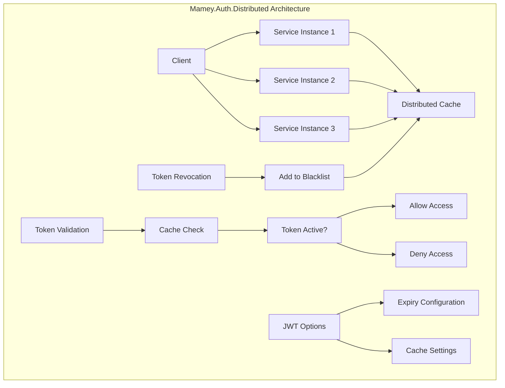

# Mamey.Auth.Distributed

A distributed authentication library for the Mamey framework that provides distributed token management and validation across multiple service instances using distributed caching.

## Table of Contents

- [Overview](#overview)
- [Key Features](#key-features)
- [Architecture](#architecture)
- [Installation](#installation)
- [Quick Start](#quick-start)
- [Core Components](#core-components)
- [API Reference](#api-reference)
- [Usage Examples](#usage-examples)
- [Configuration](#configuration)
- [Best Practices](#best-practices)
- [Troubleshooting](#troubleshooting)

## Overview

Mamey.Auth.Distributed provides distributed token management capabilities for microservices architectures. It enables token validation and revocation across multiple service instances using distributed caching, ensuring consistent authentication state across your entire system.

### Technical Overview

The library provides:

- **Distributed Token Validation**: Token validation across multiple service instances
- **Token Revocation**: Distributed token blacklisting and revocation
- **Cache Integration**: Integration with distributed cache providers (Redis, etc.)
- **JWT Integration**: Seamless integration with JWT authentication
- **Performance**: Efficient token validation with caching

## Key Features

### Core Features

- **Distributed Token Management**: Token validation across multiple service instances
- **Token Revocation**: Distributed token blacklisting and revocation
- **Cache Integration**: Integration with distributed cache providers
- **JWT Integration**: Seamless integration with JWT authentication
- **Performance**: Efficient token validation with caching
- **Scalability**: Horizontal scaling support

### Advanced Features

- **Token Blacklisting**: Distributed token blacklisting
- **Cache Expiration**: Automatic token expiration handling
- **HTTP Context Integration**: Automatic token extraction from HTTP headers
- **Async Operations**: Full async/await support

## Architecture



## Installation

### Package Manager
```bash
Install-Package Mamey.Auth.Distributed
```

### .NET CLI
```bash
dotnet add package Mamey.Auth.Distributed
```

### PackageReference
```xml
<PackageReference Include="Mamey.Auth.Distributed" Version="2.0.*" />
```

## Quick Start

### Basic Setup

```csharp
using Mamey.Auth.Distributed;

public class Program
{
    public static void Main(string[] args)
    {
        var builder = WebApplication.CreateBuilder(args);
        
        builder.Services
            .AddMamey()
            .AddAuth()
            .AddJwt()
            .AddDistributedAccessTokenValidator();
            
        var app = builder.Build();
        app.Run();
    }
}
```

### Basic Usage

```csharp
public class AuthController : ControllerBase
{
    private readonly IAccessTokenService _accessTokenService;
    
    public AuthController(IAccessTokenService accessTokenService)
    {
        _accessTokenService = accessTokenService;
    }
    
    [HttpPost("logout")]
    public async Task<IActionResult> Logout()
    {
        await _accessTokenService.DeactivateCurrentAsync();
        return Ok();
    }
    
    [HttpGet("validate")]
    public async Task<IActionResult> ValidateToken()
    {
        var isActive = await _accessTokenService.IsCurrentActiveToken();
        return Ok(new { IsActive = isActive });
    }
}
```

## Core Components

### IAccessTokenService
Interface for distributed access token management.

```csharp
public interface IAccessTokenService
{
    Task<bool> IsCurrentActiveToken();
    Task DeactivateCurrentAsync();
    Task<bool> IsActiveAsync(string token);
    Task DeactivateAsync(string token);
}
```

### DistributedAccessTokenService
Implementation of distributed access token service.

```csharp
public class DistributedAccessTokenService : IAccessTokenService
{
    private readonly IDistributedCache _cache;
    private readonly IHttpContextAccessor _httpContextAccessor;
    private readonly TimeSpan _expires;
    
    public async Task<bool> IsActiveAsync(string token)
    {
        return string.IsNullOrWhiteSpace(await _cache.GetStringAsync(GetKey(token)));
    }
    
    public async Task DeactivateAsync(string token)
    {
        await _cache.SetStringAsync(GetKey(token), "revoked", new DistributedCacheEntryOptions
        {
            AbsoluteExpirationRelativeToNow = _expires
        });
    }
}
```

## API Reference

### Extension Methods

#### AddDistributedAccessTokenValidator
Registers distributed access token validation services.

```csharp
public static IMameyBuilder AddDistributedAccessTokenValidator(this IMameyBuilder builder)
```

### Dependencies

The library requires the following dependencies:

- `Mamey.Auth` - Core authentication services
- `Mamey.Auth.Jwt` - JWT authentication support
- `IDistributedCache` - Distributed cache implementation (Redis, etc.)

## Usage Examples

### Basic Token Management

```csharp
public class TokenService
{
    private readonly IAccessTokenService _accessTokenService;
    
    public TokenService(IAccessTokenService accessTokenService)
    {
        _accessTokenService = accessTokenService;
    }
    
    public async Task<bool> ValidateTokenAsync(string token)
    {
        return await _accessTokenService.IsActiveAsync(token);
    }
    
    public async Task RevokeTokenAsync(string token)
    {
        await _accessTokenService.DeactivateAsync(token);
    }
    
    public async Task RevokeCurrentTokenAsync()
    {
        await _accessTokenService.DeactivateCurrentAsync();
    }
}
```

### Authentication Middleware

```csharp
public class TokenValidationMiddleware
{
    private readonly RequestDelegate _next;
    private readonly IAccessTokenService _accessTokenService;
    
    public TokenValidationMiddleware(RequestDelegate next, IAccessTokenService accessTokenService)
    {
        _next = next;
        _accessTokenService = accessTokenService;
    }
    
    public async Task InvokeAsync(HttpContext context)
    {
        var token = ExtractTokenFromHeader(context);
        
        if (!string.IsNullOrEmpty(token))
        {
            var isActive = await _accessTokenService.IsActiveAsync(token);
            if (!isActive)
            {
                context.Response.StatusCode = 401;
                await context.Response.WriteAsync("Token has been revoked");
                return;
            }
        }
        
        await _next(context);
    }
    
    private string ExtractTokenFromHeader(HttpContext context)
    {
        var authorizationHeader = context.Request.Headers["authorization"];
        if (authorizationHeader == StringValues.Empty)
            return string.Empty;
            
        return authorizationHeader.Single().Split(' ').Last();
    }
}
```

### Logout Implementation

```csharp
[ApiController]
[Route("api/[controller]")]
[Authorize]
public class AuthController : ControllerBase
{
    private readonly IAccessTokenService _accessTokenService;
    
    public AuthController(IAccessTokenService accessTokenService)
    {
        _accessTokenService = accessTokenService;
    }
    
    [HttpPost("logout")]
    public async Task<IActionResult> Logout()
    {
        try
        {
            await _accessTokenService.DeactivateCurrentAsync();
            return Ok(new { Message = "Successfully logged out" });
        }
        catch (Exception ex)
        {
            return StatusCode(500, new { Error = "Logout failed", Details = ex.Message });
        }
    }
    
    [HttpPost("logout-all")]
    public async Task<IActionResult> LogoutAll([FromBody] string[] tokens)
    {
        try
        {
            var tasks = tokens.Select(token => _accessTokenService.DeactivateAsync(token));
            await Task.WhenAll(tasks);
            
            return Ok(new { Message = "All tokens revoked successfully" });
        }
        catch (Exception ex)
        {
            return StatusCode(500, new { Error = "Logout all failed", Details = ex.Message });
        }
    }
}
```

### Token Status Checking

```csharp
public class TokenStatusService
{
    private readonly IAccessTokenService _accessTokenService;
    
    public TokenStatusService(IAccessTokenService accessTokenService)
    {
        _accessTokenService = accessTokenService;
    }
    
    public async Task<TokenStatus> GetTokenStatusAsync(string token)
    {
        var isActive = await _accessTokenService.IsActiveAsync(token);
        return new TokenStatus
        {
            Token = token,
            IsActive = isActive,
            CheckedAt = DateTime.UtcNow
        };
    }
    
    public async Task<bool> IsCurrentTokenActiveAsync()
    {
        return await _accessTokenService.IsCurrentActiveToken();
    }
}

public class TokenStatus
{
    public string Token { get; set; }
    public bool IsActive { get; set; }
    public DateTime CheckedAt { get; set; }
}
```

## Configuration

### Basic Configuration

```json
{
  "jwt": {
    "secretKey": "your-secret-key-here-must-be-at-least-32-characters",
    "issuer": "your-issuer",
    "audience": "your-audience",
    "expiryMinutes": 60
  },
  "redis": {
    "connectionString": "localhost:6379"
  }
}
```

### Advanced Configuration

```json
{
  "jwt": {
    "secretKey": "your-secret-key-here-must-be-at-least-32-characters",
    "issuer": "your-issuer",
    "audience": "your-audience",
    "expiryMinutes": 60,
    "expiry": "01:00:00"
  },
  "redis": {
    "connectionString": "localhost:6379",
    "database": 0,
    "abortOnConnectFail": false,
    "connectTimeout": 5000,
    "syncTimeout": 5000
  }
}
```

### Service Registration

```csharp
public class Program
{
    public static void Main(string[] args)
    {
        var builder = WebApplication.CreateBuilder(args);
        
        // Add distributed cache
        builder.Services.AddStackExchangeRedisCache(options =>
        {
            options.Configuration = builder.Configuration.GetConnectionString("Redis");
        });
        
        // Add Mamey services
        builder.Services
            .AddMamey()
            .AddAuth()
            .AddJwt()
            .AddDistributedAccessTokenValidator();
            
        var app = builder.Build();
        app.Run();
    }
}
```

## Best Practices

### Token Management

1. **Use Appropriate Expiry**: Set reasonable token expiry times
2. **Implement Logout**: Always implement proper logout functionality
3. **Monitor Token Usage**: Track token usage and revocation patterns
4. **Secure Storage**: Ensure secure storage of revoked tokens

```csharp
// Set appropriate token expiry
builder.Services.Configure<JwtOptions>(options =>
{
    options.ExpiryMinutes = 60; // 1 hour
    options.Expiry = TimeSpan.FromHours(1);
});
```

### Performance

1. **Use Caching**: Leverage distributed caching for performance
2. **Async Operations**: Use async/await for all operations
3. **Connection Pooling**: Configure proper connection pooling
4. **Monitor Performance**: Track token validation performance

```csharp
// Configure Redis for optimal performance
builder.Services.AddStackExchangeRedisCache(options =>
{
    options.Configuration = "localhost:6379";
    options.InstanceName = "MameyAuth";
});
```

### Security

1. **Token Validation**: Always validate tokens before processing
2. **Secure Headers**: Use secure headers for token transmission
3. **HTTPS Only**: Use HTTPS in production
4. **Regular Cleanup**: Implement regular cleanup of expired tokens

```csharp
// Implement secure token validation
public async Task<bool> ValidateTokenSecureAsync(string token)
{
    if (string.IsNullOrEmpty(token))
        return false;
        
    return await _accessTokenService.IsActiveAsync(token);
}
```

### Error Handling

1. **Graceful Degradation**: Handle cache failures gracefully
2. **Logging**: Log token validation failures
3. **Fallback**: Implement fallback mechanisms
4. **Monitoring**: Monitor token validation errors

```csharp
// Implement error handling
public async Task<bool> ValidateTokenWithErrorHandlingAsync(string token)
{
    try
    {
        return await _accessTokenService.IsActiveAsync(token);
    }
    catch (Exception ex)
    {
        _logger.LogError(ex, "Token validation failed for token: {Token}", token);
        return false; // Fail secure
    }
}
```

## Troubleshooting

### Common Issues

#### 1. Cache Connection Issues

**Problem**: Distributed cache connection fails.

**Solution**: Check cache connection string and network connectivity.

```csharp
// Verify cache connection
builder.Services.AddStackExchangeRedisCache(options =>
{
    options.Configuration = "localhost:6379";
    options.AbortOnConnectFail = false;
});
```

#### 2. Token Not Found

**Problem**: Token validation returns false for valid tokens.

**Solution**: Check token format and cache key generation.

```csharp
// Debug token validation
public async Task<bool> DebugTokenValidationAsync(string token)
{
    var cacheKey = $"blacklisted-tokens:{token}";
    var cachedValue = await _cache.GetStringAsync(cacheKey);
    
    _logger.LogDebug("Token: {Token}, Cache Key: {CacheKey}, Cached Value: {CachedValue}", 
        token, cacheKey, cachedValue);
        
    return string.IsNullOrWhiteSpace(cachedValue);
}
```

#### 3. Performance Issues

**Problem**: Token validation is slow.

**Solution**: Optimize cache configuration and connection pooling.

```csharp
// Optimize Redis configuration
builder.Services.AddStackExchangeRedisCache(options =>
{
    options.Configuration = "localhost:6379";
    options.ConfigurationOptions = new ConfigurationOptions
    {
        EndPoints = { "localhost:6379" },
        ConnectTimeout = 5000,
        SyncTimeout = 5000,
        AbortOnConnectFail = false
    };
});
```

#### 4. Memory Issues

**Problem**: High memory usage due to token storage.

**Solution**: Implement proper token cleanup and expiration.

```csharp
// Implement token cleanup
public class TokenCleanupService : BackgroundService
{
    private readonly IDistributedCache _cache;
    private readonly ILogger<TokenCleanupService> _logger;
    
    protected override async Task ExecuteAsync(CancellationToken stoppingToken)
    {
        while (!stoppingToken.IsCancellationRequested)
        {
            // Clean up expired tokens
            await CleanupExpiredTokensAsync();
            await Task.Delay(TimeSpan.FromHours(1), stoppingToken);
        }
    }
    
    private async Task CleanupExpiredTokensAsync()
    {
        // Implementation for cleaning up expired tokens
    }
}
```

### Debugging Tips

1. **Enable Logging**: Use detailed logging for troubleshooting
2. **Check Cache**: Verify cache operations and connectivity
3. **Monitor Performance**: Track token validation performance
4. **Test Scenarios**: Test various token scenarios

```csharp
// Enable detailed logging
builder.Services.AddLogging(logging =>
{
    logging.AddConsole();
    logging.SetMinimumLevel(LogLevel.Debug);
});
```

## License

This project is licensed under the MIT License - see the [LICENSE](LICENSE) file for details.

## Contributing

Please read [CONTRIBUTING.md](CONTRIBUTING.md) for details on our code of conduct and the process for submitting pull requests.

## Support

For support and questions, please open an issue in the [GitHub repository](https://github.com/mamey-io/mamey-auth-distributed/issues).


