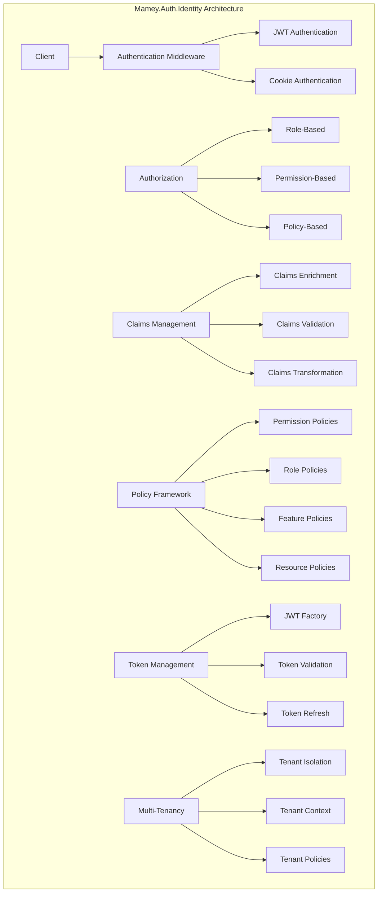

# Mamey.Auth.Identity

A comprehensive authentication and identity management library for the Mamey framework, providing advanced JWT authentication, role-based authorization, permission-based access control, and extensive policy management for enterprise applications.

## Table of Contents

- [Overview](#overview)
- [Key Features](#key-features)
- [Architecture](#architecture)
- [Installation](#installation)
- [Quick Start](#quick-start)
- [Core Components](#core-components)
- [API Reference](#api-reference)
- [Usage Examples](#usage-examples)
- [Configuration](#configuration)
- [Best Practices](#best-practices)
- [Troubleshooting](#troubleshooting)

## Overview

Mamey.Auth.Identity is a comprehensive authentication and identity management library that provides enterprise-grade security features for the Mamey framework. It combines JWT authentication with advanced authorization policies, role-based access control, and permission management.

### Technical Overview

The library provides:

- **JWT Authentication**: Full JWT token generation and validation
- **Role-Based Authorization**: Comprehensive role management system
- **Permission-Based Access Control**: Fine-grained permission system
- **Policy Management**: Extensive authorization policy framework
- **Cookie Authentication**: Dual authentication support (JWT + Cookies)
- **Claims Management**: Advanced claims handling and enrichment
- **Multi-Tenant Support**: Built-in multi-tenancy capabilities

## Key Features

### Core Features

- **JWT Authentication**: Complete JWT token lifecycle management
- **Cookie Authentication**: Traditional cookie-based authentication
- **Role-Based Authorization**: Comprehensive role management
- **Permission-Based Access Control**: Fine-grained permission system
- **Policy Management**: Extensive authorization policy framework
- **Claims Management**: Advanced claims handling and enrichment
- **Multi-Tenant Support**: Built-in multi-tenancy capabilities

### Advanced Features

- **Dual Authentication**: Support for both JWT and cookie authentication
- **Policy Framework**: 20+ built-in authorization policies
- **Claims Enrichment**: Dynamic claims enhancement
- **Token Validation**: Advanced token validation and security
- **Middleware Integration**: Custom authentication middleware
- **Antiforgery Protection**: Built-in CSRF protection
- **Debugging Support**: Comprehensive debugging and logging

## Architecture



## Installation

### Package Manager
```bash
Install-Package Mamey.Auth.Identity
```

### .NET CLI
```bash
dotnet add package Mamey.Auth.Identity
```

### PackageReference
```xml
<PackageReference Include="Mamey.Auth.Identity" Version="2.0.*" />
```

## Quick Start

### Basic Setup

```csharp
using Mamey.Auth.Identity;

public class Program
{
    public static void Main(string[] args)
    {
        var builder = WebApplication.CreateBuilder(args);
        
        builder.Services
            .AddMamey()
            .AddMameyAuthIdentity();
            
        var app = builder.Build();
        
        app.UseMameyAuthIdentity();
        app.Run();
    }
}
```

### Basic Usage

```csharp
[ApiController]
[Route("api/[controller]")]
[Authorize]
public class SecureController : ControllerBase
{
    [HttpGet("profile")]
    public IActionResult GetProfile()
    {
        var userId = User.FindFirst(ClaimTypes.NameIdentifier)?.Value;
        var email = User.FindFirst(ClaimTypes.Email)?.Value;
        
        return Ok(new { UserId = userId, Email = email });
    }
    
    [HttpGet("admin")]
    [Authorize(Policy = "AdminOnly")]
    public IActionResult AdminOnly()
    {
        return Ok("Admin access granted");
    }
}
```

## Core Components

### Authentication

#### JWT Authentication
JWT token generation and validation.

```csharp
public class JwtHandler : IJwtHandler
{
    private readonly JwtSecurityTokenHandler _jwtHandler;
    private readonly JwtOptions _options;
    
    public string CreateToken(string userId, string email, IEnumerable<Claim> claims)
    {
        var tokenDescriptor = new SecurityTokenDescriptor
        {
            Subject = new ClaimsIdentity(claims),
            Expires = DateTime.UtcNow.AddMinutes(_options.ExpiryMinutes),
            Issuer = _options.Issuer,
            Audience = _options.Audience,
            SigningCredentials = _options.SigningCredentials
        };
        
        var token = _jwtHandler.CreateToken(tokenDescriptor);
        return _jwtHandler.WriteToken(token);
    }
}
```

#### Cookie Authentication
Traditional cookie-based authentication.

```csharp
public class CookieAuthenticationService
{
    public async Task SignInAsync(HttpContext context, ClaimsPrincipal principal)
    {
        await context.SignInAsync(IdentityConstants.ApplicationScheme, principal);
    }
    
    public async Task SignOutAsync(HttpContext context)
    {
        await context.SignOutAsync(IdentityConstants.ApplicationScheme);
    }
}
```

### Authorization

#### Role-Based Authorization
Comprehensive role management system.

```csharp
public abstract class AppRole
{
    public const ApplicationPermission Admin = ApplicationPermission.All;
    public const ApplicationPermission User = ApplicationPermission.None;

    [Flags]
    public enum ApplicationPermission : long
    {
        None = 0L,
        ViewAllAccounts = 1L << 0,
        ViewIndividualAccounts = 1L << 1,
        All = 1L << 999
    }
}
```

#### Permission-Based Access Control
Fine-grained permission system.

```csharp
public class PermissionEvaluator : IPermissionEvaluator
{
    public bool HasPermission(ClaimsPrincipal user, string permission)
    {
        return user.HasClaim(ClaimCategory.Permission, permission);
    }
    
    public bool HasRole(ClaimsPrincipal user, string role)
    {
        return user.IsInRole(role);
    }
}
```

### Policy Management

#### Built-in Policies
Extensive authorization policy framework.

```csharp
// Permission-based policies
options.AddPolicy("RequireIdentityRead",
    p => p.RequireClaim(ClaimCategory.Permission, ClaimValues.Permission.IdentityRead));
options.AddPolicy("RequireIdentityWrite",
    p => p.RequireClaim(ClaimCategory.Permission, ClaimValues.Permission.IdentityWrite));

// Role-based policies
options.AddPolicy("AdminOnly", p => p.RequireRole(ClaimValues.Role.Admin));
options.AddPolicy("UserOnly", p => p.RequireRole(ClaimValues.Role.User));

// Feature-flag policies
options.AddPolicy("FeatureBetaX",
    p => p.RequireClaim(ClaimCategory.Feature, ClaimValues.Feature.BetaFeatureX));
```

### Claims Management

#### Claims Enrichment
Dynamic claims enhancement.

```csharp
public class ClaimEnricher
{
    public ClaimsPrincipal EnrichClaims(ClaimsPrincipal principal)
    {
        var claims = new List<Claim>(principal.Claims);
        
        // Add custom claims
        claims.Add(new Claim(ClaimCategory.Permission, ClaimValues.Permission.IdentityRead));
        claims.Add(new Claim(ClaimCategory.Role, ClaimValues.Role.User));
        
        return new ClaimsPrincipal(new ClaimsIdentity(claims, principal.Identity.AuthenticationType));
    }
}
```

## API Reference

### Extension Methods

#### AddMameyAuthIdentity
Registers authentication and identity services.

```csharp
public static IMameyBuilder AddMameyAuthIdentity(
    this IMameyBuilder builder,
    string sectionName = "auth",
    Action<JwtBearerOptions> optionsFactory = null,
    IList<IModule> modules = null,
    AuthorizationOptions authorizationOptions = null,
    AuthenticationOptions authenticationOptions = null)
```

#### UseMameyAuthIdentity
Configures authentication and authorization middleware.

```csharp
public static IApplicationBuilder UseMameyAuthIdentity(this IApplicationBuilder app)
```

### Configuration Options

#### AuthOptions
Main authentication configuration.

```csharp
public class AuthOptions
{
    public string Issuer { get; set; }
    public string Audience { get; set; }
    public string IssuerSigningKey { get; set; }
    public bool ValidateIssuer { get; set; }
    public bool ValidateAudience { get; set; }
    public bool ValidateIssuerSigningKey { get; set; }
    public bool ValidateLifetime { get; set; }
    public int ExpiryMinutes { get; set; }
    public bool AuthenticationDisabled { get; set; }
    public CookieOptions Cookie { get; set; }
}
```

#### CookieOptions
Cookie authentication configuration.

```csharp
public class CookieOptions
{
    public bool HttpOnly { get; set; }
    public bool Secure { get; set; }
    public string SameSite { get; set; }
    public string Domain { get; set; }
}
```

## Usage Examples

### Basic Authentication

```csharp
[ApiController]
[Route("api/[controller]")]
public class AuthController : ControllerBase
{
    private readonly IJwtHandler _jwtHandler;
    
    public AuthController(IJwtHandler jwtHandler)
    {
        _jwtHandler = jwtHandler;
    }
    
    [HttpPost("login")]
    public IActionResult Login([FromBody] LoginRequest request)
    {
        // Validate credentials
        if (ValidateUser(request.Username, request.Password))
        {
            var claims = new[]
            {
                new Claim(ClaimTypes.NameIdentifier, request.Username),
                new Claim(ClaimTypes.Email, request.Email),
                new Claim(ClaimTypes.Role, "User")
            };
            
            var token = _jwtHandler.CreateToken(request.Username, request.Email, claims);
            return Ok(new { Token = token });
        }
        
        return Unauthorized();
    }
}
```

### Role-Based Authorization

```csharp
[ApiController]
[Route("api/[controller]")]
[Authorize]
public class AdminController : ControllerBase
{
    [HttpGet("users")]
    [Authorize(Policy = "AdminOnly")]
    public IActionResult GetUsers()
    {
        return Ok("Admin access granted");
    }
    
    [HttpGet("reports")]
    [Authorize(Policy = "RequireIdentityRead")]
    public IActionResult GetReports()
    {
        return Ok("Reports access granted");
    }
}
```

### Permission-Based Access Control

```csharp
[ApiController]
[Route("api/[controller]")]
[Authorize]
public class ResourceController : ControllerBase
{
    [HttpPost("create")]
    [Authorize(Policy = "ResourceCustomerCreate")]
    public IActionResult CreateResource([FromBody] CreateResourceRequest request)
    {
        return Ok("Resource created");
    }
    
    [HttpGet("read")]
    [Authorize(Policy = "RequireIdentityRead")]
    public IActionResult ReadResource()
    {
        return Ok("Resource read");
    }
}
```

### Feature Flag Authorization

```csharp
[ApiController]
[Route("api/[controller]")]
[Authorize]
public class FeatureController : ControllerBase
{
    [HttpGet("beta")]
    [Authorize(Policy = "FeatureBetaX")]
    public IActionResult BetaFeature()
    {
        return Ok("Beta feature access granted");
    }
    
    [HttpGet("reports-preview")]
    [Authorize(Policy = "FeatureReportsPreview")]
    public IActionResult ReportsPreview()
    {
        return Ok("Reports preview access granted");
    }
}
```

### Multi-Tenant Support

```csharp
[ApiController]
[Route("api/[controller]")]
[Authorize]
public class TenantController : ControllerBase
{
    [HttpGet("tenant-data")]
    [Authorize(Policy = "TenantAdminOnly")]
    public IActionResult GetTenantData()
    {
        var tenantId = User.FindFirst("tenant_id")?.Value;
        return Ok(new { TenantId = tenantId });
    }
}
```

### Custom Claims

```csharp
public class CustomClaimsMiddleware
{
    private readonly RequestDelegate _next;
    
    public CustomClaimsMiddleware(RequestDelegate next)
    {
        _next = next;
    }
    
    public async Task InvokeAsync(HttpContext context)
    {
        if (context.User.Identity.IsAuthenticated)
        {
            var claims = new List<Claim>
            {
                new Claim(ClaimCategory.Department, ClaimValues.Department.HR),
                new Claim(ClaimCategory.Locale, ClaimValues.Locale.EnUS),
                new Claim(ClaimCategory.Environment, ClaimValues.Environment.Production)
            };
            
            var identity = new ClaimsIdentity(claims, "Custom");
            context.User.AddIdentity(identity);
        }
        
        await _next(context);
    }
}
```

## Configuration

### Basic Configuration

```json
{
  "auth": {
    "issuer": "your-issuer",
    "audience": "your-audience",
    "issuerSigningKey": "your-secret-key-here-must-be-at-least-32-characters",
    "validateIssuer": true,
    "validateAudience": true,
    "validateIssuerSigningKey": true,
    "validateLifetime": true,
    "expiryMinutes": 60,
    "authenticationDisabled": false,
    "cookie": {
      "httpOnly": true,
      "secure": true,
      "sameSite": "strict",
      "domain": "yourdomain.com"
    }
  }
}
```

### Advanced Configuration

```json
{
  "auth": {
    "issuer": "https://your-issuer.com",
    "audience": "https://your-audience.com",
    "issuerSigningKey": "your-secret-key-here-must-be-at-least-32-characters",
    "validateIssuer": true,
    "validateAudience": true,
    "validateIssuerSigningKey": true,
    "validateLifetime": true,
    "expiryMinutes": 120,
    "authenticationDisabled": false,
    "cookie": {
      "httpOnly": true,
      "secure": true,
      "sameSite": "strict",
      "domain": "yourdomain.com"
    }
  }
}
```

### Service Registration

```csharp
public class Program
{
    public static void Main(string[] args)
    {
        var builder = WebApplication.CreateBuilder(args);
        
        builder.Services
            .AddMamey()
            .AddMameyAuthIdentity(
                sectionName: "auth",
                optionsFactory: jwtOptions =>
                {
                    jwtOptions.Events = new JwtBearerEvents
                    {
                        OnTokenValidated = context =>
                        {
                            // Custom token validation logic
                            return Task.CompletedTask;
                        }
                    };
                });
                
        var app = builder.Build();
        
        app.UseMameyAuthIdentity();
        app.Run();
    }
}
```

## Best Practices

### Security

1. **Use Strong Keys**: Use strong JWT signing keys
2. **Validate Tokens**: Always validate JWT tokens
3. **Use HTTPS**: Use HTTPS in production
4. **Implement Logout**: Implement proper logout functionality

```csharp
// Use strong JWT signing key
builder.Services.Configure<AuthOptions>(options =>
{
    options.IssuerSigningKey = "your-very-strong-secret-key-here-must-be-at-least-32-characters";
    options.ValidateIssuer = true;
    options.ValidateAudience = true;
    options.ValidateLifetime = true;
});
```

### Authorization

1. **Use Policies**: Use authorization policies instead of inline checks
2. **Principle of Least Privilege**: Grant minimum required permissions
3. **Regular Audits**: Regularly audit permissions and roles
4. **Test Authorization**: Test authorization thoroughly

```csharp
// Use authorization policies
[Authorize(Policy = "RequireIdentityRead")]
public IActionResult GetData()
{
    return Ok();
}
```

### Performance

1. **Cache Claims**: Cache user claims for performance
2. **Async Operations**: Use async/await for all operations
3. **Minimize Claims**: Include only necessary claims
4. **Monitor Performance**: Monitor authentication performance

```csharp
// Cache user claims
public class ClaimsCache
{
    private readonly IMemoryCache _cache;
    
    public async Task<ClaimsPrincipal> GetCachedClaimsAsync(string userId)
    {
        return await _cache.GetOrCreateAsync($"claims:{userId}", async entry =>
        {
            entry.AbsoluteExpirationRelativeToNow = TimeSpan.FromMinutes(30);
            return await LoadClaimsAsync(userId);
        });
    }
}
```

### Error Handling

1. **Graceful Degradation**: Handle authentication failures gracefully
2. **Logging**: Log authentication and authorization failures
3. **User-Friendly Messages**: Provide user-friendly error messages
4. **Monitoring**: Monitor authentication errors

```csharp
// Handle authentication failures gracefully
public class AuthenticationErrorHandler
{
    public async Task HandleAuthenticationFailureAsync(HttpContext context)
    {
        context.Response.StatusCode = 401;
        context.Response.ContentType = "application/json";
        
        var error = new
        {
            Error = "Authentication failed",
            Message = "Please check your credentials and try again"
        };
        
        await context.Response.WriteAsync(JsonSerializer.Serialize(error));
    }
}
```

## Troubleshooting

### Common Issues

#### 1. JWT Token Validation Failures

**Problem**: JWT tokens are not being validated correctly.

**Solution**: Check JWT configuration and signing key.

```csharp
// Verify JWT configuration
builder.Services.Configure<AuthOptions>(options =>
{
    options.Issuer = "your-issuer";
    options.Audience = "your-audience";
    options.IssuerSigningKey = "your-secret-key";
    options.ValidateIssuer = true;
    options.ValidateAudience = true;
    options.ValidateIssuerSigningKey = true;
});
```

#### 2. Authorization Policy Failures

**Problem**: Authorization policies are not working correctly.

**Solution**: Check policy configuration and claims.

```csharp
// Debug authorization policies
public class AuthorizationDebugger
{
    public void DebugClaims(ClaimsPrincipal user)
    {
        foreach (var claim in user.Claims)
        {
            Console.WriteLine($"Claim: {claim.Type} = {claim.Value}");
        }
    }
}
```

#### 3. Cookie Authentication Issues

**Problem**: Cookie authentication is not working.

**Solution**: Check cookie configuration and domain settings.

```csharp
// Verify cookie configuration
builder.Services.Configure<AuthOptions>(options =>
{
    options.Cookie = new CookieOptions
    {
        HttpOnly = true,
        Secure = true,
        SameSite = "strict",
        Domain = "yourdomain.com"
    };
});
```

#### 4. Claims Not Found

**Problem**: Expected claims are not present.

**Solution**: Check claims generation and enrichment.

```csharp
// Verify claims generation
public class ClaimsVerifier
{
    public bool VerifyClaims(ClaimsPrincipal user, string[] requiredClaims)
    {
        foreach (var claim in requiredClaims)
        {
            if (!user.HasClaim(ClaimTypes.Role, claim))
                return false;
        }
        return true;
    }
}
```

### Debugging Tips

1. **Enable Logging**: Use detailed logging for troubleshooting
2. **Check Configuration**: Verify authentication configuration
3. **Test Policies**: Test authorization policies individually
4. **Monitor Performance**: Monitor authentication performance

```csharp
// Enable detailed logging
builder.Services.AddLogging(logging =>
{
    logging.AddConsole();
    logging.SetMinimumLevel(LogLevel.Debug);
});
```

## License

This project is licensed under the MIT License - see the [LICENSE](LICENSE) file for details.

## Contributing

Please read [CONTRIBUTING.md](CONTRIBUTING.md) for details on our code of conduct and the process for submitting pull requests.

## Support

For support and questions, please open an issue in the [GitHub repository](https://github.com/mamey-io/mamey-auth-identity/issues).


