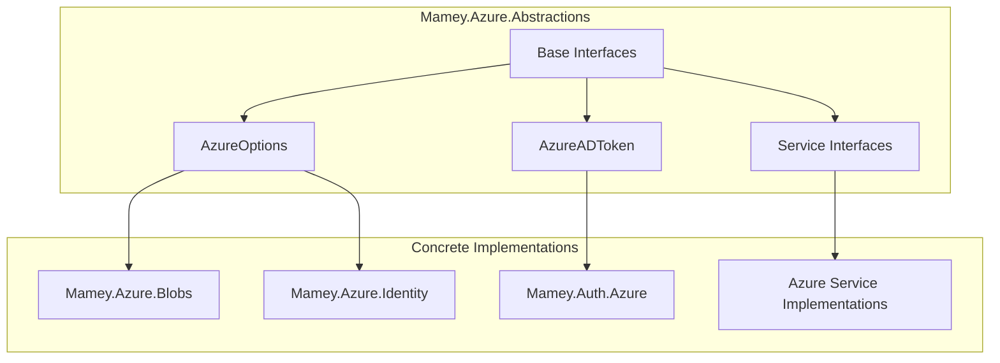
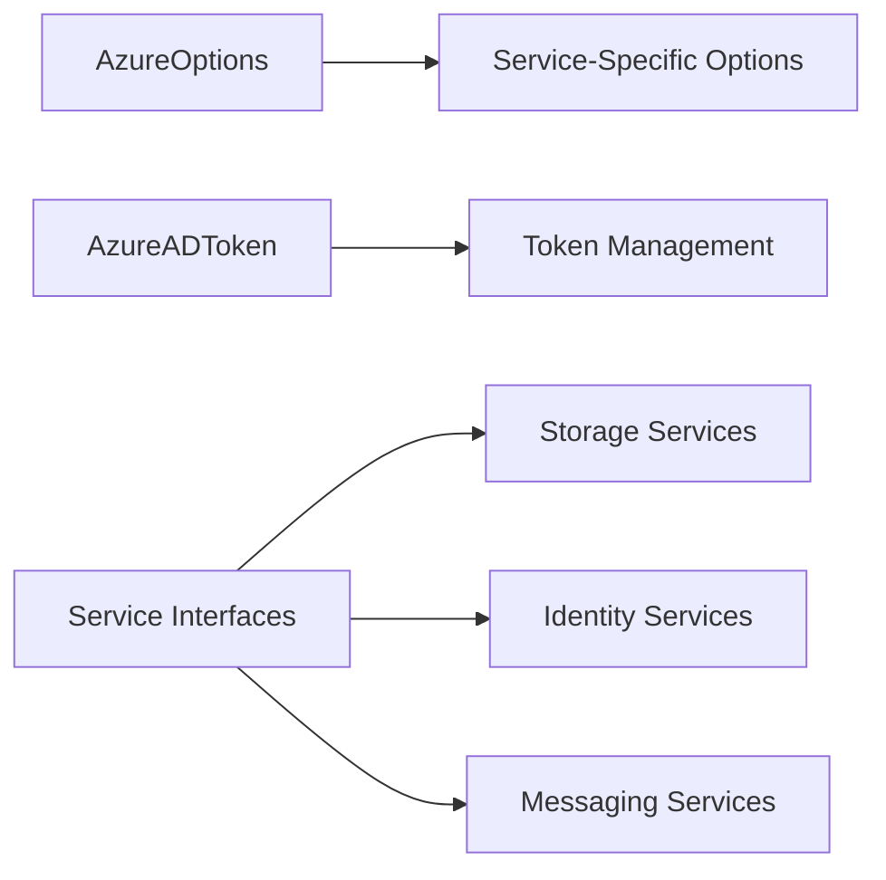

# Mamey.Azure.Abstractions

**Library**: `Mamey.Azure.Abstractions`  
**Location**: `Mamey/src/Mamey.Azure.Abstractions/`  
**Type**: Azure Library - Abstractions  
**Version**: 2.0.*  
**Files**: 3 C# files  
**Namespace**: `Mamey.Azure.Abstractions`

## Overview

Mamey.Azure.Abstractions provides core abstractions and interfaces for Azure services integration within the Mamey framework. It defines common contracts and base types that enable consistent patterns across various Azure services like Storage, Identity, Service Bus, and more.

### Conceptual Foundation

**Azure Service Abstractions** provide a layer of indirection between application code and Azure services, enabling:

1. **Dependency Inversion**: High-level modules don't depend on low-level Azure implementations
2. **Testability**: Easy mocking and testing of Azure service interactions
3. **Consistency**: Uniform patterns across different Azure services
4. **Flexibility**: Easy switching between different Azure service implementations
5. **Interface Segregation**: Focused, cohesive interfaces for specific Azure services

**Why Mamey.Azure.Abstractions?**

Provides:
- **Service Abstractions**: Common interfaces for Azure services
- **Configuration Management**: Unified configuration patterns
- **Error Handling**: Standardized error handling across Azure services
- **Retry Policies**: Built-in retry mechanisms for Azure operations
- **Logging Integration**: Comprehensive logging for Azure operations
- **Type Safety**: Strongly-typed interfaces for better development experience

**Use Cases:**
- Base contracts for Azure service implementations
- Type-safe Azure service data structures
- Consistent API across Azure service libraries
- Framework for implementing new Azure services

## Architecture

### Azure Abstractions Architecture



### Interface Hierarchy



## Core Components

### AzureOptions - Azure Configuration Base

Base configuration class for Azure services:

```csharp
public class AzureOptions
{
    public string TenantId { get; set; }
    public string ClientId { get; set; }
    public string ClientSecret { get; set; }
    public string Instance { get; set; }
    public string Domain { get; set; }
}
```

### AzureADToken - Azure AD Token Model

Azure AD token data structure:

```csharp
public class AzureADToken
{
    public string AccessToken { get; set; }
    public string RefreshToken { get; set; }
    public DateTime ExpiresOn { get; set; }
    public string TokenType { get; set; }
    // Additional token properties
}
```

## Installation

### Prerequisites

1. **.NET 9.0**: Ensure .NET 9.0 SDK is installed
2. **Mamey**: Core framework

### NuGet Package

```bash
dotnet add package Mamey.Azure.Abstractions
```

### Dependencies

- **Mamey** - Core framework

## Quick Start

### Basic Setup

```csharp
using Mamey.Azure.Abstractions;

// Interfaces are used by concrete implementations
// No direct usage required - use concrete Azure service libraries instead
```

## Usage Examples

### Example 1: Using Azure Options

```csharp
using Mamey.Azure.Abstractions;

// AzureOptions is used by concrete Azure service implementations
public class AzureService
{
    private readonly AzureOptions _options;

    public AzureService(AzureOptions options)
    {
        _options = options;
    }

    public void ConfigureService()
    {
        // Use options for service configuration
        var tenantId = _options.TenantId;
        var clientId = _options.ClientId;
    }
}
```

### Example 2: Using Azure AD Token

```csharp
using Mamey.Azure.Abstractions;

public class TokenService
{
    private readonly AzureADToken _token;

    public TokenService(AzureADToken token)
    {
        _token = token;
    }

    public bool IsTokenValid()
    {
        return _token.ExpiresOn > DateTime.UtcNow;
    }

    public string GetAccessToken()
    {
        if (!IsTokenValid())
        {
            // Refresh token
            return RefreshToken();
        }

        return _token.AccessToken;
    }
}
```

## Extension Points

### Creating New Azure Service Interfaces

```csharp
namespace Mamey.Azure.Abstractions;

// Define a new Azure service interface
public interface IAzureService
{
    Task<ServiceResult> ExecuteAsync(ServiceRequest request);
}
```

### Implementing Azure Service Abstractions

```csharp
using Mamey.Azure.Abstractions;

// Implement the interface in a concrete library
public class AzureService : IAzureService
{
    private readonly AzureOptions _options;

    public AzureService(AzureOptions options)
    {
        _options = options;
    }

    public async Task<ServiceResult> ExecuteAsync(ServiceRequest request)
    {
        // Implementation using Azure SDK
    }
}
```

## Related Libraries

All Azure service libraries use these abstractions:

- **Mamey.Azure.Blobs**: Azure Blob Storage implementation
- **Mamey.Azure.Identity**: Azure Identity implementation
- **Mamey.Auth.Azure**: Azure AD authentication
- **Mamey.Auth.Azure.B2B**: Azure AD B2B authentication
- **Mamey.Auth.Azure.B2C**: Azure AD B2C authentication

## Best Practices

### 1. Use Abstractions for Type Safety

**✅ Good: Use interface types**
```csharp
public class AzureService
{
    private readonly IAzureService _azureService; // Use interface, not concrete type

    public AzureService(IAzureService azureService)
    {
        _azureService = azureService;
    }
}
```

### 2. Implement Abstractions Consistently

**✅ Good: Follow interface contracts**
```csharp
public class BlobStorageService : IAzureBlobService
{
    // Implement all interface members
    public Task<BlobResult> UploadBlobAsync(BlobRequest request);
    public Task<BlobResult> DownloadBlobAsync(string blobName);
}
```

### 3. Extend Abstractions for New Services

**✅ Good: Create new interfaces for new services**
```csharp
public interface IAzureNewService
{
    // Define new Azure service interface
}
```

## Additional Resources

- [Azure Services Documentation](https://docs.microsoft.com/azure/)
- [Mamey Framework Documentation](../../documentation/)
- [Mamey.Azure.Abstractions Memory Documentation](../../.skmemory/v1/memory/public/mid-term/libraries/azure/mamey-azure-abstractions.md)

## Tags

#azure #abstractions #interfaces #cloud #mamey

