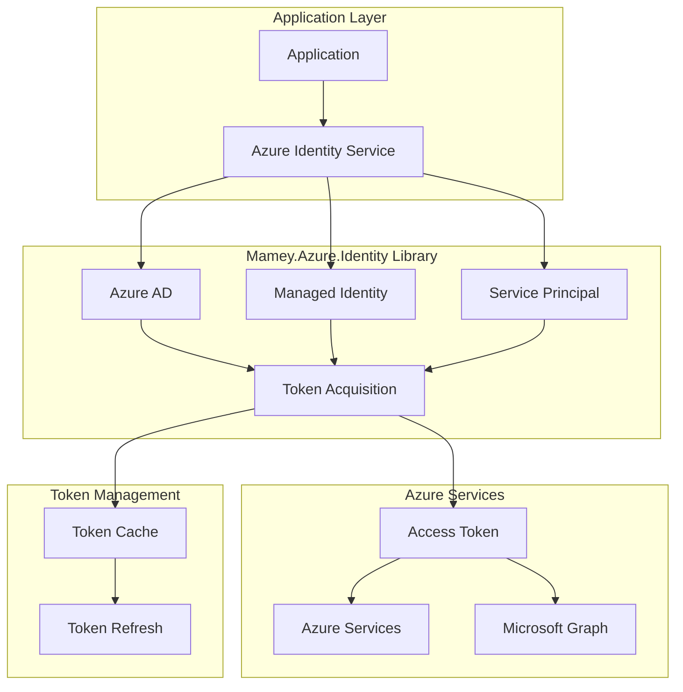
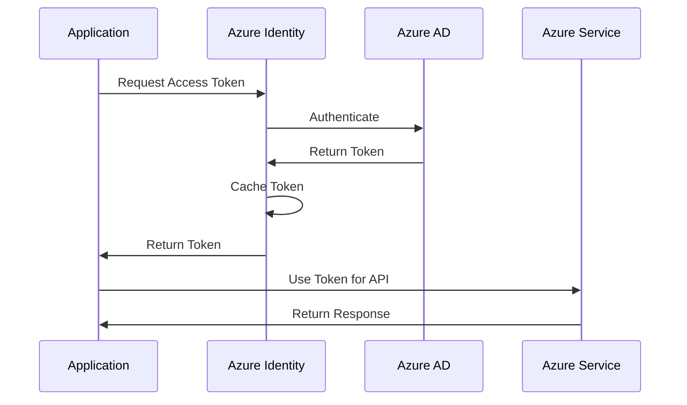

# Mamey.Azure.Identity

**Library**: `Mamey.Azure.Identity`  
**Location**: `Mamey/src/Mamey.Azure.Identity/`  
**Type**: Azure Library - Identity  
**Version**: 2.0.*  
**Files**: 4 C# files  
**Namespace**: `Mamey.Azure.Identity`

## Overview

Mamey.Azure.Identity provides comprehensive Azure Identity integration for the Mamey framework. It enables authentication and authorization using Azure Active Directory, managed identities, and service principals with seamless integration across Azure services.

### Conceptual Foundation

**Azure Identity and Access Management (IAM)** is Microsoft's cloud-based identity service. Key concepts:

1. **Single Sign-On (SSO)**: Centralized authentication across Azure services
2. **Multi-Factor Authentication (MFA)**: Enhanced security with additional verification steps
3. **Conditional Access**: Policy-based access control based on user, device, and location
4. **Identity Protection**: Risk-based access policies and threat detection
5. **Privileged Identity Management (PIM)**: Just-in-time access to privileged resources

**Authentication Methods** supported:
- **Client Secret**: Application secret for service-to-service authentication
- **Client Certificate**: X.509 certificate-based authentication
- **Managed Identity**: Azure-managed identity for resources running in Azure
- **Interactive Authentication**: User-based authentication with browser interaction
- **Default Azure Credential**: Automatic credential chain resolution

**Why Mamey.Azure.Identity?**

Provides:
- **Azure AD Integration**: Complete Azure Active Directory authentication
- **Managed Identity Support**: Azure managed identity authentication
- **Service Principal Authentication**: Service principal credential authentication
- **Multi-Tenant Support**: Support for multi-tenant applications
- **Token Management**: Automatic token acquisition and refresh
- **Role-Based Access Control**: Azure RBAC integration
- **Microsoft Graph Integration**: Full Microsoft Graph API integration

**Use Cases:**
- Azure service authentication
- Managed identity authentication
- Service principal authentication
- Multi-tenant applications
- Microsoft Graph API access

## Architecture

### Azure Identity Authentication Flow



### Authentication Flow



## Core Components

### Extensions - Azure Identity Extensions

Extension methods for Azure Identity configuration:

```csharp
public static class Extensions
{
    public static IMameyBuilder AddAzureIdentity(this IMameyBuilder builder);
    public static IServiceCollection AddAzureIdentity(
        this IServiceCollection services,
        string section = AzureOptions.APPSETTINGS_SECTION);
}
```

**Features:**
- **JWT Bearer Authentication**: JWT Bearer token authentication
- **Microsoft Identity Web**: Microsoft Identity Web integration
- **Microsoft Graph**: Microsoft Graph API integration
- **Token Caching**: In-memory token caching

### TokenValidationMiddleware - Token Validation Middleware

Middleware for validating Azure AD tokens:

```csharp
public class TokenValidationMiddleware
{
    private readonly RequestDelegate _next;

    public TokenValidationMiddleware(RequestDelegate next);
    public async Task Invoke(HttpContext context);
}
```

**Features:**
- **Token Extraction**: Extracts tokens from Authorization header
- **Token Validation**: Validates JWT token signature and claims
- **Error Handling**: Comprehensive error handling for invalid tokens

## Installation

### Prerequisites

1. **.NET 9.0**: Ensure .NET 9.0 SDK is installed
2. **Azure AD Tenant**: Azure AD tenant configured
3. **Mamey.Azure.Abstractions**: Azure abstractions library

### NuGet Package

```bash
dotnet add package Mamey.Azure.Identity
```

### Dependencies

- **Mamey** - Core framework
- **Mamey.Azure.Abstractions** - Azure abstractions
- **Microsoft.Identity.Web** - Microsoft Identity Web library
- **Microsoft.Graph** - Microsoft Graph SDK

## Quick Start

### Basic Setup

```csharp
using Mamey.Azure.Identity;

var builder = WebApplication.CreateBuilder(args);

builder.Services
    .AddMamey()
    .AddAzureIdentity();

var app = builder.Build();

app.UseAuthentication();
app.UseAuthorization();

app.Run();
```

### Configuration

Add to `appsettings.json`:

```json
{
  "AzureAd": {
    "Instance": "https://login.microsoftonline.com/",
    "TenantId": "your-tenant-id",
    "ClientId": "your-client-id",
    "ClientSecret": "your-client-secret",
    "Domain": "your-domain.onmicrosoft.com",
    "Scopes": "openid profile User.Read",
    "CallbackPath": "/signin-oidc"
  },
  "DownstreamApi": {
    "BaseUrl": "https://graph.microsoft.com/v1.0",
    "Scopes": "User.Read"
  }
}
```

## Usage Examples

### Example 1: Use Microsoft Graph API

```csharp
using Microsoft.Graph;
using Microsoft.Graph.Models;

public class GraphService
{
    private readonly GraphServiceClient _graphClient;
    private readonly ILogger<GraphService> _logger;

    public GraphService(
        GraphServiceClient graphClient,
        ILogger<GraphService> logger)
    {
        _graphClient = graphClient;
        _logger = logger;
    }

    public async Task<User?> GetUserAsync(string userId)
    {
        try
        {
            _logger.LogInformation("Retrieving user: {UserId}", userId);

            var user = await _graphClient.Users[userId].GetAsync();

            _logger.LogInformation("Retrieved user: {DisplayName}", user?.DisplayName);

            return user;
        }
        catch (Exception ex)
        {
            _logger.LogError(ex, "Failed to retrieve user: {UserId}", userId);
            throw;
        }
    }
}
```

### Example 2: Use Token Validation Middleware

```csharp
using Mamey.Azure.Identity.Middlewares;

var builder = WebApplication.CreateBuilder(args);

builder.Services.AddMamey().AddAzureIdentity();

var app = builder.Build();

// Use token validation middleware
app.UseMiddleware<TokenValidationMiddleware>();

app.UseAuthentication();
app.UseAuthorization();

app.Run();
```

### Example 3: Protected API Endpoint

```csharp
using Microsoft.AspNetCore.Authorization;
using Microsoft.AspNetCore.Mvc;

[ApiController]
[Route("api/[controller]")]
[Authorize]
public class DataController : ControllerBase
{
    [HttpGet]
    public IActionResult GetData()
    {
        var userId = User.FindFirst("sub")?.Value;
        var userName = User.Identity?.Name;
        
        return Ok(new { UserId = userId, UserName = userName });
    }
}
```

## Related Libraries

- **Mamey.Azure.Abstractions**: Azure abstractions
- **Mamey.Azure.Identity.BlazorWasm**: Blazor client for Azure Identity
- **Mamey.Auth.Azure**: Azure AD authentication
- **Mamey.Graph**: Microsoft Graph integration

## Additional Resources

- [Azure Identity Documentation](https://docs.microsoft.com/azure/active-directory/develop/)
- [Microsoft Identity Web](https://github.com/AzureAD/microsoft-identity-web)
- [Microsoft Graph API](https://docs.microsoft.com/graph/)
- [Mamey Framework Documentation](../../documentation/)
- [Mamey.Azure.Identity Memory Documentation](../../.skmemory/v1/memory/public/mid-term/libraries/azure/mamey-azure-identity.md)

## Tags

#azure #identity #authentication #microsoft-graph #mamey

