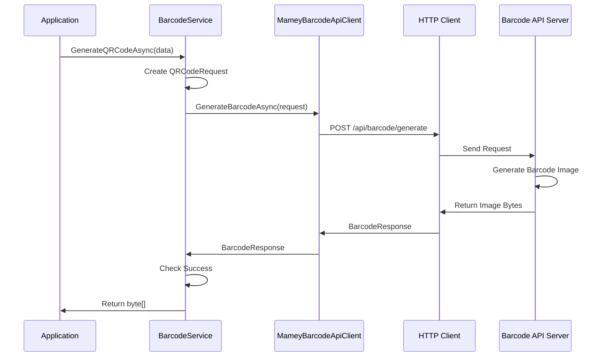
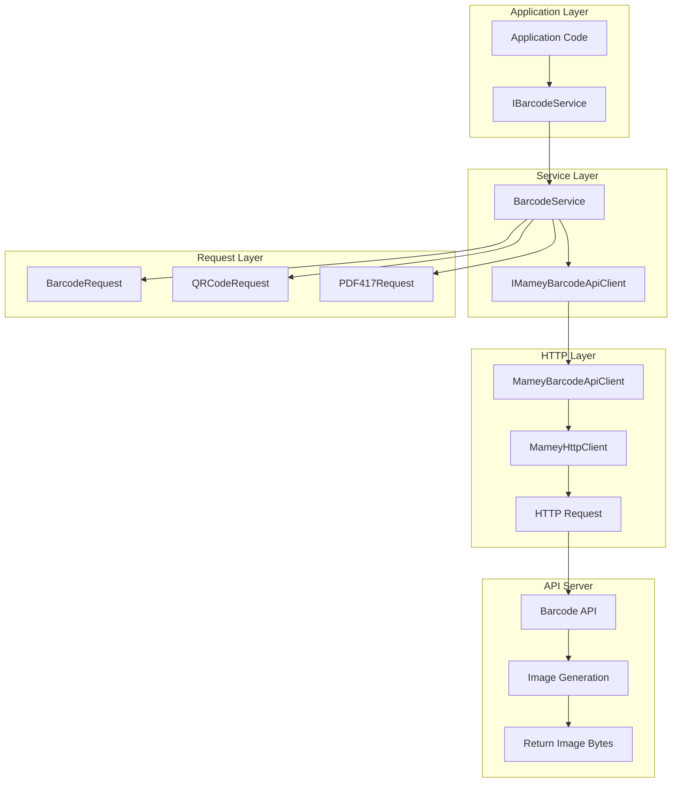
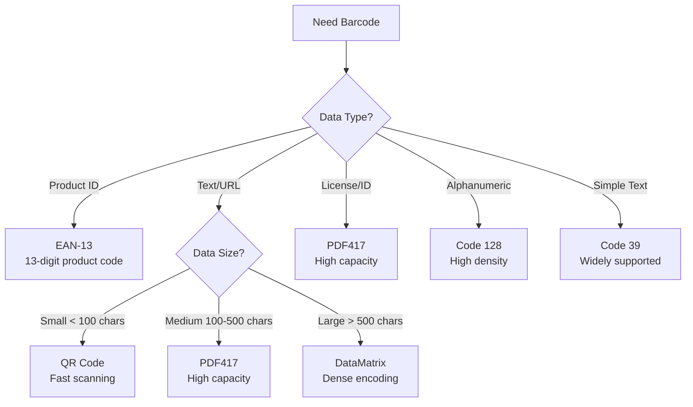

# Mamey.Barcode

**Library**: `Mamey.Barcode`  
**Location**: `Mamey/src/Mamey.Barcode/`  
**Type**: Specialized Library - Barcode Generation  
**Version**: 2.0.*  
**Files**: 15 C# files  
**Namespace**: `Mamey.Barcode`

## Overview

Mamey.Barcode provides comprehensive barcode generation capabilities for the Mamey framework. It supports multiple barcode formats including QR codes, Code 128, PDF417, DataMatrix, Code39, and EAN-13. The library uses an HTTP-based API client to generate barcode images programmatically.

### Conceptual Foundation

**Barcodes** are machine-readable representations of data encoded as visual patterns. Key concepts:

1. **1D Barcodes (Linear)**: One-dimensional barcodes using parallel lines
   - **Code 128**: High-density alphanumeric barcode
   - **Code 39**: Alphanumeric barcode with wider bars
   - **EAN-13**: 13-digit European Article Number for products

2. **2D Barcodes (Matrix)**: Two-dimensional barcodes using patterns of squares
   - **QR Code**: Quick Response code with error correction
   - **PDF417**: Portable data file format with high capacity
   - **DataMatrix**: Dense 2D barcode for small items

3. **Error Correction**: Ability to recover data from damaged barcodes
4. **Data Capacity**: Maximum amount of data a barcode can store
5. **Encoding**: Process of converting data into barcode patterns

**Why Use Barcodes?**
- **Efficiency**: Fast data entry without manual typing
- **Accuracy**: Reduced human error in data entry
- **Tracking**: Track products, documents, and assets
- **Identification**: Unique identification of items
- **Integration**: Easy integration with scanning systems

**Use Cases:**
- Product identification (EAN-13, UPC)
- Document tracking (QR codes, PDF417)
- Inventory management (Code 128, Code 39)
- Payment processing (QR codes)
- Identity verification (PDF417 on driver licenses)
- Event ticketing (QR codes)
- Asset tracking (DataMatrix)

## Architecture

### Barcode Generation Flow



### Barcode Service Architecture



### Barcode Format Selection



## Core Components

### IBarcodeService - Barcode Service Interface

Interface for barcode generation operations:

```csharp
public interface IBarcodeService
{
    Task<byte[]?> GenerateQRCodeAsync(
        string data, 
        int maxWidth = 500, 
        int maxHeight = 500);
}
```

**Methods:**
- `GenerateQRCodeAsync(string data, int maxWidth = 500, int maxHeight = 500)`: Generates a QR code image from the provided data

**Parameters:**
- `data`: The data to encode in the barcode
- `maxWidth`: Maximum width of the generated barcode image (default: 500)
- `maxHeight`: Maximum height of the generated barcode image (default: 500)

**Returns:**
- `Task<byte[]?>`: Byte array containing the barcode image (PNG format), or null if generation fails

### BarcodeService - Implementation

Main implementation of barcode service:

```csharp
public class BarcodeService : IBarcodeService
{
    private readonly IMameyBarcodeApiClient _mameyBarcodeApiClient;

    public BarcodeService(IMameyBarcodeApiClient mameyBarcodeApiClient)
    {
        _mameyBarcodeApiClient = mameyBarcodeApiClient;
    }

    public async Task<byte[]?> GenerateQRCodeAsync(
        string data, 
        int maxWidth = 500, 
        int maxHeight = 500)
    {
        var response = await _mameyBarcodeApiClient.GenerateBarcodeAsync(
            new BarcodeRequest(data, BarCodeType.QRCode.GetEnumShortNameDisplayAttribute())
        );
        
        if (!response.Succeeded)
        {
            return null;
        }

        return response.BarcodeBytes;
    }
}
```

### BarCodeType - Barcode Format Enum

Enumeration of supported barcode formats:

```csharp
public enum BarCodeType
{
    [Display(Name = "PDF417", ShortName = "pdf417")]
    PDF417,
    
    [Display(Name = "DataMatrix", ShortName = "datamatrix")]
    DataMatrix,
    
    [Display(Name = "Code128", ShortName = "code128")]
    Code128,
    
    [Display(Name = "QRCode", ShortName = "qrcode")]
    QRCode,
    
    [Display(Name = "Code39", ShortName = "code39")]
    Code39,
    
    [Display(Name = "EAN13", ShortName = "ean13")]
    EAN13
}
```

**Supported Formats:**
- **PDF417**: High-capacity 2D barcode for documents
- **DataMatrix**: Dense 2D barcode for small items
- **Code 128**: High-density linear barcode
- **QR Code**: Popular 2D barcode with error correction
- **Code 39**: Widely supported alphanumeric barcode
- **EAN-13**: 13-digit product identification barcode

### IBarcodeRequest - Request Interface

Interface for barcode generation requests:

```csharp
public interface IBarcodeRequest
{
    string Data { get; set; }
    string Type { get; set; }
}
```

### BarcodeRequest - Base Request

Base class for barcode generation requests:

```csharp
public class BarcodeRequest : IBarcodeRequest
{
    public string Data { get; set; }
    public string Type { get; set; }

    public BarcodeRequest(string data, string type)
    {
        Data = data;
        Type = type;
    }
}
```

### QRCodeRequest - QR Code Request

Specialized request for QR code generation with advanced options:

```csharp
public class QRCodeRequest : BarcodeRequest
{
    public int Version { get; set; } = 1;
    public string ErrorCorrection { get; set; } = "L"; // L, M, Q, H
    public int BoxSize { get; set; } = 10;
    public int Border { get; set; } = 4;
    public string ForegroundColor { get; set; } = "#000000";
    public string BackgroundColor { get; set; } = "#FFFFFF";
    public string? ImageUrl { get; set; }

    public QRCodeRequest(
        string data, 
        int version = 1,
        string errorCorrection = "L", 
        int boxSize = 10, 
        int border = 4,
        string foregroundColor = "#000000", 
        string backgroundColor = "#FFFFFF",
        string? imageUrl = null)
        : base(data, BarCodeType.QRCode.GetEnumShortNameDisplayAttribute())
    {
        Version = version;
        ErrorCorrection = errorCorrection;
        BoxSize = boxSize;
        Border = border;
        ForegroundColor = foregroundColor;
        BackgroundColor = backgroundColor;
        ImageUrl = imageUrl;
    }
}
```

**QR Code Properties:**
- **Version**: QR code version (1-40), determines size and capacity
- **ErrorCorrection**: Error correction level (L, M, Q, H)
  - **L (Low)**: Recovers 7% of data
  - **M (Medium)**: Recovers 15% of data
  - **Q (Quartile)**: Recovers 25% of data
  - **H (High)**: Recovers 30% of data
- **BoxSize**: Size of each square in pixels (default: 10)
- **Border**: Quiet zone border size in modules (default: 4)
- **ForegroundColor**: Color of barcode pattern (default: black)
- **BackgroundColor**: Background color (default: white)
- **ImageUrl**: Optional logo/image URL to embed in center

### PDF417Request - PDF417 Request

Specialized request for PDF417 barcode generation:

```csharp
public class PDF417Request : BarcodeRequest
{
    public PDF417Request(string data) 
        : base(data, BarCodeType.PDF417.GetEnumShortNameDisplayAttribute())
    {
    }
}
```

### IMameyBarcodeApiClient - API Client Interface

Interface for barcode API client:

```csharp
public interface IMameyBarcodeApiClient
{
    Task<BarcodeResponse> GenerateBarcodeAsync(IBarcodeRequest request);
}
```

### BarcodeResponse - Response Model

Response model for barcode generation:

```csharp
public class BarcodeResponse : ApiResponse<byte[]>
{
    public byte[]? BarcodeBytes { get; set; }
}
```

### BarcodeOptions - Configuration Options

Configuration options for barcode service:

```csharp
public class BarcodeOptions
{
    // Configuration properties
}
```

## Installation

### Prerequisites

1. **Barcode API Server**: Mamey Barcode API server running (default: `http://localhost:18648`)
2. **.NET 9.0**: Ensure .NET 9.0 SDK is installed
3. **Mamey.Http**: HTTP client library for API communication

### NuGet Package

```bash
dotnet add package Mamey.Barcode
```

### Dependencies

- **Mamey** - Core framework
- **Mamey.Http** - HTTP client library

## Quick Start

### Basic Setup

```csharp
using Mamey;
using Mamey.Barcode;

var builder = WebApplication.CreateBuilder(args);

// Configure Mamey services
builder.Services
    .AddMamey()
    .AddBarcode();

var app = builder.Build();
app.Run();
```

### Configuration

The barcode service uses an HTTP client to communicate with the barcode API server. By default, it connects to `http://localhost:18648`.

**Custom Configuration:**

```csharp
builder.Services
    .AddMamey()
    .AddBarcode()
    .AddGenericHttpClient<MameyBarcodeApiClient>(
        "MameyBarcodeApiClient",
        configureClient: config =>
        {
            config.BaseAddress = new Uri("https://barcode-api.example.com");
        }
    );
```

## Usage Examples

### Example 1: Basic QR Code Generation

```csharp
using Mamey.Barcode;

public class ProductService
{
    private readonly IBarcodeService _barcodeService;
    private readonly ILogger<ProductService> _logger;

    public ProductService(
        IBarcodeService barcodeService,
        ILogger<ProductService> logger)
    {
        _barcodeService = barcodeService;
        _logger = logger;
    }

    public async Task<byte[]?> GenerateProductQrCodeAsync(string productId)
    {
        try
        {
            _logger.LogInformation("Generating QR code for product: {ProductId}", productId);

            var qrCodeBytes = await _barcodeService.GenerateQRCodeAsync(
                productId,
                maxWidth: 500,
                maxHeight: 500
            );

            if (qrCodeBytes == null)
            {
                _logger.LogWarning("Failed to generate QR code for product: {ProductId}", productId);
                return null;
            }

            _logger.LogInformation(
                "Successfully generated QR code for product: {ProductId}, Size: {Size} bytes",
                productId,
                qrCodeBytes.Length);

            return qrCodeBytes;
        }
        catch (Exception ex)
        {
            _logger.LogError(ex, "Error generating QR code for product: {ProductId}", productId);
            throw;
        }
    }
}
```

### Example 2: QR Code with Custom Options

```csharp
using Mamey.Barcode;
using Mamey.Barcode.Http;
using Mamey.Barcode.Requests;

public class DocumentService
{
    private readonly IMameyBarcodeApiClient _barcodeApiClient;
    private readonly ILogger<DocumentService> _logger;

    public DocumentService(
        IMameyBarcodeApiClient barcodeApiClient,
        ILogger<DocumentService> logger)
    {
        _barcodeApiClient = barcodeApiClient;
        _logger = logger;
    }

    public async Task<byte[]?> GenerateDocumentQrCodeAsync(
        string documentId,
        string documentUrl)
    {
        try
        {
            _logger.LogInformation("Generating QR code for document: {DocumentId}", documentId);

            // Create QR code request with custom options
            var qrCodeRequest = new QRCodeRequest(
                data: documentUrl,
                version: 3, // Larger QR code for more data
                errorCorrection: "H", // High error correction for durability
                boxSize: 15, // Larger boxes for better scanning
                border: 4, // Standard quiet zone
                foregroundColor: "#000000", // Black foreground
                backgroundColor: "#FFFFFF" // White background
            );

            var response = await _barcodeApiClient.GenerateBarcodeAsync(qrCodeRequest);

            if (!response.Succeeded || response.BarcodeBytes == null)
            {
                _logger.LogWarning("Failed to generate QR code for document: {DocumentId}", documentId);
                return null;
            }

            _logger.LogInformation(
                "Successfully generated QR code for document: {DocumentId}",
                documentId);

            return response.BarcodeBytes;
        }
        catch (Exception ex)
        {
            _logger.LogError(ex, "Error generating QR code for document: {DocumentId}", documentId);
            throw;
        }
    }
}
```

### Example 3: QR Code with Logo

```csharp
using Mamey.Barcode;
using Mamey.Barcode.Http;
using Mamey.Barcode.Requests;

public class BrandedQrCodeService
{
    private readonly IMameyBarcodeApiClient _barcodeApiClient;

    public BrandedQrCodeService(IMameyBarcodeApiClient barcodeApiClient)
    {
        _barcodeApiClient = barcodeApiClient;
    }

    public async Task<byte[]?> GenerateBrandedQrCodeAsync(
        string data,
        string logoUrl)
    {
        // Create QR code with embedded logo
        var qrCodeRequest = new QRCodeRequest(
            data: data,
            errorCorrection: "H", // High error correction needed when logo is embedded
            boxSize: 20, // Larger boxes to accommodate logo
            border: 4,
            foregroundColor: "#1a1a1a", // Dark gray for softer appearance
            backgroundColor: "#FFFFFF",
            imageUrl: logoUrl // Embed logo in center
        );

        var response = await _barcodeApiClient.GenerateBarcodeAsync(qrCodeRequest);

        return response.Succeeded ? response.BarcodeBytes : null;
    }
}
```

### Example 4: Event Ticket QR Code

```csharp
using Mamey.Barcode;

public class TicketService
{
    private readonly IBarcodeService _barcodeService;
    private readonly ILogger<TicketService> _logger;

    public TicketService(
        IBarcodeService barcodeService,
        ILogger<TicketService> logger)
    {
        _barcodeService = barcodeService;
        _logger = logger;
    }

    public async Task<byte[]?> GenerateTicketQrCodeAsync(
        Guid eventId,
        Guid ticketId,
        string ticketUrl)
    {
        try
        {
            // Create ticket data JSON
            var ticketData = new
            {
                EventId = eventId,
                TicketId = ticketId,
                Url = ticketUrl,
                GeneratedAt = DateTime.UtcNow
            };

            var ticketDataJson = System.Text.Json.JsonSerializer.Serialize(ticketData);

            _logger.LogInformation(
                "Generating QR code for ticket: {TicketId}, Event: {EventId}",
                ticketId,
                eventId);

            // Generate QR code with high error correction for durability
            var qrCodeBytes = await _barcodeService.GenerateQRCodeAsync(
                ticketDataJson,
                maxWidth: 600, // Larger for better scanning
                maxHeight: 600
            );

            if (qrCodeBytes == null)
            {
                _logger.LogWarning("Failed to generate QR code for ticket: {TicketId}", ticketId);
                return null;
            }

            _logger.LogInformation(
                "Successfully generated QR code for ticket: {TicketId}",
                ticketId);

            return qrCodeBytes;
        }
        catch (Exception ex)
        {
            _logger.LogError(ex, "Error generating QR code for ticket: {TicketId}", ticketId);
            throw;
        }
    }
}
```

### Example 5: Save Barcode to File

```csharp
using Mamey.Barcode;
using Mamey.Persistence.Minio;

public class BarcodeStorageService
{
    private readonly IBarcodeService _barcodeService;
    private readonly IMinioClient _minioClient;
    private readonly ILogger<BarcodeStorageService> _logger;

    public BarcodeStorageService(
        IBarcodeService barcodeService,
        IMinioClient minioClient,
        ILogger<BarcodeStorageService> logger)
    {
        _barcodeService = barcodeService;
        _minioClient = minioClient;
        _logger = logger;
    }

    public async Task<string> GenerateAndStoreQrCodeAsync(
        string data,
        string bucketName,
        string objectName)
    {
        try
        {
            // Generate QR code
            var qrCodeBytes = await _barcodeService.GenerateQRCodeAsync(data);

            if (qrCodeBytes == null)
            {
                throw new InvalidOperationException("Failed to generate QR code");
            }

            // Upload to MinIO
            await using var stream = new MemoryStream(qrCodeBytes);
            await _minioClient.PutObjectAsync(
                bucketName,
                objectName,
                stream,
                "image/png");

            var url = await _minioClient.GetPresignedUrlAsync(bucketName, objectName);

            _logger.LogInformation(
                "QR code generated and stored: {ObjectName} in bucket {BucketName}",
                objectName,
                bucketName);

            return url;
        }
        catch (Exception ex)
        {
            _logger.LogError(ex, "Error generating and storing QR code");
            throw;
        }
    }
}
```

### Example 6: Multiple Barcode Formats

```csharp
using Mamey.Barcode;
using Mamey.Barcode.Http;
using Mamey.Barcode.Requests;

public class BarcodeFormatService
{
    private readonly IMameyBarcodeApiClient _barcodeApiClient;

    public BarcodeFormatService(IMameyBarcodeApiClient barcodeApiClient)
    {
        _barcodeApiClient = barcodeApiClient;
    }

    public async Task<Dictionary<string, byte[]?>> GenerateAllFormatsAsync(string data)
    {
        var results = new Dictionary<string, byte[]?>();

        // Generate QR Code
        var qrCodeRequest = new BarcodeRequest(data, BarCodeType.QRCode.GetEnumShortNameDisplayAttribute());
        var qrCodeResponse = await _barcodeApiClient.GenerateBarcodeAsync(qrCodeRequest);
        results["QRCode"] = qrCodeResponse.Succeeded ? qrCodeResponse.BarcodeBytes : null;

        // Generate Code 128
        var code128Request = new BarcodeRequest(data, BarCodeType.Code128.GetEnumShortNameDisplayAttribute());
        var code128Response = await _barcodeApiClient.GenerateBarcodeAsync(code128Request);
        results["Code128"] = code128Response.Succeeded ? code128Response.BarcodeBytes : null;

        // Generate PDF417
        var pdf417Request = new BarcodeRequest(data, BarCodeType.PDF417.GetEnumShortNameDisplayAttribute());
        var pdf417Response = await _barcodeApiClient.GenerateBarcodeAsync(pdf417Request);
        results["PDF417"] = pdf417Response.Succeeded ? pdf417Response.BarcodeBytes : null;

        // Generate DataMatrix
        var dataMatrixRequest = new BarcodeRequest(data, BarCodeType.DataMatrix.GetEnumShortNameDisplayAttribute());
        var dataMatrixResponse = await _barcodeApiClient.GenerateBarcodeAsync(dataMatrixRequest);
        results["DataMatrix"] = dataMatrixResponse.Succeeded ? dataMatrixResponse.BarcodeBytes : null;

        return results;
    }
}
```

## Extension Methods

### AddBarcode

Registers barcode services with the Mamey builder.

```csharp
public static IMameyBuilder AddBarcode(this IMameyBuilder builder)
```

**Features:**
- Registers `IBarcodeService` as scoped service
- Registers `IMameyBarcodeApiClient` with HTTP client
- Configures default API endpoint (`http://localhost:18648`)
- Registers response handler

**Usage:**
```csharp
builder.Services
    .AddMamey()
    .AddBarcode();
```

## Barcode Format Comparison

### QR Code
- **Type**: 2D matrix barcode
- **Data Capacity**: Up to 4,296 alphanumeric characters
- **Error Correction**: 4 levels (L, M, Q, H)
- **Scanning**: Fast, works at various angles
- **Use Cases**: URLs, contact info, product tracking, event tickets

### PDF417
- **Type**: 2D stacked barcode
- **Data Capacity**: Up to 1,850 ASCII characters
- **Error Correction**: Built-in error correction
- **Scanning**: Requires linear scanning
- **Use Cases**: Driver licenses, identity cards, shipping labels

### Code 128
- **Type**: 1D linear barcode
- **Data Capacity**: Up to 80 characters
- **Error Correction**: Check digit validation
- **Scanning**: Standard linear scanning
- **Use Cases**: Shipping labels, inventory tracking, product codes

### DataMatrix
- **Type**: 2D matrix barcode
- **Data Capacity**: Up to 2,335 alphanumeric characters
- **Error Correction**: Built-in error correction
- **Scanning**: Works at any angle
- **Use Cases**: Small items, electronics, medical devices

### Code 39
- **Type**: 1D linear barcode
- **Data Capacity**: Up to 43 characters
- **Error Correction**: Check digit optional
- **Scanning**: Standard linear scanning
- **Use Cases**: Inventory, asset tracking, simple identification

### EAN-13
- **Type**: 1D linear barcode
- **Data Capacity**: 13 digits (fixed)
- **Error Correction**: Check digit validation
- **Scanning**: Standard linear scanning
- **Use Cases**: Product identification, retail, point of sale

## Best Practices

### 1. Choose the Right Format

**✅ Good: Match format to use case**
```csharp
// Product identification: Use EAN-13
var productBarcode = await GenerateBarcodeAsync(productId, BarCodeType.EAN13);

// Document tracking: Use PDF417
var documentBarcode = await GenerateBarcodeAsync(documentId, BarCodeType.PDF417);

// URLs/Text: Use QR Code
var urlBarcode = await GenerateBarcodeAsync(url, BarCodeType.QRCode);
```

**❌ Bad: Using wrong format**
```csharp
// ❌ Don't use QR Code for simple product IDs
var productBarcode = await GenerateBarcodeAsync(productId, BarCodeType.QRCode);
```

### 2. Error Correction Levels

**✅ Good: Use appropriate error correction**
```csharp
// For durability (printed materials, outdoor): Use High (H)
var qrCodeRequest = new QRCodeRequest(data, errorCorrection: "H");

// For digital display: Use Medium (M) or Low (L)
var qrCodeRequest = new QRCodeRequest(data, errorCorrection: "M");
```

### 3. QR Code Sizing

**✅ Good: Use appropriate size**
```csharp
// For print: Larger size (600x600)
var qrCode = await _barcodeService.GenerateQRCodeAsync(data, 600, 600);

// For digital: Standard size (500x500)
var qrCode = await _barcodeService.GenerateQRCodeAsync(data, 500, 500);
```

### 4. Data Validation

**✅ Good: Validate data before generation**
```csharp
public async Task<byte[]?> GenerateQrCodeAsync(string data)
{
    if (string.IsNullOrWhiteSpace(data))
    {
        throw new ArgumentException("Data cannot be empty", nameof(data));
    }

    if (data.Length > 2953) // QR Code alphanumeric limit
    {
        throw new ArgumentException("Data exceeds QR Code capacity", nameof(data));
    }

    return await _barcodeService.GenerateQRCodeAsync(data);
}
```

### 5. Caching Generated Barcodes

**✅ Good: Cache barcodes for same data**
```csharp
private readonly IMemoryCache _cache;

public async Task<byte[]?> GetOrGenerateQrCodeAsync(string data)
{
    var cacheKey = $"barcode:qrcode:{data}";
    
    if (_cache.TryGetValue(cacheKey, out byte[]? cachedBarcode))
    {
        return cachedBarcode;
    }

    var barcode = await _barcodeService.GenerateQRCodeAsync(data);
    
    if (barcode != null)
    {
        _cache.Set(cacheKey, barcode, TimeSpan.FromHours(24));
    }

    return barcode;
}
```

## Troubleshooting

### Common Issues

#### Barcode Generation Returns Null

**Problem**: `GenerateQRCodeAsync()` returns `null`.

**Solution**:
1. Check API server is running at configured endpoint
2. Verify API endpoint is accessible
3. Check network connectivity
4. Review API server logs for errors
5. Validate data format and size

#### QR Code Too Small to Scan

**Problem**: Generated QR code is too small to scan.

**Solution**:
1. Increase `maxWidth` and `maxHeight` parameters
2. Increase `boxSize` in `QRCodeRequest`
3. Use higher error correction level
4. Ensure adequate quiet zone (border)

#### API Connection Errors

**Problem**: Connection errors when calling barcode API.

**Solution**:
1. Verify API server is running
2. Check API endpoint configuration
3. Verify network connectivity
4. Check firewall settings
5. Review HTTP client configuration

#### Invalid Barcode Format

**Problem**: Barcode format not supported.

**Solution**:
1. Verify `BarCodeType` is valid
2. Check API server supports the format
3. Use supported format for your use case

### Debugging

Enable detailed logging:

```csharp
builder.Logging.AddConsole();
builder.Logging.SetMinimumLevel(LogLevel.Debug);
```

Check API connectivity:

```csharp
// Test API endpoint
var httpClient = new HttpClient();
var response = await httpClient.GetAsync("http://localhost:18648/health");
if (response.IsSuccessStatusCode)
{
    // API is accessible
}
```

## Performance Considerations

1. **API Response Time**: Barcode generation is network-dependent
2. **Image Size**: Larger barcodes take longer to generate
3. **Caching**: Cache generated barcodes when possible
4. **Concurrent Requests**: API server has rate limits
5. **Error Handling**: Implement retry logic for transient failures

## Integration Patterns

### With Image Processing

```csharp
using Mamey.Barcode;
using Mamey.Image;

public class BarcodeImageService
{
    private readonly IBarcodeService _barcodeService;
    private readonly IImageService _imageService;

    public async Task<byte[]> GenerateBarcodeWithLogoAsync(
        string data,
        byte[] logoBytes)
    {
        // Generate QR code
        var qrCodeBytes = await _barcodeService.GenerateQRCodeAsync(data);

        // Combine with logo using image processing
        var combinedImage = await _imageService.CombineImagesAsync(
            qrCodeBytes,
            logoBytes);

        return combinedImage;
    }
}
```

### With Document Templates

```csharp
using Mamey.Barcode;
using Mamey.Templates;

public class DocumentBarcodeService
{
    private readonly IBarcodeService _barcodeService;
    private readonly ITemplateService _templateService;

    public async Task<byte[]> GenerateDocumentWithBarcodeAsync(
        string documentTemplate,
        object data,
        string barcodeData)
    {
        // Generate document
        var documentBytes = await _templateService.GenerateAsync(
            documentTemplate,
            data);

        // Generate QR code
        var qrCodeBytes = await _barcodeService.GenerateQRCodeAsync(barcodeData);

        // Embed QR code in document
        // Implementation depends on document format
        return EmbedBarcodeInDocument(documentBytes, qrCodeBytes);
    }
}
```

## Related Libraries

- **Mamey.Image**: Image processing capabilities for barcode manipulation
- **Mamey.Persistence.Minio**: Store generated barcode images
- **Mamey.Http**: HTTP client for API communication
- **Mamey.Templates**: Document templates with embedded barcodes

## Additional Resources

- [QR Code Specification (ISO/IEC 18004)](https://www.iso.org/standard/62021.html)
- [PDF417 Specification (ISO/IEC 15438)](https://www.iso.org/standard/27910.html)
- [Code 128 Specification](https://en.wikipedia.org/wiki/Code_128)
- [Mamey Framework Documentation](../../documentation/)
- [Mamey.Barcode Memory Documentation](../../.skmemory/v1/memory/public/mid-term/libraries/specialized/mamey-barcode.md)

## Tags

#barcode #qr-code #generation #pdf417 #code128 #specialized #mamey
