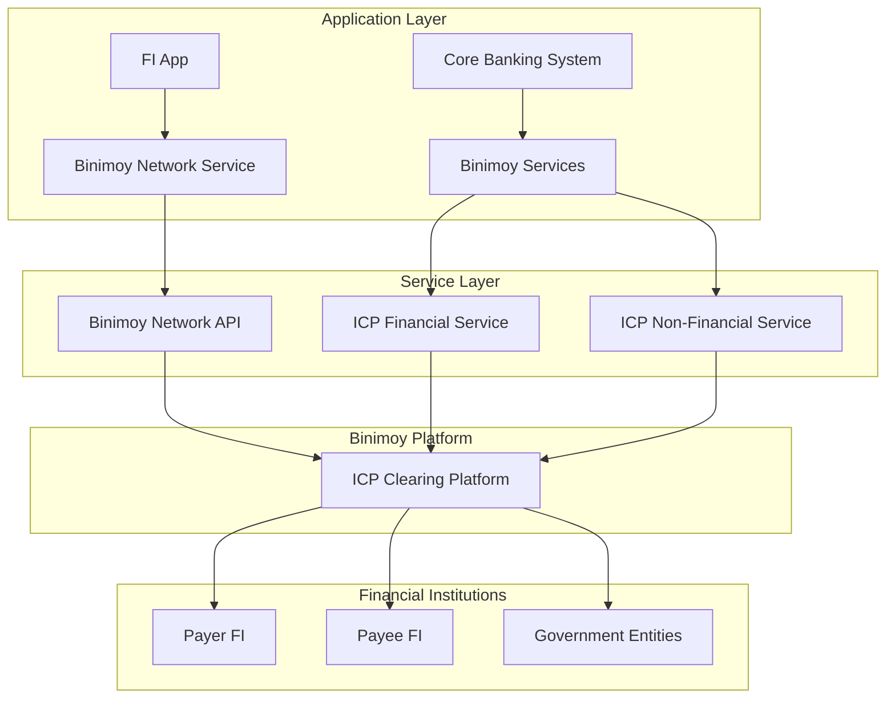
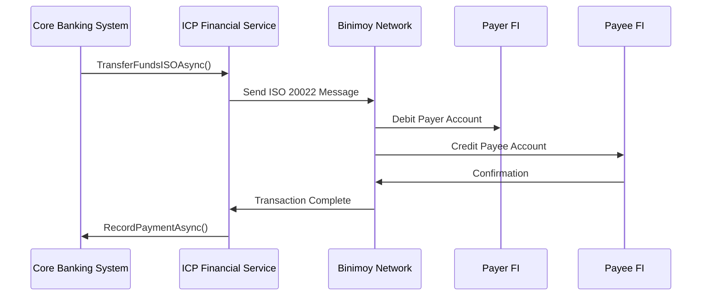
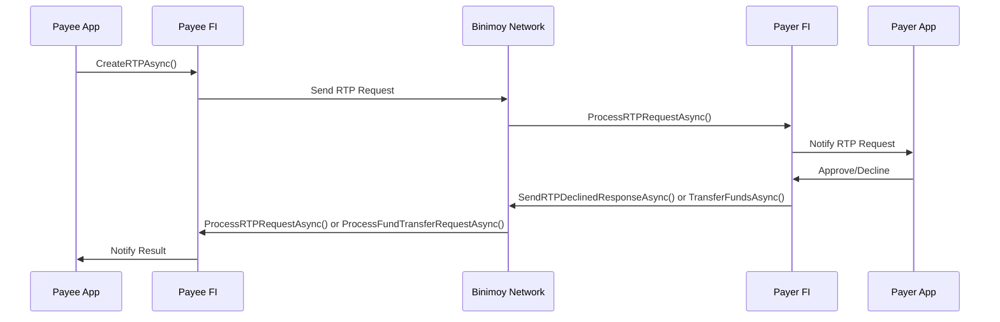
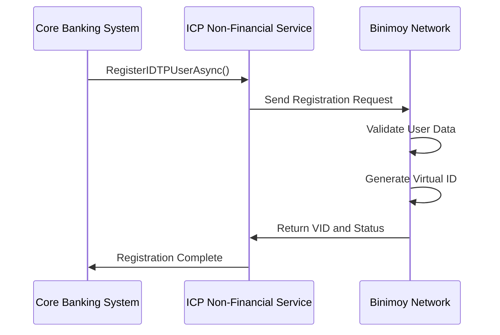

# Mamey.Binimoy

**Library**: `Mamey.Binimoy`  
**Location**: `Mamey/src/Mamey.Binimoy/`  
**Type**: Specialized Library - Binimoy Protocol  
**Version**: 2.0.*  
**Files**: 7 C# files  
**Namespace**: `Mamey.Binimoy`

## Overview

Mamey.Binimoy provides comprehensive Binimoy protocol implementation for the Mamey framework. Binimoy (Interoperable Digital Transaction Platform) is Bangladesh's national payment system that enables interoperability between financial institutions for digital transactions, payments, and financial services.

### Conceptual Foundation

**Binimoy Protocol** is Bangladesh's national payment infrastructure that enables:
- **Interoperability**: Seamless transactions between different financial institutions
- **Real-Time Payments (RTP)**: Real-time payment requests between users
- **Direct Payments**: Direct fund transfers between financial institutions
- **Government Payments**: Payment of government dues, utility bills, taxes
- **Bulk Payments**: Salary disbursements and bulk fund transfers
- **User Management**: User registration, validation, and management

**Key Concepts:**
1. **Financial Institution (FI)**: Banks and financial institutions participating in Binimoy
2. **ICP (Interoperable Clearing Platform)**: Platform for clearing transactions
3. **RTP (Request to Pay)**: Real-time payment request mechanism
4. **Virtual ID (VID)**: User's virtual identifier in Binimoy network
5. **Direct Pay**: Direct fund transfer between institutions
6. **ISO 20022**: Financial messaging standard for transactions

**Why Use Binimoy?**
- **National Standard**: Bangladesh's official payment infrastructure
- **Interoperability**: Connect with all participating financial institutions
- **Real-Time**: Real-time payment processing
- **Compliance**: Full compliance with regulatory requirements
- **Security**: Secure and authenticated transactions

**Use Cases:**
- Inter-bank fund transfers
- Real-time payment requests
- Government dues payment
- Utility bill payments
- Salary disbursements
- User registration and validation

## Architecture

### Binimoy Service Architecture



### Direct Pay Flow



### RTP (Request to Pay) Flow



### User Registration Flow



## Core Components

### IBinimoyNetworkService - Network Service Interface

Interface for Binimoy network operations:

```csharp
public interface IBinimoyNetworkService
{
    // Account Operations
    Task GetAccountBalanceAsync();
    
    // Fund Transfer Operations
    Task InitiateFundTransferAsync();
    Task InitiateFundTransferISOAsync();
    Task ProcessFundTransferRequestAsync();
    Task ProcessFIToFIFundTransferRequestAsync();
    
    // RTP Operations
    Task ProcessRTPRequestAsync();
    Task ProcessRTPDeclinedResponseAsync();
    
    // Bulk Payment Operations
    Task ProcessIDTPBulkPaymentRequestAsync();
    
    // User Operations
    Task ValidateUserAsync();
    Task SendOTPAsync();
    Task ValidateOTPAsync();
    
    // Event Operations
    Task NotifyWhiteLabelEventsAsync();
}
```

### IICPFinancialService - Financial Service Interface

Interface for financial operations (ICP):

```csharp
public interface IICPFinancialService
{
    // Payment Authorization
    Task GetPaymentAuthorizationAsync(GetPaymentAuthorizationRequest request);
    Task RecordPaymentAsync();
    
    // Government Payments
    Task PayGovernmentDuesAsync();
    Task PayGovernmentDueISOAsync();
    
    // Fund Transfers
    Task TransferFundsAsync();
    Task TransferFundsISOAsync();
    Task TransferFundsFItoFIAsync();
    Task TransferFundsFItoFIISOAsync();
    
    // RTP Operations
    Task CreateRTPAsync(CreateRTPRequest request);
    Task CreateRTPISOAsync();
    Task SendRTPDeclinedResponseAsync();
    Task SendRTPDeclinedResponseISOAsync();
    
    // Disbursement Operations
    Task DisburseGovtFundsAsync();
    Task DisburseSalaryAsync();
    
    // Utility Payments
    Task PayUtilityBillsAsync();
    Task PayUtilityBillsISOAsync();
    
    // Fee and Transaction Operations
    Task GetIDTPFeeAsync();
    Task GetTransactionsbyFIAsync();
    Task GetTransactionsbyUserAsync();
    Task GetRTPListSentAsync();
    Task GetRTPListReceivedAsync();
    Task GetTransactionStatusAsync();
    Task GetRTPStatusAsync();
    Task GetRTPsbyFIAsync();
    Task UpdateDisbursementStatusAsync();
}
```

### IICPNonFinancialService - Non-Financial Service Interface

Interface for non-financial operations (ICP):

```csharp
public interface IICPNonFinancialService
{
    // User Management
    Task RegisterIDTPUserAsync();
    Task PreRegisterIDTPUserAsync();
    Task ValidateIDTPUserAsync();
    Task GetPreRegisteredUserInfoAsync();
    Task GetVIDFromUserInfoAsync();
    Task GetIDTPUserProfileAndAccountInfoAsync();
    Task GetFIUserListAsync();
    
    // Account Management
    Task SetDefaultAccountAsync();
    Task GetDefaultAccountsAsync();
    
    // PIN Management
    Task ChangeIDTPPINAsync();
    Task ResetIDTPPINAsync();
    
    // Device Management
    Task RegisterDeviceAsync();
    Task ValidateAppUserCredentialsAsync();
    Task CheckRegistrationStatusAsync();
    
    // QR Code Generation
    Task GenerateQRCodeAsync();
    
    // Information Services
    Task GetRegisteredGovtEntityListAsync();
    Task GetRegisteredFIListAsync();
    Task GetIDTPClockTimeAsync();
    Task GetFIUserInfo();
    Task GetWebServerTokenAsync();
    Task GetMiscInfo1Async();
    Task GetMiscInfo2Async();
}
```

### BinimoyOptions - Configuration Options

Configuration options for Binimoy service:

```csharp
public class BinimoyOptions
{
    public string? Url { get; set; }
}
```

## Installation

### Prerequisites

1. **Binimoy Access**: Access to Binimoy platform from Bangladesh Bank
2. **Financial Institution**: Must be a registered financial institution
3. **.NET 9.0**: Ensure .NET 9.0 SDK is installed
4. **API Credentials**: Binimoy API credentials and certificates

### NuGet Package

```bash
dotnet add package Mamey.Binimoy
```

### Dependencies

- **Mamey** - Core framework
- **Mamey.Security** - Security utilities for authentication
- **Mamey.Http** - HTTP client for API communication

## Quick Start

### Basic Setup

```csharp
using Mamey;
using Mamey.Binimoy;

var builder = WebApplication.CreateBuilder(args);

// Configure Mamey services
builder.Services
    .AddMamey()
    .AddBinimoy();

var app = builder.Build();
app.Run();
```

### Configuration

Add to `appsettings.json`:

```json
{
  "Binimoy": {
    "Url": "https://binimoy-api.example.com",
    "ApiKey": "your-api-key",
    "Timeout": "00:05:00",
    "CertificatePath": "/path/to/certificate.pfx",
    "CertificatePassword": "certificate-password"
  }
}
```

## Usage Examples

### Example 1: User Registration

```csharp
using Mamey.Binimoy.Services;

public class UserRegistrationService
{
    private readonly IICPNonFinancialService _nonFinancialService;
    private readonly ILogger<UserRegistrationService> _logger;

    public UserRegistrationService(
        IICPNonFinancialService nonFinancialService,
        ILogger<UserRegistrationService> logger)
    {
        _nonFinancialService = nonFinancialService;
        _logger = logger;
    }

    public async Task<string> RegisterUserAsync(UserRegistrationRequest request)
    {
        try
        {
            _logger.LogInformation("Registering user in Binimoy: {UserId}", request.UserId);

            // Register user with Binimoy
            await _nonFinancialService.RegisterIDTPUserAsync();

            // Get Virtual ID
            var vid = await _nonFinancialService.GetVIDFromUserInfoAsync();

            _logger.LogInformation(
                "User registered successfully: {UserId}, VID: {VID}",
                request.UserId,
                vid);

            return vid;
        }
        catch (Exception ex)
        {
            _logger.LogError(ex, "Failed to register user: {UserId}", request.UserId);
            throw;
        }
    }
}
```

### Example 2: Direct Fund Transfer

```csharp
using Mamey.Binimoy.Services;

public class FundTransferService
{
    private readonly IICPFinancialService _financialService;
    private readonly ILogger<FundTransferService> _logger;

    public FundTransferService(
        IICPFinancialService financialService,
        ILogger<FundTransferService> logger)
    {
        _financialService = financialService;
        _logger = logger;
    }

    public async Task<FundTransferResult> TransferFundsAsync(
        string fromAccount,
        string toAccount,
        decimal amount,
        string currency = "BDT")
    {
        try
        {
            _logger.LogInformation(
                "Initiating fund transfer: {FromAccount} -> {ToAccount}, Amount: {Amount} {Currency}",
                fromAccount,
                toAccount,
                amount,
                currency);

            // Get payment authorization
            var authorizationRequest = new GetPaymentAuthorizationRequest
            {
                FromAccount = fromAccount,
                ToAccount = toAccount,
                Amount = amount,
                Currency = currency
            };

            var authorization = await _financialService.GetPaymentAuthorizationAsync(authorizationRequest);

            if (!authorization.IsAuthorized)
            {
                _logger.LogWarning(
                    "Payment authorization failed: {FromAccount} -> {ToAccount}",
                    fromAccount,
                    toAccount);

                return FundTransferResult.Failed("Authorization failed");
            }

            // Transfer funds using ISO 20022 format
            await _financialService.TransferFundsISOAsync();

            // Record payment
            await _financialService.RecordPaymentAsync();

            _logger.LogInformation(
                "Fund transfer completed successfully: {FromAccount} -> {ToAccount}",
                fromAccount,
                toAccount);

            return FundTransferResult.Success();
        }
        catch (Exception ex)
        {
            _logger.LogError(ex, "Fund transfer failed: {FromAccount} -> {ToAccount}", fromAccount, toAccount);
            throw;
        }
    }
}
```

### Example 3: Request to Pay (RTP)

```csharp
using Mamey.Binimoy.Services;
using Mamey.Binimoy.Requests;

public class RTPService
{
    private readonly IICPFinancialService _financialService;
    private readonly IBinimoyNetworkService _networkService;
    private readonly ILogger<RTPService> _logger;

    public RTPService(
        IICPFinancialService financialService,
        IBinimoyNetworkService networkService,
        ILogger<RTPService> logger)
    {
        _financialService = financialService;
        _networkService = networkService;
        _logger = logger;
    }

    public async Task<RTPSResult> CreateRTPRequestAsync(
        string payeeVID,
        string payerVID,
        decimal amount,
        string description)
    {
        try
        {
            _logger.LogInformation(
                "Creating RTP request: Payee {PayeeVID} -> Payer {PayerVID}, Amount: {Amount}",
                payeeVID,
                payerVID,
                amount);

            // Create RTP request
            var rtpRequest = new CreateRTPRequest
            {
                PayeeVID = payeeVID,
                PayerVID = payerVID,
                Amount = amount,
                Description = description,
                Currency = "BDT"
            };

            await _financialService.CreateRTPISOAsync();

            _logger.LogInformation("RTP request created successfully");

            return RTPSResult.Success();
        }
        catch (Exception ex)
        {
            _logger.LogError(ex, "Failed to create RTP request");
            throw;
        }
    }

    public async Task<bool> DeclineRTPRequestAsync(string rtpId, string reason)
    {
        try
        {
            _logger.LogInformation("Declining RTP request: {RTPId}, Reason: {Reason}", rtpId, reason);

            // Send RTP declined response
            await _financialService.SendRTPDeclinedResponseISOAsync();

            _logger.LogInformation("RTP request declined successfully: {RTPId}", rtpId);

            return true;
        }
        catch (Exception ex)
        {
            _logger.LogError(ex, "Failed to decline RTP request: {RTPId}", rtpId);
            return false;
        }
    }
}
```

### Example 4: Government Dues Payment

```csharp
using Mamey.Binimoy.Services;

public class GovernmentPaymentService
{
    private readonly IICPFinancialService _financialService;
    private readonly ILogger<GovernmentPaymentService> _logger;

    public GovernmentPaymentService(
        IICPFinancialService financialService,
        ILogger<GovernmentPaymentService> logger)
    {
        _financialService = financialService;
        _logger = logger;
    }

    public async Task<bool> PayGovernmentDueAsync(
        string userId,
        string governmentEntityId,
        string billNumber,
        decimal amount)
    {
        try
        {
            _logger.LogInformation(
                "Paying government due: User {UserId}, Entity {EntityId}, Bill {BillNumber}, Amount {Amount}",
                userId,
                governmentEntityId,
                billNumber,
                amount);

            // Pay government dues using ISO 20022 format
            await _financialService.PayGovernmentDueISOAsync();

            _logger.LogInformation(
                "Government due paid successfully: Bill {BillNumber}",
                billNumber);

            return true;
        }
        catch (Exception ex)
        {
            _logger.LogError(ex, "Failed to pay government due: Bill {BillNumber}", billNumber);
            throw;
        }
    }

    public async Task<bool> PayUtilityBillAsync(
        string userId,
        string utilityProviderId,
        string accountNumber,
        decimal amount)
    {
        try
        {
            _logger.LogInformation(
                "Paying utility bill: User {UserId}, Provider {ProviderId}, Account {AccountNumber}, Amount {Amount}",
                userId,
                utilityProviderId,
                accountNumber,
                amount);

            // Pay utility bills using ISO 20022 format
            await _financialService.PayUtilityBillsISOAsync();

            _logger.LogInformation(
                "Utility bill paid successfully: Account {AccountNumber}",
                accountNumber);

            return true;
        }
        catch (Exception ex)
        {
            _logger.LogError(ex, "Failed to pay utility bill: Account {AccountNumber}", accountNumber);
            throw;
        }
    }
}
```

### Example 5: Salary Disbursement

```csharp
using Mamey.Binimoy.Services;

public class SalaryDisbursementService
{
    private readonly IICPFinancialService _financialService;
    private readonly ILogger<SalaryDisbursementService> _logger;

    public SalaryDisbursementService(
        IICPFinancialService financialService,
        ILogger<SalaryDisbursementService> logger)
    {
        _financialService = financialService;
        _logger = logger;
    }

    public async Task<DisbursementResult> DisburseSalaryAsync(
        string employerId,
        List<SalaryPayment> salaryPayments)
    {
        try
        {
            _logger.LogInformation(
                "Initiating salary disbursement: Employer {EmployerId}, Employees: {Count}",
                employerId,
                salaryPayments.Count);

            // Disburse salary payments
            await _financialService.DisburseSalaryAsync();

            // Update disbursement status
            await _financialService.UpdateDisbursementStatusAsync();

            _logger.LogInformation(
                "Salary disbursement completed: Employer {EmployerId}, Employees: {Count}",
                employerId,
                salaryPayments.Count);

            return DisbursementResult.Success(salaryPayments.Count);
        }
        catch (Exception ex)
        {
            _logger.LogError(ex, "Salary disbursement failed: Employer {EmployerId}", employerId);
            throw;
        }
    }
}

public class SalaryPayment
{
    public string EmployeeVID { get; set; }
    public decimal Amount { get; set; }
    public string AccountNumber { get; set; }
    public string Description { get; set; }
}
```

### Example 6: Transaction History

```csharp
using Mamey.Binimoy.Services;

public class TransactionHistoryService
{
    private readonly IICPFinancialService _financialService;
    private readonly ILogger<TransactionHistoryService> _logger;

    public TransactionHistoryService(
        IICPFinancialService financialService,
        ILogger<TransactionHistoryService> logger)
    {
        _financialService = financialService;
        _logger = logger;
    }

    public async Task<TransactionList> GetUserTransactionsAsync(string userId)
    {
        try
        {
            _logger.LogInformation("Retrieving transaction history for user: {UserId}", userId);

            // Get transactions by user
            await _financialService.GetTransactionsbyUserAsync();

            // Get RTP sent list
            await _financialService.GetRTPListSentAsync();

            // Get RTP received list
            await _financialService.GetRTPListReceivedAsync();

            _logger.LogInformation("Transaction history retrieved successfully for user: {UserId}", userId);

            return new TransactionList();
        }
        catch (Exception ex)
        {
            _logger.LogError(ex, "Failed to retrieve transaction history for user: {UserId}", userId);
            throw;
        }
    }

    public async Task<TransactionStatus> GetTransactionStatusAsync(string transactionId)
    {
        try
        {
            _logger.LogInformation("Checking transaction status: {TransactionId}", transactionId);

            // Get transaction status
            await _financialService.GetTransactionStatusAsync();

            return new TransactionStatus();
        }
        catch (Exception ex)
        {
            _logger.LogError(ex, "Failed to get transaction status: {TransactionId}", transactionId);
            throw;
        }
    }
}
```

## Extension Methods

### AddBinimoy

Registers Binimoy services with the Mamey builder.

```csharp
public static IMameyBuilder AddBinimoy(this IMameyBuilder builder)
```

**Features:**
- Registers Binimoy services
- Configures HTTP client for Binimoy API
- Sets up authentication and certificates

**Usage:**
```csharp
builder.Services
    .AddMamey()
    .AddBinimoy();
```

## Best Practices

### 1. Error Handling

**✅ Good: Comprehensive error handling**
```csharp
try
{
    await _financialService.TransferFundsISOAsync();
}
catch (BinimoyException ex)
{
    _logger.LogError(ex, "Binimoy operation failed: {ErrorCode}", ex.ErrorCode);
    // Handle specific Binimoy errors
}
catch (Exception ex)
{
    _logger.LogError(ex, "Unexpected error in Binimoy operation");
    throw;
}
```

### 2. Transaction Logging

**✅ Good: Log all transactions**
```csharp
_logger.LogInformation(
    "Transaction initiated: From {FromAccount}, To {ToAccount}, Amount {Amount}",
    fromAccount,
    toAccount,
    amount);
```

### 3. ISO 20022 Format

**✅ Good: Use ISO 20022 format for compliance**
```csharp
// Use ISO format methods
await _financialService.TransferFundsISOAsync();
await _financialService.PayGovernmentDueISOAsync();
```

### 4. Authorization Checks

**✅ Good: Always check authorization before transactions**
```csharp
var authorization = await _financialService.GetPaymentAuthorizationAsync(request);
if (!authorization.IsAuthorized)
{
    return PaymentResult.Failed("Not authorized");
}
```

### 5. Virtual ID Management

**✅ Good: Use Virtual IDs for user identification**
```csharp
var vid = await _nonFinancialService.GetVIDFromUserInfoAsync();
// Use VID for all Binimoy operations
```

## Troubleshooting

### Common Issues

#### Connection Errors

**Problem**: Cannot connect to Binimoy API.

**Solution**:
1. Verify Binimoy URL is correct
2. Check network connectivity
3. Verify API credentials
4. Check certificate validity
5. Review firewall settings

#### Authentication Errors

**Problem**: Authentication failures.

**Solution**:
1. Verify API key is correct
2. Check certificate path and password
3. Ensure certificate is valid and not expired
4. Verify certificate has proper permissions

#### Transaction Failures

**Problem**: Transactions fail.

**Solution**:
1. Check account balances
2. Verify account numbers are correct
3. Check transaction limits
4. Review Binimoy error codes
5. Ensure compliance with regulations

## Related Libraries

- **Mamey.Security**: Security utilities and cryptography
- **Mamey.MessageBrokers**: Messaging integration
- **Mamey.ISO.ISO20022**: ISO 20022 message formatting

## Additional Resources

- [Binimoy Platform Documentation](https://binimoy.gov.bd/)
- [Bangladesh Bank Guidelines](https://www.bb.org.bd/)
- [ISO 20022 Standard](https://www.iso20022.org/)
- [Mamey Framework Documentation](../../documentation/)
- [Mamey.Binimoy Memory Documentation](../../.skmemory/v1/memory/public/mid-term/libraries/specialized/mamey-binimoy.md)

## Tags

#binimoy #payment #interoperability #rtp #financial-institutions #bangladesh #mamey
