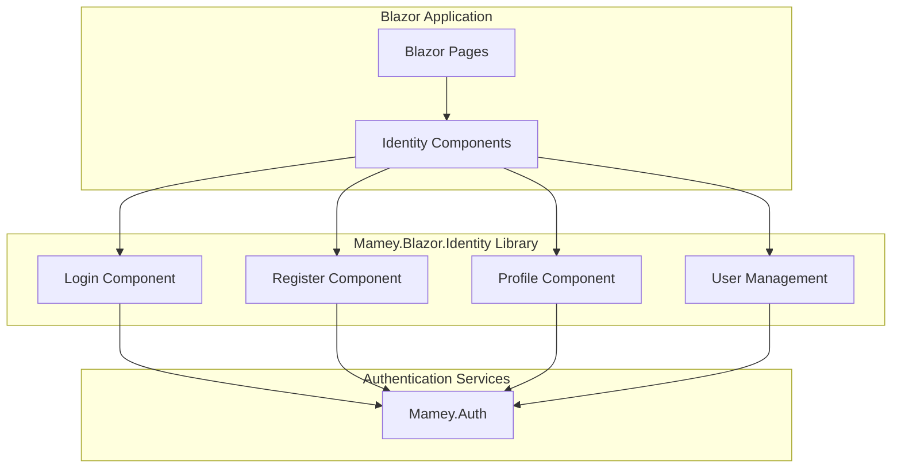

# Mamey.Blazor.Identity

**Library**: `Mamey.Blazor.Identity`  
**Location**: `Mamey/src/Mamey.Blazor.Identity/`  
**Type**: UI Library - Blazor Identity  
**Version**: 2.0.*  
**Files**: 7 C# files  
**Namespace**: `Mamey.Blazor.Identity`

## Overview

Mamey.Blazor.Identity provides identity management components and services for Blazor applications in the Mamey framework. It includes pre-built UI components for authentication, user management, and authorization.

### Conceptual Foundation

**Blazor Identity Components** provide ready-to-use UI components for identity management. Key concepts:

1. **Authentication UI**: Login and registration UI components
2. **User Management**: User profile and management UI components
3. **Authorization**: Authorization UI components
4. **Component Library**: Pre-built identity components
5. **Customizable**: Customizable identity components

**Why Mamey.Blazor.Identity?**

Provides:
- **Identity Components**: Pre-built identity components
- **Authentication UI**: Login and registration UI components
- **User Management**: User management UI components
- **Authorization**: Authorization UI components
- **Integration**: Seamless integration with Mamey.Auth

**Use Cases:**
- Blazor authentication UI
- User registration and login
- User profile management
- Authorization UI components

## Architecture

### Blazor Identity Components



## Installation

### Prerequisites

1. **.NET 9.0**: Ensure .NET 9.0 SDK is installed
2. **Blazor**: Blazor Server or Blazor WebAssembly project
3. **Mamey.Auth**: Authentication library

### NuGet Package

```bash
dotnet add package Mamey.Blazor.Identity
```

### Dependencies

- **Mamey** - Core framework
- **Mamey.Blazor.Abstractions** - Blazor abstractions
- **Mamey.Auth** - Authentication library

## Quick Start

### Basic Setup

```csharp
using Mamey.Blazor.Identity;

var builder = WebApplication.CreateBuilder(args);

builder.Services
    .AddMamey()
    .AddBlazorIdentity();

var app = builder.Build();
app.Run();
```

## Usage Examples

### Example 1: Login Component

```csharp
@using Mamey.Blazor.Identity

<LoginComponent />
```

### Example 2: Register Component

```csharp
@using Mamey.Blazor.Identity

<RegisterComponent />
```

### Example 3: User Profile Component

```csharp
@using Mamey.Blazor.Identity

<ProfileComponent />
```

## Related Libraries

- **Mamey.BlazorWasm**: Blazor WebAssembly support
- **Mamey.Auth**: Authentication integration
- **Mamey.Blazor.Abstractions**: Blazor abstractions

## Additional Resources

- [Blazor Components](https://docs.microsoft.com/aspnet/core/blazor/components/)
- [Mamey Framework Documentation](../../documentation/)
- [Mamey.Blazor.Identity Memory Documentation](../../.skmemory/v1/memory/public/mid-term/libraries/ui/mamey-blazor-identity.md)

## Tags

#blazor #identity #ui #authentication #components #mamey

