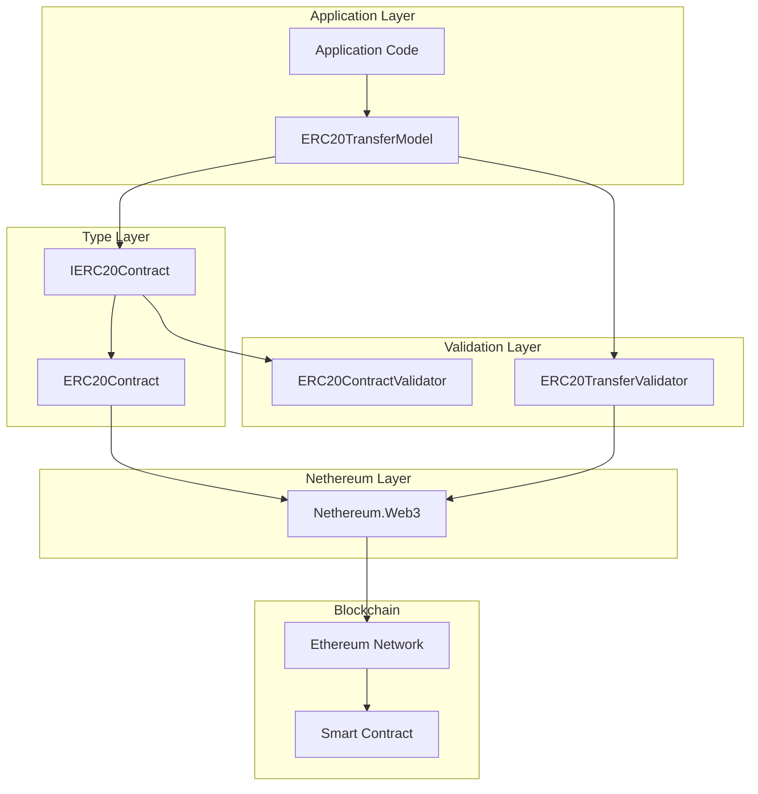
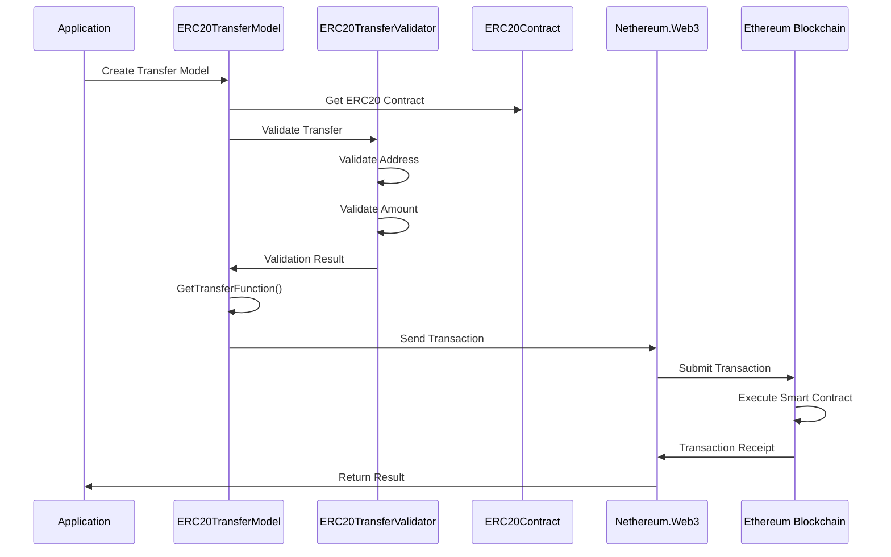
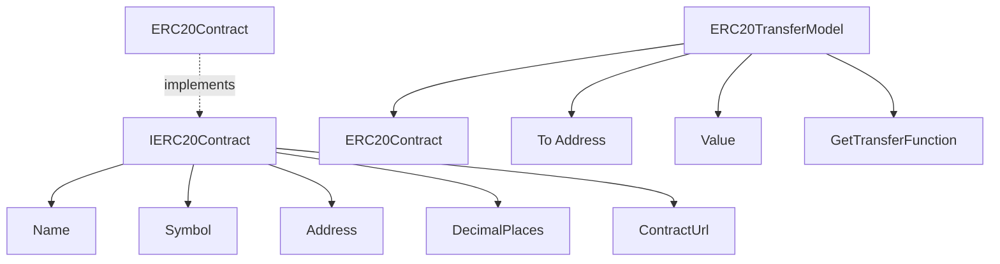

# Mamey.Blockchain

**Library**: `Mamey.Blockchain`  
**Location**: `Mamey/src/Mamey.Blockchain/`  
**Type**: Specialized Library - Blockchain Integration  
**Version**: 2.0.*  
**Files**: 5 C# files  
**Namespace**: `Mamey.Blockchain`, `Mamey.Blockchain.Types`, `Mamey.Blockchain.Validators`

## Overview

Mamey.Blockchain provides comprehensive blockchain integration capabilities for the Mamey framework, focusing on ERC20 token contracts and transactions. It uses Nethereum library for Ethereum blockchain integration and provides type-safe abstractions for ERC20 token operations.

### Conceptual Foundation

**Blockchain** is a distributed ledger technology that enables:
- **Decentralization**: No central authority controlling the network
- **Immutability**: Transactions cannot be altered once recorded
- **Transparency**: All transactions are publicly verifiable
- **Smart Contracts**: Self-executing contracts with terms written in code

**ERC20 Tokens** are Ethereum-based tokens that follow a standard interface:
- **Standard Interface**: Common functions for all ERC20 tokens
- **Fungibility**: Each token is identical and interchangeable
- **Transferability**: Tokens can be transferred between addresses
- **Balance Tracking**: Track token balances per address

**Key Concepts:**
1. **ERC20 Standard**: Ethereum token standard (ERC-20)
2. **Smart Contracts**: Self-executing contracts on blockchain
3. **Token Transfer**: Transfer tokens between addresses
4. **Wallet Management**: Create and manage blockchain wallets
5. **Transaction Processing**: Send and receive blockchain transactions
6. **Gas Fees**: Cost of executing transactions on blockchain

**Why Use Mamey.Blockchain?**
- **Type Safety**: Strongly-typed ERC20 contract interfaces
- **Validation**: Built-in validation for addresses and transfers
- **Nethereum Integration**: Uses Nethereum for Ethereum blockchain access
- **Standards Compliance**: Full ERC20 standard compliance
- **Extensibility**: Easy to extend for custom token contracts

**Use Cases:**
- ERC20 token transfers
- Token balance queries
- Smart contract interactions
- DeFi (Decentralized Finance) operations
- NFT (Non-Fungible Token) operations
- Wallet management

## Architecture

### ERC20 Contract Architecture



### ERC20 Token Transfer Flow



### ERC20 Contract Structure



## Core Components

### IERC20Contract - ERC20 Contract Interface

Interface for ERC20 token contracts:

```csharp
public interface IERC20Contract
{
    string Name { get; }
    string Symbol { get; }
    string Address { get; }
    int DecimalPlaces { get; }
    Uri ContractUrl { get; }
}
```

**Properties:**
- `Name`: Token name (e.g., "MyToken")
- `Symbol`: Token symbol (e.g., "MTK")
- `Address`: Contract address on Ethereum network
- `DecimalPlaces`: Number of decimal places (typically 18)
- `ContractUrl`: URL to contract source code or documentation

### ERC20Contract - Base Contract Class

Abstract base class for ERC20 contracts:

```csharp
public abstract class ERC20Contract : IERC20Contract
{
    public const int DEFAULT_DECIMALS = 18;

    public string Name { get; }
    public string Symbol { get; }
    public string Address { get; set; }
    public int DecimalPlaces { get; set; } = DEFAULT_DECIMALS;
    public Uri ContractUrl { get; }

    public ERC20Contract(
        string name, 
        string symbol, 
        string contractAddress, 
        string contractUrl)
    {
        Name = name;
        Symbol = symbol;
        Address = contractAddress;
        ContractUrl = new Uri(contractUrl);
    }
}
```

**Usage Example:**
```csharp
public class MyTokenContract : ERC20Contract
{
    public MyTokenContract() 
        : base(
            "MyToken",
            "MTK",
            "0x1234567890123456789012345678901234567890",
            "https://etherscan.io/address/0x1234567890123456789012345678901234567890")
    {
    }
}
```

### ERC20TransferModel<T> - Transfer Model

Generic model for ERC20 token transfers:

```csharp
public class ERC20TransferModel<T> where T : IERC20Contract, new()
{
    public T ERC20Contract { get; } = new T();
    public string To { get; set; }
    public decimal Value { get; set; }

    public TransferFunction GetTransferFunction()
    {
        return new TransferFunction()
        {
            To = To,
            Value = Web3.Convert.ToWei(Value, ERC20Contract.DecimalPlaces),
            AmountToSend = 0
        };
    }
}
```

**Key Features:**
- **Type Safety**: Generic type parameter ensures type-safe contract usage
- **Automatic Conversion**: Converts decimal values to Wei using contract's decimal places
- **Transfer Function**: Creates Nethereum `TransferFunction` for execution

### ERC20ContractValidator<T> - Contract Validator

FluentValidation validator for ERC20 contracts:

```csharp
public class ERC20ContractValidator<T> : AbstractValidator<T>
    where T : IERC20Contract
{
    public ERC20ContractValidator()
    {
        RuleFor(t => t.Address).IsEthereumAddress();
        RuleFor(t => t.DecimalPlaces).GreaterThan(0)
            .WithMessage("Decimal Places must be greater than 0");
    }
}
```

**Validation Rules:**
- **Address Validation**: Validates Ethereum address format
- **Decimal Places**: Ensures decimal places are greater than 0

### ERC20TransferValidator<T> - Transfer Validator

FluentValidation validator for ERC20 transfers:

```csharp
public class ERC20TransferValidator<T> : AbstractValidator<ERC20TransferModel<T>>
    where T : IERC20Contract, new()
{
    public ERC20TransferValidator()
    {
        RuleFor(t => t.To).IsEthereumAddress();
        RuleFor(t => t.Value).GreaterThan(0)
            .WithMessage("Amount must be greater than 0");
        RuleFor(t => t.ERC20Contract).SetValidator(new ERC20ContractValidator<T>());
    }
}
```

**Validation Rules:**
- **To Address**: Validates recipient Ethereum address
- **Value**: Ensures transfer amount is greater than 0
- **Contract Validation**: Validates ERC20 contract using contract validator

## Installation

### Prerequisites

1. **Ethereum Network**: Access to Ethereum network (mainnet or testnet)
2. **Nethereum**: Nethereum library for Ethereum integration
3. **Web3 Provider**: Web3 provider (Infura, Alchemy, or local node)
4. **.NET 9.0**: Ensure .NET 9.0 SDK is installed

### NuGet Package

```bash
dotnet add package Mamey.Blockchain
```

### Dependencies

- **Mamey** - Core framework
- **Nethereum.Web3** - Ethereum blockchain integration
- **FluentValidation** - Validation framework
- **Nethereum.UI.Validation** - Ethereum address validation

## Quick Start

### Basic Setup

```csharp
using Mamey.Blockchain;
using Mamey.Blockchain.Types;

var builder = WebApplication.CreateBuilder(args);

// Configure Mamey services
builder.Services
    .AddMamey()
    .AddBlockchain();

var app = builder.Build();
app.Run();
```

### Configuration

Add to `appsettings.json`:

```json
{
  "Blockchain": {
    "Network": "mainnet",
    "Provider": "ethereum",
    "Endpoint": "https://mainnet.infura.io/v3/your-api-key",
    "ChainId": 1
  }
}
```

## Usage Examples

### Example 1: Define ERC20 Token Contract

```csharp
using Mamey.Blockchain.Types;

// Define a specific ERC20 token contract
public class USDTContract : ERC20Contract
{
    public USDTContract() 
        : base(
            "Tether USD",
            "USDT",
            "0xdAC17F958D2ee523a2206206994597C13D831ec7", // USDT contract address
            "https://etherscan.io/token/0xdAC17F958D2ee523a2206206994597C13D831ec7")
    {
        DecimalPlaces = 6; // USDT has 6 decimals
    }
}

// Define another token contract
public class DAIContract : ERC20Contract
{
    public DAIContract() 
        : base(
            "Dai Stablecoin",
            "DAI",
            "0x6B175474E89094C44Da98b954EedeAC495271d0F", // DAI contract address
            "https://etherscan.io/token/0x6B175474E89094C44Da98b954EedeAC495271d0F")
    {
        DecimalPlaces = 18; // DAI has 18 decimals
    }
}
```

### Example 2: Create ERC20 Transfer Model

```csharp
using Mamey.Blockchain.Types;
using Nethereum.Web3;
using Nethereum.Contracts.Standards.ERC20.ContractDefinition;

public class TokenTransferService
{
    private readonly IWeb3 _web3;
    private readonly ILogger<TokenTransferService> _logger;

    public TokenTransferService(IWeb3 web3, ILogger<TokenTransferService> logger)
    {
        _web3 = web3;
        _logger = logger;
    }

    public async Task<string> TransferUSDTAsync(
        string fromAddress,
        string toAddress,
        decimal amount)
    {
        try
        {
            _logger.LogInformation(
                "Transferring USDT: {FromAddress} -> {ToAddress}, Amount: {Amount}",
                fromAddress,
                toAddress,
                amount);

            // Create transfer model
            var transferModel = new ERC20TransferModel<USDTContract>
            {
                To = toAddress,
                Value = amount
            };

            // Validate transfer
            var validator = new ERC20TransferValidator<USDTContract>();
            var validationResult = await validator.ValidateAsync(transferModel);

            if (!validationResult.IsValid)
            {
                _logger.LogWarning("Transfer validation failed: {Errors}", 
                    string.Join(", ", validationResult.Errors.Select(e => e.ErrorMessage)));
                throw new ValidationException("Transfer validation failed", validationResult.Errors);
            }

            // Get transfer function
            var transferFunction = transferModel.GetTransferFunction();

            // Get contract handler
            var contractHandler = _web3.Eth.GetContractHandler(transferModel.ERC20Contract.Address);

            // Send transaction
            var transactionReceipt = await contractHandler.SendRequestAndWaitForReceiptAsync(transferFunction);

            _logger.LogInformation(
                "USDT transfer completed: Transaction Hash: {TransactionHash}",
                transactionReceipt.TransactionHash);

            return transactionReceipt.TransactionHash;
        }
        catch (Exception ex)
        {
            _logger.LogError(ex, "Failed to transfer USDT");
            throw;
        }
    }
}
```

### Example 3: Generic Token Transfer Service

```csharp
using Mamey.Blockchain.Types;
using Mamey.Blockchain.Validators;
using Nethereum.Web3;
using Nethereum.Contracts.Standards.ERC20.ContractDefinition;

public class GenericTokenTransferService
{
    private readonly IWeb3 _web3;
    private readonly ILogger<GenericTokenTransferService> _logger;

    public GenericTokenTransferService(
        IWeb3 web3,
        ILogger<GenericTokenTransferService> logger)
    {
        _web3 = web3;
        _logger = logger;
    }

    public async Task<string> TransferTokenAsync<T>(
        string toAddress,
        decimal amount)
        where T : IERC20Contract, new()
    {
        try
        {
            // Create transfer model
            var transferModel = new ERC20TransferModel<T>
            {
                To = toAddress,
                Value = amount
            };

            // Validate transfer
            var validator = new ERC20TransferValidator<T>();
            var validationResult = await validator.ValidateAsync(transferModel);

            if (!validationResult.IsValid)
            {
                var errors = string.Join(", ", validationResult.Errors.Select(e => e.ErrorMessage));
                throw new ValidationException($"Transfer validation failed: {errors}");
            }

            // Get transfer function
            var transferFunction = transferModel.GetTransferFunction();

            // Get contract handler
            var contractHandler = _web3.Eth.GetContractHandler(transferModel.ERC20Contract.Address);

            // Send transaction
            var transactionReceipt = await contractHandler.SendRequestAndWaitForReceiptAsync(transferFunction);

            _logger.LogInformation(
                "Token transfer completed: Token {Symbol}, Amount {Amount}, Transaction {TransactionHash}",
                transferModel.ERC20Contract.Symbol,
                amount,
                transactionReceipt.TransactionHash);

            return transactionReceipt.TransactionHash;
        }
        catch (Exception ex)
        {
            _logger.LogError(ex, "Failed to transfer token");
            throw;
        }
    }
}

// Usage
var transferService = new GenericTokenTransferService(web3, logger);

// Transfer USDT
await transferService.TransferTokenAsync<USDTContract>("0x...", 100.0m);

// Transfer DAI
await transferService.TransferTokenAsync<DAIContract>("0x...", 50.0m);
```

### Example 4: Token Balance Query

```csharp
using Mamey.Blockchain.Types;
using Nethereum.Web3;
using Nethereum.Contracts.Standards.ERC20.ContractDefinition;

public class TokenBalanceService
{
    private readonly IWeb3 _web3;
    private readonly ILogger<TokenBalanceService> _logger;

    public TokenBalanceService(IWeb3 web3, ILogger<TokenBalanceService> logger)
    {
        _web3 = web3;
        _logger = logger;
    }

    public async Task<decimal> GetTokenBalanceAsync<T>(
        string address)
        where T : IERC20Contract, new()
    {
        try
        {
            var contract = new T();
            var contractHandler = _web3.Eth.GetContractHandler(contract.Address);

            // Query balance
            var balanceFunction = new BalanceOfFunction { Owner = address };
            var balance = await contractHandler.QueryAsync<BalanceOfFunction, BigInteger>(balanceFunction);

            // Convert from Wei to token units
            var balanceDecimal = Web3.Convert.FromWei(balance, contract.DecimalPlaces);

            _logger.LogInformation(
                "Token balance: Address {Address}, Token {Symbol}, Balance {Balance}",
                address,
                contract.Symbol,
                balanceDecimal);

            return balanceDecimal;
        }
        catch (Exception ex)
        {
            _logger.LogError(ex, "Failed to get token balance for address: {Address}", address);
            throw;
        }
    }

    public async Task<Dictionary<string, decimal>> GetMultipleTokenBalancesAsync(
        string address,
        params IERC20Contract[] contracts)
    {
        var balances = new Dictionary<string, decimal>();

        foreach (var contract in contracts)
        {
            var contractHandler = _web3.Eth.GetContractHandler(contract.Address);
            var balanceFunction = new BalanceOfFunction { Owner = address };
            var balance = await contractHandler.QueryAsync<BalanceOfFunction, BigInteger>(balanceFunction);
            var balanceDecimal = Web3.Convert.FromWei(balance, contract.DecimalPlaces);
            balances[contract.Symbol] = balanceDecimal;
        }

        return balances;
    }
}

// Usage
var balanceService = new TokenBalanceService(web3, logger);

// Get USDT balance
var usdtBalance = await balanceService.GetTokenBalanceAsync<USDTContract>("0x...");

// Get multiple token balances
var balances = await balanceService.GetMultipleTokenBalancesAsync(
    "0x...",
    new USDTContract(),
    new DAIContract()
);
```

### Example 5: Batch Token Transfers

```csharp
using Mamey.Blockchain.Types;
using Nethereum.Web3;
using Nethereum.Contracts.Standards.ERC20.ContractDefinition;

public class BatchTransferService
{
    private readonly IWeb3 _web3;
    private readonly ILogger<BatchTransferService> _logger;

    public BatchTransferService(IWeb3 web3, ILogger<BatchTransferService> logger)
    {
        _web3 = web3;
        _logger = logger;
    }

    public async Task<List<string>> BatchTransferAsync<T>(
        string fromAddress,
        List<TokenTransfer> transfers)
        where T : IERC20Contract, new()
    {
        var transactionHashes = new List<string>();

        try
        {
            _logger.LogInformation(
                "Initiating batch transfer: Token {Symbol}, Transfers: {Count}",
                new T().Symbol,
                transfers.Count);

            var contract = new T();
            var contractHandler = _web3.Eth.GetContractHandler(contract.Address);

            foreach (var transfer in transfers)
            {
                // Create transfer model
                var transferModel = new ERC20TransferModel<T>
                {
                    To = transfer.ToAddress,
                    Value = transfer.Amount
                };

                // Validate
                var validator = new ERC20TransferValidator<T>();
                var validationResult = await validator.ValidateAsync(transferModel);

                if (!validationResult.IsValid)
                {
                    _logger.LogWarning(
                        "Transfer validation failed: {ToAddress}, Errors: {Errors}",
                        transfer.ToAddress,
                        string.Join(", ", validationResult.Errors.Select(e => e.ErrorMessage)));
                    continue;
                }

                // Get transfer function
                var transferFunction = transferModel.GetTransferFunction();

                // Send transaction
                var transactionReceipt = await contractHandler.SendRequestAndWaitForReceiptAsync(transferFunction);

                transactionHashes.Add(transactionReceipt.TransactionHash);

                _logger.LogInformation(
                    "Transfer completed: {ToAddress}, Amount: {Amount}, Transaction: {TransactionHash}",
                    transfer.ToAddress,
                    transfer.Amount,
                    transactionReceipt.TransactionHash);
            }

            _logger.LogInformation(
                "Batch transfer completed: {SuccessfulCount} of {TotalCount} transfers",
                transactionHashes.Count,
                transfers.Count);

            return transactionHashes;
        }
        catch (Exception ex)
        {
            _logger.LogError(ex, "Batch transfer failed");
            throw;
        }
    }
}

public class TokenTransfer
{
    public string ToAddress { get; set; }
    public decimal Amount { get; set; }
}
```

### Example 6: Token Information Service

```csharp
using Mamey.Blockchain.Types;
using Nethereum.Web3;
using Nethereum.Contracts.Standards.ERC20.ContractDefinition;

public class TokenInfoService
{
    private readonly IWeb3 _web3;

    public TokenInfoService(IWeb3 web3)
    {
        _web3 = web3;
    }

    public async Task<TokenInfo> GetTokenInfoAsync<T>()
        where T : IERC20Contract, new()
    {
        var contract = new T();
        var contractHandler = _web3.Eth.GetContractHandler(contract.Address);

        // Get token name
        var nameFunction = new NameFunction();
        var name = await contractHandler.QueryAsync<NameFunction, string>(nameFunction);

        // Get token symbol
        var symbolFunction = new SymbolFunction();
        var symbol = await contractHandler.QueryAsync<SymbolFunction, string>(symbolFunction);

        // Get total supply
        var totalSupplyFunction = new TotalSupplyFunction();
        var totalSupply = await contractHandler.QueryAsync<TotalSupplyFunction, BigInteger>(totalSupplyFunction);
        var totalSupplyDecimal = Web3.Convert.FromWei(totalSupply, contract.DecimalPlaces);

        // Get decimals
        var decimalsFunction = new DecimalsFunction();
        var decimals = await contractHandler.QueryAsync<DecimalsFunction, byte>(decimalsFunction);

        return new TokenInfo
        {
            Name = name,
            Symbol = symbol,
            Address = contract.Address,
            Decimals = decimals,
            TotalSupply = totalSupplyDecimal
        };
    }
}

public class TokenInfo
{
    public string Name { get; set; }
    public string Symbol { get; set; }
    public string Address { get; set; }
    public byte Decimals { get; set; }
    public decimal TotalSupply { get; set; }
}
```

## Best Practices

### 1. Contract Address Validation

**✅ Good: Always validate contract addresses**
```csharp
var validator = new ERC20ContractValidator<USDTContract>();
var validationResult = await validator.ValidateAsync(contract);
if (!validationResult.IsValid)
{
    throw new ValidationException("Invalid contract address");
}
```

### 2. Transfer Validation

**✅ Good: Validate transfers before execution**
```csharp
var transferValidator = new ERC20TransferValidator<USDTContract>();
var validationResult = await transferValidator.ValidateAsync(transferModel);
if (!validationResult.IsValid)
{
    // Handle validation errors
}
```

### 3. Error Handling

**✅ Good: Comprehensive error handling**
```csharp
try
{
    var transactionReceipt = await contractHandler.SendRequestAndWaitForReceiptAsync(transferFunction);
}
catch (SmartContractRevertException ex)
{
    _logger.LogError(ex, "Smart contract reverted: {Reason}", ex.RevertMessage);
    // Handle contract revert
}
catch (Exception ex)
{
    _logger.LogError(ex, "Transaction failed");
    throw;
}
```

### 4. Gas Estimation

**✅ Good: Estimate gas before sending**
```csharp
var gasEstimate = await contractHandler.EstimateGasAsync(transferFunction);
// Use gas estimate or add buffer
```

### 5. Transaction Monitoring

**✅ Good: Monitor transaction status**
```csharp
var transactionReceipt = await contractHandler.SendRequestAndWaitForReceiptAsync(transferFunction);
if (transactionReceipt.Status.Value == 1)
{
    // Transaction succeeded
}
else
{
    // Transaction failed
}
```

### 6. Decimal Conversion

**✅ Good: Use contract's decimal places**
```csharp
// Conversion is handled automatically by ERC20TransferModel
var transferFunction = transferModel.GetTransferFunction();
// Value is automatically converted to Wei using contract's DecimalPlaces
```

## Troubleshooting

### Common Issues

#### Invalid Ethereum Address

**Problem**: `ValidationException: Address is not a valid Ethereum address`

**Solution**:
1. Verify address format (0x followed by 40 hex characters)
2. Use address validation: `IsEthereumAddress()`
3. Check address is not empty or null

#### Insufficient Balance

**Problem**: Transaction fails with insufficient balance.

**Solution**:
1. Check token balance before transfer
2. Verify account has enough tokens
3. Check for locked tokens or pending transactions

#### Gas Estimation Failed

**Problem**: Gas estimation fails.

**Solution**:
1. Check contract address is correct
2. Verify contract is deployed on network
3. Check network connectivity
4. Verify contract ABI matches

#### Transaction Reverted

**Problem**: Transaction status is 0 (failed).

**Solution**:
1. Check revert reason in transaction receipt
2. Verify transfer parameters are valid
3. Check contract has sufficient allowance (for `transferFrom`)
4. Verify recipient address is valid

### Debugging

Enable detailed logging:

```csharp
builder.Logging.AddConsole();
builder.Logging.SetMinimumLevel(LogLevel.Debug);
```

Check transaction status:

```csharp
var transactionReceipt = await contractHandler.SendRequestAndWaitForReceiptAsync(transferFunction);
_logger.LogInformation(
    "Transaction Status: {Status}, Gas Used: {GasUsed}, Block Number: {BlockNumber}",
    transactionReceipt.Status.Value,
    transactionReceipt.GasUsed.Value,
    transactionReceipt.BlockNumber.Value);
```

## Performance Considerations

1. **Gas Costs**: Consider gas costs for each transaction
2. **Batch Operations**: Use batch transfers when possible
3. **Balance Checks**: Cache balances when appropriate
4. **Network Latency**: Blockchain operations are network-dependent
5. **Transaction Confirmation**: Wait for block confirmations for critical operations

## Security Considerations

1. **Private Keys**: Never expose private keys in code
2. **Address Validation**: Always validate addresses before transfers
3. **Amount Validation**: Verify amounts are within acceptable ranges
4. **Transaction Monitoring**: Monitor transactions for suspicious activity
5. **Smart Contract Audits**: Audit smart contracts before deployment

## Related Libraries

- **Mamey.Web3**: Web3 integration for blockchain operations
- **Mamey.Security**: Cryptography utilities for key management
- **Nethereum**: Ethereum blockchain integration

## Additional Resources

- [ERC-20 Token Standard](https://eips.ethereum.org/EIPS/eip-20)
- [Nethereum Documentation](https://docs.nethereum.com/)
- [Ethereum Documentation](https://ethereum.org/en/developers/docs/)
- [Mamey Framework Documentation](../../documentation/)
- [Mamey.Blockchain Memory Documentation](../../.skmemory/v1/memory/public/mid-term/libraries/specialized/mamey-blockchain.md)

## Tags

#blockchain #ethereum #erc20 #smart-contracts #web3 #cryptocurrency #tokens #mamey
