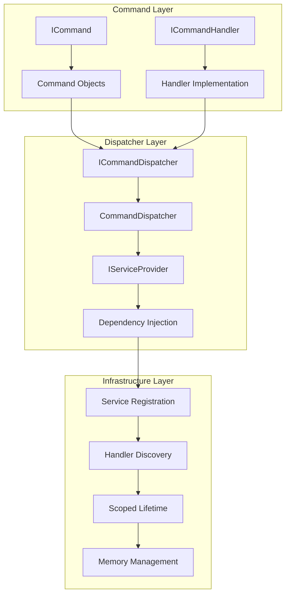
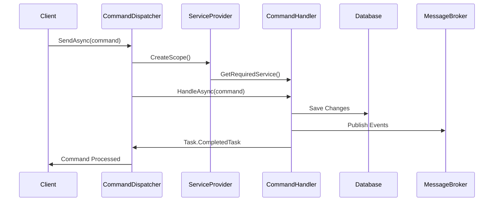
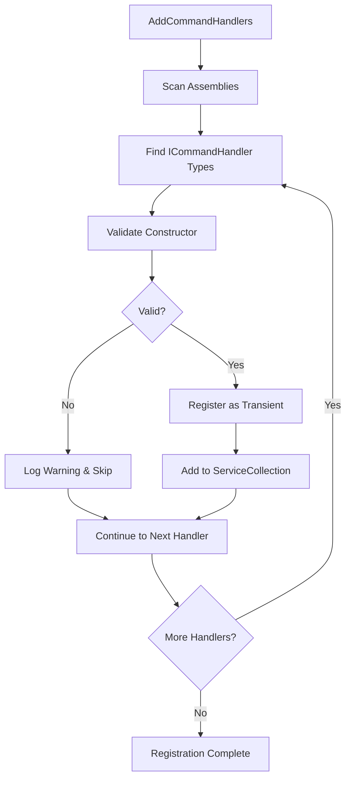

# Mamey.CQRS.Commands

The Mamey.CQRS.Commands library provides a complete implementation of the Command pattern for CQRS (Command Query Responsibility Segregation) architecture. It implements the Command pattern with dependency injection, automatic handler discovery, and support for cross-cutting concerns through decorators.

## Introduction to CQRS

**CQRS** stands for **Command Query Responsibility Segregation** — a design pattern that separates *reads* (queries) from *writes* (commands) in a system.

### Why Use CQRS?

Traditional CRUD services often conflate write and read logic, making it harder to scale, test, or reason about behaviors. CQRS introduces clear separation of concerns:

| **Action** | **Responsibility** | **Outcome** |
|---|---|---|
| Command | Makes a decision / modifies state | No return value |
| Query | Retrieves data | Returns a result |
| Event | Announces something occurred | Fire-and-forget signal |

Think of Commands as requests ("do this"), Queries as questions ("what is..."), and Events as broadcasts ("this happened").

Mamey provides robust, lightweight support for implementing this pattern using clean interfaces, dependency injection, and in-memory dispatching.

## Technical Overview

Mamey.CQRS.Commands implements several key patterns:

- **Command Pattern**: Encapsulates requests as objects, allowing for parameterization, queuing, and logging
- **Dependency Injection**: Seamless integration with .NET DI container for handler resolution
- **Auto-Discovery**: Uses reflection to automatically discover and register command handlers
- **Decorator Pattern**: Built-in support for cross-cutting concerns (logging, validation, transactions)
- **Scoped Resolution**: Each command execution creates a new DI scope for proper lifetime management

## Architecture

The library follows a layered architecture:



### CQRS Command Flow



### Command Handler Registration Flow



## Core Components

### Command Interface
- **ICommand**: Marker interface extending `IMessage` for all command objects
- **Immutable**: Commands should be immutable using `record` types
- **Serializable**: Commands can be serialized for message brokering

### Command Handlers
- **ICommandHandler<T>**: Generic interface for command processing
- **Async Support**: Full async/await support with cancellation tokens
- **Single Responsibility**: Each handler processes one command type

### Command Dispatcher
- **ICommandDispatcher**: Centralized dispatching mechanism
- **Scoped Resolution**: Creates new DI scope for each command execution
- **Error Handling**: Built-in error handling and logging

## Installation

### NuGet Package
```bash
dotnet add package Mamey.CQRS.Commands
```

### Prerequisites
- .NET 9.0 or later
- Mamey (core framework)

## Key Features

- **Command Pattern**: Clean separation of commands from business logic
- **Async Support**: Full async/await support for command handling
- **Dependency Injection**: Seamless integration with .NET DI container
- **Auto-Discovery**: Automatic registration of command handlers
- **Decorator Pattern**: Support for cross-cutting concerns
- **Cancellation Support**: Built-in cancellation token support

## Quick Start

### Basic Setup

```csharp
using Mamey;
using Mamey.CQRS.Commands;

var builder = WebApplication.CreateBuilder(args);

// Create Mamey builder
var mameyBuilder = MameyBuilder.Create(builder.Services, builder.Configuration);

// Add command handlers and dispatcher
mameyBuilder
    .AddCommandHandlers()
    .AddInMemoryCommandDispatcher();

var app = builder.Build();
app.Run();
```

### Define Commands

```csharp
using Mamey.CQRS.Commands;

// Simple command
public record CreateUserCommand(string Name, string Email) : ICommand;

// Complex command with validation
public record UpdateUserCommand(Guid UserId, string Name, string Email) : ICommand;

// Command with result
public record ProcessOrderCommand(Guid OrderId, decimal Amount) : ICommand;
```

### Implement Command Handlers

```csharp
using Mamey.CQRS.Commands;

public class CreateUserCommandHandler : ICommandHandler<CreateUserCommand>
{
    private readonly IUserRepository _userRepository;
    private readonly ILogger<CreateUserCommandHandler> _logger;

    public CreateUserCommandHandler(
        IUserRepository userRepository,
        ILogger<CreateUserCommandHandler> logger)
    {
        _userRepository = userRepository;
        _logger = logger;
    }

    public async Task HandleAsync(CreateUserCommand command, CancellationToken cancellationToken = default)
    {
        _logger.LogInformation("Creating user: {Name} ({Email})", command.Name, command.Email);
        
        var user = new User(Guid.NewGuid(), command.Name, command.Email);
        await _userRepository.AddAsync(user);
        
        _logger.LogInformation("User created successfully: {UserId}", user.Id);
    }
}

public class UpdateUserCommandHandler : ICommandHandler<UpdateUserCommand>
{
    private readonly IUserRepository _userRepository;

    public UpdateUserCommandHandler(IUserRepository userRepository)
    {
        _userRepository = userRepository;
    }

    public async Task HandleAsync(UpdateUserCommand command, CancellationToken cancellationToken = default)
    {
        var user = await _userRepository.GetByIdAsync(command.UserId);
        if (user == null)
            throw new UserNotFoundException(command.UserId);

        user.UpdateName(command.Name);
        user.UpdateEmail(command.Email);
        
        await _userRepository.UpdateAsync(user);
    }
}
```

### Dispatch Commands

```csharp
using Mamey.CQRS.Commands;

public class UserController : ControllerBase
{
    private readonly ICommandDispatcher _commandDispatcher;

    public UserController(ICommandDispatcher commandDispatcher)
    {
        _commandDispatcher = commandDispatcher;
    }

    [HttpPost]
    public async Task<IActionResult> CreateUser(CreateUserRequest request)
    {
        var command = new CreateUserCommand(request.Name, request.Email);
        await _commandDispatcher.SendAsync(command);
        return Ok();
    }

    [HttpPut("{id}")]
    public async Task<IActionResult> UpdateUser(Guid id, UpdateUserRequest request)
    {
        var command = new UpdateUserCommand(id, request.Name, request.Email);
        await _commandDispatcher.SendAsync(command);
        return NoContent();
    }
}
```

## API Reference

### Core Interfaces

#### ICommand

Marker interface for all commands.

```csharp
public interface ICommand : IMessage
{
}
```

**Usage:**
```csharp
public record CreateUserCommand(string Name, string Email) : ICommand;
public record UpdateUserCommand(Guid UserId, string Name) : ICommand;
public record DeleteUserCommand(Guid UserId) : ICommand;
```

#### ICommandHandler<TCommand>

Interface for command handlers. This is the core abstraction for implementing command processing logic.

```csharp
public interface ICommandHandler<in TCommand> where TCommand : class, ICommand
{
    Task HandleAsync(TCommand command, CancellationToken cancellationToken = default);
}
```

**Generic Parameters:**
- `TCommand`: The type of command to handle (must implement `ICommand`)

**Methods:**
- `HandleAsync(TCommand command, CancellationToken cancellationToken = default)`: Handles the command asynchronously

**Implementation Requirements:**
- **Single Responsibility**: Each handler should process only one command type
- **Async Operations**: Use async/await for all I/O operations
- **Error Handling**: Handle exceptions appropriately and let business exceptions bubble up
- **Idempotency**: Consider making handlers idempotent when possible
- **Validation**: Validate command data before processing

**Lifetime Management:**
- Handlers are registered with `Transient` lifetime by default
- Each command execution gets a new handler instance
- Use `AddScopedCommandHandlers()` for scoped lifetime if needed

#### ICommandDispatcher

Interface for command dispatching.

```csharp
public interface ICommandDispatcher
{
    Task SendAsync<T>(T command, CancellationToken cancellationToken = default) where T : class, ICommand;
}
```

**Methods:**
- `SendAsync<T>(T command, CancellationToken cancellationToken = default)`: Sends a command to its handler

### Core Classes

#### CommandDispatcher

Default implementation of command dispatcher.

```csharp
internal sealed class CommandDispatcher : ICommandDispatcher
{
    public CommandDispatcher(IServiceProvider serviceProvider);
    public async Task SendAsync<TCommand>(TCommand command, CancellationToken cancellationToken = default) 
        where TCommand : class, ICommand;
}
```

**Features:**
- **Scoped Resolution**: Creates a new scope for each command
- **Handler Resolution**: Automatically resolves the appropriate handler
- **Error Handling**: Built-in error handling and logging

### Extension Methods

#### AddCommandHandlers

Registers command handlers with transient lifetime.

```csharp
public static IMameyBuilder AddCommandHandlers(this IMameyBuilder builder, IEnumerable<Assembly>? assemblies = null)
```

**Parameters:**
- `builder`: The Mamey builder
- `assemblies`: Optional assemblies to scan (defaults to current domain assemblies)

**Returns:**
- `IMameyBuilder`: The builder for chaining

#### AddScopedCommandHandlers

Registers command handlers with scoped lifetime.

```csharp
public static IMameyBuilder AddScopedCommandHandlers(this IMameyBuilder builder, IEnumerable<Assembly>? assemblies = null)
```

#### AddInMemoryCommandDispatcher

Registers the in-memory command dispatcher.

```csharp
public static IMameyBuilder AddInMemoryCommandDispatcher(this IMameyBuilder builder)
```

## Usage Examples

### Example 1: Simple Command Handler

```csharp
using Mamey.CQRS.Commands;

public class SendEmailCommand : ICommand
{
    public string To { get; init; }
    public string Subject { get; init; }
    public string Body { get; init; }
}

public class SendEmailCommandHandler : ICommandHandler<SendEmailCommand>
{
    private readonly IEmailService _emailService;

    public SendEmailCommandHandler(IEmailService emailService)
    {
        _emailService = emailService;
    }

    public async Task HandleAsync(SendEmailCommand command, CancellationToken cancellationToken = default)
    {
        await _emailService.SendAsync(command.To, command.Subject, command.Body);
    }
}

// Usage
public class EmailController : ControllerBase
{
    private readonly ICommandDispatcher _dispatcher;

    public EmailController(ICommandDispatcher dispatcher)
    {
        _dispatcher = dispatcher;
    }

    [HttpPost("send")]
    public async Task<IActionResult> SendEmail(SendEmailRequest request)
    {
        var command = new SendEmailCommand
        {
            To = request.To,
            Subject = request.Subject,
            Body = request.Body
        };

        await _dispatcher.SendAsync(command);
        return Ok();
    }
}
```

### Example 2: Command with Validation and Business Rules

```csharp
using Mamey.CQRS.Commands;
using System.ComponentModel.DataAnnotations;

public class CreateProductCommand : ICommand
{
    [Required(ErrorMessage = "Product name is required")]
    [StringLength(100, MinimumLength = 3, ErrorMessage = "Product name must be between 3 and 100 characters")]
    public string Name { get; init; } = string.Empty;

    [Required(ErrorMessage = "Product description is required")]
    [StringLength(500, MinimumLength = 10, ErrorMessage = "Product description must be between 10 and 500 characters")]
    public string Description { get; init; } = string.Empty;

    [Range(0.01, double.MaxValue, ErrorMessage = "Price must be greater than zero")]
    public decimal Price { get; init; }

    [Range(0, int.MaxValue, ErrorMessage = "Stock cannot be negative")]
    public int Stock { get; init; }

    [Required(ErrorMessage = "Category ID is required")]
    public Guid CategoryId { get; init; }
}

public class CreateProductCommandHandler : ICommandHandler<CreateProductCommand>
{
    private readonly IProductRepository _repository;
    private readonly ICategoryRepository _categoryRepository;
    private readonly IValidator<CreateProductCommand> _validator;
    private readonly ILogger<CreateProductCommandHandler> _logger;

    public CreateProductCommandHandler(
        IProductRepository repository,
        ICategoryRepository categoryRepository,
        IValidator<CreateProductCommand> validator,
        ILogger<CreateProductCommandHandler> logger)
    {
        _repository = repository;
        _categoryRepository = categoryRepository;
        _validator = validator;
        _logger = logger;
    }

    public async Task HandleAsync(CreateProductCommand command, CancellationToken cancellationToken = default)
    {
        _logger.LogInformation("Creating product: {ProductName}", command.Name);

        // Validate command using FluentValidation
        var validationResult = await _validator.ValidateAsync(command, cancellationToken);
        if (!validationResult.IsValid)
        {
            _logger.LogWarning("Validation failed for product: {ProductName}. Errors: {Errors}", 
                command.Name, string.Join(", ", validationResult.Errors.Select(e => e.ErrorMessage)));
            throw new ValidationException(validationResult.Errors);
        }

        // Business rule: Check if category exists
        var category = await _categoryRepository.GetByIdAsync(command.CategoryId, cancellationToken);
        if (category == null)
        {
            _logger.LogWarning("Category not found: {CategoryId}", command.CategoryId);
            throw new CategoryNotFoundException(command.CategoryId);
        }

        // Business rule: Check for duplicate product names
        var existingProduct = await _repository.GetByNameAsync(command.Name, cancellationToken);
        if (existingProduct != null)
        {
            _logger.LogWarning("Product with name already exists: {ProductName}", command.Name);
            throw new ProductNameAlreadyExistsException(command.Name);
        }

        // Create product aggregate
        var productId = new ProductId(Guid.NewGuid());
        var product = new Product(productId, command.Name, command.Description, command.Price, command.Stock, command.CategoryId);
        
        // Save product
        await _repository.AddAsync(product, cancellationToken);
        
        _logger.LogInformation("Product created successfully: {ProductId} - {ProductName}", productId, command.Name);
    }
}

// Custom exceptions for business rules
public class CategoryNotFoundException : Exception
{
    public CategoryNotFoundException(Guid categoryId) : base($"Category with ID {categoryId} not found")
    {
        CategoryId = categoryId;
    }
    
    public Guid CategoryId { get; }
}

public class ProductNameAlreadyExistsException : Exception
{
    public ProductNameAlreadyExistsException(string productName) : base($"Product with name '{productName}' already exists")
    {
        ProductName = productName;
    }
    
    public string ProductName { get; }
}
```

**Key Technical Points:**
- **Validation**: Uses both `DataAnnotations` and `FluentValidation` for comprehensive validation
- **Business Rules**: Enforced through explicit checks and custom exceptions
- **Logging**: Structured logging with relevant context information
- **Error Handling**: Custom exceptions with meaningful error messages
- **Async Operations**: All I/O operations are properly awaited
- **Cancellation Support**: Proper cancellation token usage throughout

### Example 3: Command with Events

```csharp
using Mamey.CQRS.Commands;
using Mamey.CQRS.Events;

public class ProcessOrderCommand : ICommand
{
    public Guid OrderId { get; init; }
    public decimal Amount { get; init; }
    public string PaymentMethod { get; init; }
}

public class ProcessOrderCommandHandler : ICommandHandler<ProcessOrderCommand>
{
    private readonly IOrderRepository _orderRepository;
    private readonly IPaymentService _paymentService;
    private readonly IEventDispatcher _eventDispatcher;

    public ProcessOrderCommandHandler(
        IOrderRepository orderRepository,
        IPaymentService paymentService,
        IEventDispatcher eventDispatcher)
    {
        _orderRepository = orderRepository;
        _paymentService = paymentService;
        _eventDispatcher = eventDispatcher;
    }

    public async Task HandleAsync(ProcessOrderCommand command, CancellationToken cancellationToken = default)
    {
        var order = await _orderRepository.GetByIdAsync(command.OrderId);
        if (order == null)
            throw new OrderNotFoundException(command.OrderId);

        // Process payment
        var paymentResult = await _paymentService.ProcessPaymentAsync(
            command.Amount, 
            command.PaymentMethod, 
            cancellationToken);

        if (paymentResult.Success)
        {
            order.MarkAsPaid();
            await _orderRepository.UpdateAsync(order);

            // Publish event
            await _eventDispatcher.PublishAsync(new OrderPaidEvent(order.Id, paymentResult.TransactionId));
        }
        else
        {
            order.MarkAsPaymentFailed(paymentResult.ErrorMessage);
            await _orderRepository.UpdateAsync(order);

            // Publish event
            await _eventDispatcher.PublishAsync(new OrderPaymentFailedEvent(order.Id, paymentResult.ErrorMessage));
        }
    }
}
```

### Example 4: Command Decorator

```csharp
using Mamey.CQRS.Commands;
using Mamey.Types;

[Decorator]
public class LoggingCommandHandlerDecorator<TCommand> : ICommandHandler<TCommand> 
    where TCommand : class, ICommand
{
    private readonly ICommandHandler<TCommand> _handler;
    private readonly ILogger<LoggingCommandHandlerDecorator<TCommand>> _logger;

    public LoggingCommandHandlerDecorator(
        ICommandHandler<TCommand> handler,
        ILogger<LoggingCommandHandlerDecorator<TCommand>> logger)
    {
        _handler = handler;
        _logger = logger;
    }

    public async Task HandleAsync(TCommand command, CancellationToken cancellationToken = default)
    {
        var commandName = typeof(TCommand).Name;
        _logger.LogInformation("Handling command: {CommandName}", commandName);

        try
        {
            await _handler.HandleAsync(command, cancellationToken);
            _logger.LogInformation("Command handled successfully: {CommandName}", commandName);
        }
        catch (Exception ex)
        {
            _logger.LogError(ex, "Error handling command: {CommandName}", commandName);
            throw;
        }
    }
}
```

## Integration Patterns

### Integration with Other Mamey Libraries

The CQRS Commands library integrates seamlessly with other Mamey libraries:

- **Mamey.CQRS.Events**: Commands can trigger domain events
- **Mamey.MessageBrokers**: Commands can be sent via message brokers
- **Mamey.Persistence**: Commands can interact with repositories
- **Mamey.Logging**: Built-in logging support for command handlers

### Integration with ASP.NET Core

```csharp
// Program.cs
var builder = WebApplication.CreateBuilder(args);

var mameyBuilder = MameyBuilder.Create(builder.Services, builder.Configuration);
mameyBuilder
    .AddCommandHandlers()
    .AddInMemoryCommandDispatcher();

var app = builder.Build();

// Controller
[ApiController]
[Route("api/[controller]")]
public class OrdersController : ControllerBase
{
    private readonly ICommandDispatcher _commandDispatcher;

    public OrdersController(ICommandDispatcher commandDispatcher)
    {
        _commandDispatcher = commandDispatcher;
    }

    [HttpPost]
    public async Task<IActionResult> CreateOrder(CreateOrderRequest request)
    {
        var command = new CreateOrderCommand(
            request.CustomerId,
            request.Items,
            request.ShippingAddress);

        await _commandDispatcher.SendAsync(command);
        return Ok();
    }
}
```

### Integration with MediatR

```csharp
// If you want to use MediatR alongside Mamey
public class MediatRCommandDispatcher : ICommandDispatcher
{
    private readonly IMediator _mediator;

    public MediatRCommandDispatcher(IMediator mediator)
    {
        _mediator = mediator;
    }

    public async Task SendAsync<T>(T command, CancellationToken cancellationToken = default) 
        where T : class, ICommand
    {
        await _mediator.Send(command, cancellationToken);
    }
}
```

## Configuration Reference

### Service Registration

```csharp
// Register command handlers
mameyBuilder.AddCommandHandlers();

// Register with specific assemblies
mameyBuilder.AddCommandHandlers(new[] { typeof(Program).Assembly });

// Register with scoped lifetime
mameyBuilder.AddScopedCommandHandlers();

// Register command dispatcher
mameyBuilder.AddInMemoryCommandDispatcher();
```

### Custom Command Dispatcher

```csharp
// Register custom dispatcher
builder.Services.AddSingleton<ICommandDispatcher, CustomCommandDispatcher>();

public class CustomCommandDispatcher : ICommandDispatcher
{
    public async Task SendAsync<T>(T command, CancellationToken cancellationToken = default) 
        where T : class, ICommand
    {
        // Custom implementation
    }
}
```

## Best Practices

1. **Command Naming**: Use descriptive names ending with "Command" (e.g., `CreateUserCommand`)
2. **Single Responsibility**: Each command should represent a single business operation
3. **Immutable Commands**: Make commands immutable using `record` types
4. **Validation**: Validate commands before processing
5. **Error Handling**: Handle errors appropriately in command handlers
6. **Logging**: Add logging for command processing
7. **Testing**: Write unit tests for command handlers
8. **Async Operations**: Use async/await for all I/O operations

## Troubleshooting

### Common Issues

**Handler Not Found**: Ensure the command handler is registered and implements `ICommandHandler<T>`

**Circular Dependencies**: Avoid circular dependencies in command handlers

**Validation Errors**: Ensure proper validation attributes are applied to command properties

**Async Deadlocks**: Use `ConfigureAwait(false)` when calling external async methods

### Debugging

Enable detailed logging to troubleshoot issues:

```csharp
builder.Logging.AddConsole();
builder.Logging.SetMinimumLevel(LogLevel.Debug);
```

## Related Libraries

- [Mamey.CQRS.Events](CQRS.Events/README.md) - Event handling and dispatching
- [Mamey.CQRS.Queries](CQRS.Queries/README.md) - Query pattern implementation
- [Mamey.MessageBrokers](MessageBrokers/README.md) - Message broker integration
- [Mamey.Microservice.Infrastructure](Microservice.Infrastructure/README.md) - Microservice infrastructure

## Additional Resources

- [CQRS Pattern Guide](../guides/cqrs-pattern.md)
- [Command Pattern Best Practices](../guides/command-pattern-best-practices.md)
- [Testing Commands](../guides/testing-commands.md)
