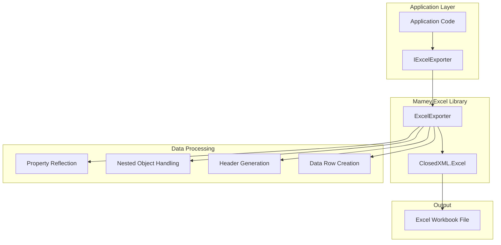
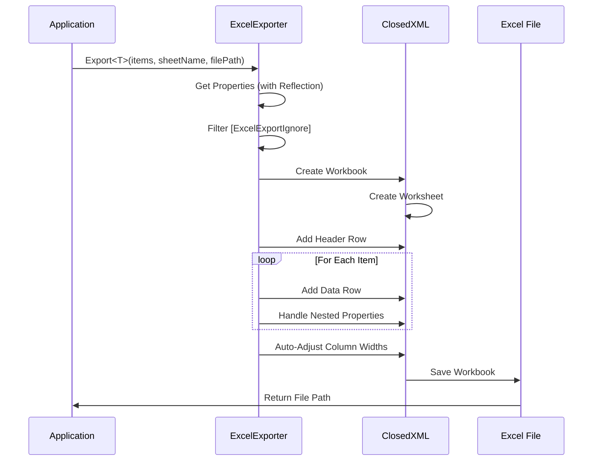
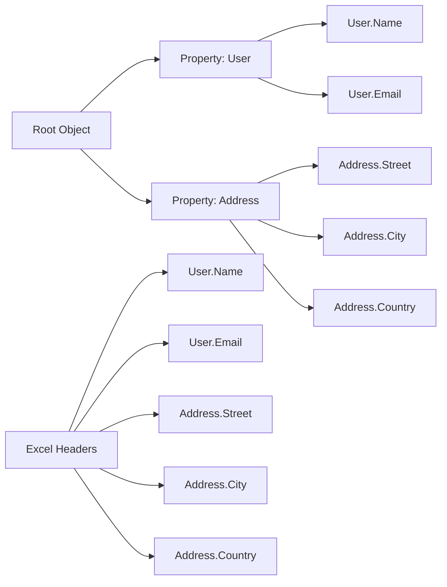

# Mamey.Excel

**Library**: `Mamey.Excel`  
**Location**: `Mamey/src/Mamey.Excel/`  
**Type**: Document Processing Library - Excel Export  
**Version**: 2.0.*  
**Files**: 2 C# files  
**Namespace**: `Mamey.Excel`

## Overview

Mamey.Excel provides comprehensive Excel file generation and export capabilities for the Mamey framework. It uses ClosedXML library to create Excel workbooks programmatically, supporting single and multiple worksheets, nested object properties, and flexible formatting options.

### Conceptual Foundation

**Excel Files** are spreadsheet documents used for data organization, analysis, and reporting. Key concepts:

1. **Workbook**: The Excel file containing one or more worksheets
2. **Worksheet**: Individual sheet within a workbook (also called "Sheet")
3. **Cells**: Individual data cells organized in rows and columns
4. **Headers**: Column headers in the first row
5. **Data Rows**: Data rows following the header row
6. **Nested Objects**: Support for complex object hierarchies
7. **Formatting**: Cell styling, fonts, and appearance

**Why Mamey.Excel?**

Provides:
- **Simple Export**: One-line export of collections to Excel
- **Multiple Worksheets**: Support for multiple sheets in one workbook
- **Nested Objects**: Automatic handling of nested object properties
- **Flexible Formatting**: Configurable headers and cell formatting
- **Type Safety**: Strongly-typed export with generics
- **Attribute-Based**: Use `[ExcelExportIgnore]` to exclude properties

**Use Cases:**
- Data export to Excel format
- Report generation
- Bulk data downloads
- Multi-sheet workbooks
- Complex object hierarchies

## Architecture

### Excel Export Architecture



### Export Flow



### Nested Object Handling



## Core Components

### IExcelExporter - Export Interface

Interface for Excel export operations:

```csharp
public interface IExcelExporter
{
    /// <summary>
    /// Export multiple collections to different sheets in a single workbook
    /// </summary>
    void ExportMultipleSheets<T>(
        IDictionary<string, IEnumerable<T>> workbookSheets,
        string filePath,
        bool capitalizedHeaders = false);

    /// <summary>
    /// Export a single collection to a worksheet
    /// </summary>
    void Export<T>(
        IEnumerable<T> items,
        string sheetName,
        string filePath,
        bool capitalizedHeaders = false);
}
```

### ExcelExporter - Export Implementation

Implementation of `IExcelExporter` using ClosedXML:

```csharp
public class ExcelExporter : IExcelExporter
{
    public void ExportMultipleSheets<T>(
        IDictionary<string, IEnumerable<T>> workbookSheets,
        string filePath,
        bool capitalizedHeaders = false);

    public void Export<T>(
        IEnumerable<T> items,
        string sheetName,
        string filePath,
        bool capitalizedHeaders = false);

    // Internal methods for worksheet creation
    private void AddDataToWorksheet<T>(
        XLWorkbook workbook,
        IEnumerable<T> items,
        string sheetName,
        bool capitalizedHeaders = false);

    private void CreateHeaderRow(
        IXLWorksheet worksheet,
        PropertyInfo[] properties,
        bool capitalizedHeaders);

    private void CreateDataRow<T>(
        IXLWorksheet worksheet,
        PropertyInfo[] properties,
        T item,
        int rowNumber);
}
```

**Key Features:**
- **Property Reflection**: Automatically discovers properties via reflection
- **Nested Objects**: Handles nested object properties (up to 3 levels deep)
- **Attribute Support**: Respects `[ExcelExportIgnore]` attribute
- **Auto-Sizing**: Automatically adjusts column widths
- **Header Formatting**: Bold headers with optional capitalization
- **Date Formatting**: Formats `DateTime` properties as short dates
- **Enum Support**: Converts enum values to strings

### ExcelExportIgnore - Attribute

Attribute to exclude properties from Excel export:

```csharp
[AttributeUsage(AttributeTargets.Property, AllowMultiple = false)]
public class ExcelExportIgnore : Attribute
{
}
```

**Usage:**
```csharp
public class User
{
    public string Name { get; set; }
    public string Email { get; set; }
    
    [ExcelExportIgnore]
    public string Password { get; set; } // Won't be exported
    
    [ExcelExportIgnore]
    public byte[] ProfilePicture { get; set; } // Won't be exported
}
```

## Installation

### Prerequisites

1. **ClosedXML**: ClosedXML library for Excel generation
2. **.NET 9.0**: Ensure .NET 9.0 SDK is installed
3. **Mamey**: Core Mamey framework

### NuGet Package

```bash
dotnet add package Mamey.Excel
```

### Dependencies

- **Mamey** - Core framework
- **ClosedXML.Excel** - Excel file generation library
- **Microsoft.Extensions.DependencyInjection** - Dependency injection

## Quick Start

### Basic Setup

```csharp
using Mamey;
using Mamey.Excel;
using Microsoft.Extensions.DependencyInjection;

var builder = WebApplication.CreateBuilder(args);

// Add Excel services
builder.Services
    .AddMamey()
    .AddExcel();

// Register ExcelExporter
builder.Services.AddScoped<IExcelExporter, ExcelExporter>();

var app = builder.Build();
app.Run();
```

## Usage Examples

### Example 1: Simple Export

```csharp
using Mamey.Excel;

public class ReportService
{
    private readonly IExcelExporter _excelExporter;
    private readonly ILogger<ReportService> _logger;

    public ReportService(IExcelExporter excelExporter, ILogger<ReportService> logger)
    {
        _excelExporter = excelExporter;
        _logger = logger;
    }

    public void ExportUsersToExcel(List<User> users, string filePath)
    {
        try
        {
            _logger.LogInformation("Exporting {Count} users to Excel", users.Count);

            _excelExporter.Export(users, "Users", filePath);

            _logger.LogInformation("Successfully exported users to {FilePath}", filePath);
        }
        catch (Exception ex)
        {
            _logger.LogError(ex, "Failed to export users to Excel");
            throw;
        }
    }
}

public class User
{
    public string Name { get; set; }
    public string Email { get; set; }
    public DateTime CreatedAt { get; set; }
    public bool IsActive { get; set; }
}
```

### Example 2: Export with Capitalized Headers

```csharp
public class ReportService
{
    private readonly IExcelExporter _excelExporter;

    public void ExportUsersWithCapitalizedHeaders(List<User> users, string filePath)
    {
        // Headers will be: NAME, EMAIL, CREATEDAT, ISACTIVE
        _excelExporter.Export(users, "Users", filePath, capitalizedHeaders: true);
    }
}
```

### Example 3: Multiple Worksheets

```csharp
public class ReportService
{
    private readonly IExcelExporter _excelExporter;

    public void ExportMultipleSheets(
        List<User> users,
        List<Order> orders,
        List<Product> products,
        string filePath)
    {
        var sheets = new Dictionary<string, IEnumerable<object>>
        {
            { "Users", users.Cast<object>() },
            { "Orders", orders.Cast<object>() },
            { "Products", products.Cast<object>() }
        };

        // Note: For multiple sheets with different types, you may need to use
        // ExportMultipleSheets with a common base type or use object
        _excelExporter.ExportMultipleSheets<object>(
            sheets.ToDictionary(kvp => kvp.Key, kvp => kvp.Value),
            filePath);
    }
}
```

### Example 4: Nested Objects

```csharp
public class User
{
    public string Name { get; set; }
    public string Email { get; set; }
    public Address Address { get; set; } // Nested object
    public Company Company { get; set; } // Nested object
}

public class Address
{
    public string Street { get; set; }
    public string City { get; set; }
    public string Country { get; set; }
}

public class Company
{
    public string Name { get; set; }
    public string Industry { get; set; }
}

// Export will create columns:
// Name, Email, Address.Street, Address.City, Address.Country, Company.Name, Company.Industry
public void ExportUsersWithNestedObjects(List<User> users, string filePath)
{
    _excelExporter.Export(users, "Users", filePath);
}
```

### Example 5: Using ExcelExportIgnore Attribute

```csharp
public class User
{
    public string Name { get; set; }
    public string Email { get; set; }
    
    [ExcelExportIgnore]
    public string Password { get; set; } // Won't appear in Excel
    
    [ExcelExportIgnore]
    public byte[] ProfilePicture { get; set; } // Won't appear in Excel
    
    public DateTime CreatedAt { get; set; }
}

// Export will only include: Name, Email, CreatedAt
public void ExportUsersWithoutSensitiveData(List<User> users, string filePath)
{
    _excelExporter.Export(users, "Users", filePath);
}
```

### Example 6: ASP.NET Core Controller Export

```csharp
[ApiController]
[Route("api/[controller]")]
public class ReportsController : ControllerBase
{
    private readonly IExcelExporter _excelExporter;
    private readonly IUserRepository _userRepository;
    private readonly ILogger<ReportsController> _logger;

    public ReportsController(
        IExcelExporter excelExporter,
        IUserRepository userRepository,
        ILogger<ReportsController> logger)
    {
        _excelExporter = excelExporter;
        _userRepository = userRepository;
        _logger = logger;
    }

    [HttpGet("users/export")]
    public async Task<IActionResult> ExportUsers()
    {
        try
        {
            var users = await _userRepository.GetAllAsync();
            
            // Create temporary file
            var tempFile = Path.GetTempFileName();
            var excelFile = Path.ChangeExtension(tempFile, ".xlsx");
            File.Move(tempFile, excelFile);

            // Export to Excel
            _excelExporter.Export(users, "Users", excelFile);

            // Read file and return
            var fileBytes = await File.ReadAllBytesAsync(excelFile);
            File.Delete(excelFile); // Clean up

            return File(
                fileBytes,
                "application/vnd.openxmlformats-officedocument.spreadsheetml.sheet",
                "users.xlsx");
        }
        catch (Exception ex)
        {
            _logger.LogError(ex, "Failed to export users");
            return StatusCode(500, "Failed to export users");
        }
    }
}
```

### Example 7: Streaming Export for Large Datasets

```csharp
public class LargeDatasetExportService
{
    private readonly IExcelExporter _excelExporter;
    private readonly ILogger<LargeDatasetExportService> _logger;

    public async Task ExportLargeDatasetAsync(
        IAsyncEnumerable<User> users,
        string filePath)
    {
        // Convert async enumerable to list in batches
        var batch = new List<User>();
        const int batchSize = 10000;

        _excelExporter.Export(batch, "Users", filePath);

        await foreach (var user in users)
        {
            batch.Add(user);

            if (batch.Count >= batchSize)
            {
                // Export batch and clear
                _excelExporter.Export(batch, "Users", filePath);
                batch.Clear();
                _logger.LogInformation("Exported batch of {Count} users", batchSize);
            }
        }

        // Export remaining items
        if (batch.Count > 0)
        {
            _excelExporter.Export(batch, "Users", filePath);
        }
    }
}
```

### Example 8: Complex Nested Objects (3 Levels)

```csharp
public class Organization
{
    public string Name { get; set; }
    public Address Headquarters { get; set; }
    public List<Department> Departments { get; set; }
}

public class Department
{
    public string Name { get; set; }
    public Manager Manager { get; set; }
}

public class Manager
{
    public string Name { get; set; }
    public string Email { get; set; }
}

// Export will create columns for nested properties:
// Name, Headquarters.Street, Headquarters.City, etc.
public void ExportOrganizations(List<Organization> organizations, string filePath)
{
    _excelExporter.Export(organizations, "Organizations", filePath);
}
```

### Example 9: Date Formatting

```csharp
public class Event
{
    public string Title { get; set; }
    public DateTime StartDate { get; set; } // Will be formatted as short date
    public DateTime? EndDate { get; set; } // Nullable dates are handled
    public TimeSpan Duration { get; set; } // TimeSpan is converted to string
}

// DateTime properties are automatically formatted as short dates
public void ExportEvents(List<Event> events, string filePath)
{
    _excelExporter.Export(events, "Events", filePath);
}
```

### Example 10: Enum Support

```csharp
public enum UserStatus
{
    Active,
    Inactive,
    Suspended
}

public class User
{
    public string Name { get; set; }
    public UserStatus Status { get; set; } // Enum is converted to string
}

// Status column will contain: "Active", "Inactive", or "Suspended"
public void ExportUsersWithEnums(List<User> users, string filePath)
{
    _excelExporter.Export(users, "Users", filePath);
}
```

## Extension Methods

### AddExcel

Registers Excel services with the service collection:

```csharp
public static IServiceCollection AddExcel(this IServiceCollection services)
```

**Features:**
- Registers Excel services
- No additional configuration required

**Usage:**
```csharp
builder.Services
    .AddMamey()
    .AddExcel();
```

## Advanced Features

### Property Ordering

Properties are automatically ordered alphabetically by name. Nested properties are flattened with dot notation (e.g., `Address.Street`).

### Supported Property Types

- **Primitive Types**: `string`, `int`, `long`, `decimal`, `bool`, etc.
- **DateTime**: Formatted as short date
- **Nullable Types**: `DateTime?`, `int?`, etc.
- **Enums**: Converted to string representation
- **Nested Objects**: Flattened with dot notation
- **Collections**: Not directly supported (use nested objects)

### Unsupported Features

- **Collections/Arrays**: Direct export of collections is not supported
- **Custom Formatting**: Limited formatting options (headers are bold)
- **Formulas**: Excel formulas are not supported
- **Charts**: Chart generation is not supported
- **Images**: Image insertion is not supported
- **Conditional Formatting**: Conditional formatting is not supported

## Best Practices

### 1. Use ExcelExportIgnore for Sensitive Data

**✅ Good: Exclude sensitive properties**
```csharp
public class User
{
    public string Name { get; set; }
    public string Email { get; set; }
    
    [ExcelExportIgnore]
    public string Password { get; set; }
    
    [ExcelExportIgnore]
    public string SSN { get; set; }
}
```

### 2. Flatten Complex Structures

**✅ Good: Flatten for better Excel readability**
```csharp
public class UserExportModel
{
    public string Name { get; set; }
    public string Email { get; set; }
    public string Street { get; set; } // Flattened from Address
    public string City { get; set; } // Flattened from Address
}
```

### 3. Use Capitalized Headers for Readability

**✅ Good: Use capitalized headers for better readability**
```csharp
_excelExporter.Export(users, "Users", filePath, capitalizedHeaders: true);
```

### 4. Handle Large Datasets in Batches

**✅ Good: Process large datasets in batches**
```csharp
const int batchSize = 10000;
for (int i = 0; i < users.Count; i += batchSize)
{
    var batch = users.Skip(i).Take(batchSize);
    _excelExporter.Export(batch, $"Users_Batch_{i / batchSize + 1}", filePath);
}
```

### 5. Clean Up Temporary Files

**✅ Good: Clean up temporary files**
```csharp
var tempFile = Path.GetTempFileName();
var excelFile = Path.ChangeExtension(tempFile, ".xlsx");

try
{
    _excelExporter.Export(users, "Users", excelFile);
    var fileBytes = await File.ReadAllBytesAsync(excelFile);
    return File(fileBytes, "application/vnd.openxmlformats-officedocument.spreadsheetml.sheet");
}
finally
{
    if (File.Exists(excelFile))
        File.Delete(excelFile);
}
```

### 6. Use Meaningful Sheet Names

**✅ Good: Use descriptive sheet names**
```csharp
_excelExporter.Export(users, "Active Users", filePath);
_excelExporter.Export(orders, "Recent Orders", filePath);
```

## Performance Considerations

1. **Memory Usage**: Large datasets may consume significant memory
2. **File Size**: Excel files can grow large with many rows
3. **Processing Time**: Reflection-based property discovery adds overhead
4. **Batch Processing**: Process large datasets in batches
5. **Streaming**: Consider streaming for very large datasets

## Troubleshooting

### Common Issues

#### Properties Not Appearing

**Problem**: Some properties don't appear in Excel.

**Solution**:
1. Check if property has `[ExcelExportIgnore]` attribute
2. Verify property is public and has a getter
3. Check if property is a collection (not directly supported)

#### Nested Objects Not Flattening

**Problem**: Nested object properties are not appearing.

**Solution**:
1. Ensure nested object properties are public
2. Check nested object depth (supports up to 3 levels)
3. Verify nested object is not null

#### Date Format Issues

**Problem**: Dates are not formatted correctly.

**Solution**:
1. DateTime properties are formatted as short dates by default
2. For custom formatting, consider manual formatting in the model
3. Use `DateTime?` for nullable dates

#### File Size Too Large

**Problem**: Generated Excel file is too large.

**Solution**:
1. Export in batches
2. Exclude unnecessary properties with `[ExcelExportIgnore]`
3. Consider using multiple workbooks for very large datasets

## Related Libraries

- **Mamey.Word**: Word document processing
- **Mamey.Templates**: Template-based document generation
- **ClosedXML**: Excel file generation library (dependency)

## Additional Resources

- [ClosedXML Documentation](https://github.com/ClosedXML/ClosedXML)
- [Excel File Format Specification](https://docs.microsoft.com/en-us/openspecs/office_file_formats/ms-xlsx/)
- [Mamey Framework Documentation](../../documentation/)
- [Mamey.Excel Memory Documentation](../../.skmemory/v1/memory/public/mid-term/libraries/document-processing/mamey-excel.md)

## Tags

#excel #document-processing #spreadsheets #export #closedxml #mamey
