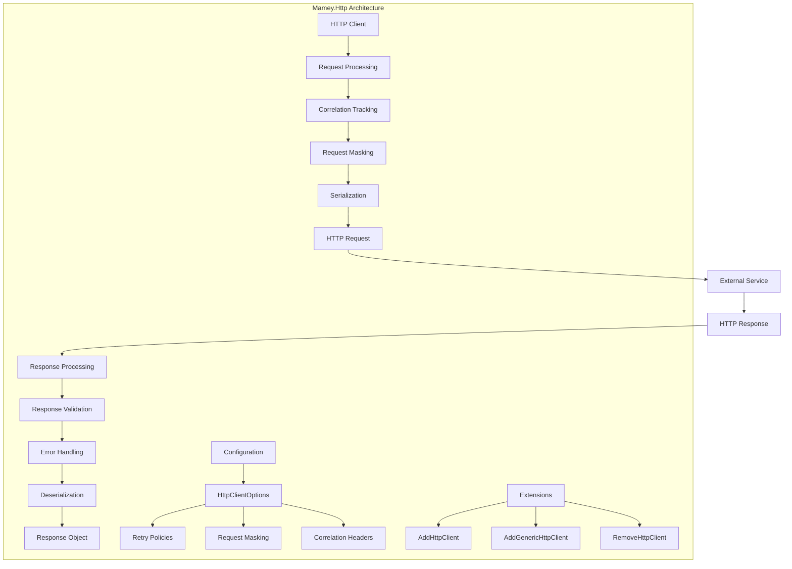

# Mamey.Http

A comprehensive HTTP client library for the Mamey framework, providing advanced HTTP communication capabilities with built-in retry policies, correlation tracking, request masking, and seamless integration with the Mamey ecosystem.

## Table of Contents

- [Overview](#overview)
- [Key Features](#key-features)
- [Architecture](#architecture)
- [Installation](#installation)
- [Quick Start](#quick-start)
- [Core Components](#core-components)
- [API Reference](#api-reference)
- [Usage Examples](#usage-examples)
- [Configuration](#configuration)
- [Best Practices](#best-practices)
- [Troubleshooting](#troubleshooting)

## Overview

Mamey.Http is a powerful HTTP client library designed specifically for the Mamey framework. It provides a robust foundation for HTTP communication between microservices with advanced features like automatic retry policies, correlation tracking, request masking, and seamless integration with the Mamey ecosystem.

### Technical Overview

The library provides:

- **Advanced HTTP Client**: Built on top of `HttpClient` with enhanced capabilities
- **Retry Policies**: Configurable retry mechanisms using Polly
- **Correlation Tracking**: Automatic correlation ID and context management
- **Request Masking**: Sensitive data masking for logging and debugging
- **Serialization**: Built-in JSON serialization with System.Text.Json
- **Response Handling**: Comprehensive response handling and error management
- **Logging Integration**: Seamless integration with Mamey logging system

## Key Features

### Core Features

- **HTTP Client Management**: Advanced HTTP client with retry policies
- **Correlation Tracking**: Automatic correlation ID and context management
- **Request Masking**: Sensitive data masking for security
- **Response Handling**: Comprehensive response handling and error management
- **Serialization**: Built-in JSON serialization with System.Text.Json
- **Logging Integration**: Seamless integration with Mamey logging system
- **Service Discovery**: Integration with Mamey service discovery

### Advanced Features

- **Retry Policies**: Configurable retry mechanisms using Polly
- **Request Masking**: Sensitive data masking for logging and debugging
- **Correlation Context**: Automatic correlation context propagation
- **Response Validation**: Built-in response validation and error handling
- **Custom Serialization**: Support for custom serialization strategies
- **HTTP Message Handlers**: Customizable HTTP message handlers
- **Service Registration**: Automatic service registration and discovery

## Architecture



## Installation

### Package Manager
```bash
Install-Package Mamey.Http
```

### .NET CLI
```bash
dotnet add package Mamey.Http
```

### PackageReference
```xml
<PackageReference Include="Mamey.Http" Version="2.0.*" />
```

## Quick Start

### Basic Setup

```csharp
using Mamey.Http;

public class Program
{
    public static void Main(string[] args)
    {
        var builder = WebApplication.CreateBuilder(args);
        
        builder.Services
            .AddMamey()
            .AddHttpClient<MyHttpClient>();
            
        var app = builder.Build();
        app.Run();
    }
}
```

### Custom HTTP Client

```csharp
public class MyHttpClient : MameyHttpClient
{
    public MyHttpClient(HttpClient httpClient, IHttpClientSerializer serializer, 
        ICorrelationContextFactory correlationContextFactory, 
        ICorrelationIdFactory correlationIdFactory, 
        ILogger<MyHttpClient> logger) 
        : base(httpClient, serializer, correlationContextFactory, correlationIdFactory, logger)
    {
    }
    
    public async Task<T> GetAsync<T>(string endpoint)
    {
        var response = await GetAsync(endpoint);
        return await response.ReadAsAsync<T>();
    }
}
```

### Basic Usage

```csharp
public class UserService
{
    private readonly IHttpClient _httpClient;
    
    public UserService(IHttpClient httpClient)
    {
        _httpClient = httpClient;
    }
    
    public async Task<User> GetUserAsync(int userId)
    {
        var response = await _httpClient.GetAsync($"/users/{userId}");
        return await response.ReadAsAsync<User>();
    }
    
    public async Task<User> CreateUserAsync(CreateUserRequest request)
    {
        var response = await _httpClient.PostAsync("/users", request);
        return await response.ReadAsAsync<User>();
    }
}
```

## Core Components

### HTTP Client Interfaces

#### IHttpClient
The main interface for HTTP operations.

```csharp
public interface IHttpClient
{
    Task<HttpResult> GetAsync(string endpoint);
    Task<HttpResult> PostAsync(string endpoint, object data = null);
    Task<HttpResult> PutAsync(string endpoint, object data = null);
    Task<HttpResult> DeleteAsync(string endpoint);
    Task<HttpResult> PatchAsync(string endpoint, object data = null);
}
```

#### IHttpClientSerializer
Interface for HTTP client serialization.

```csharp
public interface IHttpClientSerializer
{
    string Serialize<T>(T value);
    T Deserialize<T>(string value);
    T Deserialize<T>(Stream stream);
}
```

### Correlation Tracking

#### ICorrelationContextFactory
Factory for creating correlation contexts.

```csharp
public interface ICorrelationContextFactory
{
    ICorrelationContext Create();
}
```

#### ICorrelationIdFactory
Factory for creating correlation IDs.

```csharp
public interface ICorrelationIdFactory
{
    string Create();
}
```

### Response Handling

#### IApiResponseHandler
Handler for API responses.

```csharp
public interface IApiResponseHandler
{
    Task<HttpResult> HandleAsync(HttpResponseMessage response);
}
```

#### HttpResult
Result object for HTTP operations.

```csharp
public class HttpResult
{
    public bool IsSuccess { get; set; }
    public HttpStatusCode StatusCode { get; set; }
    public string Content { get; set; }
    public Dictionary<string, string> Headers { get; set; }
    public string Error { get; set; }
    
    public T ReadAsAsync<T>();
    public Task<T> ReadAsAsync<T>();
}
```

## API Reference

### Extension Methods

#### AddHttpClient
Registers a typed HTTP client.

```csharp
public static IMameyBuilder AddHttpClient<T>(this IMameyBuilder builder, 
    string clientName = "Mamey", 
    IEnumerable<string> maskedRequestUrlParts = null, 
    string sectionName = "httpClient", 
    Action<IHttpClientBuilder> httpClientBuilder = null) 
    where T : class, IHttpClient
```

#### AddGenericHttpClient
Registers a generic HTTP client.

```csharp
public static IMameyBuilder AddGenericHttpClient<T>(this IMameyBuilder builder, 
    string clientName = "Mamey", 
    IEnumerable<string> maskedRequestUrlParts = null, 
    string sectionName = "httpClient", 
    Action<IHttpClientBuilder> httpClientBuilder = null, 
    Action<HttpClient> configureClient = null) 
    where T : MameyHttpClient
```

#### AddHttpClient
Registers the default HTTP client.

```csharp
public static IMameyBuilder AddHttpClient(this IMameyBuilder builder, 
    string clientName = "Mamey", 
    IEnumerable<string> maskedRequestUrlParts = null, 
    string sectionName = "httpClient", 
    Action<IHttpClientBuilder> httpClientBuilder = null)
```

### Configuration Options

#### HttpClientOptions
Configuration options for HTTP client.

```csharp
public class HttpClientOptions
{
    public string Type { get; set; }
    public int Retries { get; set; }
    public IDictionary<string, string> Services { get; set; }
    public RequestMaskingOptions RequestMasking { get; set; }
    public bool RemoveCharsetFromContentType { get; set; }
    public string CorrelationContextHeader { get; set; }
    public string CorrelationIdHeader { get; set; }
}
```

#### RequestMaskingOptions
Options for request masking.

```csharp
public class RequestMaskingOptions
{
    public bool Enabled { get; set; }
    public IEnumerable<string> UrlParts { get; set; }
    public string MaskTemplate { get; set; }
}
```

## Usage Examples

### Basic HTTP Client

```csharp
public class Program
{
    public static void Main(string[] args)
    {
        var builder = WebApplication.CreateBuilder(args);
        
        builder.Services
            .AddMamey()
            .AddHttpClient();
            
        var app = builder.Build();
        app.Run();
    }
}
```

### Custom HTTP Client

```csharp
public class ApiHttpClient : MameyHttpClient
{
    public ApiHttpClient(HttpClient httpClient, IHttpClientSerializer serializer, 
        ICorrelationContextFactory correlationContextFactory, 
        ICorrelationIdFactory correlationIdFactory, 
        ILogger<ApiHttpClient> logger) 
        : base(httpClient, serializer, correlationContextFactory, correlationIdFactory, logger)
    {
    }
    
    public async Task<T> GetAsync<T>(string endpoint)
    {
        var response = await GetAsync(endpoint);
        return await response.ReadAsAsync<T>();
    }
    
    public async Task<T> PostAsync<T>(string endpoint, object data)
    {
        var response = await PostAsync(endpoint, data);
        return await response.ReadAsAsync<T>();
    }
}
```

### Service Integration

```csharp
public class UserService
{
    private readonly IHttpClient _httpClient;
    
    public UserService(IHttpClient httpClient)
    {
        _httpClient = httpClient;
    }
    
    public async Task<User> GetUserAsync(int userId)
    {
        var response = await _httpClient.GetAsync($"/users/{userId}");
        return await response.ReadAsAsync<User>();
    }
    
    public async Task<User> CreateUserAsync(CreateUserRequest request)
    {
        var response = await _httpClient.PostAsync("/users", request);
        return await response.ReadAsAsync<User>();
    }
    
    public async Task<User> UpdateUserAsync(int userId, UpdateUserRequest request)
    {
        var response = await _httpClient.PutAsync($"/users/{userId}", request);
        return await response.ReadAsAsync<User>();
    }
    
    public async Task DeleteUserAsync(int userId)
    {
        await _httpClient.DeleteAsync($"/users/{userId}");
    }
}
```

### Error Handling

```csharp
public class UserService
{
    private readonly IHttpClient _httpClient;
    
    public UserService(IHttpClient httpClient)
    {
        _httpClient = httpClient;
    }
    
    public async Task<User> GetUserAsync(int userId)
    {
        try
        {
            var response = await _httpClient.GetAsync($"/users/{userId}");
            
            if (!response.IsSuccess)
            {
                throw new HttpRequestException($"Failed to get user: {response.Error}");
            }
            
            return await response.ReadAsAsync<User>();
        }
        catch (HttpRequestException)
        {
            throw;
        }
        catch (Exception ex)
        {
            throw new InvalidOperationException("An unexpected error occurred", ex);
        }
    }
}
```

### Request Masking

```csharp
public class Program
{
    public static void Main(string[] args)
    {
        var builder = WebApplication.CreateBuilder(args);
        
        builder.Services
            .AddMamey()
            .AddHttpClient<MyHttpClient>(
                clientName: "MyClient",
                maskedRequestUrlParts: new[] { "password", "token", "secret" }
            );
            
        var app = builder.Build();
        app.Run();
    }
}
```

## Configuration

### Basic Configuration

```json
{
  "httpClient": {
    "type": "http",
    "retries": 3,
    "services": {
      "user-service": "http://localhost:5001",
      "order-service": "http://localhost:5002"
    },
    "requestMasking": {
      "enabled": true,
      "urlParts": ["password", "token", "secret"],
      "maskTemplate": "***"
    },
    "removeCharsetFromContentType": true,
    "correlationContextHeader": "X-Correlation-Context",
    "correlationIdHeader": "X-Correlation-ID"
  }
}
```

### Advanced Configuration

```json
{
  "httpClient": {
    "type": "http",
    "retries": 5,
    "services": {
      "user-service": "http://localhost:5001",
      "order-service": "http://localhost:5002",
      "payment-service": "http://localhost:5003"
    },
    "requestMasking": {
      "enabled": true,
      "urlParts": ["password", "token", "secret", "apiKey"],
      "maskTemplate": "***"
    },
    "removeCharsetFromContentType": true,
    "correlationContextHeader": "X-Correlation-Context",
    "correlationIdHeader": "X-Correlation-ID"
  }
}
```

## Best Practices

### HTTP Client Management

1. **Use Typed Clients**: Use typed HTTP clients for better type safety
2. **Configure Retry Policies**: Configure appropriate retry policies
3. **Handle Errors**: Implement proper error handling
4. **Use Correlation IDs**: Use correlation IDs for request tracking

```csharp
// Use typed clients
builder.Services
    .AddMamey()
    .AddHttpClient<UserServiceHttpClient>();
```

### Error Handling

1. **Check Response Status**: Always check response status
2. **Handle Exceptions**: Handle HTTP exceptions appropriately
3. **Log Errors**: Log errors for debugging
4. **Return Meaningful Errors**: Return meaningful error messages

```csharp
public async Task<User> GetUserAsync(int userId)
{
    try
    {
        var response = await _httpClient.GetAsync($"/users/{userId}");
        
        if (!response.IsSuccess)
        {
            _logger.LogError("Failed to get user {UserId}: {Error}", userId, response.Error);
            throw new HttpRequestException($"Failed to get user: {response.Error}");
        }
        
        return await response.ReadAsAsync<User>();
    }
    catch (HttpRequestException)
    {
        throw;
    }
    catch (Exception ex)
    {
        _logger.LogError(ex, "Unexpected error getting user {UserId}", userId);
        throw new InvalidOperationException("An unexpected error occurred", ex);
    }
}
```

### Performance

1. **Use Connection Pooling**: Use HTTP client connection pooling
2. **Configure Timeouts**: Configure appropriate timeouts
3. **Use Retry Policies**: Use retry policies for resilience
4. **Monitor Performance**: Monitor HTTP client performance

```csharp
builder.Services
    .AddMamey()
    .AddHttpClient<MyHttpClient>(httpClientBuilder =>
    {
        httpClientBuilder.ConfigureHttpClient(client =>
        {
            client.Timeout = TimeSpan.FromSeconds(30);
        });
    });
```

## Troubleshooting

### Common Issues

#### 1. HTTP Client Registration

**Problem**: HTTP client is not being registered correctly.

**Solution**: Check service registration and configuration.

```csharp
// Ensure proper registration
builder.Services
    .AddMamey()
    .AddHttpClient<MyHttpClient>();
```

#### 2. Serialization Issues

**Problem**: Serialization/deserialization is not working correctly.

**Solution**: Check serialization configuration and data types.

```csharp
// Use proper serialization
var response = await _httpClient.PostAsync("/users", user);
var result = await response.ReadAsAsync<User>();
```

#### 3. Correlation Tracking

**Problem**: Correlation tracking is not working correctly.

**Solution**: Check correlation context and ID factories.

```csharp
// Ensure correlation factories are registered
builder.Services
    .AddMamey()
    .AddHttpClient<MyHttpClient>();
```

#### 4. Request Masking

**Problem**: Request masking is not working correctly.

**Solution**: Check request masking configuration.

```csharp
// Configure request masking
builder.Services
    .AddMamey()
    .AddHttpClient<MyHttpClient>(
        maskedRequestUrlParts: new[] { "password", "token", "secret" }
    );
```

### Debugging Tips

1. **Enable Logging**: Enable detailed logging for HTTP operations
2. **Check Configuration**: Verify HTTP client configuration
3. **Test Endpoints**: Test HTTP endpoints independently
4. **Monitor Traffic**: Monitor HTTP traffic and performance

```csharp
// Enable detailed logging
builder.Services
    .AddMamey()
    .AddHttpClient<MyHttpClient>(httpClientBuilder =>
    {
        httpClientBuilder.AddHttpMessageHandler<LoggingHandler>();
    });
```

## License

This project is licensed under the MIT License - see the [LICENSE](LICENSE) file for details.

## Contributing

Please read [CONTRIBUTING.md](CONTRIBUTING.md) for details on our code of conduct and the process for submitting pull requests.

## Support

For support and questions, please open an issue in the [GitHub repository](https://github.com/mamey-io/mamey-http/issues).
