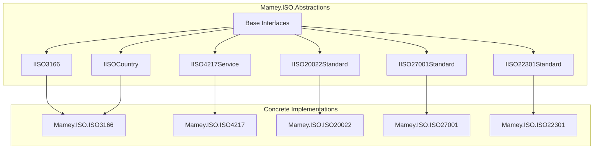
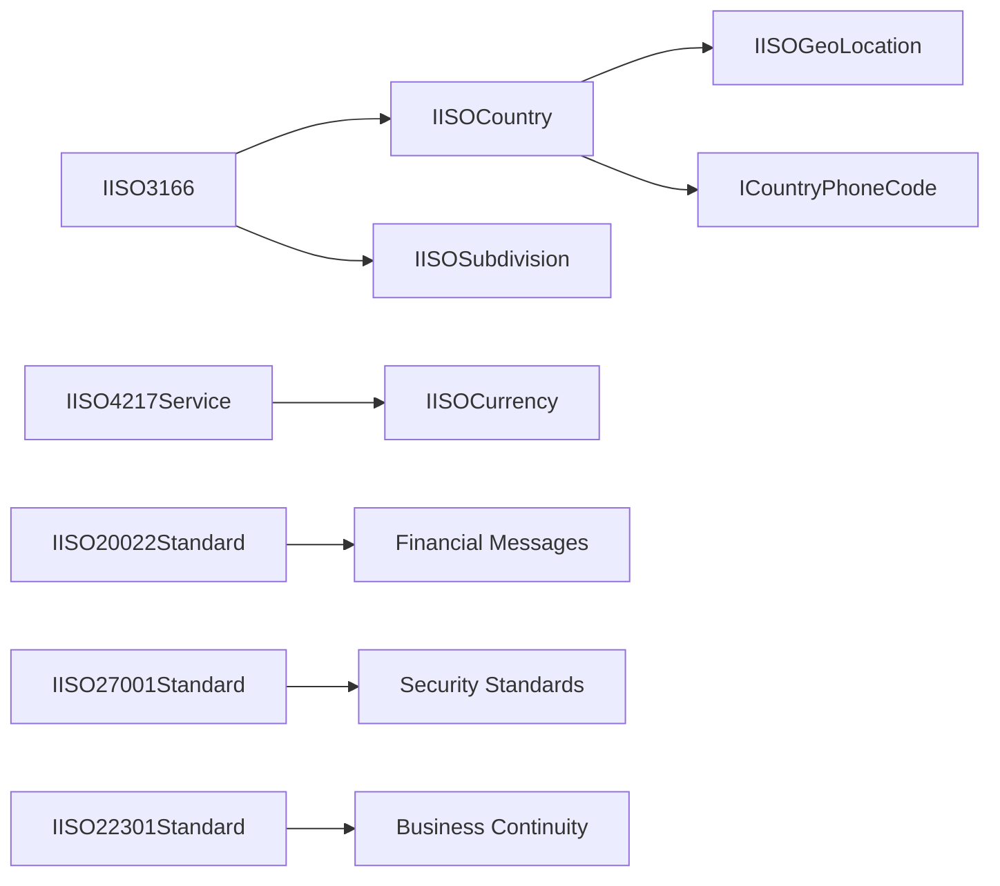

# Mamey.ISO.Abstractions

**Library**: `Mamey.ISO.Abstractions`  
**Location**: `Mamey/src/Mamey.ISO.Abstractions/`  
**Type**: Standards Library - ISO Abstractions  
**Version**: 2.0.*  
**Files**: 10 C# files  
**Namespace**: `Mamey.ISO.Abstractions`

## Overview

Mamey.ISO.Abstractions provides core abstractions and interfaces for ISO standards implementations in the Mamey framework. It defines the base interfaces and contracts that all ISO standard libraries implement, ensuring consistency and interoperability across different ISO standard implementations.

### Conceptual Foundation

**ISO Standards** are international standards developed by the International Organization for Standardization (ISO). Key concepts:

1. **Standard Interfaces**: Common interfaces for ISO standard implementations
2. **Abstraction Layer**: Base abstractions that concrete implementations extend
3. **Type Safety**: Strongly-typed interfaces for ISO standard data
4. **Consistency**: Uniform structure across all ISO standard libraries
5. **Interoperability**: Shared interfaces enable seamless integration

**Why Mamey.ISO.Abstractions?**

Provides:
- **Base Interfaces**: Common interfaces for all ISO standard implementations
- **Type Safety**: Strongly-typed interfaces prevent errors
- **Consistency**: Uniform structure across ISO standard libraries
- **Extensibility**: Easy to extend for new ISO standards
- **Interoperability**: Shared interfaces enable library integration

**Use Cases:**
- Base contracts for ISO standard implementations
- Type-safe ISO standard data structures
- Consistent API across ISO standard libraries
- Framework for implementing new ISO standards

## Architecture

### ISO Abstractions Architecture



### Interface Hierarchy



## Core Components

### IISO3166 - ISO 3166 Interface

Interface for ISO 3166 (Country Codes) implementations:

```csharp
public interface IISO3166
{
    Dictionary<string, IISOCountry> Countries { get; set; }
    Dictionary<string, IISOSubdivision> Subdivision { get; set; }
}
```

### IISOCountry - ISO Country Interface

Interface for country data according to ISO 3166:

```csharp
public interface IISOCountry
{
    string Alpha2 { get; set; } // ISO 3166-1 alpha-2 code (e.g., "US")
    string Alpha3 { get; set; } // ISO 3166-1 alpha-3 code (e.g., "USA")
    string Continent { get; set; }
    string CountryCode { get; set; } // Phone country code
    string CurrencyCode { get; set; } // ISO 4217 currency code
    string Gec { get; set; } // U.S. GEC code
    IISOGeoLocation GeoLocation { get; set; }
    string InternationalPrefix { get; set; }
    string InternationalOlympicCode { get; set; }
    string ISOLongName { get; set; }
    string ISOShortName { get; set; }
    IEnumerable<string> OfficialLanguages { get; set; }
    IEnumerable<string> SpokenLanguages { get; set; }
    IEnumerable<int> NationalDestinationCodeLengths { get; set; }
    IEnumerable<int> NationalNumberLengths { get; set; }
    string NationalPrefix { get; set; }
    string Nationality { get; set; }
    string Number { get; set; } // ISO 3166-1 numeric code
    bool PostalCode { get; set; }
    string PostalCodeFormatRegex { get; set; }
    string Region { get; set; }
    string StartOfWeek { get; set; }
    string Subregion { get; set; }
    IEnumerable<string> UnofficialNames { get; set; }
    string UnLocode { get; set; }
    string WorldRegion { get; set; }
}
```

### IISOSubdivision - ISO Subdivision Interface

Interface for country subdivisions (ISO 3166-2):

```csharp
public interface IISOSubdivision
{
    // Subdivision properties (state, province, etc.)
}
```

### IISOGeoLocation - Geographic Location Interface

Interface for geographic location data:

```csharp
public interface IISOGeoLocation
{
    // Geographic coordinates and location data
}
```

### ICountryPhoneCode - Country Phone Code Interface

Interface for country phone code information:

```csharp
public interface ICountryPhoneCode
{
    // Phone code properties
}
```

### IISO4217Service - ISO 4217 Currency Service Interface

Interface for ISO 4217 (Currency Codes) service:

```csharp
public interface IISO4217Service
{
    // Currency service methods
}
```

### IISOCurrency - ISO Currency Interface

Interface for currency data according to ISO 4217:

```csharp
public interface IISOCurrency
{
    // Currency properties (code, name, symbol, etc.)
}
```

### IISO20022Standard - ISO 20022 Standard Interface

Interface for ISO 20022 (Financial Messaging) implementations:

```csharp
public interface IISO20022Standard
{
    // Financial messaging standard methods
}
```

### IISO27001Standard - ISO 27001 Standard Interface

Interface for ISO 27001 (Information Security) implementations:

```csharp
public interface IISO27001Standard
{
    // Information security standard methods
}
```

### IISO22301Standard - ISO 22301 Standard Interface

Interface for ISO 22301 (Business Continuity) implementations:

```csharp
public interface IISO22301Standard
{
    // Business continuity standard methods
}
```

## Installation

### Prerequisites

1. **.NET 9.0**: Ensure .NET 9.0 SDK is installed
2. **Mamey**: Core Mamey framework

### NuGet Package

```bash
dotnet add package Mamey.ISO.Abstractions
```

### Dependencies

- **Mamey** - Core framework

## Quick Start

### Basic Setup

```csharp
using Mamey.ISO.Abstractions;

// Interfaces are used by concrete implementations
// No direct usage required - use concrete ISO standard libraries instead
```

## Usage Examples

### Example 1: Using ISO 3166 Abstractions

```csharp
using Mamey.ISO.Abstractions;

// Interface is implemented by Mamey.ISO.ISO3166
public class CountryService
{
    private readonly IISO3166 _iso3166;

    public CountryService(IISO3166 iso3166)
    {
        _iso3166 = iso3166;
    }

    public IISOCountry GetCountry(string alpha2Code)
    {
        return _iso3166.Countries[alpha2Code];
    }
}
```

### Example 2: Using ISO 4217 Abstractions

```csharp
using Mamey.ISO.Abstractions;

// Interface is implemented by Mamey.ISO.ISO4217
public class CurrencyService
{
    private readonly IISO4217Service _iso4217Service;

    public CurrencyService(IISO4217Service iso4217Service)
    {
        _iso4217Service = iso4217Service;
    }

    public async Task<IISOCurrency> GetCurrencyAsync(string currencyCode)
    {
        // Use service to get currency
        return await _iso4217Service.GetCurrencyAsync(currencyCode);
    }
}
```

### Example 3: Implementing Custom ISO Standard

```csharp
using Mamey.ISO.Abstractions;

// Implement a custom ISO standard using abstractions
public class CustomISOStandard : IISO27001Standard
{
    // Implement interface methods
    public Task<SecurityStandard> GetSecurityStandardAsync()
    {
        // Implementation
    }
}
```

## Extension Points

### Creating New ISO Standard Interfaces

```csharp
namespace Mamey.ISO.Abstractions;

// Define a new ISO standard interface
public interface IISOXXXXStandard
{
    // Define standard-specific methods
    Task<StandardData> GetStandardDataAsync();
}
```

### Implementing ISO Standard Abstractions

```csharp
using Mamey.ISO.Abstractions;

// Implement the interface in a concrete library
public class ISOXXXXService : IISOXXXXStandard
{
    public async Task<StandardData> GetStandardDataAsync()
    {
        // Implementation
    }
}
```

## Related Libraries

All ISO standard libraries implement these abstractions:

- **Mamey.ISO.ISO3166**: Country codes implementation
- **Mamey.ISO.ISO4217**: Currency codes implementation
- **Mamey.ISO.ISO639**: Language codes implementation
- **Mamey.ISO.ISO20022**: Financial messaging implementation
- **Mamey.ISO.ISO8583**: Financial transaction card messages
- **Mamey.ISO.ISO9362**: Bank Identifier Codes (SWIFT)
- **Mamey.ISO.ISO13616**: IBAN standard implementation
- **Mamey.ISO.ISO27001**: Information security management
- **Mamey.ISO.ISO22301**: Business continuity management
- **Mamey.ISO.PCI_DSS**: PCI DSS compliance

## Best Practices

### 1. Use Abstractions for Type Safety

**✅ Good: Use interface types**
```csharp
public class CountryService
{
    private readonly IISO3166 _iso3166; // Use interface, not concrete type

    public CountryService(IISO3166 iso3166)
    {
        _iso3166 = iso3166;
    }
}
```

### 2. Implement Abstractions Consistently

**✅ Good: Follow interface contracts**
```csharp
public class ISO3166Service : IISO3166
{
    // Implement all interface members
    public Dictionary<string, IISOCountry> Countries { get; set; }
    public Dictionary<string, IISOSubdivision> Subdivision { get; set; }
}
```

### 3. Extend Abstractions for New Standards

**✅ Good: Create new interfaces for new standards**
```csharp
public interface IISOXXXXStandard
{
    // Define new standard interface
}
```

## Additional Resources

- [ISO Organization](https://www.iso.org/)
- [Mamey Framework Documentation](../../documentation/)
- [Mamey.ISO.Abstractions Memory Documentation](../../.skmemory/v1/memory/public/mid-term/libraries/standards/mamey-iso-abstractions.md)

## Tags

#iso #abstractions #standards #interfaces #mamey


