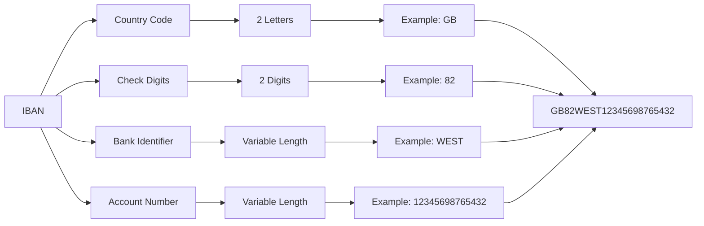
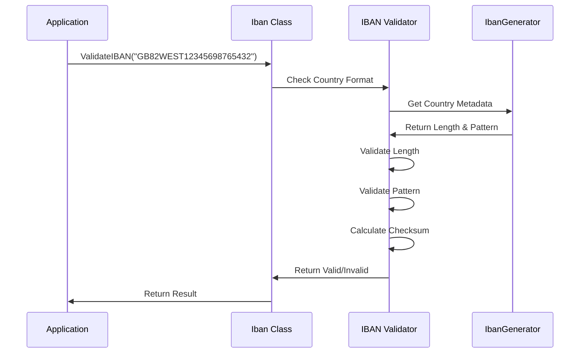
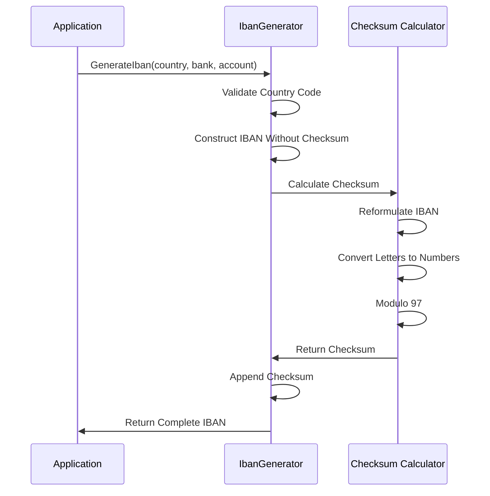

# Mamey.ISO.ISO13616

**Library**: `Mamey.ISO.ISO13616`  
**Location**: `Mamey/src/Mamey.ISO.ISO13616/`  
**Type**: Standards Library - ISO 13616 IBAN  
**Version**: 2.0.*  
**Files**: 2 C# files  
**Namespace**: `Mamey.ISO.ISO13616`

## Overview

Mamey.ISO.ISO13616 provides comprehensive ISO 13616 International Bank Account Number (IBAN) standard implementation for the Mamey framework. It includes IBAN validation, generation, and formatting with support for all IBAN-participating countries.

### Conceptual Foundation

**ISO 13616** is an international standard for International Bank Account Numbers (IBAN). Key concepts:

1. **IBAN Structure**: Country code + check digits + bank identifier + account number
2. **Country-Specific Lengths**: Different countries have different IBAN lengths
3. **Checksum Validation**: Modulo 97 checksum validation
4. **Formatting**: Human-readable formatting with spaces
5. **Country Validation**: Country-specific format validation

**Why Mamey.ISO.ISO13616?**

Provides:
- **IBAN Validation**: Complete IBAN validation with checksum
- **IBAN Generation**: Generate valid IBANs from components
- **Country Support**: Support for all IBAN-participating countries
- **Formatting**: Human-readable IBAN formatting
- **Type Safety**: Strongly-typed IBAN model

**Use Cases:**
- IBAN validation
- Bank account number validation
- International wire transfers
- Payment processing
- Financial data validation

## Architecture

### IBAN Structure



### IBAN Validation Flow



### IBAN Generation Flow



## Core Components

### Iban - IBAN Model

IBAN model with validation:

```csharp
public class Iban
{
    public Iban(string iban);
    public string Value { get; }

    public static bool ValidateIBAN(string iban);
    public static implicit operator Iban(string value);
    public static implicit operator string(Iban iban);
}
```

**Key Features:**
- **Validation**: Validates IBAN format and checksum
- **Implicit Conversion**: Seamless string conversion
- **Type Safety**: Strongly-typed IBAN model

### IbanGenerator - IBAN Generator

Utility for generating valid IBANs:

```csharp
public static class IbanGenerator
{
    public static string GenerateIban(
        string countryCode,
        string bankCode,
        string accountNumber);
    
    internal static readonly Dictionary<string, (int Length, string Pattern)> IbanMetadata;
}
```

**Key Features:**
- **IBAN Generation**: Generate valid IBANs from components
- **Checksum Calculation**: Automatic checksum calculation
- **Country Metadata**: Country-specific IBAN metadata
- **Format Validation**: Validates generated IBAN format

## Installation

### Prerequisites

1. **.NET 9.0**: Ensure .NET 9.0 SDK is installed
2. **System.Numerics**: For BigInteger operations

### NuGet Package

```bash
dotnet add package Mamey.ISO.ISO13616
```

### Dependencies

- **Mamey** - Core framework
- **System.Numerics** - BigInteger support

## Quick Start

### Basic Setup

```csharp
using Mamey.ISO.ISO13616;

// No service registration required - use directly
```

## Usage Examples

### Example 1: Validate IBAN

```csharp
using Mamey.ISO.ISO13616;

public class IBANValidationService
{
    private readonly ILogger<IBANValidationService> _logger;

    public IBANValidationService(ILogger<IBANValidationService> logger)
    {
        _logger = logger;
    }

    public bool ValidateIBAN(string iban)
    {
        try
        {
            _logger.LogInformation("Validating IBAN: {IBAN}", iban);

            var isValid = Iban.ValidateIBAN(iban);

            if (isValid)
            {
                _logger.LogInformation("IBAN is valid: {IBAN}", iban);
            }
            else
            {
                _logger.LogWarning("IBAN is invalid: {IBAN}", iban);
            }

            return isValid;
        }
        catch (Exception ex)
        {
            _logger.LogError(ex, "Error validating IBAN: {IBAN}", iban);
            return false;
        }
    }
}

// Usage
var isValid = ibanValidationService.ValidateIBAN("GB82WEST12345698765432"); // true
var isInvalid = ibanValidationService.ValidateIBAN("INVALID"); // false
```

### Example 2: Create IBAN Object

```csharp
public class IBANService
{
    private readonly ILogger<IBANService> _logger;

    public Iban CreateIBAN(string ibanString)
    {
        try
        {
            _logger.LogInformation("Creating IBAN: {IBAN}", ibanString);

            if (!Iban.ValidateIBAN(ibanString))
            {
                throw new ArgumentException($"Invalid IBAN format: {ibanString}");
            }

            var iban = new Iban(ibanString);

            _logger.LogInformation("Created IBAN: {IBAN}", iban.Value);

            return iban;
        }
        catch (Exception ex)
        {
            _logger.LogError(ex, "Failed to create IBAN: {IBAN}", ibanString);
            throw;
        }
    }
}

// Usage
var iban = ibanService.CreateIBAN("GB82WEST12345698765432");
// iban.Value = "GB82WEST12345698765432"
```

### Example 3: Generate IBAN

```csharp
public class IBANGenerationService
{
    private readonly ILogger<IBANGenerationService> _logger;

    public string GenerateIBAN(string countryCode, string bankCode, string accountNumber)
    {
        try
        {
            _logger.LogInformation(
                "Generating IBAN: Country={Country}, Bank={Bank}, Account={Account}",
                countryCode,
                bankCode,
                accountNumber);

            var iban = IbanGenerator.GenerateIban(countryCode, bankCode, accountNumber);

            _logger.LogInformation("Generated IBAN: {IBAN}", iban);

            return iban;
        }
        catch (ArgumentException ex)
        {
            _logger.LogError(ex, "Invalid IBAN generation parameters");
            throw;
        }
        catch (Exception ex)
        {
            _logger.LogError(ex, "Failed to generate IBAN");
            throw;
        }
    }
}

// Usage
var iban = ibanGenerationService.GenerateIBAN("GB", "WEST", "12345698765432");
// iban = "GB82WEST12345698765432"
```

### Example 4: Implicit Conversion

```csharp
public class IBANConversionService
{
    public void DemonstrateConversions()
    {
        // String to Iban (implicit)
        Iban iban = "GB82WEST12345698765432";

        // Iban to string (implicit)
        string ibanString = iban;

        // Use in string operations
        var formatted = $"IBAN: {iban}";
    }
}

// Usage
Iban iban = "GB82WEST12345698765432";
string ibanString = iban; // "GB82WEST12345698765432"
```

### Example 5: Format IBAN for Display

```csharp
public class IBANFormattingService
{
    public string FormatIBANForDisplay(string iban)
    {
        try
        {
            if (!Iban.ValidateIBAN(iban))
            {
                throw new ArgumentException($"Invalid IBAN: {iban}");
            }

            // Remove spaces and convert to uppercase
            var normalized = iban.Replace(" ", "").ToUpper();

            // Format with spaces every 4 characters
            var formatted = new StringBuilder();
            for (int i = 0; i < normalized.Length; i += 4)
            {
                var length = Math.Min(4, normalized.Length - i);
                formatted.Append(normalized.Substring(i, length));
                if (i + 4 < normalized.Length)
                {
                    formatted.Append(" ");
                }
            }

            return formatted.ToString();
        }
        catch (Exception ex)
        {
            _logger.LogError(ex, "Failed to format IBAN: {IBAN}", iban);
            throw;
        }
    }
}

// Usage
var formatted = ibanFormattingService.FormatIBANForDisplay("gb82west12345698765432");
// formatted = "GB82 WEST 1234 5698 7654 32"
```

### Example 6: Extract IBAN Components

```csharp
public class IBANComponentService
{
    public IBANComponents ExtractComponents(string iban)
    {
        try
        {
            if (!Iban.ValidateIBAN(iban))
            {
                throw new ArgumentException($"Invalid IBAN: {iban}");
            }

            var normalized = iban.Replace(" ", "").ToUpper();

            return new IBANComponents
            {
                CountryCode = normalized.Substring(0, 2),
                CheckDigits = normalized.Substring(2, 2),
                BankIdentifier = normalized.Substring(4, 4), // Example for GB
                AccountNumber = normalized.Substring(8),
                FullIBAN = normalized
            };
        }
        catch (Exception ex)
        {
            _logger.LogError(ex, "Failed to extract IBAN components: {IBAN}", iban);
            throw;
        }
    }
}

public class IBANComponents
{
    public string CountryCode { get; set; }
    public string CheckDigits { get; set; }
    public string BankIdentifier { get; set; }
    public string AccountNumber { get; set; }
    public string FullIBAN { get; set; }
}

// Usage
var components = ibanComponentService.ExtractComponents("GB82WEST12345698765432");
// components.CountryCode = "GB"
// components.CheckDigits = "82"
// components.BankIdentifier = "WEST"
// components.AccountNumber = "12345698765432"
```

### Example 7: Validate Multiple IBANs

```csharp
public class BatchIBANValidationService
{
    private readonly ILogger<BatchIBANValidationService> _logger;

    public Dictionary<string, bool> ValidateIBANs(IEnumerable<string> ibans)
    {
        var results = new Dictionary<string, bool>();

        foreach (var iban in ibans)
        {
            try
            {
                var isValid = Iban.ValidateIBAN(iban);
                results[iban] = isValid;

                if (!isValid)
                {
                    _logger.LogWarning("Invalid IBAN: {IBAN}", iban);
                }
            }
            catch (Exception ex)
            {
                _logger.LogError(ex, "Error validating IBAN: {IBAN}", iban);
                results[iban] = false;
            }
        }

        return results;
    }
}

// Usage
var ibans = new[] { "GB82WEST12345698765432", "DE89370400440532013000", "INVALID" };
var results = batchValidationService.ValidateIBANs(ibans);
// results["GB82WEST12345698765432"] = true
// results["DE89370400440532013000"] = true
// results["INVALID"] = false
```

## IBAN Format Details

### IBAN Structure

```
Format: CCKKBBBBAAAAAAAAAAAA
- CC (2): Country Code (ISO 3166-1 alpha-2)
- KK (2): Check Digits (00-99)
- BBBB (4+): Bank Identifier (variable length)
- AAAAAAAA (variable): Account Number (variable length)
```

### Country-Specific Lengths

The library supports IBANs for multiple countries with different lengths:

- **GB (United Kingdom)**: 22 characters
- **DE (Germany)**: 22 characters
- **FR (France)**: 27 characters
- **IT (Italy)**: 27 characters
- **NL (Netherlands)**: 18 characters
- And many more...

### Checksum Algorithm

1. Move first 4 characters to end
2. Convert letters to numbers (A=10, B=11, ..., Z=35)
3. Calculate modulo 97
4. Result must be 1 for valid IBAN

## Best Practices

### 1. Always Validate Before Use

**✅ Good: Validate IBAN before processing**
```csharp
if (!Iban.ValidateIBAN(iban))
{
    throw new ArgumentException($"Invalid IBAN: {iban}");
}

var ibanObject = new Iban(iban);
```

### 2. Normalize IBAN Input

**✅ Good: Normalize IBAN before validation**
```csharp
var normalized = iban.Replace(" ", "").ToUpper();
if (!Iban.ValidateIBAN(normalized))
{
    // Handle invalid IBAN
}
```

### 3. Use Iban Type for Type Safety

**✅ Good: Use Iban type for type safety**
```csharp
public void ProcessPayment(Iban iban, decimal amount)
{
    // Type-safe IBAN processing
    var ibanString = iban.Value;
}
```

### 4. Handle Validation Errors Gracefully

**✅ Good: Handle validation errors**
```csharp
try
{
    var iban = new Iban(ibanString);
    return iban;
}
catch (ArgumentException ex)
{
    _logger.LogWarning(ex, "Invalid IBAN format: {IBAN}", ibanString);
    return null;
}
```

### 5. Validate Country Code

**✅ Good: Validate country code separately**
```csharp
var countryCode = iban.Substring(0, 2);
if (!IbanGenerator.IbanMetadata.ContainsKey(countryCode))
{
    throw new ArgumentException($"Unsupported country code: {countryCode}");
}
```

## Troubleshooting

### Common Issues

#### Invalid IBAN Format

**Problem**: `ArgumentException: Invalid IBAN format`

**Solution**:
1. Verify IBAN length matches country requirement
2. Check IBAN format matches country pattern
3. Ensure check digits are correct
4. Remove spaces and convert to uppercase

#### Unsupported Country

**Problem**: Country code not supported.

**Solution**:
1. Check country code is valid ISO 3166-1 alpha-2
2. Verify country participates in IBAN system
3. Check IbanGenerator.IbanMetadata contains country

#### Checksum Validation Fails

**Problem**: IBAN format is correct but checksum fails.

**Solution**:
1. Verify check digits are correct
2. Check all characters are valid
3. Ensure no spaces or special characters
4. Recalculate checksum if generating IBAN

## Related Libraries

- **Mamey.ISO.Abstractions**: ISO standards abstractions
- **Mamey.ISO.ISO3166**: Country codes (used by IBAN)
- **Mamey.ISO.ISO9362**: SWIFT BIC codes (used with IBAN)
- **Mamey.Bank**: Banking operations

## Additional Resources

- [ISO 13616 Standard](https://www.iso.org/standard/41031.html)
- [IBAN Format Specification](https://en.wikipedia.org/wiki/International_Bank_Account_Number)
- [IBAN Registry](https://www.swift.com/standards/data-standards/iban)
- [Mamey Framework Documentation](../../documentation/)
- [Mamey.ISO.ISO13616 Memory Documentation](../../.skmemory/v1/memory/public/mid-term/libraries/standards/mamey-iso-13616.md)

## Tags

#iso-13616 #iban #banking #international #standards #mamey

