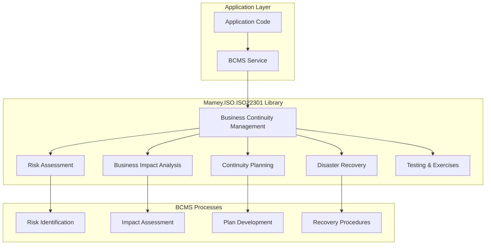

# Mamey.ISO.ISO22301

**Library**: `Mamey.ISO.ISO22301`  
**Location**: `Mamey/src/Mamey.ISO.ISO22301/`  
**Type**: Standards Library - ISO 22301 Business Continuity  
**Version**: 2.0.*  
**Files**: 0 C# files (implementation pending)  
**Namespace**: `Mamey.ISO.ISO22301`

## Overview

Mamey.ISO.ISO22301 provides ISO 22301 business continuity management standards implementation for the Mamey framework. ISO 22301 is an international standard that specifies requirements for a business continuity management system (BCMS).

### Conceptual Foundation

**ISO 22301** is an international standard for business continuity management. Key concepts:

1. **Business Continuity Management System (BCMS)**: Framework for managing business continuity
2. **Risk Assessment**: Assessment of risks to business continuity
3. **Business Impact Analysis**: Analysis of business impact of disruptions
4. **Continuity Planning**: Development of business continuity plans
5. **Disaster Recovery**: Recovery procedures for disasters
6. **Testing and Exercises**: Testing of business continuity plans

**Why Mamey.ISO.ISO22301?**

Provides:
- **Business Continuity**: Business continuity management framework
- **Risk Management**: Risk assessment and management
- **Disaster Recovery**: Disaster recovery planning
- **Standards Compliance**: ISO 22301 standards compliance
- **Continuity Planning**: Tools for business continuity planning

**Use Cases:**
- Business continuity planning
- Disaster recovery planning
- Risk assessment
- Business impact analysis
- Continuity plan testing

## Architecture

### ISO 22301 BCMS Architecture



## Installation

### Prerequisites

1. **.NET 9.0**: Ensure .NET 9.0 SDK is installed
2. **Mamey.ISO.Abstractions**: ISO abstractions library

### NuGet Package

```bash
dotnet add package Mamey.ISO.ISO22301
```

### Dependencies

- **Mamey** - Core framework
- **Mamey.ISO.Abstractions** - ISO abstractions

## Quick Start

### Basic Setup

```csharp
using Mamey.ISO.ISO22301;

var builder = WebApplication.CreateBuilder(args);

// Add ISO 22301 services (implementation pending)
builder.Services
    .AddMamey()
    .AddISO22301();

var app = builder.Build();
app.Run();
```

## Usage Examples

### Example 1: Business Continuity Management (Expected API)

```csharp
using Mamey.ISO.ISO22301;

public class BCMSService
{
    private readonly IISO22301Standard _iso22301Standard;
    private readonly ILogger<BCMSService> _logger;

    public BCMSService(
        IISO22301Standard iso22301Standard,
        ILogger<BCMSService> logger)
    {
        _iso22301Standard = iso22301Standard;
        _logger = logger;
    }

    public async Task<BusinessContinuityPlan> CreateContinuityPlanAsync(
        string organizationId,
        BusinessImpactAnalysis analysis)
    {
        try
        {
            _logger.LogInformation("Creating business continuity plan: {OrganizationId}", organizationId);

            // Use ISO 22301 standard for business continuity planning
            // Implementation details depend on specific requirements

            _logger.LogInformation("Created business continuity plan: {OrganizationId}", organizationId);
            return new BusinessContinuityPlan();
        }
        catch (Exception ex)
        {
            _logger.LogError(ex, "Failed to create business continuity plan");
            throw;
        }
    }
}
```

## Related Libraries

- **Mamey.ISO.Abstractions**: ISO standards abstractions
- **Mamey.ISO.ISO27001**: Information security standards
- **Mamey.Security**: Security utilities

## Additional Resources

- [ISO 22301 Standard](https://www.iso.org/standard/75106.html)
- [Business Continuity Management](https://en.wikipedia.org/wiki/ISO_22301)
- [Mamey Framework Documentation](../../documentation/)
- [Mamey.ISO.ISO22301 Memory Documentation](../../.skmemory/v1/memory/public/mid-term/libraries/standards/mamey-iso-22301.md)

## Tags

#iso-22301 #business-continuity #risk-management #disaster-recovery #standards #mamey

