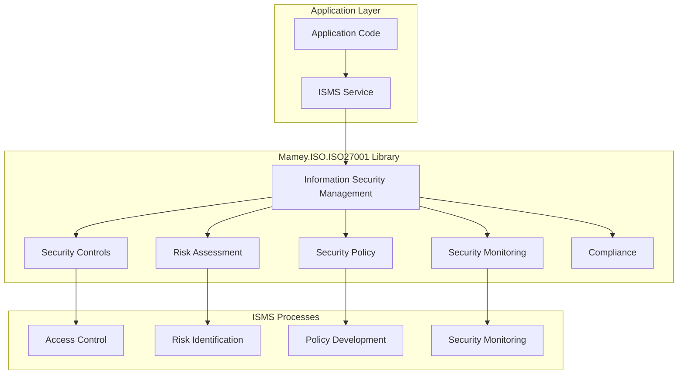

# Mamey.ISO.ISO27001

**Library**: `Mamey.ISO.ISO27001`  
**Location**: `Mamey/src/Mamey.ISO.ISO27001/`  
**Type**: Standards Library - ISO 27001 Information Security  
**Version**: 2.0.*  
**Files**: 0 C# files (implementation pending)  
**Namespace**: `Mamey.ISO.ISO27001`

## Overview

Mamey.ISO.ISO27001 provides ISO 27001 information security management standards implementation for the Mamey framework. ISO 27001 is an international standard that specifies requirements for an information security management system (ISMS).

### Conceptual Foundation

**ISO 27001** is an international standard for information security management. Key concepts:

1. **Information Security Management System (ISMS)**: Framework for managing information security
2. **Security Controls**: Implementation of security controls
3. **Risk Assessment**: Assessment of information security risks
4. **Security Policy**: Information security policy development
5. **Security Monitoring**: Monitoring of security controls
6. **Compliance**: Compliance with security requirements

**Why Mamey.ISO.ISO27001?**

Provides:
- **Information Security**: Information security management framework
- **Security Controls**: Security control implementation
- **Risk Assessment**: Information security risk assessment
- **Standards Compliance**: ISO 27001 standards compliance
- **Security Monitoring**: Tools for security monitoring

**Use Cases:**
- Information security management
- Security control implementation
- Risk assessment
- Security policy development
- Security compliance

## Architecture

### ISO 27001 ISMS Architecture



## Installation

### Prerequisites

1. **.NET 9.0**: Ensure .NET 9.0 SDK is installed
2. **Mamey.ISO.Abstractions**: ISO abstractions library

### NuGet Package

```bash
dotnet add package Mamey.ISO.ISO27001
```

### Dependencies

- **Mamey** - Core framework
- **Mamey.ISO.Abstractions** - ISO abstractions
- **Mamey.Security** - Security utilities

## Quick Start

### Basic Setup

```csharp
using Mamey.ISO.ISO27001;

var builder = WebApplication.CreateBuilder(args);

// Add ISO 27001 services (implementation pending)
builder.Services
    .AddMamey()
    .AddISO27001();

var app = builder.Build();
app.Run();
```

## Usage Examples

### Example 1: Information Security Management (Expected API)

```csharp
using Mamey.ISO.ISO27001;

public class ISMSService
{
    private readonly IISO27001Standard _iso27001Standard;
    private readonly ILogger<ISMSService> _logger;

    public ISMSService(
        IISO27001Standard iso27001Standard,
        ILogger<ISMSService> logger)
    {
        _iso27001Standard = iso27001Standard;
        _logger = logger;
    }

    public async Task<SecurityControl> ImplementSecurityControlAsync(
        string controlId,
        SecurityControlImplementation implementation)
    {
        try
        {
            _logger.LogInformation("Implementing security control: {ControlId}", controlId);

            // Use ISO 27001 standard for security control implementation
            // Implementation details depend on specific requirements

            _logger.LogInformation("Implemented security control: {ControlId}", controlId);
            return new SecurityControl();
        }
        catch (Exception ex)
        {
            _logger.LogError(ex, "Failed to implement security control");
            throw;
        }
    }
}
```

## Related Libraries

- **Mamey.ISO.Abstractions**: ISO standards abstractions
- **Mamey.Security**: Security utilities
- **Mamey.ISO.ISO22301**: Business continuity standards

## Additional Resources

- [ISO 27001 Standard](https://www.iso.org/standard/54534.html)
- [Information Security Management](https://en.wikipedia.org/wiki/ISO/IEC_27001)
- [Mamey Framework Documentation](../../documentation/)
- [Mamey.ISO.ISO27001 Memory Documentation](../../.skmemory/v1/memory/public/mid-term/libraries/standards/mamey-iso-27001.md)

## Tags

#iso-27001 #information-security #security #standards #mamey

