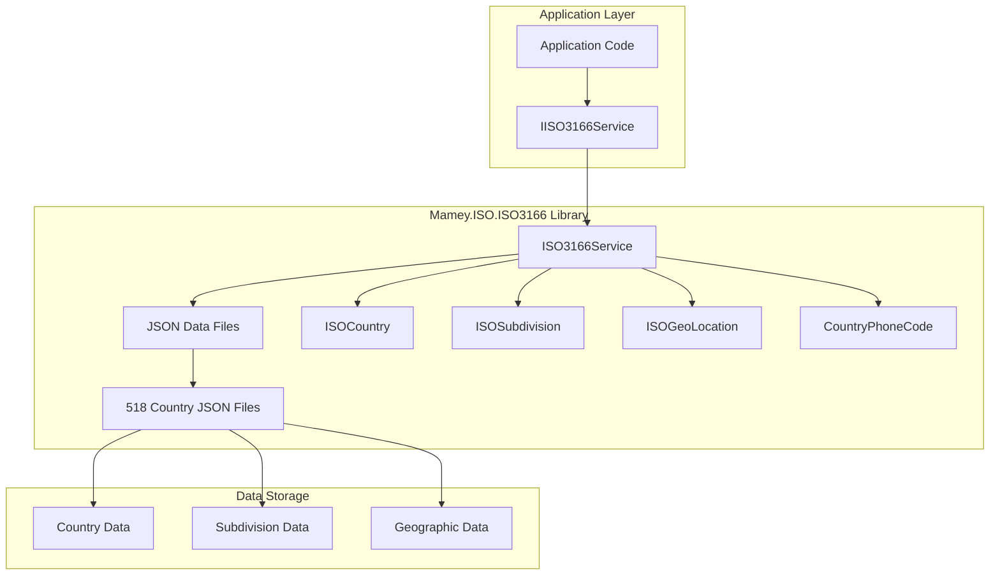
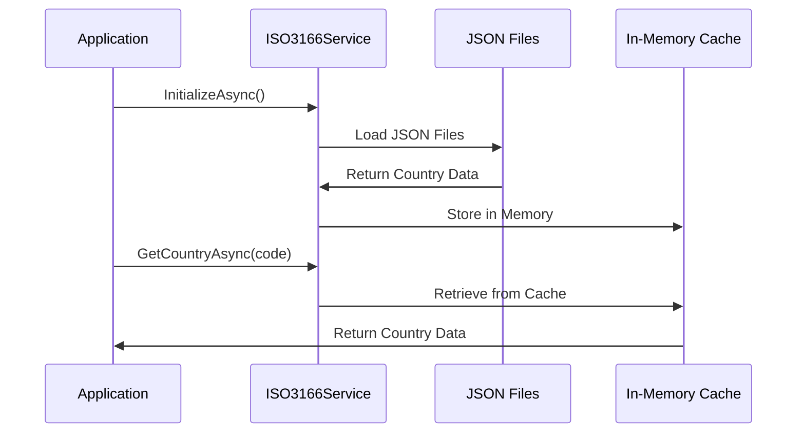
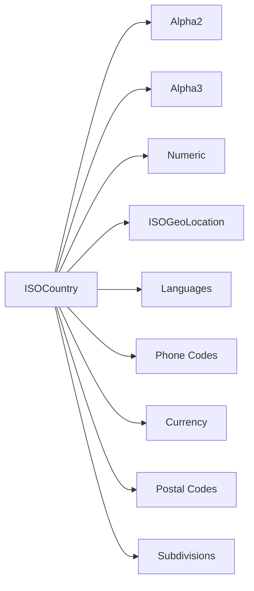

# Mamey.ISO.ISO3166

**Library**: `Mamey.ISO.ISO3166`  
**Location**: `Mamey/src/Mamey.ISO.ISO3166/`  
**Type**: Standards Library - ISO 3166 Country Codes  
**Version**: 2.0.*  
**Files**: 518 JSON files + 7 C# files  
**Namespace**: `Mamey.ISO3166`

## Overview

Mamey.ISO.ISO3166 provides comprehensive ISO 3166 country and region code standards implementation for the Mamey framework. It includes complete country data from 518 JSON files, covering country codes, subdivisions, geographic information, phone codes, languages, and more.

### Conceptual Foundation

**ISO 3166** is an international standard for country and region codes. Key concepts:

1. **ISO 3166-1**: Codes for countries (Alpha-2, Alpha-3, Numeric)
2. **ISO 3166-2**: Codes for country subdivisions (states, provinces, etc.)
3. **Alpha-2 Codes**: Two-letter country codes (e.g., "US", "GB", "FR")
4. **Alpha-3 Codes**: Three-letter country codes (e.g., "USA", "GBR", "FRA")
5. **Numeric Codes**: Three-digit numeric codes (e.g., "840", "826", "250")
6. **Subdivisions**: States, provinces, regions within countries

**Why Mamey.ISO.ISO3166?**

Provides:
- **Complete Country Data**: 518 JSON files with comprehensive country information
- **Multiple Code Formats**: Alpha-2, Alpha-3, and Numeric codes
- **Subdivision Support**: State and province codes (ISO 3166-2)
- **Geographic Data**: Geographic coordinates and location data
- **Phone Codes**: International phone codes and formatting
- **Language Support**: Official and spoken languages
- **Comprehensive Data**: Currency codes, postal codes, regions, and more

**Use Cases:**
- Country code validation
- Country data retrieval
- Geographic location services
- Phone number formatting
- Postal code validation
- Language and region detection
- Address validation

## Architecture

### ISO 3166 Service Architecture



### Data Loading Flow



### Country Data Structure



## Core Components

### IISO3166Service - ISO 3166 Service Interface

Interface for ISO 3166 operations:

```csharp
public interface IISO3166Service
{
    Task InitializeAsync();
    Task<ISOCountry?> GetCountryAsync(string countryCode);
    Task<ISOSubdivision?> GetSubDivisionAsync(string countryCode);
    Task<IEnumerable<CountryPhoneCode>> GetContriesAreaCodesAsync();
    Task<Dictionary<string, ISOCountry>> GetAllCountriesAsync();
    Task<Dictionary<string, ISOSubdivision>> GetAllSubdivisionsAsync();
    Task<TProperty?> GetCountryPropertyAsync<TProperty>(
        string countryCode,
        Expression<Func<ISOCountry, TProperty>> propertyExpression);
    Task<TProperty?> GetSubdivisionPropertyAsync<TProperty>(
        string subdivisionCode,
        Expression<Func<ISOSubdivision, TProperty>> propertyExpression);
    List<KeyValuePair<string, ISOCountry>>? Countries { get; }
    Task<IEnumerable<CountryPhoneCode>> GetCountriesAreaCodesAsync();
}
```

### ISOCountry - Country Data Model

Complete country data model:

```csharp
public sealed class ISOCountry
{
    public string Alpha2 { get; set; } // ISO 3166-1 alpha-2 (e.g., "US")
    public string Alpha3 { get; set; } // ISO 3166-1 alpha-3 (e.g., "USA")
    public string Number { get; set; } // ISO 3166-1 numeric (e.g., "840")
    public string ISOShortName { get; set; } // Short name
    public string ISOLongName { get; set; } // Long name
    public string Continent { get; set; }
    public string Region { get; set; }
    public string Subregion { get; set; }
    public string WorldRegion { get; set; }
    public ISOGeoLocation GeoLocation { get; set; }
    public string CurrencyCode { get; set; } // ISO 4217
    public string CountryCode { get; set; } // Phone country code
    public string InternationalPrefix { get; set; }
    public string NationalPrefix { get; set; }
    public IEnumerable<int> NationalNumberLengths { get; set; }
    public IEnumerable<int> NationalDestinationCodeLengths { get; set; }
    public IEnumerable<string> OfficialLanguages { get; set; }
    public IEnumerable<string> SpokenLanguages { get; set; }
    public bool PostalCode { get; set; }
    public string PostalCodeFormatRegex { get; set; }
    public string Nationality { get; set; }
    public string StartOfWeek { get; set; }
    public string InternationalOlympicCode { get; set; }
    public string Gec { get; set; } // U.S. GEC code
    public string UnLocode { get; set; }
    public IEnumerable<string> UnofficialNames { get; set; }
}
```

### ISOGeoLocation - Geographic Location Model

Geographic location data:

```csharp
public class ISOGeoLocation
{
    public double Latitude { get; set; }
    public double Longitude { get; set; }
    // Additional geographic properties
}
```

### ISOSubdivision - Subdivision Model

Country subdivision data (ISO 3166-2):

```csharp
public class ISOSubdivision
{
    public string Code { get; set; } // Subdivision code
    public string Name { get; set; }
    public string Type { get; set; } // State, Province, etc.
    // Additional subdivision properties
}
```

### CountryPhoneCode - Phone Code Model

Country phone code information:

```csharp
public class CountryPhoneCode
{
    public string CountryCode { get; set; }
    public string CountryName { get; set; }
    public string PhoneCode { get; set; }
    // Additional phone code properties
}
```

## Installation

### Prerequisites

1. **.NET 9.0**: Ensure .NET 9.0 SDK is installed
2. **Mamey.ISO.Abstractions**: ISO abstractions library
3. **JSON Files**: 518 country JSON files (included in package)

### NuGet Package

```bash
dotnet add package Mamey.ISO.ISO3166
```

### Dependencies

- **Mamey** - Core framework
- **Mamey.ISO.Abstractions** - ISO abstractions

## Quick Start

### Basic Setup

```csharp
using Mamey.ISO3166;

var builder = WebApplication.CreateBuilder(args);

// Add ISO 3166 service
builder.Services.AddISO3166();

var app = builder.Build();

// Initialize service (loads JSON data)
app.UseISO3166();

app.Run();
```

### Configuration

No additional configuration required. The service automatically loads country data from embedded JSON files.

## Usage Examples

### Example 1: Get Country by Code

```csharp
using Mamey.ISO3166;

public class CountryService
{
    private readonly IISO3166Service _iso3166Service;
    private readonly ILogger<CountryService> _logger;

    public CountryService(
        IISO3166Service iso3166Service,
        ILogger<CountryService> logger)
    {
        _iso3166Service = iso3166Service;
        _logger = logger;
    }

    public async Task<ISOCountry?> GetCountryAsync(string countryCode)
    {
        try
        {
            _logger.LogInformation("Retrieving country: {CountryCode}", countryCode);
            
            var country = await _iso3166Service.GetCountryAsync(countryCode);
            
            if (country == null)
            {
                _logger.LogWarning("Country not found: {CountryCode}", countryCode);
                return null;
            }

            _logger.LogInformation(
                "Retrieved country: {Name} ({Alpha2})",
                country.ISOShortName,
                country.Alpha2);

            return country;
        }
        catch (Exception ex)
        {
            _logger.LogError(ex, "Failed to retrieve country: {CountryCode}", countryCode);
            throw;
        }
    }
}

// Usage
var country = await countryService.GetCountryAsync("US");
// country.Alpha2 = "US"
// country.Alpha3 = "USA"
// country.Number = "840"
// country.ISOShortName = "United States"
```

### Example 2: Get All Countries

```csharp
public async Task<Dictionary<string, ISOCountry>> GetAllCountriesAsync()
{
    try
    {
        _logger.LogInformation("Retrieving all countries");

        var countries = await _iso3166Service.GetAllCountriesAsync();

        _logger.LogInformation("Retrieved {Count} countries", countries.Count);

        return countries;
    }
    catch (Exception ex)
    {
        _logger.LogError(ex, "Failed to retrieve all countries");
        throw;
    }
}

// Usage
var allCountries = await countryService.GetAllCountriesAsync();
foreach (var country in allCountries.Values)
{
    Console.WriteLine($"{country.Alpha2}: {country.ISOShortName}");
}
```

### Example 3: Get Country Property

```csharp
public async Task<string?> GetCountryCurrencyAsync(string countryCode)
{
    try
    {
        // Get specific property using expression
        var currency = await _iso3166Service.GetCountryPropertyAsync<string>(
            countryCode,
            c => c.CurrencyCode);

        return currency;
    }
    catch (Exception ex)
    {
        _logger.LogError(ex, "Failed to get currency for country: {CountryCode}", countryCode);
        throw;
    }
}

// Usage
var currency = await countryService.GetCountryCurrencyAsync("US");
// currency = "USD"
```

### Example 4: Get Country Subdivision

```csharp
public async Task<ISOSubdivision?> GetSubdivisionAsync(string subdivisionCode)
{
    try
    {
        _logger.LogInformation("Retrieving subdivision: {SubdivisionCode}", subdivisionCode);

        var subdivision = await _iso3166Service.GetSubDivisionAsync(subdivisionCode);

        if (subdivision == null)
        {
            _logger.LogWarning("Subdivision not found: {SubdivisionCode}", subdivisionCode);
            return null;
        }

        return subdivision;
    }
    catch (Exception ex)
    {
        _logger.LogError(ex, "Failed to retrieve subdivision: {SubdivisionCode}", subdivisionCode);
        throw;
    }
}

// Usage
var subdivision = await countryService.GetSubdivisionAsync("US-CA");
// Returns California subdivision data
```

### Example 5: Get Country Phone Codes

```csharp
public async Task<IEnumerable<CountryPhoneCode>> GetPhoneCodesAsync()
{
    try
    {
        _logger.LogInformation("Retrieving country phone codes");

        var phoneCodes = await _iso3166Service.GetCountriesAreaCodesAsync();

        _logger.LogInformation("Retrieved {Count} phone codes", phoneCodes.Count());

        return phoneCodes;
    }
    catch (Exception ex)
    {
        _logger.LogError(ex, "Failed to retrieve phone codes");
        throw;
    }
}

// Usage
var phoneCodes = await countryService.GetPhoneCodesAsync();
foreach (var phoneCode in phoneCodes)
{
    Console.WriteLine($"{phoneCode.CountryName}: +{phoneCode.PhoneCode}");
}
```

### Example 6: Validate Country Code

```csharp
public async Task<bool> ValidateCountryCodeAsync(string countryCode)
{
    try
    {
        var country = await _iso3166Service.GetCountryAsync(countryCode);
        return country != null;
    }
    catch (Exception ex)
    {
        _logger.LogError(ex, "Error validating country code: {CountryCode}", countryCode);
        return false;
    }
}

// Usage
var isValid = await countryService.ValidateCountryCodeAsync("US"); // true
var isInvalid = await countryService.ValidateCountryCodeAsync("XX"); // false
```

### Example 7: Search Countries

```csharp
public async Task<List<ISOCountry>> SearchCountriesAsync(string searchTerm)
{
    try
    {
        _logger.LogInformation("Searching countries: {SearchTerm}", searchTerm);

        var allCountries = await _iso3166Service.GetAllCountriesAsync();

        var results = allCountries.Values
            .Where(c =>
                c.ISOShortName.Contains(searchTerm, StringComparison.OrdinalIgnoreCase) ||
                c.ISOLongName.Contains(searchTerm, StringComparison.OrdinalIgnoreCase) ||
                c.Alpha2.Equals(searchTerm, StringComparison.OrdinalIgnoreCase) ||
                c.Alpha3.Equals(searchTerm, StringComparison.OrdinalIgnoreCase))
            .ToList();

        _logger.LogInformation("Found {Count} countries matching {SearchTerm}", results.Count, searchTerm);

        return results;
    }
    catch (Exception ex)
    {
        _logger.LogError(ex, "Failed to search countries: {SearchTerm}", searchTerm);
        throw;
    }
}

// Usage
var results = await countryService.SearchCountriesAsync("United");
// Returns all countries with "United" in name
```

### Example 8: Get Countries by Region

```csharp
public async Task<List<ISOCountry>> GetCountriesByRegionAsync(string region)
{
    try
    {
        _logger.LogInformation("Retrieving countries in region: {Region}", region);

        var allCountries = await _iso3166Service.GetAllCountriesAsync();

        var results = allCountries.Values
            .Where(c => c.Region.Equals(region, StringComparison.OrdinalIgnoreCase))
            .ToList();

        _logger.LogInformation("Found {Count} countries in region {Region}", results.Count, region);

        return results;
    }
    catch (Exception ex)
    {
        _logger.LogError(ex, "Failed to retrieve countries by region: {Region}", region);
        throw;
    }
}

// Usage
var europeanCountries = await countryService.GetCountriesByRegionAsync("Europe");
```

### Example 9: Get Geographic Location

```csharp
public async Task<ISOGeoLocation?> GetCountryLocationAsync(string countryCode)
{
    try
    {
        var country = await _iso3166Service.GetCountryAsync(countryCode);
        
        if (country == null)
        {
            return null;
        }

        return country.GeoLocation;
    }
    catch (Exception ex)
    {
        _logger.LogError(ex, "Failed to get location for country: {CountryCode}", countryCode);
        throw;
    }
}

// Usage
var location = await countryService.GetCountryLocationAsync("US");
// location.Latitude = 37.09024
// location.Longitude = -95.712891
```

### Example 10: Validate Postal Code Format

```csharp
public async Task<bool> ValidatePostalCodeAsync(string countryCode, string postalCode)
{
    try
    {
        var country = await _iso3166Service.GetCountryAsync(countryCode);
        
        if (country == null || !country.PostalCode)
        {
            return false;
        }

        if (string.IsNullOrEmpty(country.PostalCodeFormatRegex))
        {
            return true; // No format specified
        }

        var regex = new System.Text.RegularExpressions.Regex(country.PostalCodeFormatRegex);
        return regex.IsMatch(postalCode);
    }
    catch (Exception ex)
    {
        _logger.LogError(ex, "Error validating postal code: {CountryCode}, {PostalCode}", countryCode, postalCode);
        return false;
    }
}

// Usage
var isValid = await countryService.ValidatePostalCodeAsync("US", "12345"); // true
var isInvalid = await countryService.ValidatePostalCodeAsync("US", "1234"); // false
```

## Extension Methods

### AddISO3166

Registers ISO 3166 service with the service collection:

```csharp
public static IServiceCollection AddISO3166(this IServiceCollection services)
```

**Features:**
- Registers `IISO3166Service` as scoped service
- No additional configuration required

**Usage:**
```csharp
builder.Services.AddISO3166();
```

### UseISO3166

Initializes ISO 3166 service and loads country data:

```csharp
public static IApplicationBuilder UseISO3166(this IApplicationBuilder builder)
```

**Features:**
- Initializes service asynchronously
- Loads all JSON country data files
- Caches data in memory for fast access

**Usage:**
```csharp
var app = builder.Build();
app.UseISO3166(); // Loads country data
app.Run();
```

## Best Practices

### 1. Initialize Service Early

**✅ Good: Initialize service at application startup**
```csharp
var app = builder.Build();
app.UseISO3166(); // Load data before handling requests
app.Run();
```

### 2. Cache Country Data

**✅ Good: Service caches data automatically**
```csharp
// First call loads data, subsequent calls use cache
var country1 = await _iso3166Service.GetCountryAsync("US");
var country2 = await _iso3166Service.GetCountryAsync("US"); // Uses cache
```

### 3. Handle Null Returns

**✅ Good: Check for null when country not found**
```csharp
var country = await _iso3166Service.GetCountryAsync("XX");
if (country == null)
{
    // Handle invalid country code
    return NotFound();
}
```

### 4. Use Property Expressions for Type Safety

**✅ Good: Use expressions for type-safe property access**
```csharp
var currency = await _iso3166Service.GetCountryPropertyAsync<string>(
    "US",
    c => c.CurrencyCode);
```

### 5. Validate Input Before Querying

**✅ Good: Validate country codes before querying**
```csharp
if (string.IsNullOrWhiteSpace(countryCode) || countryCode.Length != 2)
{
    throw new ArgumentException("Invalid country code format");
}

var country = await _iso3166Service.GetCountryAsync(countryCode);
```

## Performance Considerations

1. **Initialization**: Service loads 518 JSON files on first initialization (one-time cost)
2. **Memory Usage**: All country data is cached in memory for fast access
3. **Query Performance**: O(1) lookup for country codes after initialization
4. **Async Operations**: All operations are async for non-blocking I/O

## Troubleshooting

### Common Issues

#### Service Not Initialized

**Problem**: Service not initialized, data not loaded.

**Solution**:
1. Ensure `UseISO3166()` is called before handling requests
2. Check service is registered with `AddISO3166()`
3. Verify initialization completes successfully

#### Country Not Found

**Problem**: `GetCountryAsync` returns null for valid country code.

**Solution**:
1. Verify country code format (must be 2-letter alpha-2 code)
2. Check country code is uppercase
3. Verify country exists in ISO 3166 standard
4. Check service initialization completed successfully

#### Performance Issues

**Problem**: Slow initialization or queries.

**Solution**:
1. Ensure service is initialized once at startup
2. Verify JSON files are embedded correctly
3. Check memory is sufficient for 518 country records
4. Consider lazy loading for specific use cases

## Related Libraries

- **Mamey.ISO.Abstractions**: ISO standards abstractions
- **Mamey.ISO.ISO4217**: Currency codes (uses country codes)
- **Mamey.ISO.ISO639**: Language codes

## Additional Resources

- [ISO 3166 Standard](https://www.iso.org/iso-3166-country-codes.html)
- [ISO 3166-1](https://en.wikipedia.org/wiki/ISO_3166-1) - Country codes
- [ISO 3166-2](https://en.wikipedia.org/wiki/ISO_3166-2) - Subdivision codes
- [Mamey Framework Documentation](../../documentation/)
- [Mamey.ISO.ISO3166 Memory Documentation](../../.skmemory/v1/memory/public/mid-term/libraries/standards/mamey-iso-3166.md)

## Tags

#iso-3166 #country-codes #standards #iso #geographic-data #phone-codes #mamey


