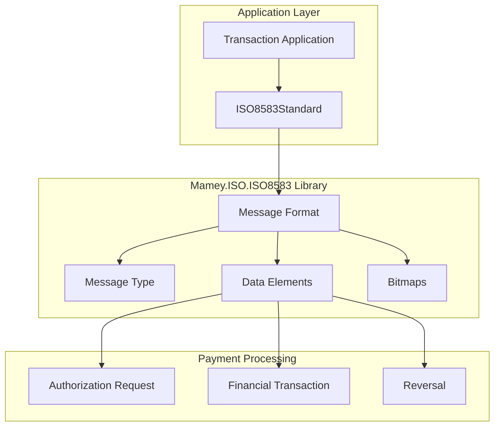
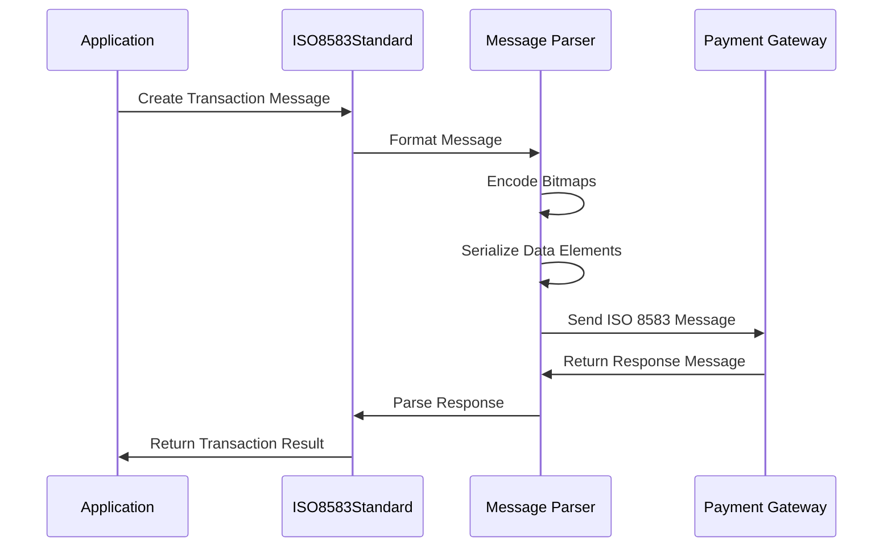

# Mamey.ISO.ISO8583

**Library**: `Mamey.ISO.ISO8583`  
**Location**: `Mamey/src/Mamey.ISO.ISO8583/`  
**Type**: Standards Library - ISO 8583 Financial Transaction Messages  
**Version**: 2.0.*  
**Files**: 1 C# file  
**Namespace**: `Mamey.ISO.ISO8583`

## Overview

Mamey.ISO.ISO8583 provides ISO 8583 financial transaction message standard implementation for the Mamey framework. ISO 8583 defines the format for financial transaction messages, such as those used for credit card transactions and ATM transactions, ensuring consistent and standardized processing.

### Conceptual Foundation

**ISO 8583** is an international standard for financial transaction messages. Key concepts:

1. **Message Format**: Standardized format for financial transaction messages
2. **Message Type**: Type of transaction (e.g., authorization, financial, reversal)
3. **Data Elements**: Standardized data fields in messages
4. **Bitmaps**: Efficient encoding of message fields
5. **Transaction Processing**: Consistent processing across systems

**Why Mamey.ISO.ISO8583?**

Provides:
- **Standardized Format**: ISO 8583 message format support
- **Transaction Messages**: Financial transaction message processing
- **Standards Compliance**: ISO 8583 standards compliance
- **Message Parsing**: ISO 8583 message parsing and generation
- **Interoperability**: Consistent message format across systems

**Use Cases:**
- Credit card transaction processing
- ATM transaction processing
- Point-of-sale (POS) transactions
- Financial message routing
- Payment gateway integration

## Architecture

### ISO 8583 Message Architecture



### Message Processing Flow



## Core Components

### ISO8583Standard - ISO 8583 Standard Implementation

Standard implementation for ISO 8583:

```csharp
public class ISO8583Standard : IInternationalStandard
{
    public ISO8583Standard()
    {
    }
}
```

**Features:**
- **Standards Compliance**: Implements ISO 8583 standard interface
- **Message Support**: Base for ISO 8583 message processing

## Installation

### Prerequisites

1. **.NET 9.0**: Ensure .NET 9.0 SDK is installed
2. **Mamey.ISO.Abstractions**: ISO abstractions library
3. **Mamey.Types**: Types library (for standard interfaces)

### NuGet Package

```bash
dotnet add package Mamey.ISO.ISO8583
```

### Dependencies

- **Mamey** - Core framework
- **Mamey.ISO.Abstractions** - ISO abstractions
- **Mamey.Types** - Types library

## Quick Start

### Basic Setup

```csharp
using Mamey.ISO.ISO8583;

var builder = WebApplication.CreateBuilder(args);

// Add ISO 8583 standard
builder.Services
    .AddMamey()
    .AddISO8583();

var app = builder.Build();
app.Run();
```

## Usage Examples

### Example 1: Create ISO 8583 Standard Instance

```csharp
using Mamey.ISO.ISO8583;

public class PaymentService
{
    private readonly ISO8583Standard _iso8583Standard;
    private readonly ILogger<PaymentService> _logger;

    public PaymentService(
        ISO8583Standard iso8583Standard,
        ILogger<PaymentService> logger)
    {
        _iso8583Standard = iso8583Standard;
        _logger = logger;
    }

    public void ProcessTransaction()
    {
        try
        {
            _logger.LogInformation("Processing ISO 8583 transaction");

            // Use ISO 8583 standard for transaction processing
            // Implementation details depend on specific requirements

            _logger.LogInformation("ISO 8583 transaction processed successfully");
        }
        catch (Exception ex)
        {
            _logger.LogError(ex, "Failed to process ISO 8583 transaction");
            throw;
        }
    }
}
```

## Message Types

### Common ISO 8583 Message Types

- **0100**: Authorization Request
- **0110**: Authorization Response
- **0200**: Financial Transaction Request
- **0210**: Financial Transaction Response
- **0400**: Reversal Request
- **0410**: Reversal Response
- **0800**: Network Management Request
- **0810**: Network Management Response

## Related Libraries

- **Mamey.ISO.Abstractions**: ISO standards abstractions
- **Mamey.ISO.ISO20022**: Alternative financial messaging standard
- **Mamey.Bank**: Banking operations
- **Mamey.MessageBrokers**: Message delivery

## Additional Resources

- [ISO 8583 Standard](https://en.wikipedia.org/wiki/ISO_8583)
- [Financial Transaction Messages](https://www.iso.org/standard/31628.html)
- [Mamey Framework Documentation](../../documentation/)
- [Mamey.ISO.ISO8583 Memory Documentation](../../.skmemory/v1/memory/public/mid-term/libraries/standards/mamey-iso-8583.md)

## Tags

#iso-8583 #financial-transaction #banking #payment-processing #standards #mamey

