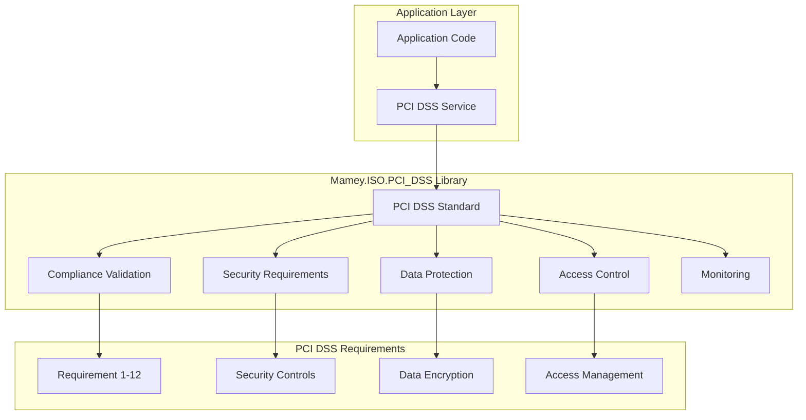

# Mamey.ISO.PCI_DSS

**Library**: `Mamey.ISO.PCI_DSS`  
**Location**: `Mamey/src/Mamey.ISO.PCI_DSS/`  
**Type**: Standards Library - PCI DSS Security  
**Version**: 2.0.*  
**Files**: 1 C# file  
**Namespace**: `Mamey.ISO.PCI_DSS`

## Overview

Mamey.ISO.PCI_DSS provides PCI DSS (Payment Card Industry Data Security Standard) compliance support for the Mamey framework. PCI DSS is a set of security standards designed to ensure that all companies that accept, process, store, or transmit credit card information maintain a secure environment.

### Conceptual Foundation

**PCI DSS** is a set of security standards for payment card industry. Key concepts:

1. **PCI DSS Compliance**: Compliance with PCI DSS requirements
2. **Security Requirements**: PCI DSS security requirement checks
3. **Payment Card Security**: Payment card data security
4. **Data Protection**: Protection of cardholder data
5. **Access Control**: Access control for cardholder data
6. **Monitoring**: Monitoring of cardholder data access

**Why Mamey.ISO.PCI_DSS?**

Provides:
- **PCI DSS Compliance**: PCI DSS compliance validation
- **Security Requirements**: PCI DSS security requirement checks
- **Payment Card Security**: Payment card data security
- **Standards Compliance**: PCI DSS standards compliance
- **Data Protection**: Tools for protecting cardholder data

**Use Cases:**
- Payment card processing
- PCI DSS compliance validation
- Cardholder data protection
- Security requirement checks
- Payment card security

## Architecture

### PCI DSS Compliance Architecture



## Core Components

### PCI_DSSStandard - PCI DSS Standard Implementation

Standard implementation for PCI DSS:

```csharp
public class PCI_DSSStandard : IInternationalStandard
{
    public PCI_DSSStandard()
    {
    }
}
```

**Features:**
- **Standards Compliance**: Implements PCI DSS standard interface
- **Compliance Support**: Base for PCI DSS compliance validation

## Installation

### Prerequisites

1. **.NET 9.0**: Ensure .NET 9.0 SDK is installed
2. **Mamey.ISO.Abstractions**: ISO abstractions library
3. **Mamey.Types**: Types library (for standard interfaces)

### NuGet Package

```bash
dotnet add package Mamey.ISO.PCI_DSS
```

### Dependencies

- **Mamey** - Core framework
- **Mamey.ISO.Abstractions** - ISO abstractions
- **Mamey.Types** - Types library

## Quick Start

### Basic Setup

```csharp
using Mamey.ISO.PCI_DSS;

var builder = WebApplication.CreateBuilder(args);

// Add PCI DSS standard
builder.Services
    .AddMamey()
    .AddPCI_DSS();

var app = builder.Build();
app.Run();
```

## Usage Examples

### Example 1: PCI DSS Compliance Validation (Expected API)

```csharp
using Mamey.ISO.PCI_DSS;

public class PCIComplianceService
{
    private readonly PCI_DSSStandard _pciDssStandard;
    private readonly ILogger<PCIComplianceService> _logger;

    public PCIComplianceService(
        PCI_DSSStandard pciDssStandard,
        ILogger<PCIComplianceService> logger)
    {
        _pciDssStandard = pciDssStandard;
        _logger = logger;
    }

    public ComplianceResult ValidateCompliance(PCIComplianceConfiguration configuration)
    {
        try
        {
            _logger.LogInformation("Validating PCI DSS compliance");

            // Use PCI DSS standard for compliance validation
            // Implementation details depend on specific requirements

            _logger.LogInformation("PCI DSS compliance validation completed");
            return new ComplianceResult { IsCompliant = true };
        }
        catch (Exception ex)
        {
            _logger.LogError(ex, "Failed to validate PCI DSS compliance");
            throw;
        }
    }
}

public class ComplianceResult
{
    public bool IsCompliant { get; set; }
    public List<string> NonCompliantItems { get; set; } = new();
}

public class PCIComplianceConfiguration
{
    public bool EncryptCardholderData { get; set; }
    public bool ImplementAccessControls { get; set; }
    public bool MonitorNetworkAccess { get; set; }
    // Additional PCI DSS requirements
}
```

### Example 2: Payment Card Data Protection

```csharp
public class PaymentCardSecurityService
{
    private readonly PCI_DSSStandard _pciDssStandard;
    private readonly ILogger<PaymentCardSecurityService> _logger;

    public PaymentCardSecurityService(
        PCI_DSSStandard pciDssStandard,
        ILogger<PaymentCardSecurityService> logger)
    {
        _pciDssStandard = pciDssStandard;
        _logger = logger;
    }

    public bool ValidateCardDataProtection(string cardData)
    {
        try
        {
            _logger.LogInformation("Validating card data protection");

            // Ensure card data is encrypted
            // Ensure no sensitive data is stored
            // Implement PCI DSS requirements

            _logger.LogInformation("Card data protection validated");
            return true;
        }
        catch (Exception ex)
        {
            _logger.LogError(ex, "Failed to validate card data protection");
            return false;
        }
    }
}
```

## PCI DSS Requirements

### 12 Core Requirements

1. **Install and maintain a firewall configuration**
2. **Do not use vendor-supplied defaults for system passwords**
3. **Protect stored cardholder data**
4. **Encrypt transmission of cardholder data across open, public networks**
5. **Use and regularly update anti-virus software**
6. **Develop and maintain secure systems and applications**
7. **Restrict access to cardholder data by business need to know**
8. **Assign a unique ID to each person with computer access**
9. **Restrict physical access to cardholder data**
10. **Track and monitor all access to network resources and cardholder data**
11. **Regularly test security systems and processes**
12. **Maintain a policy that addresses information security**

## Best Practices

### 1. Encrypt Cardholder Data

**✅ Good: Encrypt cardholder data at rest and in transit**
```csharp
// Encrypt cardholder data before storage
var encryptedData = EncryptCardData(cardData);
await StoreEncryptedData(encryptedData);
```

### 2. Implement Access Controls

**✅ Good: Restrict access to cardholder data**
```csharp
// Only allow authorized users to access cardholder data
if (!IsAuthorized(userId, cardholderData))
{
    throw new UnauthorizedAccessException();
}
```

### 3. Monitor Access

**✅ Good: Monitor all access to cardholder data**
```csharp
// Log all access to cardholder data
_logger.LogInformation("User {UserId} accessed cardholder data {CardId}", userId, cardId);
```

### 4. Regular Security Testing

**✅ Good: Regularly test security systems**
```csharp
// Perform regular security scans
var securityScan = await PerformSecurityScan();
if (!securityScan.IsCompliant)
{
    // Handle non-compliance
}
```

## Related Libraries

- **Mamey.ISO.Abstractions**: ISO standards abstractions
- **Mamey.Security**: Security utilities
- **Mamey.Stripe**: Payment processing
- **Mamey.Visa**: Visa payment processing

## Additional Resources

- [PCI DSS Standard](https://www.pcisecuritystandards.org/)
- [PCI DSS Requirements](https://www.pcisecuritystandards.org/document_library/)
- [Payment Card Industry](https://en.wikipedia.org/wiki/Payment_Card_Industry_Data_Security_Standard)
- [Mamey Framework Documentation](../../documentation/)
- [Mamey.ISO.PCI_DSS Memory Documentation](../../.skmemory/v1/memory/public/mid-term/libraries/standards/mamey-iso-pci-dss.md)

## Tags

#pci-dss #payment-card-security #compliance #security #standards #mamey

